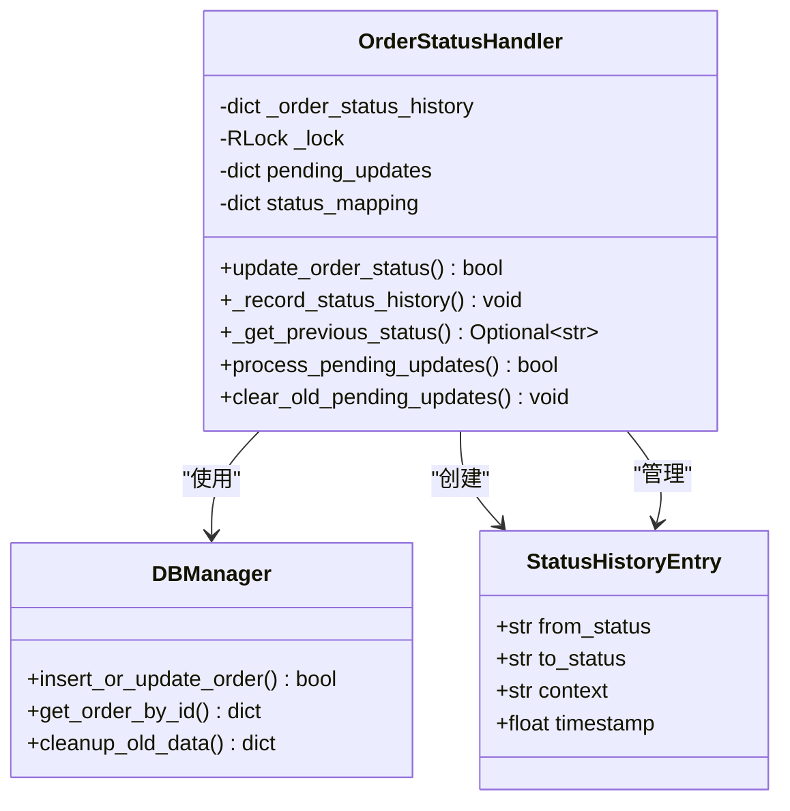
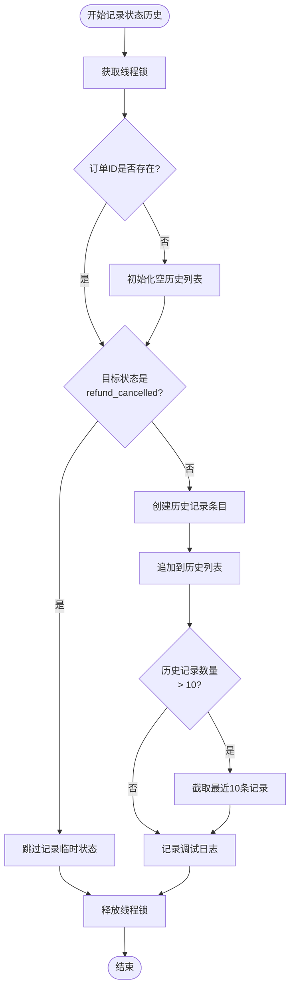
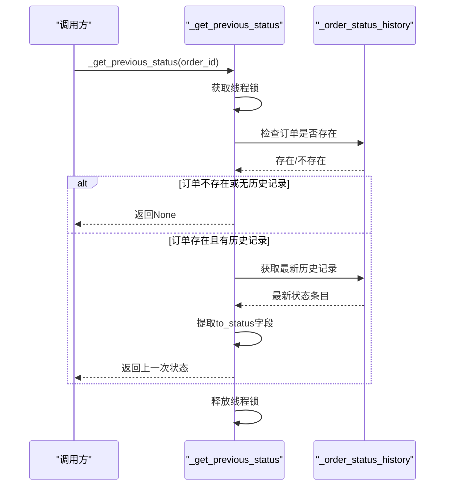
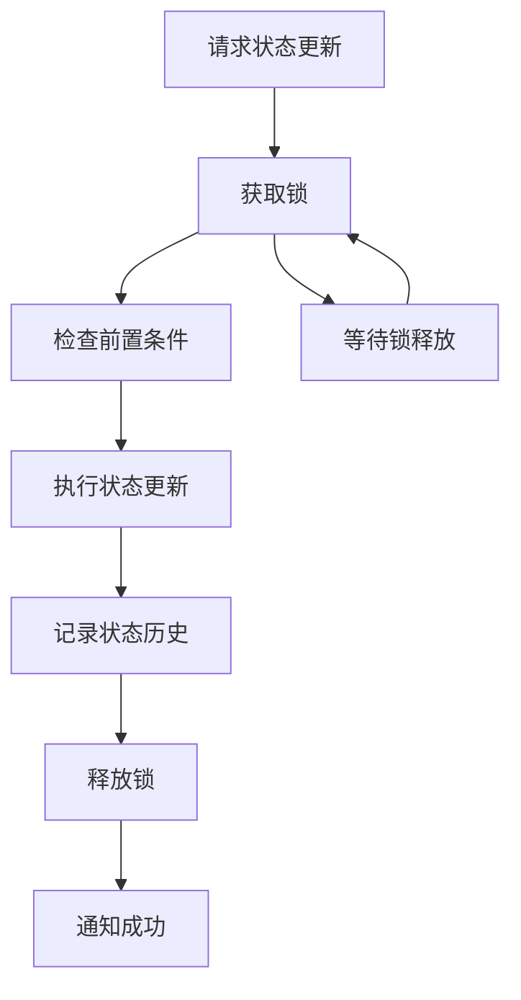
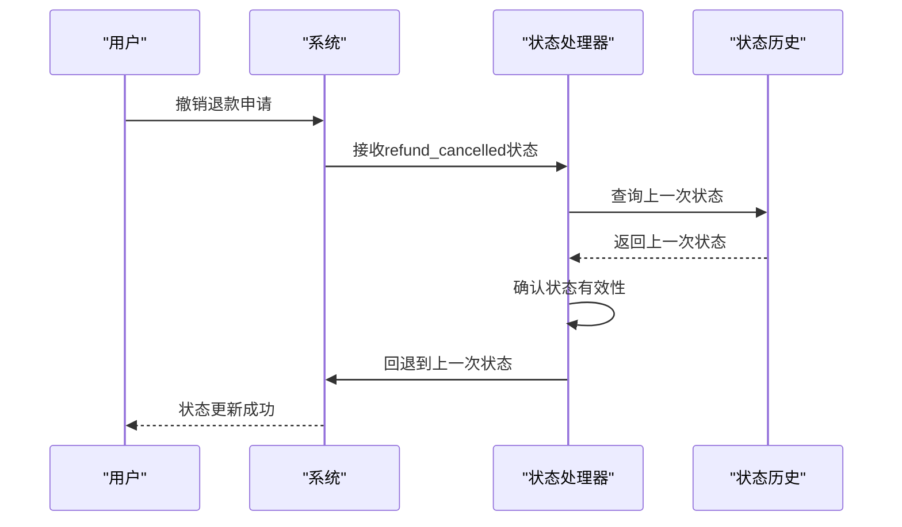
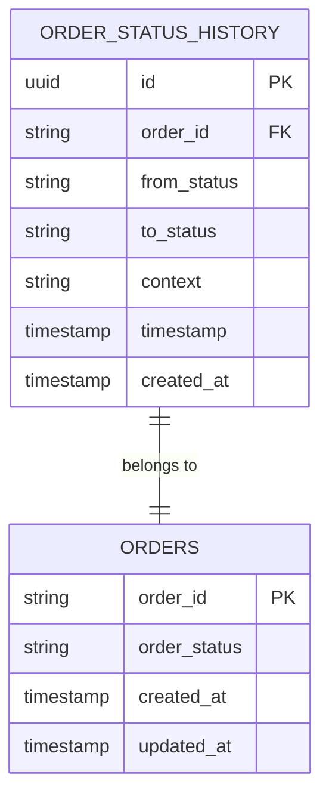

# 状态历史管理

<cite>
**本文档中引用的文件**
- [order_status_handler.py](file://order_status_handler.py)
- [db_manager.py](file://db_manager.py)
- [XianyuAutoAsync.py](file://XianyuAutoAsync.py)
- [reply_server.py](file://reply_server.py)
</cite>

## 目录
1. [概述](#概述)
2. [核心组件架构](#核心组件架构)
3. [_order_status_history字典详解](#_order_status_history字典详解)
4. [_record_status_history方法深度分析](#_record_status_history方法深度分析)
5. [_get_previous_status方法详解](#_get_previous_status方法详解)
6. [线程安全机制](#线程安全机制)
7. [历史记录保留策略](#历史记录保留策略)
8. [退款撤销场景处理](#退款撤销场景处理)
9. [状态历史访问与调试](#状态历史访问与调试)
10. [数据库持久化方案](#数据库持久化方案)
11. [最佳实践指导](#最佳实践指导)
12. [故障排除指南](#故障排除指南)

## 概述

订单状态历史管理系统是Xianyu Auto Reply项目中的核心组件，负责跟踪和管理订单状态的每一次变更。该系统通过`_order_status_history`字典记录状态变更历史，为退款撤销、状态回退和异常排查提供关键的数据支撑。

### 主要功能特性

- **实时状态追踪**：记录每个订单的状态变更过程
- **线程安全保障**：使用锁机制确保并发访问的安全性
- **智能历史管理**：限制历史记录数量，优化内存使用
- **退款撤销支持**：提供状态回退功能
- **灵活的访问接口**：支持状态历史的查询和分析

## 核心组件架构



**图表来源**
- [order_status_handler.py](file://order_status_handler.py#L26-L100)
- [db_manager.py](file://db_manager.py#L16-L50)

**章节来源**
- [order_status_handler.py](file://order_status_handler.py#L26-L100)

## _order_status_history字典详解

### 数据结构设计

`_order_status_history`是一个嵌套字典结构，用于存储订单状态变更的历史记录：

```python
{
    "order_id_1": [
        {
            "from_status": "processing",
            "to_status": "pending_ship",
            "context": "用户付款完成",
            "timestamp": 1640995200.123456
        },
        {
            "from_status": "pending_ship", 
            "to_status": "shipped",
            "context": "商家发货",
            "timestamp": 1640995800.654321
        }
    ],
    "order_id_2": [...]
}
```

### 字段说明

| 字段名 | 类型 | 描述 | 示例值 |
|--------|------|------|--------|
| `from_status` | str | 状态变更前的原始状态 | `'processing'` |
| `to_status` | str | 状态变更后的目标状态 | `'pending_ship'` |
| `context` | str | 状态变更的上下文描述 | `'用户付款完成'` |
| `timestamp` | float | Unix时间戳，精确到微秒 | `1640995200.123456` |

### 设计考量

1. **选择字典而非列表**：以订单ID为键，便于快速查找和更新
2. **有序历史记录**：列表顺序反映状态变更的时间序列
3. **排除临时状态**：不记录`refund_cancelled`等临时状态，避免历史混乱

**章节来源**
- [order_status_handler.py](file://order_status_handler.py#L67-L70)
- [order_status_handler.py](file://order_status_handler.py#L418-L447)

## _record_status_history方法深度分析

### 方法签名与参数

```python
def _record_status_history(self, order_id: str, from_status: str, to_status: str, context: str):
```

### 核心实现流程



**图表来源**
- [order_status_handler.py](file://order_status_handler.py#L418-L447)

### 关键实现细节

1. **条件记录过滤**：只有非临时状态才会被记录
2. **原子性操作**：整个记录过程在锁保护下完成
3. **自动截断**：超出10条时自动保留最新记录
4. **调试日志**：提供详细的记录信息用于调试

### 错误处理机制

- **异常安全**：即使发生异常，锁也会被正确释放
- **静默失败**：记录失败不会影响主业务流程
- **详细日志**：记录详细的调试信息

**章节来源**
- [order_status_handler.py](file://order_status_handler.py#L418-L447)

## _get_previous_status方法详解

### 方法功能

`_get_previous_status`方法用于获取订单的上一次有效状态，主要用于退款撤销场景下的状态回退。

### 实现逻辑



**图表来源**
- [order_status_handler.py](file://order_status_handler.py#L448-L464)

### 状态回退算法

1. **检查订单存在性**：确认订单在历史记录中
2. **验证历史记录**：确保有可用的历史状态
3. **提取目标状态**：获取最后一次状态变更的目标状态
4. **返回结果**：提供上一次的有效状态

### 应用场景

- **退款撤销**：当用户撤销退款申请时，回退到之前的稳定状态
- **异常恢复**：系统异常后的状态恢复
- **审计追踪**：状态变更的审计和追溯

**章节来源**
- [order_status_handler.py](file://order_status_handler.py#L448-L464)

## 线程安全机制

### 锁机制设计

系统采用`threading.RLock`实现线程安全：

```python
# 初始化时创建可重入锁
self._lock = threading.RLock()

# 在所有关键操作中使用锁保护
with self._lock:
    # 线程安全的操作
    pass
```

### 锁使用策略

1. **统一锁管理**：所有状态历史操作都使用同一个锁
2. **避免死锁**：遵循一致的锁获取顺序
3. **性能优化**：使用可重入锁减少锁竞争

### 并发控制流程



**图表来源**
- [order_status_handler.py](file://order_status_handler.py#L72-L74)

### 性能考量

- **锁粒度**：细粒度锁减少锁竞争
- **持有时间**：最小化锁持有时间
- **可重入性**：避免死锁情况

**章节来源**
- [order_status_handler.py](file://order_status_handler.py#L72-L74)

## 历史记录保留策略

### 数量限制机制

系统采用固定大小的滑动窗口策略：

```python
# 限制历史记录数量，只保留最近10条
if len(self._order_status_history[order_id]) > 10:
    self._order_status_history[order_id] = self._order_status_history[order_id][-10:]
```

### 设计原则

1. **实用性优先**：10条记录足以覆盖大多数业务场景
2. **内存效率**：避免无限增长导致内存泄漏
3. **历史完整性**：保留足够的历史信息用于分析
4. **性能平衡**：在存储效率和信息完整性之间找到平衡

### 替代方案对比

| 方案 | 优势 | 劣势 | 适用场景 |
|------|------|------|----------|
| 固定10条 | 内存占用可控 | 可能丢失早期信息 | 生产环境 |
| 按时间限制 | 保留时间范围内的记录 | 时间窗口外的信息丢失 | 需要时间范围分析 |
| 无限增长 | 保留完整历史 | 内存消耗大 | 开发调试环境 |

### 扩展建议

对于需要更长时间历史记录的场景，可以考虑：

- **数据库持久化**：将历史记录存储到数据库
- **分层存储**：区分短期活跃记录和长期归档记录
- **压缩算法**：对历史记录进行压缩存储

**章节来源**
- [order_status_handler.py](file://order_status_handler.py#L442-L445)

## 退款撤销场景处理

### 状态回退机制

系统提供了完整的退款撤销状态回退机制：



**图表来源**
- [order_status_handler.py](file://order_status_handler.py#L260-L269)

### 回退逻辑实现

```python
# 处理退款撤销的特殊逻辑
if new_status == 'refund_cancelled':
    # 从历史记录中获取上一次状态
    previous_status = self._get_previous_status(order_id)
    if previous_status:
        logger.info(f"🔄 退款撤销，回退到上一次状态: {previous_status}")
        new_status = previous_status
    else:
        logger.warning(f"⚠️ 退款撤销但无法获取上一次状态，保持当前状态: {current_status}")
        new_status = current_status
```

### 异常处理策略

1. **状态缺失处理**：当历史记录为空时保持当前状态
2. **状态验证**：确保回退状态的有效性
3. **日志记录**：详细记录回退过程和结果
4. **用户通知**：向用户反馈状态回退的结果

### 业务规则约束

- **不可逆状态**：已完成的订单不能回退到处理中
- **状态优先级**：根据业务规则确定合法的回退路径
- **事务一致性**：确保状态回退的原子性

**章节来源**
- [order_status_handler.py](file://order_status_handler.py#L260-L269)

## 状态历史访问与调试

### 访问接口设计

系统提供了多种方式访问状态历史：

```python
# 直接访问历史记录
def get_order_status_history(self, order_id: str) -> List[Dict]:
    """获取订单状态历史"""
    with self._lock:
        return self._order_status_history.get(order_id, [])

# 获取特定状态的历史记录
def get_status_change_events(self, order_id: str, target_status: str) -> List[Dict]:
    """获取特定状态变更事件"""
    with self._lock:
        history = self._order_status_history.get(order_id, [])
        return [event for event in history if event['to_status'] == target_status]
```

### 调试工具

1. **状态快照**：定期导出状态历史用于分析
2. **实时监控**：监控状态变更频率和模式
3. **异常检测**：识别异常的状态变更模式
4. **性能分析**：分析状态变更的性能特征

### 日志集成

```python
# 详细的调试日志
logger.debug(f"📝 记录订单状态历史: {order_id} {from_status} -> {to_status}")
logger.info(f"📊 订单 {order_id} 状态历史统计: {len(history)} 条记录")
```

### 分析指标

- **状态变更频率**：单位时间内状态变更次数
- **平均停留时间**：各状态的平均停留时长
- **状态转换概率**：不同状态间的转换概率
- **异常状态识别**：识别异常的状态变更模式

**章节来源**
- [order_status_handler.py](file://order_status_handler.py#L418-L447)

## 数据库持久化方案

### 持久化架构

虽然当前系统主要使用内存存储状态历史，但可以通过数据库实现持久化：



**图表来源**
- [db_manager.py](file://db_manager.py#L220-L234)

### 持久化实现方案

#### 方案一：独立历史表
```sql
CREATE TABLE order_status_history (
    id INTEGER PRIMARY KEY AUTOINCREMENT,
    order_id TEXT NOT NULL,
    from_status TEXT NOT NULL,
    to_status TEXT NOT NULL,
    context TEXT,
    timestamp DATETIME DEFAULT CURRENT_TIMESTAMP,
    FOREIGN KEY (order_id) REFERENCES orders(order_id)
);
```

#### 方案二：事件溯源
将状态变更作为事件存储，支持完整的状态重建。

#### 方案三：混合存储
- 内存：最近10条记录，用于实时状态管理
- 数据库：完整历史记录，用于审计和分析

### 数据迁移策略

```python
def migrate_memory_to_database(self):
    """将内存中的状态历史迁移到数据库"""
    with self._lock:
        for order_id, history in self._order_status_history.items():
            for entry in history:
                db_manager.insert_status_history({
                    'order_id': order_id,
                    'from_status': entry['from_status'],
                    'to_status': entry['to_status'],
                    'context': entry['context'],
                    'timestamp': entry['timestamp']
                })
```

### 清理策略

```python
def cleanup_old_history(days: int = 90):
    """清理过期的状态历史记录"""
    return db_manager.cleanup_old_data(table='order_status_history', days=days)
```

**章节来源**
- [db_manager.py](file://db_manager.py#L5071-L5102)
- [XianyuAutoAsync.py](file://XianyuAutoAsync.py#L5358-L5371)

## 最佳实践指导

### 开发者使用指南

#### 1. 状态历史查询

```python
# 获取订单的完整状态历史
history = status_handler.get_order_status_history(order_id)

# 获取特定时间段的状态变更
recent_history = [entry for entry in history 
                 if entry['timestamp'] > cutoff_timestamp]

# 统计状态变更频率
status_counts = {}
for entry in history:
    status_counts[entry['to_status']] = status_counts.get(entry['to_status'], 0) + 1
```

#### 2. 状态异常排查

```python
# 检查异常的状态变更模式
def detect_anomalies(history):
    anomalies = []
    for i in range(1, len(history)):
        prev_status = history[i-1]['to_status']
        curr_status = history[i]['to_status']
        
        # 检查非法状态转换
        if not is_valid_transition(prev_status, curr_status):
            anomalies.append({
                'index': i,
                'prev_status': prev_status,
                'curr_status': curr_status,
                'timestamp': history[i]['timestamp']
            })
    return anomalies
```

#### 3. 状态历史分析

```python
# 分析状态停留时间
def analyze_stay_times(history):
    stay_times = []
    for i in range(len(history) - 1):
        start_time = history[i]['timestamp']
        end_time = history[i+1]['timestamp']
        stay_times.append({
            'status': history[i]['to_status'],
            'duration': end_time - start_time
        })
    return stay_times
```

### 扩展开发建议

#### 自定义历史记录器

```python
class CustomStatusHistoryLogger:
    def __init__(self, handler: OrderStatusHandler):
        self.handler = handler
    
    def log_custom_event(self, order_id: str, status: str, custom_context: dict):
        """记录自定义状态事件"""
        context = {
            'type': 'custom',
            'details': custom_context,
            'original_context': '自定义事件'
        }
        self.handler._record_status_history(order_id, status, status, context)
```

#### 状态历史监控

```python
class StatusHistoryMonitor:
    def __init__(self, threshold: int = 5):
        self.threshold = threshold
    
    def check_frequent_changes(self, order_id: str):
        """检查订单状态变更过于频繁"""
        history = self.handler.get_order_status_history(order_id)
        if len(history) > self.threshold:
            return True
        return False
```

### 性能优化建议

1. **批量处理**：对于大量订单的状态更新，使用批量处理
2. **异步记录**：将状态历史记录操作异步化
3. **缓存策略**：对频繁访问的状态历史进行缓存
4. **索引优化**：在数据库中为订单ID和时间戳建立索引

**章节来源**
- [order_status_handler.py](file://order_status_handler.py#L418-L447)

## 故障排除指南

### 常见问题诊断

#### 1. 状态历史丢失

**症状**：状态历史记录不完整或丢失

**可能原因**：
- 系统重启导致内存数据丢失
- 异常情况下历史记录未正确保存
- 锁竞争导致部分记录丢失

**解决方案**：
```python
# 启用调试日志
logger.setLevel('DEBUG')

# 检查历史记录完整性
def check_history_integrity(order_id: str):
    history = status_handler.get_order_status_history(order_id)
    if not history:
        logger.warning(f"订单 {order_id} 无状态历史记录")
        return False
    
    # 检查时间戳连续性
    timestamps = [entry['timestamp'] for entry in history]
    if sorted(timestamps) != timestamps:
        logger.error(f"订单 {order_id} 状态历史时间戳不连续")
        return False
    
    return True
```

#### 2. 线程安全问题

**症状**：状态历史记录出现不一致或损坏

**诊断方法**：
```python
# 检查锁使用情况
def debug_lock_usage():
    # 监控锁的获取和释放
    original_acquire = threading.RLock.acquire
    original_release = threading.RLock.release
    
    def debug_acquire(lock, blocking=True):
        print(f"获取锁: {lock}")
        return original_acquire(lock, blocking)
    
    def debug_release(lock):
        print(f"释放锁: {lock}")
        return original_release(lock)
    
    threading.RLock.acquire = debug_acquire
    threading.RLock.release = debug_release
```

#### 3. 内存泄漏问题

**症状**：系统运行一段时间后内存使用持续增长

**诊断步骤**：
```python
# 监控历史记录内存使用
def monitor_memory_usage():
    import psutil
    import os
    
    process = psutil.Process(os.getpid())
    memory_mb = process.memory_info().rss / 1024 / 1024
    
    # 检查历史记录大小
    total_entries = sum(len(hist) for hist in 
                       status_handler._order_status_history.values())
    
    logger.info(f"内存使用: {memory_mb:.2f}MB, "
               f"历史记录条目: {total_entries}")
```

### 性能问题解决

#### 1. 状态更新缓慢

**优化措施**：
- 减少不必要的状态变更
- 使用批量更新机制
- 优化状态验证逻辑

#### 2. 内存使用过高

**解决方案**：
```python
# 定期清理过期的历史记录
def periodic_cleanup():
    while True:
        time.sleep(3600)  # 每小时清理一次
        with status_handler._lock:
            # 清理超过一定年龄的历史记录
            for order_id, history in list(status_handler._order_status_history.items()):
                if len(history) > 10:
                    status_handler._order_status_history[order_id] = history[-10:]
```

### 监控和告警

#### 关键指标监控

```python
class StatusHistoryMonitor:
    def __init__(self):
        self.alert_thresholds = {
            'max_history_entries': 1000,
            'max_memory_usage': 100 * 1024 * 1024,  # 100MB
            'min_history_entries': 1
        }
    
    def check_metrics(self):
        total_entries = sum(len(hist) for hist in 
                           status_handler._order_status_history.values())
        
        if total_entries > self.alert_thresholds['max_history_entries']:
            logger.warning(f"状态历史条目过多: {total_entries}")
        
        # 检查内存使用
        process = psutil.Process(os.getpid())
        memory_usage = process.memory_info().rss
        
        if memory_usage > self.alert_thresholds['max_memory_usage']:
            logger.warning(f"内存使用过高: {memory_usage / 1024 / 1024:.2f}MB")
```

### 恢复策略

#### 1. 系统重启后的恢复

```python
def recover_from_restart():
    """从系统重启中恢复状态历史"""
    # 重新加载持久化的状态历史
    persisted_history = db_manager.load_persisted_status_history()
    
    with status_handler._lock:
        # 合并现有的内存历史和持久化历史
        for order_id, history in persisted_history.items():
            if order_id not in status_handler._order_status_history:
                status_handler._order_status_history[order_id] = []
            
            # 过滤掉已经存在于内存中的记录
            memory_set = set((entry['from_status'], entry['to_status']) 
                           for entry in status_handler._order_status_history[order_id])
            
            for entry in history:
                if (entry['from_status'], entry['to_status']) not in memory_set:
                    status_handler._order_status_history[order_id].append(entry)
```

#### 2. 数据损坏修复

```python
def repair_corrupted_history(order_id: str):
    """修复损坏的状态历史"""
    with status_handler._lock:
        history = status_handler._order_status_history.get(order_id, [])
        
        # 修复时间戳
        for i in range(1, len(history)):
            if history[i]['timestamp'] <= history[i-1]['timestamp']:
                history[i]['timestamp'] = history[i-1]['timestamp'] + 0.001
        
        # 修复状态链
        for i in range(1, len(history)):
            if history[i]['from_status'] != history[i-1]['to_status']:
                history[i]['from_status'] = history[i-1]['to_status']
        
        status_handler._order_status_history[order_id] = history
```

**章节来源**
- [order_status_handler.py](file://order_status_handler.py#L418-L447)

## 结论

订单状态历史管理系统是Xianyu Auto Reply项目中的重要基础设施，通过`_order_status_history`字典实现了高效、安全的状态变更追踪。该系统具有以下核心优势：

1. **可靠性**：通过锁机制确保线程安全，避免数据竞争
2. **灵活性**：支持退款撤销等复杂业务场景
3. **可扩展性**：提供多种扩展点和持久化方案
4. **可观测性**：完善的日志记录和调试支持

对于开发者而言，理解这套状态历史管理机制不仅有助于更好地使用现有功能，也为系统的维护和扩展提供了坚实的基础。随着业务的发展，可以考虑引入数据库持久化、分布式存储等高级特性，进一步提升系统的可靠性和性能。