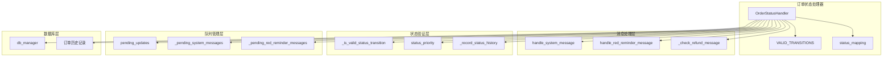
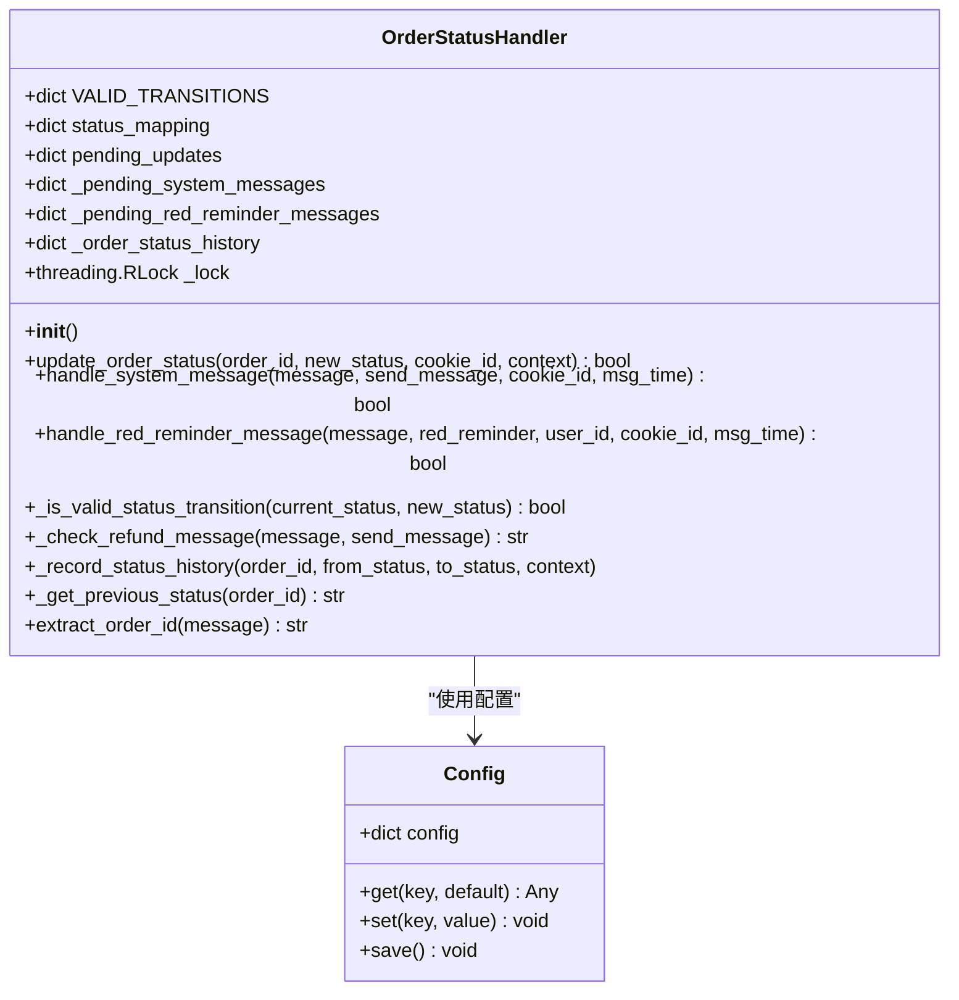
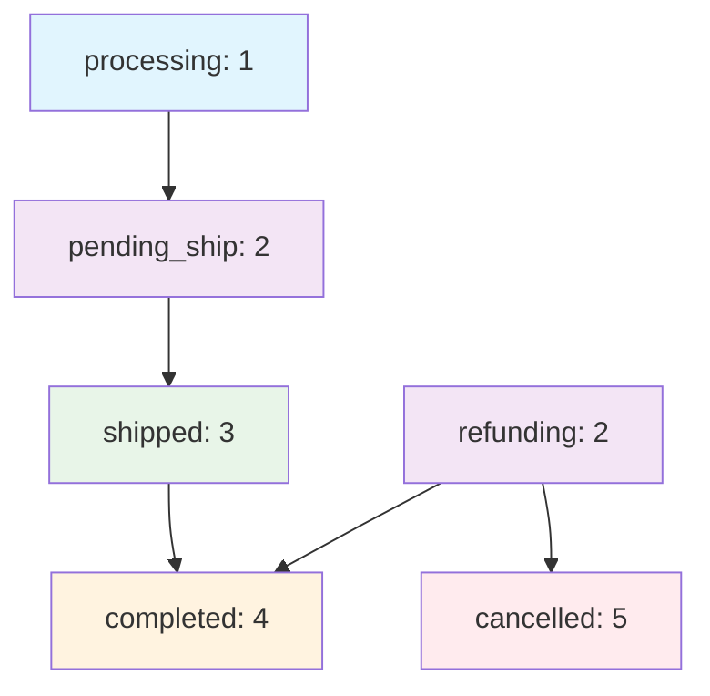
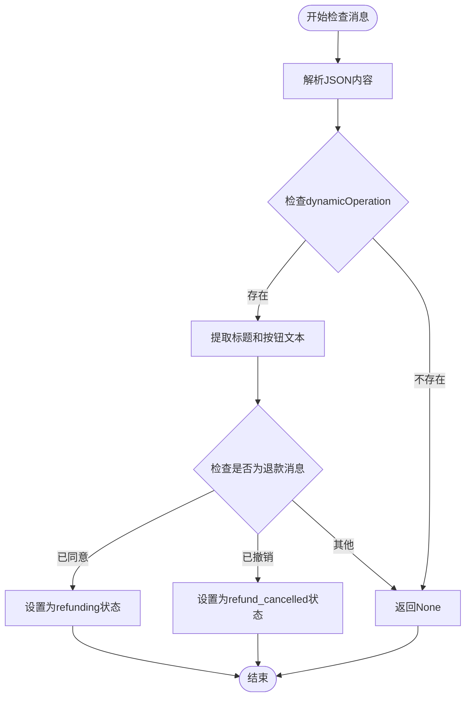
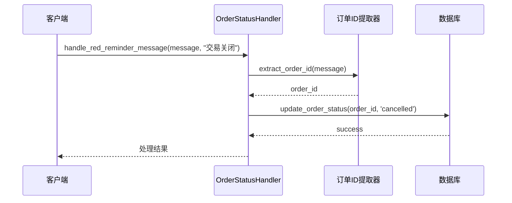
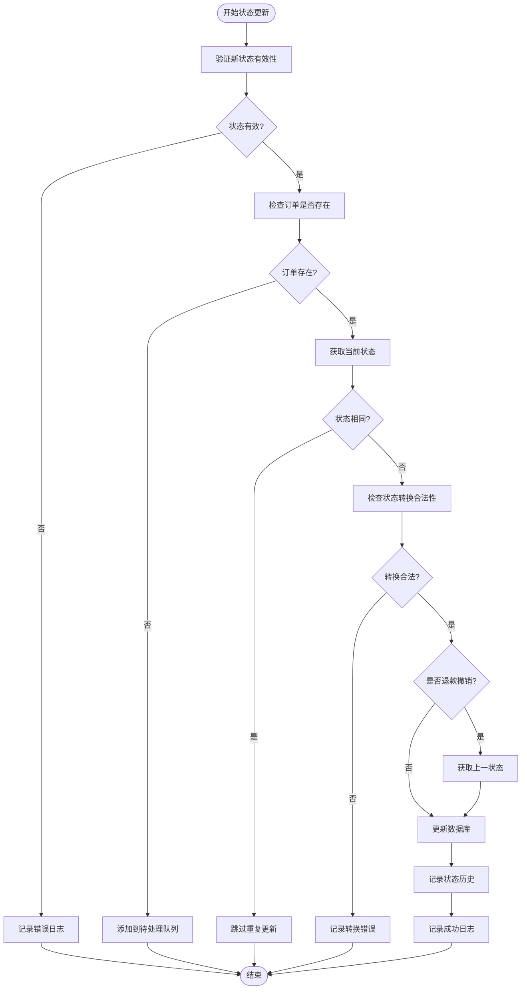
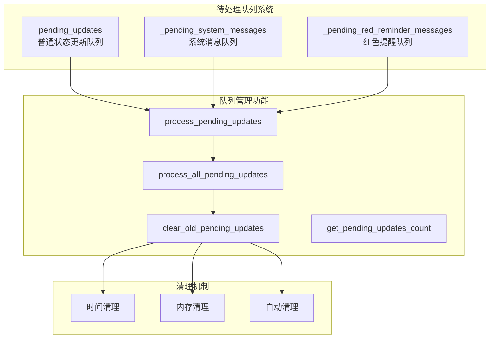
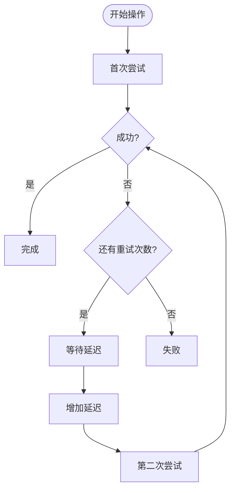

# 状态转换规则

<cite>
**本文档中引用的文件**
- [order_status_handler.py](file://order_status_handler.py)
- [config.py](file://config.py)
- [global_config.yml](file://global_config.yml)
</cite>

## 目录
1. [简介](#简介)
2. [系统架构概览](#系统架构概览)
3. [核心组件分析](#核心组件分析)
4. [状态转换规则详解](#状态转换规则详解)
5. [消息处理机制](#消息处理机制)
6. [状态验证与控制](#状态验证与控制)
7. [待处理队列管理](#待处理队列管理)
8. [配置与扩展指南](#配置与扩展指南)
9. [调试与故障排除](#调试与故障排除)
10. [最佳实践建议](#最佳实践建议)

## 简介

订单状态转换规则是闲鱼自动回复系统的核心业务逻辑组件，负责管理订单在不同生命周期阶段的状态流转。该系统通过严格的转换规则、智能的消息识别和完善的错误处理机制，确保订单状态变更的准确性和一致性。

系统采用状态机模式设计，定义了清晰的状态转换路径，防止非法状态回退，并提供了灵活的配置选项来适应不同的业务需求。

## 系统架构概览



**图表来源**
- [order_status_handler.py](file://order_status_handler.py#L26-L1074)

## 核心组件分析

### OrderStatusHandler 类

OrderStatusHandler 是订单状态管理的核心类，负责协调所有状态转换相关的操作。



**图表来源**
- [order_status_handler.py](file://order_status_handler.py#L26-L1074)
- [config.py](file://config.py#L5-L126)

**章节来源**
- [order_status_handler.py](file://order_status_handler.py#L26-L1074)

## 状态转换规则详解

### VALID_TRANSITIONS 常量定义

系统通过 VALID_TRANSITIONS 常量定义了所有合法的状态转换路径，确保订单状态只能按照预设的规则进行转换。

#### 状态定义与映射

| 状态代码 | 中文名称 | 描述 |
|---------|---------|------|
| processing | 处理中 | 订单初始状态，基本信息阶段 |
| pending_ship | 待发货 | 买家已付款，等待卖家发货 |
| shipped | 已发货 | 卖家已发货，等待买家确认收货 |
| completed | 已完成 | 买家确认收货，交易成功 |
| refunding | 退款中 | 买家发起退款申请，卖家已同意 |
| refund_cancelled | 退款撤销 | 买家主动撤销退款申请 |
| cancelled | 已关闭 | 订单终止状态 |

#### 转换规则说明

```mermaid
graph LR
processing --> pending_ship
processing --> shipped
processing --> completed
processing --> cancelled
pending_ship --> shipped
pending_ship --> completed
pending_ship --> cancelled
pending_ship --> refunding
shipped --> completed
shipped --> cancelled
shipped --> refunding
completed --> cancelled
completed --> refunding
refunding --> completed
refunding --> cancelled
refunding --> refund_cancelled
refund_cancelled --> [回退到上一状态]
cancelled --> [无转换]
```

**图表来源**
- [order_status_handler.py](file://order_status_handler.py#L36-L43)

#### 关键转换规则

1. **禁止回退规则**：已付款（pending_ship）、已发货（shipped）、已完成（completed）、退款中（refunding）的订单不能回退到处理中（processing）状态
2. **退款灵活性**：所有状态都可以转换到退款中（refunding）状态
3. **终态保护**：已关闭（cancelled）状态为最终状态，不可转换到其他状态
4. **临时状态处理**：退款撤销（refund_cancelled）为临时状态，会自动回退到上一状态

**章节来源**
- [order_status_handler.py](file://order_status_handler.py#L30-L44)

### 状态优先级机制

系统实现了状态优先级机制，防止状态倒退：



**图表来源**
- [order_status_handler.py](file://order_status_handler.py#L722-L729)

**章节来源**
- [order_status_handler.py](file://order_status_handler.py#L722-L739)

## 消息处理机制

### 系统消息状态映射

系统通过 message_status_mapping 将各种系统消息内容映射为对应的状态：

| 消息内容 | 映射状态 | 触发条件 |
|---------|---------|---------|
| [买家确认收货，交易成功] | completed | 买家确认收货 |
| [你已发货] | shipped | 卖家发货确认 |
| [你已发货，请等待买家确认收货] | shipped | 发货通知 |
| [我已付款，等待你发货] | pending_ship | 买家付款 |
| [买家已付款] | pending_ship | 付款完成通知 |
| [退款成功，钱款已原路退返] | cancelled | 退款完成 |
| [你关闭了订单，钱款已原路退返] | cancelled | 卖家关闭订单 |

### 退款消息识别

_check_refund_message 方法实现了智能的退款消息识别：



**图表来源**
- [order_status_handler.py](file://order_status_handler.py#L346-L417)

**章节来源**
- [order_status_handler.py](file://order_status_handler.py#L646-L660)
- [order_status_handler.py](file://order_status_handler.py#L346-L417)

### 红色提醒消息处理

handle_red_reminder_message 方法专门处理交易关闭的红色提醒消息：



**图表来源**
- [order_status_handler.py](file://order_status_handler.py#L760-L834)

**章节来源**
- [order_status_handler.py](file://order_status_handler.py#L760-L834)

## 状态验证与控制

### 状态转换验证流程

_update_order_status 方法实现了完整的状态转换验证：



**图表来源**
- [order_status_handler.py](file://order_status_handler.py#L192-L307)

### 严格验证配置

系统通过配置项控制状态验证的严格程度：

| 配置项 | 默认值 | 说明 |
|-------|--------|------|
| strict_validation | True | 是否启用严格的状态转换验证 |
| use_pending_queue | True | 是否使用待处理队列 |
| enable_status_logging | True | 是否启用详细的状态变更日志 |

**章节来源**
- [order_status_handler.py](file://order_status_handler.py#L192-L307)
- [order_status_handler.py](file://order_status_handler.py#L309-L330)

## 待处理队列管理

### 队列架构设计

系统维护多个待处理队列来处理延迟状态更新：



**图表来源**
- [order_status_handler.py](file://order_status_handler.py#L61-L70)

### 订单ID提取与匹配

extract_order_id 方法实现了智能的订单ID提取算法：

```mermaid
flowchart TD
Start([开始提取订单ID]) --> CheckMessage1{message['1']类型检查}
CheckMessage1 --> |字典| CheckMessage1_6{message['1']['6']类型检查}
CheckMessage1 --> |列表/字符串| TryPatternSearch[尝试模式匹配]
CheckMessage1 --> |其他| TryPatternSearch
CheckMessage1_6 --> |字典| ParseJSON[解析JSON内容]
CheckMessage1_6 --> |其他| TryPatternSearch
ParseJSON --> ExtractFromButton[从按钮URL提取]
ExtractFromMain[从主URL提取]
ExtractFromDynamic[从动态操作提取]
ExtractFromButton --> FoundID{找到订单ID?}
ExtractFromMain --> FoundID
ExtractFromDynamic --> FoundID
FoundID --> |是| ReturnID[返回订单ID]
FoundID --> |否| TryPatternSearch
TryPatternSearch --> PatternMatch[正则表达式匹配]
PatternMatch --> ReturnID
ReturnID --> End([结束])
```

**图表来源**
- [order_status_handler.py](file://order_status_handler.py#L81-L186)

**章节来源**
- [order_status_handler.py](file://order_status_handler.py#L61-L70)
- [order_status_handler.py](file://order_status_handler.py#L81-L186)

## 配置与扩展指南

### 自定义转换规则配置

开发者可以通过修改 VALID_TRANSITIONS 常量来自定义状态转换规则：

```python
# 示例：添加新的状态转换规则
custom_transitions = {
    'processing': ['pending_ship', 'shipped', 'completed', 'cancelled', 'custom_state'],
    'custom_state': ['pending_ship', 'completed', 'cancelled'],
    # ... 其他状态
}

# 合并自定义规则
OrderStatusHandler.VALID_TRANSITIONS.update(custom_transitions)
```

### 状态映射扩展

可以通过修改 status_mapping 字典来添加新的状态描述：

```python
# 示例：添加中文状态描述
custom_status_mapping = {
    'custom_state': '自定义状态',
    'another_state': '另一个状态'
}

# 合并自定义映射
OrderStatusHandler.status_mapping.update(custom_status_mapping)
```

### 配置优化建议

| 配置项 | 推荐值 | 适用场景 |
|-------|--------|---------|
| strict_validation | True | 生产环境，确保数据完整性 |
| use_pending_queue | True | 高并发场景，提高系统稳定性 |
| max_pending_age_hours | 24 | 平衡内存使用和功能完整性 |
| enable_status_logging | True | 调试和监控阶段 |

**章节来源**
- [order_status_handler.py](file://order_status_handler.py#L15-L23)

## 调试与故障排除

### 日志分析指南

系统提供了详细的日志记录功能，帮助开发者诊断状态转换问题：

#### 关键日志类型

1. **状态转换日志**：记录每次状态变更的详细信息
2. **验证错误日志**：记录状态转换验证失败的原因
3. **队列管理日志**：记录待处理队列的操作
4. **订单ID提取日志**：记录订单ID提取过程

#### 常见错误及解决方案

| 错误类型 | 症状 | 解决方案 |
|---------|------|---------|
| 状态转换被拒绝 | "状态转换被拒绝"警告 | 检查转换规则，确保符合业务逻辑 |
| 订单不存在 | "订单不存在于数据库中" | 启用待处理队列或检查订单同步 |
| 订单ID提取失败 | "未能从消息中提取到订单ID" | 检查消息格式或添加新的提取规则 |
| 数据库连接失败 | "获取订单信息失败" | 检查数据库连接配置和重试机制 |

### 重试机制

系统实现了多层重试机制：



**图表来源**
- [order_status_handler.py](file://order_status_handler.py#L218-L231)

### 调试工具

1. **状态历史记录**：通过 _order_status_history 查看状态变更历史
2. **队列监控**：使用 get_pending_updates_count 监控队列状态
3. **配置检查**：验证配置项的有效性

**章节来源**
- [order_status_handler.py](file://order_status_handler.py#L419-L464)
- [order_status_handler.py](file://order_status_handler.py#L488-L525)

## 最佳实践建议

### 状态转换设计原则

1. **单向性原则**：确保状态转换具有明确的方向性
2. **完整性原则**：覆盖所有可能的业务场景
3. **安全性原则**：防止非法状态回退
4. **可追溯性原则**：记录完整的状态变更历史

### 性能优化建议

1. **批量处理**：利用待处理队列进行批量状态更新
2. **缓存机制**：缓存频繁查询的状态信息
3. **异步处理**：使用异步操作减少阻塞
4. **资源管理**：及时清理过期的队列数据

### 监控与维护

1. **定期检查**：监控状态转换的成功率和错误率
2. **日志分析**：定期分析日志找出潜在问题
3. **配置优化**：根据实际使用情况调整配置参数
4. **版本控制**：对状态转换规则进行版本管理

### 边界情况处理

1. **网络异常**：实现完善的重试和降级机制
2. **数据不一致**：提供数据校验和修复功能
3. **并发冲突**：使用锁机制保证数据一致性
4. **消息丢失**：通过待处理队列确保消息不丢失

通过遵循这些最佳实践，开发者可以构建稳定可靠的订单状态管理系统，确保业务流程的顺畅运行。