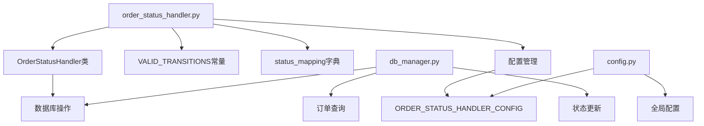
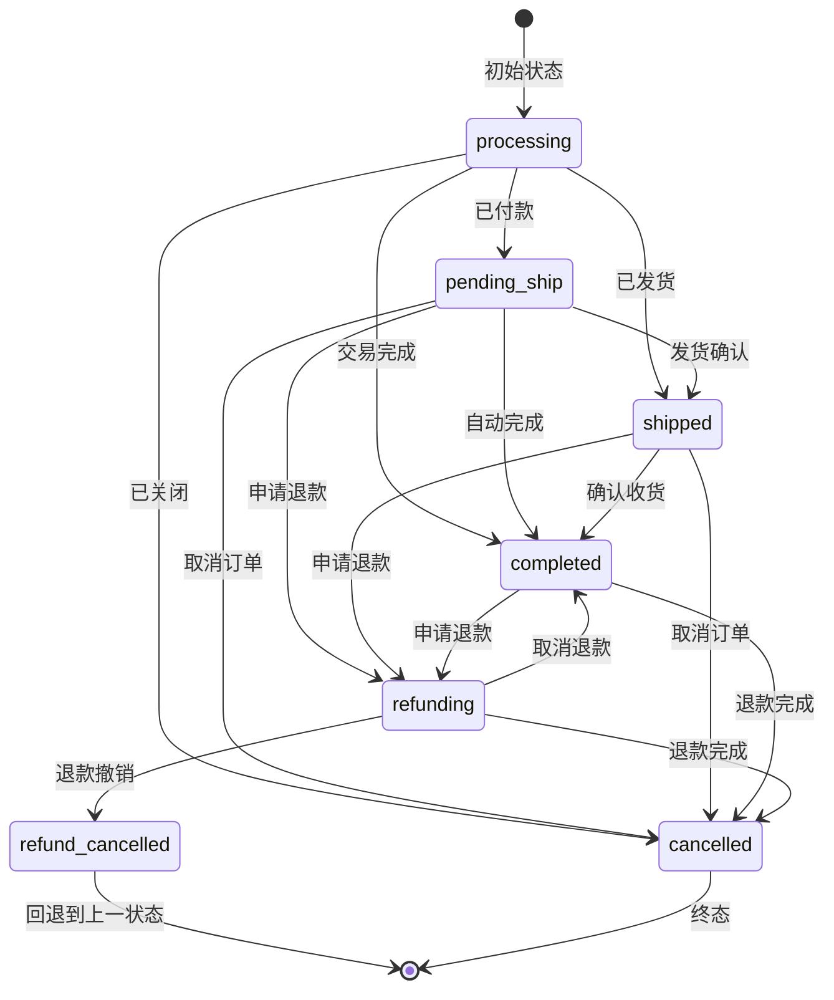
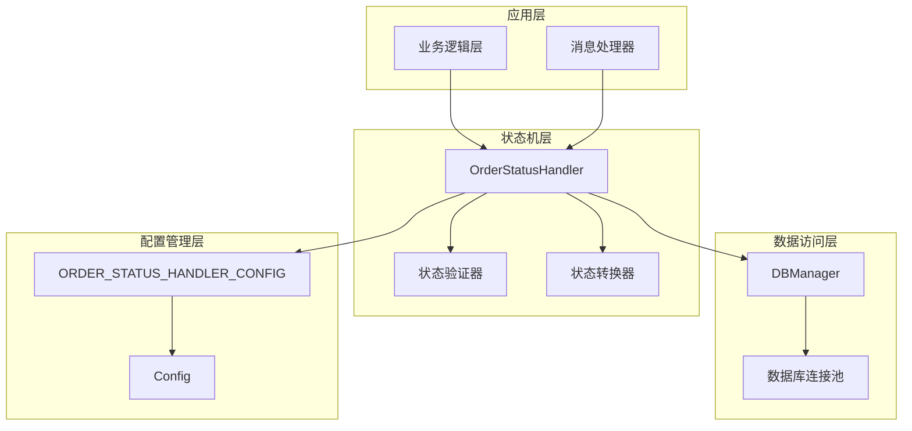
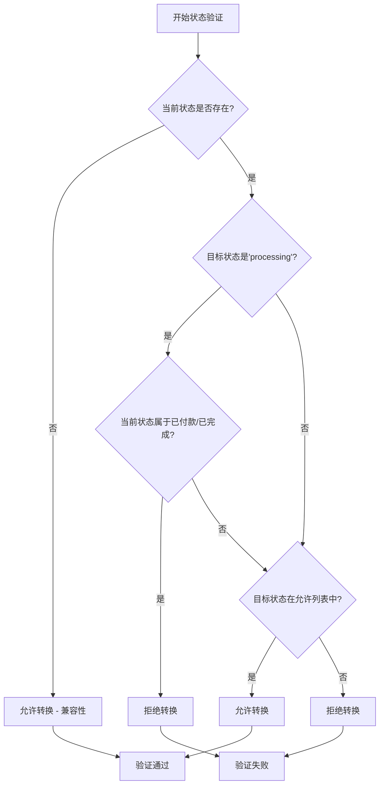
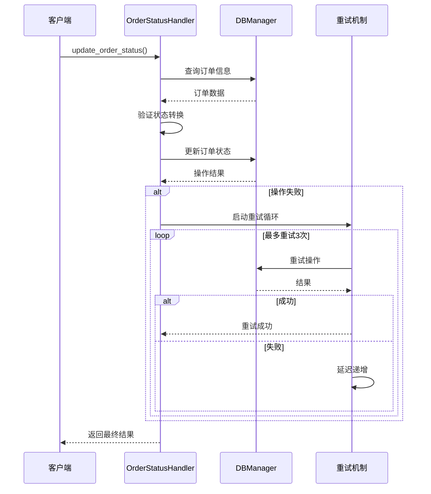
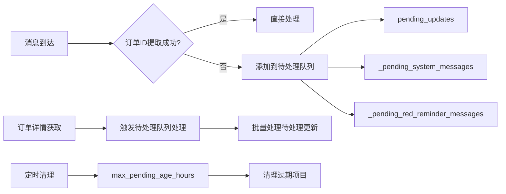
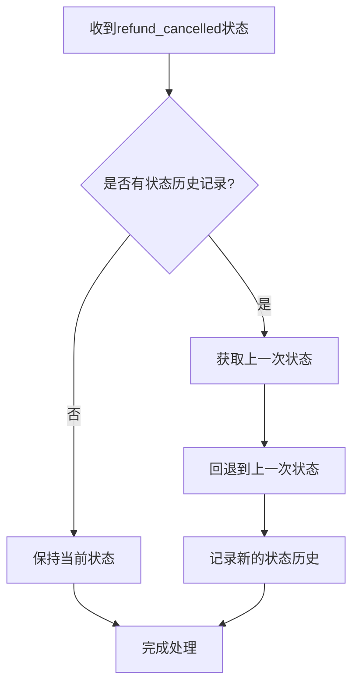
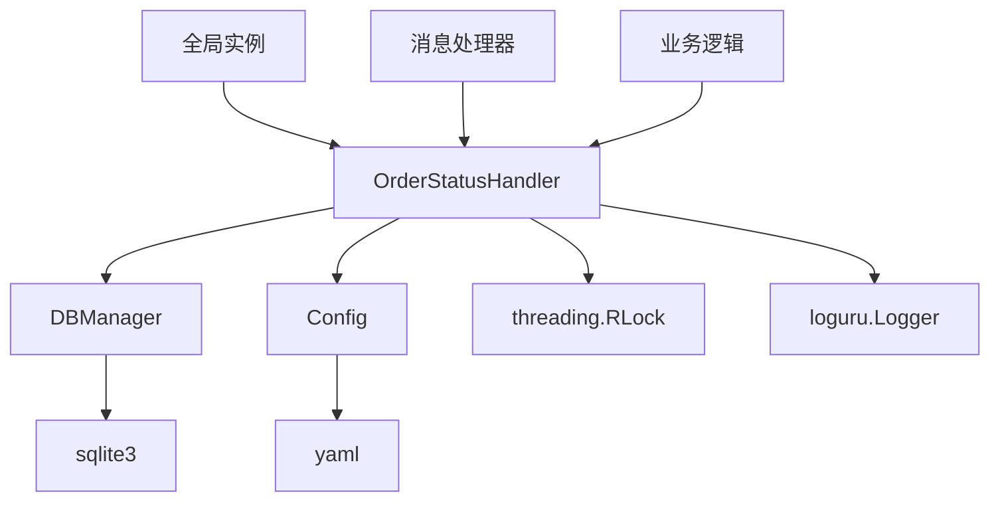

# 订单状态机

<cite>
**本文档中引用的文件**
- [order_status_handler.py](file://order_status_handler.py)
- [config.py](file://config.py)
- [db_manager.py](file://db_manager.py)
</cite>

## 目录
1. [简介](#简介)
2. [项目结构](#项目结构)
3. [核心组件](#核心组件)
4. [架构概览](#架构概览)
5. [详细组件分析](#详细组件分析)
6. [依赖关系分析](#依赖关系分析)
7. [性能考虑](#性能考虑)
8. [故障排除指南](#故障排除指南)
9. [结论](#结论)

## 简介

订单状态机是一个专门设计用于管理在线交易平台订单生命周期状态的核心组件。它实现了严格的订单状态转换规则，确保订单状态的完整性和一致性，防止非法状态回退，并提供完善的错误处理和重试机制。

该系统采用状态机模式，通过预定义的状态转换规则和验证机制，确保订单状态只能按照业务逻辑允许的方式进行转换。系统支持多种状态类型，包括处理中、待发货、已发货、已完成、退款中、退款撤销和已关闭等状态。

## 项目结构

订单状态机的核心文件结构如下：

**图表来源**
- [order_status_handler.py](file://order_status_handler.py#L1-L1074)
- [db_manager.py](file://db_manager.py#L1-L5103)
- [config.py](file://config.py#L1-L126)

**章节来源**
- [order_status_handler.py](file://order_status_handler.py#L1-L1074)

## 核心组件

### OrderStatusHandler类

OrderStatusHandler类是订单状态机的核心控制器，负责管理所有订单状态相关的操作。该类包含了完整的状态转换逻辑、验证机制和错误处理。

主要功能包括：
- 状态转换验证和控制
- 订单状态更新和持久化
- 待处理队列管理
- 状态历史记录追踪
- 并发安全的线程保护

### VALID_TRANSITIONS常量

VALID_TRANSITIONS是一个关键的常量字典，定义了所有合法的订单状态转换规则：

**图表来源**
- [order_status_handler.py](file://order_status_handler.py#L36-L43)

**章节来源**
- [order_status_handler.py](file://order_status_handler.py#L26-L44)

## 架构概览

订单状态机采用分层架构设计，确保各组件职责清晰、耦合度低：

**图表来源**
- [order_status_handler.py](file://order_status_handler.py#L26-L50)
- [db_manager.py](file://db_manager.py#L16-L52)
- [config.py](file://config.py#L5-L20)

## 详细组件分析

### 状态转换验证机制

#### _is_valid_status_transition方法

该方法实现了核心的状态转换验证逻辑：

**图表来源**
- [order_status_handler.py](file://order_status_handler.py#L309-L330)

#### 严格验证配置

系统提供了灵活的验证配置选项：

| 配置项 | 类型 | 默认值 | 说明 |
|--------|------|--------|------|
| use_pending_queue | bool | True | 是否使用待处理队列 |
| strict_validation | bool | True | 是否启用严格的状态转换验证 |
| log_level | str | 'info' | 日志级别(debug/info/warning/error) |
| max_pending_age_hours | int | 24 | 待处理更新的最大保留时间(小时) |
| enable_status_logging | bool | True | 是否启用详细的状态变更日志 |

**章节来源**
- [order_status_handler.py](file://order_status_handler.py#L16-L23)

### 数据库重试机制

#### _update_order_status中的重试逻辑

系统实现了智能的数据库重试机制，确保状态更新的原子性和可靠性：

**图表来源**
- [order_status_handler.py](file://order_status_handler.py#L216-L289)

**章节来源**
- [order_status_handler.py](file://order_status_handler.py#L216-L289)

### 状态映射系统

#### status_mapping字典

状态映射系统将内部状态码转换为用户友好的中文状态描述：

| 内部状态 | 中文状态 | 业务含义 |
|----------|----------|----------|
| processing | 处理中 | 初始状态/基本信息阶段 |
| pending_ship | 待发货 | 已付款，等待发货 |
| shipped | 已发货 | 发货确认后 |
| completed | 已完成 | 交易完成 |
| refunding | 退款中 | 退款中/退货中 |
| refund_cancelled | 退款撤销 | 退款撤销(临时状态) |
| cancelled | 已关闭 | 交易关闭 |

**章节来源**
- [order_status_handler.py](file://order_status_handler.py#L51-L58)

### 待处理队列管理

#### 待处理队列架构

系统提供了完善的待处理队列管理机制，处理订单ID提取失败或订单不存在的情况：

**图表来源**
- [order_status_handler.py](file://order_status_handler.py#L61-L66)
- [order_status_handler.py](file://order_status_handler.py#L896-L918)

**章节来源**
- [order_status_handler.py](file://order_status_handler.py#L61-L66)
- [order_status_handler.py](file://order_status_handler.py#L896-L918)

### 退款撤销特殊逻辑

#### 退款撤销状态处理

系统实现了复杂的退款撤销逻辑，能够自动回退到上一次的有效状态：

**图表来源**
- [order_status_handler.py](file://order_status_handler.py#L260-L269)

**章节来源**
- [order_status_handler.py](file://order_status_handler.py#L260-L269)

## 依赖关系分析

### 组件依赖图

**图表来源**
- [order_status_handler.py](file://order_status_handler.py#L1-L15)
- [db_manager.py](file://db_manager.py#L1-L15)
- [config.py](file://config.py#L1-L15)

### 外部依赖

系统的主要外部依赖包括：
- **sqlite3**: 用于数据库操作
- **loguru**: 用于日志记录
- **yaml**: 用于配置文件解析
- **threading**: 用于线程安全保护

**章节来源**
- [order_status_handler.py](file://order_status_handler.py#L6-L15)
- [db_manager.py](file://db_manager.py#L1-L15)
- [config.py](file://config.py#L1-L15)

## 性能考虑

### 并发安全设计

系统采用了多层次的并发安全保护机制：

1. **线程锁保护**: 使用`threading.RLock`保护关键操作
2. **死锁避免**: 实现了锁外处理逻辑
3. **原子性保证**: 数据库操作采用事务机制
4. **重试机制**: 智能的指数退避重试策略

### 性能优化策略

1. **状态历史限制**: 限制状态历史记录最多保留10条
2. **待处理队列清理**: 定期清理过期的待处理项目
3. **批量处理**: 支持批量处理待处理更新
4. **缓存机制**: 状态映射采用字典查找，时间复杂度O(1)

## 故障排除指南

### 常见问题及解决方案

#### 状态转换被拒绝

**问题**: 订单状态转换被拒绝，提示"状态转换不合理"

**原因分析**:
1. 启用了严格验证(`strict_validation=True`)
2. 当前状态不允许转换到目标状态
3. 存在非法的状态回退(如已完成订单回退到处理中)

**解决方案**:
1. 检查`ORDER_STATUS_HANDLER_CONFIG`配置
2. 查看状态转换规则表
3. 检查订单当前状态是否符合业务逻辑

#### 待处理队列堆积

**问题**: 待处理队列中的项目持续增长

**原因分析**:
1. 订单ID提取失败频繁发生
2. 订单详情获取速度慢
3. 待处理队列清理机制失效

**解决方案**:
1. 检查消息提取逻辑
2. 优化订单详情获取流程
3. 调整`max_pending_age_hours`配置

#### 数据库连接问题

**问题**: 数据库操作失败，重试次数耗尽

**原因分析**:
1. 数据库连接超时
2. 数据库锁定
3. 磁盘空间不足

**解决方案**:
1. 检查数据库连接配置
2. 优化数据库查询性能
3. 监控磁盘空间使用情况

**章节来源**
- [order_status_handler.py](file://order_status_handler.py#L252-L256)
- [order_status_handler.py](file://order_status_handler.py#L555-L631)

## 结论

订单状态机是一个设计精良、功能完备的订单状态管理组件。它通过以下特性确保了系统的可靠性和业务逻辑的正确性：

1. **严格的验证机制**: 通过预定义的状态转换规则防止非法状态回退
2. **完善的错误处理**: 实现了智能的重试机制和待处理队列管理
3. **灵活的配置选项**: 支持动态调整验证严格程度和队列行为
4. **高性能设计**: 采用多层缓存和批量处理优化性能
5. **并发安全保障**: 通过细粒度的锁机制确保线程安全

该系统为在线交易平台提供了坚实的订单状态管理基础，能够有效支持复杂的电商业务场景，确保订单状态的一致性和业务逻辑的正确执行。

对于开发者而言，建议：
- 熟悉状态转换规则，避免违反业务逻辑
- 合理配置验证严格程度
- 监控待处理队列状态
- 定期清理过期数据
- 在生产环境中启用详细的日志记录