# API服务架构文档

<cite>
**本文档中引用的文件**
- [reply_server.py](file://reply_server.py)
- [Start.py](file://Start.py)
- [api_captcha_remote.py](file://api_captcha_remote.py)
- [config.py](file://config.py)
- [simple_stats_server.py](file://simple_stats_server.py)
- [db_manager.py](file://db_manager.py)
- [cookie_manager.py](file://cookie_manager.py)
- [file_log_collector.py](file://file_log_collector.py)
- [utils/ws_utils.py](file://utils/ws_utils.py)
- [XianyuAutoAsync.py](file://XianyuAutoAsync.py)
</cite>

## 目录
1. [概述](#概述)
2. [项目架构总览](#项目架构总览)
3. [FastAPI应用初始化](#fastapi应用初始化)
4. [核心功能模块](#核心功能模块)
5. [API路由系统](#api路由系统)
6. [中间件实现](#中间件实现)
7. [WebSocket服务](#websocket服务)
8. [静态文件服务](#静态文件服务)
9. [健康检查机制](#健康检查机制)
10. [API请求处理流程](#api请求处理流程)
11. [性能优化策略](#性能优化策略)
12. [故障排除指南](#故障排除指南)

## 概述

本文档详细分析了一个基于FastAPI框架构建的闲鱼自动回复系统的API服务架构。该系统提供了完整的REST API接口和WebSocket服务，支持用户认证、账号管理、日志查询、刮刮乐远程控制等功能。系统采用异步编程模型，具备高并发处理能力和实时通信能力。

## 项目架构总览

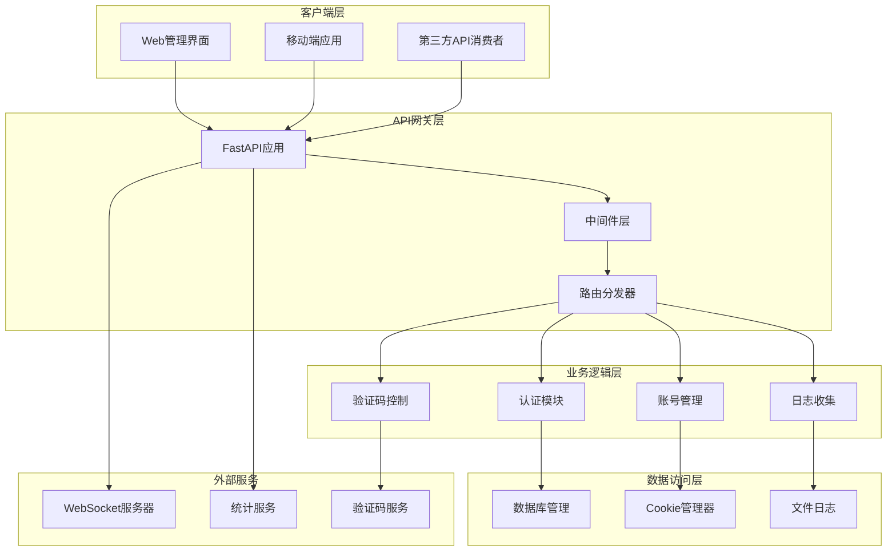
```mermaid
graph TB
subgraph "客户端层"
WebUI[Web管理界面]
MobileApp[移动端应用]
APIConsumer[第三方API消费者]
end
subgraph "API网关层"
FastAPI[FastAPI应用]
Middleware[中间件层]
Router[路由分发器]
end
subgraph "业务逻辑层"
Auth[认证模块]
AccountMgr[账号管理]
LogCollector[日志收集]
CaptchaCtrl[验证码控制]
end
subgraph "数据访问层"
DBManager[数据库管理]
CookieMgr[Cookie管理器]
FileLog[文件日志]
end
subgraph "外部服务"
WebSocketServer[WebSocket服务器]
Statistics[统计服务]
CaptchaService[验证码服务]
end
WebUI --> FastAPI
MobileApp --> FastAPI
APIConsumer --> FastAPI
FastAPI --> Middleware
Middleware --> Router
Router --> Auth
Router --> AccountMgr
Router --> LogCollector
Router --> CaptchaCtrl
Auth --> DBManager
AccountMgr --> CookieMgr
LogCollector --> FileLog
CaptchaCtrl --> CaptchaService
FastAPI --> WebSocketServer
FastAPI --> Statistics
```

**图表来源**
- [reply_server.py](file://reply_server.py#L308-L320)
- [Start.py](file://Start.py#L573-L576)

## FastAPI应用初始化

### 应用创建与配置

FastAPI应用在`reply_server.py`中通过以下方式创建：

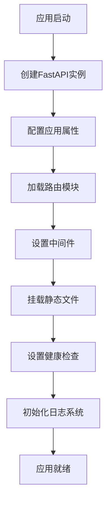
```mermaid
flowchart TD
Start[应用启动] --> CreateApp[创建FastAPI实例]
CreateApp --> ConfigureApp[配置应用属性]
ConfigureApp --> LoadRouter[加载路由模块]
LoadRouter --> SetupMiddleware[设置中间件]
SetupMiddleware --> MountStatic[挂载静态文件]
MountStatic --> HealthCheck[设置健康检查]
HealthCheck --> InitLogging[初始化日志系统]
InitLogging --> Ready[应用就绪]
```

**图表来源**
- [reply_server.py](file://reply_server.py#L308-L320)

### 应用配置参数

FastAPI应用的核心配置包括：

| 配置项 | 值 | 说明 |
|--------|-----|------|
| title | "Xianyu Auto Reply API" | 应用名称 |
| version | "1.0.0" | API版本号 |
| description | "闲鱼自动回复系统API" | 应用描述 |
| docs_url | "/docs" | Swagger文档路径 |
| redoc_url | "/redoc" | ReDoc文档路径 |

### 独立线程启动机制

_Start_api_server函数实现了在独立线程中启动Uvicorn服务器的机制：

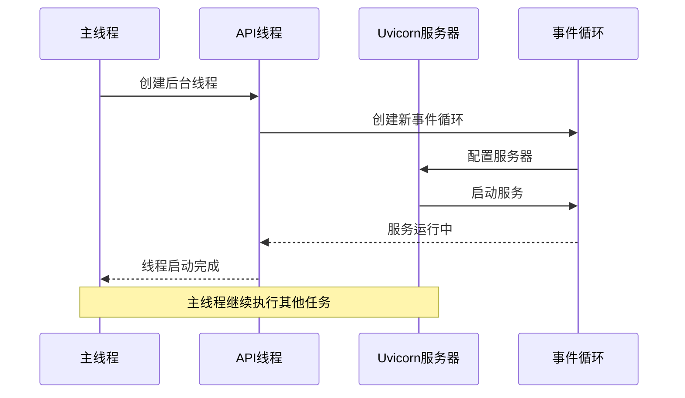
```mermaid
sequenceDiagram
participant Main as 主线程
participant Thread as API线程
participant Uvicorn as Uvicorn服务器
participant EventLoop as 事件循环
Main->>Thread : 创建后台线程
Thread->>EventLoop : 创建新事件循环
EventLoop->>Uvicorn : 配置服务器
Uvicorn->>EventLoop : 启动服务
EventLoop-->>Thread : 服务运行中
Thread-->>Main : 线程启动完成
Note over Main,Uvicorn : 主线程继续执行其他任务
```

**图表来源**
- [Start.py](file://Start.py#L446-L486)

**章节来源**
- [Start.py](file://Start.py#L446-L486)
- [reply_server.py](file://reply_server.py#L308-L320)

## 核心功能模块

### 用户认证系统

系统实现了基于JWT的用户认证机制：

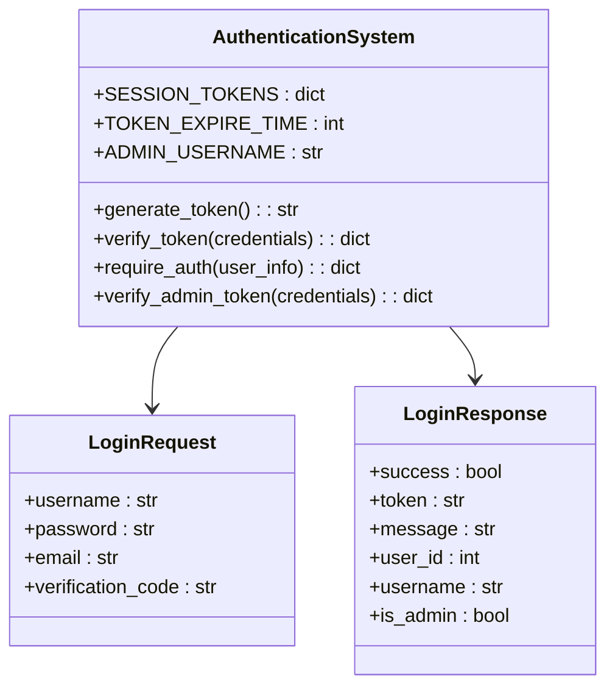
```mermaid
classDiagram
class AuthenticationSystem {
+SESSION_TOKENS : dict
+TOKEN_EXPIRE_TIME : int
+ADMIN_USERNAME : str
+generate_token() : str
+verify_token(credentials) : dict
+require_auth(user_info) : dict
+verify_admin_token(credentials) : dict
}
class LoginRequest {
+username : str
+password : str
+email : str
+verification_code : str
}
class LoginResponse {
+success : bool
+token : str
+message : str
+user_id : int
+username : str
+is_admin : bool
}
AuthenticationSystem --> LoginRequest
AuthenticationSystem --> LoginResponse
```

**图表来源**
- [reply_server.py](file://reply_server.py#L178-L229)

### 账号管理系统

账号管理系统负责维护多个闲鱼账号的状态和配置：

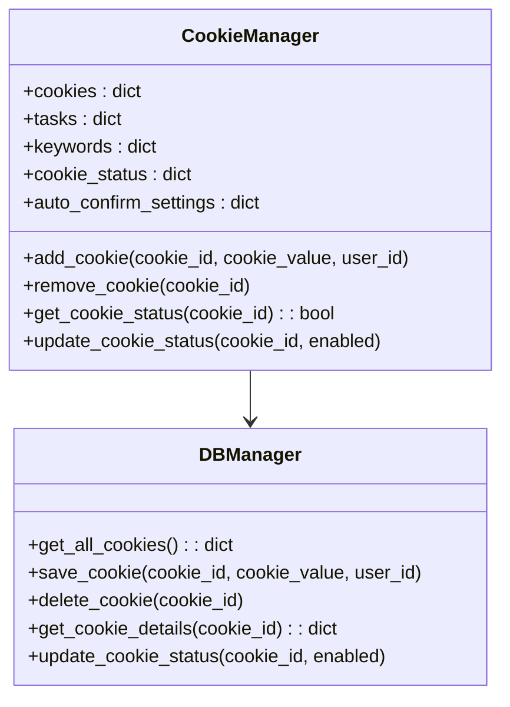
```mermaid
classDiagram
class CookieManager {
+cookies : dict
+tasks : dict
+keywords : dict
+cookie_status : dict
+auto_confirm_settings : dict
+add_cookie(cookie_id, cookie_value, user_id)
+remove_cookie(cookie_id)
+get_cookie_status(cookie_id) : bool
+update_cookie_status(cookie_id, enabled)
}
class DBManager {
+get_all_cookies() : dict
+save_cookie(cookie_id, cookie_value, user_id)
+delete_cookie(cookie_id)
+get_cookie_details(cookie_id) : dict
+update_cookie_status(cookie_id, enabled)
}
CookieManager --> DBManager
```

**图表来源**
- [cookie_manager.py](file://cookie_manager.py#L10-L200)
- [db_manager.py](file://db_manager.py#L16-L200)

### 日志收集系统

文件日志收集器提供实时日志监控功能：

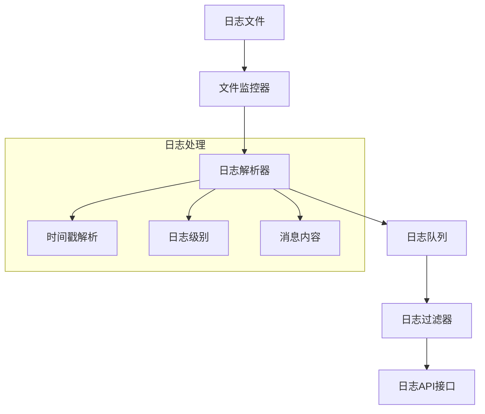
```mermaid
flowchart TD
LogFile[日志文件] --> Monitor[文件监控器]
Monitor --> Parser[日志解析器]
Parser --> Queue[日志队列]
Queue --> Filter[日志过滤器]
Filter --> API[日志API接口]
subgraph "日志处理"
Parser --> Timestamp[时间戳解析]
Parser --> Level[日志级别]
Parser --> Message[消息内容]
end
```

**图表来源**
- [file_log_collector.py](file://file_log_collector.py#L15-L200)

**章节来源**
- [reply_server.py](file://reply_server.py#L178-L229)
- [cookie_manager.py](file://cookie_manager.py#L10-L200)
- [file_log_collector.py](file://file_log_collector.py#L15-L200)

## API路由系统

### 路由注册机制

系统采用动态路由注册机制，支持条件加载：

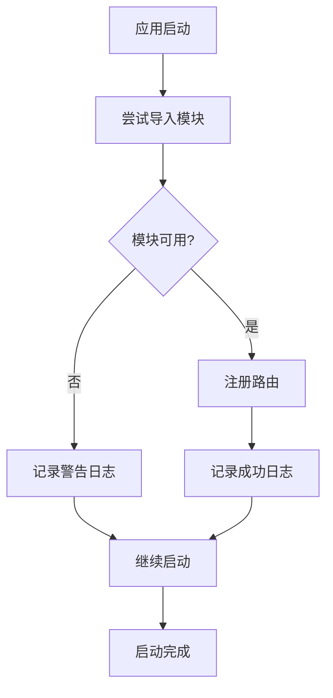
```mermaid
flowchart TD
Start[应用启动] --> TryImport[尝试导入模块]
TryImport --> CheckAvailable{模块可用?}
CheckAvailable --> |是| RegisterRouter[注册路由]
CheckAvailable --> |否| LogWarning[记录警告日志]
RegisterRouter --> LogSuccess[记录成功日志]
LogWarning --> Continue[继续启动]
LogSuccess --> Continue
Continue --> Complete[启动完成]
```

**图表来源**
- [reply_server.py](file://reply_server.py#L31-L38)

### 主要API端点分类

| 功能类别 | 端点路径 | 方法 | 功能描述 |
|----------|----------|------|----------|
| 用户认证 | `/login` | POST | 用户登录 |
| 用户认证 | `/logout` | POST | 用户登出 |
| 用户认证 | `/verify` | GET | 验证Token |
| 用户认证 | `/change-admin-password` | POST | 修改管理员密码 |
| 账号管理 | `/cookies` | GET/POST/PUT/DELETE | Cookie增删改查 |
| 账号管理 | `/accounts` | GET/POST/PUT/DELETE | 账号信息管理 |
| 关键字管理 | `/keywords` | GET/POST/PUT/DELETE | 关键字增删改查 |
| 日志查询 | `/logs` | GET | 日志查询 |
| 刮刮乐控制 | `/api/captcha/*` | WS/HTTP | 验证码远程控制 |

### 刮刮乐远程控制路由

刮刮乐远程控制功能通过条件加载实现：

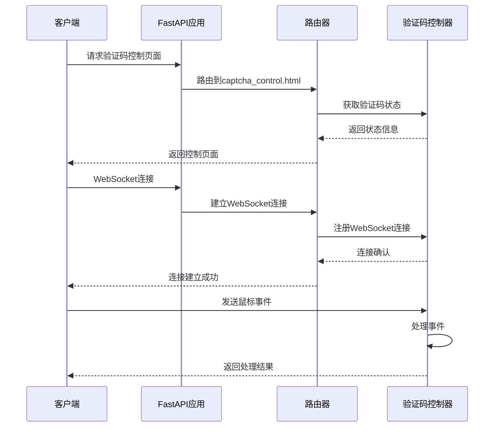
```mermaid
sequenceDiagram
participant Client as 客户端
participant API as FastAPI应用
participant Router as 路由器
participant Controller as 验证码控制器
Client->>API : 请求验证码控制页面
API->>Router : 路由到captcha_control.html
Router->>Controller : 获取验证码状态
Controller-->>Router : 返回状态信息
Router-->>Client : 返回控制页面
Client->>API : WebSocket连接
API->>Router : 建立WebSocket连接
Router->>Controller : 注册WebSocket连接
Controller-->>Router : 连接确认
Router-->>Client : 连接建立成功
Client->>Controller : 发送鼠标事件
Controller->>Controller : 处理事件
Controller-->>Client : 返回处理结果
```

**图表来源**
- [api_captcha_remote.py](file://api_captcha_remote.py#L38-L156)

**章节来源**
- [reply_server.py](file://reply_server.py#L31-L38)
- [api_captcha_remote.py](file://api_captcha_remote.py#L38-L156)

## 中间件实现

### 请求日志中间件

系统实现了统一的请求日志中间件，记录所有API请求的详细信息：

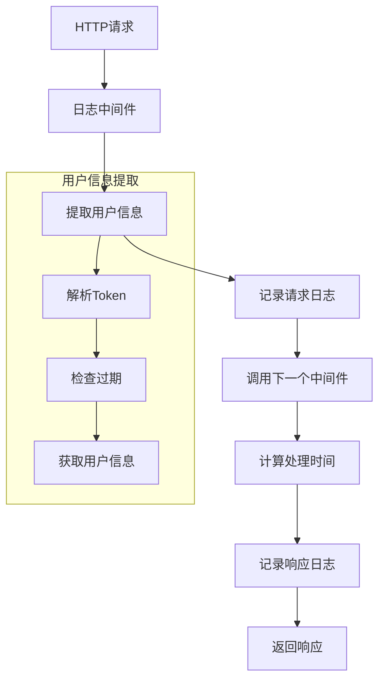
```mermaid
flowchart TD
Request[HTTP请求] --> Middleware[日志中间件]
Middleware --> ExtractUser[提取用户信息]
ExtractUser --> LogRequest[记录请求日志]
LogRequest --> CallNext[调用下一个中间件]
CallNext --> ProcessTime[计算处理时间]
ProcessTime --> LogResponse[记录响应日志]
LogResponse --> Response[返回响应]
subgraph "用户信息提取"
ExtractUser --> ParseToken[解析Token]
ParseToken --> CheckExpire[检查过期]
CheckExpire --> GetUser[获取用户信息]
end
```

**图表来源**
- [reply_server.py](file://reply_server.py#L331-L357)

### JWT认证流程

JWT认证通过依赖注入实现：

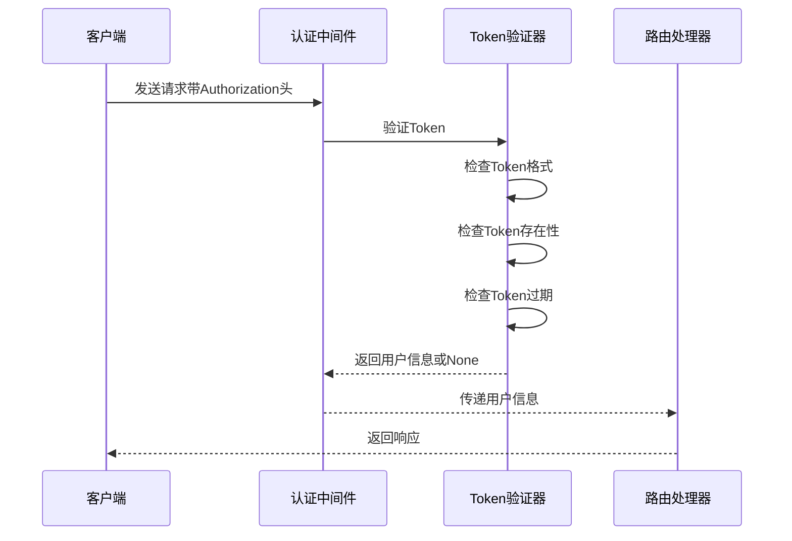
```mermaid
sequenceDiagram
participant Client as 客户端
participant Middleware as 认证中间件
participant TokenValidator as Token验证器
participant RouteHandler as 路由处理器
Client->>Middleware : 发送请求带Authorization头
Middleware->>TokenValidator : 验证Token
TokenValidator->>TokenValidator : 检查Token格式
TokenValidator->>TokenValidator : 检查Token存在性
TokenValidator->>TokenValidator : 检查Token过期
TokenValidator-->>Middleware : 返回用户信息或None
Middleware-->>RouteHandler : 传递用户信息
RouteHandler-->>Client : 返回响应
```

**图表来源**
- [reply_server.py](file://reply_server.py#L183-L219)

### 跨域处理

虽然代码中没有显式的CORS配置，但FastAPI默认支持跨域请求。系统通过以下方式处理跨域：

| 处理方式 | 实现位置 | 说明 |
|----------|----------|------|
| CORS预检 | FastAPI内置 | 处理OPTIONS请求 |
| 跨域头部 | 中间件自动添加 | Access-Control-Allow-Origin等 |
| 安全策略 | 前端控制 | 通过前端JavaScript控制 |

**章节来源**
- [reply_server.py](file://reply_server.py#L331-L357)
- [reply_server.py](file://reply_server.py#L183-L219)

## WebSocket服务

### WebSocket连接管理

系统实现了完整的WebSocket连接管理机制：

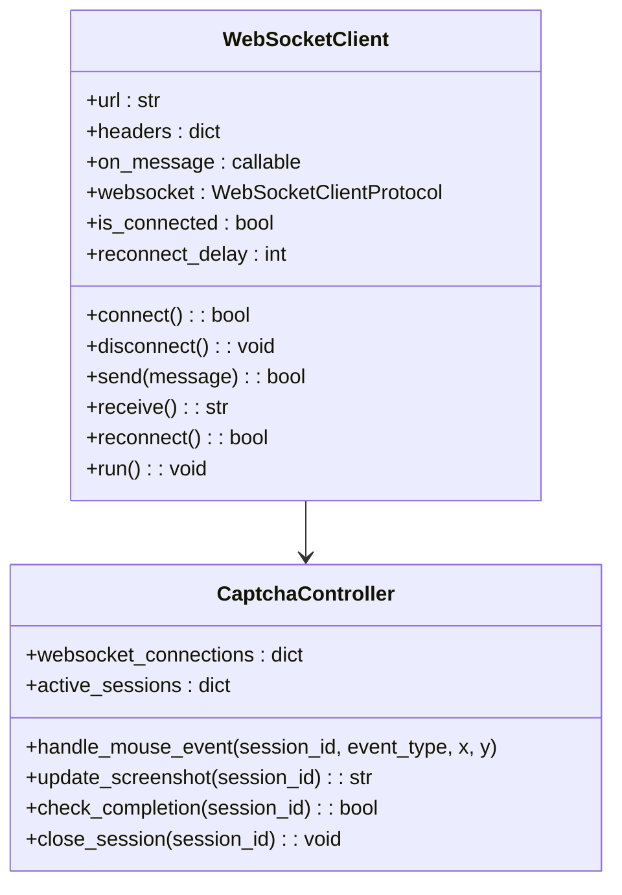
```mermaid
classDiagram
class WebSocketClient {
+url : str
+headers : dict
+on_message : callable
+websocket : WebSocketClientProtocol
+is_connected : bool
+reconnect_delay : int
+connect() : bool
+disconnect() : void
+send(message) : bool
+receive() : str
+reconnect() : bool
+run() : void
}
class CaptchaController {
+websocket_connections : dict
+active_sessions : dict
+handle_mouse_event(session_id, event_type, x, y)
+update_screenshot(session_id) : str
+check_completion(session_id) : bool
+close_session(session_id) : void
}
WebSocketClient --> CaptchaController
```

**图表来源**
- [utils/ws_utils.py](file://utils/ws_utils.py#L1-L89)
- [api_captcha_remote.py](file://api_captcha_remote.py#L38-L156)

### 实时通信协议

WebSocket通信采用JSON格式的消息协议：

| 消息类型 | 数据格式 | 用途 |
|----------|----------|------|
| mouse_event | `{type: "mouse_event", event_type: "down/move/up", x: int, y: int}` | 鼠标事件传输 |
| screenshot_update | `{type: "screenshot_update", screenshot: "data:image/jpeg;base64,...", viewport: {...}}` | 截图更新 |
| session_info | `{type: "session_info", screenshot: "...", captcha_info: {...}, viewport: {...}}` | 会话信息 |
| completed | `{type: "completed", message: "验证成功！"}` | 验证完成通知 |
| pong | `{type: "pong"}` | 心跳响应 |

### 连接状态管理

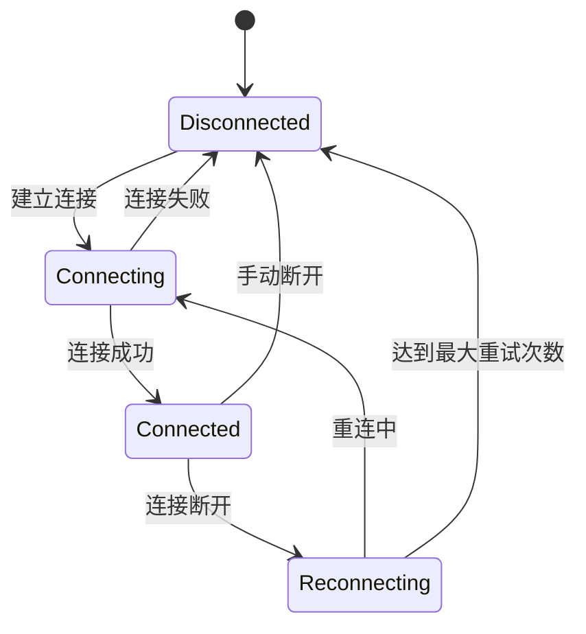
```mermaid
stateDiagram-v2
[*] --> Disconnected
Disconnected --> Connecting : 建立连接
Connecting --> Connected : 连接成功
Connecting --> Disconnected : 连接失败
Connected --> Reconnecting : 连接断开
Reconnecting --> Connecting : 重连中
Reconnecting --> Disconnected : 达到最大重试次数
Connected --> Disconnected : 手动断开
```

**图表来源**
- [utils/ws_utils.py](file://utils/ws_utils.py#L73-L89)

**章节来源**
- [utils/ws_utils.py](file://utils/ws_utils.py#L1-L89)
- [api_captcha_remote.py](file://api_captcha_remote.py#L38-L156)

## 静态文件服务

### 静态文件配置

系统通过FastAPI的StaticFiles组件提供静态文件服务：

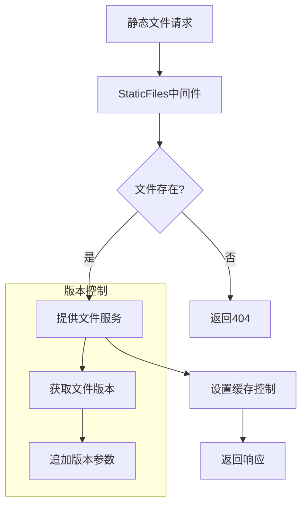
```mermaid
flowchart TD
Request[静态文件请求] --> StaticFiles[StaticFiles中间件]
StaticFiles --> CheckExists{文件存在?}
CheckExists --> |是| ServeFile[提供文件服务]
CheckExists --> |否| NotFound[返回404]
ServeFile --> CacheControl[设置缓存控制]
CacheControl --> Response[返回响应]
subgraph "版本控制"
ServeFile --> GetVersion[获取文件版本]
GetVersion --> AppendVersion[追加版本参数]
end
```

**图表来源**
- [reply_server.py](file://reply_server.py#L360-L366)

### 前端资源管理

静态文件服务支持多种前端资源类型：

| 资源类型 | 目录位置 | 版本控制 | 缓存策略 |
|----------|----------|----------|----------|
| HTML页面 | `/static/index.html` | 文件修改时间 | 无缓存 |
| CSS样式 | `/static/css/*.css` | 版本号参数 | 长期缓存 |
| JavaScript | `/static/js/*.js` | 版本号参数 | 长期缓存 |
| 图片资源 | `/static/images/*` | 版本号参数 | 长期缓存 |
| 字体文件 | `/static/fonts/*` | 版本号参数 | 长期缓存 |

### 动态版本控制

系统实现了智能的版本控制系统，避免浏览器缓存问题：

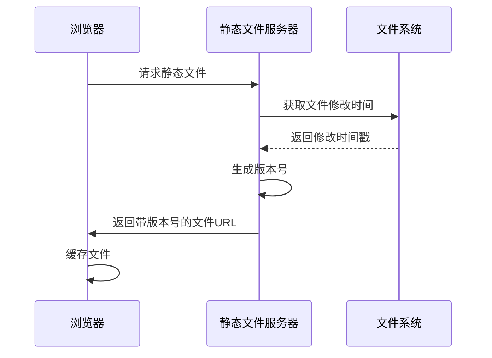
```mermaid
sequenceDiagram
participant Browser as 浏览器
participant Server as 静态文件服务器
participant FileSystem as 文件系统
Browser->>Server : 请求静态文件
Server->>FileSystem : 获取文件修改时间
FileSystem-->>Server : 返回修改时间戳
Server->>Server : 生成版本号
Server->>Browser : 返回带版本号的文件URL
Browser->>Browser : 缓存文件
```

**图表来源**
- [reply_server.py](file://reply_server.py#L488-L521)

**章节来源**
- [reply_server.py](file://reply_server.py#L360-L366)
- [reply_server.py](file://reply_server.py#L488-L521)

## 健康检查机制

### 健康检查端点

系统提供了全面的健康检查机制：

```mermaid
flowchart TD
HealthCheck[健康检查请求] --> ValidateServices[验证服务状态]
ValidateServices --> CheckCookieManager[检查Cookie管理器]
ValidateServices --> CheckDatabase[检查数据库连接]
ValidateServices --> CheckSystem[检查系统资源]
CheckCookieManager --> ManagerStatus{状态}
CheckDatabase --> DBStatus{状态}
CheckSystem --> ResourceStatus{资源状态}
ManagerStatus --> |正常| Success[返回健康状态]
ManagerStatus --> |异常| Failure[返回异常状态]
DBStatus --> |正常| Success
DBStatus --> |异常| Failure
ResourceStatus --> |正常| Success
ResourceStatus --> |异常| Failure
Success --> HealthyResponse[{"status": "healthy", ...}]
Failure --> UnhealthyResponse[{"status": "unhealthy", ...}]
```

**图表来源**
- [reply_server.py](file://reply_server.py#L374-L419)

### 系统监控指标

健康检查包含以下监控指标：

| 监控项目 | 检查方式 | 阈值 | 说明 |
|----------|----------|------|------|
| 服务状态 | Cookie管理器状态 | manager is not None | 检查核心服务是否正常 |
| 数据库连接 | 执行查询 | 成功/失败 | 检查数据库连接状态 |
| CPU使用率 | psutil.cpu_percent | < 90% | 监控CPU负载 |
| 内存使用率 | psutil.virtual_memory | < 95% | 监控内存使用情况 |
| 磁盘空间 | 文件系统检查 | > 1GB可用空间 | 监控磁盘空间 |

### Docker集成

健康检查端点特别针对Docker部署进行了优化：

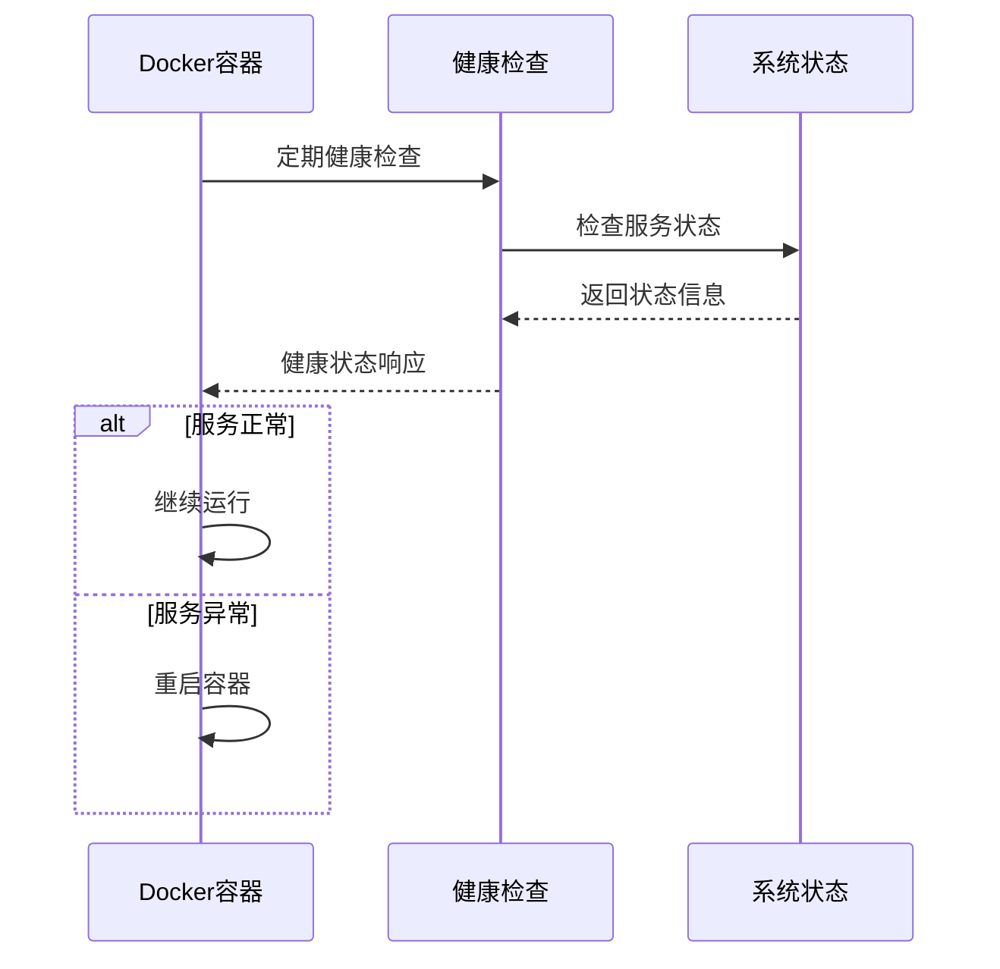
```mermaid
sequenceDiagram
participant Docker as Docker容器
participant HealthCheck as 健康检查
participant System as 系统状态
Docker->>HealthCheck : 定期健康检查
HealthCheck->>System : 检查服务状态
System-->>HealthCheck : 返回状态信息
HealthCheck-->>Docker : 健康状态响应
alt 服务正常
Docker->>Docker : 继续运行
else 服务异常
Docker->>Docker : 重启容器
end
```

**图表来源**
- [reply_server.py](file://reply_server.py#L374-L419)

**章节来源**
- [reply_server.py](file://reply_server.py#L374-L419)

## API请求处理流程

### 请求生命周期

完整的API请求处理流程展示了从请求到达至响应返回的全过程：

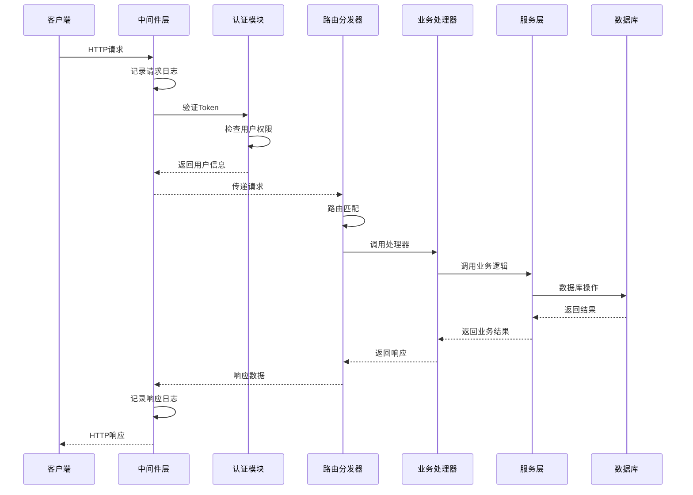
```mermaid
sequenceDiagram
participant Client as 客户端
participant Middleware as 中间件层
participant Auth as 认证模块
participant Router as 路由分发器
participant Handler as 业务处理器
participant Service as 服务层
participant DB as 数据库
Client->>Middleware : HTTP请求
Middleware->>Middleware : 记录请求日志
Middleware->>Auth : 验证Token
Auth->>Auth : 检查用户权限
Auth-->>Middleware : 返回用户信息
Middleware-->>Router : 传递请求
Router->>Router : 路由匹配
Router->>Handler : 调用处理器
Handler->>Service : 调用业务逻辑
Service->>DB : 数据库操作
DB-->>Service : 返回结果
Service-->>Handler : 返回业务结果
Handler-->>Router : 返回响应
Router-->>Middleware : 响应数据
Middleware->>Middleware : 记录响应日志
Middleware-->>Client : HTTP响应
```

**图表来源**
- [reply_server.py](file://reply_server.py#L331-L357)

### 认证流程详解

认证流程包含了完整的用户身份验证和权限检查：

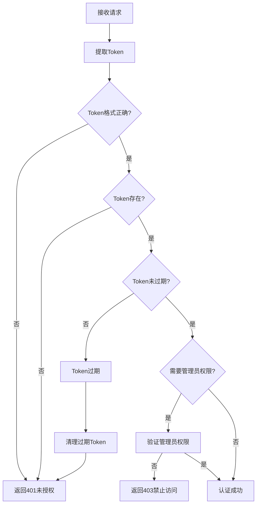
```mermaid
flowchart TD
Request[接收请求] --> ExtractToken[提取Token]
ExtractToken --> ValidateFormat{Token格式正确?}
ValidateFormat --> |否| Unauthorized[返回401未授权]
ValidateFormat --> |是| CheckExistence{Token存在?}
CheckExistence --> |否| Unauthorized
CheckExistence --> |是| CheckExpiration{Token未过期?}
CheckExpiration --> |否| ExpiredToken[Token过期]
CheckExpiration --> |是| CheckAdmin{需要管理员权限?}
CheckAdmin --> |是| ValidateAdmin[验证管理员权限]
CheckAdmin --> |否| Success[认证成功]
ValidateAdmin --> |否| Forbidden[返回403禁止访问]
ValidateAdmin --> |是| Success
ExpiredToken --> CleanupToken[清理过期Token]
CleanupToken --> Unauthorized
```

**图表来源**
- [reply_server.py](file://reply_server.py#L183-L219)

### 业务逻辑处理

业务逻辑处理遵循单一职责原则，通过依赖注入实现松耦合：

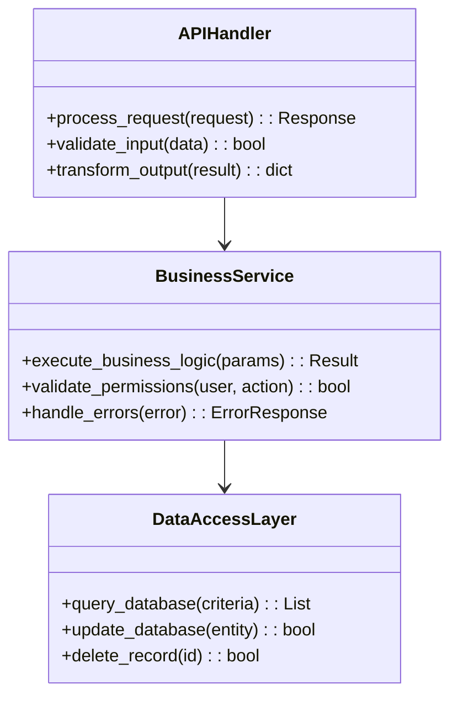
```mermaid
classDiagram
class APIHandler {
+process_request(request) : Response
+validate_input(data) : bool
+transform_output(result) : dict
}
class BusinessService {
+execute_business_logic(params) : Result
+validate_permissions(user, action) : bool
+handle_errors(error) : ErrorResponse
}
class DataAccessLayer {
+query_database(criteria) : List
+update_database(entity) : bool
+delete_record(id) : bool
}
APIHandler --> BusinessService
BusinessService --> DataAccessLayer
```

**章节来源**
- [reply_server.py](file://reply_server.py#L331-L357)
- [reply_server.py](file://reply_server.py#L183-L219)

## 性能优化策略

### 异步处理架构

系统采用完全的异步处理架构，支持高并发请求：

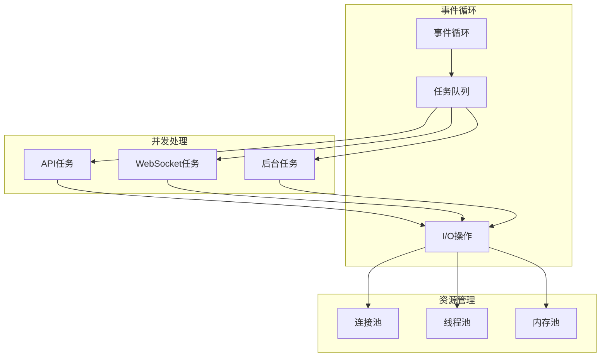
```mermaid
graph TB
subgraph "事件循环"
EventLoop[事件循环]
TaskQueue[任务队列]
IOOperations[I/O操作]
end
subgraph "并发处理"
APITasks[API任务]
WebSocketTasks[WebSocket任务]
BackgroundTasks[后台任务]
end
subgraph "资源管理"
ConnectionPool[连接池]
ThreadPool[线程池]
MemoryPool[内存池]
end
EventLoop --> TaskQueue
TaskQueue --> APITasks
TaskQueue --> WebSocketTasks
TaskQueue --> BackgroundTasks
APITasks --> IOOperations
WebSocketTasks --> IOOperations
BackgroundTasks --> IOOperations
IOOperations --> ConnectionPool
IOOperations --> ThreadPool
IOOperations --> MemoryPool
```

### 缓存策略

系统实现了多层次的缓存策略：

| 缓存层级 | 缓存内容 | 过期策略 | 存储位置 |
|----------|----------|----------|----------|
| 内存缓存 | 用户Token | Token过期时间 | SESSION_TOKENS |
| 数据库缓存 | Cookie信息 | 手动更新 | SQLite数据库 |
| 文件缓存 | 日志文件 | 时间轮转 | 本地文件系统 |
| 前端缓存 | 静态资源 | 版本控制 | 浏览器缓存 |

### 并发控制

系统通过多种机制控制并发访问：

```mermaid
flowchart TD
Request[并发请求] --> Semaphore[信号量控制]
Semaphore --> LimitCheck{达到限制?}
LimitCheck --> |是| Wait[等待释放]
LimitCheck --> |否| Process[处理请求]
Wait --> Release[释放信号量]
Release --> Process
Process --> Complete[请求完成]
Complete --> Signal[信号量+1]
```

**图表来源**
- [cookie_manager.py](file://cookie_manager.py#L112-L154)

**章节来源**
- [cookie_manager.py](file://cookie_manager.py#L112-L154)

## 故障排除指南

### 常见问题诊断

系统提供了完善的错误处理和诊断机制：

| 问题类型 | 症状 | 诊断方法 | 解决方案 |
|----------|------|----------|----------|
| 认证失败 | 401/403错误 | 检查Token有效性 | 重新登录获取Token |
| 数据库连接 | 503错误 | 检查数据库状态 | 重启数据库服务 |
| WebSocket连接 | 连接超时 | 检查网络连接 | 检查防火墙设置 |
| 静态文件 | 404错误 | 检查文件路径 | 确认文件存在 |

### 日志分析

系统提供了丰富的日志信息用于故障诊断：

```mermaid
flowchart TD
Error[错误发生] --> LogCapture[日志捕获]
LogCapture --> LogAnalysis[日志分析]
LogAnalysis --> ErrorType{错误类型}
ErrorType --> |认证错误| AuthLog[认证日志]
ErrorType --> |数据库错误| DBLog[数据库日志]
ErrorType --> |网络错误| NetworkLog[网络日志]
ErrorType --> |系统错误| SystemLog[系统日志]
AuthLog --> Solution1[检查Token配置]
DBLog --> Solution2[检查数据库连接]
NetworkLog --> Solution3[检查网络配置]
SystemLog --> Solution4[检查系统资源]
```

### 监控指标

系统提供了全面的监控指标：

```mermaid
graph LR
subgraph "性能指标"
CPU[CPU使用率]
Memory[内存使用率]
Disk[磁盘使用率]
Network[网络流量]
end
subgraph "业务指标"
Requests[请求量]
ResponseTime[响应时间]
ErrorRate[错误率]
ActiveSessions[活跃会话]
end
subgraph "系统指标"
Uptime[运行时间]
Connections[连接数]
Tasks[任务数]
Threads[线程数]
end
CPU --> Monitoring[监控系统]
Memory --> Monitoring
Requests --> Monitoring
ResponseTime --> Monitoring
```

**章节来源**
- [file_log_collector.py](file://file_log_collector.py#L15-L200)

## 结论

该FastAPI API服务架构展现了现代Web应用的最佳实践，通过模块化设计、异步处理、中间件机制和完善的监控体系，构建了一个高性能、可扩展的API服务。系统不仅满足了当前的功能需求，还为未来的功能扩展和性能优化奠定了坚实的基础。

主要特点包括：
- 完整的REST API和WebSocket服务
- 基于JWT的认证授权机制
- 动态路由注册和条件加载
- 实时日志监控和健康检查
- 高并发处理能力和性能优化
- 完善的错误处理和故障排除机制

该架构为闲鱼自动回复系统提供了稳定可靠的API服务支撑，能够满足大规模用户并发访问的需求。