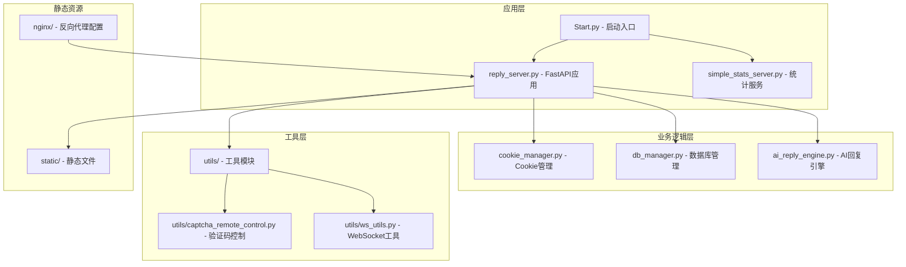
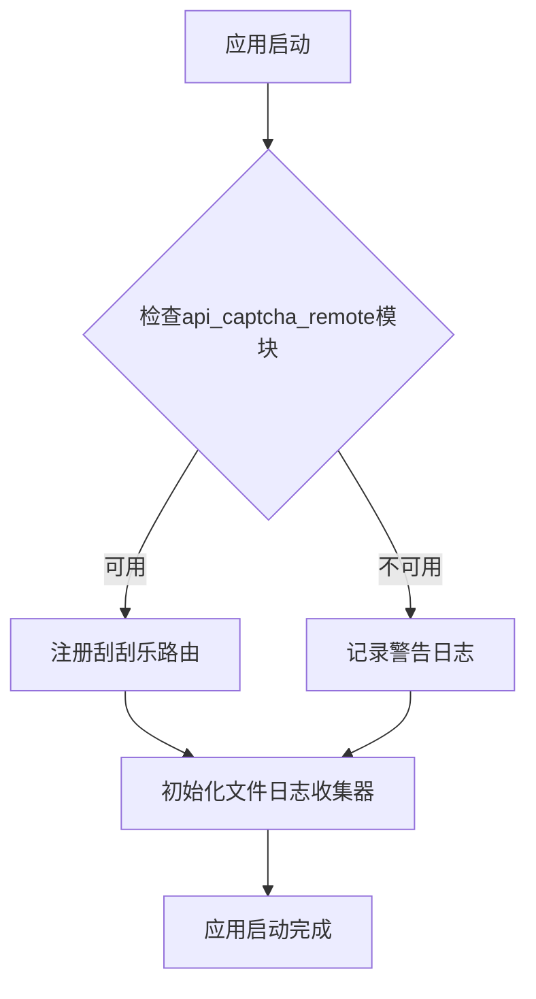
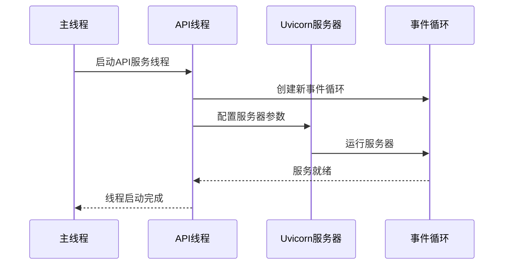
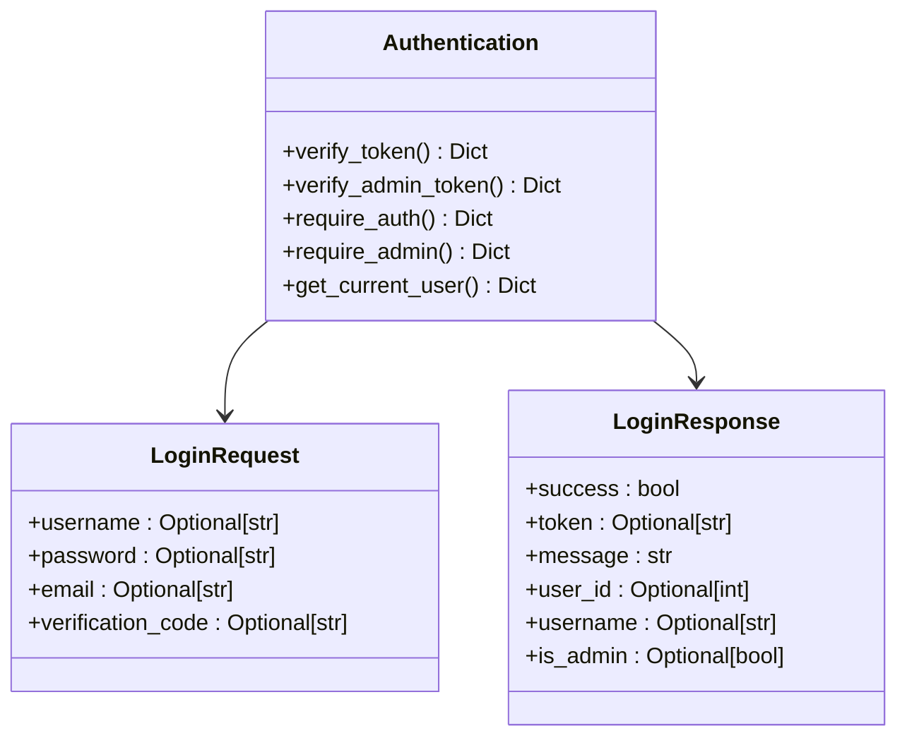
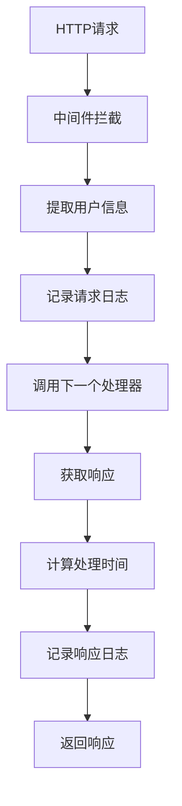
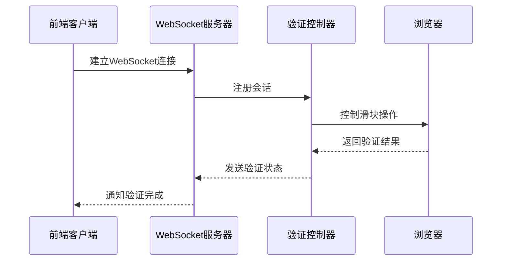
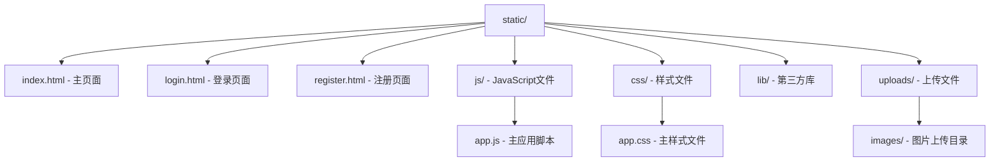
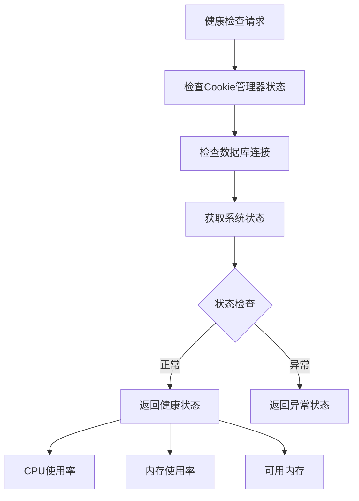
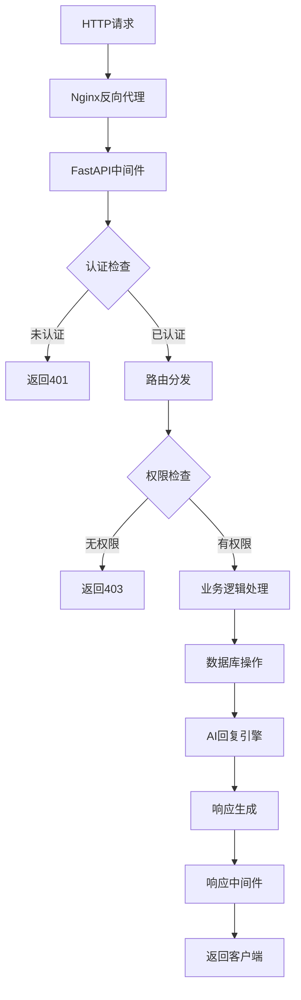
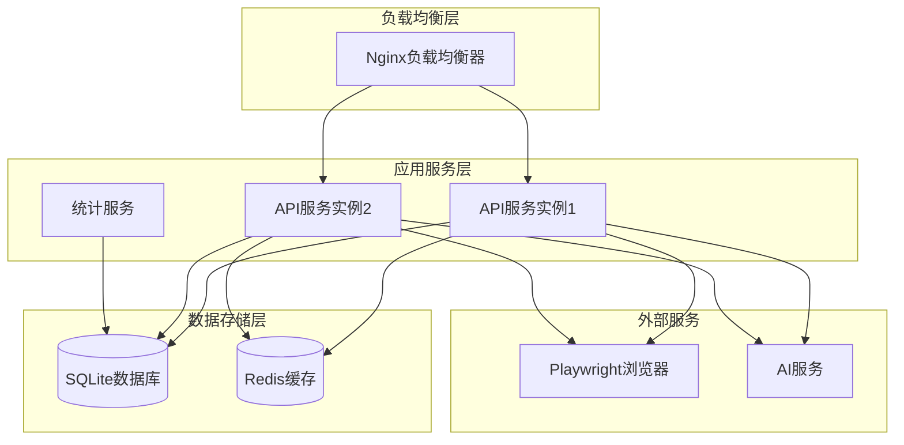

# API服务架构

<cite>
**本文档中引用的文件**
- [reply_server.py](file://reply_server.py)
- [api_captcha_remote.py](file://api_captcha_remote.py)
- [Start.py](file://Start.py)
- [config.py](file://config.py)
- [simple_stats_server.py](file://simple_stats_server.py)
- [db_manager.py](file://db_manager.py)
- [cookie_manager.py](file://cookie_manager.py)
- [nginx/nginx.conf](file://nginx/nginx.conf)
</cite>

## 目录
1. [简介](#简介)
2. [项目结构概览](#项目结构概览)
3. [FastAPI应用初始化](#fastapi应用初始化)
4. [核心功能模块](#核心功能模块)
5. [API路由架构](#api路由架构)
6. [中间件实现](#中间件实现)
7. [WebSocket服务](#websocket服务)
8. [静态文件服务](#静态文件服务)
9. [健康检查机制](#健康检查机制)
10. [请求处理流程](#请求处理流程)
11. [部署架构](#部署架构)
12. [总结](#总结)

## 简介

本文档详细分析了一个基于FastAPI框架构建的API服务架构，该系统主要用于闲鱼自动回复系统的管理和控制。系统采用现代化的微服务架构设计，集成了REST API、WebSocket实时通信、静态文件服务等多种功能模块。

## 项目结构概览

该项目采用模块化架构设计，主要包含以下核心组件：



**图表来源**
- [Start.py](file://Start.py#L1-L50)
- [reply_server.py](file://reply_server.py#L1-L100)

## FastAPI应用初始化

### 应用创建与配置

FastAPI应用在[`reply_server.py`](file://reply_server.py#L308-L314)中创建，配置了完整的API文档系统：

```python
app = FastAPI(
    title="Xianyu Auto Reply API",
    version="1.0.0",
    description="闲鱼自动回复系统API",
    docs_url="/docs",
    redoc_url="/redoc"
)
```

### 条件路由注册机制

系统实现了智能的路由条件加载机制，特别是刮刮乐远程控制路由的动态注册：



**图表来源**
- [reply_server.py](file://reply_server.py#L31-L40)
- [reply_server.py](file://reply_server.py#L316-L322)

**章节来源**
- [reply_server.py](file://reply_server.py#L308-L322)

### 独立线程启动机制

[`_start_api_server`](file://reply_server.py#L446-L486)函数负责在独立线程中启动Uvicorn服务器：



**图表来源**
- [Start.py](file://Start.py#L446-L486)
- [Start.py](file://Start.py#L573-L576)

**章节来源**
- [Start.py](file://Start.py#L446-L486)

## 核心功能模块

### 用户认证系统

系统实现了多层次的认证机制：

#### JWT Token管理
- **令牌生成**: 使用`secrets.token_urlsafe(32)`生成安全令牌
- **令牌验证**: 通过`verify_token`函数验证令牌有效性
- **会话管理**: 维护`SESSION_TOKENS`字典存储活动会话
- **过期处理**: 24小时自动过期机制

#### 认证依赖注入
系统提供了多个认证依赖函数：



**图表来源**
- [reply_server.py](file://reply_server.py#L183-L229)
- [reply_server.py](file://reply_server.py#L112-L144)

**章节来源**
- [reply_server.py](file://reply_server.py#L183-L229)

### 账号管理系统

#### Cookie管理器
[`CookieManager`](file://cookie_manager.py#L10-L200)负责管理多个闲鱼账号：

- **多账号支持**: 支持同时管理多个Cookie账号
- **任务隔离**: 每个账号运行独立的异步任务
- **状态监控**: 实时监控账号状态和任务执行情况
- **自动重启**: 故障时自动重启账号任务

#### 关键字回复系统
系统支持两种关键字回复模式：
1. **全局关键字**: 所有账号共享的关键字列表
2. **账号级关键字**: 每个账号独立的关键字配置

**章节来源**
- [cookie_manager.py](file://cookie_manager.py#L10-L200)

### AI回复引擎

系统集成了AI回复功能，支持：
- **多模型支持**: 支持多种AI模型（如通义千问）
- **上下文管理**: 维护对话上下文历史
- **智能匹配**: 基于商品信息和用户意图的智能回复
- **折扣计算**: 自动计算价格优惠和议价策略

## API路由架构

### REST API端点分类

系统API分为以下几类端点：

```mermaid
graph LR
subgraph "认证相关"
A1[/login - 登录]
A2[/logout - 登出]
A3[/verify - 验证Token]
A4[/change-admin-password - 修改密码]
end
subgraph "账号管理"
B1[/cookies - 账号列表]
B2[/cookies/{cid} - 单个账号]
B3[/cookies/details - 账号详情]
B4[/cookies/{cid}/auto-confirm - 自动确认]
end
subgraph "验证码系统"
C1[/generate-captcha - 生成验证码]
C2[/verify-captcha - 验证验证码]
C3[/send-verification-code - 发送验证码]
end
subgraph "消息处理"
D1[/xianyu/reply - 自动回复]
D2[/send-message - 发送消息]
end
subgraph "刮刮乐控制"
E1[/api/captcha/ws/{session_id} - WebSocket]
E2[/api/captcha/sessions - 会话列表]
E3[/api/captcha/session/{session_id} - 会话详情]
end
```

**图表来源**
- [reply_server.py](file://reply_server.py#L541-L1047)
- [api_captcha_remote.py](file://api_captcha_remote.py#L38-L319)

### 核心API端点详解

#### 用户登录接口
登录接口支持多种登录方式：
- **用户名密码登录**: 传统用户名密码认证
- **邮箱密码登录**: 基于邮箱的认证方式
- **邮箱验证码登录**: 基于验证码的一次性登录

#### 账号管理接口
提供完整的账号生命周期管理：
- **增删改查**: 完整的CRUD操作
- **状态控制**: 启用/禁用账号
- **配置更新**: 动态更新账号配置
- **权限验证**: 基于用户权限的操作限制

**章节来源**
- [reply_server.py](file://reply_server.py#L541-L1047)

## 中间件实现

### 请求日志中间件

系统实现了统一的请求日志中间件：



**图表来源**
- [reply_server.py](file://reply_server.py#L331-L357)

中间件功能特性：
- **用户追踪**: 从Token中提取用户信息
- **性能监控**: 记录请求处理时间
- **错误捕获**: 捕获并记录异常信息
- **日志分级**: 支持不同级别的日志记录

**章节来源**
- [reply_server.py](file://reply_server.py#L331-L357)

### 跨域处理

虽然代码中没有显式的CORS配置，但系统通过Nginx反向代理实现了跨域支持：

- **代理转发**: Nginx作为反向代理处理跨域请求
- **安全头设置**: 包含X-Frame-Options、X-XSS-Protection等安全头
- **连接升级**: 支持WebSocket协议升级

## WebSocket服务

### 刮刮乐远程控制

系统提供了强大的WebSocket服务用于远程控制滑块验证：



**图表来源**
- [api_captcha_remote.py](file://api_captcha_remote.py#L38-L156)

### WebSocket端点功能

#### 实时通信
- **截图传输**: 实时传输验证码截图
- **鼠标事件**: 接收并处理鼠标点击事件
- **状态同步**: 实时同步验证状态

#### 会话管理
- **会话创建**: 为每个验证创建独立会话
- **状态跟踪**: 跟踪验证进度和状态
- **资源清理**: 自动清理完成的会话

**章节来源**
- [api_captcha_remote.py](file://api_captcha_remote.py#L38-L156)

## 静态文件服务

### 静态资源组织

系统提供完整的静态文件服务：



**图表来源**
- [reply_server.py](file://reply_server.py#L360-L372)

### 版本控制机制

系统实现了智能的静态文件版本控制：

- **时间戳版本**: 基于文件修改时间生成版本号
- **缓存优化**: 通过版本号实现浏览器缓存控制
- **自动更新**: 支持前端资源的自动更新

**章节来源**
- [reply_server.py](file://reply_server.py#L481-L525)

## 健康检查机制

### 健康检查端点

系统提供了全面的健康检查机制：



**图表来源**
- [reply_server.py](file://reply_server.py#L374-L419)

### 检查项目

健康检查涵盖以下方面：
- **服务状态**: Cookie管理器和数据库连接状态
- **系统资源**: CPU使用率、内存使用情况
- **业务功能**: 核心业务功能的可用性
- **错误报告**: 详细的错误信息和诊断数据

**章节来源**
- [reply_server.py](file://reply_server.py#L374-L419)

## 请求处理流程

### 完整请求处理链路



**图表来源**
- [reply_server.py](file://reply_server.py#L331-L357)
- [reply_server.py](file://reply_server.py#L541-L1047)

### 错误处理机制

系统实现了完善的错误处理机制：
- **异常捕获**: 全局异常捕获和处理
- **错误响应**: 标准化的错误响应格式
- **日志记录**: 详细的错误日志记录
- **用户友好**: 对用户友好的错误信息

## 部署架构

### 微服务部署模式

系统采用微服务架构部署：



**图表来源**
- [nginx/nginx.conf](file://nginx/nginx.conf#L48-L87)
- [Start.py](file://Start.py#L1-L50)

### 配置管理

系统支持灵活的配置管理：

- **环境变量**: 支持通过环境变量配置
- **配置文件**: 通过`global_config.yml`集中管理配置
- **动态配置**: 支持运行时配置更新
- **默认值**: 提供合理的默认配置

**章节来源**
- [config.py](file://config.py#L1-L126)

## 总结

该FastAPI API服务架构展现了现代Web应用的最佳实践：

### 架构优势
- **模块化设计**: 清晰的模块划分和职责分离
- **异步处理**: 全面的异步编程支持
- **安全性**: 完善的认证授权机制
- **可扩展性**: 支持水平扩展和微服务部署

### 技术特色
- **WebSocket实时通信**: 支持实时交互功能
- **AI集成**: 深度集成人工智能回复能力
- **多协议支持**: 同时支持HTTP和WebSocket协议
- **自动化运维**: 完善的健康检查和监控机制

### 应用价值
该架构不仅满足了闲鱼自动回复系统的业务需求，更为类似的Web应用开发提供了优秀的参考模板，展示了如何构建一个功能完整、性能优异、易于维护的现代Web服务。