# 认证与权限控制

<cite>
**本文档引用的文件**
- [reply_server.py](file://reply_server.py)
- [db_manager.py](file://db_manager.py)
- [config.py](file://config.py)
- [Start.py](file://Start.py)
- [static/login.html](file://static/login.html)
- [static/register.html](file://static/register.html)
- [static/js/app.js](file://static/js/app.js)
</cite>

## 目录
1. [简介](#简介)
2. [系统架构概览](#系统架构概览)
3. [核心认证组件](#核心认证组件)
4. [JWT令牌认证机制](#jwt令牌认证机制)
5. [用户身份验证](#用户身份验证)
6. [密码安全机制](#密码安全机制)
7. [验证码安全体系](#验证码安全体系)
8. [权限控制层次](#权限控制层次)
9. [安全接口实现](#安全接口实现)
10. [风险控制与审计](#风险控制与审计)
11. [安全最佳实践](#安全最佳实践)
12. [故障排除指南](#故障排除指南)

## 简介

本文档详细阐述了闲鱼自动回复系统中的认证与权限控制机制。该系统采用基于JWT令牌的认证体系，结合多种安全防护措施，为用户提供安全可靠的身份验证和权限管理功能。

系统的核心设计理念是"零信任"安全模型，即默认认为所有请求都不可信，必须经过严格的身份验证和权限检查。通过多层次的安全防护，确保系统的安全性、可用性和可审计性。

## 系统架构概览

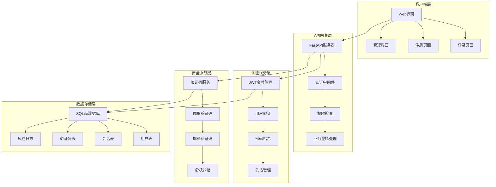

**图表来源**
- [reply_server.py](file://reply_server.py#L308-L350)
- [db_manager.py](file://db_manager.py#L16-L100)

## 核心认证组件

### 系统初始化配置

系统在启动时初始化以下核心认证变量：

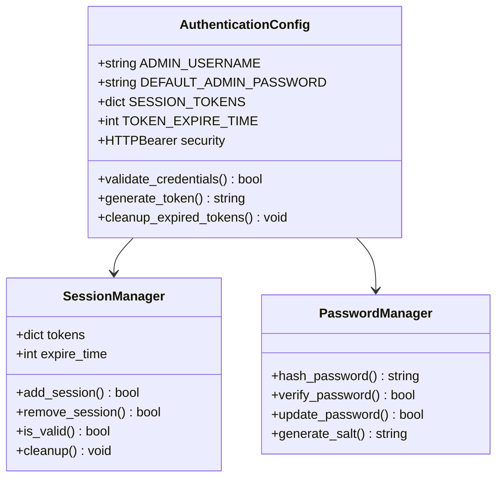

**图表来源**
- [reply_server.py](file://reply_server.py#L42-L47)

**章节来源**
- [reply_server.py](file://reply_server.py#L42-L47)

### 会话令牌管理

系统采用内存中的会话令牌存储机制，提供高效的令牌验证能力：

| 配置项 | 默认值 | 说明 |
|--------|--------|------|
| ADMIN_USERNAME | "admin" | 系统管理员用户名 |
| DEFAULT_ADMIN_PASSWORD | "admin123" | 系统初始化默认密码 |
| SESSION_TOKENS | {} | 内存中的会话令牌存储 |
| TOKEN_EXPIRE_TIME | 24小时 | 令牌过期时间 |

## JWT令牌认证机制

### 令牌生成与验证流程

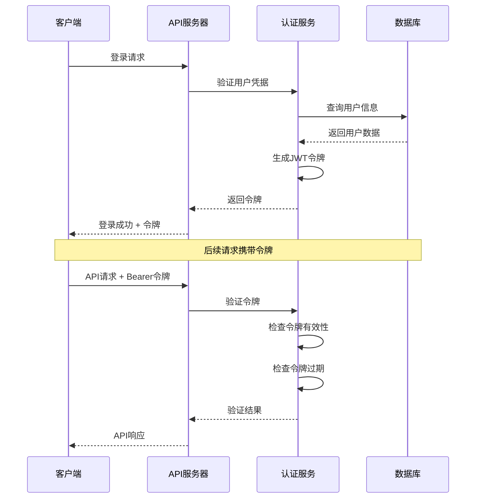

**图表来源**
- [reply_server.py](file://reply_server.py#L178-L219)
- [reply_server.py](file://reply_server.py#L542-L680)

### 依赖函数详解

系统提供了多个认证依赖函数，形成完整的认证检查链：

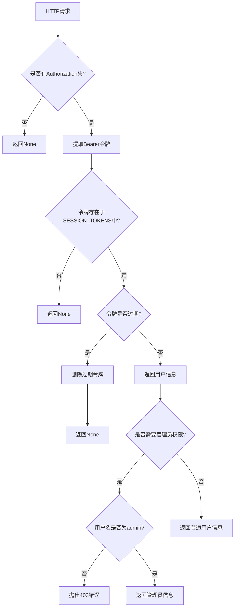

**图表来源**
- [reply_server.py](file://reply_server.py#L183-L219)

**章节来源**
- [reply_server.py](file://reply_server.py#L178-L219)

## 用户身份验证

### 多种登录方式支持

系统支持三种主要的登录方式：

1. **用户名密码登录**
2. **邮箱密码登录**
3. **邮箱验证码登录**

每种登录方式都有相应的安全验证机制：

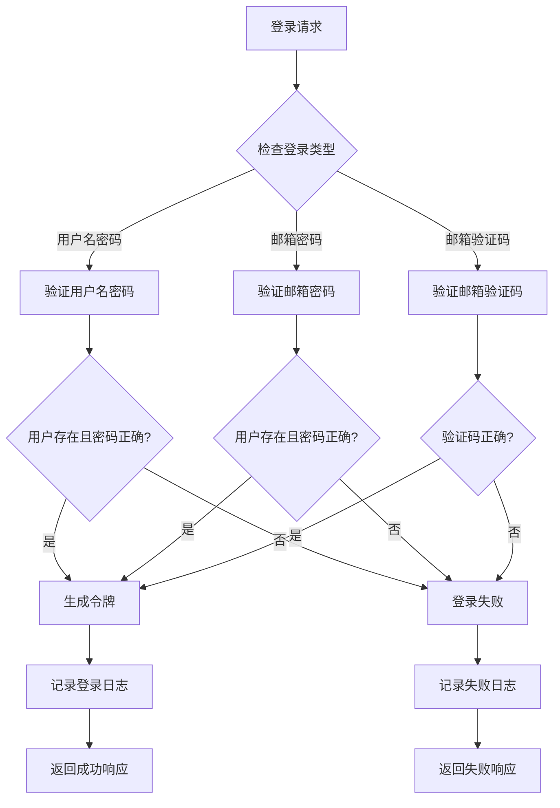

**图表来源**
- [reply_server.py](file://reply_server.py#L542-L680)

### 用户信息管理

系统维护详细的用户信息，包括：

| 字段 | 类型 | 说明 |
|------|------|------|
| id | Integer | 用户唯一标识符 |
| username | String | 用户名 |
| email | String | 邮箱地址 |
| password_hash | String | 密码哈希值 |
| is_active | Boolean | 用户是否激活 |
| created_at | Timestamp | 创建时间 |
| updated_at | Timestamp | 更新时间 |

**章节来源**
- [reply_server.py](file://reply_server.py#L542-L680)
- [db_manager.py](file://db_manager.py#L2476-L2510)

## 密码安全机制

### 密码哈希策略

系统采用SHA-256算法对密码进行哈希处理，确保密码存储的安全性：

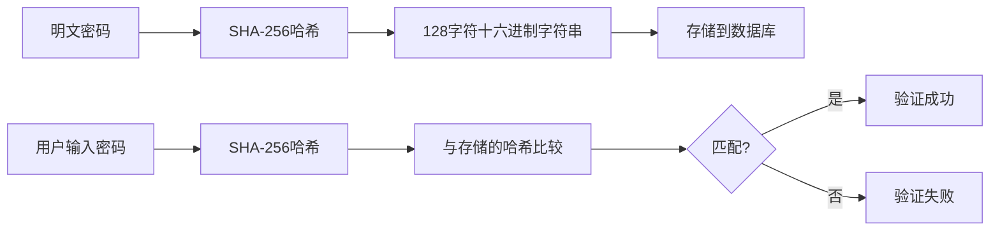

**图表来源**
- [db_manager.py](file://db_manager.py#L2507-L2509)

### 密码更新机制

系统提供安全的密码更新功能：

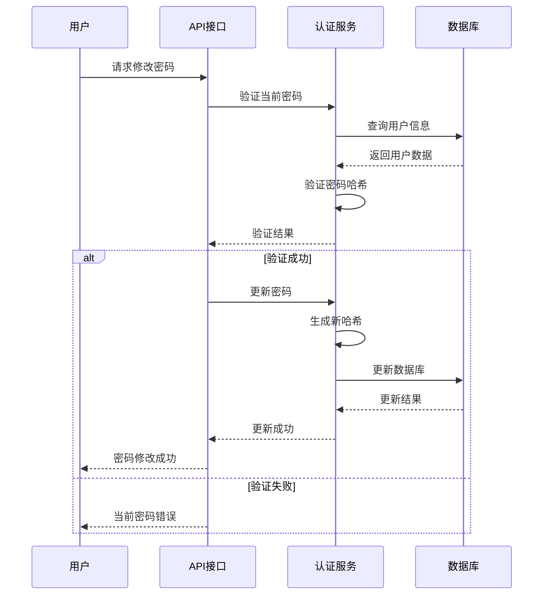

**图表来源**
- [reply_server.py](file://reply_server.py#L683-L705)
- [db_manager.py](file://db_manager.py#L2511-L2534)

**章节来源**
- [db_manager.py](file://db_manager.py#L2502-L2534)

## 验证码安全体系

### 图形验证码系统

系统实现了完整的图形验证码机制，防止自动化攻击：

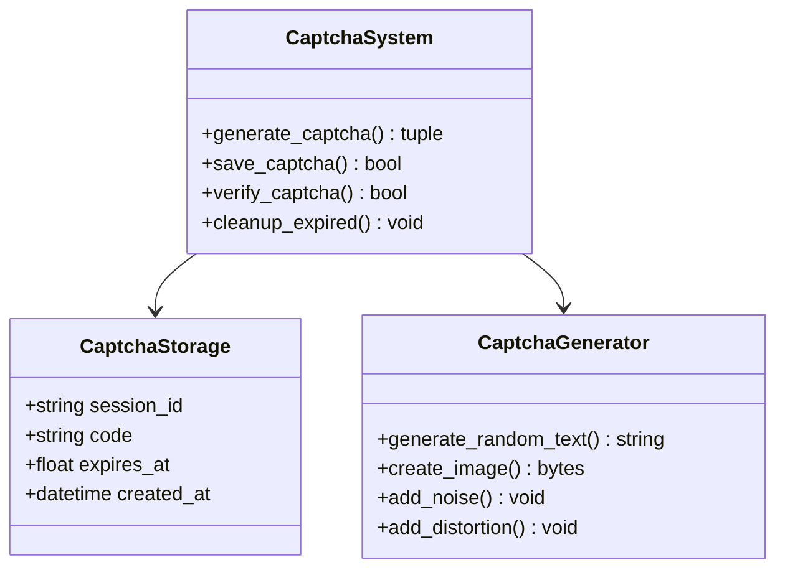

**图表来源**
- [db_manager.py](file://db_manager.py#L2540-L2655)

### 邮箱验证码机制

系统支持邮箱验证码登录和注册功能：

| 验证码类型 | 有效期 | 用途 |
|------------|--------|------|
| register | 10分钟 | 用户注册验证 |
| login | 10分钟 | 用户登录验证 |
| reset | 10分钟 | 密码重置验证 |

**章节来源**
- [db_manager.py](file://db_manager.py#L2540-L2699)
- [reply_server.py](file://reply_server.py#L708-L841)

## 权限控制层次

### 角色权限模型

系统采用基于角色的访问控制（RBAC）模型：

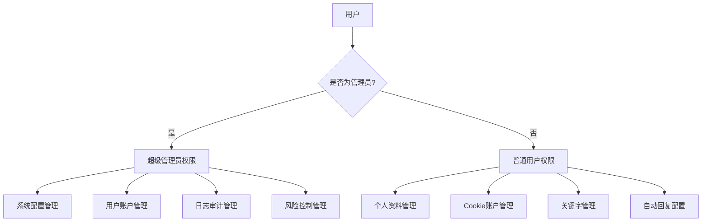

**图表来源**
- [reply_server.py](file://reply_server.py#L202-L212)
- [reply_server.py](file://reply_server.py#L239-L243)

### 权限检查函数

系统提供了多层次的权限检查机制：

| 函数 | 权限级别 | 用途 |
|------|----------|------|
| require_auth | 基础认证 | 需要登录的接口 |
| verify_admin_token | 管理员权限 | 管理员专用接口 |
| require_admin | 管理员权限 | 系统管理接口 |
| get_current_user | 基础认证 | 获取当前用户信息 |

**章节来源**
- [reply_server.py](file://reply_server.py#L202-L243)

## 安全接口实现

### 登录接口安全特性

登录接口实现了多重安全防护：

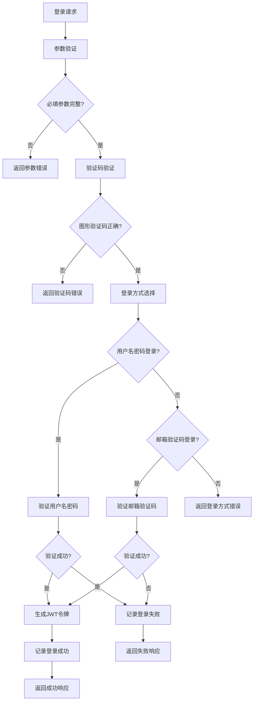

**图表来源**
- [reply_server.py](file://reply_server.py#L542-L680)

### 密码修改接口

密码修改接口确保只有授权用户才能修改密码：

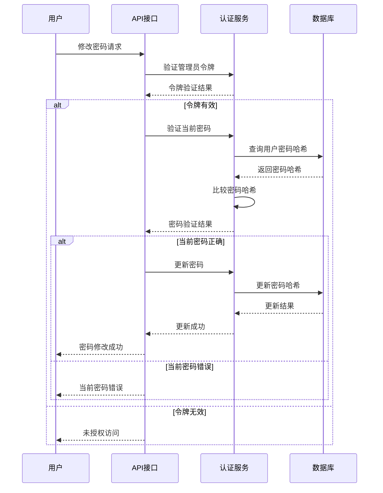

**图表来源**
- [reply_server.py](file://reply_server.py#L683-L705)

**章节来源**
- [reply_server.py](file://reply_server.py#L542-L705)

## 风险控制与审计

### 风控日志系统

系统实现了完整的风控日志记录机制：

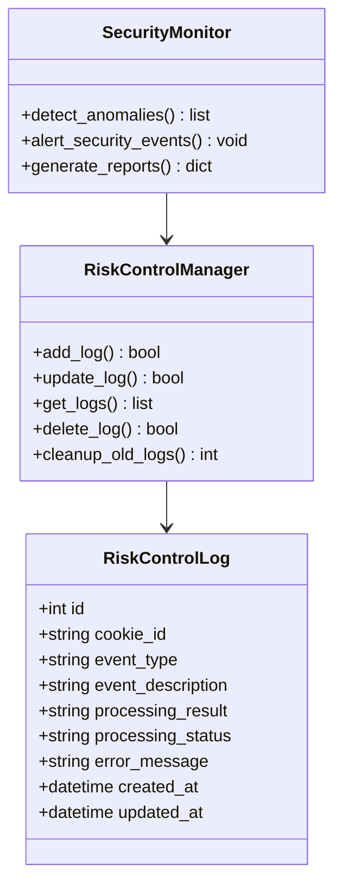

**图表来源**
- [db_manager.py](file://db_manager.py#L408-L421)

### 审计日志记录

系统记录所有重要的安全事件：

| 日志类型 | 记录内容 | 保留期限 |
|----------|----------|----------|
| 登录日志 | 用户登录、失败原因、IP地址 | 90天 |
| 权限变更 | 管理员操作、权限修改 | 90天 |
| 密码修改 | 密码变更、操作时间 | 90天 |
| 风控事件 | 验证码验证、异常检测 | 90天 |

**章节来源**
- [db_manager.py](file://db_manager.py#L4829-L4900)
- [db_manager.py](file://db_manager.py#L5000-L5095)

## 安全最佳实践

### 令牌管理策略

1. **令牌过期机制**
   - 默认24小时过期时间
   - 自动清理过期令牌
   - 支持主动登出

2. **令牌刷新策略**
   - 实施令牌轮换机制
   - 避免长期使用同一令牌
   - 监控异常令牌使用

3. **会话安全**
   - 内存中存储令牌
   - 高效的令牌查找算法
   - 自动清理机制

### 防暴力破解措施

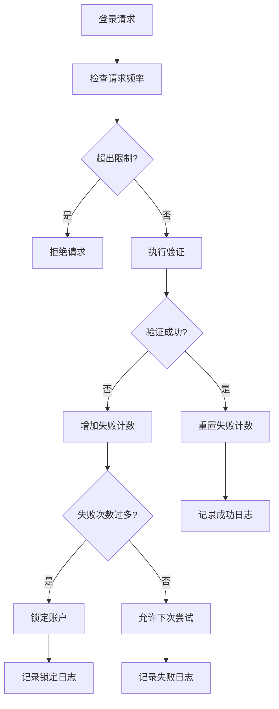

### 敏感操作审计

系统对所有敏感操作进行详细审计：

1. **登录审计**
   - 用户名/IP地址
   - 时间戳
   - 结果状态
   - 失败原因

2. **权限变更审计**
   - 操作用户
   - 变更内容
   - 操作时间
   - 审计追踪

3. **数据修改审计**
   - 修改内容
   - 修改前后对比
   - 修改原因
   - 修改人

### 网络安全防护

1. **HTTPS强制**
   - 所有通信加密
   - 证书验证
   - 中间人攻击防护

2. **请求限制**
   - 频率限制
   - 并发控制
   - IP白名单

3. **输入验证**
   - 参数类型检查
   - 长度限制
   - 特殊字符过滤

## 故障排除指南

### 常见认证问题

1. **登录失败**
   - 检查用户名密码是否正确
   - 验证用户是否被禁用
   - 确认验证码是否正确

2. **令牌过期**
   - 检查TOKEN_EXPIRE_TIME配置
   - 验证令牌清理机制
   - 确认客户端刷新策略

3. **权限拒绝**
   - 验证用户角色权限
   - 检查管理员令牌
   - 确认接口权限设置

### 性能优化建议

1. **令牌存储优化**
   - 使用内存存储提高性能
   - 实施定期清理机制
   - 监控内存使用情况

2. **数据库优化**
   - 添加索引提高查询速度
   - 实施连接池管理
   - 定期清理历史数据

3. **缓存策略**
   - 缓存用户信息
   - 缓存权限数据
   - 实施缓存失效机制

### 监控与告警

建议实施以下监控指标：

| 监控项目 | 阈值 | 告警级别 |
|----------|------|----------|
| 登录失败率 | >5% | 警告 |
| 并发登录数 | >100 | 严重 |
| 令牌过期率 | >10% | 警告 |
| 数据库连接数 | >80% | 警告 |

**章节来源**
- [reply_server.py](file://reply_server.py#L61-L77)
- [db_manager.py](file://db_manager.py#L5000-L5095)

## 结论

闲鱼自动回复系统的认证与权限控制机制采用了多层次的安全防护策略，通过JWT令牌认证、密码哈希、验证码验证、权限控制和风险审计等手段，构建了一个安全可靠的用户身份验证体系。

系统的设计充分考虑了安全性、可用性和可维护性的平衡，在保证安全的前提下提供了良好的用户体验。通过持续的安全监控和审计，系统能够及时发现和应对各种安全威胁，确保平台的稳定运行。

建议开发者在部署和使用该系统时，严格按照安全最佳实践进行配置和管理，定期更新安全策略，及时修复安全漏洞，确保系统的长期安全运行。