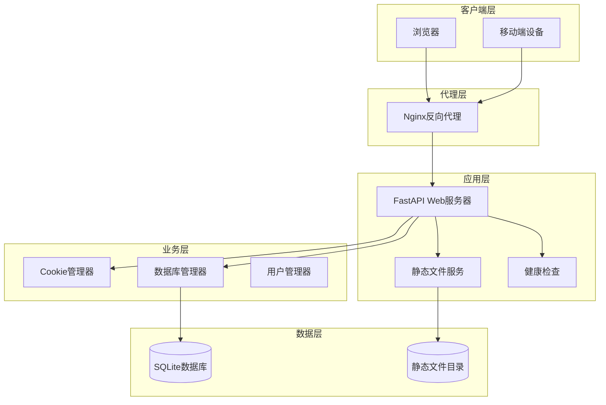
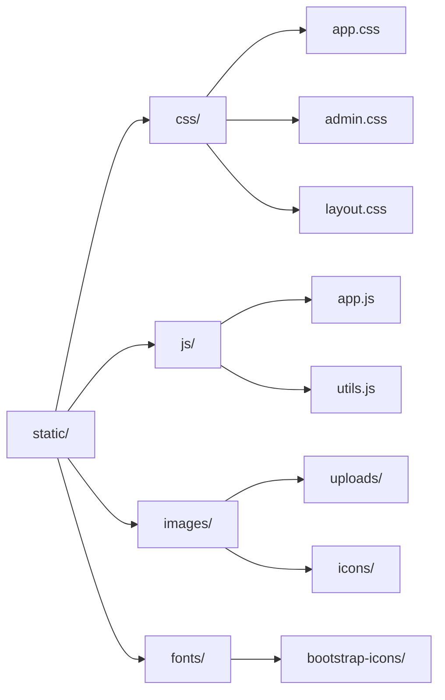
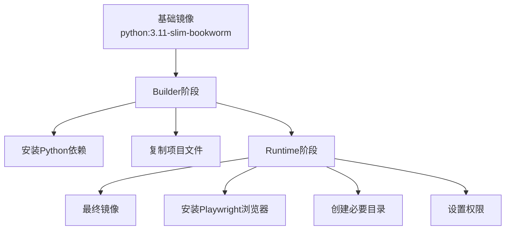
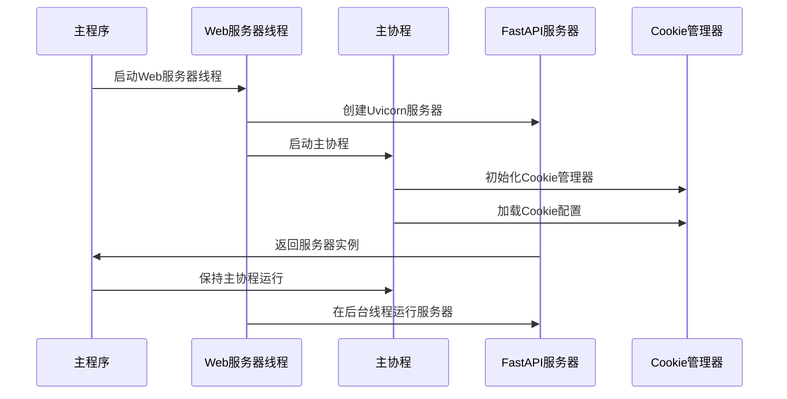
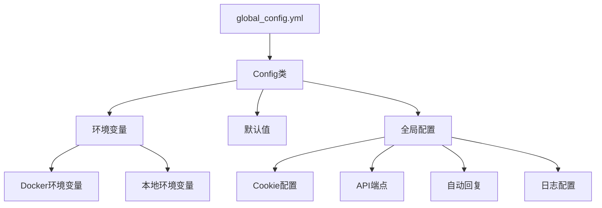

# 静态资源与前端集成

<cite>
**本文档引用的文件**
- [Start.py](file://Start.py)
- [reply_server.py](file://reply_server.py)
- [cookie_manager.py](file://cookie_manager.py)
- [db_manager.py](file://db_manager.py)
- [config.py](file://config.py)
- [nginx/nginx.conf](file://nginx/nginx.conf)
- [Dockerfile](file://Dockerfile)
- [docker-compose.yml](file://docker-compose.yml)
- [static/index.html](file://static/index.html)
</cite>

## 目录
1. [概述](#概述)
2. [项目架构](#项目架构)
3. [FastAPI静态资源服务](#fastapi静态资源服务)
4. [健康检查机制](#健康检查机制)
5. [前端路由与缓存控制](#前端路由与缓存控制)
6. [Docker部署与路径处理](#docker部署与路径处理)
7. [Web服务器线程与主协程协同](#web服务器线程与主协程协同)
8. [配置管理](#配置管理)
9. [故障排除指南](#故障排除指南)
10. [总结](#总结)

## 概述

本文档详细阐述了闲鱼自动回复系统中静态资源与前端集成的技术实现。该系统采用FastAPI框架提供Web服务，通过StaticFiles中间件实现静态资源托管，并结合Docker容器化部署，为用户提供完整的前后端分离解决方案。

核心特性包括：
- 基于FastAPI的静态文件服务
- 智能缓存控制机制
- Docker容器化部署支持
- 健康检查与监控
- 多环境路径处理

## 项目架构

系统采用分层架构设计，主要组件包括：



**图表来源**
- [Start.py](file://Start.py#L446-L486)
- [reply_server.py](file://reply_server.py#L359-L366)

**章节来源**
- [Start.py](file://Start.py#L1-L602)
- [reply_server.py](file://reply_server.py#L1-L800)

## FastAPI静态资源服务

### StaticFiles配置机制

系统通过FastAPI的StaticFiles中间件实现静态资源服务，核心配置如下：

```python
# 静态文件目录配置
static_dir = os.path.join(os.path.dirname(__file__), 'static')
if not os.path.exists(static_dir):
    os.makedirs(static_dir, exist_ok=True)

# 挂载静态文件服务
app.mount('/static', StaticFiles(directory=static_dir), name='static')
```

### 路径处理策略

#### 本地开发环境路径处理

在本地开发环境中，系统自动检测并创建静态文件目录：

- **目录检测**：检查`static`目录是否存在
- **自动创建**：如不存在则创建目录结构
- **权限设置**：确保目录具有适当的读写权限

#### Docker环境路径处理

在Docker容器中，路径处理遵循以下原则：

- **容器内路径**：静态文件存储在容器内的`/app/static`目录
- **数据卷挂载**：通过Docker Compose将主机目录映射到容器
- **权限继承**：容器内目录权限继承自主机挂载点

### 静态资源组织结构

静态资源按照功能模块组织：



**章节来源**
- [reply_server.py](file://reply_server.py#L359-L371)

## 健康检查机制

### 健康检查端点实现

系统提供专门的健康检查端点，用于容器编排和负载均衡：

```python
@app.get('/health')
async def health_check():
    """健康检查端点，用于Docker健康检查和负载均衡器"""
    try:
        # 检查Cookie管理器状态
        manager_status = "ok" if cookie_manager.manager is not None else "error"
        
        # 检查数据库连接
        from db_manager import db_manager
        try:
            db_manager.get_all_cookies()
            db_status = "ok"
        except Exception:
            db_status = "error"
        
        # 获取系统状态
        import psutil
        cpu_percent = psutil.cpu_percent(interval=1)
        memory_info = psutil.virtual_memory()
        
        status = {
            "status": "healthy" if manager_status == "ok" and db_status == "ok" else "unhealthy",
            "timestamp": time.time(),
            "services": {
                "cookie_manager": manager_status,
                "database": db_status
            },
            "system": {
                "cpu_percent": cpu_percent,
                "memory_percent": memory_info.percent,
                "memory_available": memory_info.available
            }
        }
        
        if status["status"] == "unhealthy":
            raise HTTPException(status_code=503, detail=status)
        
        return status
    except Exception as e:
        return {
            "status": "unhealthy",
            "timestamp": time.time(),
            "error": str(e)
        }
```

### 健康检查指标

健康检查涵盖以下关键指标：

| 检查项目 | 描述 | 重要性 |
|---------|------|--------|
| Cookie管理器状态 | 验证Cookie管理器是否正常初始化 | 关键 |
| 数据库连接状态 | 检查SQLite数据库连接是否可用 | 关键 |
| CPU使用率 | 监控系统CPU占用情况 | 重要 |
| 内存使用率 | 监控系统内存占用情况 | 重要 |

### Docker健康检查配置

在Docker环境中，健康检查通过以下配置实现：

```yaml
healthcheck:
  test: ["CMD", "curl", "-f", "http://localhost:8080/health"]
  interval: 30s
  timeout: 10s
  retries: 3
  start_period: 40s
```

**章节来源**
- [reply_server.py](file://reply_server.py#L373-L418)
- [Dockerfile](file://Dockerfile#L131-L133)

## 前端路由与缓存控制

### 根路径路由

系统对根路径`/`进行特殊处理，重定向到登录页面：

```python
@app.get('/', response_class=HTMLResponse)
async def root():
    login_path = os.path.join(static_dir, 'login.html')
    if os.path.exists(login_path):
        with open(login_path, 'r', encoding='utf-8') as f:
            return HTMLResponse(f.read())
    else:
        return HTMLResponse('<h3>Login page not found</h3>')
```

### 登录页面路由

登录页面路由提供完整的HTML响应：

```python
@app.get('/login.html', response_class=HTMLResponse)
async def login_page():
    login_path = os.path.join(static_dir, 'login.html')
    if os.path.exists(login_path):
        with open(login_path, 'r', encoding='utf-8') as f:
            return HTMLResponse(f.read())
    else:
        return HTMLResponse('<h3>Login page not found</h3>')
```

### 管理界面路由

管理界面路由`/admin`实现了智能的前端资源缓存控制机制：

```python
@app.get('/admin', response_class=HTMLResponse)
async def admin_page():
    index_path = os.path.join(static_dir, 'index.html')
    if not os.path.exists(index_path):
        return HTMLResponse('<h3>No front-end found</h3>')
    
    # 获取静态文件的修改时间作为版本号，解决浏览器缓存问题
    def get_file_version(file_path, default='1.0.0'):
        """获取文件的版本号（基于修改时间）"""
        if os.path.exists(file_path):
            try:
                mtime = os.path.getmtime(file_path)
                return str(int(mtime))
            except Exception as e:
                logger.warning(f"获取文件 {file_path} 修改时间失败: {e}")
        return default
    
    app_js_path = os.path.join(static_dir, 'js', 'app.js')
    app_css_path = os.path.join(static_dir, 'css', 'app.css')
    
    js_version = get_file_version(app_js_path, '2.2.0')
    css_version = get_file_version(app_css_path, '1.0.0')
    
    try:
        with open(index_path, 'r', encoding='utf-8') as f:
            html_content = f.read()
            
            # 替换 app.js 的版本号参数
            js_pattern = r'/static/js/app\.js\?v=[^"\'\s>]+'
            js_new_url = f'/static/js/app.js?v={js_version}'
            if re.search(js_pattern, html_content):
                html_content = re.sub(js_pattern, js_new_url, html_content)
                logger.debug(f"已替换 app.js 版本号: {js_version}")
            
            # 为 app.css 添加或更新版本号参数
            css_pattern = r'/static/css/app\.css(\?v=[^"\'\s>]+)?'
            css_new_url = f'/static/css/app.css?v={css_version}'
            html_content = re.sub(css_pattern, css_new_url, html_content)
            
            return HTMLResponse(html_content)
    except Exception as e:
        logger.error(f"读取或处理 index.html 失败: {e}")
        return HTMLResponse('<h3>Error loading page</h3>')
```

### 缓存控制机制

前端资源缓存控制通过以下方式实现：

#### 文件版本控制

系统通过文件修改时间生成版本号：

```python
def get_file_version(file_path, default='1.0.0'):
    """获取文件的版本号（基于修改时间）"""
    if os.path.exists(file_path):
        try:
            mtime = os.path.getmtime(file_path)
            return str(int(mtime))
        except Exception as e:
            logger.warning(f"获取文件 {file_path} 修改时间失败: {e}")
    return default
```

#### URL参数注入

系统自动在静态资源URL中注入版本参数：

```javascript
// 示例：app.js版本号注入
'/static/js/app.js?v=1234567890'

// 示例：app.css版本号注入  
'/static/css/app.css?v=9876543210'
```

### 注册页面路由

注册页面路由包含访问控制：

```python
@app.get('/register.html', response_class=HTMLResponse)
async def register_page():
    # 检查注册是否开启
    from db_manager import db_manager
    registration_enabled = db_manager.get_system_setting('registration_enabled')
    if registration_enabled != 'true':
        return HTMLResponse('''
        <!DOCTYPE html>
        <html>
        <head>
            <title>注册已关闭</title>
            <meta charset="utf-8">
            <style>
                body { font-family: Arial, sans-serif; text-align: center; padding: 50px; }
                .message { color: #666; font-size: 18px; }
                .back-link { margin-top: 20px; }
                .back-link a { color: #007bff; text-decoration: none; }
            </style>
        </head>
        <body>
            <h2>🚫 注册功能已关闭</h2>
            <p class="message">系统管理员已关闭用户注册功能</p>
            <div class="back-link">
                <a href="/">← 返回首页</a>
            </div>
        </body>
        </html>
        ''', status_code=403)
    
    register_path = os.path.join(static_dir, 'register.html')
    if os.path.exists(register_path):
        with open(register_path, 'r', encoding='utf-8') as f:
            return HTMLResponse(f.read())
    else:
        return HTMLResponse('<h3>Register page not found</h3>')
```

**章节来源**
- [reply_server.py](file://reply_server.py#L421-L524)
- [reply_server.py](file://reply_server.py#L432-L441)
- [reply_server.py](file://reply_server.py#L443-L479)

## Docker部署与路径处理

### Dockerfile配置

系统提供了完整的Docker容器化解决方案：

#### 基础镜像选择

```dockerfile
FROM python:3.11-slim-bookworm AS base
```

#### 环境变量配置

```dockerfile
ENV PYTHONUNBUFFERED=1 \
    PYTHONDONTWRITEBYTECODE=1 \
    TZ=Asia/Shanghai \
    DOCKER_ENV=true \
    PLAYWRIGHT_BROWSERS_PATH=/ms-playwright
```

#### 多阶段构建

系统采用多阶段构建优化镜像大小：



**图表来源**
- [Dockerfile](file://Dockerfile#L1-L138)

#### 依赖安装

系统自动安装Playwright浏览器：

```dockerfile
RUN playwright install chromium && \
    playwright install-deps chromium
```

#### 目录权限设置

```dockerfile
RUN mkdir -p /app/logs /app/data /app/backups /app/static/uploads/images && \
    chmod 777 /app/logs /app/data /app/backups /app/static/uploads /app/static/uploads/images
```

### Docker Compose配置

#### 服务定义

```yaml
services:
  xianyu-app:
    build:
      context: .
      dockerfile: Dockerfile
    image: xianyu-auto-reply:latest
    container_name: xianyu-auto-reply
    restart: unless-stopped
    user: "0:0"
    ports:
      - "${WEB_PORT:-8080}:8080"
    volumes:
      - ./data:/app/data:rw
      - ./logs:/app/logs:rw
      - ./global_config.yml:/app/global_config.yml:ro
      - ./backups:/app/backups:rw
```

#### 环境变量配置

系统支持丰富的环境变量配置：

| 环境变量 | 默认值 | 描述 |
|---------|--------|------|
| WEB_PORT | 8080 | Web服务端口 |
| DB_PATH | /app/data/xianyu_data.db | 数据库文件路径 |
| LOG_LEVEL | INFO | 日志级别 |
| MULTIUSER_ENABLED | true | 多用户系统启用 |
| ADMIN_USERNAME | admin | 管理员用户名 |
| ADMIN_PASSWORD | admin123 | 管理员密码 |

#### 健康检查配置

```yaml
healthcheck:
  test: ["CMD", "curl", "-f", "http://localhost:8080/health"]
  interval: 30s
  timeout: 10s
  retries: 3
  start_period: 40s
```

### Nginx反向代理配置

系统提供完整的Nginx反向代理配置：

#### 上游服务器配置

```nginx
upstream xianyu_backend {
    server xianyu-app:8080;
    keepalive 32;
}
```

#### 静态文件缓存

```nginx
location ~* \.(js|css|png|jpg|jpeg|gif|ico|svg)$ {
    proxy_pass http://xianyu_backend;
    expires 1y;
    add_header Cache-Control "public, immutable";
}
```

#### 健康检查代理

```nginx
location /health {
    proxy_pass http://xianyu_backend/health;
    access_log off;
}
```

**章节来源**
- [Dockerfile](file://Dockerfile#L1-L138)
- [docker-compose.yml](file://docker-compose.yml#L1-L106)
- [nginx/nginx.conf](file://nginx/nginx.conf#L43-L87)

## Web服务器线程与主协程协同

### 启动流程架构

系统采用异步编程模型，通过线程和协程的协同工作：



**图表来源**
- [Start.py](file://Start.py#L446-L486)
- [Start.py](file://Start.py#L573-L576)

### 线程创建工作

系统通过`threading.Thread`创建Web服务器线程：

```python
def _start_api_server():
    """后台线程启动 FastAPI 服务"""
    api_conf = AUTO_REPLY.get('api', {})
    
    # 优先使用环境变量配置
    host = os.getenv('API_HOST', '0.0.0.0')  # 默认绑定所有接口
    port = int(os.getenv('API_PORT', '8080'))  # 默认端口8080
    
    logger.info(f"启动Web服务器: http://{host}:{port}")
    # 在后台线程中创建独立事件循环并直接运行 server.serve()
    import uvicorn
    try:
        config = uvicorn.Config("reply_server:app", host=host, port=port, log_level="info")
        server = uvicorn.Server(config)
        loop = asyncio.new_event_loop()
        asyncio.set_event_loop(loop)
        loop.run_until_complete(server.serve())
    except Exception as e:
        logger.error(f"uvicorn服务器启动失败: {e}")
        try:
            # 确保线程内事件循环被正确关闭
            loop = asyncio.get_event_loop()
            if loop.is_running():
                loop.stop()
        except Exception:
            pass
```

### 主协程管理

主协程负责系统的核心业务逻辑：

```python
async def main():
    print("开始启动主程序...")
    
    # 初始化文件日志收集器
    print("初始化文件日志收集器...")
    setup_file_logging()
    logger.info("文件日志收集器已启动，开始收集实时日志")
    
    loop = asyncio.get_running_loop()
    
    # 创建 CookieManager 并在全局暴露
    print("创建 CookieManager...")
    cm.manager = cm.CookieManager(loop)
    manager = cm.manager
    print("CookieManager 创建完成")
    
    # 启动 API 服务线程
    print("启动 API 服务线程...")
    threading.Thread(target=_start_api_server, daemon=True).start()
    print("API 服务线程已启动")
    
    # 阻塞保持运行
    print("主程序启动完成，保持运行...")
    await asyncio.Event().wait()
```

### 事件循环管理

系统采用独立的事件循环管理策略：

#### 线程内事件循环

Web服务器线程创建独立的事件循环：

```python
loop = asyncio.new_event_loop()
asyncio.set_event_loop(loop)
loop.run_until_complete(server.serve())
```

#### 主协程事件循环

主程序使用运行中的事件循环：

```python
loop = asyncio.get_running_loop()
```

### 协程间通信

系统通过多种机制实现协程间通信：

#### 全局变量共享

```python
# 在 Start.py 中会把此变量赋值为具体实例
manager: Optional[CookieManager] = None
```

#### 数据库连接池

```python
# db_manager.py 中的数据库连接管理
self.conn = sqlite3.connect(self.db_path, check_same_thread=False)
```

#### 任务管理

```python
# Cookie管理器中的任务管理
self.tasks: Dict[str, asyncio.Task] = {}
```

**章节来源**
- [Start.py](file://Start.py#L446-L486)
- [Start.py](file://Start.py#L513-L586)

## 配置管理

### 配置系统架构

系统采用集中式配置管理，支持多层级配置：



**图表来源**
- [config.py](file://config.py#L1-L126)

### 配置加载机制

配置系统支持多种配置源的优先级：

#### 配置优先级

1. **环境变量**：最高优先级
2. **配置文件**：中等优先级  
3. **默认值**：最低优先级

#### 配置访问方式

```python
# 通过Config类访问配置
config = Config()
value = config.get('AUTO_REPLY.enabled', True)

# 直接导入配置项
from config import AUTO_REPLY
enabled = AUTO_REPLY.get('enabled', True)
```

### 关键配置项

#### Cookie配置

```yaml
COOKIES:
  value: ""
  last_update_time: ""
```

#### 自动回复配置

```yaml
AUTO_REPLY:
  enabled: true
  default_message: "亲爱的"{send_user_name}"老板你好！所有宝贝都可以拍，秒发货的哈~不满意的话可以直接申请退款哈~"
  api:
    enabled: false
    url: "http://localhost:8080/xianyu/reply"
    timeout: 10
```

#### API端点配置

```yaml
API_ENDPOINTS:
  websocket: "wss://wss-goofish.dingtalk.com/"
  heartbeat_interval: 15
  heartbeat_timeout: 30
```

### 环境变量配置

系统支持丰富的环境变量配置：

| 配置类别 | 环境变量 | 描述 |
|---------|----------|------|
| 数据库 | DB_PATH | 数据库文件路径 |
| 日志 | LOG_LEVEL | 日志级别 |
| Web服务 | API_HOST | 服务主机地址 |
| Web服务 | API_PORT | 服务端口号 |
| 安全 | ADMIN_USERNAME | 管理员用户名 |
| 安全 | ADMIN_PASSWORD | 管理员密码 |

**章节来源**
- [config.py](file://config.py#L1-L126)

## 故障排除指南

### 常见问题诊断

#### 静态资源加载失败

**症状**：浏览器无法加载CSS、JS等静态资源

**诊断步骤**：
1. 检查静态文件目录是否存在
2. 验证文件权限设置
3. 确认FastAPI静态文件服务是否正确挂载

**解决方案**：
```python
# 检查静态文件目录
static_dir = os.path.join(os.path.dirname(__file__), 'static')
if not os.path.exists(static_dir):
    os.makedirs(static_dir, exist_ok=True)
    logger.info(f"创建静态文件目录: {static_dir}")
```

#### 健康检查失败

**症状**：Docker容器健康检查频繁失败

**诊断步骤**：
1. 检查Cookie管理器初始化状态
2. 验证数据库连接
3. 监控系统资源使用情况

**解决方案**：
```python
# 健康检查改进
@app.get('/health')
async def health_check():
    try:
        # 检查Cookie管理器状态
        manager_status = "ok" if cookie_manager.manager is not None else "error"
        
        # 检查数据库连接
        from db_manager import db_manager
        try:
            db_manager.get_all_cookies()
            db_status = "ok"
        except Exception:
            db_status = "error"
        
        # 检查系统资源
        import psutil
        cpu_percent = psutil.cpu_percent(interval=1)
        memory_info = psutil.virtual_memory()
        
        # 返回详细的健康状态
        return {
            "status": "healthy" if manager_status == "ok" and db_status == "ok" else "unhealthy",
            "timestamp": time.time(),
            "services": {
                "cookie_manager": manager_status,
                "database": db_status
            },
            "system": {
                "cpu_percent": cpu_percent,
                "memory_percent": memory_info.percent
            }
        }
    except Exception as e:
        return {
            "status": "unhealthy",
            "timestamp": time.time(),
            "error": str(e)
        }
```

#### Docker容器启动失败

**症状**：容器启动后立即退出

**诊断步骤**：
1. 检查Dockerfile构建过程
2. 验证环境变量配置
3. 确认端口冲突

**解决方案**：
```dockerfile
# 添加调试信息
RUN echo "Container started at $(date)" >> /app/start.log
RUN echo "Environment variables:" >> /app/start.log
RUN env >> /app/start.log
```

### 性能优化建议

#### 静态资源优化

1. **启用Gzip压缩**：在Nginx中启用Gzip压缩
2. **设置缓存头**：为静态资源设置长期缓存
3. **CDN集成**：考虑使用CDN加速静态资源加载

#### 数据库优化

1. **连接池配置**：合理配置数据库连接池
2. **索引优化**：为常用查询字段建立索引
3. **定期维护**：执行数据库碎片整理和统计信息更新

#### 系统资源优化

1. **内存管理**：监控内存使用情况，及时释放不用的资源
2. **CPU优化**：合理配置并发数，避免CPU过度使用
3. **磁盘I/O**：优化数据库文件布局，减少磁盘寻道时间

**章节来源**
- [reply_server.py](file://reply_server.py#L373-L418)
- [Dockerfile](file://Dockerfile#L131-L133)

## 总结

闲鱼自动回复系统的静态资源与前端集成为现代Web应用提供了完整的解决方案。通过FastAPI的StaticFiles中间件，系统实现了高效的静态资源服务；通过智能的缓存控制机制，确保了前端资源的及时更新；通过Docker容器化部署，提供了灵活的部署选项。

### 技术亮点

1. **异步架构**：采用异步编程模型，提高系统并发性能
2. **智能缓存**：基于文件修改时间的版本控制机制
3. **容器化部署**：完整的Docker解决方案，支持生产环境部署
4. **健康监控**：全面的健康检查机制，确保系统稳定性
5. **配置管理**：灵活的配置系统，支持多环境部署

### 最佳实践

1. **模块化设计**：清晰的模块划分，便于维护和扩展
2. **错误处理**：完善的错误处理机制，提高系统健壮性
3. **日志记录**：详细的日志记录，便于问题诊断
4. **安全考虑**：合理的权限设置和安全配置

该系统为开发者提供了一个可靠、高效、易于部署的Web应用解决方案，适用于各种规模的企业级应用场景。