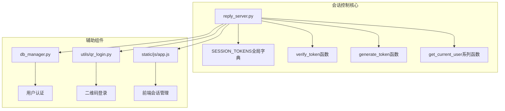
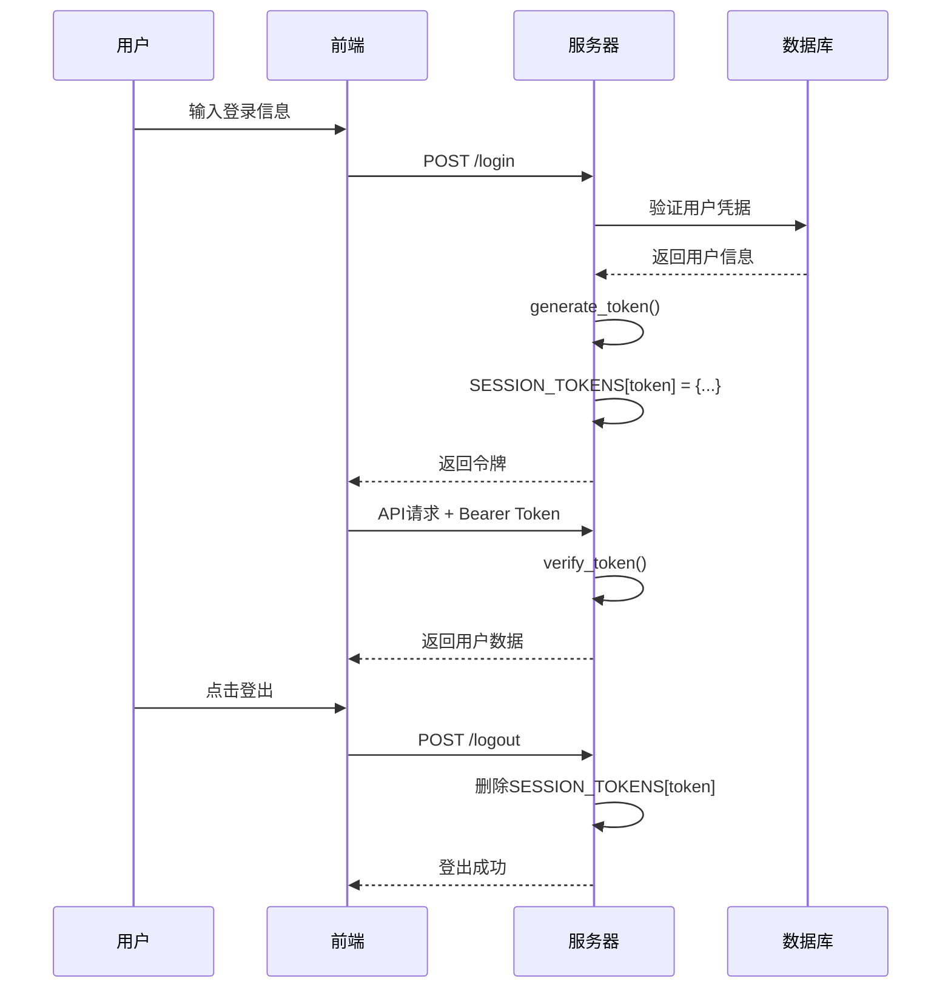
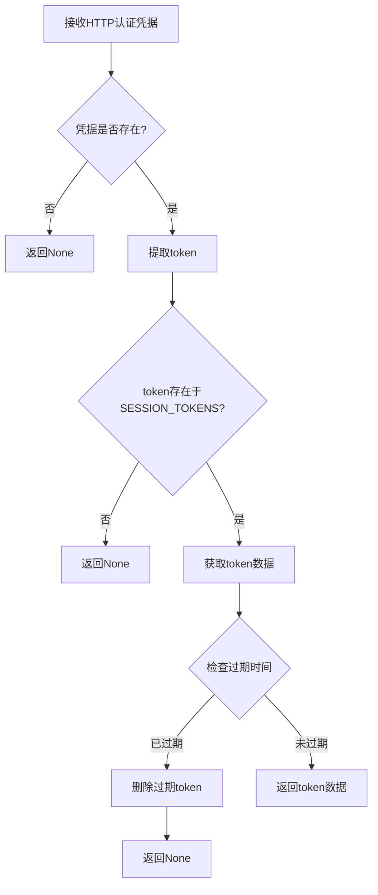
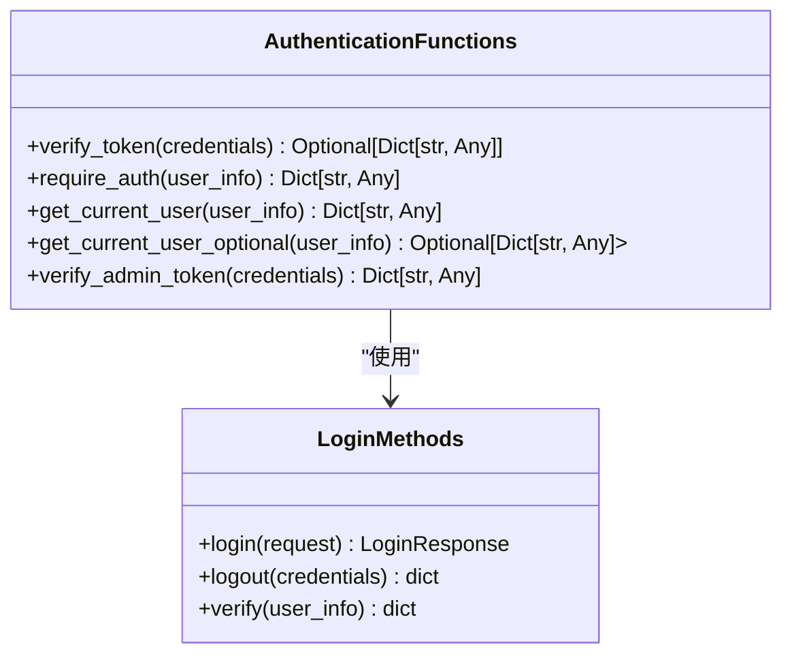
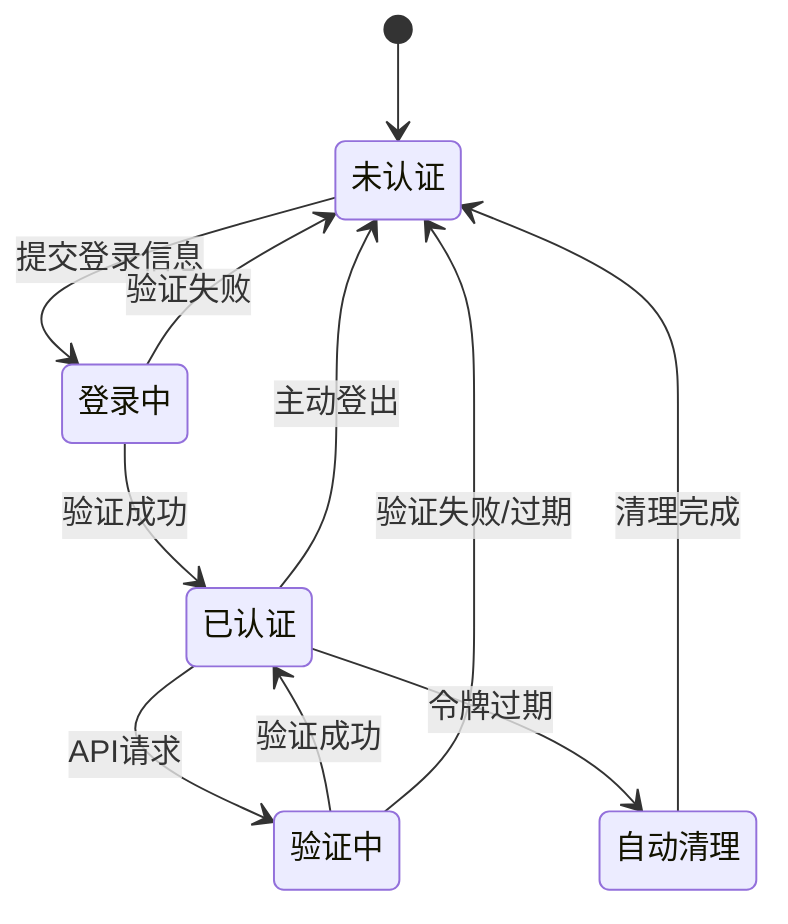
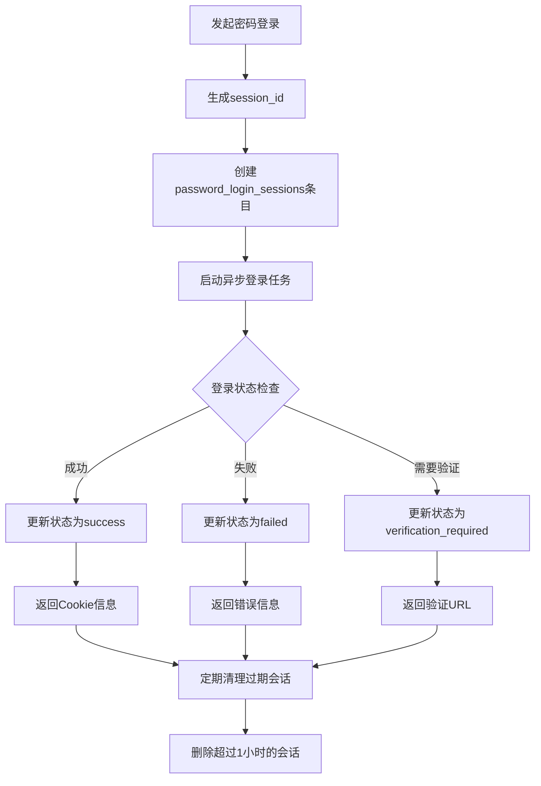
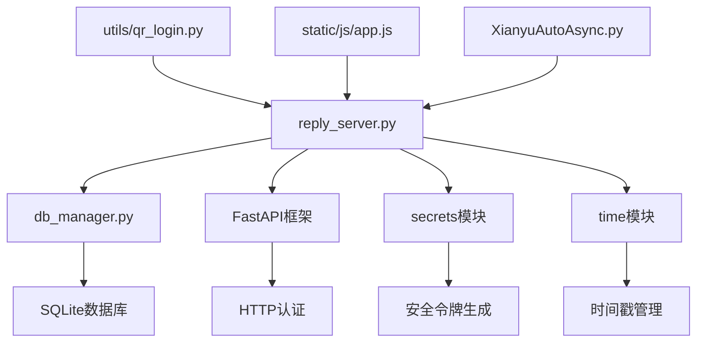

# 会话控制

<cite>
**本文档中引用的文件**
- [reply_server.py](file://reply_server.py)
- [db_manager.py](file://db_manager.py)
- [utils/qr_login.py](file://utils/qr_login.py)
- [static/js/app.js](file://static/js/app.js)
- [static/login.html](file://static/login.html)
- [XianyuAutoAsync.py](file://XianyuAutoAsync.py)
- [order_status_handler.py](file://order_status_handler.py)
</cite>

## 目录
1. [简介](#简介)
2. [项目结构](#项目结构)
3. [核心组件](#核心组件)
4. [架构概览](#架构概览)
5. [详细组件分析](#详细组件分析)
6. [依赖关系分析](#依赖关系分析)
7. [性能考虑](#性能考虑)
8. [故障排除指南](#故障排除指南)
9. [结论](#结论)

## 简介

本文档详细阐述了基于内存的会话管理系统，重点分析了SESSION_TOKENS全局字典的结构设计、令牌验证机制、以及完整的会话生命周期管理。该系统采用FastAPI框架构建，提供了多种登录方式（用户名密码、邮箱密码、验证码登录），并通过基于内存的令牌管理确保系统的安全性和性能。

## 项目结构

会话控制系统的核心文件组织如下：



**图表来源**
- [reply_server.py](file://reply_server.py#L44-L46)
- [db_manager.py](file://db_manager.py#L98-L124)
- [utils/qr_login.py](file://utils/qr_login.py#L45-L451)

**章节来源**
- [reply_server.py](file://reply_server.py#L1-L50)

## 核心组件

### SESSION_TOKENS全局字典

SESSION_TOKENS是一个全局字典，用于存储活跃的用户会话令牌。其结构设计简洁而高效：

| 字段 | 类型 | 描述 |
|------|------|------|
| token | string | 唯一的随机令牌，使用secrets模块生成 |
| user_id | int | 用户唯一标识符 |
| username | string | 用户名 |
| timestamp | float | 令牌创建时间戳 |

### TOKEN_EXPIRE_TIME常量

系统定义了24小时的令牌过期时间，确保会话的安全性：

| 常量 | 值 | 单位 | 描述 |
|------|-----|------|------|
| TOKEN_EXPIRE_TIME | 24 * 60 * 60 | 秒 | 令牌有效期，24小时 |

**章节来源**
- [reply_server.py](file://reply_server.py#L44-L46)

## 架构概览

会话控制系统采用基于内存的令牌管理架构，提供完整的认证和授权机制：



**图表来源**
- [reply_server.py](file://reply_server.py#L541-L680)
- [static/js/app.js](file://static/js/app.js#L7098-L7170)

## 详细组件分析

### generate_token函数

generate_token函数负责生成安全的随机令牌，使用Python标准库的secrets模块确保安全性：

```mermaid
flowchart TD
A[调用generate_token] --> B[secrets.token_urlsafe(32)]
B --> C[生成32字节安全随机字符串]
C --> D[返回URL安全的Base64编码]
D --> E[32字符长的随机令牌]
```

**图表来源**
- [reply_server.py](file://reply_server.py#L177-L181)

**章节来源**
- [reply_server.py](file://reply_server.py#L177-L181)

### verify_token函数

verify_token函数实现了完整的令牌验证逻辑，包括存在性检查、过期时间验证和自动清理机制：



**图表来源**
- [reply_server.py](file://reply_server.py#L183-L199)

**章节来源**
- [reply_server.py](file://reply_server.py#L183-L199)

### get_current_user和get_current_user_optional函数

这两个依赖函数提供了不同级别的用户信息获取能力：

| 函数 | 参数类型 | 返回类型 | 使用场景 |
|------|----------|----------|----------|
| get_current_user | Dict[str, Any] | Dict[str, Any] | 需要严格认证的接口 |
| get_current_user_optional | Optional[Dict[str, Any]] | Optional[Dict[str, Any]] | 可选认证的接口 |



**图表来源**
- [reply_server.py](file://reply_server.py#L214-L229)
- [reply_server.py](file://reply_server.py#L541-L680)

**章节来源**
- [reply_server.py](file://reply_server.py#L214-L229)

### 会话生命周期管理

系统提供了完整的会话生命周期管理，包括登录、验证、自动清理和登出：



**章节来源**
- [reply_server.py](file://reply_server.py#L541-L680)

### 密码登录会话管理

系统还提供了专门的密码登录会话管理机制，用于处理复杂的账号密码登录流程：



**图表来源**
- [reply_server.py](file://reply_server.py#L1739-L1773)
- [static/js/app.js](file://static/js/app.js#L7098-L7170)

**章节来源**
- [reply_server.py](file://reply_server.py#L1739-L1773)

## 依赖关系分析

会话控制系统与其他组件的依赖关系：



**图表来源**
- [reply_server.py](file://reply_server.py#L1-L30)
- [db_manager.py](file://db_manager.py#L1-L50)

**章节来源**
- [reply_server.py](file://reply_server.py#L1-L30)
- [db_manager.py](file://db_manager.py#L98-L124)

## 性能考虑

### 内存优化策略

1. **自动过期清理**：系统会自动清理过期的会话令牌，防止内存泄漏
2. **定时清理机制**：定期检查和清理过期的二维码登录会话
3. **轻量级数据结构**：使用简单的字典结构存储会话信息，减少内存占用

### 安全性考虑

1. **安全令牌生成**：使用secrets模块生成加密安全的随机令牌
2. **24小时过期时间**：平衡用户体验和安全性
3. **严格的权限验证**：区分管理员和普通用户权限

## 故障排除指南

### 常见问题及解决方案

| 问题 | 症状 | 解决方案 |
|------|------|----------|
| 令牌过期 | API请求返回401错误 | 系统自动清理过期令牌，客户端需重新登录 |
| 内存泄漏 | 服务器内存持续增长 | 系统定期清理过期会话，监控内存使用情况 |
| 登录失败 | 用户无法登录 | 检查数据库连接和用户凭据验证逻辑 |
| 权限错误 | 管理员功能不可用 | 验证用户是否为admin账户 |

**章节来源**
- [reply_server.py](file://reply_server.py#L183-L199)
- [utils/qr_login.py](file://utils/qr_login.py#L429-L438)

## 结论

基于内存的会话管理系统为闲鱼自动回复系统提供了高效、安全的认证机制。通过SESSION_TOKENS全局字典的精心设计，结合自动过期清理和安全的令牌生成机制，系统能够在保证安全性的同时提供良好的用户体验。完善的依赖函数体系和会话生命周期管理确保了系统的稳定性和可维护性。

该系统的设计充分考虑了性能、安全性和可用性的平衡，为后续的功能扩展和优化奠定了坚实的基础。