# 权限管理

<cite>
**本文档引用的文件**
- [config.py](file://config.py)
- [db_manager.py](file://db_manager.py)
- [reply_server.py](file://reply_server.py)
- [static/js/app.js](file://static/js/app.js)
- [static/login.html](file://static/login.html)
- [static/index.html](file://static/index.html)
- [README.md](file://README.md)
</cite>

## 目录
1. [简介](#简介)
2. [系统架构概述](#系统架构概述)
3. [ADMIN_USERNAME常量详解](#admin_username常量详解)
4. [权限验证机制](#权限验证机制)
5. [LoginResponse模型中的is_admin字段](#loginresponse模型中的is_admin字段)
6. [前端权限控制](#前端权限控制)
7. [管理员权限应用场景](#管理员权限应用场景)
8. [权限控制流程图](#权限控制流程图)
9. [最佳实践与安全考虑](#最佳实践与安全考虑)
10. [故障排除指南](#故障排除指南)

## 简介

本系统采用基于用户名的简单权限控制机制，通过单一管理员账户实现系统级别的权限管理。该设计简化了权限体系，同时确保了核心管理功能的安全性。

系统的核心权限控制基于以下原则：
- **单一管理员模式**：系统只有一个管理员账户（默认用户名为`admin`）
- **基于用户名的身份验证**：通过用户名判断用户权限
- **前后端统一验证**：前端和后端都进行权限验证
- **细粒度权限控制**：不同管理功能有不同的权限要求

## 系统架构概述

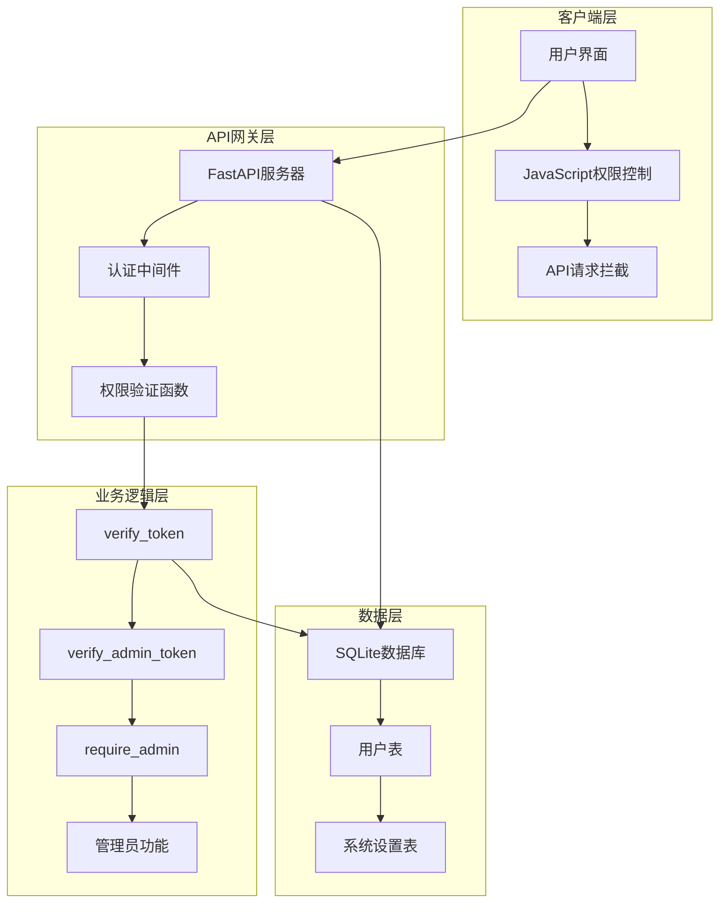

**图表来源**
- [reply_server.py](file://reply_server.py#L183-L212)
- [static/js/app.js](file://static/js/app.js#L1918-L1948)

## ADMIN_USERNAME常量详解

### 常量定义位置

ADMIN_USERNAME常量在`reply_server.py`文件中定义，位于第43行：

```python
ADMIN_USERNAME = "admin"
```

### 默认管理员账户配置

系统在数据库初始化过程中自动创建默认管理员账户：

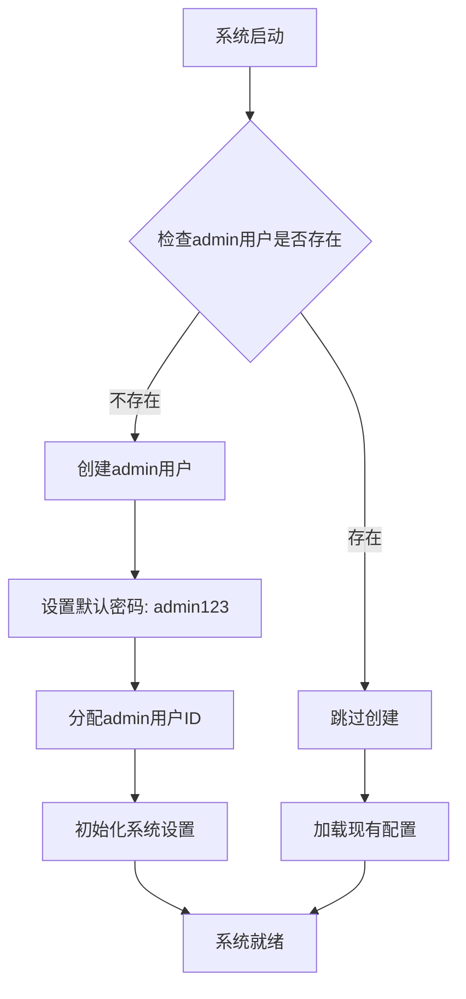

**图表来源**
- [db_manager.py](file://db_manager.py#L617-L628)

### 默认密码安全说明

系统提供了明确的安全警告：

| 安全级别 | 描述 | 建议操作 |
|---------|------|----------|
| 高风险 | 默认密码为`admin123` | 强烈建议立即修改 |
| 中风险 | 系统自动创建admin账户 | 应定期更换密码 |
| 低风险 | 支持多种登录方式 | 可选择邮箱密码或验证码登录 |

**章节来源**
- [README.md](file://README.md#L703-L712)
- [db_manager.py](file://db_manager.py#L617-L628)

## 权限验证机制

### verify_token函数实现

verify_token函数负责验证用户会话令牌的有效性：

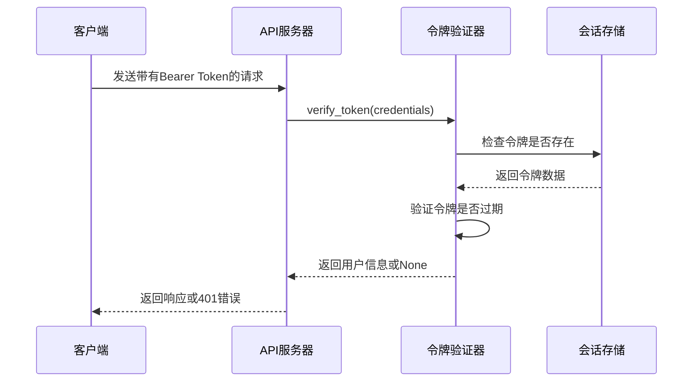

**图表来源**
- [reply_server.py](file://reply_server.py#L183-L199)

### verify_admin_token函数详解

verify_admin_token函数专门验证管理员身份：

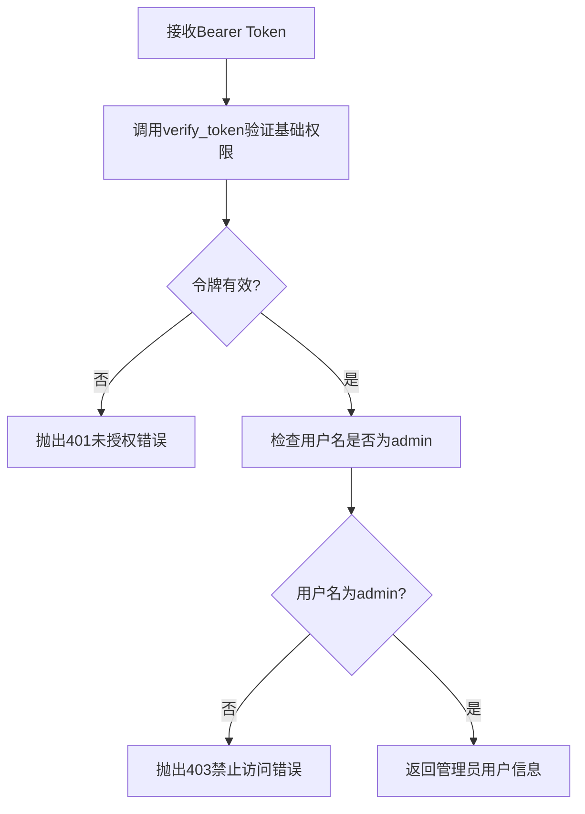

**图表来源**
- [reply_server.py](file://reply_server.py#L202-L212)

### require_admin函数实现

require_admin函数是最严格的权限验证：

```python
def require_admin(current_user: Dict[str, Any] = Depends(get_current_user)) -> Dict[str, Any]:
    """要求管理员权限"""
    if current_user['username'] != 'admin':
        raise HTTPException(status_code=403, detail="需要管理员权限")
    return current_user
```

**章节来源**
- [reply_server.py](file://reply_server.py#L239-L243)

## LoginResponse模型中的is_admin字段

### 字段定义与用途

LoginResponse模型包含is_admin字段，用于标识用户是否具有管理员权限：

```python
class LoginResponse(BaseModel):
    success: bool
    token: Optional[str] = None
    message: str
    user_id: Optional[int] = None
    username: Optional[str] = None
    is_admin: Optional[bool] = None
```

### 前端权限判断逻辑

前端通过检查is_admin字段决定显示哪些功能：

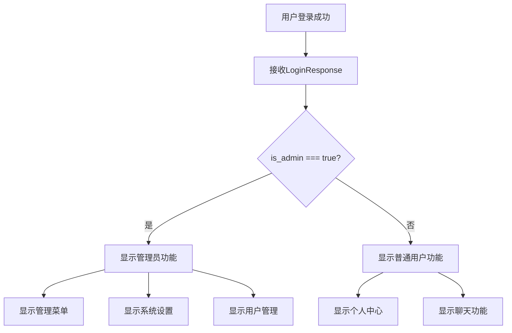

**图表来源**
- [static/js/app.js](file://static/js/app.js#L1923-L1941)

### 动态UI元素控制

系统根据管理员权限动态显示不同的UI元素：

| UI元素 | 管理员可见 | 普通用户可见 |
|--------|------------|--------------|
| 管理员菜单 | ✓ | ✗ |
| 系统设置 | ✓ | ✗ |
| 用户管理 | ✓ | ✗ |
| 备份管理 | ✓ | ✗ |
| API安全设置 | ✓ | ✗ |
| 个人设置 | ✗ | ✓ |
| 聊天功能 | ✗ | ✓ |

**章节来源**
- [static/js/app.js](file://static/js/app.js#L8340-L8356)

## 前端权限控制

### 权限验证流程

前端权限验证遵循以下流程：

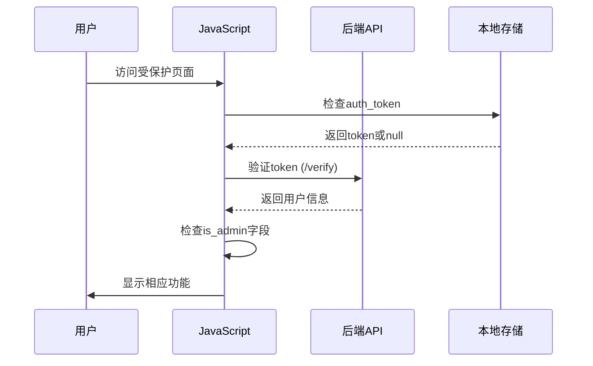

**图表来源**
- [static/js/app.js](file://static/js/app.js#L1918-L1948)

### 用户管理权限检查

用户管理功能的权限验证示例：

```javascript
async function loadUserManagement() {
    // 检查管理员权限
    try {
        const response = await fetch(`${apiBase}/verify`, {
            headers: {
                'Authorization': `Bearer ${authToken}`
            }
        });
        
        if (response.ok) {
            const result = await response.json();
            if (!result.is_admin) {
                showToast('您没有权限访问用户管理功能', 'danger');
                showSection('dashboard');
                return;
            }
        }
    } catch (error) {
        console.error('权限验证失败:', error);
        showToast('权限验证失败', 'danger');
        return;
    }
}
```

**章节来源**
- [static/js/app.js](file://static/js/app.js#L9442-L9469)

## 管理员权限应用场景

### 修改管理员密码

管理员密码修改功能展示了严格的权限控制：

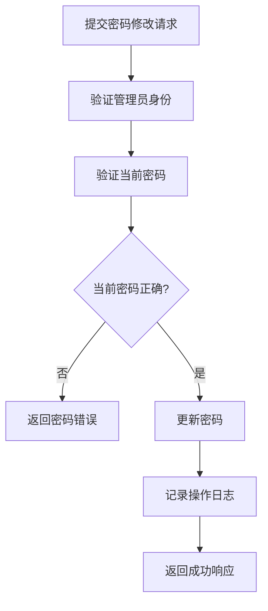

**图表来源**
- [reply_server.py](file://reply_server.py#L683-L705)

### 系统设置管理

管理员可以管理多个系统设置：

| 设置类别 | 功能描述 | 权限要求 |
|----------|----------|----------|
| 注册设置 | 控制用户注册开关 | 管理员权限 |
| 登录信息设置 | 控制默认登录信息显示 | 管理员权限 |
| API安全设置 | 管理API密钥和安全配置 | 管理员权限 |
| 主题设置 | 自定义系统主题颜色 | 管理员权限 |

### 用户管理功能

管理员拥有完整的用户管理权限：

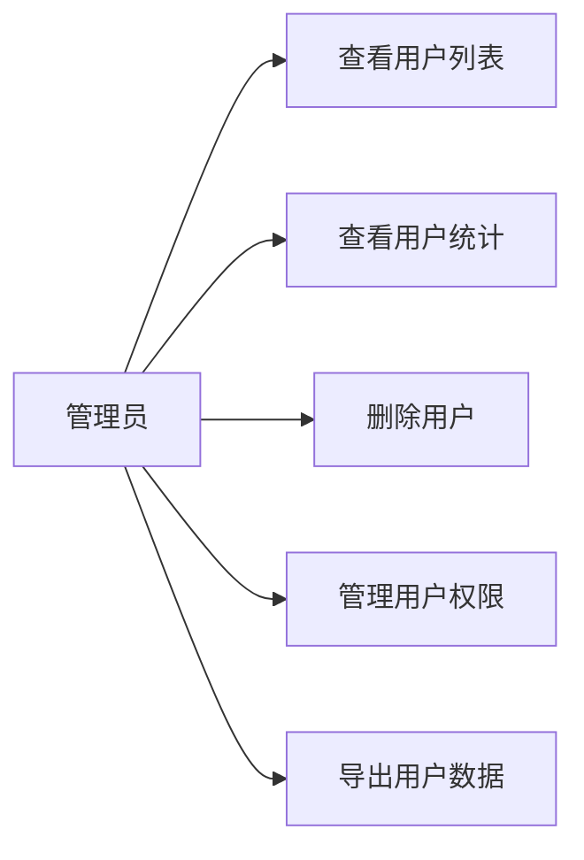

**章节来源**
- [reply_server.py](file://reply_server.py#L4427-L4460)
- [reply_server.py](file://reply_server.py#L4672-L4701)

## 权限控制流程图

### 完整的权限验证流程

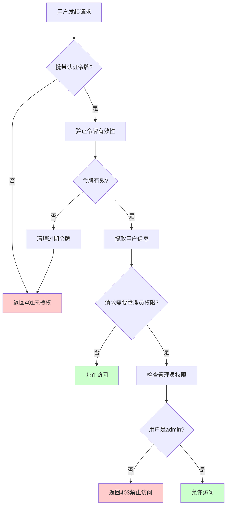

**图表来源**
- [reply_server.py](file://reply_server.py#L183-L212)
- [static/js/app.js](file://static/js/app.js#L1918-L1948)

### 请求到资源访问的完整流程

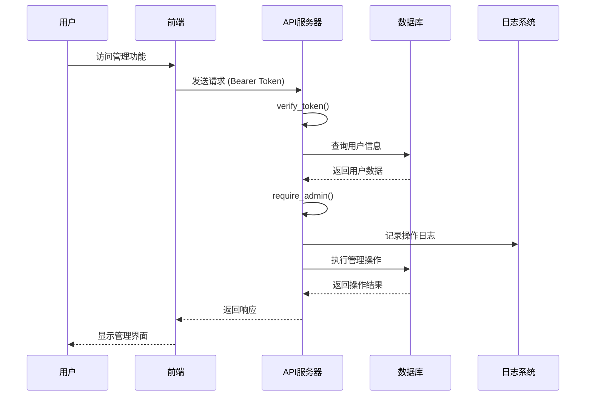

**图表来源**
- [reply_server.py](file://reply_server.py#L239-L243)
- [static/js/app.js](file://static/js/app.js#L9442-L9469)

## 最佳实践与安全考虑

### 密码安全管理

1. **强制修改默认密码**
   - 系统默认密码为`admin123`
   - 建议立即修改为强密码
   - 密码长度至少6位

2. **密码策略**
   - 新密码必须与确认密码一致
   - 密码强度建议包含字母和数字
   - 系统自动对密码进行哈希存储

### 会话管理

1. **令牌有效期**
   - 默认令牌有效期为24小时
   - 系统自动清理过期令牌
   - 支持令牌刷新机制

2. **安全传输**
   - 所有API请求必须使用HTTPS
   - 令牌通过Bearer认证头传输
   - 前端不直接存储明文密码

### 权限最小化原则

1. **功能权限分离**
   - 普通用户只能访问个人功能
   - 管理员才能访问系统管理功能
   - 每个管理功能都有独立的权限检查

2. **操作审计**
   - 所有管理员操作都会记录日志
   - 包括密码修改、系统设置变更等
   - 支持日志查询和导出

**章节来源**
- [reply_server.py](file://reply_server.py#L683-L705)
- [db_manager.py](file://db_manager.py#L617-L628)

## 故障排除指南

### 常见权限问题

| 问题症状 | 可能原因 | 解决方案 |
|----------|----------|----------|
| 无法登录管理员账户 | 密码错误或账户被禁用 | 检查密码或联系技术支持 |
| 管理员功能不可见 | 前端未正确识别管理员身份 | 清除浏览器缓存重新登录 |
| 权限验证失败 | 令牌过期或损坏 | 重新登录获取新令牌 |
| 管理员密码修改失败 | 当前密码输入错误 | 确认当前密码正确 |

### 调试步骤

1. **检查登录状态**
   ```javascript
   // 在浏览器控制台检查
   console.log(localStorage.getItem('auth_token'));
   console.log(JSON.parse(localStorage.getItem('user_info')));
   ```

2. **验证管理员身份**
   ```javascript
   // 检查is_admin字段
   const userInfo = JSON.parse(localStorage.getItem('user_info'));
   console.log('是否为管理员:', userInfo.is_admin);
   ```

3. **测试API权限**
   ```bash
   # 测试管理员权限
   curl -H "Authorization: Bearer YOUR_TOKEN" http://localhost:8000/verify
   ```

### 日志分析

系统提供详细的权限操作日志：

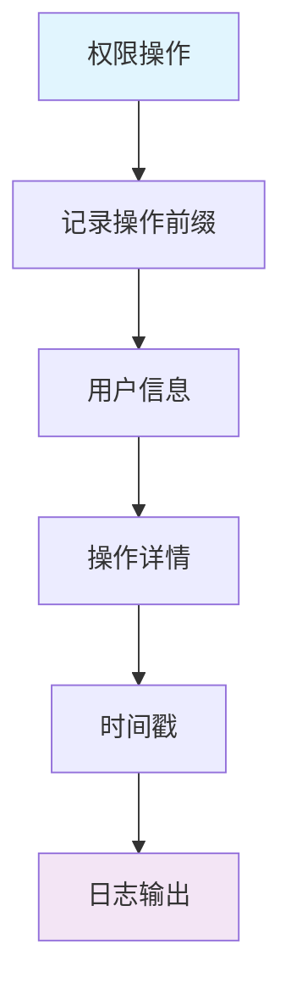

**章节来源**
- [reply_server.py](file://reply_server.py#L239-L243)
- [static/js/app.js](file://static/js/app.js#L1918-L1948)

## 总结

本系统的权限管理机制虽然简单，但设计合理且安全：

1. **简洁性**：基于用户名的单一管理员模式简化了权限体系
2. **安全性**：严格的权限验证和操作审计确保系统安全
3. **可用性**：清晰的权限分离使用户界面易于理解和使用
4. **可维护性**：模块化的权限控制便于扩展和维护

建议用户始终使用强密码并定期更换，以确保系统安全。对于生产环境，建议部署HTTPS并实施额外的安全措施。