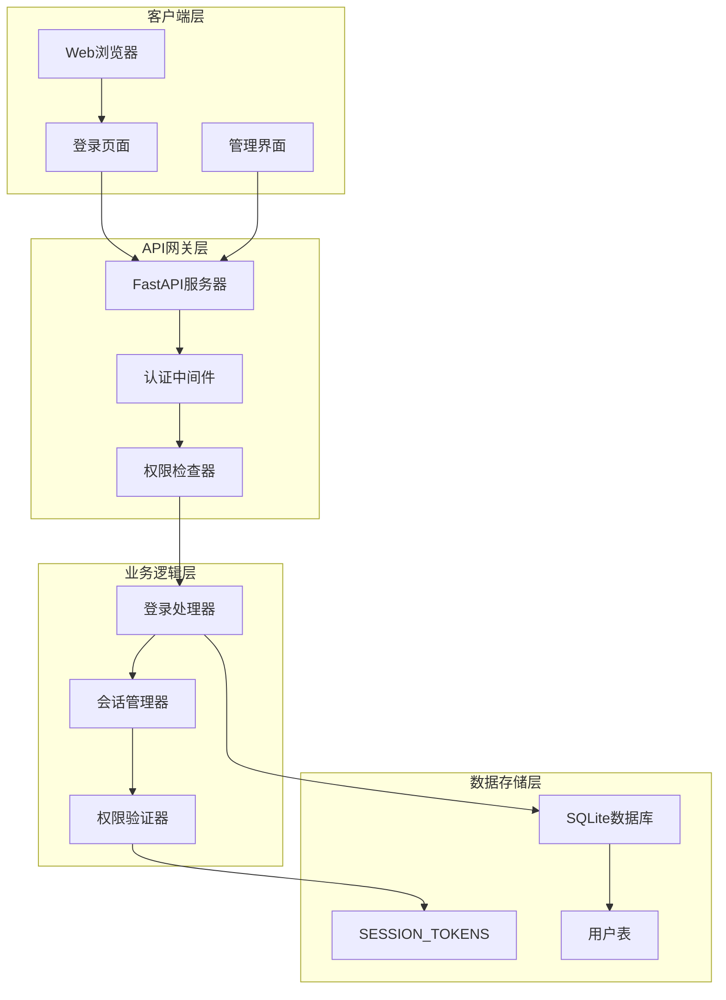
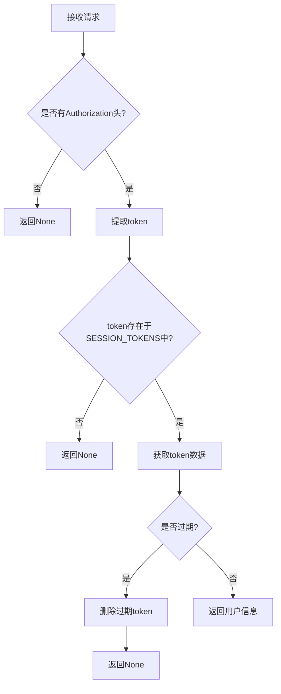
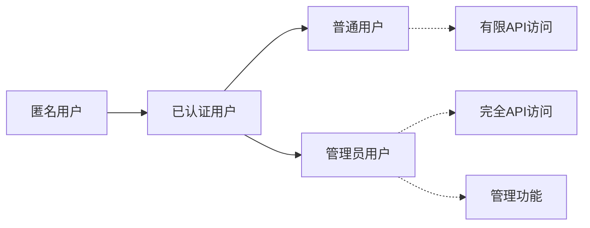
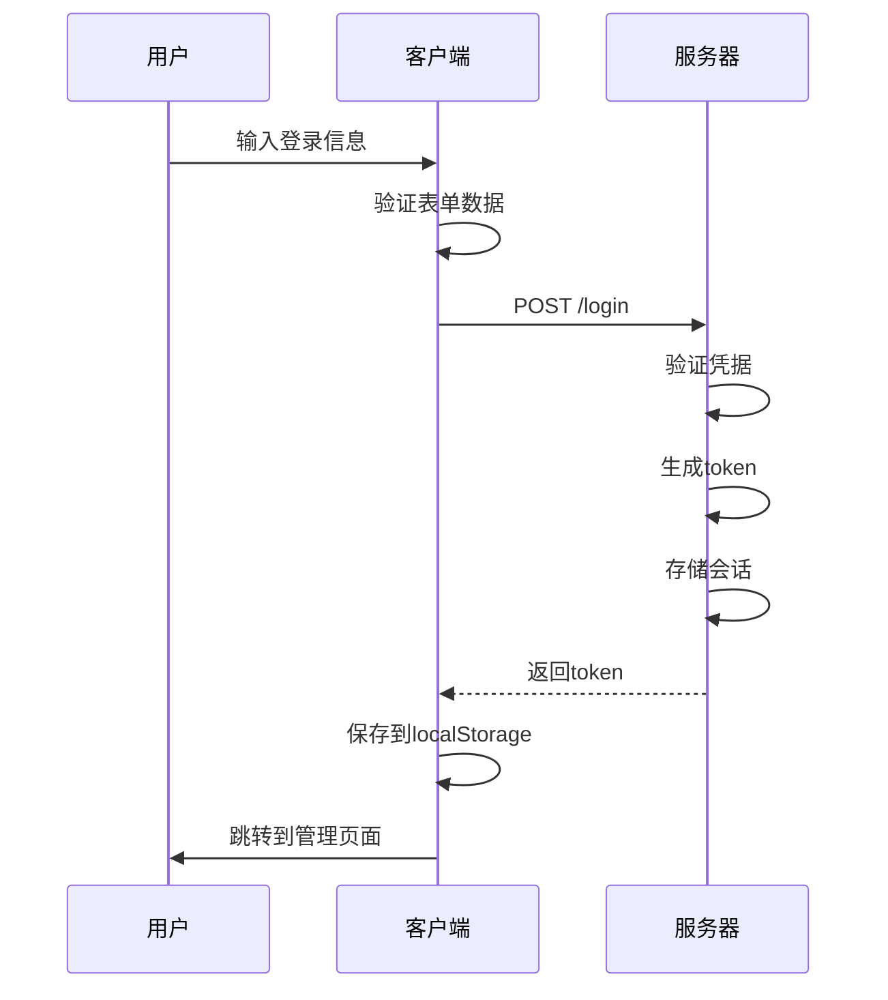

# 认证与权限控制

<cite>
**本文档引用的文件**
- [reply_server.py](file://reply_server.py)
- [db_manager.py](file://db_manager.py)
- [static/login.html](file://static/login.html)
- [static/js/app.js](file://static/js/app.js)
- [config.py](file://config.py)
- [README.md](file://README.md)
</cite>

## 目录
1. [概述](#概述)
2. [系统架构](#系统架构)
3. [核心组件](#核心组件)
4. [认证机制详解](#认证机制详解)
5. [权限控制体系](#权限控制体系)
6. [登录流程分析](#登录流程分析)
7. [API端点保护](#api端点保护)
8. [错误处理与故障排除](#错误处理与故障排除)
9. [安全最佳实践](#安全最佳实践)
10. [总结](#总结)

## 概述

本系统采用基于JWT（JSON Web Token）的会话管理机制，实现了完整的用户认证和权限控制系统。系统支持多种登录方式，包括用户名密码登录、邮箱密码登录和邮箱验证码登录，并提供了细粒度的权限控制机制，确保只有授权用户才能访问特定资源。

### 主要特性

- **多因素认证**：支持用户名密码、邮箱密码和邮箱验证码三种登录方式
- **会话管理**：基于内存的SESSION_TOKENS字典存储会话信息
- **权限分级**：区分普通用户和管理员权限
- **过期管理**：自动清理过期会话，最长24小时有效期
- **安全防护**：防止并发攻击和会话劫持

## 系统架构



**图表来源**
- [reply_server.py](file://reply_server.py#L308-L357)
- [db_manager.py](file://db_manager.py#L16-L51)

## 核心组件

### 1. 会话管理器 (SESSION_TOKENS)

系统使用全局字典`SESSION_TOKENS`作为内存存储，结构如下：

| 字段 | 类型 | 描述 |
|------|------|------|
| token | string | 唯一的访问令牌 |
| user_id | integer | 用户唯一标识符 |
| username | string | 用户名 |
| timestamp | float | 会话创建时间戳 |

### 2. 认证常量配置

| 常量 | 值 | 描述 |
|------|-----|------|
| ADMIN_USERNAME | "admin" | 管理员用户名 |
| TOKEN_EXPIRE_TIME | 24 * 60 * 60 | 令牌过期时间（24小时） |
| SECURITY | HTTPBearer | HTTP Bearer认证对象 |

### 3. 认证模型

系统定义了多个Pydantic模型来规范认证数据结构：

- **LoginRequest**: 登录请求模型
- **LoginResponse**: 登录响应模型  
- **ChangePasswordRequest**: 修改密码请求模型
- **RegisterRequest**: 用户注册请求模型

**章节来源**
- [reply_server.py](file://reply_server.py#L42-L46)
- [reply_server.py](file://reply_server.py#L112-L177)

## 认证机制详解

### 1. 令牌生成机制

系统使用`secrets.token_urlsafe(32)`生成安全的随机令牌：

```python
def generate_token() -> str:
    """生成随机token"""
    return secrets.token_urlsafe(32)
```

### 2. 令牌验证流程



**图表来源**
- [reply_server.py](file://reply_server.py#L183-L199)

### 3. 令牌过期检查

系统通过比较当前时间和token创建时间来判断是否过期：

```python
# 检查token是否过期
if time.time() - token_data['timestamp'] > TOKEN_EXPIRE_TIME:
    del SESSION_TOKENS[token]
    return None
```

### 4. 管理员权限验证

管理员权限验证包含两层检查：

1. **基础认证检查**: 验证token有效性
2. **权限级别检查**: 确认用户名为"admin"

```python
def verify_admin_token(credentials: Optional[HTTPAuthorizationCredentials] = Depends(security)) -> Dict[str, Any]:
    """验证管理员token"""
    user_info = verify_token(credentials)
    if not user_info:
        raise HTTPException(status_code=401, detail="未授权访问")
    
    # 检查是否是管理员
    if user_info['username'] != ADMIN_USERNAME:
        raise HTTPException(status_code=403, detail="需要管理员权限")
    
    return user_info
```

**章节来源**
- [reply_server.py](file://reply_server.py#L183-L212)

## 权限控制体系

### 1. 权限层级设计

系统采用简单的二层权限模型：



### 2. 权限检查装饰器

系统提供了多个权限检查装饰器：

| 装饰器 | 功能 | 返回类型 |
|--------|------|----------|
| `require_auth` | 基础认证检查 | 用户信息 |
| `verify_admin_token` | 管理员权限验证 | 管理员用户信息 |
| `get_current_user` | 获取当前用户 | 用户信息 |
| `get_current_user_optional` | 可选认证获取 | 用户信息或None |

### 3. 权限验证实现

```python
def require_auth(user_info: Optional[Dict[str, Any]] = Depends(verify_token)):
    """需要认证的依赖，返回用户信息"""
    if not user_info:
        raise HTTPException(status_code=401, detail="未授权访问")
    return user_info

def require_admin(current_user: Dict[str, Any] = Depends(get_current_user)) -> Dict[str, Any]:
    """要求管理员权限"""
    if current_user['username'] != 'admin':
        raise HTTPException(status_code=403, detail="需要管理员权限")
    return current_user
```

**章节来源**
- [reply_server.py](file://reply_server.py#L215-L243)

## 登录流程分析

### 1. 支持的登录方式

系统支持三种登录方式：

#### (1) 用户名密码登录
- **触发条件**: `request.username and request.password`
- **验证步骤**: 
  1. 验证用户名和密码
  2. 获取用户信息
  3. 生成并存储token

#### (2) 邮箱密码登录  
- **触发条件**: `request.email and request.password`
- **验证步骤**:
  1. 通过邮箱查找用户
  2. 验证密码
  3. 生成token

#### (3) 邮箱验证码登录
- **触发条件**: `request.email and request.verification_code`
- **验证步骤**:
  1. 验证邮箱验证码
  2. 获取用户信息
  3. 生成token

### 2. 客户端登录流程



**图表来源**
- [static/login.html](file://static/login.html#L368-L408)
- [reply_server.py](file://reply_server.py#L542-L659)

### 3. 登录响应结构

```python
class LoginResponse(BaseModel):
    success: bool
    token: Optional[str] = None
    message: str
    user_id: Optional[int] = None
    username: Optional[str] = None
    is_admin: Optional[bool] = None
```

### 4. 客户端令牌管理

客户端使用localStorage存储认证信息：

```javascript
// 保存token到localStorage
localStorage.setItem('auth_token', result.token);

// 保存用户信息到localStorage
const userInfo = {
    user_id: result.user_id,
    username: result.username,
    is_admin: result.is_admin
};
localStorage.setItem('user_info', JSON.stringify(userInfo));
```

**章节来源**
- [reply_server.py](file://reply_server.py#L120-L127)
- [static/login.html](file://static/login.html#L379-L388)

## API端点保护

### 1. 受保护的API端点

系统对以下类型的API端点实施权限保护：

#### (1) 管理员专用端点
- `/admin/users`: 用户管理
- `/admin/risk-control-logs`: 风控日志查看
- `/admin/cookies`: Cookie信息管理
- `/change-admin-password`: 管理员密码修改

#### (2) 需要认证的端点
- `/verify`: 令牌验证
- `/logout`: 退出登录

### 2. 权限保护实现

```python
# 管理员专用端点示例
@app.get('/admin/users')
def get_admin_users(admin_user: Dict[str, Any] = Depends(require_admin)):
    """获取所有用户信息（管理员专用）"""
    # 实现细节...
```

### 3. 权限检查中间件

系统在每个请求中自动执行权限检查：

```python
# 中间件示例
@security = HTTPBearer(auto_error=False)

def log_requests(request, call_next):
    # 获取用户信息
    auth_header = request.headers.get("Authorization")
    if auth_header and auth_header.startswith("Bearer "):
        token = auth_header.split(" ")[1]
        if token in SESSION_TOKENS:
            # 检查token是否过期
            token_data = SESSION_TOKENS[token]
            if time.time() - token_data['timestamp'] <= TOKEN_EXPIRE_TIME:
                user_info = f"【{token_data['username']}#{token_data['user_id']}】"
```

**章节来源**
- [reply_server.py](file://reply_server.py#L48-L51)
- [reply_server.py](file://reply_server.py#L331-L357)

## 错误处理与故障排除

### 1. 常见认证失败场景

| 场景 | 错误码 | 错误信息 | 解决方案 |
|------|--------|----------|----------|
| 令牌不存在 | 401 | 未授权访问 | 重新登录获取新令牌 |
| 令牌过期 | 401 | 未授权访问 | 重新登录获取新令牌 |
| 权限不足 | 403 | 需要管理员权限 | 使用管理员账户登录 |
| 用户名不存在 | 400 | 用户不存在 | 检查用户名拼写 |
| 密码错误 | 400 | 用户名或密码错误 | 重试密码输入 |
| 验证码错误 | 400 | 验证码错误或已过期 | 重新获取验证码 |

### 2. 错误处理机制

```python
# 通用错误处理示例
try:
    # API业务逻辑
    pass
except HTTPException as e:
    # 处理HTTP异常
    return {"success": False, "message": e.detail}
except Exception as e:
    # 处理其他异常
    logger.error(f"系统错误: {e}")
    return {"success": False, "message": "系统错误"}
```

### 3. 日志记录策略

系统为不同级别的认证事件记录详细日志：

```python
# 成功登录日志
logger.info(f"【{user['username']}#{user['id']}】登录成功（管理员）")

# 失败登录日志  
logger.warning(f"【{request.username}】登录失败：用户名或密码错误")

# 权限验证失败日志
logger.warning(f"【{user_info['username']}#{user_info['user_id']}】权限验证失败")
```

**章节来源**
- [reply_server.py](file://reply_server.py#L563-L567)
- [reply_server.py](file://reply_server.py#L578-L579)

## 安全最佳实践

### 1. 会话安全

- **令牌长度**: 使用32字节的安全随机令牌
- **过期机制**: 24小时自动过期清理
- **存储安全**: 内存中存储，避免持久化风险
- **并发控制**: 使用锁机制防止并发问题

### 2. 密码安全

- **存储加密**: 使用数据库内置的密码哈希机制
- **传输安全**: HTTPS传输所有敏感信息
- **暴力防护**: 实施验证码机制防止暴力破解

### 3. 网络安全

- **HTTPS强制**: 生产环境必须使用HTTPS
- **CORS配置**: 正确配置跨域资源共享
- **头部安全**: 设置安全的HTTP头部

### 4. 监控与审计

- **访问日志**: 记录所有认证相关活动
- **异常监控**: 监控异常登录行为
- **定期审查**: 定期审查用户权限和访问记录

## 总结

本系统的认证与权限控制机制具有以下特点：

### 优势

1. **简单高效**: 基于内存的会话管理，性能优异
2. **灵活扩展**: 支持多种登录方式和权限级别
3. **安全可靠**: 多层验证机制确保安全性
4. **易于维护**: 清晰的代码结构和完善的错误处理

### 改进建议

1. **持久化存储**: 考虑将SESSION_TOKENS持久化到数据库
2. **分布式支持**: 实现Redis等分布式缓存支持
3. **双因子认证**: 添加短信或邮箱二次验证
4. **审计日志**: 增强审计功能，记录更详细的访问信息

### 最佳实践要点

- 始终验证用户权限后再执行敏感操作
- 及时清理过期会话，保持系统清洁
- 使用HTTPS保护所有认证通信
- 定期更新和轮换管理员密码
- 监控异常认证行为，及时响应安全威胁

通过这套完整的认证与权限控制体系，系统能够有效保护用户数据和系统资源，为用户提供安全可靠的使用体验。