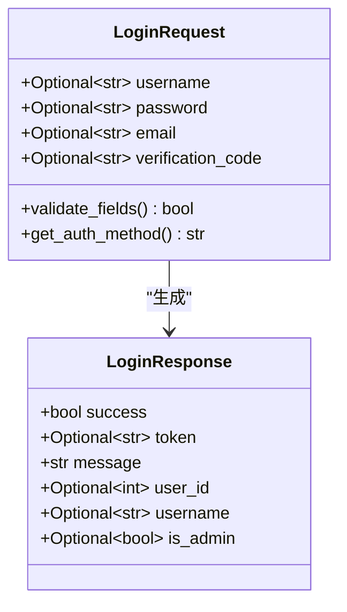
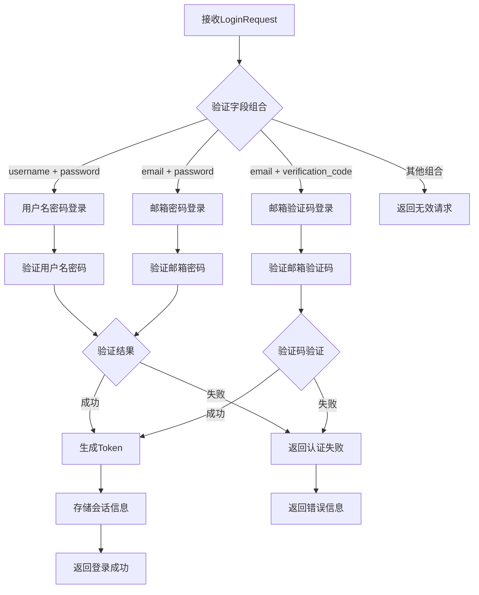
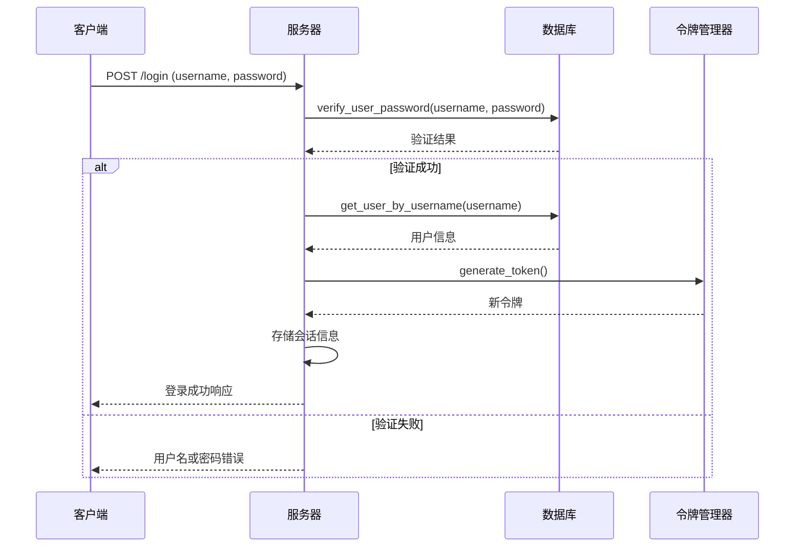
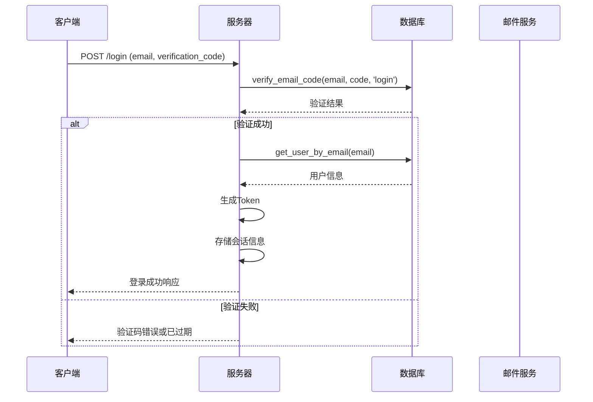
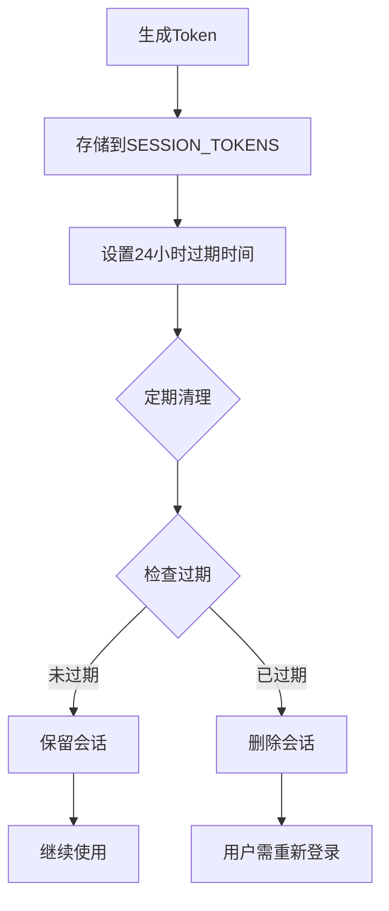
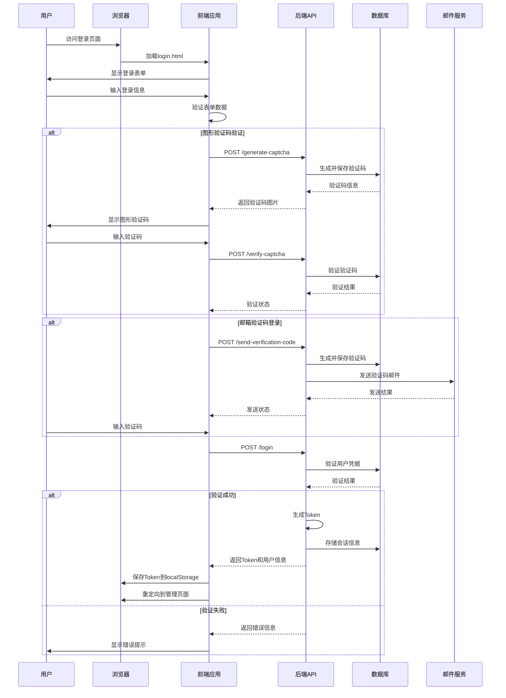

# 认证机制

<cite>
**本文档引用的文件**
- [reply_server.py](file://reply_server.py)
- [db_manager.py](file://db_manager.py)
- [static/login.html](file://static/login.html)
- [static/register.html](file://static/register.html)
- [utils/qr_login.py](file://utils/qr_login.py)
- [XianyuAutoAsync.py](file://XianyuAutoAsync.py)
- [utils/refresh_util.py](file://utils/refresh_util.py)
</cite>

## 目录
1. [简介](#简介)
2. [系统架构概览](#系统架构概览)
3. [认证方式详解](#认证方式详解)
4. [LoginRequest模型分析](#loginrequest模型分析)
5. [/login接口实现流程](#login接口实现流程)
6. [SESSION_TOKENS字典机制](#session_tokens字典机制)
7. [认证流程时序图](#认证流程时序图)
8. [常见认证失败场景](#常见认证失败场景)
9. [安全机制](#安全机制)
10. [故障排除指南](#故障排除指南)

## 简介

闲鱼自动回复系统的认证机制提供了三种主要的登录方式：用户名密码登录、邮箱密码登录和邮箱验证码登录。系统采用基于令牌的认证模式，通过SESSION_TOKENS字典管理用户会话，并实现了完善的验证码验证和密码哈希机制。

## 系统架构概览

```mermaid
graph TB
subgraph "客户端层"
A[Web界面] --> B[登录表单]
B --> C[图形验证码]
B --> D[邮箱验证码]
end
subgraph "API层"
E[FastAPI服务器] --> F[/login接口]
E --> G[/verify-captcha接口]
E --> H[/send-verification-code接口]
end
subgraph "业务逻辑层"
F --> I[LoginRequest验证]
F --> J[用户身份验证]
F --> K[令牌生成]
L[SESSION_TOKENS] --> M[会话管理]
end
subgraph "数据层"
N[SQLite数据库] --> O[users表]
N --> P[email_verifications表]
N --> Q[captcha_codes表]
end
A --> E
F --> L
J --> N
K --> L
```

**图表来源**
- [reply_server.py](file://reply_server.py#L542-L659)
- [db_manager.py](file://db_manager.py#L67-L2724)

## 认证方式详解

### 1. 用户名密码登录

这是最传统的认证方式，适用于系统管理员和普通用户。

**特点：**
- 使用用户名和密码进行身份验证
- 支持管理员和普通用户角色
- 密码采用SHA256哈希存储

**适用场景：**
- 系统管理员登录
- 普通用户首次登录
- 安全要求较高的场景

### 2. 邮箱密码登录

结合邮箱地址和密码进行认证，提供更便捷的用户体验。

**特点：**
- 使用邮箱地址和密码组合
- 支持多用户共享邮箱
- 与用户名密码登录共享用户数据

**适用场景：**
- 日常用户登录
- 移动设备登录
- 需要快速登录的场景

### 3. 邮箱验证码登录

基于一次性验证码的无密码认证方式，提供更高的安全性。

**特点：**
- 无需记忆密码
- 验证码有效期10分钟
- 支持图形验证码防护
- 实现无密码登录体验

**适用场景：**
- 移动设备扫码登录
- 临时访问需求
- 高安全要求场景

**章节来源**
- [reply_server.py](file://reply_server.py#L542-L659)
- [db_manager.py](file://db_manager.py#L2502-L2535)

## LoginRequest模型分析

LoginRequest是系统的核心认证模型，定义了三种认证方式的输入参数。



**图表来源**
- [reply_server.py](file://reply_server.py#L112-L127)

### 字段用途说明

| 字段 | 类型 | 是否必需 | 用途 |
|------|------|----------|------|
| username | Optional[str] | 否 | 用户名登录时使用 |
| password | Optional[str] | 否 | 密码登录时使用 |
| email | Optional[str] | 否 | 邮箱登录时使用 |
| verification_code | Optional[str] | 否 | 验证码登录时使用 |

### 验证逻辑

系统根据提供的字段组合判断认证方式：

1. **用户名密码登录**：当`username`和`password`同时存在时
2. **邮箱密码登录**：当`email`和`password`同时存在时  
3. **邮箱验证码登录**：当`email`和`verification_code`同时存在时
4. **无效请求**：其他任何组合都被视为无效

**章节来源**
- [reply_server.py](file://reply_server.py#L112-L127)
- [reply_server.py](file://reply_server.py#L542-L659)

## /login接口实现流程

/login接口是系统认证的核心入口，实现了三种认证方式的统一处理逻辑。



**图表来源**
- [reply_server.py](file://reply_server.py#L542-L659)

### 详细处理流程

#### 1. 用户名密码登录分支



**图表来源**
- [reply_server.py](file://reply_server.py#L547-L582)
- [db_manager.py](file://db_manager.py#L2502-L2535)

#### 2. 邮箱密码登录分支

邮箱密码登录与用户名密码登录类似，但使用邮箱地址作为标识。

#### 3. 邮箱验证码登录分支



**图表来源**
- [reply_server.py](file://reply_server.py#L615-L653)
- [db_manager.py](file://db_manager.py#L2677-L2705)

**章节来源**
- [reply_server.py](file://reply_server.py#L542-L659)

## SESSION_TOKENS字典机制

SESSION_TOKENS是一个全局字典，用于存储活跃的用户会话信息。

### 数据结构

```python
SESSION_TOKENS = {
    "generated_token_1": {
        "user_id": 1,
        "username": "admin",
        "timestamp": 1640995200.0
    },
    "generated_token_2": {
        "user_id": 2,
        "username": "user1",
        "timestamp": 1640995300.0
    }
}
```

### 字段说明

| 字段 | 类型 | 描述 |
|------|------|------|
| user_id | int | 用户唯一标识符 |
| username | str | 用户名 |
| timestamp | float | 会话创建时间戳 |

### 会话生命周期管理



**图表来源**
- [reply_server.py](file://reply_server.py#L45-L46)
- [reply_server.py](file://reply_server.py#L183-L198)

### Token验证机制

系统通过`verify_token`函数验证令牌的有效性：

1. 检查令牌是否存在
2. 验证令牌是否过期（24小时）
3. 返回用户信息或None

**章节来源**
- [reply_server.py](file://reply_server.py#L45-L46)
- [reply_server.py](file://reply_server.py#L178-L198)

## 认证流程时序图

以下是完整的认证流程时序图，展示了从客户端请求到服务器验证再到令牌生成的全过程。



**图表来源**
- [static/login.html](file://static/login.html#L296-L379)
- [reply_server.py](file://reply_server.py#L542-L659)
- [db_manager.py](file://db_manager.py#L2539-L2705)

## 常见认证失败场景

### 1. 用户名或密码错误

**错误码：** 401 Unauthorized  
**原因：**
- 用户名不存在
- 密码不正确
- 账户被禁用

**解决方案：**
- 检查用户名拼写
- 确认密码正确性
- 联系管理员启用账户

### 2. 邮箱或密码错误

**错误码：** 401 Unauthorized  
**原因：**
- 邮箱地址不存在
- 密码不匹配
- 账户状态异常

**解决方案：**
- 确认邮箱地址正确
- 检查密码输入
- 验证账户激活状态

### 3. 验证码错误或已过期

**错误码：** 400 Bad Request  
**原因：**
- 验证码输入错误
- 验证码已过期（10分钟）
- 验证码已被使用

**解决方案：**
- 重新获取验证码
- 检查邮箱收件箱
- 确保及时使用验证码

### 4. 用户不存在

**错误码：** 400 Bad Request  
**原因：**
- 邮箱未注册
- 用户账户被删除

**解决方案：**
- 使用正确的邮箱地址
- 联系管理员确认账户状态

### 5. 图形验证码验证失败

**错误码：** 400 Bad Request  
**原因：**
- 图形验证码输入错误
- 图形验证码已过期
- 图形验证码被多次尝试失败

**解决方案：**
- 重新输入图形验证码
- 刷新验证码图片
- 检查验证码输入格式

### 6. 令牌过期

**错误码：** 401 Unauthorized  
**原因：**
- 令牌有效期已过（24小时）
- 会话被手动清除

**解决方案：**
- 重新登录获取新令牌
- 检查本地存储的令牌状态

**章节来源**
- [reply_server.py](file://reply_server.py#L578-L659)
- [db_manager.py](file://db_manager.py#L2677-L2705)

## 安全机制

### 1. 密码安全

- **哈希存储**：密码使用SHA256算法进行哈希存储
- **盐值**：虽然示例中未显式添加盐值，但哈希算法本身提供了一定的安全性
- **传输加密**：所有认证数据通过HTTPS传输

### 2. 验证码安全

- **时效性**：图形验证码5分钟过期，邮箱验证码10分钟过期
- **防刷机制**：验证码验证成功后立即删除，防止重复使用
- **随机性**：验证码使用随机字符生成，增加破解难度

### 3. 会话安全

- **令牌随机性**：使用secrets模块生成高随机性的令牌
- **过期机制**：会话24小时自动过期
- **内存存储**：会话信息仅存储在内存中，不持久化

### 4. 防护措施

- **频率限制**：通过验证码机制限制暴力破解
- **并发控制**：使用锁机制防止并发攻击
- **日志记录**：记录所有认证尝试，便于审计

**章节来源**
- [db_manager.py](file://db_manager.py#L2502-L2535)
- [reply_server.py](file://reply_server.py#L178-L198)

## 故障排除指南

### 常见问题诊断

#### 1. 登录页面无法加载

**症状：** 访问登录页面时出现404错误

**排查步骤：**
1. 检查静态文件目录是否存在
2. 确认login.html文件存在于static目录
3. 验证服务器静态文件配置

**解决方案：**
```bash
# 检查目录权限
ls -la static/

# 确保文件存在
ls -la static/login.html
```

#### 2. 图形验证码显示异常

**症状：** 图形验证码图片无法显示或显示乱码

**排查步骤：**
1. 检查PIL库是否正确安装
2. 验证字体文件是否存在
3. 确认base64编码正常

**解决方案：**
```bash
# 安装必要的依赖
pip install pillow

# 检查字体文件
ls /usr/share/fonts/
```

#### 3. 邮箱验证码发送失败

**症状：** 验证码发送成功但用户未收到邮件

**排查步骤：**
1. 检查SMTP配置
2. 验证邮件服务器连接
3. 确认邮箱地址格式正确

**解决方案：**
```python
# 检查SMTP配置
from db_manager import db_manager
smtp_server = db_manager.get_system_setting('smtp_server')
print(f"SMTP服务器: {smtp_server}")
```

#### 4. 令牌验证失败

**症状：** 登录成功但后续请求返回401错误

**排查步骤：**
1. 检查令牌是否正确存储
2. 验证令牌格式
3. 确认会话未过期

**解决方案：**
```javascript
// 检查本地存储的令牌
console.log(localStorage.getItem('auth_token'));
```

### 性能优化建议

#### 1. 数据库优化

- **索引优化**：确保users表的username和email字段有索引
- **连接池**：使用连接池管理数据库连接
- **查询优化**：优化认证相关的SQL查询

#### 2. 缓存策略

- **验证码缓存**：将验证码信息缓存在内存中
- **用户信息缓存**：缓存频繁访问的用户信息
- **会话缓存**：使用Redis等外部缓存存储会话信息

#### 3. 并发处理

- **锁机制**：使用适当的锁机制防止并发问题
- **异步处理**：对于耗时操作使用异步处理
- **资源限制**：设置合理的并发连接数限制

**章节来源**
- [db_manager.py](file://db_manager.py#L16-L2724)
- [reply_server.py](file://reply_server.py#L542-L659)