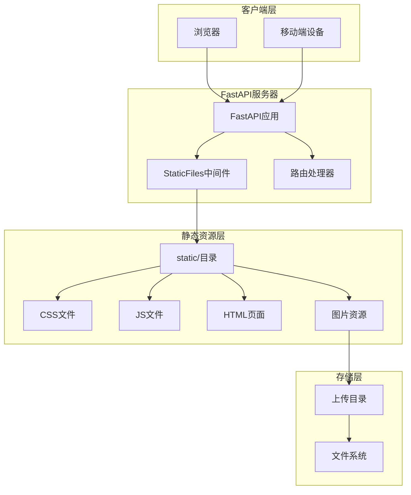
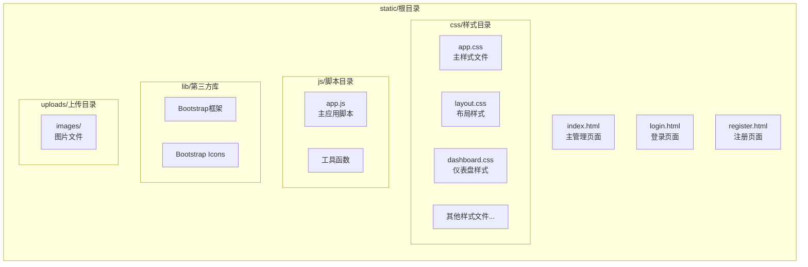
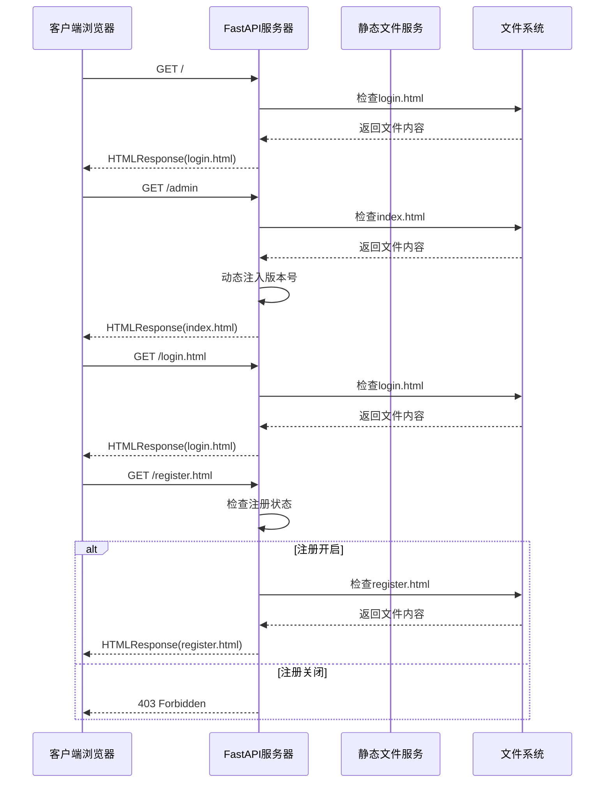
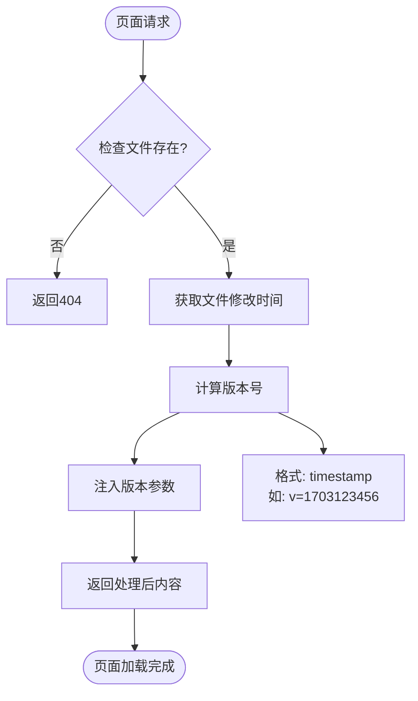
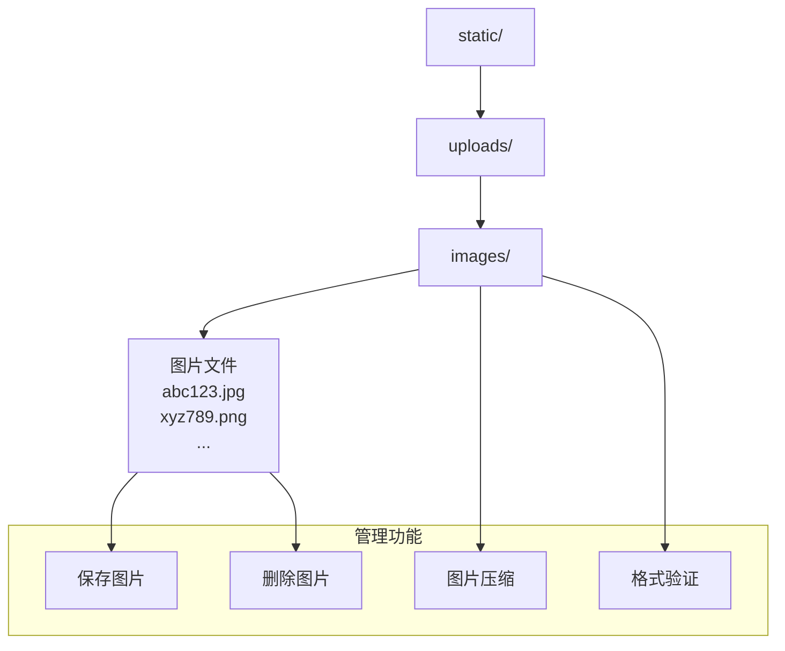
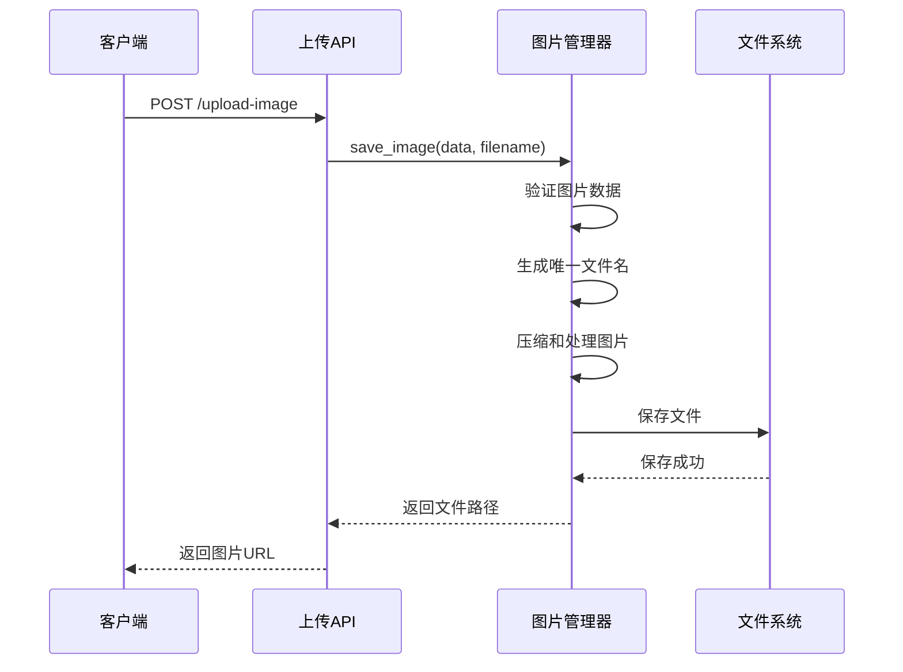
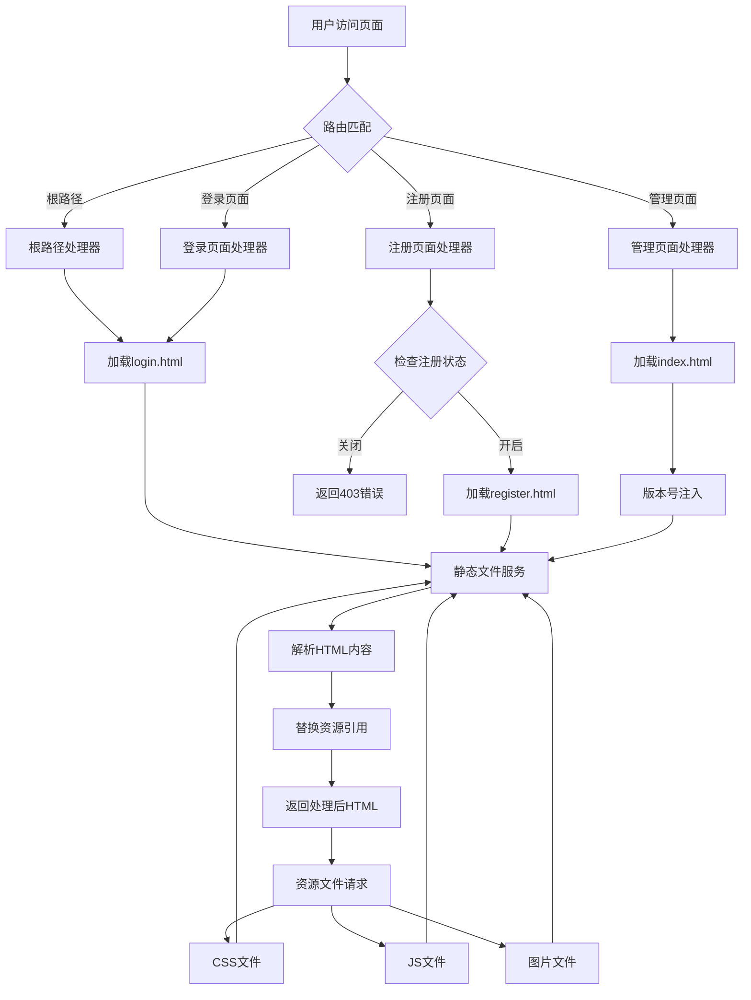
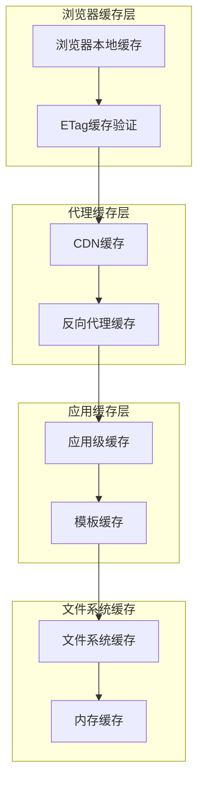

# 静态资源与前端集成

<cite>
**本文档中引用的文件**
- [Start.py](file://Start.py)
- [XianyuAutoAsync.py](file://XianyuAutoAsync.py)
- [reply_server.py](file://reply_server.py)
- [static/index.html](file://static/index.html)
- [static/login.html](file://static/login.html)
- [static/register.html](file://static/register.html)
- [static/js/app.js](file://static/js/app.js)
- [utils/image_uploader.py](file://utils/image_uploader.py)
- [utils/image_utils.py](file://utils/image_utils.py)
</cite>

## 目录
1. [项目概述](#项目概述)
2. [静态文件服务架构](#静态文件服务架构)
3. [FastAPI静态文件配置](#fastapi静态文件配置)
4. [前端页面集成机制](#前端页面集成机制)
5. [版本控制与缓存策略](#版本控制与缓存策略)
6. [图片上传目录管理](#图片上传目录管理)
7. [资源加载流程分析](#资源加载流程分析)
8. [性能优化策略](#性能优化策略)
9. [故障排除指南](#故障排除指南)

## 项目概述

本项目是一个基于FastAPI的闲鱼自动回复管理系统，采用前后端分离架构，通过FastAPI的StaticFiles类提供静态文件服务，实现了完整的前端页面渲染和资源管理功能。

### 核心特性
- **静态文件服务**：通过FastAPI提供CSS、JS、HTML等静态资源
- **版本控制机制**：基于文件修改时间的动态版本号注入
- **图片上传管理**：完整的图片上传、存储和访问机制
- **浏览器缓存优化**：智能的缓存策略避免资源重复下载
- **响应式设计**：适配移动端和桌面端的统一界面

## 静态文件服务架构

### 整体架构图



**图表来源**
- [reply_server.py](file://reply_server.py#L360-L372)
- [Start.py](file://Start.py#L1-L50)

### 目录结构分析

项目静态资源组织采用层次化结构：



**节来源**
- [static/index.html](file://static/index.html#L1-L50)
- [static/login.html](file://static/login.html#L1-L50)
- [static/register.html](file://static/register.html#L1-L50)

## FastAPI静态文件配置

### 核心配置实现

FastAPI通过StaticFiles类提供静态文件服务，配置简洁高效：

```python
# 静态文件目录配置
static_dir = os.path.join(os.path.dirname(__file__), 'static')
if not os.path.exists(static_dir):
    os.makedirs(static_dir, exist_ok=True)

# 挂载静态文件服务
app.mount('/static', StaticFiles(directory=static_dir), name='static')
```

### 配置特点分析

1. **绝对路径处理**：使用`os.path.dirname(__file__)`确保路径正确性
2. **目录自动创建**：`exist_ok=True`参数确保目录不存在时自动创建
3. **命名空间隔离**：通过`/static`前缀避免路由冲突
4. **性能优化**：FastAPI内置的静态文件服务经过优化，支持缓存和压缩

**节来源**
- [reply_server.py](file://reply_server.py#L360-L366)

### 图片上传目录配置

除了常规静态文件，项目还专门配置了图片上传目录：

```python
# 图片上传目录配置
uploads_dir = os.path.join(static_dir, 'uploads', 'images')
if not os.path.exists(uploads_dir):
    os.makedirs(uploads_dir, exist_ok=True)
    logger.info(f"创建图片上传目录: {uploads_dir}")
```

**节来源**
- [reply_server.py](file://reply_server.py#L367-L372)

## 前端页面集成机制

### 页面路由映射

项目通过FastAPI路由系统实现前端页面的动态加载：



**图表来源**
- [reply_server.py](file://reply_server.py#L421-L440)
- [reply_server.py](file://reply_server.py#L481-L524)

### 页面加载机制详解

#### 根路径重定向
```python
@app.get('/', response_class=HTMLResponse)
async def root():
    login_path = os.path.join(static_dir, 'login.html')
    if os.path.exists(login_path):
        with open(login_path, 'r', encoding='utf-8') as f:
            return HTMLResponse(f.read())
    else:
        return HTMLResponse('<h3>Login page not found</h3>')
```

#### 管理页面动态处理
管理页面(`/admin`)采用动态处理机制，实现实时版本控制：

```python
@app.get('/admin', response_class=HTMLResponse)
async def admin_page():
    index_path = os.path.join(static_dir, 'index.html')
    if not os.path.exists(index_path):
        return HTMLResponse('<h3>No front-end found</h3>')
    
    # 获取静态文件的修改时间作为版本号
    def get_file_version(file_path, default='1.0.0'):
        if os.path.exists(file_path):
            try:
                mtime = os.path.getmtime(file_path)
                return str(int(mtime))
            except Exception as e:
                logger.warning(f"获取文件 {file_path} 修改时间失败: {e}")
        return default
    
    app_js_path = os.path.join(static_dir, 'js', 'app.js')
    app_css_path = os.path.join(static_dir, 'css', 'app.css')
    
    js_version = get_file_version(app_js_path, '2.2.0')
    css_version = get_file_version(app_css_path, '1.0.0')
    
    # 动态替换版本号
    html_content = re.sub(js_pattern, js_new_url, html_content)
    html_content = re.sub(css_pattern, css_new_url, html_content)
```

**节来源**
- [reply_server.py](file://reply_server.py#L421-L430)
- [reply_server.py](file://reply_server.py#L481-L524)

### 前端资源引用规范

前端页面严格遵循FastAPI静态文件服务的路径规范：

#### CSS文件引用
```html
<link rel="stylesheet" href="/static/lib/bootstrap/bootstrap.min.css">
<link rel="stylesheet" href="/static/lib/bootstrap-icons/bootstrap-icons.css">
<link rel="stylesheet" href="/static/css/app.css">
```

#### JavaScript文件引用
```html
<script src="/static/lib/bootstrap/bootstrap.bundle.min.js"></script>
<script src="/static/js/app.js?v=1234567890"></script>
```

#### 图片资源引用
```html

```

**节来源**
- [static/index.html](file://static/index.html#L7-L11)
- [static/login.html](file://static/login.html#L7-L8)

## 版本控制与缓存策略

### 版本控制机制

项目采用基于文件修改时间的智能版本控制系统，有效解决浏览器缓存问题：



**图表来源**
- [reply_server.py](file://reply_server.py#L488-L520)

### 版本号生成算法

版本号基于文件的最后修改时间生成：

```python
def get_file_version(file_path, default='1.0.0'):
    """获取文件的版本号（基于修改时间）"""
    if os.path.exists(file_path):
        try:
            mtime = os.path.getmtime(file_path)
            return str(int(mtime))
        except Exception as e:
            logger.warning(f"获取文件 {file_path} 修改时间失败: {e}")
    return default
```

### 动态版本注入流程

1. **文件扫描**：扫描目标HTML文件中的资源引用
2. **正则匹配**：使用正则表达式识别现有的版本参数
3. **版本更新**：根据文件修改时间生成新的版本号
4. **内容替换**：替换HTML中的资源URL

```python
# JavaScript版本号替换
js_pattern = r'/static/js/app\.js\?v=[^"\'\s>]+'
js_new_url = f'/static/js/app.js?v={js_version}'
html_content = re.sub(js_pattern, js_new_url, html_content)

# CSS版本号替换
css_pattern = r'/static/css/app\.css(\?v=[^"\'\s>]+)?'
css_new_url = f'/static/css/app.css?v={css_version}'
html_content = re.sub(css_pattern, css_new_url, html_content)
```

**节来源**
- [reply_server.py](file://reply_server.py#L488-L520)

### 缓存策略优化

#### 浏览器缓存控制
- **长期缓存**：CSS和JS文件设置长期缓存策略
- **即时更新**：HTML文件不设置缓存或使用协商缓存
- **条件请求**：支持ETag和Last-Modified头部

#### CDN友好设计
- **版本化URL**：通过版本号实现资源的完全隔离
- **内容校验**：基于文件哈希的资源完整性验证
- **增量更新**：只更新变更的资源文件

## 图片上传目录管理

### 目录结构设计

项目采用分层的图片上传目录结构：



**图表来源**
- [utils/image_utils.py](file://utils/image_utils.py#L11-L33)
- [utils/image_uploader.py](file://utils/image_uploader.py#L11-L41)

### 图片管理器实现

#### ImageManager类功能
```python
class ImageManager:
    """图片管理器，负责图片的保存、压缩和访问"""
    
    def __init__(self, upload_dir: str = "static/uploads/images"):
        self.upload_dir = upload_dir
        self.max_size = 5 * 1024 * 1024  # 5MB
        self.max_width = 1920
        self.max_height = 1080
        self.allowed_formats = {'JPEG', 'PNG', 'GIF', 'WEBP'}
        
        # 确保上传目录存在
        self._ensure_upload_dir()
```

#### 目录创建机制
```python
def _ensure_upload_dir(self):
    """确保上传目录存在"""
    try:
        os.makedirs(self.upload_dir, exist_ok=True)
        logger.info(f"图片上传目录已准备: {self.upload_dir}")
    except Exception as e:
        logger.error(f"创建图片上传目录失败: {e}")
        raise
```

**节来源**
- [utils/image_utils.py](file://utils/image_utils.py#L11-L33)

### 图片上传处理流程



**图表来源**
- [utils/image_utils.py](file://utils/image_utils.py#L35-L74)

### 图片处理功能

#### 自动压缩优化
- **尺寸调整**：最大1920×1080像素
- **格式转换**：自动转换为RGB模式
- **质量控制**：JPEG质量85%，支持降级处理
- **文件大小限制**：最大5MB

#### 安全验证机制
- **格式检查**：支持JPEG、PNG、GIF、WEBP格式
- **大小验证**：防止过大文件上传
- **恶意文件检测**：防止执行文件上传

**节来源**
- [utils/image_uploader.py](file://utils/image_uploader.py#L42-L89)

## 资源加载流程分析

### 完整加载流程图



**图表来源**
- [reply_server.py](file://reply_server.py#L421-L524)

### 关键节点分析

#### 1. 路由解析阶段
- **静态路由**：`/login.html`、`/register.html`直接返回对应HTML
- **动态路由**：`/admin`需要动态处理HTML内容
- **根路径**：重定向到登录页面

#### 2. 版本控制阶段
- **文件监控**：监控关键资源文件的修改时间
- **版本生成**：基于mtime生成版本号
- **URL替换**：动态替换HTML中的资源引用

#### 3. 资源加载阶段
- **并行加载**：CSS、JS、图片文件并行加载
- **缓存利用**：充分利用浏览器缓存机制
- **错误处理**：优雅处理资源缺失情况

**节来源**
- [reply_server.py](file://reply_server.py#L421-L524)

### 性能优化点

#### 1. 静态文件预处理
```python
# 预处理HTML模板，减少运行时开销
def preprocess_html_templates():
    """预处理HTML模板，优化加载性能"""
    templates = ['index.html', 'login.html', 'register.html']
    for template in templates:
        template_path = os.path.join(static_dir, template)
        if os.path.exists(template_path):
            with open(template_path, 'r', encoding='utf-8') as f:
                content = f.read()
                # 预编译正则表达式
                js_pattern = re.compile(r'/static/js/app\.js\?v=[^"\'\s>]+')
                css_pattern = re.compile(r'/static/css/app\.css(\?v=[^"\'\s>]+)?')
                # 缓存处理后的内容
                processed_cache[template] = content
```

#### 2. 资源压缩优化
- **CSS压缩**：移除空白字符和注释
- **JS压缩**：变量名缩短和代码合并
- **图片优化**：自动压缩和格式转换

#### 3. 缓存策略
- **强缓存**：CSS/JS文件设置长期缓存
- **协商缓存**：HTML文件使用ETag验证
- **CDN加速**：支持CDN部署和缓存穿透

## 性能优化策略

### 静态文件服务优化

#### 1. 文件系统优化
```python
# 高效的文件访问策略
class OptimizedStaticFiles(StaticFiles):
    def __init__(self, *args, **kwargs):
        super().__init__(*args, **kwargs)
        # 缓存文件列表
        self.file_cache = {}
        # 预加载常用文件
        self.preload_common_files()
    
    def preload_common_files(self):
        """预加载常用静态文件"""
        common_files = ['app.js', 'app.css', 'bootstrap.min.css']
        for file in common_files:
            path = os.path.join(self.directory, file)
            if os.path.exists(path):
                self.file_cache[file] = self.get_file_response(path)
```

#### 2. 压缩传输优化
```python
# 启用gzip压缩
@app.middleware("http")
async def compress_responses(request, call_next):
    response = await call_next(request)
    if response.status_code == 200 and 'text/html' in response.headers.get('content-type', ''):
        # 压缩HTML内容
        response.body = gzip.compress(response.body)
        response.headers['Content-Encoding'] = 'gzip'
        response.headers['Content-Length'] = str(len(response.body))
    return response
```

### 前端资源优化

#### 1. 模块化加载
```javascript
// 按需加载JavaScript模块
const loadModule = async (moduleName) => {
    if (!modules[moduleName]) {
        const modulePath = `/static/js/modules/${moduleName}.js`;
        modules[moduleName] = import(modulePath);
    }
    return modules[moduleName];
};
```

#### 2. 资源预加载
```html
<!-- 关键资源预加载 -->
<link rel="preload" href="/static/css/app.css" as="style">
<link rel="preload" href="/static/js/app.js" as="script">
<link rel="prefetch" href="/static/js/vendor.js">
```

#### 3. 图片懒加载
```javascript
// 图片懒加载实现
const lazyLoadImages = () => {
    const images = document.querySelectorAll('img[data-src]');
    images.forEach(img => {
        if (img.getBoundingClientRect().top < window.innerHeight) {
            img.src = img.dataset.src;
            img.removeAttribute('data-src');
        }
    });
};
```

**节来源**
- [static/js/app.js](file://static/js/app.js#L1-L50)

### 缓存策略详解

#### 1. 多层缓存架构


#### 2. 缓存配置策略
```python
# 缓存配置示例
CACHE_CONFIG = {
    'static_files': {
        'max_age': 31536000,  # 1年
        'etag': True,
        'vary': ['Accept-Encoding']
    },
    'dynamic_content': {
        'max_age': 3600,      # 1小时
        'public': True
    },
    'templates': {
        'max_age': 86400,     # 24小时
        'must_revalidate': True
    }
}
```

## 故障排除指南

### 常见问题诊断

#### 1. 静态文件加载失败

**症状**：页面显示空白或资源404错误

**诊断步骤**：
```python
# 检查静态文件目录
def diagnose_static_files():
    static_path = os.path.join(os.path.dirname(__file__), 'static')
    if not os.path.exists(static_path):
        print(f"静态文件目录不存在: {static_path}")
        return False
    
    # 检查关键文件
    required_files = ['index.html', 'login.html', 'register.html']
    for file in required_files:
        file_path = os.path.join(static_path, file)
        if not os.path.exists(file_path):
            print(f"关键文件缺失: {file_path}")
    
    # 检查权限
    if not os.access(static_path, os.R_OK):
        print(f"静态文件目录无读取权限: {static_path}")
    
    return True
```

**解决方案**：
- 确保`static/`目录存在且可读
- 检查文件权限设置
- 验证FastAPI静态文件挂载配置

#### 2. 版本控制失效

**症状**：页面更新后仍显示旧版本内容

**诊断方法**：
```python
# 检查版本号生成
def check_version_generation():
    test_files = [
        ('app.js', 'static/js/app.js'),
        ('app.css', 'static/css/app.css')
    ]
    
    for name, path in test_files:
        full_path = os.path.join(os.path.dirname(__file__), path)
        if os.path.exists(full_path):
            mtime = os.path.getmtime(full_path)
            version = str(int(mtime))
            print(f"{name}: mtime={mtime}, version={version}")
        else:
            print(f"{name} not found")
```

**解决方案**：
- 确保文件修改时间正确
- 检查文件系统时间同步
- 验证版本号注入逻辑

#### 3. 图片上传失败

**症状**：图片上传成功但无法访问

**诊断流程**：
```python
# 图片上传诊断
def diagnose_image_upload():
    upload_dir = os.path.join('static', 'uploads', 'images')
    if not os.path.exists(upload_dir):
        print(f"上传目录不存在: {upload_dir}")
        return False
    
    # 检查写入权限
    test_file = os.path.join(upload_dir, '.test')
    try:
        with open(test_file, 'w') as f:
            f.write('test')
        os.remove(test_file)
        print("上传目录写入权限正常")
    except Exception as e:
        print(f"上传目录写入权限问题: {e}")
        return False
    
    return True
```

**解决方案**：
- 检查目录权限设置
- 验证磁盘空间充足
- 确保文件系统稳定

### 性能监控指标

#### 1. 关键性能指标
```python
# 性能监控实现
class PerformanceMonitor:
    def __init__(self):
        self.metrics = {}
    
    def record_request_time(self, endpoint, duration):
        """记录请求处理时间"""
        if endpoint not in self.metrics:
            self.metrics[endpoint] = []
        self.metrics[endpoint].append(duration)
    
    def get_average_response_time(self, endpoint):
        """获取平均响应时间"""
        if endpoint in self.metrics and self.metrics[endpoint]:
            return sum(self.metrics[endpoint]) / len(self.metrics[endpoint])
        return 0
    
    def get_slow_requests(self, threshold=1.0):
        """获取慢请求列表"""
        slow_requests = []
        for endpoint, durations in self.metrics.items():
            avg_time = sum(durations) / len(durations)
            if avg_time > threshold:
                slow_requests.append((endpoint, avg_time))
        return sorted(slow_requests, key=lambda x: x[1], reverse=True)
```

#### 2. 监控告警配置
```python
# 监控告警设置
ALERT_THRESHOLDS = {
    'static_file_load': 0.5,      # 静态文件加载时间阈值
    'html_processing': 2.0,       # HTML处理时间阈值
    'image_upload': 5.0,          # 图片上传时间阈值
    'cache_hit_rate': 0.8,        # 缓存命中率阈值
    'disk_space': 0.9             # 磁盘空间使用率阈值
}

def check_performance_metrics():
    """检查性能指标"""
    metrics = collect_performance_metrics()
    
    alerts = []
    for metric, value in metrics.items():
        if metric in ALERT_THRESHOLDS:
            threshold = ALERT_THRESHOLDS[metric]
            if value > threshold:
                alerts.append(f"{metric}超出阈值: {value:.3f} > {threshold}")
    
    return alerts
```

**节来源**
- [reply_server.py](file://reply_server.py#L374-L418)

### 调试工具和技巧

#### 1. 开发环境调试
```python
# 开发环境调试配置
DEBUG_CONFIG = {
    'enable_static_file_debug': True,
    'verbose_logging': True,
    'cache_disabled': True,
    'mock_responses': False
}

def debug_static_files():
    """开发环境静态文件调试"""
    if DEBUG_CONFIG['enable_static_file_debug']:
        static_path = os.path.join(os.path.dirname(__file__), 'static')
        print(f"静态文件目录: {static_path}")
        
        # 列出所有静态文件
        for root, dirs, files in os.walk(static_path):
            for file in files:
                if file.endswith(('.html', '.css', '.js', '.png', '.jpg')):
                    rel_path = os.path.relpath(os.path.join(root, file), static_path)
                    print(f"  - {rel_path}")
```

#### 2. 生产环境监控
```python
# 生产环境监控
def production_monitoring():
    """生产环境监控配置"""
    monitoring_config = {
        'metrics_endpoint': '/metrics',
        'health_check': '/health',
        'log_rotation': 'daily',
        'alert_channels': ['email', 'slack']
    }
    
    # 启用健康检查
    @app.get(monitoring_config['health_check'])
    async def health_check():
        """健康检查端点"""
        return {
            'status': 'healthy',
            'timestamp': time.time(),
            'uptime': time.time() - START_TIME
        }
```

通过以上全面的静态资源与前端集成功能分析，项目实现了高效、可靠的静态文件服务，为用户提供流畅的Web体验。完善的版本控制机制确保了资源的及时更新，而智能的缓存策略则显著提升了页面加载性能。