# 后端服务架构

<cite>
**本文档引用的文件**
- [Start.py](file://Start.py)
- [reply_server.py](file://reply_server.py)
- [api_captcha_remote.py](file://api_captcha_remote.py)
- [config.py](file://config.py)
- [XianyuAutoAsync.py](file://XianyuAutoAsync.py)
- [db_manager.py](file://db_manager.py)
- [cookie_manager.py](file://cookie_manager.py)
- [ai_reply_engine.py](file://ai_reply_engine.py)
</cite>

## 目录
1. [项目概述](#项目概述)
2. [系统架构](#系统架构)
3. [FastAPI应用初始化](#fastapi应用初始化)
4. [API路由与端点](#api路由与端点)
5. [中间件与认证](#中间件与认证)
6. [刮刮乐远程控制](#刮刮乐远程控制)
7. [WebSocket服务](#websocket服务)
8. [静态文件服务](#静态文件服务)
9. [健康检查机制](#健康检查机制)
10. [API请求处理流程](#api请求处理流程)
11. [性能优化策略](#性能优化策略)
12. [故障排除指南](#故障排除指南)

## 项目概述

本项目是一个基于FastAPI框架的闲鱼自动回复系统后端服务，提供了完整的REST API和WebSocket服务，支持用户认证、账号管理、日志查询、刮刮乐远程控制等功能。系统采用异步架构设计，具备高并发处理能力和良好的扩展性。

### 核心特性

- **RESTful API设计**：提供完整的HTTP接口，支持CRUD操作
- **WebSocket实时通信**：实现实时的刮刮乐控制和状态同步
- **多层认证机制**：支持JWT令牌认证和会话管理
- **异步任务处理**：基于asyncio的高性能并发处理
- **动态路由加载**：支持条件性路由注册和功能模块化

## 系统架构

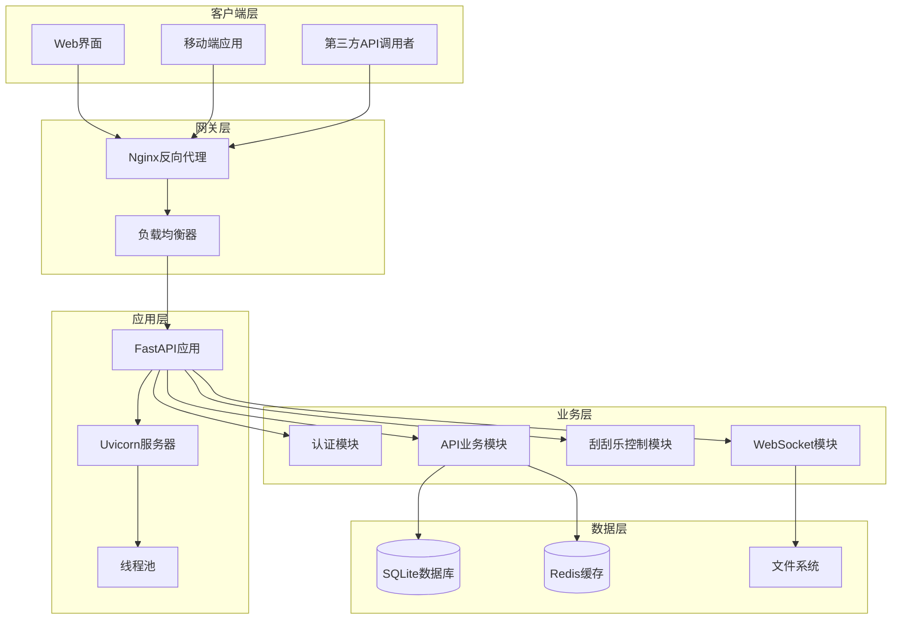

**图表来源**
- [Start.py](file://Start.py#L446-L486)
- [reply_server.py](file://reply_server.py#L308-L322)

## FastAPI应用初始化

### 应用创建与配置

FastAPI应用在`reply_server.py`中通过`FastAPI()`构造函数创建，配置了完整的API文档和元数据信息。

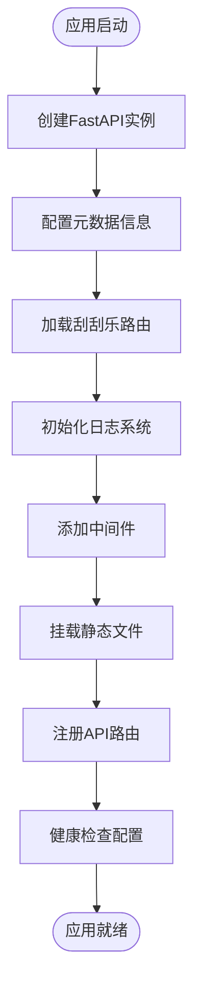

**图表来源**
- [reply_server.py](file://reply_server.py#L308-L322)

### 应用配置参数

| 配置项 | 值 | 说明 |
|--------|-----|------|
| title | "Xianyu Auto Reply API" | API标题 |
| version | "1.0.0" | 版本号 |
| description | "闲鱼自动回复系统API" | 描述信息 |
| docs_url | "/docs" | Swagger文档路径 |
| redoc_url | "/redoc" | ReDoc文档路径 |

**章节来源**
- [reply_server.py](file://reply_server.py#L308-L314)

### 独立线程启动机制

`_start_api_server`函数负责在独立线程中启动Uvicorn服务器，确保API服务与主业务逻辑分离。

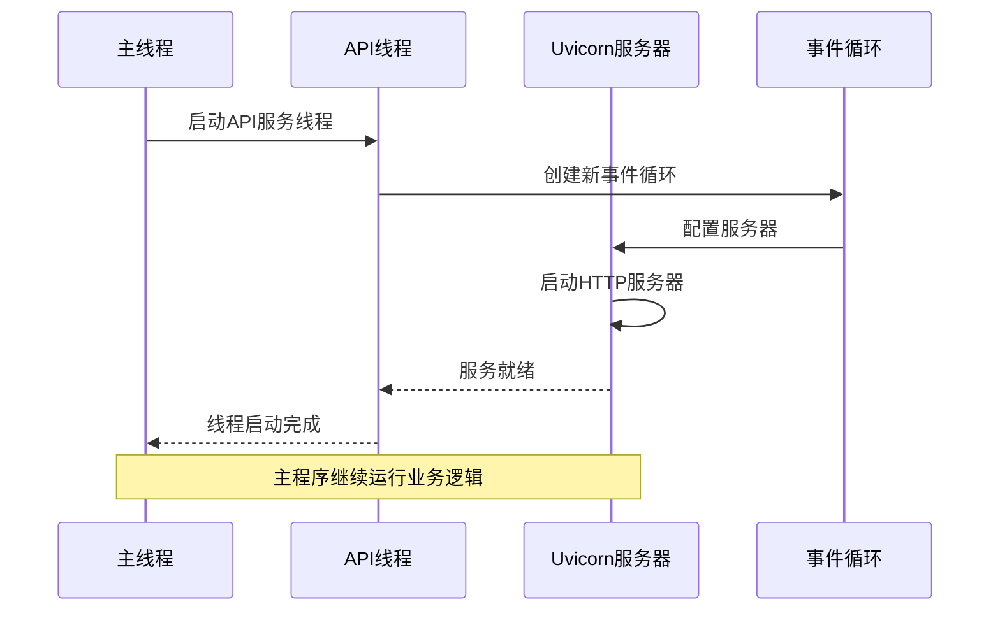

**图表来源**
- [Start.py](file://Start.py#L446-L486)

**章节来源**
- [Start.py](file://Start.py#L446-L486)

## API路由与端点

### 用户认证端点

系统提供完整的用户认证API，支持多种登录方式：

| 端点 | 方法 | 功能 | 认证要求 |
|------|------|------|----------|
| `/login` | POST | 用户登录 | 无 |
| `/verify` | GET | 验证token | 可选 |
| `/logout` | POST | 用户登出 | 可选 |
| `/change-admin-password` | POST | 修改管理员密码 | 管理员 |

### 账号管理端点

| 端点 | 方法 | 功能 | 认证要求 |
|------|------|------|----------|
| `/cookies` | GET/POST/PUT/DELETE | Cookie管理 | 管理员 |
| `/keywords` | GET/POST/PUT/DELETE | 关键字管理 | 管理员 |
| `/users` | GET/POST/PUT/DELETE | 用户管理 | 管理员 |

### 日志查询端点

| 端点 | 方法 | 功能 | 认证要求 |
|------|------|------|----------|
| `/logs` | GET | 获取日志列表 | 管理员 |
| `/logs/download` | GET | 下载日志文件 | 管理员 |
| `/logs/stats` | GET | 获取日志统计 | 管理员 |

**章节来源**
- [reply_server.py](file://reply_server.py#L542-L704)

### 刮刮乐远程控制端点

当`api_captcha_remote.py`模块可用时，系统会自动注册刮刮乐远程控制路由。

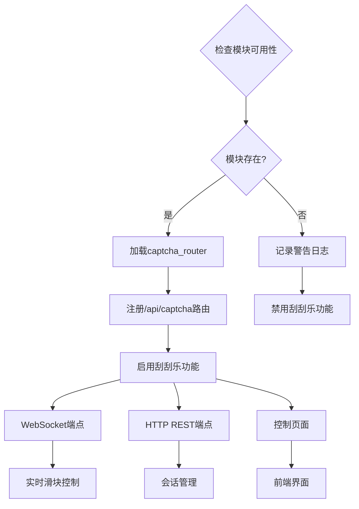

**图表来源**
- [api_captcha_remote.py](file://api_captcha_remote.py#L17-L19)

**章节来源**
- [api_captcha_remote.py](file://api_captcha_remote.py#L17-L19)

## 中间件与认证

### 请求日志中间件

系统实现了统一的请求日志中间件，记录所有API请求的详细信息。

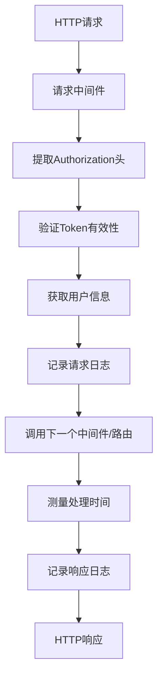

**图表来源**
- [reply_server.py](file://reply_server.py#L331-L357)

### JWT认证流程

系统采用基于Bearer Token的JWT认证机制：

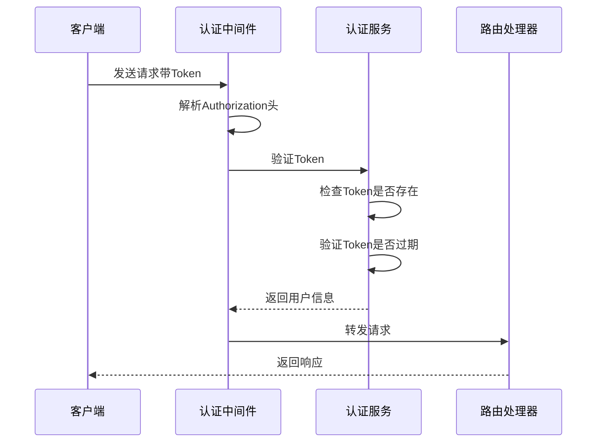

**图表来源**
- [reply_server.py](file://reply_server.py#L183-L219)

### 跨域处理

系统通过中间件实现CORS（跨域资源共享）支持，允许来自不同域名的请求访问API。

**章节来源**
- [reply_server.py](file://reply_server.py#L331-L357)

## 刮刮乐远程控制

### WebSocket连接管理

刮刮乐远程控制通过WebSocket实现实时交互：

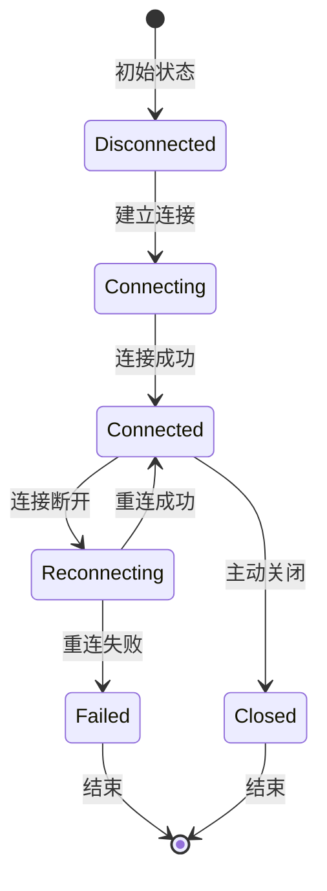

**图表来源**
- [api_captcha_remote.py](file://api_captcha_remote.py#L38-L156)

### 鼠标事件处理

WebSocket端点支持实时鼠标事件传输：

| 事件类型 | 参数 | 功能 |
|----------|------|------|
| mouse_event | event_type, x, y | 鼠标点击/移动/释放 |
| check_completion | session_id | 检查验证完成状态 |
| ping | - | 心跳检测 |

**章节来源**
- [api_captcha_remote.py](file://api_captcha_remote.py#L38-L156)

## WebSocket服务

### 实时通信架构

WebSocket服务采用事件驱动模式，支持双向实时通信：

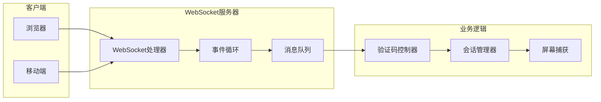

**图表来源**
- [api_captcha_remote.py](file://api_captcha_remote.py#L38-L156)

### 会话状态管理

系统维护活跃会话的完整状态信息：

| 状态字段 | 类型 | 说明 |
|----------|------|------|
| session_id | String | 会话唯一标识 |
| screenshot | Base64 | 当前屏幕截图 |
| captcha_info | Dict | 验证码相关信息 |
| viewport | Dict | 视口尺寸信息 |
| completed | Boolean | 验证是否完成 |

**章节来源**
- [api_captcha_remote.py](file://api_captcha_remote.py#L162-L245)

## 静态文件服务

### 文件服务配置

系统通过FastAPI的`StaticFiles`组件提供静态文件服务：

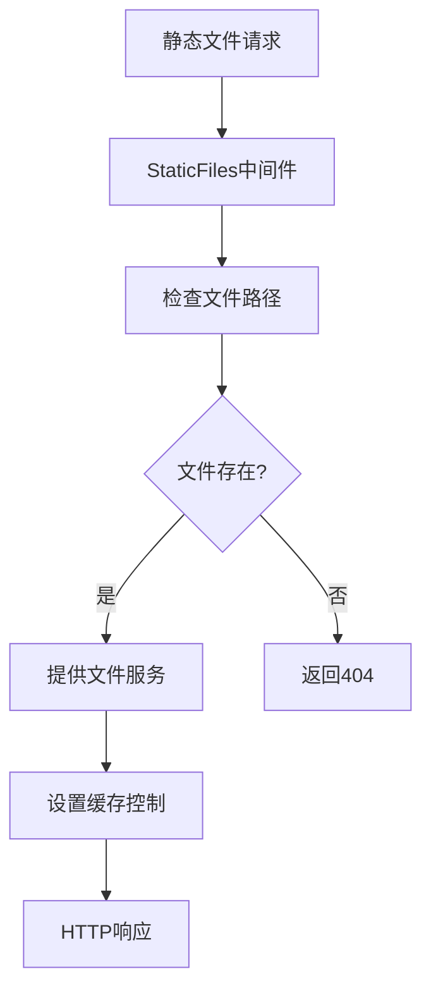

**图表来源**
- [reply_server.py](file://reply_server.py#L360-L371)

### 目录结构

| 路径 | 功能 | 说明 |
|------|------|------|
| `/static/css/*` | 样式文件 | 包含各种CSS样式表 |
| `/static/js/*` | 脚本文件 | 包含前端JavaScript代码 |
| `/static/images/*` | 图片资源 | 存放各类图片资源 |
| `/static/uploads/*` | 上传文件 | 用户上传的文件存储 |

**章节来源**
- [reply_server.py](file://reply_server.py#L360-L371)

## 健康检查机制

### 健康检查端点

系统提供`/health`端点用于健康状态检查：

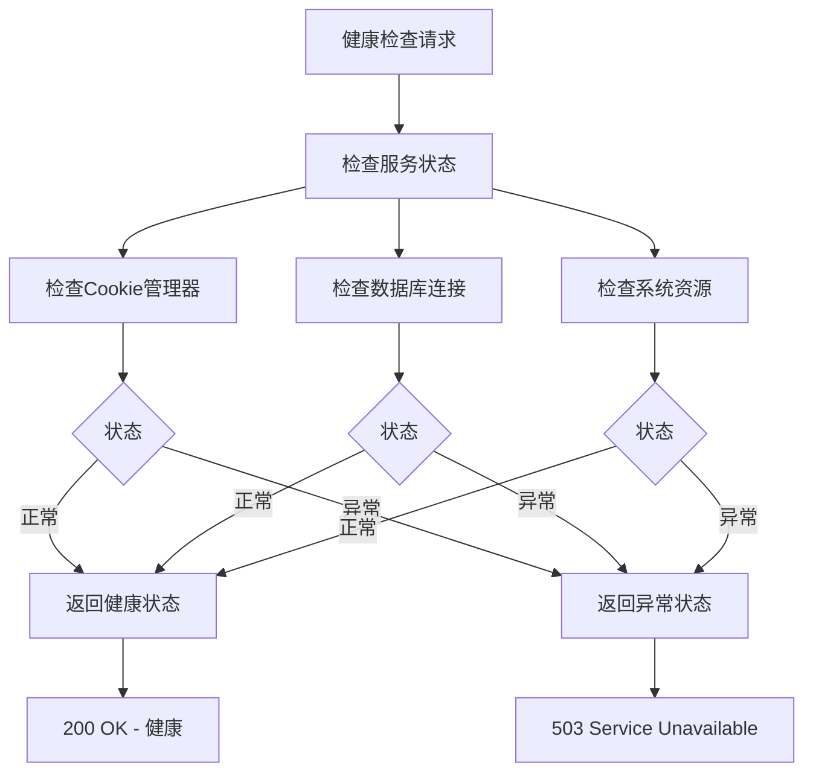

**图表来源**
- [reply_server.py](file://reply_server.py#L374-L419)

### 系统监控指标

| 指标类别 | 监控项目 | 检查方式 |
|----------|----------|----------|
| 服务状态 | Cookie管理器 | 实例存在性检查 |
| 服务状态 | 数据库连接 | 查询测试 |
| CPU使用率 | 系统CPU占用 | psutil模块 |
| 内存使用率 | 系统内存占用 | psutil模块 |
| 可用内存 | 可用物理内存 | psutil模块 |

**章节来源**
- [reply_server.py](file://reply_server.py#L374-L419)

## API请求处理流程

### 完整请求处理链路

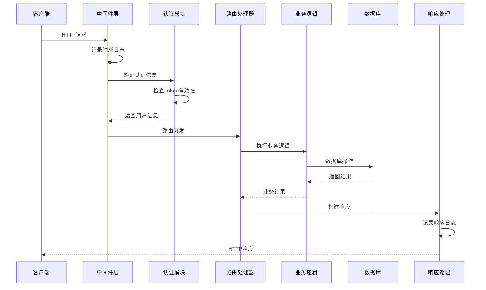

**图表来源**
- [reply_server.py](file://reply_server.py#L331-L357)

### 错误处理机制

系统实现了统一的错误处理和响应格式：

| 错误类型 | HTTP状态码 | 响应格式 | 处理方式 |
|----------|------------|----------|----------|
| 认证失败 | 401 | {"detail": "未授权访问"} | 记录日志，返回错误 |
| 权限不足 | 403 | {"detail": "需要管理员权限"} | 记录日志，返回错误 |
| 资源不存在 | 404 | {"detail": "资源不存在"} | 记录日志，返回错误 |
| 服务器错误 | 500 | {"detail": "系统错误"} | 记录日志，返回错误 |

**章节来源**
- [reply_server.py](file://reply_server.py#L202-L219)

## 性能优化策略

### 异步并发处理

系统采用asyncio实现高并发处理：

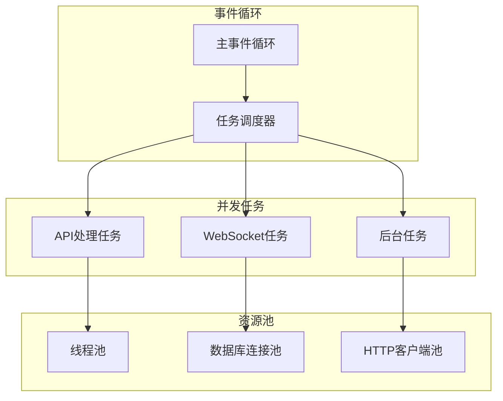

**图表来源**
- [Start.py](file://Start.py#L573-L576)

### 缓存策略

系统实现了多层缓存机制：

| 缓存层级 | 缓存内容 | 过期策略 | 存储位置 |
|----------|----------|----------|----------|
| 内存缓存 | 用户会话 | Token过期时间 | SESSION_TOKENS |
| 数据库缓存 | 配置信息 | 手动更新 | SQLite |
| 文件缓存 | 日志文件 | 时间轮转 | 本地磁盘 |
| 浏览器缓存 | 静态资源 | 版本控制 | CDN/浏览器 |

### 连接池管理

系统对数据库和HTTP连接进行池化管理：

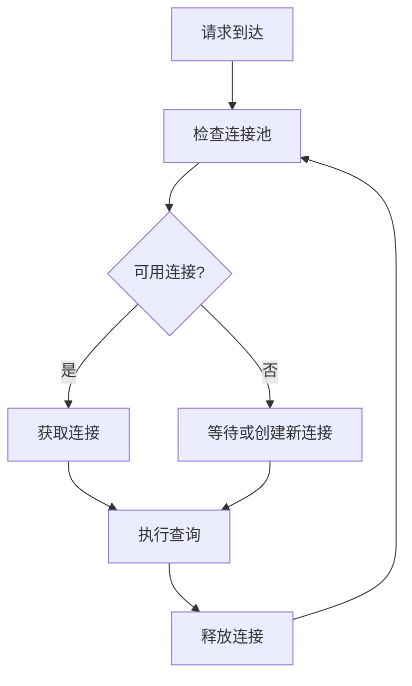

**章节来源**
- [db_manager.py](file://db_manager.py#L16-L51)

## 故障排除指南

### 常见问题诊断

| 问题类型 | 症状 | 可能原因 | 解决方案 |
|----------|------|----------|----------|
| 服务启动失败 | 端口被占用 | 端口冲突 | 更改端口配置 |
| 认证失败 | 401错误 | Token无效 | 检查Token生成和传递 |
| 数据库连接失败 | 连接超时 | 数据库文件损坏 | 检查数据库文件完整性 |
| WebSocket连接断开 | 实时功能失效 | 网络不稳定 | 检查网络连接和防火墙设置 |

### 日志分析

系统提供详细的日志记录，便于问题排查：

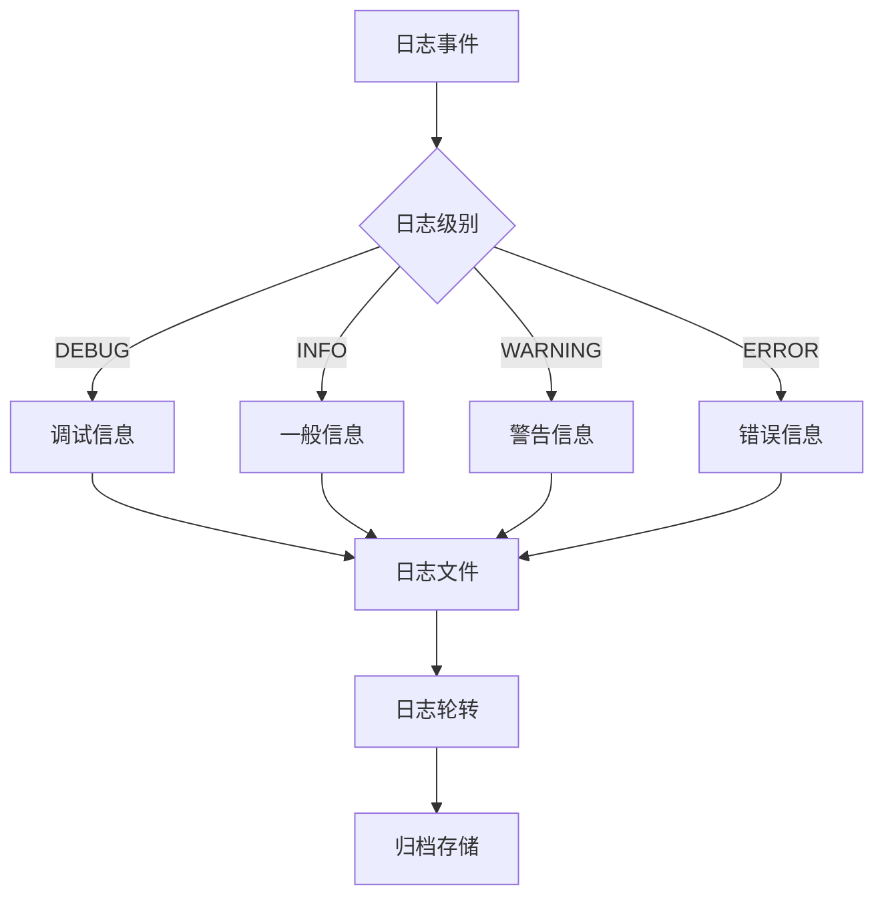

### 性能监控

系统内置性能监控指标：

| 监控指标 | 检查频率 | 告警阈值 | 处理方式 |
|----------|----------|----------|----------|
| CPU使用率 | 1分钟 | >80% | 检查任务负载 |
| 内存使用率 | 1分钟 | >90% | 清理缓存 |
| 数据库连接数 | 1分钟 | >80% | 连接池调整 |
| WebSocket连接数 | 1分钟 | >90% | 连接限制检查 |

**章节来源**
- [reply_server.py](file://reply_server.py#L374-L419)

## 总结

本FastAPI后端服务架构具有以下特点：

1. **模块化设计**：清晰的功能模块划分，便于维护和扩展
2. **异步并发**：基于asyncio的高性能并发处理能力
3. **实时通信**：WebSocket支持实时交互和状态同步
4. **安全可靠**：完善的认证机制和错误处理
5. **易于部署**：支持Docker容器化部署和健康检查

该架构为闲鱼自动回复系统提供了稳定、高效、可扩展的后端服务基础，能够满足大规模并发访问和复杂业务逻辑处理的需求。