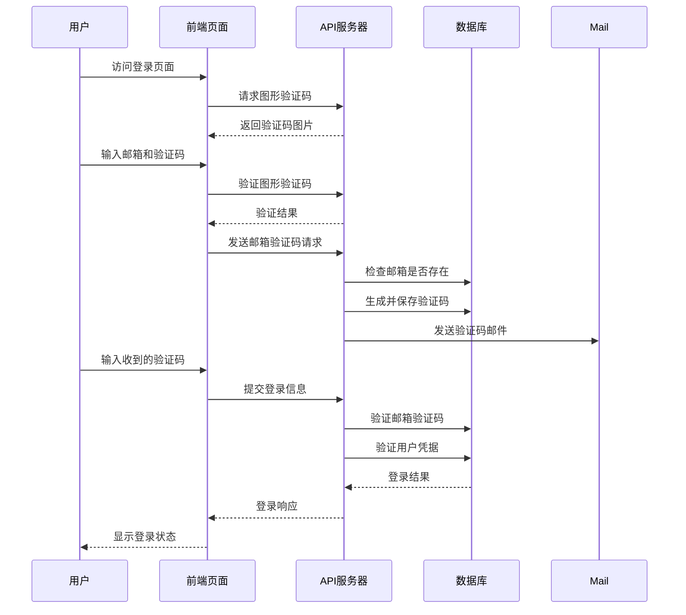

# 多因素认证实现

<cite>
**本文档引用的文件**
- [Start.py](file://Start.py)
- [config.py](file://config.py)
- [db_manager.py](file://db_manager.py)
- [reply_server.py](file://reply_server.py)
- [api_captcha_remote.py](file://api_captcha_remote.py)
- [utils/captcha_remote_control.py](file://utils/captcha_remote_control.py)
- [static/register.html](file://static/register.html)
- [static/login.html](file://static/login.html)
- [captcha_control.html](file://captcha_control.html)
</cite>

## 目录
1. [简介](#简介)
2. [系统架构概览](#系统架构概览)
3. [核心组件分析](#核心组件分析)
4. [请求模型设计](#请求模型设计)
5. [图形验证码机制](#图形验证码机制)
6. [邮箱验证码机制](#邮箱验证码机制)
7. [多因素认证流程](#多因素认证流程)
8. [安全防护策略](#安全防护策略)
9. [故障排除指南](#故障排除指南)
10. [总结](#总结)

## 简介

本系统实现了基于图形验证码和邮箱验证码的双重多因素认证机制，为用户提供更安全的登录和注册体验。该认证体系采用前后端分离架构，通过FastAPI提供RESTful API接口，结合Playwright实现自动化验证码处理能力。

## 系统架构概览

系统采用模块化设计，主要包含以下核心模块：

**图表来源**
- [Start.py](file://Start.py#L446-L486)
- [reply_server.py](file://reply_server.py#L1-L50)

## 核心组件分析

### 数据库管理器(DBManager)

数据库管理器负责维护整个认证系统的数据存储，包含用户信息、验证码记录等核心数据。

**图表来源**
- [db_manager.py](file://db_manager.py#L16-L50)
- [db_manager.py](file://db_manager.py#L98-L107)

**章节来源**
- [db_manager.py](file://db_manager.py#L16-L800)

### 验证码控制器(CaptchaRemoteController)

验证码控制器提供远程滑块验证功能，支持WebSocket实时交互和自动化验证处理。

**图表来源**
- [utils/captcha_remote_control.py](file://utils/captcha_remote_control.py#L14-L50)

**章节来源**
- [utils/captcha_remote_control.py](file://utils/captcha_remote_control.py#L1-L369)

## 请求模型设计

系统定义了多个Pydantic模型来规范API请求和响应的数据结构。

### SendCodeRequest - 邮箱验证码请求模型

| 字段名 | 类型 | 必填 | 描述 |
|--------|------|------|------|
| email | str | 是 | 用户邮箱地址 |
| session_id | str | 否 | 会话标识符 |
| type | str | 否 | 验证码类型（register/login） |

### CaptchaRequest - 图形验证码请求模型

| 字段名 | 类型 | 必填 | 描述 |
|--------|------|------|------|
| session_id | str | 是 | 会话标识符 |

### VerifyCaptchaRequest - 图形验证码验证请求模型

| 字段名 | 类型 | 必填 | 描述 |
|--------|------|------|------|
| session_id | str | 是 | 会话标识符 |
| captcha_code | str | 是 | 用户输入的验证码 |

### 验证码响应模型

系统提供了标准化的响应模型来统一处理各种验证码操作的结果。

**章节来源**
- [reply_server.py](file://reply_server.py#L146-L176)

## 图形验证码机制

### 生成图形验证码流程

图形验证码生成过程包含文本生成、图像绘制和数据库存储三个关键步骤：

**图表来源**
- [reply_server.py](file://reply_server.py#L708-L738)
- [db_manager.py](file://db_manager.py#L2540-L2604)

### 图形验证码验证逻辑

验证过程严格检查验证码的有效性，包括时间有效性、大小写不敏感匹配和一次性使用原则：

**图表来源**
- [db_manager.py](file://db_manager.py#L2629-L2655)

**章节来源**
- [db_manager.py](file://db_manager.py#L2540-L2655)

## 邮箱验证码机制

### 邮箱验证码生成与发送

邮箱验证码系统支持注册和登录两种场景，具有完善的错误处理和安全机制：

**图表来源**
- [reply_server.py](file://reply_server.py#L776-L834)
- [db_manager.py](file://db_manager.py#L2657-L2762)

### 邮箱验证码验证机制

邮箱验证码采用一次性使用原则，确保安全性：

| 验证阶段 | 检查内容 | 失败处理 |
|----------|----------|----------|
| 格式验证 | 邮箱地址格式 | 返回格式错误 |
| 存在性检查 | 验证码记录是否存在 | 返回不存在错误 |
| 时间有效性 | 验证码是否过期 | 返回过期错误 |
| 使用状态 | 验证码是否已被使用 | 返回已使用错误 |
| 一次性使用 | 标记验证码为已使用 | 防止重复使用 |

**章节来源**
- [db_manager.py](file://db_manager.py#L2657-L2705)

## 多因素认证流程

### 用户注册完整流程

**图表来源**
- [static/register.html](file://static/register.html#L277-L463)
- [reply_server.py](file://reply_server.py#L776-L899)

### 用户登录完整流程

**图表来源**
- [static/login.html](file://static/login.html#L489-L642)

**章节来源**
- [static/register.html](file://static/register.html#L277-L463)
- [static/login.html](file://static/login.html#L489-L642)

## 安全防护策略

### 验证码过期时间管理

系统采用多层次的时间管理策略确保验证码的安全性：

| 验证码类型 | 有效时长 | 清理策略 | 安全考虑 |
|------------|----------|----------|----------|
| 图形验证码 | 5分钟 | 自动删除 | 防止暴力破解 |
| 邮箱验证码 | 10分钟 | 一次性使用 | 防止重放攻击 |
| 会话令牌 | 24小时 | 定期清理 | 防止长期访问 |

### 使用状态跟踪机制

系统实现了严格的验证码使用状态跟踪：

**图表来源**
- [db_manager.py](file://db_manager.py#L2629-L2655)

### 安全风险及应对措施

| 安全风险 | 风险等级 | 应对措施 | 技术实现 |
|----------|----------|----------|----------|
| 暴力破解 | 高 | 图形验证码限制 | 5分钟有效期 |
| 邮箱轰炸 | 中 | 发送频率限制 | 60秒冷却时间 |
| 重放攻击 | 高 | 一次性使用 | 验证后立即删除 |
| 并发攻击 | 中 | 数据库锁机制 | SQLite行级锁定 |
| 网络拦截 | 中 | HTTPS传输 | 强制HTTPS协议 |

**章节来源**
- [db_manager.py](file://db_manager.py#L2629-L2705)

## 故障排除指南

### 常见问题及解决方案

#### 图形验证码生成失败

**症状**: 用户无法获取图形验证码
**可能原因**:
1. PIL库依赖缺失
2. 字体文件不可用
3. 数据库连接问题

**解决方案**:
1. 检查Pillow库安装状态
2. 验证系统字体文件存在性
3. 确认数据库连接正常

#### 邮箱验证码发送失败

**症状**: 验证码邮件无法送达
**可能原因**:
1. SMTP配置不完整
2. 邮箱地址格式错误
3. 邮件服务商限制

**解决方案**:
1. 检查SMTP服务器配置
2. 验证邮箱地址格式
3. 联系邮件服务商确认限制

#### 验证码验证失败

**症状**: 用户输入正确验证码仍验证失败
**可能原因**:
1. 验证码过期
2. 大小写敏感问题
3. 数据库同步延迟

**解决方案**:
1. 检查验证码有效期
2. 确认大小写转换逻辑
3. 重启数据库连接

**章节来源**
- [db_manager.py](file://db_manager.py#L2540-L2762)

## 总结

本多因素认证系统通过图形验证码和邮箱验证码的双重验证机制，为用户提供了安全可靠的认证体验。系统具备以下特点：

1. **安全性**: 采用双重验证机制，防止恶意攻击
2. **可靠性**: 完善的错误处理和重试机制
3. **可扩展性**: 模块化设计便于功能扩展
4. **易用性**: 简洁的API接口和清晰的错误提示

通过合理的架构设计和严格的安全策略，该系统能够有效防范各类安全威胁，为用户提供可信的认证服务。未来可以考虑集成更多认证因子，如短信验证码或生物识别，进一步提升系统的安全性和用户体验。