# 用户认证流程

<cite>
**本文档引用的文件**
- [reply_server.py](file://reply_server.py)
- [db_manager.py](file://db_manager.py)
- [static/login.html](file://static/login.html)
- [static/register.html](file://static/register.html)
- [static/js/app.js](file://static/js/app.js)
- [README.md](file://README.md)
</cite>

## 目录
1. [简介](#简介)
2. [系统架构概览](#系统架构概览)
3. [核心认证组件](#核心认证组件)
4. [Pydantic模型设计](#pydantic模型设计)
5. [会话管理机制](#会话管理机制)
6. [认证流程详解](#认证流程详解)
7. [密码安全机制](#密码安全机制)
8. [验证码系统](#验证码系统)
9. [依赖函数与中间件](#依赖函数与中间件)
10. [常见认证失败场景](#常见认证失败场景)
11. [故障排除指南](#故障排除指南)
12. [总结](#总结)

## 简介

本文档详细解析了基于FastAPI框架构建的用户认证系统，该系统采用JWT风格的会话令牌机制，结合多种登录方式（用户名密码、邮箱密码、邮箱验证码）和完善的验证码防护体系。系统设计注重安全性、易用性和可扩展性，为闲鱼自动回复系统提供了可靠的用户身份验证保障。

## 系统架构概览

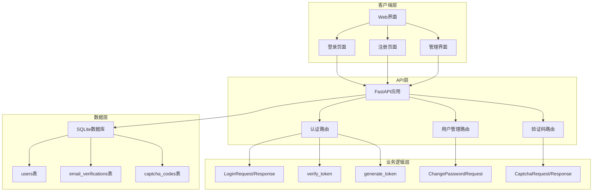

**图表来源**
- [reply_server.py](file://reply_server.py#L1-L100)
- [db_manager.py](file://db_manager.py#L16-L50)

## 核心认证组件

### 主要配置常量

系统定义了关键的认证配置参数：

| 配置项 | 类型 | 默认值 | 说明 |
|--------|------|--------|------|
| ADMIN_USERNAME | str | "admin" | 管理员用户名 |
| DEFAULT_ADMIN_PASSWORD | str | "admin123" | 默认管理员密码 |
| SESSION_TOKENS | dict | {} | 内存会话存储 |
| TOKEN_EXPIRE_TIME | int | 86400秒 | Token过期时间（24小时） |

### 安全配置

系统实现了多层次的安全防护机制：

1. **会话令牌管理**：基于内存的会话存储，支持自动过期清理
2. **密码哈希存储**：使用SHA256算法对用户密码进行单向哈希
3. **验证码防护**：集成图形验证码和邮箱验证码双重验证
4. **请求限流**：通过验证码机制防止暴力破解攻击

**章节来源**
- [reply_server.py](file://reply_server.py#L42-L46)

## Pydantic模型设计

### LoginRequest模型

LoginRequest是系统的核心登录请求模型，支持多种登录方式：

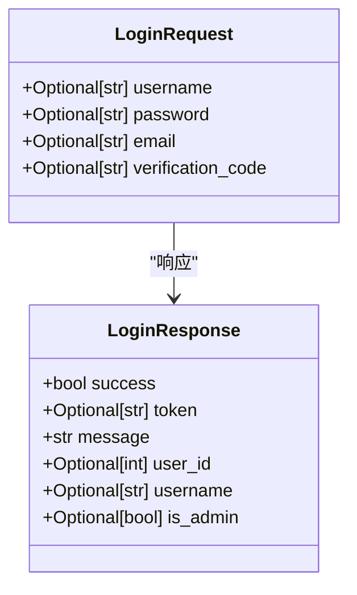

**图表来源**
- [reply_server.py](file://reply_server.py#L113-L126)

#### 字段含义说明

| 字段名 | 类型 | 是否必需 | 说明 |
|--------|------|----------|------|
| username | Optional[str] | 否 | 用户名（用户名密码登录时必需） |
| password | Optional[str] | 否 | 密码（用户名/邮箱密码登录时必需） |
| email | Optional[str] | 否 | 邮箱地址（邮箱登录时必需） |
| verification_code | Optional[str] | 否 | 验证码（验证码登录时必需） |

### 其他认证相关模型

#### ChangePasswordRequest模型
用于管理员密码修改，包含当前密码和新密码验证。

#### RegisterRequest模型
用户注册请求模型，包含用户名、邮箱、密码和验证码字段。

#### 验证码相关模型
- **CaptchaRequest/CaptchaResponse**：图形验证码生成和验证
- **SendCodeRequest/SendCodeResponse**：邮箱验证码发送
- **VerifyCaptchaRequest/VerifyCaptchaResponse**：验证码验证

**章节来源**
- [reply_server.py](file://reply_server.py#L113-L176)

## 会话管理机制

### SESSION_TOKENS会话存储

系统采用内存字典作为会话存储容器：

```mermaid
graph LR
A[SESSION_TOKENS] --> B[Token1]
A --> C[Token2]
A --> D[TokenN]
B --> E[user_id: 1]
B --> F[username: "admin"]
B --> G[timestamp: 1640995200]
C --> H[user_id: 2]
C --> I[username: "user1"]
C --> J[timestamp: 1640995300]
```

**图表来源**
- [reply_server.py](file://reply_server.py#L45)

### generate_token函数实现

generate_token函数负责生成安全的随机令牌：

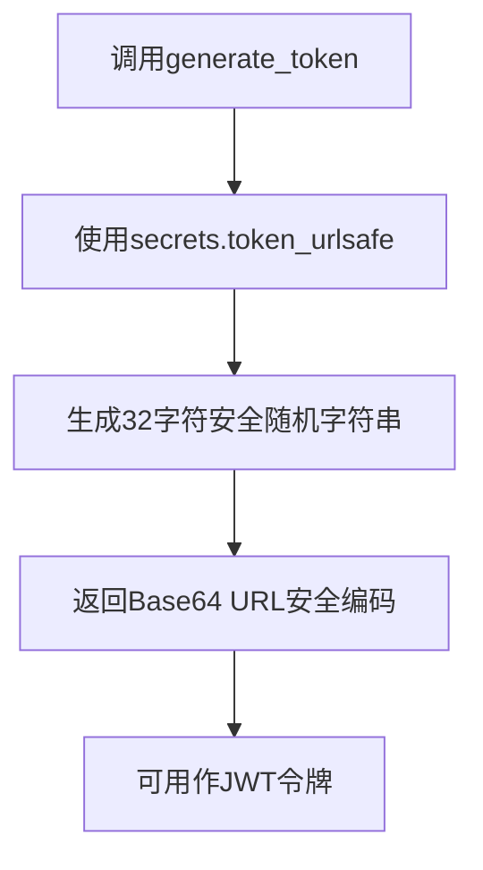

**图表来源**
- [reply_server.py](file://reply_server.py#L178-L180)

### 令牌验证机制

verify_token函数实现了完整的令牌验证流程：

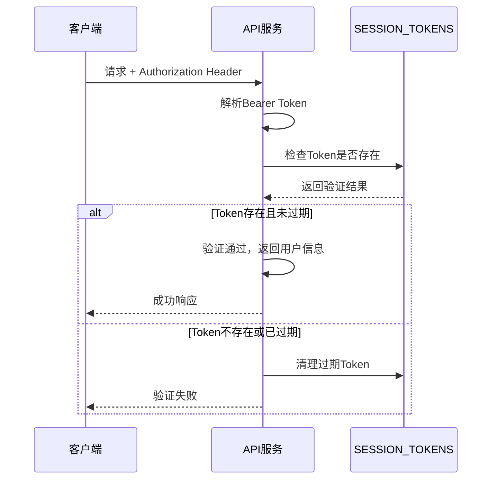

**图表来源**
- [reply_server.py](file://reply_server.py#L183-L199)

**章节来源**
- [reply_server.py](file://reply_server.py#L178-L199)

## 认证流程详解

### 多种登录方式支持

系统支持三种主要的登录方式，每种方式都有其特定的应用场景：

#### 1. 用户名密码登录

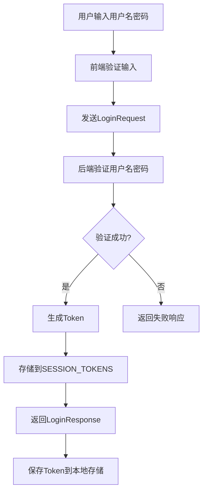

**图表来源**
- [reply_server.py](file://reply_server.py#L542-L579)

#### 2. 邮箱密码登录

邮箱密码登录流程与用户名密码登录类似，但验证的是邮箱地址而非用户名。

#### 3. 邮箱验证码登录

这是最安全的登录方式，需要用户先获取并验证邮箱验证码：

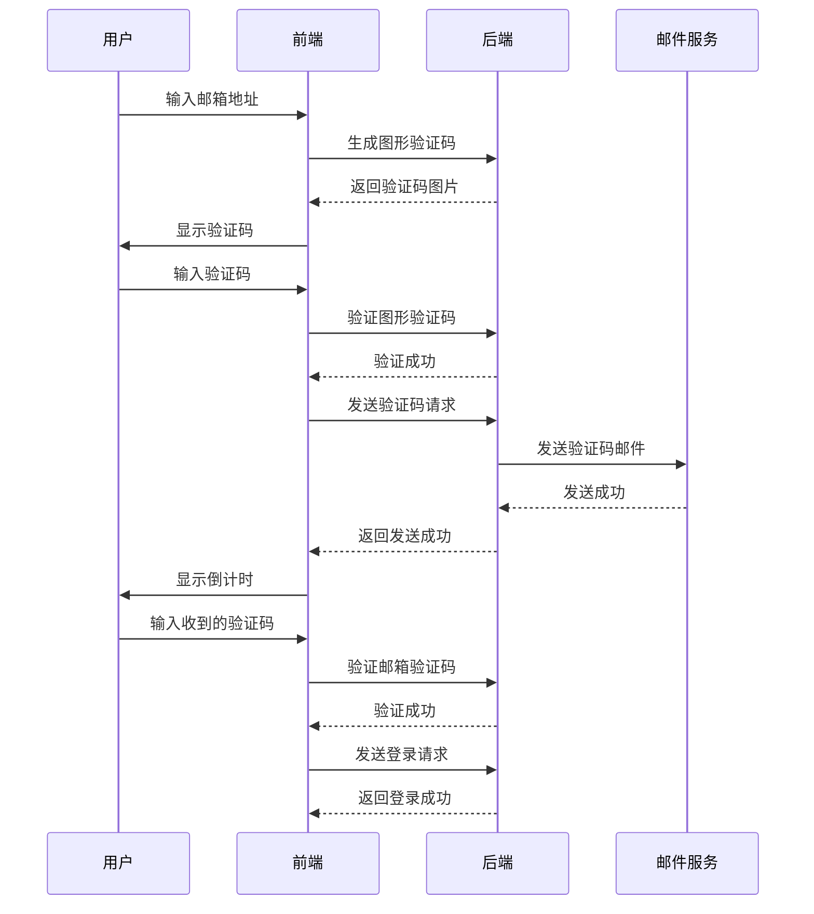

**图表来源**
- [reply_server.py](file://reply_server.py#L615-L653)
- [static/login.html](file://static/login.html#L489-L642)

### 登录接口实现

登录接口根据提供的凭据类型自动选择相应的验证方式：

| 凭据组合 | 验证方式 | 数据库查询 |
|----------|----------|------------|
| username + password | 用户名密码验证 | verify_user_password() |
| email + password | 邮箱密码验证 | get_user_by_email() + verify_user_password() |
| email + verification_code | 验证码验证 | verify_email_code() |

**章节来源**
- [reply_server.py](file://reply_server.py#L542-L659)

## 密码安全机制

### 密码哈希存储

系统采用SHA256算法对用户密码进行单向哈希处理：

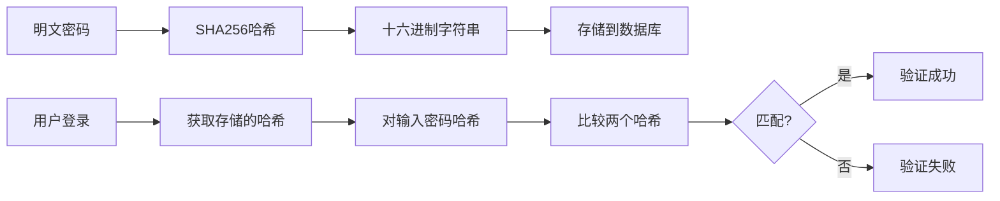

**图表来源**
- [db_manager.py](file://db_manager.py#L2502-L2509)

### 密码修改流程

管理员密码修改采用严格的验证机制：

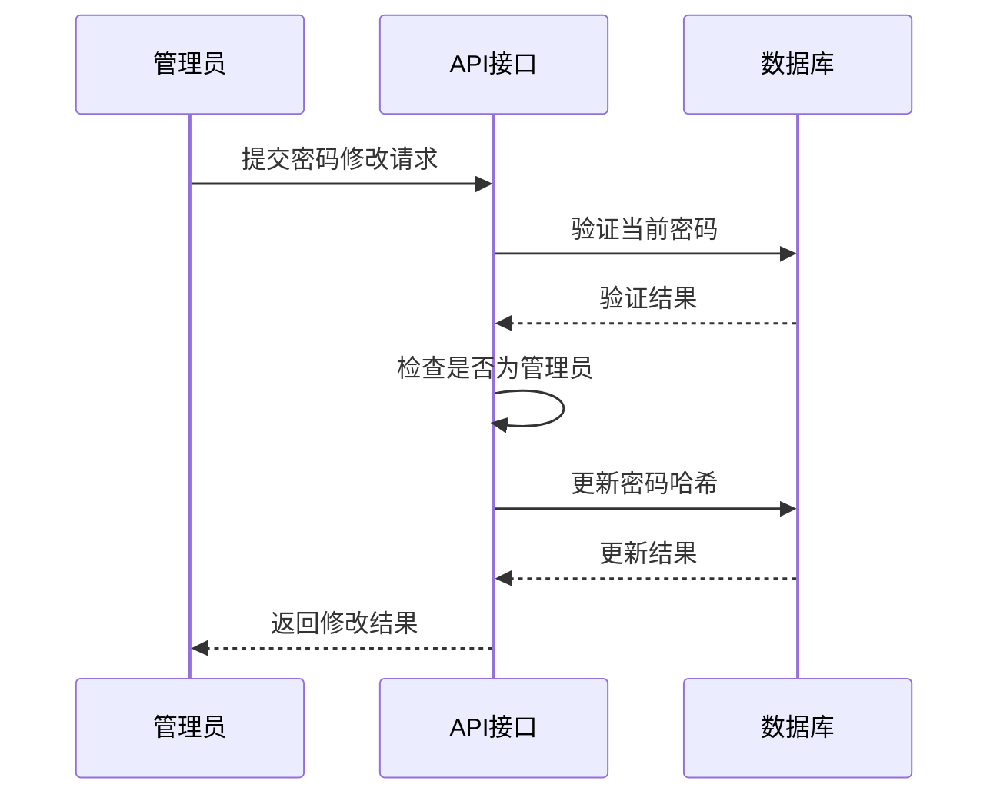

**图表来源**
- [reply_server.py](file://reply_server.py#L683-L704)

### 密码安全策略

| 安全措施 | 实现方式 | 说明 |
|----------|----------|------|
| 单向哈希 | SHA256 | 密码存储为不可逆哈希值 |
| 强度要求 | 前端验证 | 新密码长度≥6位 |
| 当前密码验证 | 数据库查询 | 修改前必须验证原密码 |
| 管理员权限 | 角色检查 | 仅管理员可修改密码 |

**章节来源**
- [db_manager.py](file://db_manager.py#L2502-L2534)
- [reply_server.py](file://reply_server.py#L683-L704)

## 验证码系统

### 图形验证码机制

系统实现了完整的图形验证码生成和验证流程：

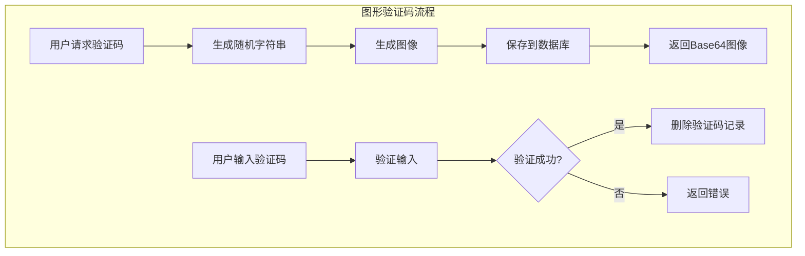

**图表来源**
- [reply_server.py](file://reply_server.py#L708-L747)
- [db_manager.py](file://db_manager.py#L2636-L2655)

### 邮箱验证码系统

邮箱验证码提供额外的安全层，防止自动化攻击：

#### 验证码生成与存储

| 表名 | 字段 | 类型 | 说明 |
|------|------|------|------|
| email_verifications | email | TEXT | 邮箱地址 |
| email_verifications | code | TEXT | 验证码 |
| email_verifications | expires_at | TIMESTAMP | 过期时间 |
| email_verifications | used | BOOLEAN | 是否已使用 |

#### 验证码生命周期

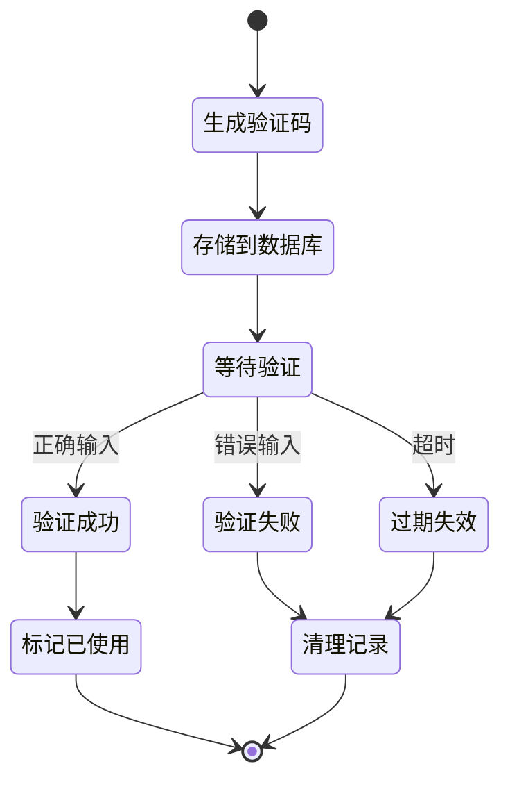

**图表来源**
- [db_manager.py](file://db_manager.py#L2657-L2705)

### 验证码安全特性

1. **时效性**：验证码10分钟内有效
2. **一次性**：验证码使用后立即失效
3. **防刷机制**：同一邮箱频繁请求限制
4. **图形验证**：防止机器人自动获取验证码

**章节来源**
- [reply_server.py](file://reply_server.py#L708-L840)
- [db_manager.py](file://db_manager.py#L2636-L2724)

## 依赖函数与中间件

### 核心依赖函数

系统定义了多个认证依赖函数，形成完整的认证链：

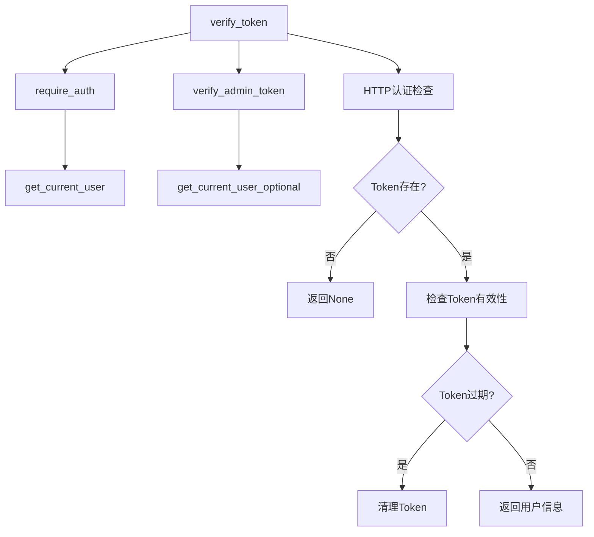

**图表来源**
- [reply_server.py](file://reply_server.py#L183-L229)

### 中间件日志记录

系统实现了请求级别的中间件，提供详细的认证状态日志：

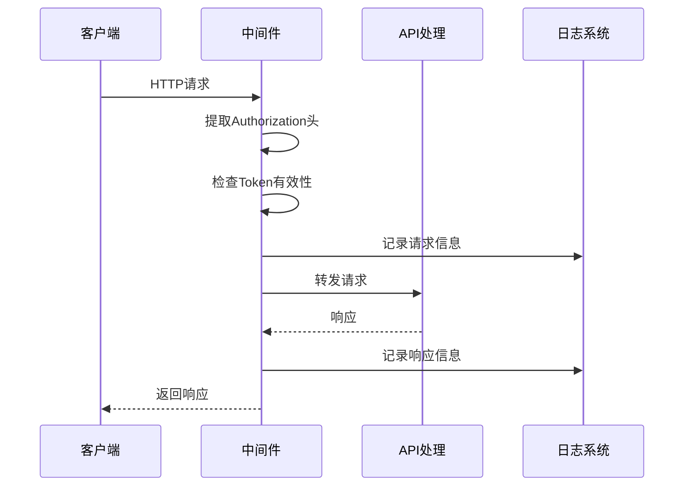

**图表来源**
- [reply_server.py](file://reply_server.py#L331-L356)

### 权限控制层次

| 函数 | 功能 | 权限要求 |
|------|------|----------|
| verify_token | 基础Token验证 | 任何已登录用户 |
| require_auth | 强制认证 | 必须登录 |
| verify_admin_token | 管理员验证 | 必须是管理员 |
| get_current_user | 获取当前用户 | 需要认证 |
| get_current_user_optional | 可选用户信息 | 无需认证 |

**章节来源**
- [reply_server.py](file://reply_server.py#L183-L229)

## 常见认证失败场景

### 登录失败场景

#### 1. 用户名密码错误

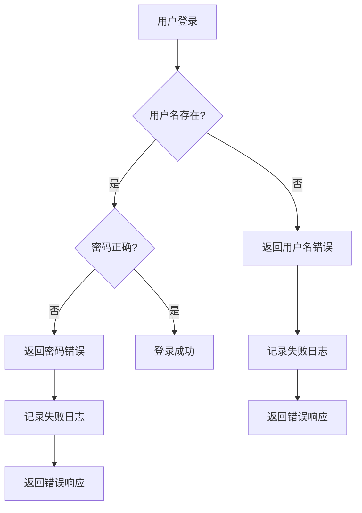

**图表来源**
- [reply_server.py](file://reply_server.py#L552-L579)

#### 2. 邮箱验证码过期

验证码验证失败的主要原因：
- 验证码输入错误
- 验证码已过期（超过10分钟）
- 验证码已被使用
- 邮箱地址不匹配

#### 3. 管理员权限不足

管理员相关操作失败的原因：
- Token不是管理员账户生成
- 管理员账户被禁用
- Token格式错误或缺失

### 注册失败场景

#### 1. 验证码验证失败
- 验证码错误或已过期
- 邮箱地址不匹配
- 验证码已被使用

#### 2. 用户名/邮箱冲突
- 用户名已被其他用户占用
- 邮箱地址已被注册
- 注册功能已关闭

#### 3. 系统限制
- 注册功能被管理员关闭
- 系统达到最大用户数限制

**章节来源**
- [reply_server.py](file://reply_server.py#L844-L899)

## 故障排除指南

### 常见问题诊断

#### 1. 登录后立即掉线

**可能原因**：
- Token过期时间设置过短
- 服务器重启导致SESSION_TOKENS清空
- 客户端本地存储被清除

**解决方案**：
- 检查TOKEN_EXPIRE_TIME配置
- 确认服务器运行状态
- 重新登录获取新Token

#### 2. 验证码无法获取

**可能原因**：
- 图形验证码生成失败
- SMTP配置错误
- 邮箱地址格式错误

**解决方案**：
- 检查数据库连接状态
- 验证SMTP服务器配置
- 确认邮箱地址格式

#### 3. 密码修改失败

**可能原因**：
- 当前密码输入错误
- 新密码不符合强度要求
- 数据库连接异常

**解决方案**：
- 确认当前密码正确性
- 检查新密码长度和复杂度
- 验证数据库连接状态

### 调试工具和方法

#### 1. 日志分析

系统提供了详细的日志记录功能：

```python
# 登录日志示例
logger.info(f"【{username}】登录成功")
logger.warning(f"【{username}】登录失败：用户名或密码错误")

# 验证码日志示例
logger.info(f"验证码验证成功: {email} ({code_type})")
logger.warning(f"验证码验证失败: {email} - {code} ({code_type})")
```

#### 2. 数据库状态检查

```sql
-- 检查活跃会话
SELECT COUNT(*) FROM sessions WHERE expires_at > CURRENT_TIMESTAMP;

-- 检查用户状态
SELECT username, is_active FROM users WHERE username = 'admin';

-- 检查验证码状态
SELECT email, code, expires_at, used FROM email_verifications 
WHERE email = 'test@example.com' ORDER BY created_at DESC LIMIT 1;
```

#### 3. 系统健康检查

```python
@app.get('/health')
async def health_check():
    """健康检查端点，用于Docker健康检查和负载均衡器"""
    try:
        # 检查数据库连接
        db_manager.get_all_cookies()
        return {"status": "healthy"}
    except Exception as e:
        return {"status": "unhealthy", "error": str(e)}
```

**章节来源**
- [reply_server.py](file://reply_server.py#L374-L418)

## 总结

本文档全面解析了基于FastAPI构建的用户认证系统，涵盖了从基础的Pydantic模型设计到复杂的会话管理机制。系统采用了多层次的安全防护策略，包括：

1. **多样化的登录方式**：支持用户名密码、邮箱密码和邮箱验证码三种登录模式
2. **完善的身份验证**：基于内存的会话令牌管理和严格的权限控制
3. **强大的安全机制**：SHA256密码哈希、图形验证码和邮箱验证码双重防护
4. **灵活的扩展性**：模块化的依赖函数设计，便于功能扩展和维护

该认证系统为闲鱼自动回复系统提供了可靠的安全保障，确保只有经过验证的用户才能访问系统功能。通过合理的错误处理和日志记录，系统具备良好的可维护性和故障诊断能力。

对于系统管理员而言，建议定期检查Token过期清理机制，监控验证码使用情况，并及时更新默认管理员密码以确保系统安全。同时，可以根据实际需求调整验证码的有效期和重试次数，平衡安全性和用户体验。