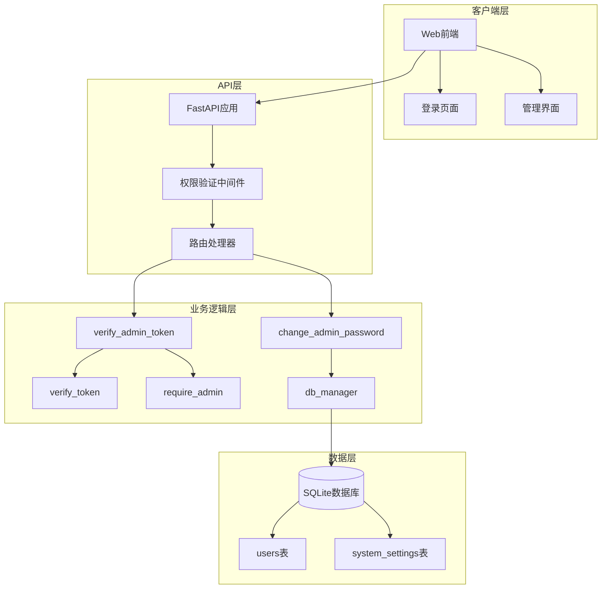
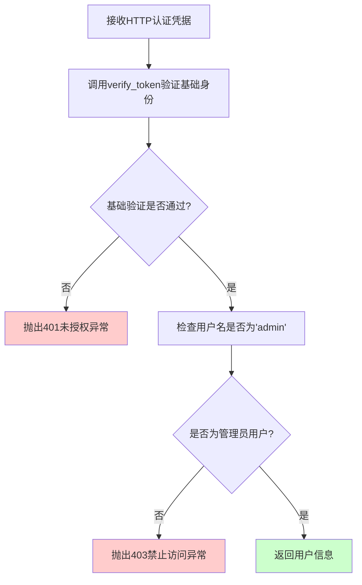
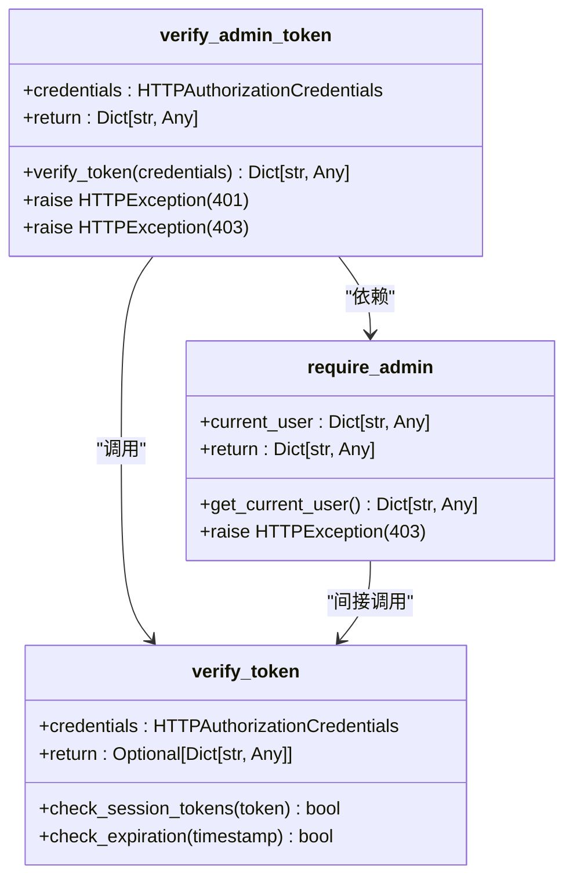
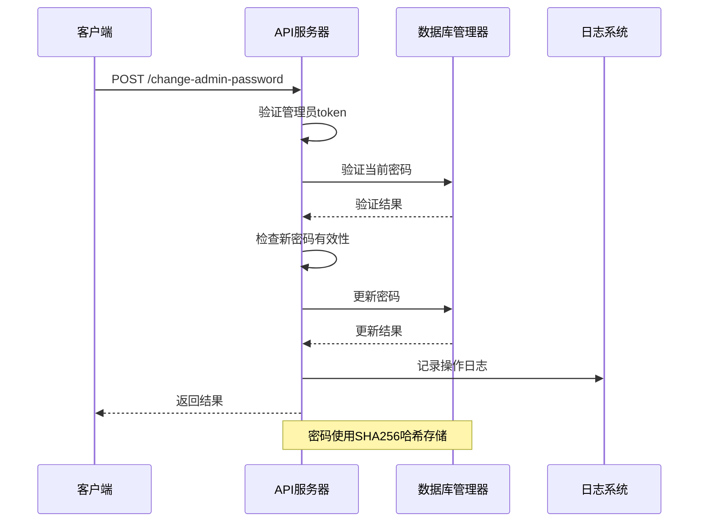
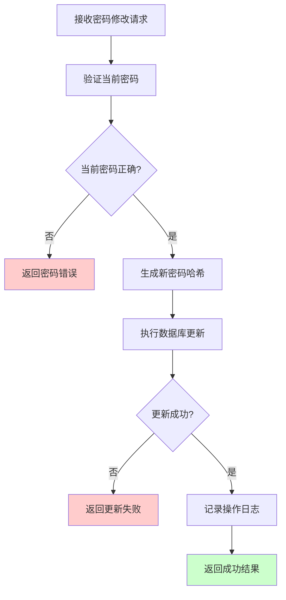
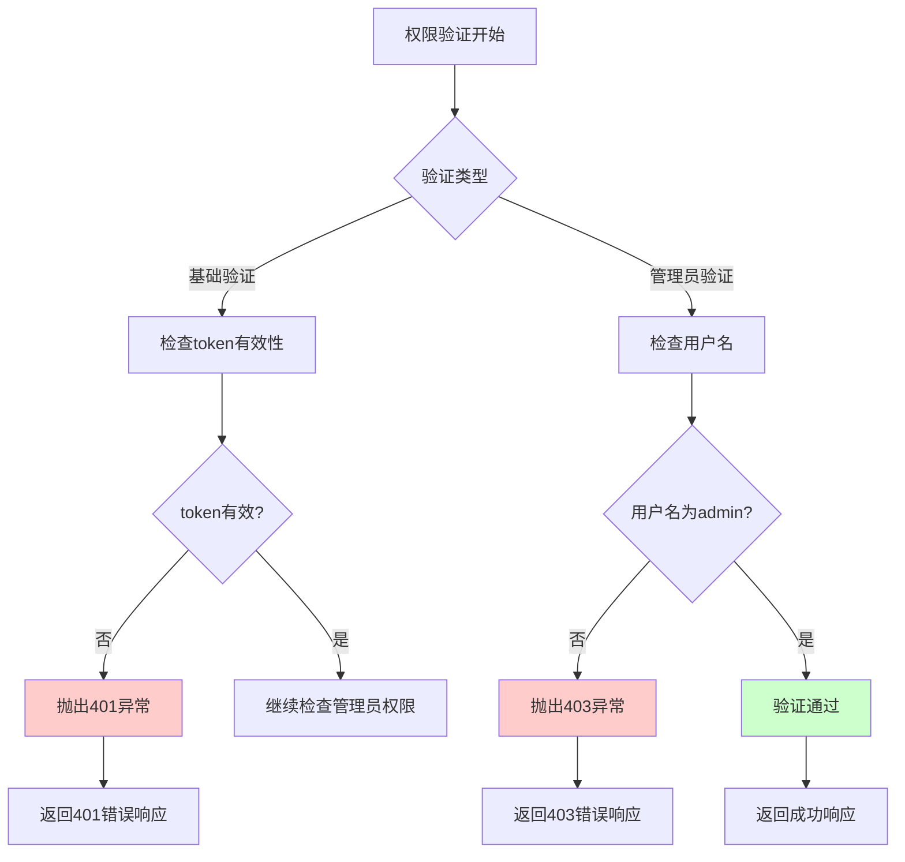
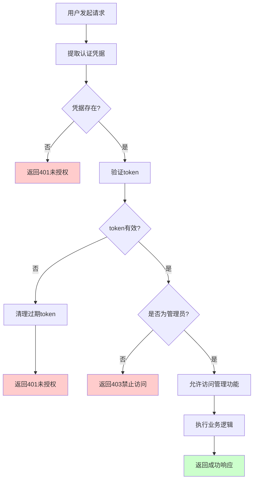

# 管理员权限控制

<cite>
**本文档引用的文件**
- [reply_server.py](file://reply_server.py)
- [db_manager.py](file://db_manager.py)
- [config.py](file://config.py)
- [global_config.yml](file://global_config.yml)
- [static/js/app.js](file://static/js/app.js)
- [static/login.html](file://static/login.html)
</cite>

## 目录
1. [简介](#简介)
2. [系统架构概述](#系统架构概述)
3. [核心权限验证函数](#核心权限验证函数)
4. [管理员密码修改机制](#管理员密码修改机制)
5. [HTTP异常处理机制](#http异常处理机制)
6. [权限验证流程图](#权限验证流程图)
7. [安全最佳实践](#安全最佳实践)
8. [故障排除指南](#故障排除指南)
9. [总结](#总结)

## 简介

本文档详细解析了闲鱼自动回复系统的管理员权限控制系统，重点分析了`verify_admin_token`函数的实现逻辑、权限验证机制以及相关的安全策略。该系统采用基于令牌的身份验证机制，通过多层次的权限检查确保只有授权的管理员才能访问敏感的管理功能。

## 系统架构概述

系统采用FastAPI框架构建，实现了完整的RESTful API权限控制体系。整个权限控制系统包含以下核心组件：

**图表来源**
- [reply_server.py](file://reply_server.py#L1-L50)
- [db_manager.py](file://db_manager.py#L1-L50)

**章节来源**
- [reply_server.py](file://reply_server.py#L1-L100)
- [db_manager.py](file://db_manager.py#L1-L100)

## 核心权限验证函数

### verify_admin_token函数详解

`verify_admin_token`函数是系统中最严格的权限验证函数，它结合了基础身份验证和管理员权限检查：

**图表来源**
- [reply_server.py](file://reply_server.py#L201-L212)

#### 实现细节分析

1. **基础身份验证**：首先调用`verify_token`函数验证传入的认证凭据
2. **管理员权限检查**：严格检查用户名是否等于预定义的管理员用户名
3. **异常处理**：针对不同失败场景抛出相应的HTTP异常

#### 依赖关系图

**图表来源**
- [reply_server.py](file://reply_server.py#L182-L243)

**章节来源**
- [reply_server.py](file://reply_server.py#L201-L212)

### require_admin依赖函数

`require_admin`函数提供了另一种管理员权限验证机制，与`verify_admin_token`相比更加简洁：

#### 工作机制

1. **用户信息获取**：通过`get_current_user`依赖获取当前用户信息
2. **权限检查**：直接比较用户名是否为'admin'
3. **异常处理**：权限不足时抛出403 Forbidden异常

#### 应用场景对比

| 函数 | 适用场景 | 性能特点 | 安全级别 |
|------|----------|----------|----------|
| `verify_admin_token` | 需要详细用户信息的场景 | 较高 | 最高 |
| `require_admin` | 简单权限检查场景 | 中等 | 高 |

**章节来源**
- [reply_server.py](file://reply_server.py#L238-L243)

## 管理员密码修改机制

### 安全策略设计

管理员密码修改功能实现了严格的安全验证流程：

**图表来源**
- [reply_server.py](file://reply_server.py#L683-L705)
- [db_manager.py](file://db_manager.py#L2502-L2534)

### 密码验证流程

#### 前端验证规则

1. **密码匹配检查**：确认新密码与确认密码一致
2. **长度验证**：新密码长度至少6位
3. **安全性提示**：提供实时验证反馈

#### 后端验证逻辑

1. **当前密码验证**：使用`db_manager.verify_user_password()`验证现有密码
2. **密码哈希更新**：使用SHA256算法对新密码进行哈希处理
3. **数据库更新**：原子性地更新用户密码记录

### 数据库更新流程

**图表来源**
- [reply_server.py](file://reply_server.py#L688-L700)
- [db_manager.py](file://db_manager.py#L2511-L2534)

**章节来源**
- [reply_server.py](file://reply_server.py#L683-L705)
- [db_manager.py](file://db_manager.py#L2502-L2534)

## HTTP异常处理机制

### 异常类型与状态码

系统实现了完善的HTTP异常处理机制，针对不同权限验证失败场景提供明确的错误响应：

| 异常类型 | HTTP状态码 | 错误详情 | 触发条件 |
|----------|------------|----------|----------|
| 未授权访问 | 401 | "未授权访问" | 基础身份验证失败 |
| 禁止访问 | 403 | "需要管理员权限" | 非管理员用户尝试访问管理功能 |

### 异常处理流程

**图表来源**
- [reply_server.py](file://reply_server.py#L205-L211)

**章节来源**
- [reply_server.py](file://reply_server.py#L201-L212)

## 权限验证流程图

### 完整权限验证流程

**图表来源**
- [reply_server.py](file://reply_server.py#L182-L212)

### API端点权限控制示例

以下是系统中受管理员权限保护的关键API端点：

| API端点 | 权限要求 | 验证函数 | 功能描述 |
|---------|----------|----------|----------|
| `/change-admin-password` | 管理员权限 | `verify_admin_token` | 修改管理员密码 |
| `/registration-settings` | 管理员权限 | `require_admin` | 更新注册设置 |
| `/login-info-settings` | 管理员权限 | `require_admin` | 更新登录信息设置 |
| `/admin/cookies` | 管理员权限 | `require_admin` | 获取所有Cookie信息 |
| `/system-logs` | 管理员权限 | `require_admin` | 查看系统日志 |

**章节来源**
- [reply_server.py](file://reply_server.py#L683-L705)
- [reply_server.py](file://reply_server.py#L2741-L2766)

## 安全最佳实践

### 密码安全策略

1. **强密码要求**：新密码最小长度6位
2. **密码哈希存储**：使用SHA256算法对密码进行单向哈希
3. **实时验证**：前端实时检查密码匹配性和长度要求
4. **安全传输**：所有密码传输均使用HTTPS加密

### 会话安全管理

1. **Token过期机制**：24小时自动过期
2. **会话清理**：自动清理过期的会话令牌
3. **权限分离**：区分普通用户和管理员权限

### 日志审计机制

1. **操作记录**：记录所有管理员操作
2. **用户追踪**：通过用户ID追踪具体操作
3. **异常监控**：记录权限验证失败情况

### 前端安全措施

1. **本地存储保护**：使用localStorage存储认证信息
2. **权限检测**：前端JavaScript动态显示管理功能
3. **自动登出**：token过期时自动清除认证信息

**章节来源**
- [static/js/app.js](file://static/js/app.js#L5026-L5064)
- [static/login.html](file://static/login.html#L374-L456)

## 故障排除指南

### 常见权限验证问题

#### 401未授权访问错误

**可能原因**：
1. 缺少Authorization头部
2. Token格式不正确
3. Token已过期
4. Token已被删除

**解决方案**：
1. 检查请求头是否包含正确的Bearer token
2. 验证token格式是否为"Bearer <token>"
3. 重新登录获取新的token
4. 检查系统时间是否正确

#### 403禁止访问错误

**可能原因**：
1. 用户非管理员账户
2. 管理员权限被撤销
3. 用户信息缓存不一致

**解决方案**：
1. 确认当前登录用户是否为admin
2. 重新登录获取最新用户信息
3. 清除浏览器缓存重新加载页面

### 调试技巧

1. **检查网络请求**：使用浏览器开发者工具查看请求头
2. **验证Token有效性**：通过`/verify`端点测试token
3. **查看系统日志**：检查服务器日志了解详细错误信息

**章节来源**
- [reply_server.py](file://reply_server.py#L662-L672)

## 总结

闲鱼自动回复系统的管理员权限控制系统实现了多层次的安全防护机制：

1. **基础身份验证**：通过token验证确保用户身份
2. **管理员权限检查**：严格验证管理员身份
3. **细粒度权限控制**：针对不同管理功能实施差异化权限
4. **完善的安全策略**：包括密码安全、会话管理和审计日志

该系统的设计充分考虑了安全性、可用性和可维护性的平衡，为管理员提供了可靠的权限控制保障，同时为普通用户提供了良好的使用体验。通过持续的安全审计和改进，该权限控制系统能够有效防范未授权访问，保护系统资源的安全。