# 认证与权限控制

<cite>
**本文档引用的文件**
- [reply_server.py](file://reply_server.py)
- [db_manager.py](file://db_manager.py)
- [static/login.html](file://static/login.html)
- [static/register.html](file://static/register.html)
- [static/js/app.js](file://static/js/app.js)
- [README.md](file://README.md)
</cite>

## 目录
1. [简介](#简介)
2. [项目架构概览](#项目架构概览)
3. [核心认证组件](#核心认证组件)
4. [Pydantic模型设计](#pydantic模型设计)
5. [会话管理机制](#会话管理机制)
6. [多因素认证体系](#多因素认证体系)
7. [权限控制逻辑](#权限控制逻辑)
8. [安全实现细节](#安全实现细节)
9. [认证流程详解](#认证流程详解)
10. [故障排除指南](#故障排除指南)
11. [总结](#总结)

## 简介

本文档详细解析了基于FastAPI框架构建的闲鱼自动回复系统的认证与权限控制机制。该系统采用JWT风格的会话令牌（SESSION_TOKENS）配合多种认证方式，实现了完整的用户身份验证和权限管理功能。

系统支持多种登录方式，包括传统用户名密码登录、邮箱验证码登录、图形验证码保护以及管理员密码修改等高级功能。通过多层次的安全防护措施，确保系统访问的安全性和可靠性。

## 项目架构概览

系统采用前后端分离架构，认证模块主要由以下几个部分组成：

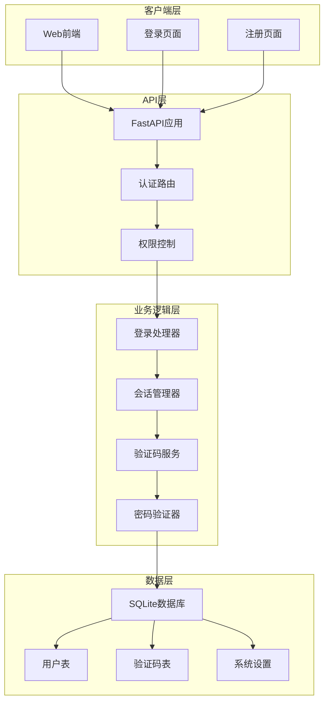

**图表来源**
- [reply_server.py](file://reply_server.py#L308-L320)
- [db_manager.py](file://db_manager.py#L2426-L2538)

## 核心认证组件

### 主要配置常量

系统定义了关键的认证配置参数：

| 配置项 | 类型 | 默认值 | 描述 |
|--------|------|--------|------|
| ADMIN_USERNAME | str | "admin" | 管理员用户名标识 |
| DEFAULT_ADMIN_PASSWORD | str | "admin123" | 默认管理员密码 |
| SESSION_TOKENS | dict | {} | 内存会话存储 |
| TOKEN_EXPIRE_TIME | int | 24小时 | Token过期时间 |

### 安全认证组件

系统使用HTTP Bearer认证机制，通过`HTTPBearer`类实现标准的Bearer Token认证：

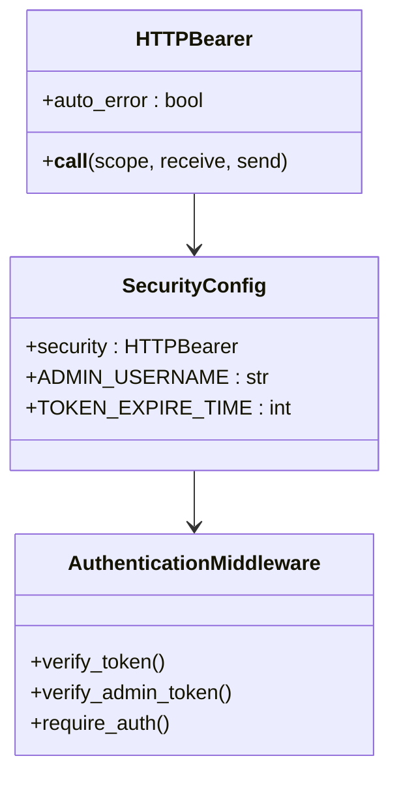

**图表来源**
- [reply_server.py](file://reply_server.py#L48-L50)

**章节来源**
- [reply_server.py](file://reply_server.py#L42-L47)

## Pydantic模型设计

系统定义了完整的认证相关数据模型，确保数据验证和API接口的一致性。

### LoginRequest模型

登录请求模型支持多种登录方式：

| 字段名 | 类型 | 是否必需 | 描述 |
|--------|------|----------|------|
| username | Optional[str] | 否 | 用户名 |
| password | Optional[str] | 否 | 密码 |
| email | Optional[str] | 否 | 邮箱地址 |
| verification_code | Optional[str] | 否 | 验证码 |

### LoginResponse模型

登录响应模型提供标准化的返回结构：

| 字段名 | 类型 | 描述 |
|--------|------|------|
| success | bool | 登录是否成功 |
| token | Optional[str] | 认证令牌 |
| message | str | 响应消息 |
| user_id | Optional[int] | 用户ID |
| username | Optional[str] | 用户名 |
| is_admin | Optional[bool] | 是否管理员 |

### ChangePasswordRequest模型

密码修改请求模型：

| 字段名 | 类型 | 描述 |
|--------|------|------|
| current_password | str | 当前密码 |
| new_password | str | 新密码 |

### 验证码相关模型

系统还定义了完整的验证码处理模型：

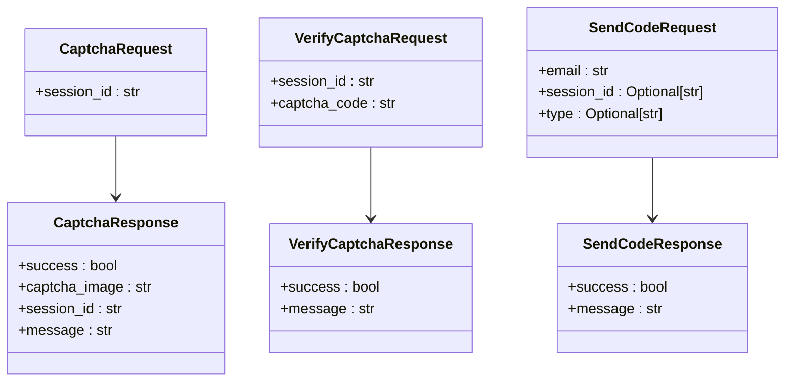

**图表来源**
- [reply_server.py](file://reply_server.py#L112-L177)

**章节来源**
- [reply_server.py](file://reply_server.py#L112-L177)

## 会话管理机制

### SESSION_TOKENS会话存储

系统采用内存字典存储会话信息，实现轻量级的会话管理：

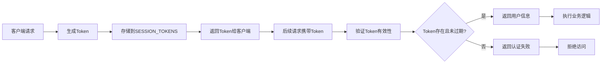

**图表来源**
- [reply_server.py](file://reply_server.py#L178-L199)

### generate_token函数实现

Token生成采用安全的随机数生成器：

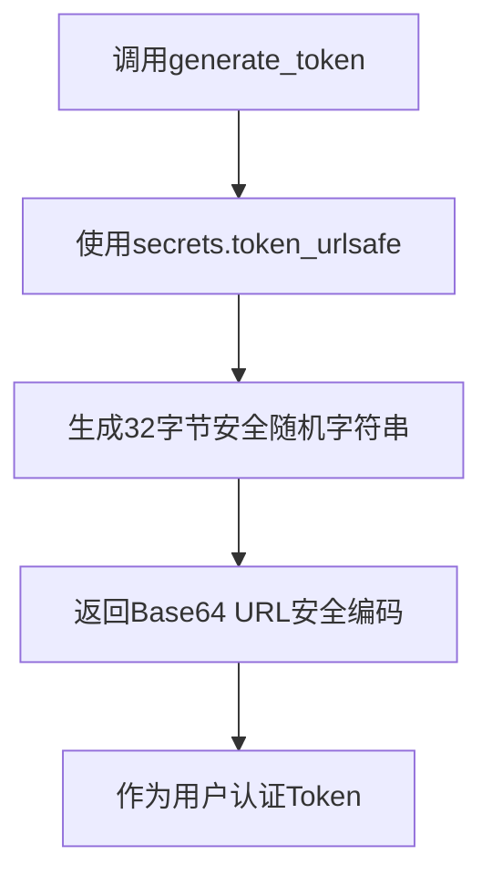

**图表来源**
- [reply_server.py](file://reply_server.py#L178-L181)

### verify_token函数工作流程

Token验证函数实现了完整的验证逻辑：

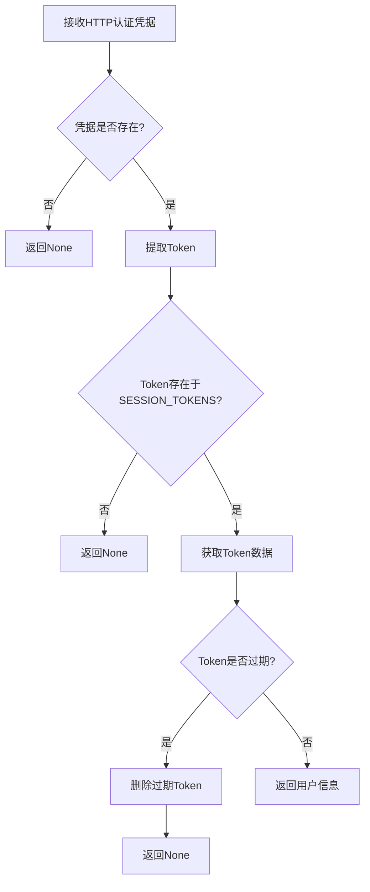

**图表来源**
- [reply_server.py](file://reply_server.py#L183-L199)

**章节来源**
- [reply_server.py](file://reply_server.py#L178-L199)

## 多因素认证体系

### 图形验证码系统

系统实现了完整的图形验证码保护机制：

#### 验证码生成流程

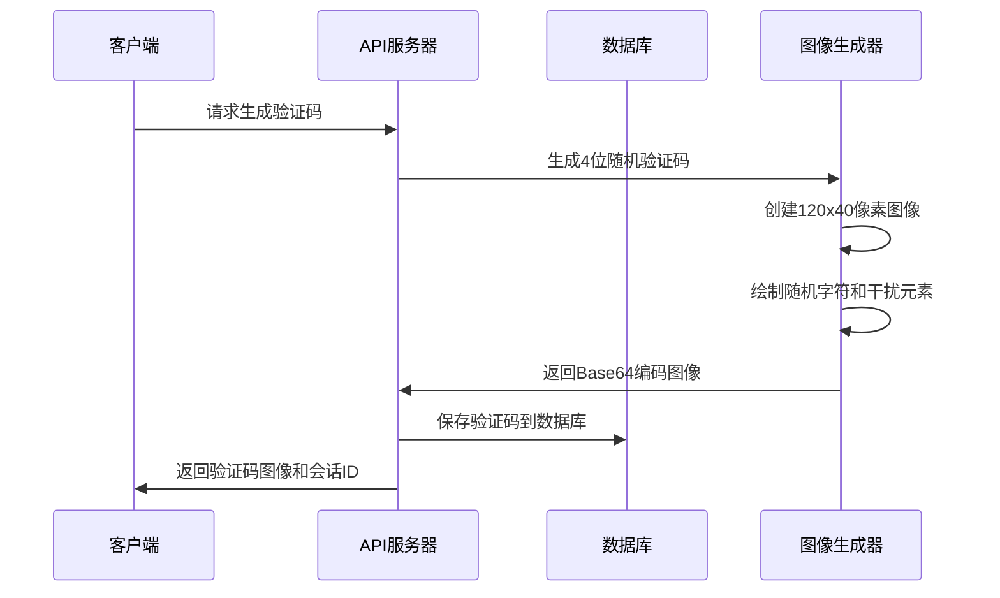

**图表来源**
- [db_manager.py](file://db_manager.py#L2540-L2599)

#### 验证码验证流程

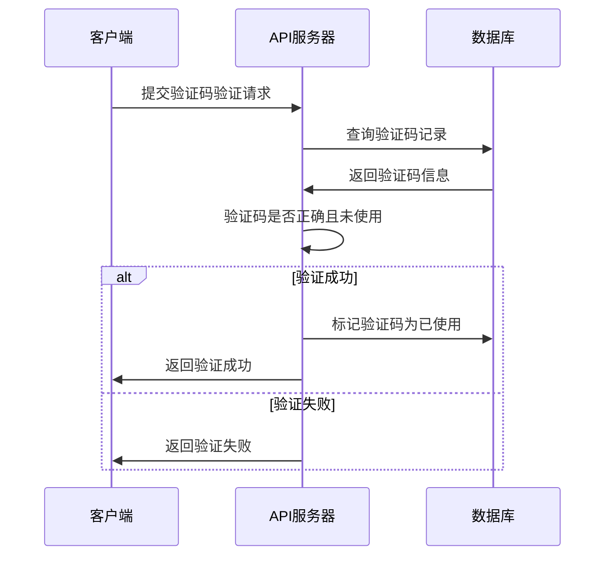

**图表来源**
- [db_manager.py](file://db_manager.py#L2677-L2705)

### 邮箱验证码系统

#### 验证码生成与发送

系统支持多种验证码类型，包括注册和登录两种模式：

| 验证码类型 | 用途 | 验证规则 |
|------------|------|----------|
| register | 用户注册 | 检查邮箱是否已注册 |
| login | 用户登录 | 检查邮箱是否已注册 |

#### 验证码验证逻辑

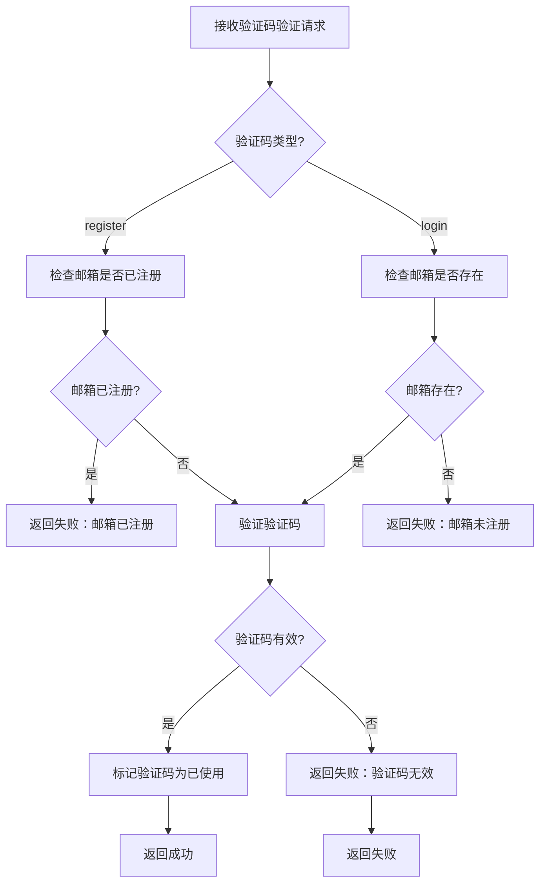

**图表来源**
- [reply_server.py](file://reply_server.py#L776-L839)

### 邮件发送机制

系统支持两种邮件发送方式：

1. **API方式**：通过外部邮件服务API发送
2. **SMTP方式**：直接使用SMTP协议发送

**章节来源**
- [reply_server.py](file://reply_server.py#L707-L839)
- [db_manager.py](file://db_manager.py#L2669-L2833)

## 权限控制逻辑

### 用户认证依赖函数

系统定义了多个认证依赖函数，提供不同级别的权限控制：

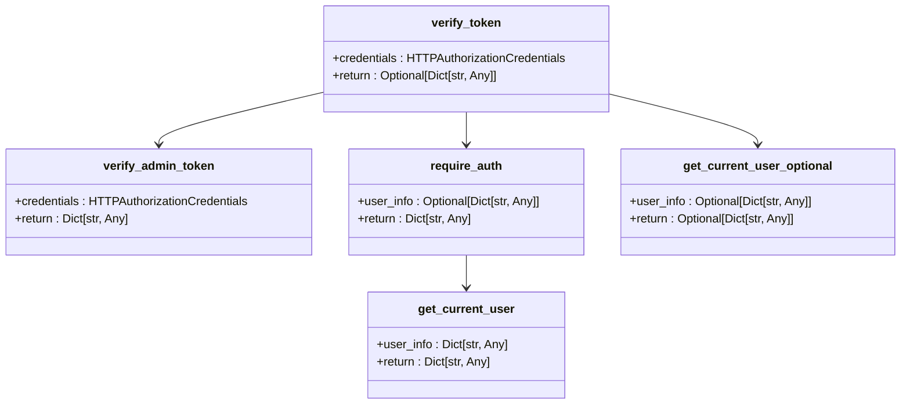

**图表来源**
- [reply_server.py](file://reply_server.py#L183-L229)

### 管理员权限验证

管理员权限验证通过专门的`verify_admin_token`函数实现：

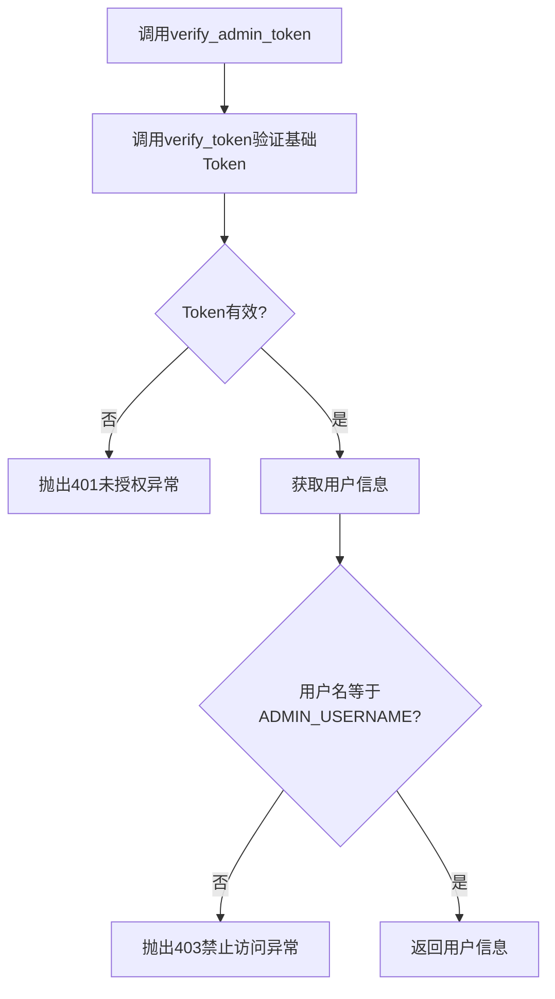

**图表来源**
- [reply_server.py](file://reply_server.py#L202-L212)

### 权限控制函数对比

| 函数名 | 功能 | 异常处理 | 使用场景 |
|--------|------|----------|----------|
| verify_token | 基础Token验证 | 返回None | 可选认证 |
| require_auth | 强制认证依赖 | 抛出401异常 | 必需认证 |
| verify_admin_token | 管理员权限验证 | 抛出401/403异常 | 管理员功能 |
| get_current_user | 获取当前用户信息 | 抛出401异常 | 需要用户上下文 |

**章节来源**
- [reply_server.py](file://reply_server.py#L183-L229)

## 安全实现细节

### 密码加密存储

系统采用SHA256算法对用户密码进行哈希处理：

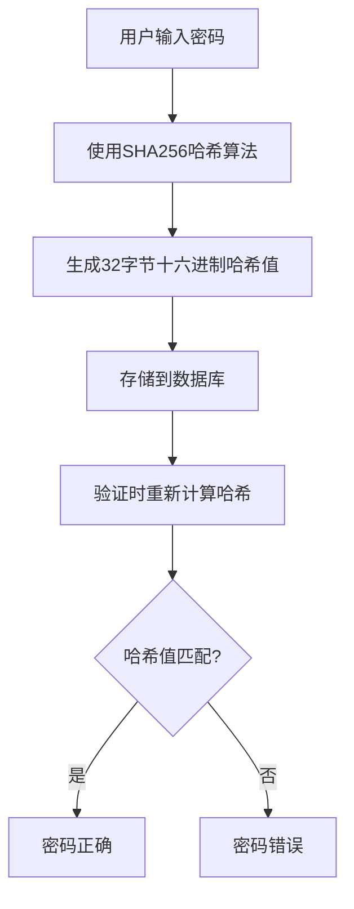

**图表来源**
- [db_manager.py](file://db_manager.py#L2502-L2509)

### 密码修改安全机制

管理员密码修改接口实现了完整的安全验证流程：

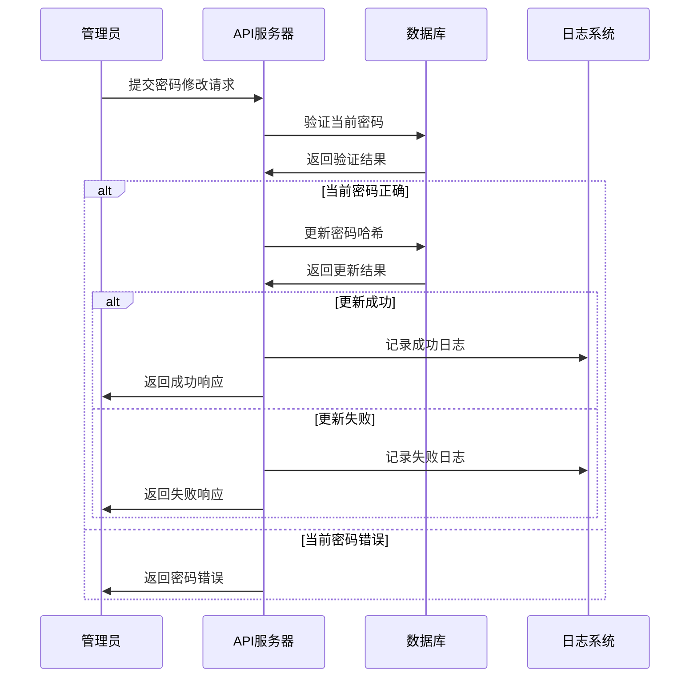

**图表来源**
- [reply_server.py](file://reply_server.py#L684-L704)

### Token过期机制

系统实现了基于时间戳的Token过期检查：

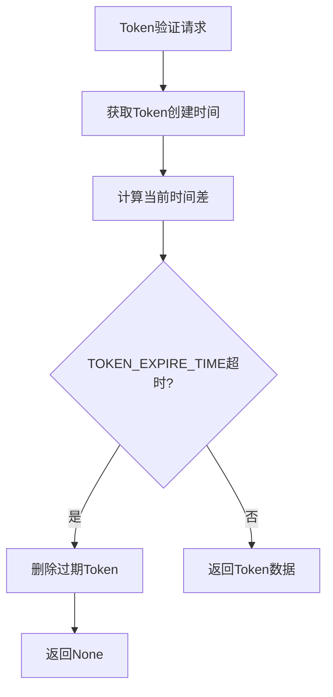

**图表来源**
- [reply_server.py](file://reply_server.py#L194-L197)

**章节来源**
- [db_manager.py](file://db_manager.py#L2502-L2534)
- [reply_server.py](file://reply_server.py#L684-L704)

## 认证流程详解

### 完整登录流程

系统支持多种登录方式，以下是完整的登录流程图：

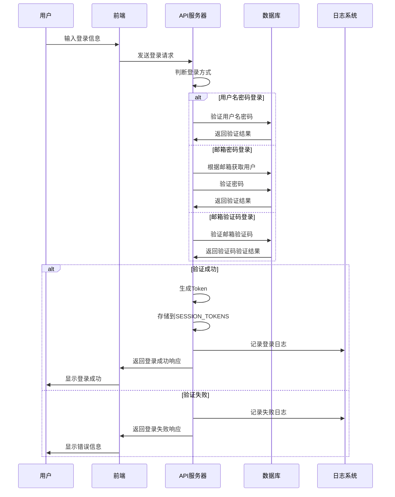

**图表来源**
- [reply_server.py](file://reply_server.py#L542-L659)

### 验证码登录流程

邮箱验证码登录提供了额外的安全保护：

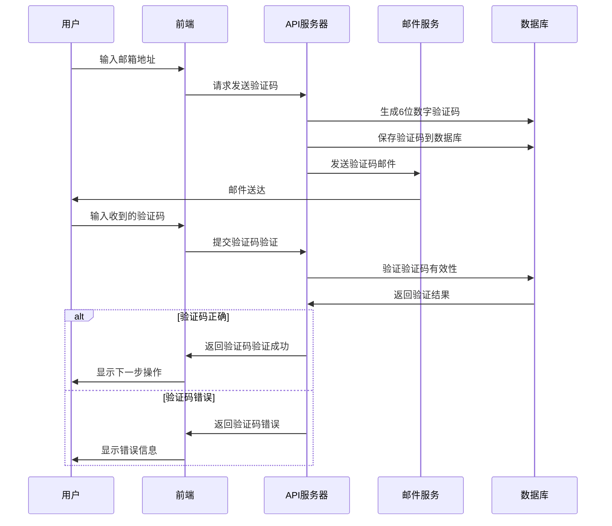

**图表来源**
- [reply_server.py](file://reply_server.py#L776-L839)

### 前端认证流程

前端JavaScript实现了完整的认证状态管理和Token处理：

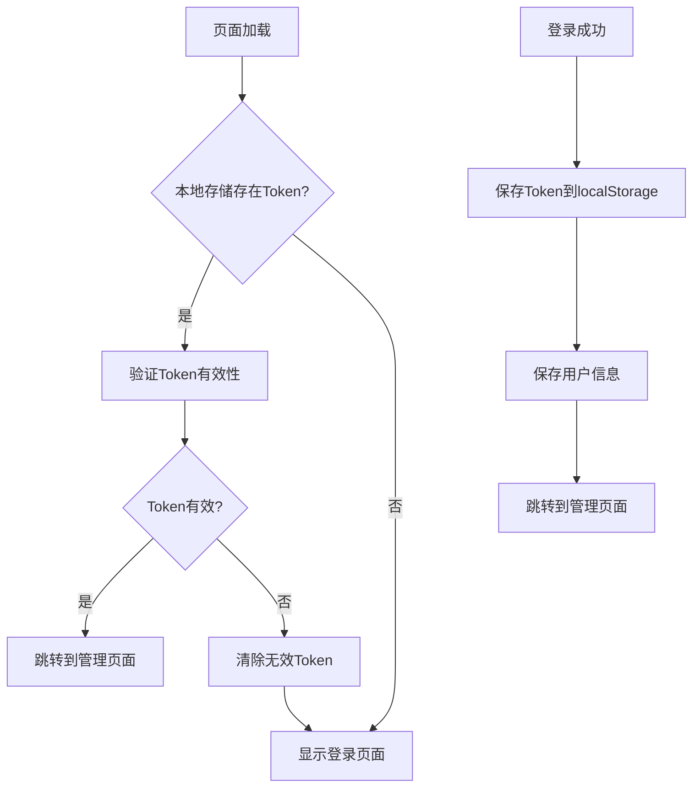

**图表来源**
- [static/login.html](file://static/login.html#L411-L429)

**章节来源**
- [reply_server.py](file://reply_server.py#L542-L659)
- [static/login.html](file://static/login.html#L374-L408)

## 故障排除指南

### 常见认证失败场景

#### 1. Token验证失败

**症状**：API请求返回401未授权错误

**可能原因**：
- Token已过期（超过24小时）
- Token被手动删除
- 请求头缺少Authorization字段

**解决方案**：
- 检查请求头格式：`Authorization: Bearer YOUR_TOKEN`
- 重新登录获取新Token
- 检查系统时间是否正确

#### 2. 图形验证码验证失败

**症状**：验证码输入正确但验证失败

**可能原因**：
- 验证码已过期（通常10分钟）
- 中间人攻击导致会话ID不匹配
- 图像识别错误

**解决方案**：
- 刷新验证码重新输入
- 检查网络连接稳定性
- 确保会话ID正确传递

#### 3. 邮箱验证码超时

**症状**：验证码发送成功但验证失败

**可能原因**：
- 用户延迟太久输入验证码
- 验证码有效期已过（10分钟）

**解决方案**：
- 重新发送验证码
- 确保在有效期内完成验证
- 检查系统时钟同步

#### 4. 管理员权限不足

**症状**：访问管理员功能返回403禁止访问

**可能原因**：
- 当前用户不是管理员
- 管理员账户被禁用
- 系统管理员密码被修改

**解决方案**：
- 使用管理员账户登录
- 检查管理员账户状态
- 重新设置管理员密码

### 性能优化建议

#### 1. Token存储优化

当前系统使用内存存储SESSION_TOKENS，对于高并发场景建议：

- 实现Redis等分布式缓存
- 设置合理的过期时间
- 定期清理过期会话

#### 2. 验证码性能优化

- 使用CDN加速验证码图片加载
- 实现验证码预生成机制
- 限制同一IP的验证码请求频率

#### 3. 数据库优化

- 为验证码表添加索引
- 定期清理过期验证码记录
- 监控数据库连接池使用情况

### 安全加固建议

#### 1. 防止暴力破解

- 实现登录失败次数限制
- 添加IP封禁机制
- 使用更复杂的验证码规则

#### 2. 防止CSRF攻击

- 实现CSRF Token验证
- 使用SameSite Cookie属性
- 验证Referer头部

#### 3. 加强密码策略

- 强制复杂密码规则
- 实现密码历史检查
- 定期强制密码更新

**章节来源**
- [reply_server.py](file://reply_server.py#L183-L199)
- [db_manager.py](file://db_manager.py#L2677-L2705)

## 总结

本文档全面解析了闲鱼自动回复系统的认证与权限控制机制。系统采用了多层次的安全防护策略，包括：

1. **多样化的登录方式**：支持用户名密码、邮箱密码和邮箱验证码等多种登录方式
2. **完善的验证码保护**：实现了图形验证码和邮箱验证码双重保护机制
3. **严格的权限控制**：通过Token验证和角色权限分离确保系统安全
4. **灵活的会话管理**：采用内存存储结合过期机制实现高效的会话管理
5. **完整的安全措施**：密码哈希存储、Token过期控制、异常处理等安全特性

该认证系统设计合理，安全可靠，能够满足企业级应用的安全需求。通过持续的安全审计和性能优化，可以进一步提升系统的安全性和可用性。