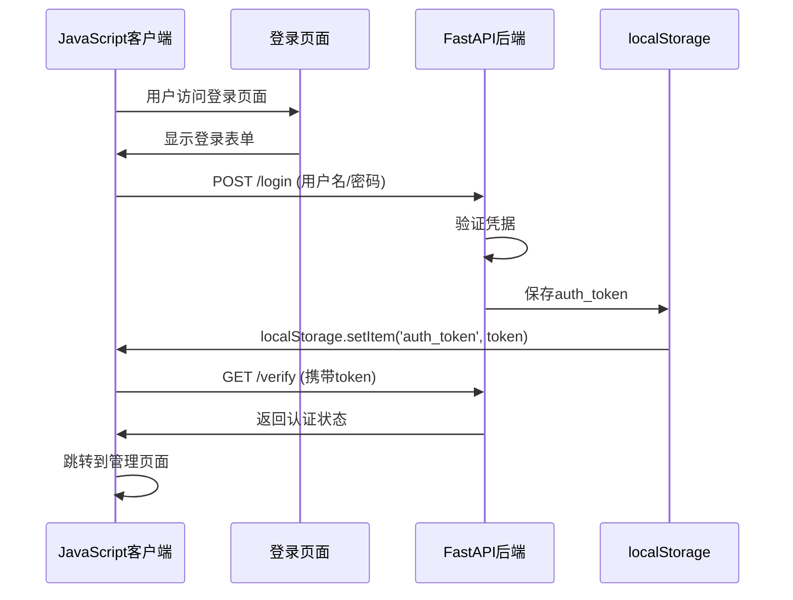

# 前后端通信机制

<cite>
**本文档引用的文件**
- [app.js](file://static/js/app.js)
- [login.html](file://static/login.html)
- [index.html](file://static/index.html)
- [reply_server.py](file://reply_server.py)
- [config.py](file://config.py)
- [nginx.conf](file://nginx/nginx.conf)
</cite>

## 目录
1. [概述](#概述)
2. [认证机制](#认证机制)
3. [JavaScript客户端通信](#javascript客户端通信)
4. [后端API端点](#后端api端点)
5. [请求日志中间件](#请求日志中间件)
6. [CORS与安全配置](#cors与安全配置)
7. [错误处理策略](#错误处理策略)
8. [性能优化](#性能优化)
9. [总结](#总结)

## 概述

该系统采用前后端分离架构，前端使用JavaScript通过Fetch API与后端FastAPI服务进行通信。整个通信机制围绕Bearer Token认证展开，确保用户身份验证和数据安全传输。

## 认证机制

### Bearer Token认证流程

系统使用基于JWT的Bearer Token认证机制，具体实现如下：



**图表来源**
- [login.html](file://static/login.html#L368-L400)
- [reply_server.py](file://reply_server.py#L542-L660)

### Token管理

JavaScript客户端通过以下方式管理认证令牌：

```javascript
// 全局authToken变量
let authToken = localStorage.getItem('auth_token');

// 登录成功后保存token
localStorage.setItem('auth_token', result.token);

// 请求时自动添加Authorization头
headers: {
    'Authorization': `Bearer ${authToken}`
}
```

**节来源**
- [app.js](file://static/js/app.js#L8-L9)
- [login.html](file://static/login.html#L379-L389)

### 后端认证验证

后端使用HTTP Bearer认证中间件验证请求：

```python
# HTTP Bearer认证
security = HTTPBearer(auto_error=False)

# 验证token函数
def verify_token(credentials: Optional[HTTPAuthorizationCredentials] = Depends(security)):
    if not credentials:
        return None
    
    token = credentials.credentials
    if token not in SESSION_TOKENS:
        return None
    
    # 检查token是否过期
    if time.time() - token_data['timestamp'] > TOKEN_EXPIRE_TIME:
        del SESSION_TOKENS[token]
        return None
    
    return token_data
```

**节来源**
- [reply_server.py](file://reply_server.py#L48-L220)

## JavaScript客户端通信

### Fetch API封装

系统封装了统一的fetch请求处理函数，提供错误处理和认证支持：

```javascript
async function fetchJSON(url, opts = {}) {
    toggleLoading(true);
    try {
        // 添加认证头
        if (authToken) {
            opts.headers = opts.headers || {};
            opts.headers['Authorization'] = `Bearer ${authToken}`;
        }
        
        const res = await fetch(url, opts);
        
        if (res.status === 401) {
            // 未授权，跳转到登录页面
            localStorage.removeItem('auth_token');
            window.location.href = '/';
            return;
        }
        
        if (!res.ok) {
            // 处理错误响应
            let errorMessage = `HTTP ${res.status}`;
            try {
                const errorText = await res.text();
                if (errorText) {
                    try {
                        const errorJson = JSON.parse(errorText);
                        errorMessage = errorJson.detail || errorJson.message || errorText;
                    } catch {
                        errorMessage = errorText;
                    }
                }
            } catch {
                errorMessage = `HTTP ${res.status} ${res.statusText}`;
            }
            throw new Error(errorMessage);
        }
        
        const data = await res.json();
        toggleLoading(false);
        return data;
    } catch (err) {
        handleApiError(err);
        throw err;
    }
}
```

**节来源**
- [app.js](file://static/js/app.js#L1108-L1149)

### 关键API调用示例

#### 仪表盘数据加载

```javascript
async function loadDashboard() {
    try {
        toggleLoading(true);
        
        // 获取账号列表
        const cookiesResponse = await fetch(`${apiBase}/cookies/details`, {
            headers: {
                'Authorization': `Bearer ${authToken}`
            }
        });
        
        if (cookiesResponse.ok) {
            const cookiesData = await cookiesResponse.json();
            
            // 并行获取每个账号的关键词
            const accountsWithKeywords = await Promise.all(
                cookiesData.map(async (account) => {
                    const keywordsResponse = await fetch(`${apiBase}/keywords/${account.id}`, {
                        headers: {
                            'Authorization': `Bearer ${authToken}`
                        }
                    });
                    
                    if (keywordsResponse.ok) {
                        const keywordsData = await keywordsResponse.json();
                        return {
                            ...account,
                            keywords: keywordsData,
                            keywordCount: keywordsData.length
                        };
                    } else {
                        return {
                            ...account,
                            keywords: [],
                            keywordCount: 0
                        };
                    }
                })
            );
            
            // 更新仪表盘显示
            updateDashboardStats(accountsWithKeywords.length, totalKeywords, enabledAccounts);
            updateDashboardAccountsList(accountsWithKeywords);
        }
    } catch (error) {
        console.error('加载仪表盘数据失败:', error);
        showToast('加载仪表盘数据失败', 'danger');
    } finally {
        toggleLoading(false);
    }
}
```

**节来源**
- [app.js](file://static/js/app.js#L157-L240)

#### 商品关键词管理

```javascript
// 添加或更新关键词
async function addKeyword() {
    const keyword = document.getElementById('newKeyword').value.trim();
    const reply = document.getElementById('newReply').value.trim();
    const itemId = document.getElementById('newItemIdSelect').value.trim();
    
    try {
        toggleLoading(true);
        
        // 准备关键词数据
        let currentKeywords = [...(keywordsData[currentCookieId] || [])];
        let textKeywords = currentKeywords.filter(item => (item.type || 'text') === 'text');
        
        // 发送POST请求更新关键词
        const response = await fetch(`${apiBase}/keywords-with-item-id/${currentCookieId}`, {
            method: 'POST',
            headers: {
                'Content-Type': 'application/json',
                'Authorization': `Bearer ${authToken}`
            },
            body: JSON.stringify({
                keywords: textKeywords
            })
        });
        
        if (response.ok) {
            showToast(`✨ 关键词 "${keyword}" 添加成功！`, 'success');
            await refreshKeywordsList();
        }
    } catch (error) {
        console.error('关键词添加失败:', error);
        showToast('关键词添加失败', 'danger');
    } finally {
        toggleLoading(false);
    }
}
```

**节来源**
- [app.js](file://static/js/app.js#L669-L796)

## 后端API端点

### 关键端点列表

系统提供了多个RESTful API端点，支持完整的CRUD操作：

| 端点 | 方法 | 描述 | 认证 |
|------|------|------|------|
| `/api/keywords` | GET | 获取所有关键词 | 是 |
| `/api/keywords/{cid}` | GET | 获取特定账号的关键词 | 是 |
| `/api/keywords-with-item-id/{cid}` | GET/POST | 获取或更新包含商品ID的关键词 | 是 |
| `/api/items` | GET | 获取所有商品信息 | 是 |
| `/api/items/{cookie_id}` | GET | 获取特定账号的商品 | 是 |
| `/api/orders` | GET | 获取订单信息 | 是 |
| `/login` | POST | 用户登录 | 否 |
| `/verify` | GET | 验证token | 是 |
| `/logout` | POST | 用户登出 | 是 |

### 商品管理端点

```python
@app.get("/items")
def get_all_items(current_user: Dict[str, Any] = Depends(get_current_user)):
    """获取当前用户的所有商品信息"""
    try:
        user_id = current_user['user_id']
        from db_manager import db_manager
        user_cookies = db_manager.get_all_cookies(user_id)
        
        all_items = []
        for cookie_id in user_cookies.keys():
            items = db_manager.get_items_by_cookie(cookie_id)
            all_items.extend(items)
        
        return {"items": all_items}
    except Exception as e:
        raise HTTPException(status_code=500, detail=f"获取商品信息失败: {str(e)}")
```

**节来源**
- [reply_server.py](file://reply_server.py#L3961-L3978)

### 订单管理端点

```python
@app.get('/api/orders')
def get_user_orders(current_user: Dict[str, Any] = Depends(get_current_user)):
    """获取当前用户的订单信息"""
    try:
        from db_manager import db_manager
        
        user_id = current_user['user_id']
        log_with_user('info', "查询用户订单信息", current_user)
        
        # 获取用户的所有Cookie
        user_cookies = db_manager.get_all_cookies(user_id)
        
        # 获取所有订单
        all_orders = []
        for cookie_id in user_cookies:
            orders = db_manager.get_orders_by_cookie(cookie_id)
            all_orders.extend(orders)
        
        return {"success": True, "data": all_orders}
    except Exception as e:
        logger.error(f"获取订单信息失败: {e}")
        raise HTTPException(status_code=500, detail="获取订单信息失败")
```

**节来源**
- [reply_server.py](file://reply_server.py#L5524-L5555)

## 请求日志中间件

### 中间件实现

系统实现了自定义的请求日志中间件，记录所有API请求的详细信息：

```python
@app.middleware("http")
async def log_requests(request, call_next):
    start_time = time.time()
    
    # 获取用户信息
    user_info = "未登录"
    try:
        auth_header = request.headers.get("Authorization")
        if auth_header and auth_header.startswith("Bearer "):
            token = auth_header.split(" ")[1]
            if token in SESSION_TOKENS:
                token_data = SESSION_TOKENS[token]
                if time.time() - token_data['timestamp'] <= TOKEN_EXPIRE_TIME:
                    user_info = f"【{token_data['username']}#{token_data['user_id']}】"
    except Exception:
        pass
    
    logger.info(f"🌐 {user_info} API请求: {request.method} {request.url.path}")
    
    response = await call_next(request)
    
    process_time = time.time() - start_time
    logger.info(f"✅ {user_info} API响应: {request.method} {request.url.path} - {response.status_code} ({process_time:.3f}s)")
    
    return response
```

**节来源**
- [reply_server.py](file://reply_server.py#L331-L357)

### 日志记录内容

中间件记录以下信息：
- 用户标识（用户名和ID）
- 请求方法和路径
- 响应状态码
- 处理时间
- 请求头信息

## CORS与安全配置

### Nginx安全头配置

Nginx反向代理配置了严格的安全头，防止常见的Web攻击：

```nginx
# 安全头配置
add_header X-Frame-Options "SAMEORIGIN" always;
add_header X-XSS-Protection "1; mode=block" always;
add_header X-Content-Type-Options "nosniff" always;
add_header Referrer-Policy "no-referrer-when-downgrade" always;
add_header Content-Security-Policy "default-src 'self' http: https: data: blob: 'unsafe-inline'" always;
```

**节来源**
- [nginx.conf](file://nginx/nginx.conf#L53-L58)

### 内容安全策略

系统实施了严格的内容安全策略（CSP）：
- 限制资源加载源为同源和HTTPS
- 禁止内联脚本执行
- 限制WebSocket连接
- 禁止不安全的协议

### 跨域资源共享（CORS）

虽然系统主要面向内部使用，但Nginx配置支持必要的跨域请求：

```nginx
location / {
    proxy_pass http://xianyu_backend;
    proxy_http_version 1.1;
    proxy_set_header Upgrade $http_upgrade;
    proxy_set_header Connection 'upgrade';
    proxy_set_header Host $host;
    proxy_set_header X-Real-IP $remote_addr;
    proxy_set_header X-Forwarded-For $proxy_add_x_forwarded_for;
    proxy_set_header X-Forwarded-Proto $scheme;
}
```

**节来源**
- [nginx.conf](file://nginx/nginx.conf#L61-L74)

## 错误处理策略

### 前端错误处理

JavaScript客户端实现了多层次的错误处理：

```javascript
// 统一错误处理函数
function handleApiError(error) {
    console.error('API请求错误:', error);
    
    // 根据错误类型显示不同提示
    if (error.message.includes('NetworkError')) {
        showToast('网络连接失败，请检查网络', 'danger');
    } else if (error.message.includes('401')) {
        // 未授权，自动跳转登录
        localStorage.removeItem('auth_token');
        window.location.href = '/';
    } else {
        showToast(`操作失败: ${error.message}`, 'danger');
    }
}

// fetchJSON函数中的错误处理
async function fetchJSON(url, opts = {}) {
    try {
        const res = await fetch(url, opts);
        
        if (!res.ok) {
            let errorMessage = `HTTP ${res.status}`;
            try {
                const errorText = await res.text();
                if (errorText) {
                    try {
                        const errorJson = JSON.parse(errorText);
                        errorMessage = errorJson.detail || errorJson.message || errorText;
                    } catch {
                        errorMessage = errorText;
                    }
                }
            } catch {
                errorMessage = `HTTP ${res.status} ${res.statusText}`;
            }
            throw new Error(errorMessage);
        }
        
        return await res.json();
    } catch (err) {
        handleApiError(err);
        throw err;
    }
}
```

**节来源**
- [app.js](file://static/js/app.js#L1108-L1149)

### 后端错误处理

后端使用FastAPI的HTTPException提供结构化的错误响应：

```python
# 统一错误响应格式
class ErrorResponse(BaseModel):
    success: bool = False
    message: str
    detail: Optional[str] = None

# 示例错误处理
@app.post("/keywords/{cid}")
def update_keywords(cid: str, body: KeywordIn, current_user: Dict[str, Any] = Depends(get_current_user)):
    try:
        # 验证和处理逻辑
        kw_list = [(k, v) for k, v in body.keywords.items()]
        cookie_manager.manager.update_keywords(cid, kw_list)
        return {"msg": "updated", "count": len(kw_list)}
    except Exception as e:
        logger.error(f"更新关键词失败: {e}")
        raise HTTPException(status_code=500, detail=f"更新关键词失败: {str(e)}")
```

**节来源**
- [reply_server.py](file://reply_server.py#L3077-L3096)

### 错误分类处理

| 错误类型 | HTTP状态码 | 前端处理 | 后端处理 |
|----------|------------|----------|----------|
| 网络错误 | 0 | 显示网络错误提示 | 记录错误日志 |
| 未授权 | 401 | 自动跳转登录 | 清理无效token |
| 权限不足 | 403 | 显示权限不足 | 记录安全事件 |
| 资源不存在 | 404 | 显示资源不存在 | 记录访问尝试 |
| 服务器错误 | 500 | 显示服务器错误 | 详细错误日志 |

## 性能优化

### 缓存策略

系统实现了多层缓存机制：

```javascript
// 关键词缓存
let accountKeywordCache = {};
let cacheTimestamp = 0;
const CACHE_DURATION = 30000; // 30秒缓存

async function getAccountKeywordCount(accountId) {
    const now = Date.now();
    
    // 检查缓存
    if (accountKeywordCache[accountId] && (now - cacheTimestamp) < CACHE_DURATION) {
        return accountKeywordCache[accountId];
    }
    
    try {
        const response = await fetch(`${apiBase}/keywords/${accountId}`, {
            headers: {
                'Authorization': `Bearer ${authToken}`
            }
        });
        
        if (response.ok) {
            const keywordsData = await response.json();
            const count = keywordsData.length;
            
            // 更新缓存
            accountKeywordCache[accountId] = count;
            cacheTimestamp = now;
            
            return count;
        }
    } catch (error) {
        console.error(`获取账号 ${accountId} 关键词失败:`, error);
        return 0;
    }
}
```

**节来源**
- [app.js](file://static/js/app.js#L324-L362)

### 并发请求优化

```javascript
// 并行获取多个账号的关键词
const accountsWithKeywords = await Promise.all(
    cookiesData.map(async (account) => {
        const keywordsResponse = await fetch(`${apiBase}/keywords/${account.id}`, {
            headers: {
                'Authorization': `Bearer ${authToken}`
            }
        });
        
        if (keywordsResponse.ok) {
            const keywordsData = await keywordsResponse.json();
            return {
                ...account,
                keywords: keywordsData,
                keywordCount: keywordsData.length
            };
        } else {
            return {
                ...account,
                keywords: [],
                keywordCount: 0
            };
        }
    })
);
```

**节来源**
- [app.js](file://static/js/app.js#L171-L203)

### Nginx性能优化

```nginx
# 连接池配置
upstream xianyu_backend {
    server xianyu-app:8080;
    keepalive 32;
}

# 静态文件缓存
location ~* \.(js|css|png|jpg|jpeg|gif|ico|svg)$ {
    proxy_pass http://xianyu_backend;
    expires 1y;
    add_header Cache-Control "public, immutable";
}

# Gzip压缩
gzip on;
gzip_vary on;
gzip_min_length 1024;
gzip_proxied any;
gzip_comp_level 6;
gzip_types
    text/plain
    text/css
    text/xml
    text/javascript
    application/json
    application/javascript
    application/xml+rss
    application/atom+xml
    image/svg+xml;
```

**节来源**
- [nginx.conf](file://nginx/nginx.conf#L43-L81)

## 总结

该系统的前后端通信机制具有以下特点：

### 安全性
- 基于Bearer Token的认证机制
- 严格的CORS和安全头配置
- 输入验证和权限控制
- 完整的错误处理和日志记录

### 可靠性
- 统一的错误处理策略
- 请求重试机制
- 完整的API文档
- 结构化的错误响应

### 性能
- 多层缓存策略
- 并发请求优化
- 静态资源优化
- 压缩和缓存配置

### 可维护性
- 模块化的代码结构
- 统一的API设计规范
- 完善的日志记录
- 清晰的错误信息

这种设计确保了系统的安全性、可靠性和高性能，为用户提供良好的使用体验。