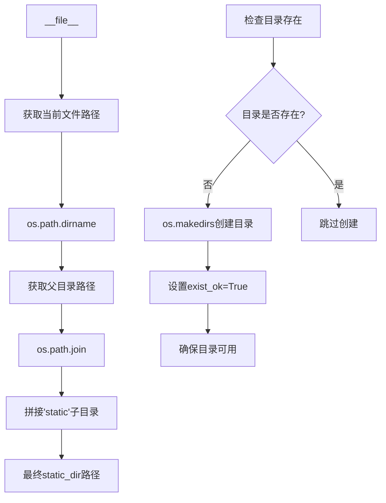
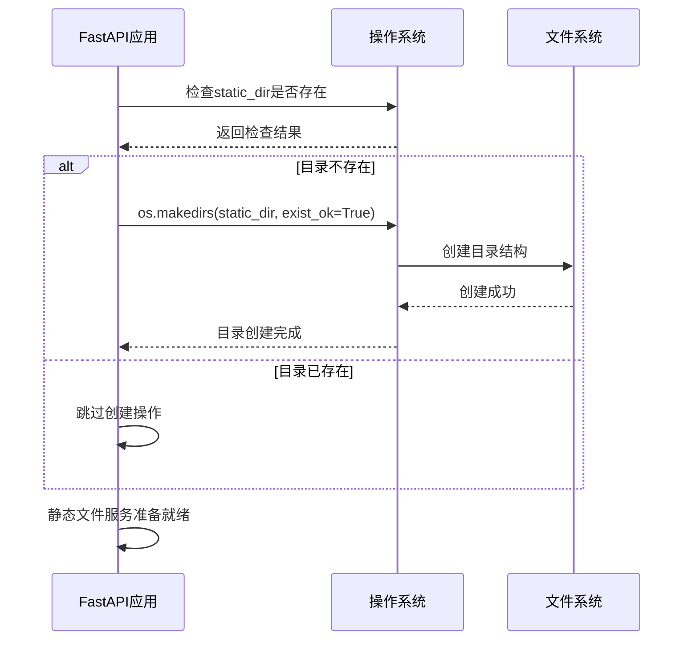
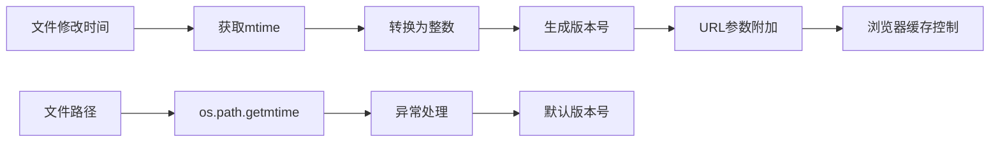
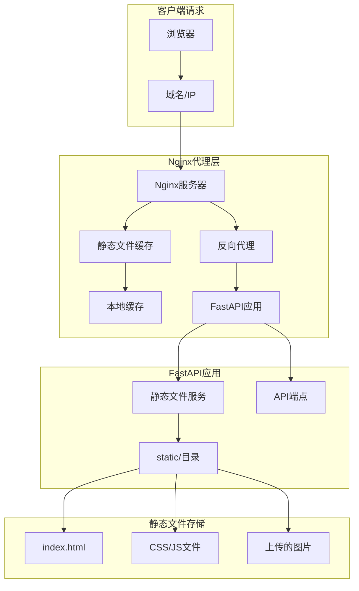
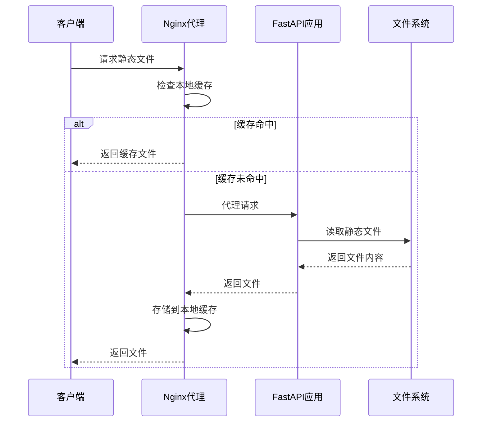

# 静态文件服务配置

<cite>
**本文档引用的文件**
- [reply_server.py](file://reply_server.py)
- [Start.py](file://Start.py)
- [nginx.conf](file://nginx/nginx.conf)
- [config.py](file://config.py)
- [global_config.yml](file://global_config.yml)
- [static/](file://static/)
</cite>

## 目录
1. [简介](#简介)
2. [项目结构概览](#项目结构概览)
3. [静态文件服务核心实现](#静态文件服务核心实现)
4. [路径构建逻辑](#路径构建逻辑)
5. [目录创建机制](#目录创建机制)
6. [URL路由规则](#url路由规则)
7. [安全限制](#安全限制)
8. [配置示例](#配置示例)
9. [Nginx反向代理协同工作](#nginx反向代理协同工作)
10. [最佳实践](#最佳实践)
11. [故障排除](#故障排除)

## 简介

FastAPI应用通过`app.mount()`方法实现静态资源服务，采用`StaticFiles`组件提供前端静态文件托管功能。本文档详细说明了静态文件服务的配置、部署和优化策略，包括路径构建、安全限制和与Nginx反向代理的协同工作机制。

## 项目结构概览

```mermaid
graph TB
subgraph "项目根目录"
A[reply_server.py] --> B[FastAPI应用]
C[static/] --> D[静态文件目录]
E[nginx/nginx.conf] --> F[Nginx配置]
end
subgraph "静态文件目录结构"
D --> G[index.html]
D --> H[login.html]
D --> I[register.html]
D --> J[js/]
D --> K[css/]
D --> L[uploads/]
end
subgraph "FastAPI静态服务"
B --> M[StaticFiles组件]
M --> N[/static URL路径]
N --> O[文件系统映射]
end
subgraph "Nginx代理层"
F --> P[反向代理配置]
P --> Q[静态文件缓存]
Q --> R[负载均衡]
end
```

**图表来源**
- [reply_server.py](file://reply_server.py#L359-L365)
- [static/](file://static/)

## 静态文件服务核心实现

FastAPI应用通过以下方式实现静态文件服务：

### 基础配置

```python
# 引入必要的模块
import os
from fastapi.staticfiles import StaticFiles

# 构建静态文件目录路径
static_dir = os.path.join(os.path.dirname(__file__), 'static')

# 确保目录存在
if not os.path.exists(static_dir):
    os.makedirs(static_dir, exist_ok=True)

# 挂载静态文件服务
app.mount('/static', StaticFiles(directory=static_dir), name='static')
```

### 关键特性

1. **自动目录创建**: 确保静态文件目录存在，避免运行时错误
2. **路径安全**: 使用相对路径确保跨平台兼容性
3. **命名空间隔离**: 通过`/static`路径前缀避免与其他路由冲突

**章节来源**
- [reply_server.py](file://reply_server.py#L360-L365)

## 路径构建逻辑

### `static_dir`变量的路径构建

路径构建采用以下逻辑：



**图表来源**
- [reply_server.py](file://reply_server.py#L360-L363)

### 跨平台兼容性

路径构建逻辑确保：
- **绝对路径**: 基于当前文件的绝对路径
- **跨平台**: 使用`os.path`模块确保Windows/Linux兼容
- **安全性**: 避免路径遍历攻击

**章节来源**
- [reply_server.py](file://reply_server.py#L360-L363)

## 目录创建机制

### 自动创建流程



**图表来源**
- [reply_server.py](file://reply_server.py#L361-L363)

### 权限设置

目录创建时采用以下策略：
- **递归创建**: 自动创建所有必要的父目录
- **权限继承**: 继承父目录的权限设置
- **原子操作**: 使用`exist_ok=True`避免竞态条件

**章节来源**
- [reply_server.py](file://reply_server.py#L361-L363)

## URL路由规则

### 路由映射关系

| URL路径 | 实际文件路径 | 功能描述 |
|---------|-------------|----------|
| `/static/` | `{static_dir}/` | 静态文件根目录 |
| `/static/index.html` | `{static_dir}/index.html` | 主页面 |
| `/static/login.html` | `{static_dir}/login.html` | 登录页面 |
| `/static/register.html` | `{static_dir}/register.html` | 注册页面 |
| `/static/js/app.js` | `{static_dir}/js/app.js` | 主要JavaScript文件 |
| `/static/css/app.css` | `{static_dir}/css/app.css` | 主要CSS样式文件 |

### 文件版本控制

应用实现了智能版本控制机制：



**图表来源**
- [reply_server.py](file://reply_server.py#L488-L500)

**章节来源**
- [reply_server.py](file://reply_server.py#L423-L524)

## 安全限制

### 内置安全机制

1. **路径隔离**: 静态文件服务仅访问指定目录及其子目录
2. **文件扩展名过滤**: 默认阻止危险文件类型
3. **访问控制**: 结合FastAPI中间件实现认证和授权

### 推荐安全配置

```python
# 安全的静态文件配置示例
from fastapi.staticfiles import StaticFiles
from fastapi import Request, HTTPException

# 中间件实现访问控制
@app.middleware("http")
async def static_security_middleware(request: Request, call_next):
    # 检查请求路径是否为静态文件
    if request.url.path.startswith("/static/"):
        # 实现访问控制逻辑
        # 例如：检查用户权限、IP白名单等
        pass
    
    response = await call_next(request)
    return response
```

### 防护措施

- **路径遍历防护**: FastAPI StaticFiles自动防止`../`路径遍历
- **文件类型限制**: 可通过自定义StaticFiles类实现
- **访问频率限制**: 可结合中间件实现

## 配置示例

### 基础配置

```python
# 基础静态文件服务配置
from fastapi import FastAPI
from fastapi.staticfiles import StaticFiles
import os

app = FastAPI()

# 静态文件目录配置
static_dir = os.path.join(os.path.dirname(__file__), 'static')

# 确保目录存在
os.makedirs(static_dir, exist_ok=True)

# 挂载静态文件服务
app.mount('/static', StaticFiles(directory=static_dir), name='static')
```

### 自定义静态文件目录

```python
# 自定义静态文件目录配置
custom_static_dir = "/path/to/custom/static/files"

# 确保自定义目录存在
if not os.path.exists(custom_static_dir):
    os.makedirs(custom_static_dir, exist_ok=True)

# 挂载自定义静态文件服务
app.mount('/assets', StaticFiles(directory=custom_static_dir), name='assets')
```

### 图片上传目录配置

```python
# 图片上传目录配置
uploads_dir = os.path.join(static_dir, 'uploads', 'images')
os.makedirs(uploads_dir, exist_ok=True)

# 在应用中使用上传目录
@app.post("/upload-image")
async def upload_image(file: UploadFile = File(...)):
    filename = f"{uuid.uuid4()}_{file.filename}"
    file_path = os.path.join(uploads_dir, filename)
    
    with open(file_path, "wb") as buffer:
        shutil.copyfileobj(file.file, buffer)
    
    return {"path": f"/static/uploads/images/{filename}"}
```

**章节来源**
- [reply_server.py](file://reply_server.py#L360-L371)

## Nginx反向代理协同工作

### Nginx配置架构



**图表来源**
- [nginx.conf](file://nginx/nginx.conf#L49-L87)

### Nginx配置详解

#### 基础代理配置

```nginx
# 上游服务器配置
upstream xianyu_backend {
    server xianyu-app:8080;
    keepalive 32;
}

# HTTP服务器配置
server {
    listen 80;
    server_name localhost;
    
    # 静态文件代理配置
    location ~* \.(js|css|png|jpg|jpeg|gif|ico|svg)$ {
        proxy_pass http://xianyu_backend;
        expires 1y;
        add_header Cache-Control "public, immutable";
    }
    
    # 主要代理配置
    location / {
        proxy_pass http://xianyu_backend;
        proxy_http_version 1.1;
        proxy_set_header Upgrade $http_upgrade;
        proxy_set_header Connection 'upgrade';
        proxy_set_header Host $host;
        proxy_set_header X-Real-IP $remote_addr;
        proxy_set_header X-Forwarded-For $proxy_add_x_forwarded_for;
        proxy_set_header X-Forwarded-Proto $scheme;
        proxy_cache_bypass $http_upgrade;
    }
}
```

#### 静态文件缓存策略

| 缓存类型 | 缓存时间 | 适用文件类型 | 配置指令 |
|----------|----------|--------------|----------|
| 长期缓存 | 1年 | JS/CSS/图片 | `expires 1y;` |
| 公共缓存 | 公开 | 静态资源 | `add_header Cache-Control "public, immutable";` |
| 短期缓存 | 30天 | 动态生成文件 | `expires 30d;` |

### 协同工作机制



**图表来源**
- [nginx.conf](file://nginx/nginx.conf#L76-L81)

**章节来源**
- [nginx.conf](file://nginx/nginx.conf#L43-L87)

## 最佳实践

### 性能优化建议

1. **缓存策略**
   - 静态文件设置长期缓存
   - 使用文件修改时间作为版本号
   - 实现智能缓存失效机制

2. **安全配置**
   - 限制可访问的文件类型
   - 实现访问频率限制
   - 使用HTTPS加密传输

3. **监控和日志**
   - 记录静态文件访问日志
   - 监控文件访问性能
   - 实现访问统计分析

### 部署建议

```python
# 生产环境配置示例
import os
from fastapi.staticfiles import StaticFiles
from pathlib import Path

# 生产环境静态文件配置
class ProductionStaticFiles(StaticFiles):
    def __init__(self, *args, **kwargs):
        super().__init__(*args, **kwargs)
        self.cache_dir = Path("/var/cache/fastapi/static")
        self.cache_dir.mkdir(parents=True, exist_ok=True)
    
    async def serve_file(self, filepath: Path, request):
        # 实现缓存逻辑
        cached_path = self.cache_dir / filepath.name
        if cached_path.exists():
            return await super().serve_file(cached_path, request)
        
        # 缓存未命中，生成缓存
        response = await super().serve_file(filepath, request)
        # 实现缓存存储逻辑
        
        return response

# 使用生产环境配置
app.mount('/static', ProductionStaticFiles(directory=static_dir), name='static')
```

## 故障排除

### 常见问题及解决方案

#### 1. 静态文件无法访问

**症状**: 浏览器返回404错误或空白页面

**排查步骤**:
```bash
# 检查静态文件目录权限
ls -la static/

# 检查FastAPI应用启动日志
# 确认静态文件服务已正确挂载

# 验证文件路径
curl -I http://localhost:8080/static/index.html
```

**解决方案**:
- 确保静态文件目录存在且可读
- 检查FastAPI应用是否正确启动
- 验证文件权限设置

#### 2. Nginx代理问题

**症状**: 静态文件加载缓慢或失败

**排查步骤**:
```nginx
# 检查Nginx配置语法
nginx -t

# 查看Nginx错误日志
tail -f /var/log/nginx/error.log

# 检查代理配置
curl -I http://localhost/static/index.html
```

**解决方案**:
- 验证Nginx配置文件语法
- 检查upstream服务器状态
- 调整缓存配置参数

#### 3. 文件版本控制问题

**症状**: 更新后的文件仍显示旧版本

**排查步骤**:
```javascript
// 检查浏览器开发者工具
// 查看Network标签页中的文件版本号
console.log('Static file version:', new Date());
```

**解决方案**:
- 确保文件修改时间正确更新
- 检查版本号生成逻辑
- 清除浏览器缓存

### 调试工具

```python
# 调试静态文件服务
import logging
from fastapi.staticfiles import StaticFiles

logging.basicConfig(level=logging.DEBUG)

class DebugStaticFiles(StaticFiles):
    def debug_log(self, message: str):
        logging.debug(f"[StaticFiles] {message}")
    
    async def serve_file(self, filepath: Path, request):
        self.debug_log(f"Serving file: {filepath}")
        self.debug_log(f"Request path: {request.url.path}")
        return await super().serve_file(filepath, request)

# 使用调试版本
app.mount('/static', DebugStaticFiles(directory=static_dir), name='static')
```

**章节来源**
- [reply_server.py](file://reply_server.py#L373-L418)

## 总结

FastAPI静态文件服务通过`StaticFiles`组件提供了高效、安全的静态资源托管能力。结合Nginx反向代理，可以实现高性能的静态文件服务架构。关键要点包括：

1. **路径安全**: 使用相对路径和`os.path`确保跨平台兼容性
2. **自动创建**: 智能目录创建机制避免运行时错误
3. **版本控制**: 基于文件修改时间的智能版本控制
4. **缓存优化**: Nginx层的多级缓存策略
5. **安全防护**: 内置的安全机制和可扩展的访问控制

通过遵循本文档的最佳实践和配置指南，可以构建稳定、高效的静态文件服务基础设施。