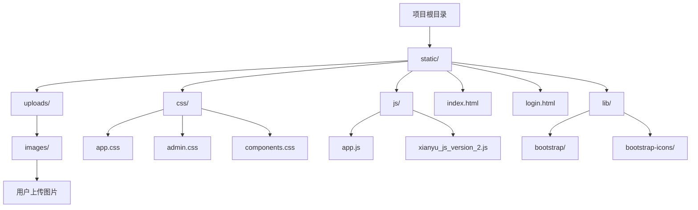
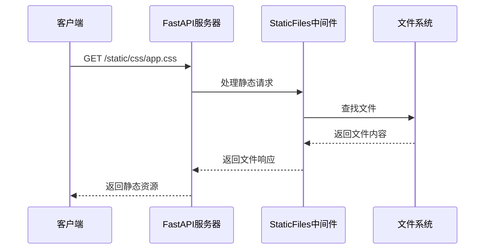
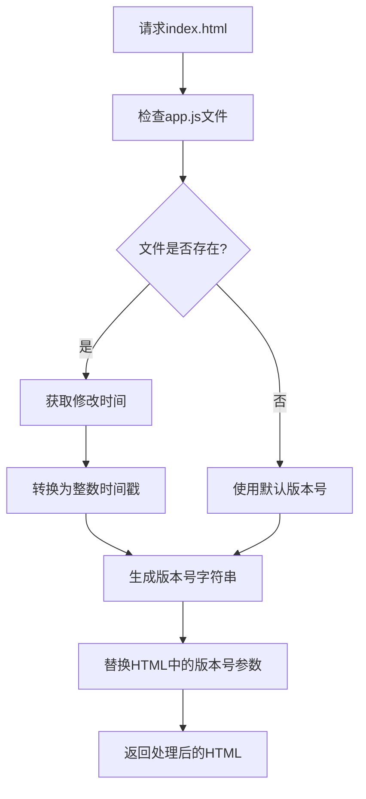
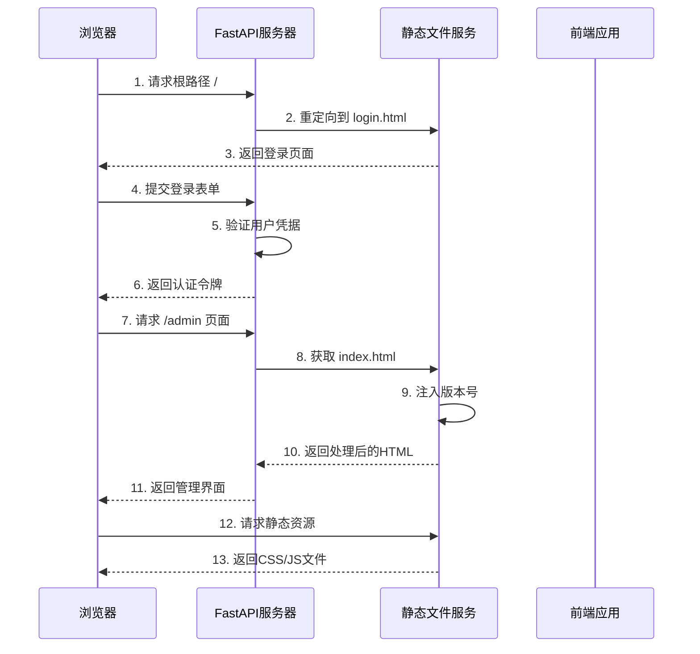
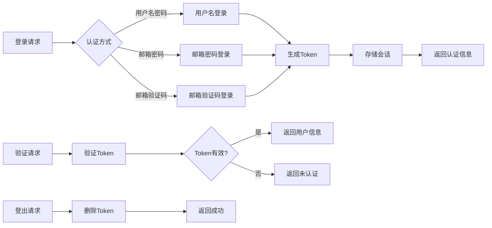
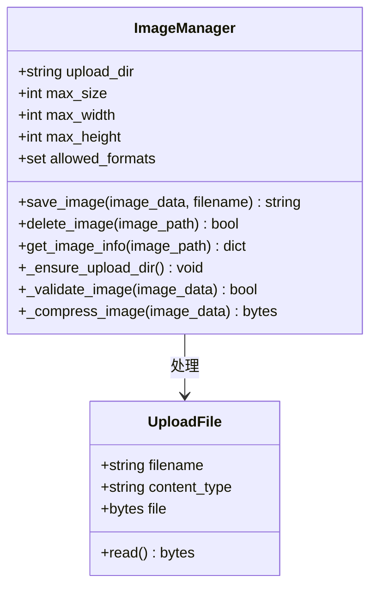
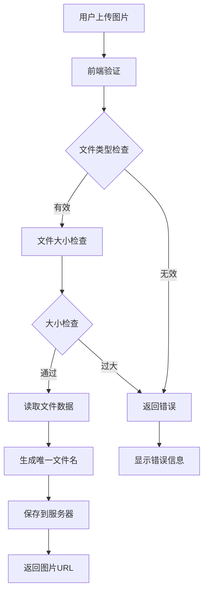

# 静态资源管理与前端集成

<cite>
**本文档引用的文件**
- [Start.py](file://Start.py)
- [XianyuAutoAsync.py](file://XianyuAutoAsync.py)
- [reply_server.py](file://reply_server.py)
- [static/index.html](file://static/index.html)
- [static/js/app.js](file://static/js/app.js)
- [static/login.html](file://static/login.html)
- [utils/image_utils.py](file://utils/image_utils.py)
</cite>

## 目录
1. [项目概述](#项目概述)
2. [静态资源配置架构](#静态资源配置架构)
3. [FastAPI静态文件服务](#fastapi静态文件服务)
4. [版本号注入机制](#版本号注入机制)
5. [前端资源加载流程](#前端资源加载流程)
6. [API端点集成](#api端点集成)
7. [图片上传与访问控制](#图片上传与访问控制)
8. [安全与性能优化](#安全与性能优化)
9. [故障排除指南](#故障排除指南)

## 项目概述

本项目是一个基于FastAPI的闲鱼自动回复管理系统，采用前后端分离架构。前端静态资源通过FastAPI的StaticFiles中间件提供服务，实现了高效的静态文件管理和版本控制机制。

### 核心特性
- **静态文件服务**：通过FastAPI提供统一的静态资源访问接口
- **版本控制**：智能版本号注入机制解决浏览器缓存问题
- **多端点API**：完整的用户认证和管理API体系
- **图片管理**：安全的图片上传和访问控制策略
- **响应式设计**：移动端友好的管理界面

## 静态资源配置架构

### 目录结构组织



**图表来源**
- [static/index.html](file://static/index.html#L1-L10)
- [utils/image_utils.py](file://utils/image_utils.py#L10-L12)

### 静态文件目录映射

项目使用FastAPI的StaticFiles中间件将本地目录映射到虚拟路径：

```python
# 静态文件目录配置
static_dir = os.path.join(os.path.dirname(__file__), 'static')
app.mount('/static', StaticFiles(directory=static_dir), name='static')
```

这种配置实现了以下功能：
- **统一访问路径**：所有静态资源通过 `/static/` 前缀访问
- **目录隔离**：前端资源与后端API完全分离
- **缓存优化**：支持浏览器缓存策略
- **安全性**：限制对敏感文件的直接访问

**章节来源**
- [reply_server.py](file://reply_server.py#L365-L366)

## FastAPI静态文件服务

### StaticFiles中间件配置

FastAPI的StaticFiles中间件提供了强大的静态文件服务能力：



**图表来源**
- [reply_server.py](file://reply_server.py#L365-L366)

### 路由映射规则

系统定义了多个静态资源路由：

| 路径模式 | 功能描述 | 访问方式 |
|---------|----------|----------|
| `/static/css/*` | 样式表文件 | `/static/css/app.css?v=timestamp` |
| `/static/js/*` | JavaScript文件 | `/static/js/app.js?v=timestamp` |
| `/static/lib/*` | 第三方库文件 | `/static/lib/bootstrap/bootstrap.min.css` |
| `/static/uploads/images/*` | 用户上传图片 | `/static/uploads/images/filename.jpg` |

### 图片上传目录管理

系统自动创建和管理图片上传目录：

```python
# 确保图片上传目录存在
uploads_dir = os.path.join(static_dir, 'uploads', 'images')
if not os.path.exists(uploads_dir):
    os.makedirs(uploads_dir, exist_ok=True)
    logger.info(f"创建图片上传目录: {uploads_dir}")
```

**章节来源**
- [reply_server.py](file://reply_server.py#L368-L372)

## 版本号注入机制

### get_file_version函数实现

系统通过修改时间戳生成版本号，有效解决浏览器缓存问题：



**图表来源**
- [reply_server.py](file://reply_server.py#L489-L497)

### 版本号注入逻辑

版本号注入过程包含以下步骤：

1. **文件检查**：验证目标文件是否存在
2. **时间获取**：读取文件的最后修改时间
3. **版本生成**：将时间戳转换为字符串
4. **HTML替换**：更新HTML中的资源引用

```python
def get_file_version(file_path, default='1.0.0'):
    """获取文件的版本号（基于修改时间）"""
    if os.path.exists(file_path):
        try:
            mtime = os.path.getmtime(file_path)
            return str(int(mtime))
        except Exception as e:
            logger.warning(f"获取文件 {file_path} 修改时间失败: {e}")
    return default
```

### 版本号应用策略

系统为不同类型的资源应用不同的版本号策略：

| 资源类型 | 版本号来源 | 缓存策略 |
|---------|-----------|----------|
| app.js | 文件修改时间 | 强缓存 |
| app.css | 文件修改时间 | 强缓存 |
| Bootstrap库 | 固定版本号 | CDN缓存 |
| 图片资源 | 文件路径 | 浏览器缓存 |

**章节来源**
- [reply_server.py](file://reply_server.py#L489-L524)

## 前端资源加载流程

### 完整加载流程图



**图表来源**
- [reply_server.py](file://reply_server.py#L422-L429)
- [reply_server.py](file://reply_server.py#L482-L524)

### 登录页面加载

登录页面的加载过程展示了完整的静态资源服务流程：

1. **根路径重定向**：访问 `/` 自动重定向到登录页面
2. **静态文件服务**：通过 `/static/` 路径提供登录页面
3. **资源依赖**：加载Bootstrap、图标字体等依赖资源
4. **JavaScript初始化**：执行登录表单验证和API调用逻辑

### 管理界面加载

管理界面的加载流程更加复杂：

1. **HTML模板**：从 `index.html` 模板生成页面
2. **版本注入**：动态注入CSS和JS文件的版本号
3. **资源预加载**：提前加载关键CSS和JS文件
4. **API初始化**：建立与后端API的连接

**章节来源**
- [reply_server.py](file://reply_server.py#L422-L429)
- [reply_server.py](file://reply_server.py#L482-L524)

## API端点集成

### 用户认证API

系统提供了完整的用户认证API体系：



**图表来源**
- [reply_server.py](file://reply_server.py#L542-L679)

### API端点列表

| 端点 | 方法 | 功能描述 | 认证要求 |
|------|------|----------|----------|
| `/login` | POST | 用户登录 | 无 |
| `/verify` | GET | 验证Token | Bearer Token |
| `/logout` | POST | 用户登出 | Bearer Token |
| `/admin` | GET | 管理界面 | Bearer Token |
| `/static/*` | GET | 静态资源 | 无 |

### JavaScript客户端调用

前端JavaScript通过Fetch API与后端交互：

```javascript
// 登录示例
const response = await fetch('/login', {
    method: 'POST',
    headers: {
        'Content-Type': 'application/json',
    },
    body: JSON.stringify(loginData)
});

// 验证Token示例
const verifyResponse = await fetch('/verify', {
    headers: {
        'Authorization': `Bearer ${token}`
    }
});
```

**章节来源**
- [static/login.html](file://static/login.html#L368-L377)
- [reply_server.py](file://reply_server.py#L542-L679)

## 图片上传与访问控制

### 图片管理器架构

系统使用专门的图片管理器处理图片上传和访问：



**图表来源**
- [utils/image_utils.py](file://utils/image_utils.py#L8-L218)

### 图片上传流程



**图表来源**
- [reply_server.py](file://reply_server.py#L3403-L3518)

### 访问控制策略

系统实施多层次的访问控制：

1. **文件扩展名验证**：只允许特定格式的图片
2. **文件大小限制**：防止大文件占用过多存储
3. **路径安全检查**：防止路径遍历攻击
4. **权限验证**：确保用户只能访问自己的图片

### 图片存储结构

```
static/uploads/images/
├── user_123/
│   ├── product_456/
│   │   ├── image_001.jpg
│   │   ├── image_002.png
│   │   └── thumbnail_001.jpg
│   └── avatar_789.jpg
└── temp/
    └── upload_temp.jpg
```

**章节来源**
- [utils/image_utils.py](file://utils/image_utils.py#L1-L218)
- [reply_server.py](file://reply_server.py#L368-L372)

## 安全与性能优化

### 缓存策略

系统采用多层缓存策略提升性能：

| 缓存层级 | 缓存内容 | 过期策略 | 用途 |
|---------|----------|----------|------|
| 浏览器缓存 | 静态资源 | 版本号控制 | 减少网络传输 |
| CDN缓存 | 第三方库 | 固定过期时间 | 提升全球访问速度 |
| 应用缓存 | API响应 | TTL控制 | 减少数据库查询 |
| 内存缓存 | 频繁访问数据 | LRU淘汰 | 提升响应速度 |

### 安全防护措施

1. **CSRF保护**：通过Token验证防止跨站请求伪造
2. **XSS防护**：对用户输入进行严格验证和转义
3. **文件上传安全**：限制文件类型和大小，防止恶意文件上传
4. **会话管理**：定期清理过期会话，防止会话劫持

### 性能监控

系统内置性能监控机制：

```python
# 健康检查端点
@app.get('/health')
async def health_check():
    """健康检查端点，用于Docker健康检查和负载均衡器"""
    try:
        # 检查Cookie管理器状态
        manager_status = "ok" if cookie_manager.manager is not None else "error"
        
        # 检查数据库连接
        from db_manager import db_manager
        try:
            db_manager.get_all_cookies()
            db_status = "ok"
        except Exception:
            db_status = "error"
        
        return {
            "status": "healthy" if manager_status == "ok" and db_status == "ok" else "unhealthy",
            "timestamp": time.time(),
            "services": {
                "cookie_manager": manager_status,
                "database": db_status
            }
        }
    except Exception as e:
        return {
            "status": "unhealthy",
            "timestamp": time.time(),
            "error": str(e)
        }
```

**章节来源**
- [reply_server.py](file://reply_server.py#L374-L406)

## 故障排除指南

### 常见问题及解决方案

#### 1. 静态资源加载失败

**症状**：页面显示空白或资源404错误

**排查步骤**：
1. 检查静态文件目录是否存在
2. 验证FastAPI静态文件配置
3. 查看服务器日志错误信息

**解决方案**：
```python
# 确保静态目录存在
static_dir = os.path.join(os.path.dirname(__file__), 'static')
if not os.path.exists(static_dir):
    os.makedirs(static_dir, exist_ok=True)
```

#### 2. 版本号注入失效

**症状**：页面更新后仍然显示旧版本

**排查步骤**：
1. 检查文件修改时间是否更新
2. 验证版本号生成逻辑
3. 清除浏览器缓存

**解决方案**：
```python
# 强制刷新版本号
def force_refresh_version(file_path):
    if os.path.exists(file_path):
        os.utime(file_path, None)  # 更新文件时间戳
```

#### 3. 图片上传失败

**症状**：图片上传后无法显示或返回错误

**排查步骤**：
1. 检查上传目录权限
2. 验证文件类型和大小限制
3. 查看图片处理日志

**解决方案**：
```python
# 图片上传权限检查
def check_upload_permissions():
    uploads_dir = os.path.join(static_dir, 'uploads', 'images')
    if not os.access(uploads_dir, os.W_OK):
        os.chmod(uploads_dir, 0o755)
```

#### 4. API认证失败

**症状**：登录成功但后续请求返回401错误

**排查步骤**：
1. 检查Token生成和存储
2. 验证Token验证逻辑
3. 查看会话过期时间

**解决方案**：
```javascript
// Token自动刷新机制
function refreshToken() {
    fetch('/verify', {
        headers: {
            'Authorization': `Bearer ${localStorage.getItem('auth_token')}`
        }
    })
    .then(response => response.json())
    .then(data => {
        if (data.authenticated) {
            // Token有效，无需刷新
        } else {
            // Token过期，重新登录
            window.location.href = '/login';
        }
    });
}
```

### 性能优化建议

1. **启用CDN**：将静态资源部署到CDN加速访问
2. **压缩资源**：使用gzip或brotli压缩CSS和JS文件
3. **图片优化**：对上传的图片进行压缩和格式转换
4. **缓存配置**：合理设置浏览器缓存策略

### 监控和日志

建议配置以下监控指标：

- **静态资源加载时间**：监控页面加载性能
- **API响应时间**：跟踪后端API性能
- **错误率统计**：监控系统稳定性
- **用户行为分析**：了解用户使用模式

通过以上全面的静态资源管理与前端集成功能，本项目实现了高效、安全、可扩展的Web应用架构，为用户提供优质的管理体验。