# WebSocket连接管理

<cite>
**本文档中引用的文件**
- [XianyuAutoAsync.py](file://XianyuAutoAsync.py)
- [utils/ws_utils.py](file://utils/ws_utils.py)
- [config.py](file://config.py)
- [cookie_manager.py](file://cookie_manager.py)
- [reply_server.py](file://reply_server.py)
</cite>

## 目录
1. [简介](#简介)
2. [项目架构概览](#项目架构概览)
3. [核心组件分析](#核心组件分析)
4. [ConnectionState状态机](#connectionstate状态机)
5. [连接初始化流程](#连接初始化流程)
6. [心跳机制实现](#心跳机制实现)
7. [自动重连策略](#自动重连策略)
8. [WebSocket连接生命周期](#websocket连接生命周期)
9. [异常处理与恢复](#异常处理与恢复)
10. [性能优化考虑](#性能优化考虑)
11. [故障排除指南](#故障排除指南)
12. [总结](#总结)

## 简介

本文档详细解析了XianyuLive类中WebSocket连接的生命周期管理机制。该系统实现了高可用的WebSocket通信，具备完善的连接状态管理、心跳保活、自动重连和异常恢复功能。通过深入分析其实现原理，帮助开发者理解现代WebSocket应用的最佳实践。

## 项目架构概览

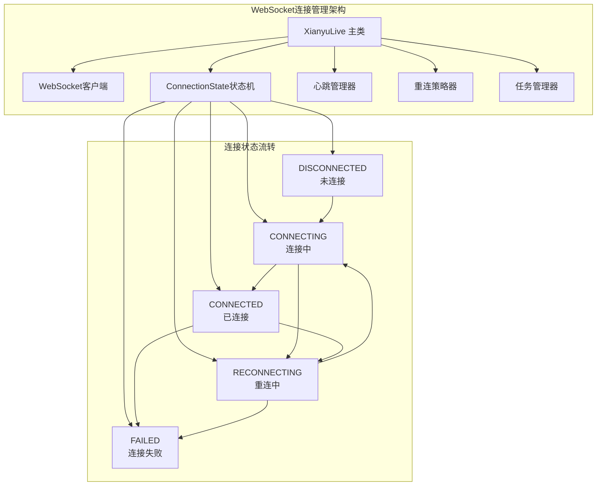
```mermaid
graph TB
subgraph "WebSocket连接管理架构"
XianyuLive[XianyuLive 主类]
WSClient[WebSocket客户端]
StateMachine[ConnectionState状态机]
Heartbeat[心跳管理器]
Reconnect[重连策略器]
TaskManager[任务管理器]
end
subgraph "连接状态流转"
DISCONNECTED[DISCONNECTED<br/>未连接]
CONNECTING[CONNECTING<br/>连接中]
CONNECTED[CONNECTED<br/>已连接]
RECONNECTING[RECONNECTING<br/>重连中]
FAILED[FAILED<br/>连接失败]
end
XianyuLive --> WSClient
XianyuLive --> StateMachine
XianyuLive --> Heartbeat
XianyuLive --> Reconnect
XianyuLive --> TaskManager
StateMachine --> DISCONNECTED
StateMachine --> CONNECTING
StateMachine --> CONNECTED
StateMachine --> RECONNECTING
StateMachine --> FAILED
DISCONNECTED --> CONNECTING
CONNECTING --> CONNECTED
CONNECTING --> RECONNECTING
CONNECTED --> RECONNECTING
CONNECTED --> FAILED
RECONNECTING --> CONNECTING
RECONNECTING --> FAILED
```

**图表来源**
- [XianyuAutoAsync.py](file://XianyuAutoAsync.py#L29-L36)
- [XianyuAutoAsync.py](file://XianyuAutoAsync.py#L195-L215)

**章节来源**
- [XianyuAutoAsync.py](file://XianyuAutoAsync.py#L157-L8365)

## 核心组件分析

### XianyuLive类设计

XianyuLive类是整个WebSocket连接管理的核心，采用面向对象的设计模式，封装了完整的连接生命周期管理功能。

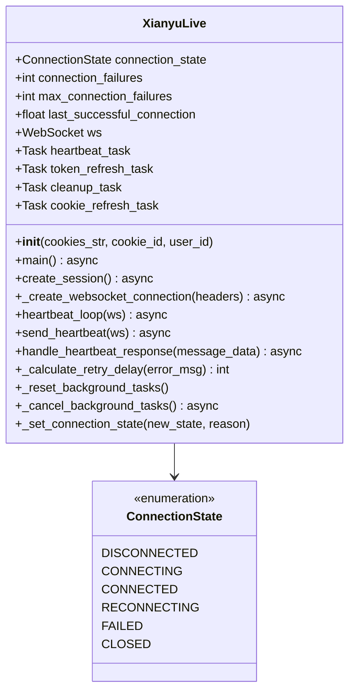
```mermaid
classDiagram
class XianyuLive {
+ConnectionState connection_state
+int connection_failures
+int max_connection_failures
+float last_successful_connection
+WebSocket ws
+Task heartbeat_task
+Task token_refresh_task
+Task cleanup_task
+Task cookie_refresh_task
+__init__(cookies_str, cookie_id, user_id)
+main() async
+create_session() async
+_create_websocket_connection(headers) async
+heartbeat_loop(ws) async
+send_heartbeat(ws) async
+handle_heartbeat_response(message_data) async
+_calculate_retry_delay(error_msg) int
+_reset_background_tasks()
+_cancel_background_tasks() async
+_set_connection_state(new_state, reason)
}
class ConnectionState {
<<enumeration>>
DISCONNECTED
CONNECTING
CONNECTED
RECONNECTING
FAILED
CLOSED
}
XianyuLive --> ConnectionState
```

**图表来源**
- [XianyuAutoAsync.py](file://XianyuAutoAsync.py#L29-L36)
- [XianyuAutoAsync.py](file://XianyuAutoAsync.py#L157-L8365)

### 关键配置参数

系统通过配置文件定义了重要的WebSocket行为参数：

| 参数名称 | 默认值 | 描述 | 用途 |
|---------|--------|------|------|
| HEARTBEAT_INTERVAL | 15秒 | 心跳发送间隔 | 保持连接活跃状态 |
| HEARTBEAT_TIMEOUT | 30秒 | 心跳超时时间 | 检测连接是否正常 |
| TOKEN_REFRESH_INTERVAL | 72000秒 | Token刷新间隔 | 维护认证有效性 |
| TOKEN_RETRY_INTERVAL | 7200秒 | Token重试间隔 | Token刷新失败时的重试 |
| MESSAGE_EXPIRE_TIME | 300000毫秒 | 消息过期时间 | 防止重复处理消息 |

**章节来源**
- [config.py](file://config.py#L95-L100)
- [XianyuAutoAsync.py](file://XianyuAutoAsync.py#L652-L666)

## ConnectionState状态机

### 状态定义与转换

ConnectionState枚举定义了WebSocket连接的五个核心状态，每个状态都有明确的转换条件和处理逻辑。

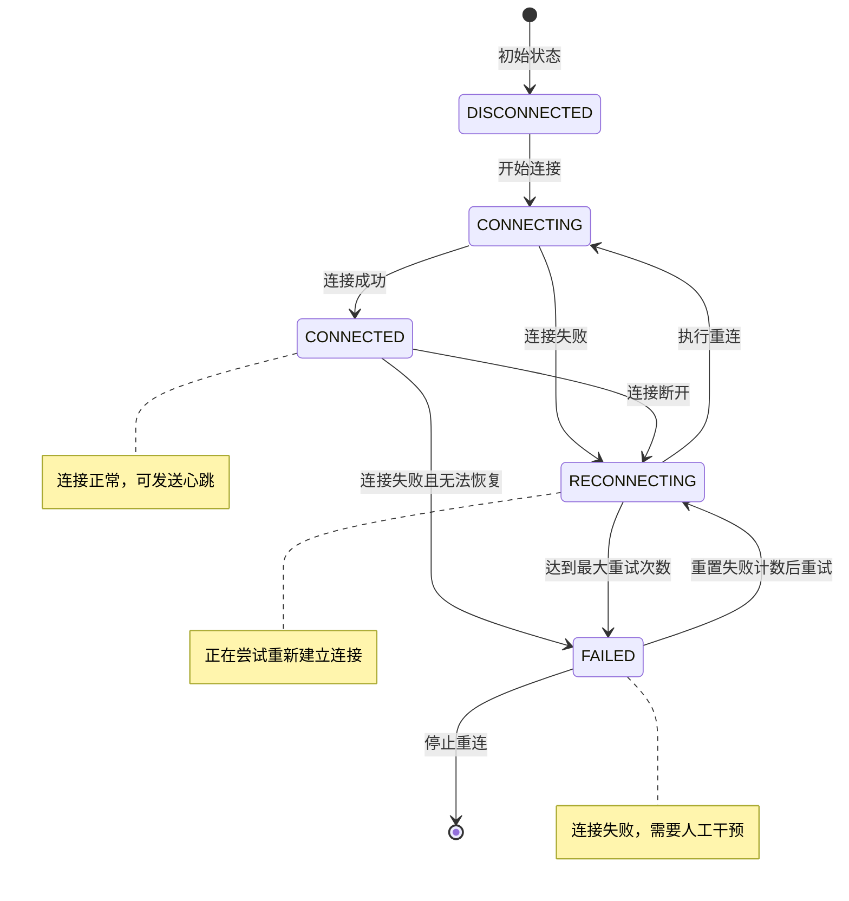
```mermaid
stateDiagram-v2
[*] --> DISCONNECTED : 初始状态
DISCONNECTED --> CONNECTING : 开始连接
CONNECTING --> CONNECTED : 连接成功
CONNECTING --> RECONNECTING : 连接失败
CONNECTED --> RECONNECTING : 连接断开
CONNECTED --> FAILED : 连接失败且无法恢复
RECONNECTING --> CONNECTING : 执行重连
RECONNECTING --> FAILED : 达到最大重试次数
FAILED --> RECONNECTING : 重置失败计数后重试
FAILED --> [*] : 停止重连
note right of CONNECTED : 连接正常，可发送心跳
note right of RECONNECTING : 正在尝试重新建立连接
note right of FAILED : 连接失败，需要人工干预
```

**图表来源**
- [XianyuAutoAsync.py](file://XianyuAutoAsync.py#L29-L36)

### 状态转换逻辑

状态转换通过`_set_connection_state`方法实现，该方法不仅更新状态，还记录详细的日志信息：

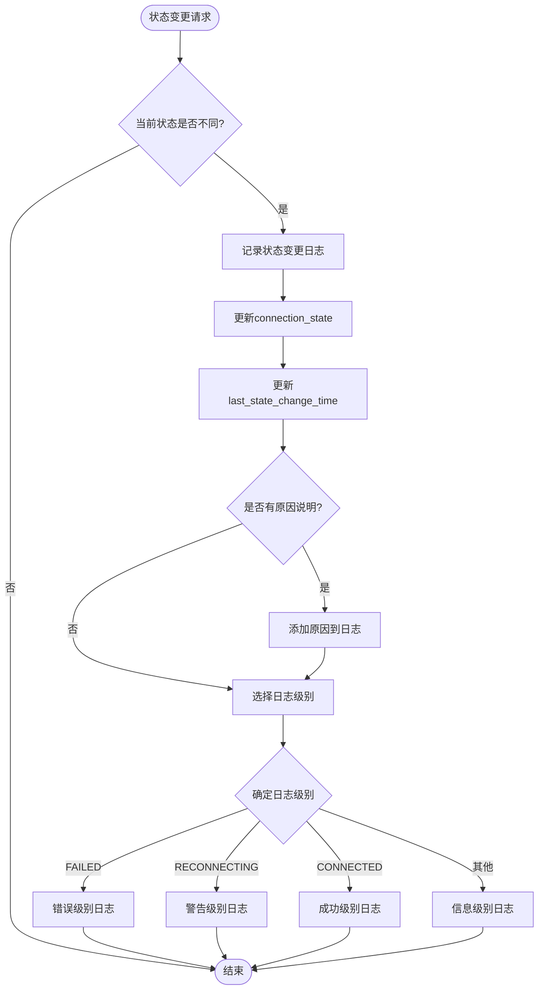
```mermaid
flowchart TD
Start([状态变更请求]) --> CheckCurrent{当前状态是否不同?}
CheckCurrent --> |否| End([结束])
CheckCurrent --> |是| LogChange[记录状态变更日志]
LogChange --> UpdateState[更新connection_state]
UpdateState --> UpdateTime[更新last_state_change_time]
UpdateTime --> CheckReason{是否有原因说明?}
CheckReason --> |是| AddReason[添加原因到日志]
CheckReason --> |否| SelectLevel[选择日志级别]
AddReason --> SelectLevel
SelectLevel --> LogLevel{确定日志级别}
LogLevel --> |FAILED| ErrorLog[错误级别日志]
LogLevel --> |RECONNECTING| WarningLog[警告级别日志]
LogLevel --> |CONNECTED| SuccessLog[成功级别日志]
LogLevel --> |其他| InfoLog[信息级别日志]
ErrorLog --> End
WarningLog --> End
SuccessLog --> End
InfoLog --> End
```

**图表来源**
- [XianyuAutoAsync.py](file://XianyuAutoAsync.py#L195-L215)

**章节来源**
- [XianyuAutoAsync.py](file://XianyuAutoAsync.py#L195-L215)

## 连接初始化流程

### Cookie解析与参数提取

连接初始化的第一步是从Cookie中提取必要的认证参数：

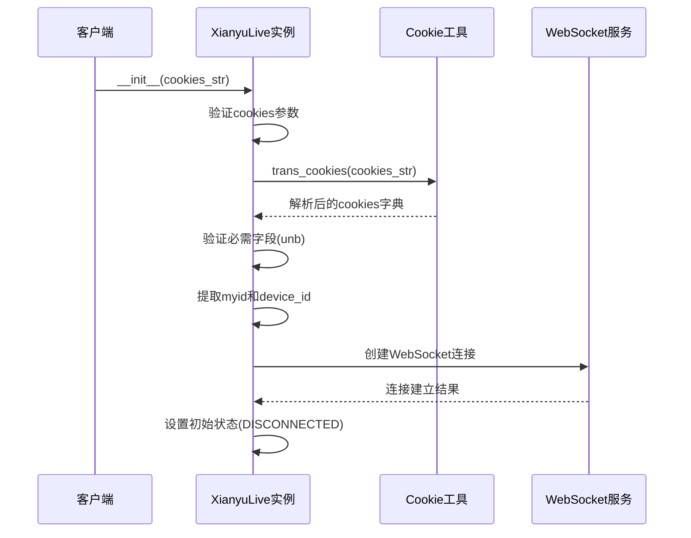
```mermaid
sequenceDiagram
participant Client as 客户端
participant XianyuLive as XianyuLive实例
participant Utils as Cookie工具
participant WS as WebSocket服务
Client->>XianyuLive : __init__(cookies_str)
XianyuLive->>XianyuLive : 验证cookies参数
XianyuLive->>Utils : trans_cookies(cookies_str)
Utils-->>XianyuLive : 解析后的cookies字典
XianyuLive->>XianyuLive : 验证必需字段(unb)
XianyuLive->>XianyuLive : 提取myid和device_id
XianyuLive->>WS : 创建WebSocket连接
WS-->>XianyuLive : 连接建立结果
XianyuLive->>XianyuLive : 设置初始状态(DISCONNECTED)
```

**图表来源**
- [XianyuAutoAsync.py](file://XianyuAutoAsync.py#L628-L651)

### WebSocket连接建立

系统实现了兼容性良好的WebSocket连接建立机制，支持不同版本的websockets库：

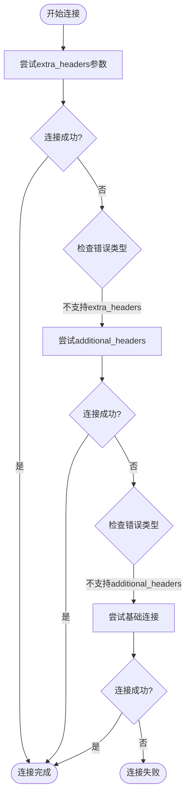
```mermaid
flowchart TD
Start([开始连接]) --> TryExtraHeaders[尝试extra_headers参数]
TryExtraHeaders --> Success1{连接成功?}
Success1 --> |是| Complete([连接完成])
Success1 --> |否| CheckExtraError{检查错误类型}
CheckExtraError --> |不支持extra_headers| TryAdditionalHeaders[尝试additional_headers]
TryAdditionalHeaders --> Success2{连接成功?}
Success2 --> |是| Complete
Success2 --> |否| CheckAddError{检查错误类型}
CheckAddError --> |不支持additional_headers| TryBasicConnect[尝试基础连接]
TryBasicConnect --> Success3{连接成功?}
Success3 --> |是| Complete
Success3 --> |否| Fail([连接失败])
```

**图表来源**
- [XianyuAutoAsync.py](file://XianyuAutoAsync.py#L6714-L6752)

### 初始化序列

连接建立后，系统执行一系列初始化步骤：

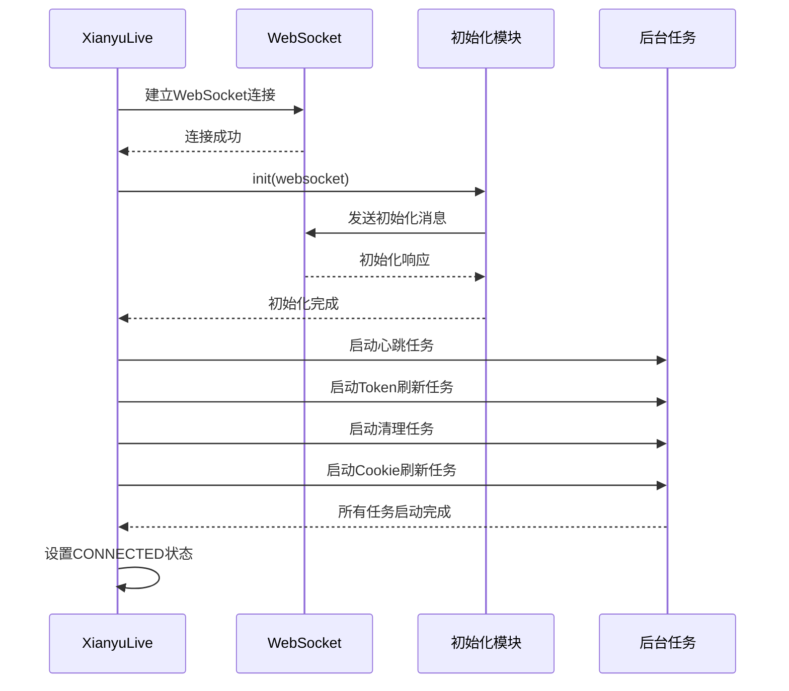
```mermaid
sequenceDiagram
participant XianyuLive as XianyuLive
participant WS as WebSocket
participant Init as 初始化模块
participant Tasks as 后台任务
XianyuLive->>WS : 建立WebSocket连接
WS-->>XianyuLive : 连接成功
XianyuLive->>Init : init(websocket)
Init->>WS : 发送初始化消息
WS-->>Init : 初始化响应
Init-->>XianyuLive : 初始化完成
XianyuLive->>Tasks : 启动心跳任务
XianyuLive->>Tasks : 启动Token刷新任务
XianyuLive->>Tasks : 启动清理任务
XianyuLive->>Tasks : 启动Cookie刷新任务
Tasks-->>XianyuLive : 所有任务启动完成
XianyuLive->>XianyuLive : 设置CONNECTED状态
```

**图表来源**
- [XianyuAutoAsync.py](file://XianyuAutoAsync.py#L7645-L7700)

**章节来源**
- [XianyuAutoAsync.py](file://XianyuAutoAsync.py#L628-L651)
- [XianyuAutoAsync.py](file://XianyuAutoAsync.py#L6714-L6752)
- [XianyuAutoAsync.py](file://XianyuAutoAsync.py#L7645-L7700)

## 心跳机制实现

### 心跳配置参数

心跳机制通过两个关键参数控制：

| 参数 | 默认值 | 作用 | 调整建议 |
|------|--------|------|----------|
| HEARTBEAT_INTERVAL | 15秒 | 心跳发送间隔 | 根据网络稳定性调整 |
| HEARTBEAT_TIMEOUT | 30秒 | 心跳超时时间 | 通常设为间隔的2倍 |
| 心跳成功率阈值 | 3次失败停止 | 连续失败阈值 | 根据可靠性要求调整 |

### 心跳发送流程

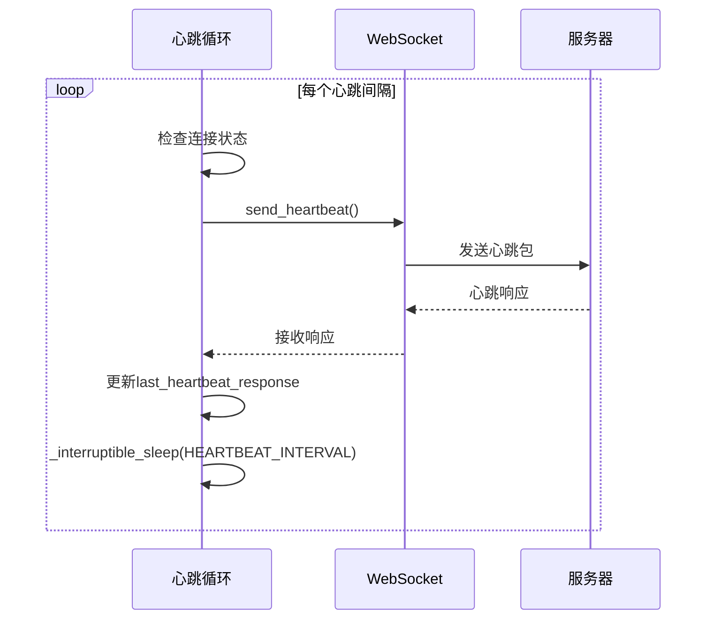
```mermaid
sequenceDiagram
participant HeartbeatLoop as 心跳循环
participant WS as WebSocket
participant Server as 服务器
loop 每个心跳间隔
HeartbeatLoop->>HeartbeatLoop : 检查连接状态
HeartbeatLoop->>WS : send_heartbeat()
WS->>Server : 发送心跳包
Server-->>WS : 心跳响应
WS-->>HeartbeatLoop : 接收响应
HeartbeatLoop->>HeartbeatLoop : 更新last_heartbeat_response
HeartbeatLoop->>HeartbeatLoop : _interruptible_sleep(HEARTBEAT_INTERVAL)
end
```

**图表来源**
- [XianyuAutoAsync.py](file://XianyuAutoAsync.py#L5221-L5271)

### 心跳包结构

心跳包采用简洁的数据结构，包含必要的头部信息：

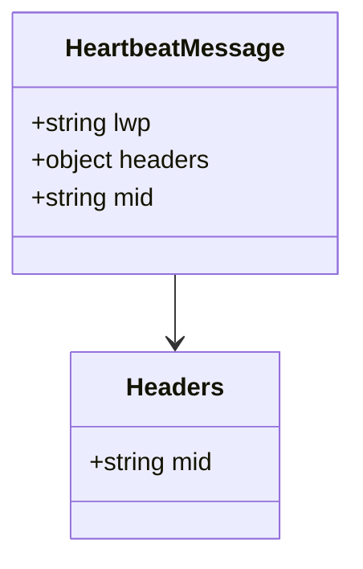
```mermaid
classDiagram
class HeartbeatMessage {
+string lwp
+object headers
+string mid
}
class Headers {
+string mid
}
HeartbeatMessage --> Headers
```

**图表来源**
- [XianyuAutoAsync.py](file://XianyuAutoAsync.py#L5204-L5208)

### 心跳异常处理

心跳循环具备完善的异常处理机制：

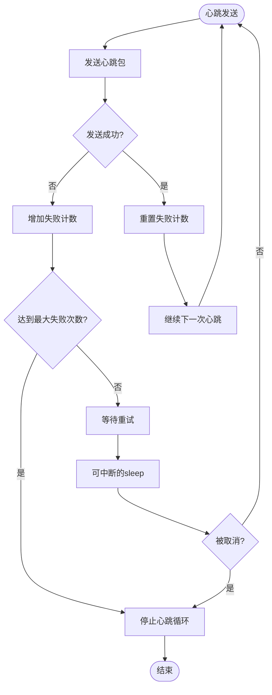
```mermaid
flowchart TD
Start([心跳发送]) --> SendHeartbeat[发送心跳包]
SendHeartbeat --> CheckSuccess{发送成功?}
CheckSuccess --> |是| ResetFailures[重置失败计数]
CheckSuccess --> |否| IncrementFailures[增加失败计数]
IncrementFailures --> CheckMaxFailures{达到最大失败次数?}
CheckMaxFailures --> |是| StopHeartbeat[停止心跳循环]
CheckMaxFailures --> |否| WaitRetry[等待重试]
WaitRetry --> Sleep[可中断的sleep]
Sleep --> CheckCancelled{被取消?}
CheckCancelled --> |是| StopHeartbeat
CheckCancelled --> |否| Start
ResetFailures --> Continue[继续下一次心跳]
StopHeartbeat --> End([结束])
Continue --> Start
```

**图表来源**
- [XianyuAutoAsync.py](file://XianyuAutoAsync.py#L5221-L5271)

**章节来源**
- [XianyuAutoAsync.py](file://XianyuAutoAsync.py#L5198-L5281)
- [config.py](file://config.py#L95-L96)

## 自动重连策略

### 重连算法设计

系统实现了基于错误类型和失败次数的智能重连算法：

```mermaid
flowchart TD
Failure([连接失败]) --> GetErrorType[分析错误类型]
GetErrorType --> CheckCloseFrame{检查关闭帧错误?}
CheckCloseFrame --> |是| ShortDelay[短延迟: 3*失败次数(≤15秒)]
CheckCloseFrame --> |否| CheckNetwork{检查网络错误?}
CheckNetwork --> |是| LongDelay[长延迟: 10*失败次数(≤60秒)]
CheckNetwork --> |否| MediumDelay[中等延迟: 5*失败次数(≤30秒)]
ShortDelay --> CalculateDelay[计算最终延迟]
LongDelay --> CalculateDelay
MediumDelay --> CalculateDelay
CalculateDelay --> ApplyBackoff[应用退避算法]
ApplyBackoff --> WaitDelay[等待延迟时间]
WaitDelay --> RetryConnection[重试连接]
```

**图表来源**
- [XianyuAutoAsync.py](file://XianyuAutoAsync.py#L453-L465)

### 重连策略表

| 错误类型 | 延迟计算公式 | 最大延迟 | 适用场景 |
|----------|-------------|----------|----------|
| WebSocket意外断开 | 3 × 失败次数 | 15秒 | 网络波动、服务器主动断开 |
| 网络连接问题 | 10 × 失败次数 | 60秒 | 网络不可达、防火墙阻止 |
| 其他未知错误 | 5 × 失败次数 | 30秒 | 认证失败、协议错误 |

### 重连状态管理

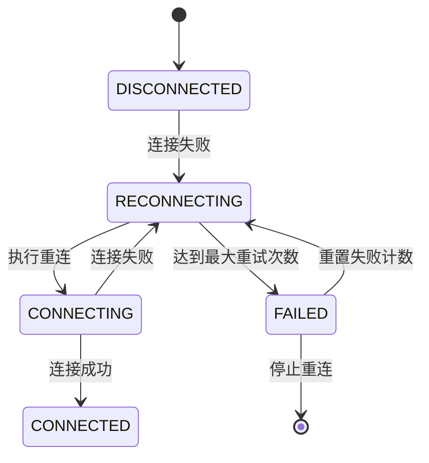
```mermaid
stateDiagram-v2
[*] --> DISCONNECTED
DISCONNECTED --> RECONNECTING : 连接失败
RECONNECTING --> CONNECTING : 执行重连
CONNECTING --> CONNECTED : 连接成功
CONNECTING --> RECONNECTING : 连接失败
RECONNECTING --> FAILED : 达到最大重试次数
FAILED --> RECONNECTING : 重置失败计数
FAILED --> [*] : 停止重连
```

**图表来源**
- [XianyuAutoAsync.py](file://XianyuAutoAsync.py#L453-L465)

### 重连限制机制

系统设置了多重保护机制防止无限重连：

```mermaid
flowchart TD
Start([开始重连]) --> CheckFailures{检查失败次数}
CheckFailures --> |< max_connection_failures| CalculateDelay[计算重连延迟]
CheckFailures --> |>= max_connection_failures| CheckPasswordRefresh{尝试密码刷新}
CalculateDelay --> WaitDelay[等待延迟]
WaitDelay --> AttemptReconnect[尝试重连]
AttemptReconnect --> Success{连接成功?}
Success --> |是| ResetFailures[重置失败计数]
Success --> |否| IncrementFailures[增加失败计数]
IncrementFailures --> CheckFailures
ResetFailures --> UpdateState[更新连接状态]
UpdateState --> Start
CheckPasswordRefresh --> RefreshSuccess{刷新成功?}
RefreshSuccess --> |是| ResetFailures
RefreshSuccess --> |否| RestartInstance[重启实例]
RestartInstance --> [*]
```

**图表来源**
- [XianyuAutoAsync.py](file://XianyuAutoAsync.py#L7777-L7821)

**章节来源**
- [XianyuAutoAsync.py](file://XianyuAutoAsync.py#L453-L465)
- [XianyuAutoAsync.py](file://XianyuAutoAsync.py#L7777-L7821)

## WebSocket连接生命周期

### 生命周期阶段

WebSocket连接经历完整的生命周期管理：

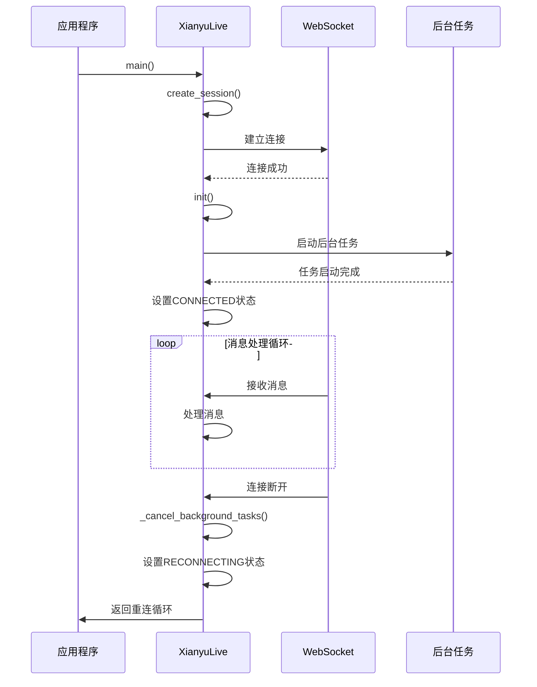
```mermaid
sequenceDiagram
participant App as 应用程序
participant XianyuLive as XianyuLive
participant WS as WebSocket
participant Tasks as 后台任务
App->>XianyuLive : main()
XianyuLive->>XianyuLive : create_session()
XianyuLive->>WS : 建立连接
WS-->>XianyuLive : 连接成功
XianyuLive->>XianyuLive : init()
XianyuLive->>Tasks : 启动后台任务
Tasks-->>XianyuLive : 任务启动完成
XianyuLive->>XianyuLive : 设置CONNECTED状态
loop 消息处理循环
WS->>XianyuLive : 接收消息
XianyuLive->>XianyuLive : 处理消息
end
WS->>XianyuLive : 连接断开
XianyuLive->>XianyuLive : _cancel_background_tasks()
XianyuLive->>XianyuLive : 设置RECONNECTING状态
XianyuLive->>App : 返回重连循环
```

**图表来源**
- [XianyuAutoAsync.py](file://XianyuAutoAsync.py#L7623-L7821)

### 资源管理策略

系统实现了精细的资源管理机制：

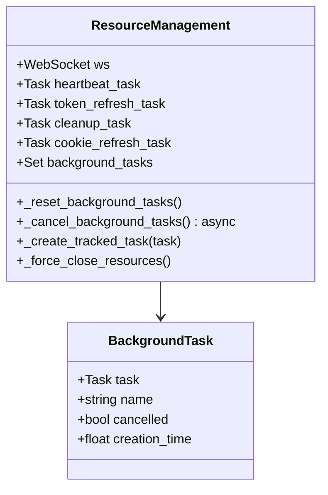
```mermaid
classDiagram
class ResourceManagement {
+WebSocket ws
+Task heartbeat_task
+Task token_refresh_task
+Task cleanup_task
+Task cookie_refresh_task
+Set background_tasks
+_reset_background_tasks()
+_cancel_background_tasks() async
+_create_tracked_task(task)
+_force_close_resources()
}
class BackgroundTask {
+Task task
+string name
+bool cancelled
+float creation_time
}
ResourceManagement --> BackgroundTask
```

**图表来源**
- [XianyuAutoAsync.py](file://XianyuAutoAsync.py#L235-L451)

### 优雅重启机制

当需要重启连接时，系统采用优雅的重启策略：

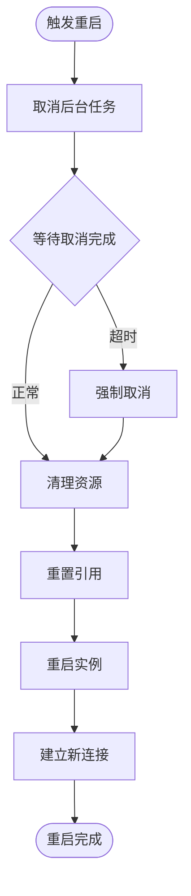
```mermaid
flowchart TD
Restart([触发重启]) --> CancelTasks[取消后台任务]
CancelTasks --> WaitCancel{等待取消完成}
WaitCancel --> |超时| ForceCancel[强制取消]
WaitCancel --> |正常| CleanupResources[清理资源]
ForceCancel --> CleanupResources
CleanupResources --> ResetRefs[重置引用]
ResetRefs --> RestartInstance[重启实例]
RestartInstance --> NewConnection[建立新连接]
NewConnection --> Complete([重启完成])
```

**图表来源**
- [XianyuAutoAsync.py](file://XianyuAutoAsync.py#L235-L451)

**章节来源**
- [XianyuAutoAsync.py](file://XianyuAutoAsync.py#L7623-L7821)
- [XianyuAutoAsync.py](file://XianyuAutoAsync.py#L235-L451)

## 异常处理与恢复

### 异常分类处理

系统对不同类型的异常采用差异化的处理策略：

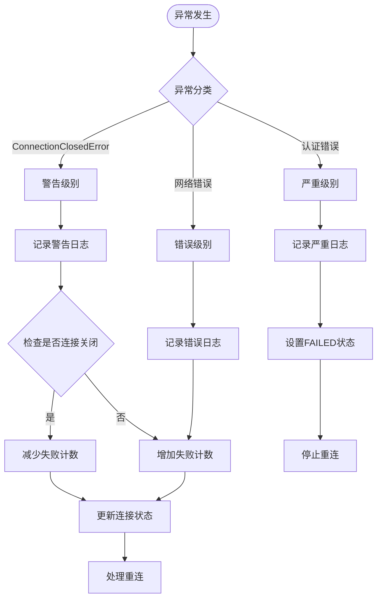
```mermaid
flowchart TD
Exception([异常发生]) --> ClassifyException{异常分类}
ClassifyException --> |ConnectionClosedError| WarningLevel[警告级别]
ClassifyException --> |网络错误| ErrorLevel[错误级别]
ClassifyException --> |认证错误| CriticalLevel[严重级别]
WarningLevel --> LogWarning[记录警告日志]
ErrorLevel --> LogError[记录错误日志]
CriticalLevel --> LogCritical[记录严重日志]
LogWarning --> CheckClosed{检查是否连接关闭}
LogError --> IncrementFailures[增加失败计数]
LogCritical --> SetFailedState[设置FAILED状态]
CheckClosed --> |是| DecreaseFailures[减少失败计数]
CheckClosed --> |否| IncrementFailures
DecreaseFailures --> UpdateState[更新连接状态]
IncrementFailures --> UpdateState
SetFailedState --> StopReconnect[停止重连]
UpdateState --> HandleReconnect[处理重连]
```

**图表来源**
- [XianyuAutoAsync.py](file://XianyuAutoAsync.py#L7729-L7775)

### 异常恢复流程

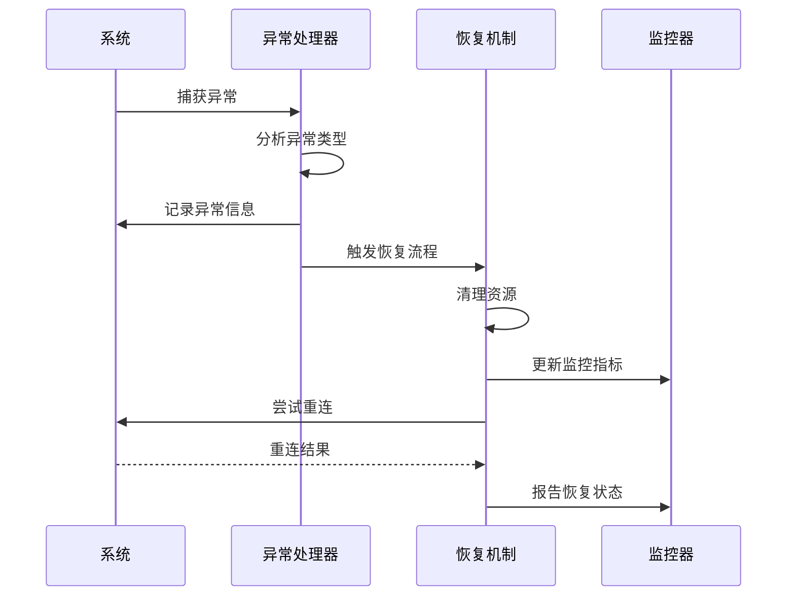
```mermaid
sequenceDiagram
participant System as 系统
participant ErrorHandler as 异常处理器
participant Recovery as 恢复机制
participant Monitor as 监控器
System->>ErrorHandler : 捕获异常
ErrorHandler->>ErrorHandler : 分析异常类型
ErrorHandler->>System : 记录异常信息
ErrorHandler->>Recovery : 触发恢复流程
Recovery->>Recovery : 清理资源
Recovery->>Monitor : 更新监控指标
Recovery->>System : 尝试重连
System-->>Recovery : 重连结果
Recovery->>Monitor : 报告恢复状态
```

**图表来源**
- [XianyuAutoAsync.py](file://XianyuAutoAsync.py#L7729-L7775)

### 资源清理策略

系统实现了多层次的资源清理机制：

| 清理层级 | 清理频率 | 清理内容 | 触发条件 |
|----------|----------|----------|----------|
| 实例级缓存 | 按需 | 通知记录、发货记录、订单确认 | 内存压力 |
| 临时文件 | 定期 | Playwright缓存、日志文件 | 时间阈值 |
| WebSocket引用 | 异常时 | 断开的连接、无效的引用 | 连接异常 |
| 后台任务 | 重启时 | 取消未完成的任务 | 实例重启 |

**章节来源**
- [XianyuAutoAsync.py](file://XianyuAutoAsync.py#L7729-L7775)
- [XianyuAutoAsync.py](file://XianyuAutoAsync.py#L467-L515)

## 性能优化考虑

### 并发控制机制

系统通过信号量控制消息处理的并发度，防止内存泄漏：

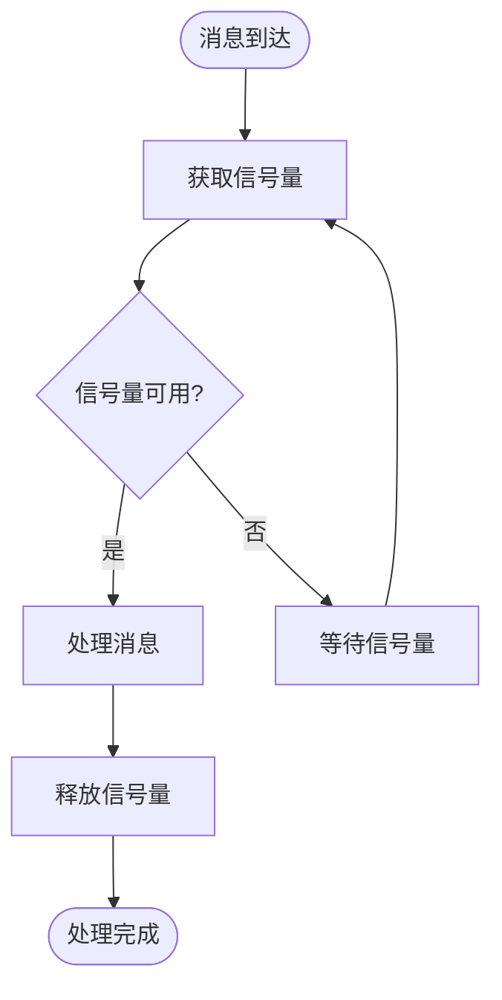
```mermaid
flowchart TD
MessageReceived([消息到达]) --> AcquireSemaphore[获取信号量]
AcquireSemaphore --> SemaphoreAcquired{信号量可用?}
SemaphoreAcquired --> |是| ProcessMessage[处理消息]
SemaphoreAcquired --> |否| WaitSemaphore[等待信号量]
WaitSemaphore --> AcquireSemaphore
ProcessMessage --> ReleaseSemaphore[释放信号量]
ReleaseSemaphore --> Complete([处理完成])
```

**图表来源**
- [XianyuAutoAsync.py](file://XianyuAutoAsync.py#L6866-L6877)

### 可中断睡眠机制

系统实现了可中断的睡眠机制，提高响应速度：

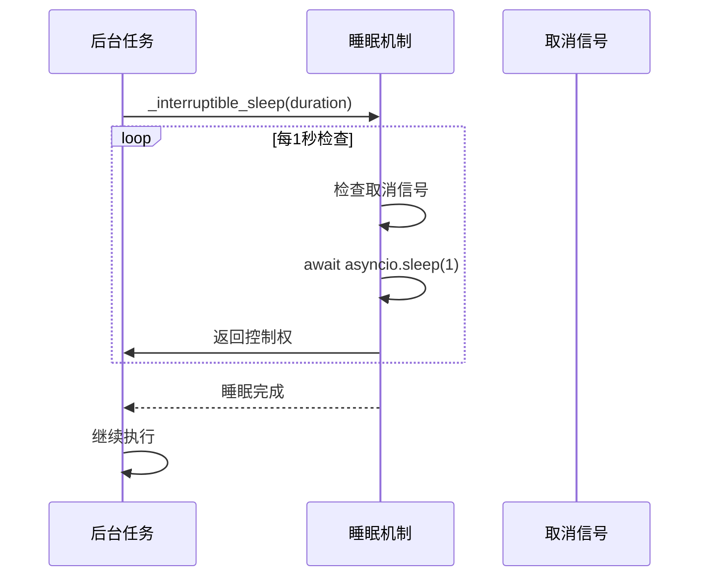
```mermaid
sequenceDiagram
participant Task as 后台任务
participant Sleep as 睡眠机制
participant Cancel as 取消信号
Task->>Sleep : _interruptible_sleep(duration)
loop 每1秒检查
Sleep->>Sleep : 检查取消信号
Sleep->>Sleep : await asyncio.sleep(1)
Sleep->>Task : 返回控制权
end
Sleep-->>Task : 睡眠完成
Task->>Task : 继续执行
```

**图表来源**
- [XianyuAutoAsync.py](file://XianyuAutoAsync.py#L216-L234)

### 缓存管理策略

系统实现了智能的缓存管理机制：

```mermaid
flowchart TD
CacheAccess([访问缓存]) --> CheckSize{检查缓存大小}
CheckSize --> |超出限制| EvictOld[淘汰旧数据]
CheckSize --> |正常| CheckAge{检查数据年龄}
CheckAge --> |过期| RemoveExpired[移除过期数据]
CheckAge --> |未过期| AccessData[访问数据]
EvictOld --> CheckAge
RemoveExpired --> AccessData
AccessData --> UpdateAccessTime[更新访问时间]
UpdateAccessTime --> Complete([访问完成])
```

**图表来源**
- [XianyuAutoAsync.py](file://XianyuAutoAsync.py#L467-L515)

**章节来源**
- [XianyuAutoAsync.py](file://XianyuAutoAsync.py#L216-L234)
- [XianyuAutoAsync.py](file://XianyuAutoAsync.py#L6866-L6877)
- [XianyuAutoAsync.py](file://XianyuAutoAsync.py#L467-L515)

## 故障排除指南

### 常见问题诊断

| 问题症状 | 可能原因 | 诊断方法 | 解决方案 |
|----------|----------|----------|----------|
| 连接频繁断开 | 网络不稳定 | 检查网络连接日志 | 调整重连参数 |
| 心跳超时 | 服务器负载过高 | 监控心跳响应时间 | 增加超时时间 |
| Token刷新失败 | Cookie过期 | 检查Cookie有效期 | 手动刷新Cookie |
| 内存泄漏 | 缓存未清理 | 监控缓存大小 | 调整清理策略 |

### 调试工具和技巧

系统提供了丰富的调试信息：

```mermaid
flowchart TD
Debug([调试开始]) --> EnableLogging[启用详细日志]
EnableLogging --> MonitorStates[监控状态变化]
MonitorStates --> TrackMessages[跟踪消息流]
TrackMessages --> AnalyzePerformance[分析性能指标]
AnalyzePerformance --> GenerateReport[生成诊断报告]
GenerateReport --> ResolveIssues[解决发现的问题]
```

### 监控指标

关键监控指标包括：

- **连接状态**：当前连接状态和转换频率
- **心跳成功率**：心跳发送和响应的成功率
- **重连频率**：重连尝试次数和间隔时间
- **资源使用**：内存使用和任务数量
- **错误统计**：各类错误的发生频率和类型

**章节来源**
- [XianyuAutoAsync.py](file://XianyuAutoAsync.py#L195-L215)

## 总结

XianyuLive类的WebSocket连接管理系统展现了现代异步通信应用的最佳实践。通过精心设计的状态机、智能的重连策略、完善的心跳机制和健壮的异常处理，该系统实现了高可用的WebSocket通信。

### 核心优势

1. **状态驱动的连接管理**：清晰的状态机设计使得连接行为易于理解和维护
2. **智能重连策略**：基于错误类型的差异化重连算法提高了系统的鲁棒性
3. **资源高效管理**：完善的资源清理和并发控制机制防止了内存泄漏
4. **可观测性**：丰富的日志和监控信息便于问题诊断和性能优化

### 设计原则

- **优雅降级**：即使在部分功能失效的情况下，系统仍能保持基本通信能力
- **快速恢复**：智能的重连机制确保系统能在最短时间内恢复正常服务
- **资源友好**：最小化资源占用，支持长时间稳定运行
- **易于扩展**：模块化设计便于添加新的功能和特性

该WebSocket连接管理系统为构建可靠的实时通信应用提供了完整的解决方案，值得在类似项目中借鉴和应用。