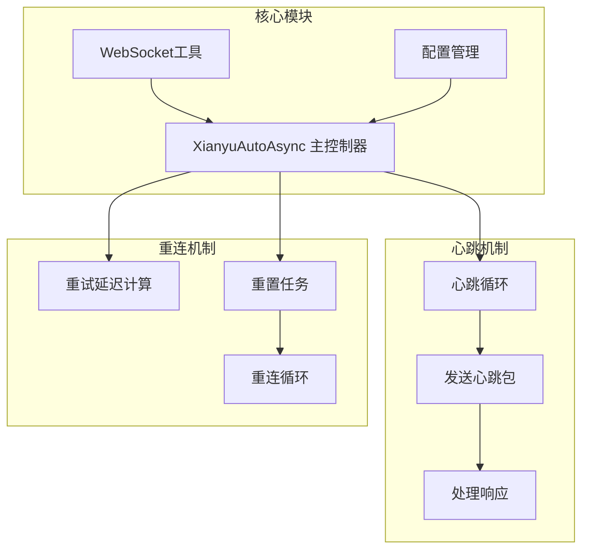
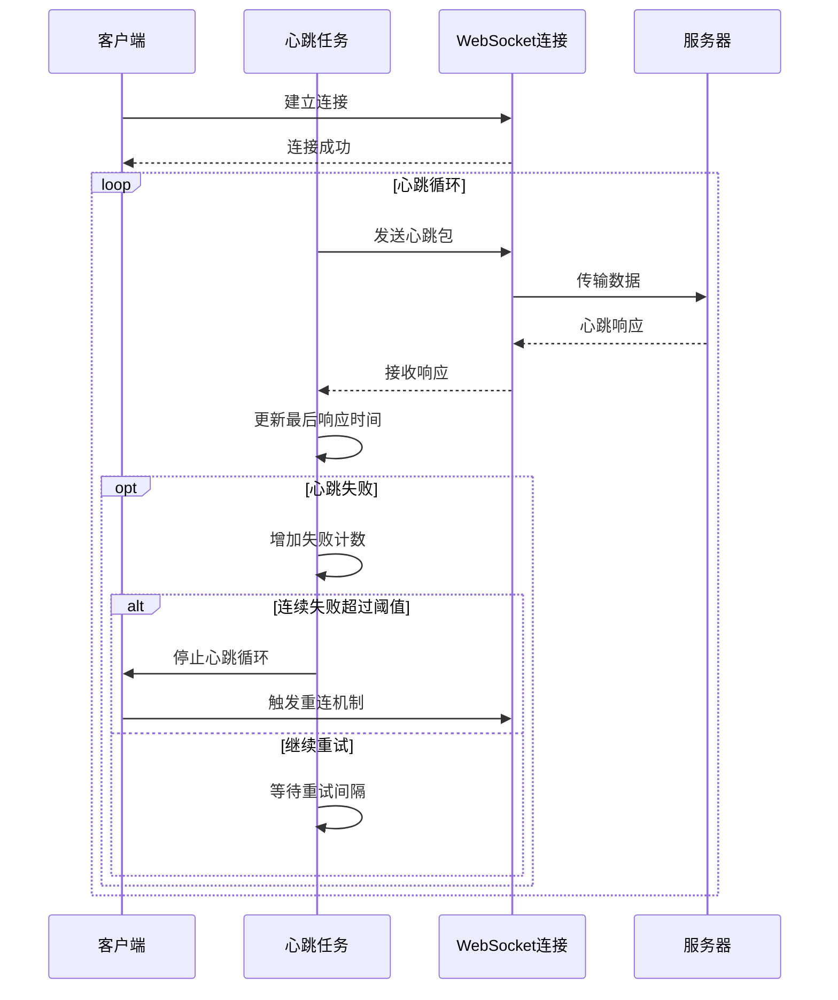
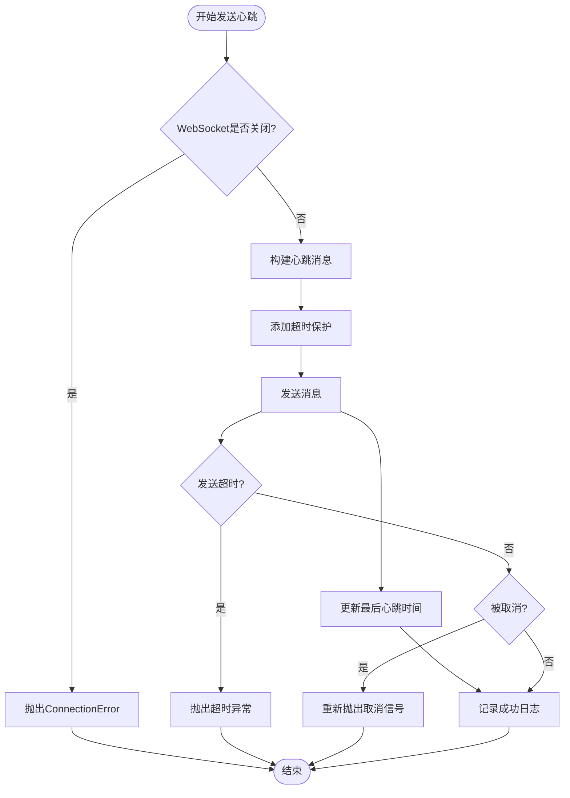
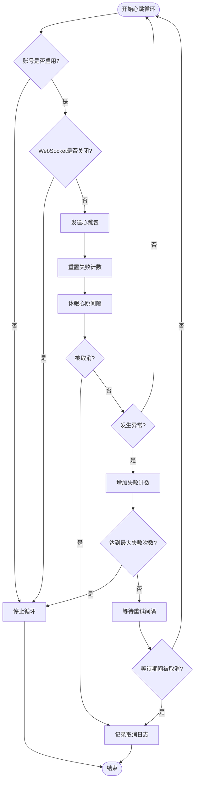
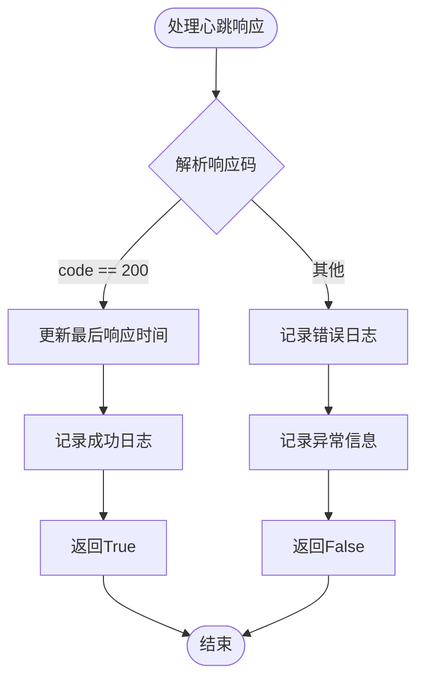
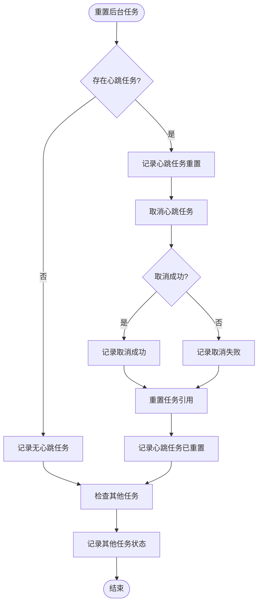
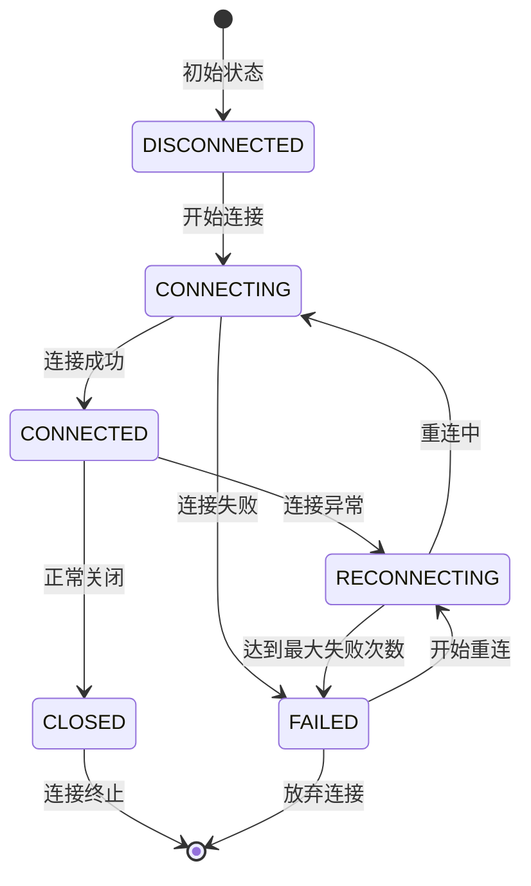
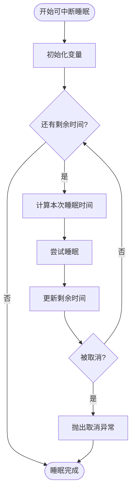
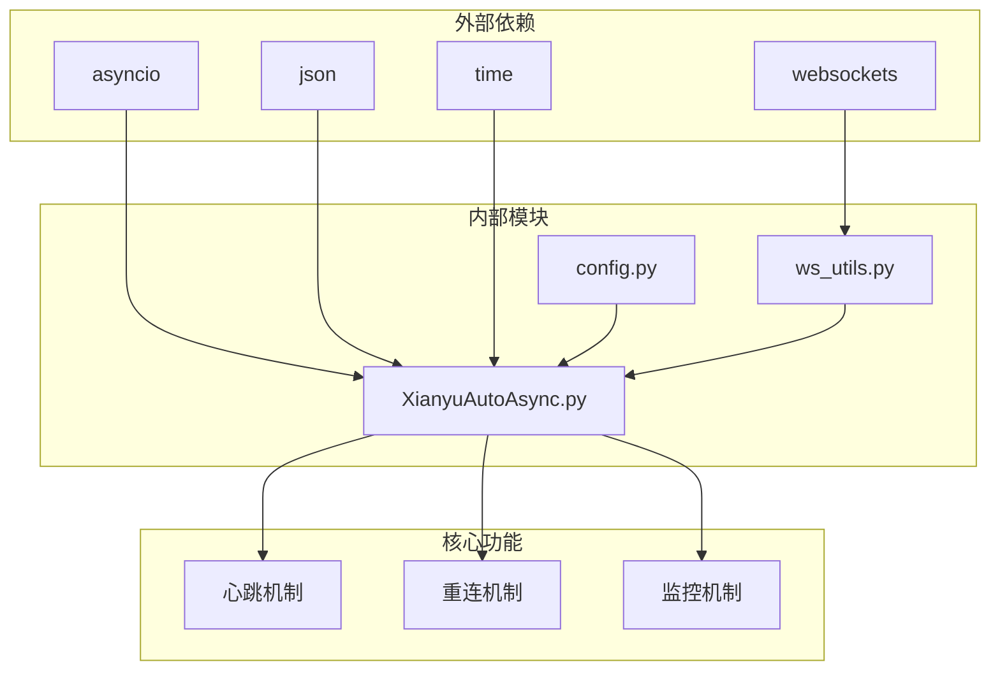

# 心跳与重连机制

<cite>
**本文档中引用的文件**
- [XianyuAutoAsync.py](file://XianyuAutoAsync.py)
- [config.py](file://config.py)
- [ws_utils.py](file://utils/ws_utils.py)
</cite>

## 目录
1. [简介](#简介)
2. [项目结构概览](#项目结构概览)
3. [核心组件分析](#核心组件分析)
4. [架构概览](#架构概览)
5. [详细组件分析](#详细组件分析)
6. [依赖关系分析](#依赖关系分析)
7. [性能考虑](#性能考虑)
8. [故障排除指南](#故障排除指南)
9. [结论](#结论)

## 简介

本文档详细阐述了XianyuAutoAsync项目中的心跳与自动重连机制。该系统通过精心设计的心跳任务调度、异常处理和重连策略，确保WebSocket连接的稳定性和可靠性。系统采用多层次的监控和恢复机制，能够自动检测连接异常并执行优雅的重连流程。

## 项目结构概览

该项目采用模块化架构，主要包含以下关键组件：
- **主控制器**：XianyuAutoAsync类负责整体业务逻辑和连接管理
- **WebSocket工具**：ws_utils模块提供基础的WebSocket连接功能
- **配置管理**：config模块定义心跳和重连相关参数
- **连接状态管理**：枚举类型ConnectionState跟踪连接状态



**图表来源**
- [XianyuAutoAsync.py](file://XianyuAutoAsync.py#L158-L8372)
- [ws_utils.py](file://utils/ws_utils.py#L1-L89)
- [config.py](file://config.py#L95-L96)

**章节来源**
- [XianyuAutoAsync.py](file://XianyuAutoAsync.py#L1-L200)
- [config.py](file://config.py#L1-L126)

## 核心组件分析

### 心跳参数配置

系统通过配置文件定义了两个关键的心跳参数：

| 参数名称 | 默认值 | 描述 | 影响范围 |
|---------|--------|------|----------|
| HEARTBEAT_INTERVAL | 15秒 | 心跳包发送间隔 | 控制心跳频率 |
| HEARTBEAT_TIMEOUT | 30秒 | 心跳超时判定时间 | 检测连接异常 |

### 连接失败限制

系统设置了最大连接失败次数限制：
- **max_connection_failures**: 5次（硬性限制）
- **心跳连续失败阈值**: 3次（软性限制）

### 错误类型分类

系统根据错误类型采用不同的重试策略：

| 错误类型 | 处理策略 | 重试延迟计算 |
|---------|----------|-------------|
| WebSocket意外断开 | 短延迟重试 | min(3 * 失败次数, 15秒) |
| 网络连接问题 | 长延迟重试 | min(10 * 失败次数, 60秒) |
| 其他未知错误 | 中等延迟重试 | min(5 * 失败次数, 30秒) |

**章节来源**
- [config.py](file://config.py#L95-L96)
- [XianyuAutoAsync.py](file://XianyuAutoAsync.py#L453-L465)
- [XianyuAutoAsync.py](file://XianyuAutoAsync.py#L717-L718)

## 架构概览

系统采用事件驱动的异步架构，通过协程实现非阻塞的心跳和重连机制：



**图表来源**
- [XianyuAutoAsync.py](file://XianyuAutoAsync.py#L5221-L5271)
- [XianyuAutoAsync.py](file://XianyuAutoAsync.py#L5198-L5219)

## 详细组件分析

### 心跳任务启动与调度

#### send_heartbeat方法

该方法负责发送心跳包并处理发送过程中的异常：



**图表来源**
- [XianyuAutoAsync.py](file://XianyuAutoAsync.py#L5198-L5219)

#### heartbeat_loop方法

心跳循环实现了完整的监控和异常处理逻辑：



**图表来源**
- [XianyuAutoAsync.py](file://XianyuAutoAsync.py#L5221-L5271)

**章节来源**
- [XianyuAutoAsync.py](file://XianyuAutoAsync.py#L5198-L5271)

### 心跳响应处理

#### handle_heartbeat_response方法

该方法专门处理来自服务器的心跳响应：



**图表来源**
- [XianyuAutoAsync.py](file://XianyuAutoAsync.py#L5272-L5281)

**章节来源**
- [XianyuAutoAsync.py](file://XianyuAutoAsync.py#L5272-L5281)

### 自动重连策略

#### _calculate_retry_delay方法

该方法根据错误类型和失败次数动态计算重试延迟：

```mermaid
flowchart TD
Start([计算重试延迟]) --> CheckWebSocket{WebSocket意外断开?}
CheckWebSocket --> |是| ShortDelay[短延迟: min(3*失败次数, 15)]
CheckWebSocket --> |否| CheckNetwork{网络连接问题?}
CheckNetwork --> |是| LongDelay[长延迟: min(10*失败次数, 60)]
CheckNetwork --> |否| MediumDelay[中等延迟: min(5*失败次数, 30)]
ShortDelay --> Return[返回延迟值]
LongDelay --> Return
MediumDelay --> Return
Return --> End([结束])
```

**图表来源**
- [XianyuAutoAsync.py](file://XianyuAutoAsync.py#L453-L465)

#### _reset_background_tasks方法

该方法负责优雅地重置后台任务引用：



**图表来源**
- [XianyuAutoAsync.py](file://XianyuAutoAsync.py#L236-L277)

**章节来源**
- [XianyuAutoAsync.py](file://XianyuAutoAsync.py#L453-L465)
- [XianyuAutoAsync.py](file://XianyuAutoAsync.py#L236-L277)

### WebSocket生命周期管理

#### 连接状态管理

系统定义了完整的连接状态枚举：



**图表来源**
- [XianyuAutoAsync.py](file://XianyuAutoAsync.py#L29-L36)

#### _interruptible_sleep方法

该方法实现了可中断的睡眠机制，确保任务能够及时响应取消信号：



**图表来源**
- [XianyuAutoAsync.py](file://XianyuAutoAsync.py#L217-L234)

**章节来源**
- [XianyuAutoAsync.py](file://XianyuAutoAsync.py#L29-L36)
- [XianyuAutoAsync.py](file://XianyuAutoAsync.py#L217-L234)

## 依赖关系分析

系统的依赖关系呈现清晰的层次结构：



**图表来源**
- [XianyuAutoAsync.py](file://XianyuAutoAsync.py#L1-L15)
- [ws_utils.py](file://utils/ws_utils.py#L1-L8)

**章节来源**
- [XianyuAutoAsync.py](file://XianyuAutoAsync.py#L1-L15)
- [ws_utils.py](file://utils/ws_utils.py#L1-L8)

## 性能考虑

### 心跳频率优化

系统通过配置参数精确控制心跳频率，平衡了连接稳定性与系统负载：

- **默认心跳间隔**：15秒，适合大多数场景
- **超时时间**：30秒，提供足够的时间窗口检测异常
- **可配置性**：允许根据网络环境调整参数

### 内存管理

系统采用了多种内存管理策略：

- **任务跟踪**：使用background_tasks集合跟踪所有后台任务
- **信号量控制**：通过asyncio.Semaphore限制并发消息处理任务
- **资源清理**：及时清理WebSocket引用和任务引用

### 异常处理优化

系统实现了完善的异常处理机制：

- **分级日志**：根据异常严重程度使用不同的日志级别
- **优雅降级**：在异常情况下保持系统的基本功能
- **状态恢复**：异常清除后能够恢复正常工作状态

## 故障排除指南

### 常见问题诊断

#### 心跳失败问题

**症状**：心跳连续失败超过3次
**诊断步骤**：
1. 检查网络连接状态
2. 查看WebSocket连接是否正常
3. 分析错误日志中的具体错误类型
4. 检查账号状态是否启用

**解决方案**：
- 网络问题：检查网络连接，必要时重启网络
- 服务器问题：等待服务器恢复或联系管理员
- 配置问题：检查心跳参数配置

#### 连接重连失败

**症状**：连续失败超过5次后放弃连接
**诊断步骤**：
1. 检查Cookie有效性
2. 查看重连延迟是否合理
3. 分析重连过程中的异常信息

**解决方案**：
- Cookie失效：重新登录获取新Cookie
- 频率限制：增加重连间隔时间
- 服务器限制：联系服务提供商

### 监控指标

建议监控以下关键指标：

| 指标名称 | 正常范围 | 异常阈值 | 监控方法 |
|---------|----------|----------|----------|
| 心跳成功率 | >95% | <90% | 日志统计 |
| 连接失败次数 | <5次/天 | >10次/天 | 计数器 |
| 重连平均时间 | <30秒 | >60秒 | 时间戳对比 |
| 内存使用率 | <80% | >90% | 系统监控 |

**章节来源**
- [XianyuAutoAsync.py](file://XianyuAutoAsync.py#L5221-L5271)
- [XianyuAutoAsync.py](file://XianyuAutoAsync.py#L453-L465)

## 结论

XianyuAutoAsync项目的心跳与自动重连机制展现了现代异步应用的最佳实践。通过精心设计的参数配置、完善的异常处理和优雅的重连策略，系统能够在各种网络环境下保持稳定的WebSocket连接。

### 主要优势

1. **参数化配置**：通过配置文件灵活调整心跳参数
2. **智能重连**：根据错误类型采用不同的重试策略
3. **优雅降级**：在异常情况下保持系统稳定性
4. **资源管理**：完善的任务和内存管理机制
5. **可观测性**：详细的日志记录和状态跟踪

### 改进建议

1. **动态参数调整**：可以根据网络质量动态调整心跳参数
2. **预测性重连**：基于历史数据预测最佳重连时机
3. **集群支持**：支持多个实例的协调重连
4. **性能监控**：集成更详细的性能监控指标

该机制为构建可靠的实时通信应用提供了坚实的基础，其设计理念和实现方式值得在类似项目中借鉴和应用。