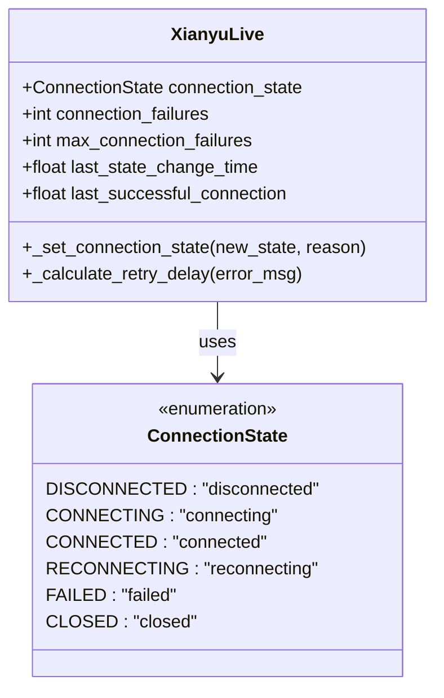
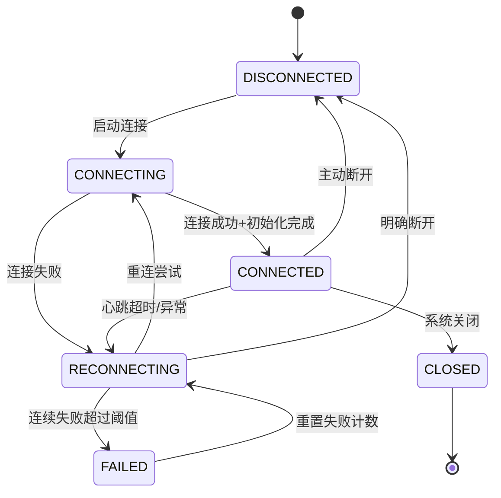
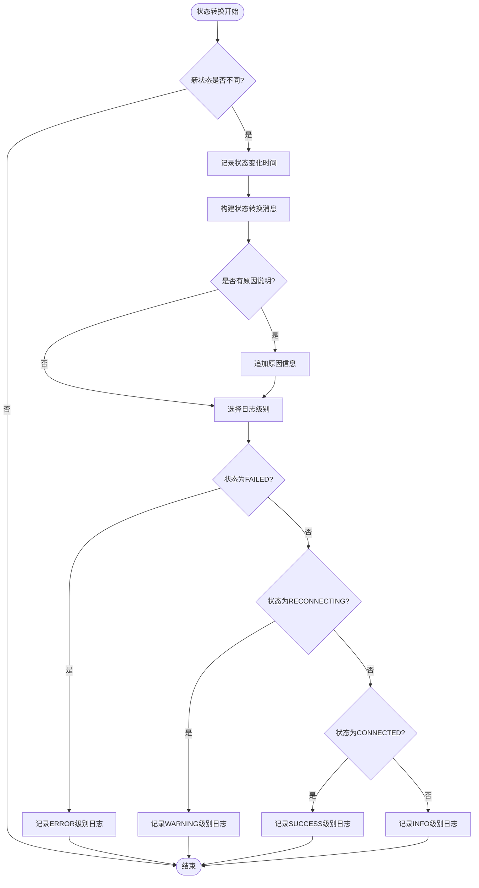
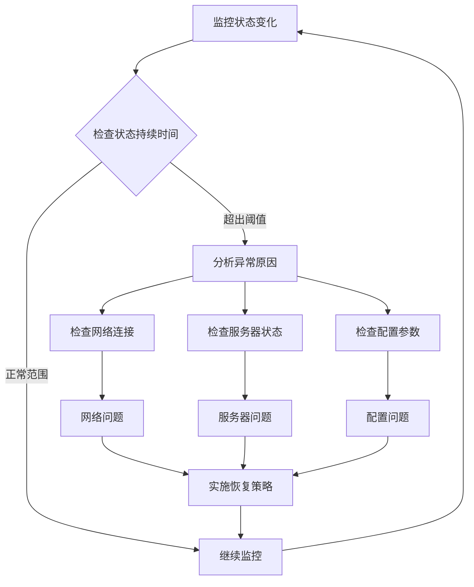
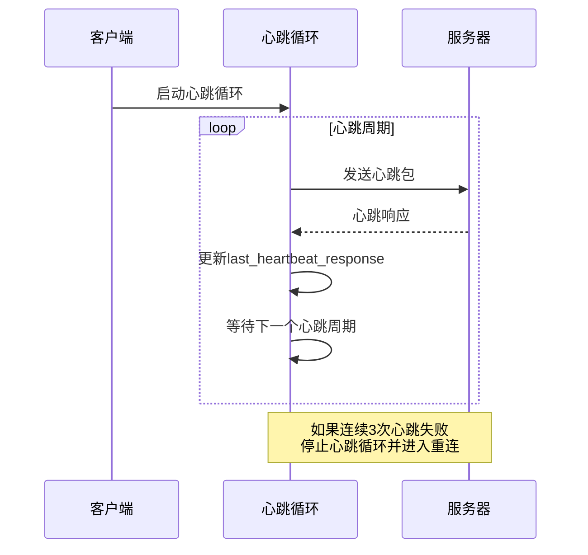
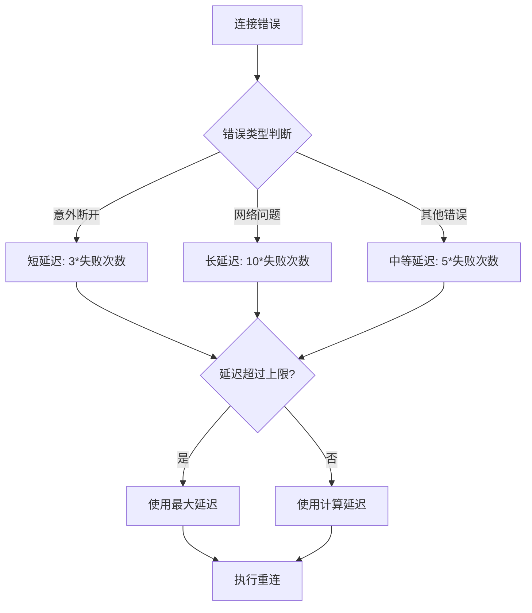
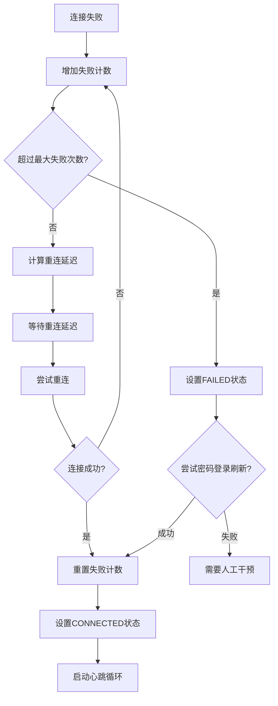

# WebSocket状态机管理

<cite>
**本文档中引用的文件**
- [XianyuAutoAsync.py](file://XianyuAutoAsync.py)
- [config.py](file://config.py)
- [utils/ws_utils.py](file://utils/ws_utils.py)
- [db_manager.py](file://db_manager.py)
- [captcha_control.html](file://captcha_control.html)
</cite>

## 目录
1. [概述](#概述)
2. [ConnectionState枚举定义](#connectionstate枚举定义)
3. [状态机架构](#状态机架构)
4. [状态转换机制](#状态转换机制)
5. [_set_connection_state方法详解](#_set_connection_state方法详解)
6. [状态监控与诊断](#状态监控与诊断)
7. [心跳超时与重连机制](#心跳超时与重连机制)
8. [状态异常诊断与恢复策略](#状态异常诊断与恢复策略)
9. [最佳实践与故障排除](#最佳实践与故障排除)

## 概述

WebSocket状态机管理是闲鱼自动回复系统的核心组件，负责监控和控制WebSocket连接的生命周期。该状态机采用有限状态自动机模型，定义了五个核心状态，实现了智能的连接管理和故障恢复机制。

## ConnectionState枚举定义

ConnectionState枚举定义了WebSocket连接的五种状态，每种状态都有明确的业务含义和触发条件：

**图表来源**
- [XianyuAutoAsync.py](file://XianyuAutoAsync.py#L28-L36)

### 状态定义及业务含义

| 状态 | 值 | 业务含义 | 触发场景 |
|------|----|--------|---------|
| DISCONNECTED | "disconnected" | 未连接状态 | 初始状态或连接完全断开 |
| CONNECTING | "connecting" | 连接中状态 | 正在建立WebSocket连接 |
| CONNECTED | "connected" | 已连接状态 | 连接建立成功且初始化完成 |
| RECONNECTING | "reconnecting" | 重连中状态 | 连接异常或心跳超时后的重连过程 |
| FAILED | "failed" | 连接失败状态 | 连续失败达到最大限制 |

**节来源**
- [XianyuAutoAsync.py](file://XianyuAutoAsync.py#L28-L36)

## 状态机架构

WebSocket状态机采用事件驱动的架构模式，通过状态转换函数和监控机制实现智能连接管理：

**图表来源**
- [XianyuAutoAsync.py](file://XianyuAutoAsync.py#L715-L717)
- [XianyuAutoAsync.py](file://XianyuAutoAsync.py#L7641-L7656)
- [XianyuAutoAsync.py](file://XianyuAutoAsync.py#L7748-L7778)

## 状态转换机制

### 转换触发条件

状态转换由多种事件触发，包括主动操作和被动响应：

#### 从DISCONNECTED到CONNECTING
- **触发条件**: 用户启动WebSocket连接请求
- **触发时机**: 调用连接建立函数时
- **前置检查**: 验证Cookie有效性、网络可用性

#### 从CONNECTING到CONNECTED
- **触发条件**: WebSocket连接建立成功且初始化完成
- **验证步骤**: 
  - WebSocket握手成功
  - 服务器认证通过
  - 初始化消息发送成功

#### 从CONNECTED到RECONNECTING
- **触发条件**: 心跳超时或连接异常
- **检测机制**: 
  - 心跳响应超时（默认30秒）
  - 连接异常断开
  - 网络不稳定

#### 从RECONNECTING到FAILED
- **触发条件**: 连续失败次数超过最大限制（默认5次）
- **保护机制**: 防止无限重连导致资源浪费

**节来源**
- [XianyuAutoAsync.py](file://XianyuAutoAsync.py#L7641-L7656)
- [XianyuAutoAsync.py](file://XianyuAutoAsync.py#L7748-L7778)
- [XianyuAutoAsync.py](file://XianyuAutoAsync.py#L5221-L5271)

## _set_connection_state方法详解

_set_connection_state方法是状态机的核心控制器，负责状态转换和日志记录：

**图表来源**
- [XianyuAutoAsync.py](file://XianyuAutoAsync.py#L195-L216)

### 方法特性

#### 状态变更检测
- **智能比较**: 只在状态真正改变时才执行转换
- **性能优化**: 避免不必要的状态更新和日志记录

#### 日志级别策略
- **FAILED状态**: ERROR级别 - 表示严重错误，需要立即关注
- **RECONNECTING状态**: WARNING级别 - 表示潜在问题，需要监控
- **CONNECTED状态**: SUCCESS级别 - 表示正常运行状态
- **其他状态**: INFO级别 - 一般信息记录

#### 时间戳管理
- **last_state_change_time**: 记录状态变化的确切时间
- **监控用途**: 用于计算状态持续时间和诊断长时间停留问题

**节来源**
- [XianyuAutoAsync.py](file://XianyuAutoAsync.py#L195-L216)

## 状态监控与诊断

### last_state_change_time字段的作用

last_state_change_time字段是状态监控的核心指标，用于跟踪状态持续时间和诊断异常：

#### 监控指标
- **状态持续时间**: 计算当前状态已维持的时间
- **异常检测**: 识别长时间停留在某个状态
- **性能分析**: 分析状态转换频率和效率

#### 诊断方法

### 状态异常诊断

#### 长时间停留在CONNECTING状态
- **可能原因**: 网络延迟、服务器响应慢、认证失败
- **诊断步骤**:
  1. 检查网络连接质量
  2. 验证WebSocket端点可达性
  3. 确认认证凭据有效性
  4. 分析服务器负载情况

#### 长时间停留在RECONNECTING状态
- **可能原因**: 持续网络问题、服务器拒绝连接、配置错误
- **诊断步骤**:
  1. 检查重连间隔设置
  2. 验证防火墙和代理配置
  3. 分析错误日志模式
  4. 检查服务器访问限制

**节来源**
- [XianyuAutoAsync.py](file://XianyuAutoAsync.py#L719-L720)

## 心跳超时与重连机制

### 心跳检测机制

心跳机制是WebSocket连接健康监测的重要组成部分：

**图表来源**
- [XianyuAutoAsync.py](file://XianyuAutoAsync.py#L5221-L5271)

### 心跳配置参数

| 参数 | 默认值 | 说明 | 调优建议 |
|------|--------|------|----------|
| heartbeat_interval | 15秒 | 心跳发送间隔 | 根据网络稳定性调整 |
| heartbeat_timeout | 30秒 | 心跳响应超时时间 | 通常设为心跳间隔的2倍 |
| max_failures | 3次 | 最大连续失败次数 | 平衡重连频率和稳定性 |

### 重连策略

#### 重连延迟计算
系统根据错误类型和失败次数动态计算重连延迟：

**图表来源**
- [XianyuAutoAsync.py](file://XianyuAutoAsync.py#L453-L465)

**节来源**
- [config.py](file://config.py#L95-L96)
- [XianyuAutoAsync.py](file://XianyuAutoAsync.py#L453-L465)
- [XianyuAutoAsync.py](file://XianyuAutoAsync.py#L5221-L5271)

## 状态异常诊断与恢复策略

### 连接失败阈值管理

系统实现了多层次的失败阈值管理机制：

#### 失败计数器
- **connection_failures**: 当前连续失败次数
- **max_connection_failures**: 最大允许失败次数（默认5次）
- **重置机制**: 成功连接后重置失败计数

#### 恢复策略层次

**图表来源**
- [XianyuAutoAsync.py](file://XianyuAutoAsync.py#L7777-L7788)

### 故障恢复机制

#### Cookie刷新策略
当连接连续失败达到阈值时，系统会尝试通过密码登录刷新Cookie：

- **触发条件**: 连续失败5次
- **执行动作**: 尝试密码登录刷新Cookie
- **恢复效果**: 可能解决因Cookie过期导致的连接问题

#### 优雅降级
- **服务降级**: 在连接不可用时暂停自动回复功能
- **资源清理**: 及时释放无效的连接资源
- **状态重置**: 清理异常状态以准备重新连接

**节来源**
- [XianyuAutoAsync.py](file://XianyuAutoAsync.py#L7777-L7788)

## 最佳实践与故障排除

### 监控最佳实践

#### 状态日志分析
- **关键指标**: 状态转换频率、平均持续时间、失败率
- **告警阈值**: 设置合理的阈值触发告警
- **趋势分析**: 监控状态变化的趋势和模式

#### 性能优化建议
- **心跳配置**: 根据网络环境调整心跳参数
- **重连策略**: 平衡重连频率和系统负载
- **资源管理**: 及时清理无效连接和任务

### 常见问题排除

#### 连接频繁断开
**症状**: 连接状态在CONNECTED和RECONNECTING之间频繁切换
**排查步骤**:
1. 检查网络稳定性
2. 验证心跳配置合理性
3. 分析服务器负载情况
4. 检查防火墙和代理设置

#### 连接长时间卡住
**症状**: 连接停留在CONNECTING或RECONNECTING状态
**排查步骤**:
1. 检查网络连接状态
2. 验证服务器可达性
3. 分析错误日志模式
4. 检查系统资源使用情况

#### 状态转换异常
**症状**: 状态转换不符合预期逻辑
**排查步骤**:
1. 检查状态转换代码逻辑
2. 验证并发访问控制
3. 分析异常处理机制
4. 检查日志记录完整性

### 故障预防措施

#### 配置优化
- **合理设置超时参数**: 避免过短或过长的超时时间
- **平衡重连频率**: 防止过度重连或重连不足
- **监控资源使用**: 确保系统资源充足

#### 异常处理
- **完善的错误捕获**: 捕获所有可能的异常情况
- **优雅的降级机制**: 在异常情况下提供备用方案
- **详细的日志记录**: 便于问题诊断和分析

**节来源**
- [XianyuAutoAsync.py](file://XianyuAutoAsync.py#L716-L720)
- [XianyuAutoAsync.py](file://XianyuAutoAsync.py#L453-L465)