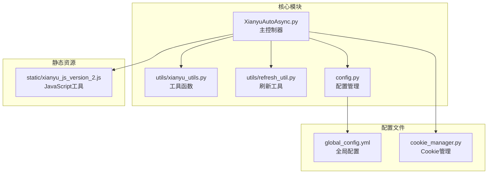
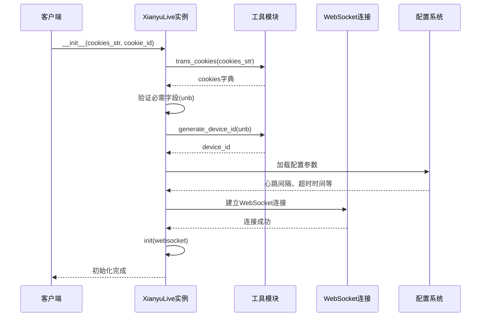
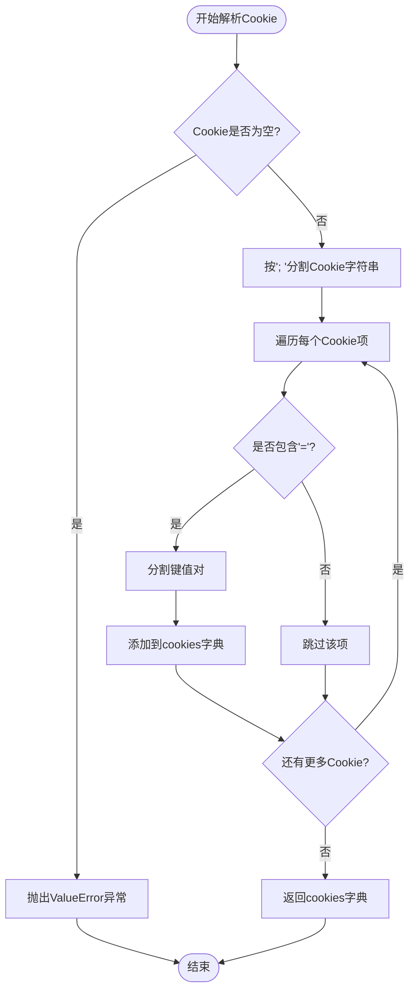
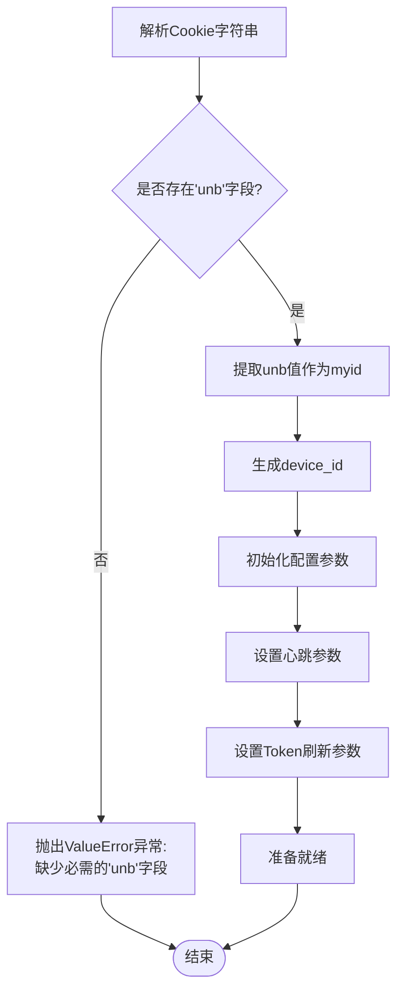
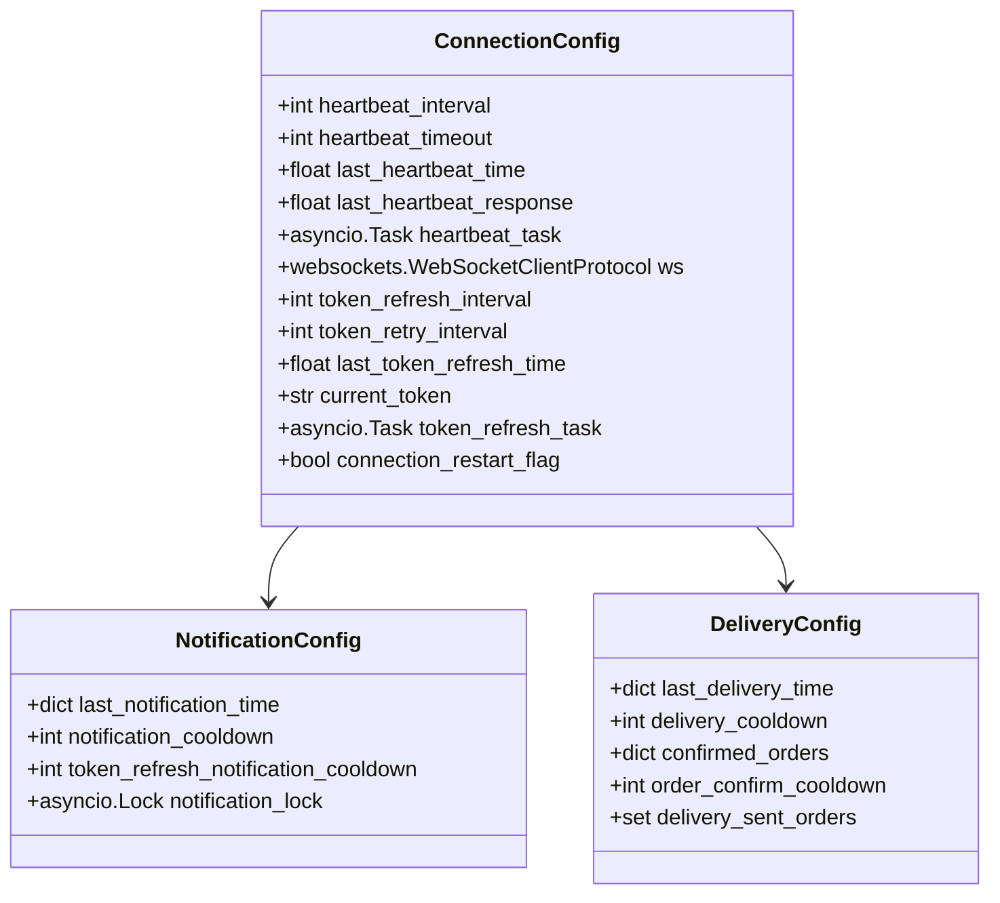
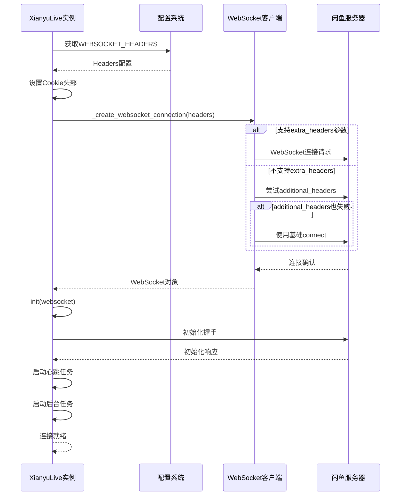
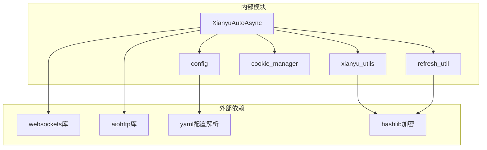
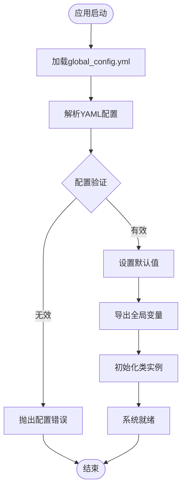
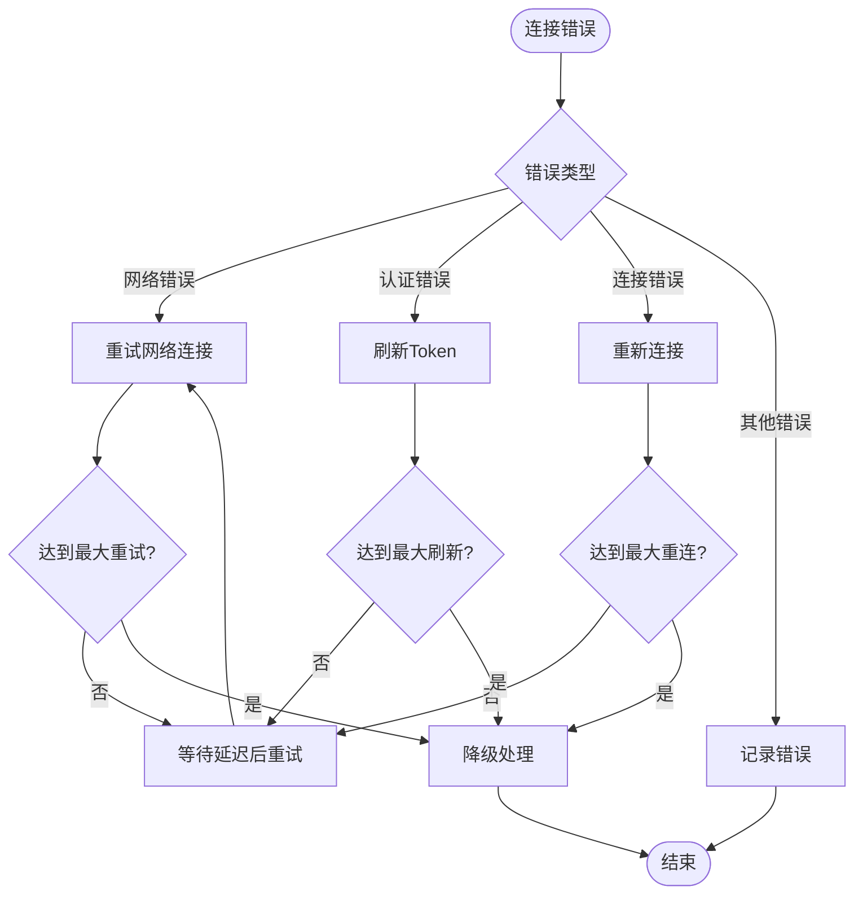

# 连接初始化流程文档

<cite>
**本文档中引用的文件**
- [XianyuAutoAsync.py](file://XianyuAutoAsync.py)
- [utils/xianyu_utils.py](file://utils/xianyu_utils.py)
- [utils/refresh_util.py](file://utils/refresh_util.py)
- [config.py](file://config.py)
- [global_config.yml](file://global_config.yml)
- [cookie_manager.py](file://cookie_manager.py)
- [static/xianyu_js_version_2.js](file://static/xianyu_js_version_2.js)
</cite>

## 目录
1. [概述](#概述)
2. [项目结构分析](#项目结构分析)
3. [核心组件分析](#核心组件分析)
4. [架构概览](#架构概览)
5. [详细组件分析](#详细组件分析)
6. [依赖关系分析](#依赖关系分析)
7. [性能考虑](#性能考虑)
8. [故障排除指南](#故障排除指南)
9. [结论](#结论)

## 概述

本文档详细解析了XianyuLive类在连接初始化过程中的完整流程，重点关注从Cookie提取关键参数到建立WebSocket连接的各个步骤。该系统通过复杂的参数验证、配置加载和连接管理机制，确保与闲鱼直播服务的稳定连接。

## 项目结构分析

该项目采用模块化设计，主要包含以下核心模块：



**图表来源**
- [XianyuAutoAsync.py](file://XianyuAutoAsync.py#L1-L50)
- [config.py](file://config.py#L1-L30)

**章节来源**
- [XianyuAutoAsync.py](file://XianyuAutoAsync.py#L1-L100)
- [config.py](file://config.py#L1-L126)

## 核心组件分析

### XianyuLive类的核心职责

XianyuLive类是整个系统的核心控制器，负责：
- Cookie解析和验证
- 设备标识生成
- WebSocket连接管理
- 心跳机制维护
- Token刷新控制

### 关键初始化参数

系统初始化过程中涉及的关键参数包括：

| 参数名称 | 类型 | 描述 | 必需性 |
|---------|------|------|--------|
| cookies_str | str | 原始Cookie字符串 | 必需 |
| cookie_id | str | 唯一账号标识 | 必需 |
| user_id | int | 用户ID（用于Token刷新） | 可选 |
| unb | str | 用户唯一标识 | 必需 |
| device_id | str | 设备标识符 | 自动生成 |

**章节来源**
- [XianyuAutoAsync.py](file://XianyuAutoAsync.py#L628-L670)

## 架构概览

系统采用异步事件驱动架构，通过多层抽象实现连接管理：



**图表来源**
- [XianyuAutoAsync.py](file://XianyuAutoAsync.py#L628-L670)
- [utils/xianyu_utils.py](file://utils/xianyu_utils.py#L58-L106)

## 详细组件分析

### Cookie解析与验证组件

#### trans_cookies函数分析

Cookie解析是连接初始化的第一步，系统提供了两个版本的解析函数：



**图表来源**
- [utils/xianyu_utils.py](file://utils/xianyu_utils.py#L58-L67)
- [utils/refresh_util.py](file://utils/refresh_util.py#L2004-L2013)

#### 必需字段验证机制

系统严格验证Cookie中必需字段的存在性：



**图表来源**
- [XianyuAutoAsync.py](file://XianyuAutoAsync.py#L645-L651)

**章节来源**
- [utils/xianyu_utils.py](file://utils/xianyu_utils.py#L58-L67)
- [XianyuAutoAsync.py](file://XianyuAutoAsync.py#L645-L651)

### 设备标识生成组件

#### generate_device_id算法

设备标识生成采用标准UUID格式，结合用户ID生成唯一标识：

```mermaid
flowchart TD
Start([开始生成device_id]) --> InitChars[初始化字符集:<br/>0-9,A-Z,a-z]
InitChars --> CreateArray[创建结果数组]
CreateArray --> Loop36[循环36次]
Loop36 --> CheckPos{检查当前位置}
CheckPos --> |8,13,18,23| AddDash[添加'-'分隔符]
CheckPos --> |14| AddFour[添加'4']
CheckPos --> |19| SpecialRandom[特殊随机处理:<br/>rand_val & 0x3 | 0x8]
CheckPos --> |其他| NormalRandom[普通随机处理]
AddDash --> NextPos[下一个位置]
AddFour --> NextPos
SpecialRandom --> NextPos
NormalRandom --> NextPos
NextPos --> MorePos{还有位置?}
MorePos --> |是| Loop36
MorePos --> |否| JoinString[连接所有字符]
JoinString --> AppendUserId[追加用户ID]
AppendUserId --> ReturnDeviceId[返回device_id]
ReturnDeviceId --> End([结束])
```

**图表来源**
- [utils/xianyu_utils.py](file://utils/xianyu_utils.py#L85-L106)
- [utils/refresh_util.py](file://utils/refresh_util.py#L2030-L2052)

**章节来源**
- [utils/xianyu_utils.py](file://utils/xianyu_utils.py#L85-L106)

### WebSocket连接配置组件

#### Headers配置机制

WebSocket连接需要特定的Headers配置，系统通过配置文件管理：

| Header名称 | 值来源 | 描述 |
|-----------|--------|------|
| Accept-Encoding | 配置文件 | 支持的编码格式 |
| Accept-Language | 配置文件 | 语言偏好 |
| Cache-Control | 配置文件 | 缓存控制策略 |
| Connection | 配置文件 | 连接升级 |
| Host | 固定值 | WebSocket主机 |
| Origin | 配置文件 | 请求来源 |
| Pragma | 配置文件 | HTTP缓存指令 |
| User-Agent | 配置文件 | 浏览器标识 |
| Cookie | 动态生成 | 包含所有Cookie字段 |

#### 连接参数初始化

系统初始化时加载多个关键配置参数：



**图表来源**
- [XianyuAutoAsync.py](file://XianyuAutoAsync.py#L653-L696)

**章节来源**
- [XianyuAutoAsync.py](file://XianyuAutoAsync.py#L653-L696)
- [config.py](file://config.py#L91-L106)

### 连接建立与初始化流程

#### WebSocket连接建立过程



**图表来源**
- [XianyuAutoAsync.py](file://XianyuAutoAsync.py#L7638-L7658)
- [XianyuAutoAsync.py](file://XianyuAutoAsync.py#L6714-L6742)

**章节来源**
- [XianyuAutoAsync.py](file://XianyuAutoAsync.py#L7638-L7658)
- [XianyuAutoAsync.py](file://XianyuAutoAsync.py#L6714-L6742)

## 依赖关系分析

### 模块间依赖关系



**图表来源**
- [XianyuAutoAsync.py](file://XianyuAutoAsync.py#L1-L50)
- [config.py](file://config.py#L1-L10)

### 配置参数加载机制

系统通过多层次的配置加载机制确保参数的正确性：



**图表来源**
- [config.py](file://config.py#L21-L32)
- [config.py](file://config.py#L91-L106)

**章节来源**
- [config.py](file://config.py#L21-L32)
- [config.py](file://config.py#L91-L106)

## 性能考虑

### 异步任务管理

系统采用异步编程模型，通过任务池和信号量控制并发：

- **消息处理并发控制**：使用Semaphore限制同时处理的消息数量
- **后台任务追踪**：跟踪所有后台任务，防止内存泄漏
- **任务生命周期管理**：智能重启失败的任务，确保服务连续性

### 连接稳定性保障

- **心跳机制**：定期发送心跳包维持连接活跃
- **自动重连**：连接断开时自动重连，最多重试5次
- **Cookie刷新**：定期刷新Cookie保持会话有效性

## 故障排除指南

### 常见初始化失败场景

#### 场景1：缺少unb字段

**症状**：`ValueError: Cookie中缺少必需的'unb'字段`

**原因分析**：
- Cookie字符串格式不正确
- 缺少关键认证字段
- Cookie被截断或损坏

**解决方案**：
1. 验证Cookie字符串完整性
2. 确保包含`unb`字段
3. 重新获取有效的Cookie

#### 场景2：Cookie格式错误

**症状**：Cookie解析失败或字段缺失

**诊断步骤**：
```python
# 检查Cookie格式
parsed_cookies = trans_cookies(cookies_str)
print(f"解析的Cookie字段: {list(parsed_cookies.keys())}")
print(f"Cookie字符串长度: {len(cookies_str)}")
```

**解决方案**：
- 使用正确的Cookie格式
- 确保字段间用`; `分隔
- 验证每个字段包含`=`符号

#### 场景3：网络连接问题

**症状**：WebSocket连接失败

**诊断流程**：
1. 检查网络连接状态
2. 验证WebSocket URL可达性
3. 检查防火墙设置
4. 验证SSL证书有效性

**章节来源**
- [XianyuAutoAsync.py](file://XianyuAutoAsync.py#L645-L647)
- [utils/xianyu_utils.py](file://utils/xianyu_utils.py#L60-L67)

### 错误恢复机制

系统内置多种错误恢复机制：



**图表来源**
- [XianyuAutoAsync.py](file://XianyuAutoAsync.py#L7730-L7799)

## 结论

XianyuLive类的连接初始化流程体现了现代异步系统的最佳实践，通过模块化设计、严格的参数验证、智能的错误处理和完善的配置管理，确保了与闲鱼直播服务的稳定连接。该系统的设计原则包括：

1. **健壮性**：多重验证和错误处理机制
2. **可扩展性**：模块化架构支持功能扩展
3. **可维护性**：清晰的代码结构和文档
4. **性能优化**：异步处理和资源管理

通过深入理解这些机制，开发者可以更好地维护和扩展系统功能，同时为类似项目的开发提供参考。