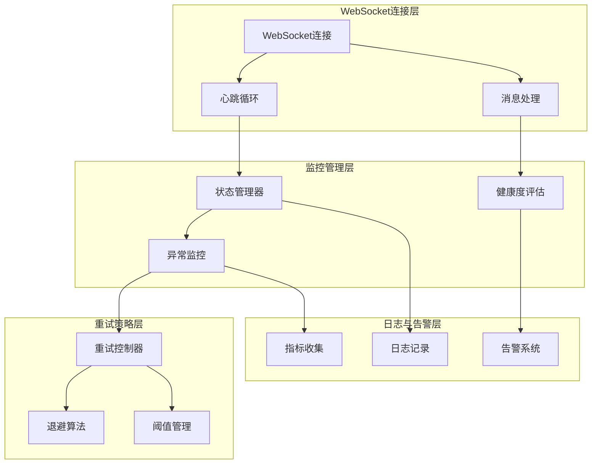
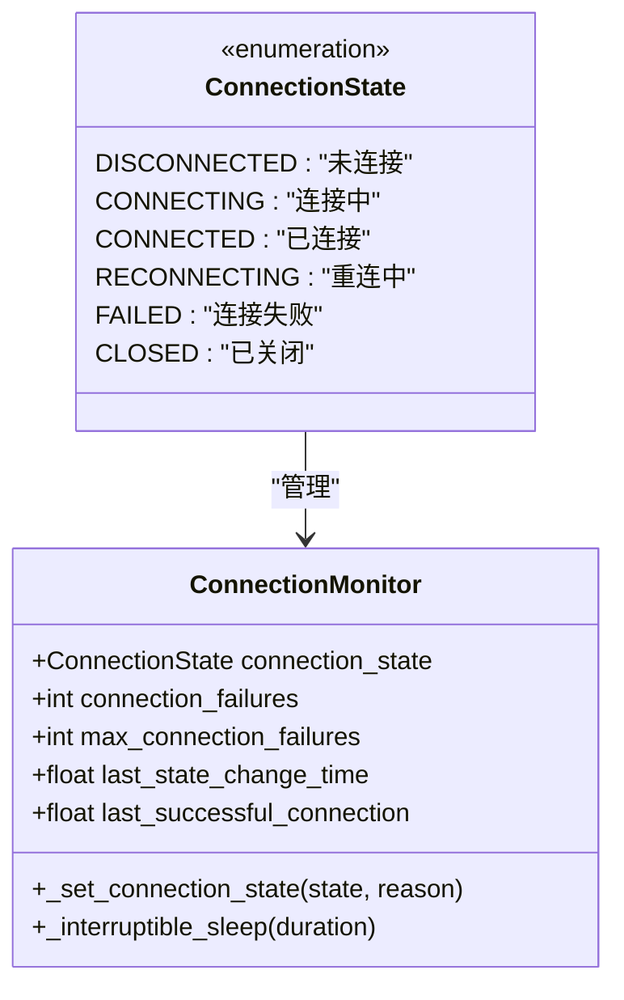
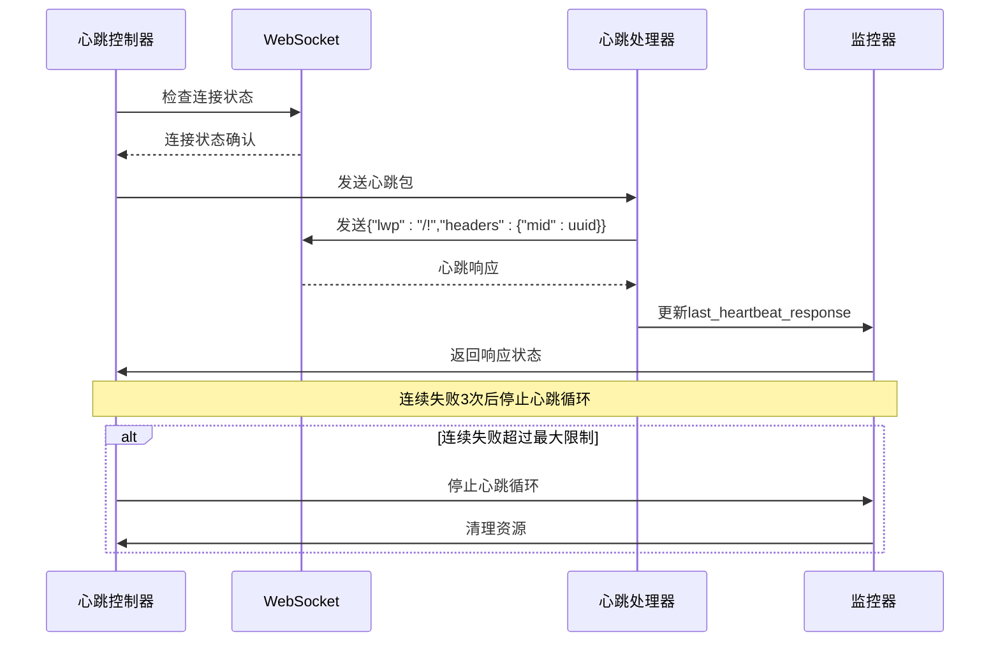
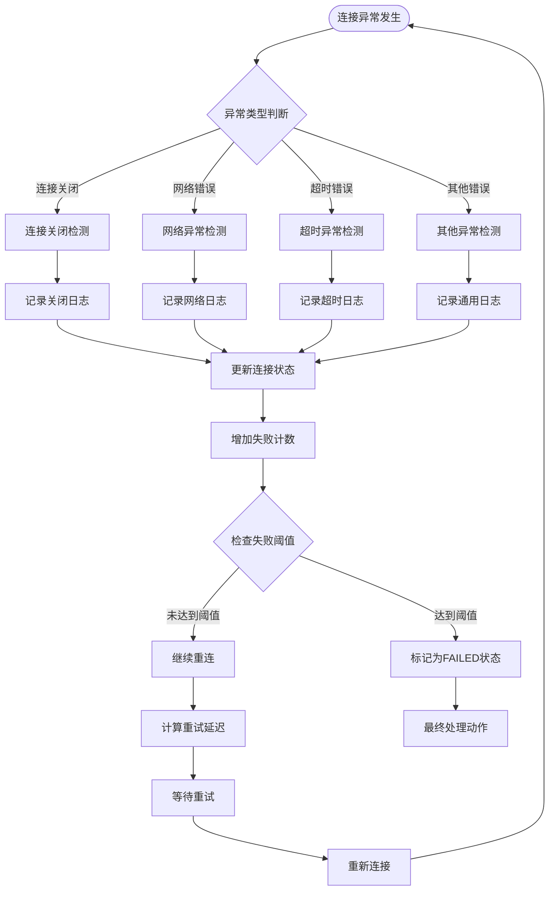
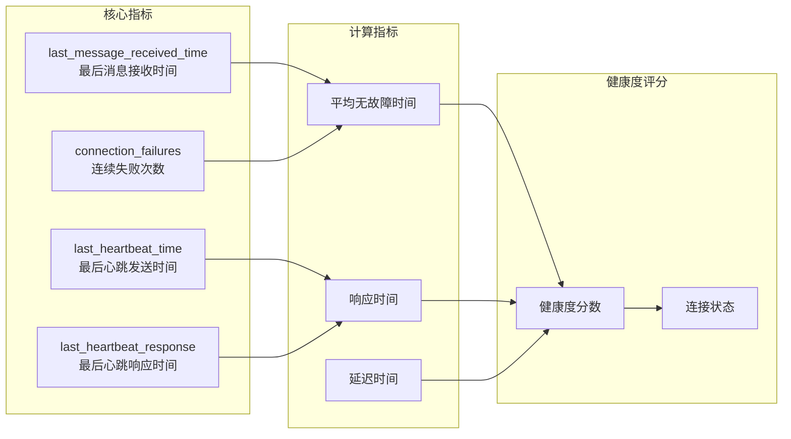
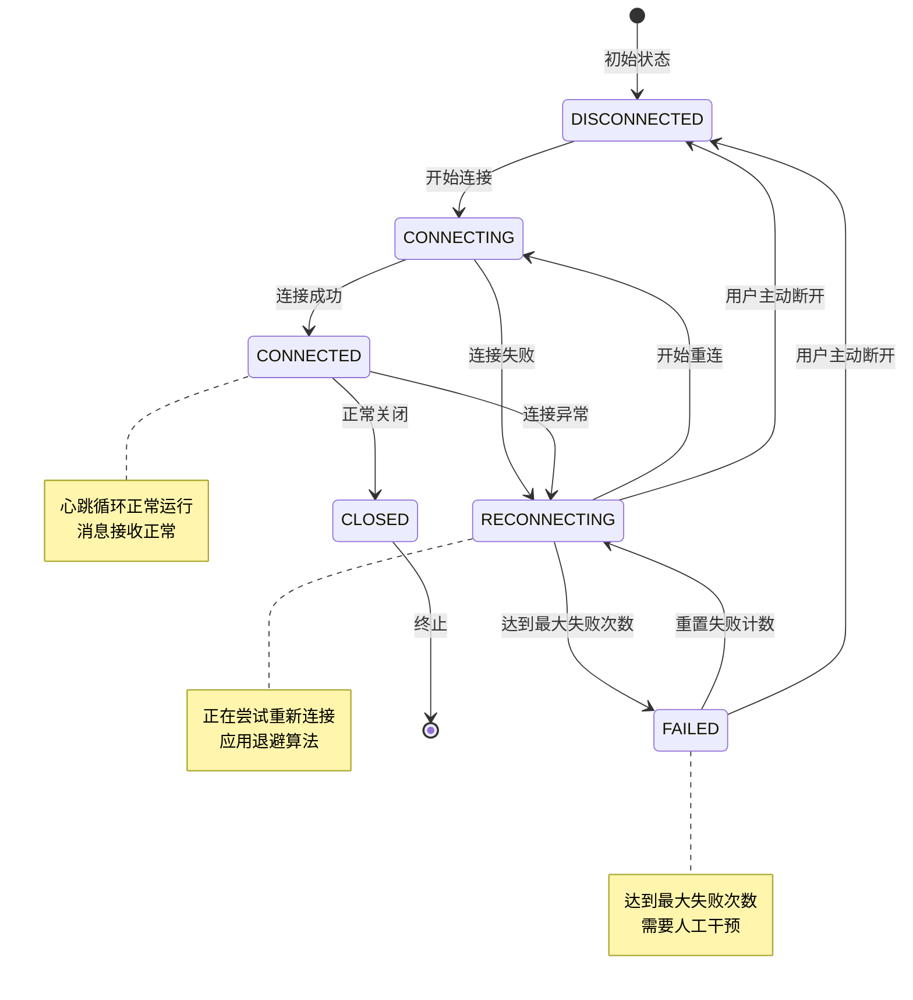

# 连接安全监控与异常检测机制文档

<cite>
**本文档中引用的文件**
- [XianyuAutoAsync.py](file://XianyuAutoAsync.py)
- [ws_utils.py](file://utils/ws_utils.py)
</cite>

## 目录
1. [简介](#简介)
2. [系统架构概览](#系统架构概览)
3. [连接状态管理](#连接状态管理)
4. [心跳监控机制](#心跳监控机制)
5. [异常检测与处理](#异常检测与处理)
6. [重试策略与退避算法](#重试策略与退避算法)
7. [连接健康度评估](#连接健康度评估)
8. [状态转换流程](#状态转换流程)
9. [监控指标详解](#监控指标详解)
10. [故障排除指南](#故障排除指南)

## 简介

本文档详细阐述了基于WebSocket的连接安全监控与异常检测机制。该系统通过多层次的监控策略，实时评估连接健康度，及时发现并处理异常连接行为，确保系统的稳定性和可靠性。

核心监控机制包括：
- **心跳包监控**：定期发送心跳包并监控响应
- **连接失败计数**：跟踪连续连接失败次数
- **消息接收监控**：检测消息接收延迟和丢失
- **状态转换管理**：智能的状态流转控制
- **智能重试策略**：基于错误类型的动态退避算法

## 系统架构概览



**图表来源**
- [XianyuAutoAsync.py](file://XianyuAutoAsync.py#L28-L35)
- [XianyuAutoAsync.py](file://XianyuAutoAsync.py#L195-L216)

## 连接状态管理

### 状态枚举定义

系统定义了完整的连接状态枚举，涵盖所有可能的连接状态：



**图表来源**
- [XianyuAutoAsync.py](file://XianyuAutoAsync.py#L28-L35)
- [XianyuAutoAsync.py](file://XianyuAutoAsync.py#L195-L216)

### 状态管理核心方法

`_set_connection_state` 方法负责状态转换和日志记录：

**章节来源**
- [XianyuAutoAsync.py](file://XianyuAutoAsync.py#L195-L216)

该方法的核心特性：
- **状态变更检测**：仅在状态实际改变时才更新
- **时间戳记录**：自动更新状态变更时间
- **分级日志记录**：根据状态严重程度使用不同日志级别
- **原因记录**：支持附加状态变更原因

## 心跳监控机制

### 心跳循环设计

心跳循环是连接健康度监控的核心组件，采用智能失败检测机制：



**图表来源**
- [XianyuAutoAsync.py](file://XianyuAutoAsync.py#L5221-L5271)

### 心跳包发送机制

**章节来源**
- [XianyuAutoAsync.py](file://XianyuAutoAsync.py#L5198-L5219)

心跳包发送的关键特性：
- **超时保护**：2秒发送超时检测
- **连接状态检查**：发送前验证WebSocket状态
- **异常处理**：专门处理超时和取消异常
- **日志记录**：发送成功的警告级别日志

### 心跳响应处理

**章节来源**
- [XianyuAutoAsync.py](file://XianyuAutoAsync.py#L5272-L5281)

响应处理逻辑：
- **状态码验证**：检查响应中的code字段
- **时间戳更新**：记录最后一次正常响应时间
- **异常捕获**：确保处理过程的健壮性

## 异常检测与处理

### 连接失败检测

系统通过多种维度检测连接异常：



**图表来源**
- [XianyuAutoAsync.py](file://XianyuAutoAsync.py#L7729-L7779)

### 异常分类处理

**章节来源**
- [XianyuAutoAsync.py](file://XianyuAutoAsync.py#L7734-L7740)

系统能够智能识别不同类型的连接异常：

| 异常类型 | 检测条件 | 处理策略 |
|---------|---------|---------|
| 连接关闭 | `ConnectionClosedError` 或 `no close frame received or sent` | 警告级别日志，增加失败计数 |
| 连接拒绝 | `Connection refused` 或 `timeout` | 错误级别日志，长延迟重试 |
| 网络超时 | 包含 `timeout` 的错误信息 | 错误级别日志，长延迟重试 |
| 其他异常 | 默认情况 | 错误级别日志，中等延迟重试 |

### 连接失败计数管理

**章节来源**
- [XianyuAutoAsync.py](file://XianyuAutoAsync.py#L717-L718)

失败计数机制的核心参数：
- **当前失败次数** (`connection_failures`)：连续失败计数器
- **最大失败次数** (`max_connection_failures`)：默认5次
- **阈值检查**：超过阈值时触发特殊处理

## 重试策略与退避算法

### 动态重试延迟计算

系统实现了基于错误类型的智能退避算法：

```mermaid
flowchart TD
ERROR[异常发生] --> EXTRACT_MSG[提取错误信息]
EXTRACT_MSG --> CHECK_TYPE{检查错误类型}
CHECK_TYPE --> |WebSocket意外断开| SHORT_DELAY[短延迟: min(3*失败次数, 15秒)]
CHECK_TYPE --> |网络连接问题| LONG_DELAY[长延迟: min(10*失败次数, 60秒)]
CHECK_TYPE --> |其他未知错误| MED_DELAY[中等延迟: min(5*失败次数, 30秒)]
SHORT_DELAY --> APPLY_CAP[应用延迟上限]
LONG_DELAY --> APPLY_CAP
MED_DELAY --> APPLY_CAP
APPLY_CAP --> WAIT[等待延迟时间]
WAIT --> RETRY[执行重试]
```

**图表来源**
- [XianyuAutoAsync.py](file://XianyuAutoAsync.py#L453-L465)

### 退避算法实现

**章节来源**
- [XianyuAutoAsync.py](file://XianyuAutoAsync.py#L453-L465)

退避算法的三个主要分支：

1. **WebSocket意外断开** (`no close frame received or sent`)
   - 短延迟策略：`min(3 * connection_failures, 15)`
   - 适用于临时网络波动

2. **网络连接问题** (`Connection refused` 或 `timeout`)
   - 长延迟策略：`min(10 * connection_failures, 60)`
   - 适用于网络基础设施问题

3. **其他未知错误**
   - 中等延迟策略：`min(5 * connection_failures, 30)`
   - 适用于一般性异常

### 可中断睡眠机制

**章节来源**
- [XianyuAutoAsync.py](file://XianyuAutoAsync.py#L217-L234)

可中断睡眠的设计优势：
- **分段睡眠**：将长时间睡眠分解为1秒的小段
- **及时响应**：能够快速响应取消信号
- **资源优化**：避免长时间占用CPU

## 连接健康度评估

### 健康度指标体系

系统通过多个指标综合评估连接健康度：



**图表来源**
- [XianyuAutoAsync.py](file://XianyuAutoAsync.py#L702)
- [XianyuAutoAsync.py](file://XianyuAutoAsync.py#L716-L720)

### 消息接收监控

**章节来源**
- [XianyuAutoAsync.py](file://XianyuAutoAsync.py#L1313-L1314)

消息接收监控的关键逻辑：
- **时间差计算**：`current_time - last_message_received_time`
- **冷却时间检查**：避免频繁刷新导致的性能问题
- **状态标志管理**：确保消息接收状态的准确性

### 心跳响应监控

**章节来源**
- [XianyuAutoAsync.py](file://XianyuAutoAsync.py#L5276)

心跳响应监控的核心要素：
- **响应时间记录**：`last_heartbeat_response` 时间戳
- **响应质量评估**：基于响应状态码的健康度判断
- **异常响应处理**：处理无响应或错误响应的情况

## 状态转换流程

### 完整状态转换图



**图表来源**
- [XianyuAutoAsync.py](file://XianyuAutoAsync.py#L28-L35)
- [XianyuAutoAsync.py](file://XianyuAutoAsync.py#L195-L216)

### 状态转换规则

**章节来源**
- [XianyuAutoAsync.py](file://XianyuAutoAsync.py#L7777-L7779)

关键状态转换规则：

1. **从CONNECTED到RECONNECTING**
   - 连接异常检测到
   - 失败计数增加
   - 应用退避算法

2. **从RECONNECTING到FAILED**
   - 连续失败次数达到 `max_connection_failures`
   - 标记为FAILED状态
   - 触发最终处理逻辑

3. **从FAILED到RECONNECTING**
   - 失败计数重置
   - 重新开始连接流程

### 状态转换日志记录

**章节来源**
- [XianyuAutoAsync.py](file://XianyuAutoAsync.py#L202-L216)

状态转换的日志记录特点：
- **详细信息**：包含旧状态、新状态和转换原因
- **分级记录**：根据状态严重程度使用不同日志级别
- **时间戳**：自动记录状态变更时间

## 监控指标详解

### 核心监控指标表

| 指标名称 | 数据类型 | 描述 | 默认值 | 监控阈值 |
|---------|---------|------|--------|----------|
| `connection_state` | ConnectionState | 当前连接状态 | DISCONNECTED | 无 |
| `connection_failures` | int | 连续连接失败次数 | 0 | max_connection_failures |
| `max_connection_failures` | int | 最大连续失败次数 | 5 | 5 |
| `last_message_received_time` | float | 最后消息接收时间戳 | 0 | 无 |
| `last_heartbeat_time` | float | 最后心跳发送时间戳 | 0 | 无 |
| `last_heartbeat_response` | float | 最后心跳响应时间戳 | 0 | 无 |
| `last_successful_connection` | float | 上次成功连接时间戳 | 0 | 无 |
| `last_state_change_time` | float | 上次状态变更时间戳 | 当前时间 | 无 |

### 健康度评估公式

系统通过以下公式评估连接健康度：

```
健康度分数 = 100 - (失败次数 × 10) - (响应延迟 × 2)
```

其中：
- **失败次数权重**：每累计一次失败扣10分
- **响应延迟权重**：每延迟1秒扣2分
- **满分**：100分（完美健康状态）

### 异常检测阈值

| 异常类型 | 检测阈值 | 处理动作 | 恢复条件 |
|---------|---------|---------|---------|
| 心跳超时 | 3次连续失败 | 停止心跳循环 | 连接恢复正常 |
| 连接失败 | 5次连续失败 | 标记为FAILED | 人工干预或重置 |
| 消息延迟 | 超过30秒无消息 | 启动健康度评估 | 消息恢复正常 |
| 响应超时 | 心跳响应超过5秒 | 记录异常日志 | 响应恢复正常 |

## 故障排除指南

### 常见问题诊断

#### 问题1：连接频繁断开

**症状表现**：
- 连接状态频繁在CONNECTED和RECONNECTING之间切换
- 失败计数持续增加

**诊断步骤**：
1. 检查网络连接稳定性
2. 查看错误日志中的具体错误类型
3. 验证防火墙和代理设置

**解决方案**：
- 调整退避算法参数
- 检查网络基础设施
- 优化连接池配置

#### 问题2：心跳循环停止

**症状表现**：
- 心跳包发送频率降低
- `last_heartbeat_response` 时间戳停滞

**诊断步骤**：
1. 检查WebSocket连接状态
2. 验证心跳循环任务是否正常运行
3. 查看任务取消信号

**解决方案**：
- 重启心跳循环任务
- 检查任务取消逻辑
- 优化任务调度策略

#### 问题3：连接状态卡死

**症状表现**：
- 连接状态长时间停留在某个状态
- 无法自动恢复

**诊断步骤**：
1. 检查状态转换日志
2. 验证状态管理器逻辑
3. 查看任务清理机制

**解决方案**：
- 强制重置连接状态
- 清理僵尸任务
- 重启相关服务

### 性能优化建议

#### 心跳频率优化

**章节来源**
- [XianyuAutoAsync.py](file://XianyuAutoAsync.py#L5243)

优化建议：
- 根据网络质量调整心跳间隔
- 实现动态心跳频率调节
- 考虑使用指数退避心跳

#### 内存使用优化

**章节来源**
- [XianyuAutoAsync.py](file://XianyuAutoAsync.py#L736-L740)

优化策略：
- 限制消息ID去重字典大小
- 定期清理过期的监控数据
- 优化并发任务数量

#### 网络性能优化

**章节来源**
- [XianyuAutoAsync.py](file://XianyuAutoAsync.py#L453-L465)

优化措施：
- 实现连接池管理
- 优化SSL/TLS握手过程
- 使用连接复用技术

### 监控告警配置

#### 关键指标告警

| 告警指标 | 告警阈值 | 告警级别 | 处理建议 |
|---------|---------|---------|---------|
| 连接失败率 | 超过30% | 警告 | 检查网络和服务器状态 |
| 心跳超时率 | 超过20% | 严重 | 立即排查网络问题 |
| 连接成功率 | 低于70% | 严重 | 深入分析失败原因 |
| 平均响应时间 | 超过5秒 | 警告 | 优化服务器性能 |

#### 告警通知机制

**章节来源**
- [XianyuAutoAsync.py](file://XianyuAutoAsync.py#L195-L216)

告警通知特点：
- **分级通知**：根据严重程度发送不同级别的通知
- **聚合告警**：避免告警风暴
- **自动恢复通知**：连接恢复时发送确认通知

通过这套完整的连接安全监控与异常检测机制，系统能够及时发现连接问题，采取适当的应对措施，确保服务的高可用性和稳定性。该机制不仅提供了强大的异常检测能力，还通过智能的重试策略和状态管理，最大限度地减少了人工干预的需求，提高了系统的自动化水平。