# 安全通信机制

<cite>
**本文档中引用的文件**
- [utils/ws_utils.py](file://utils/ws_utils.py)
- [utils/xianyu_utils.py](file://utils/xianyu_utils.py)
- [secure_freeshipping_decrypted.py](file://secure_freeshipping_decrypted.py)
- [secure_confirm_decrypted.py](file://secure_confirm_decrypted.py)
- [cookie_manager.py](file://cookie_manager.py)
- [XianyuAutoAsync.py](file://XianyuAutoAsync.py)
- [config.py](file://config.py)
- [db_manager.py](file://db_manager.py)
</cite>

## 目录
1. [概述](#概述)
2. [WebSocket通信架构](#websocket通信架构)
3. [消息加密与解密机制](#消息加密与解密机制)
4. [身份验证与设备标识](#身份验证与设备标识)
5. [Token刷新机制](#token刷新机制)
6. [连接安全监控](#连接安全监控)
7. [敏感操作二次验证](#敏感操作二次验证)
8. [安全通信数据流](#安全通信数据流)
9. [异常处理与安全策略](#异常处理与安全策略)
10. [总结](#总结)

## 概述

本系统采用多层次的安全通信机制，确保WebSocket通信过程中的数据机密性、完整性和身份验证可靠性。核心安全特性包括：

- **端到端加密**：所有WebSocket消息均经过AES加密处理
- **动态Token验证**：基于账号特定的密钥进行实时身份验证
- **设备唯一标识**：通过设备ID和Cookie生成唯一设备标识
- **智能重连机制**：具备连接失败检测和自动恢复能力
- **多重安全检查**：敏感操作前的多重验证机制

## WebSocket通信架构

### 基础连接层

系统采用异步WebSocket客户端架构，提供稳定可靠的连接管理：

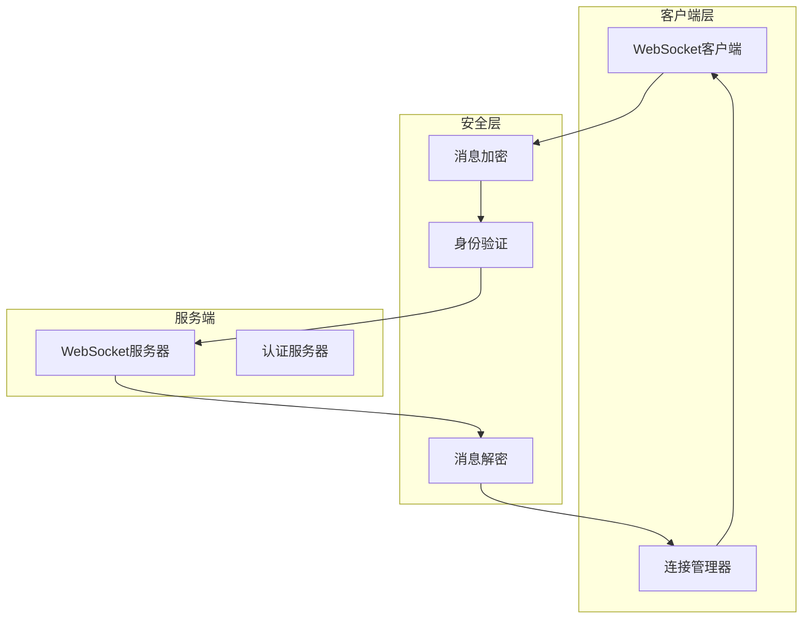

**图表来源**
- [utils/ws_utils.py](file://utils/ws_utils.py#L6-L89)
- [XianyuAutoAsync.py](file://XianyuAutoAsync.py#L6714-L7775)

### 连接状态管理

系统实现了完整的连接状态生命周期管理：

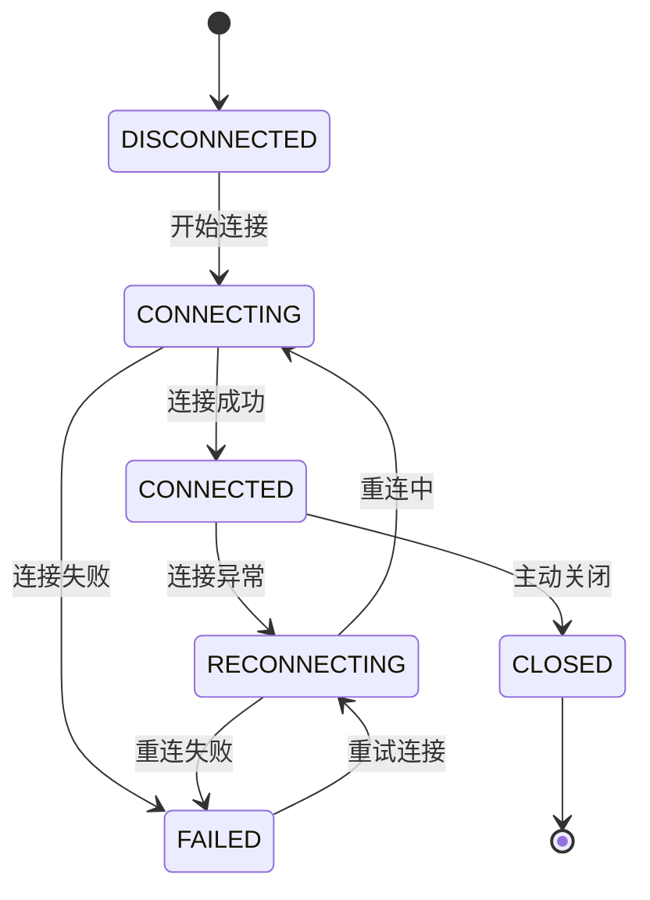

**节来源**
- [XianyuAutoAsync.py](file://XianyuAutoAsync.py#L29-L36)

## 消息加密与解密机制

### AES解密核心算法

系统的核心安全特性是基于账号特定密钥的AES消息解密机制：

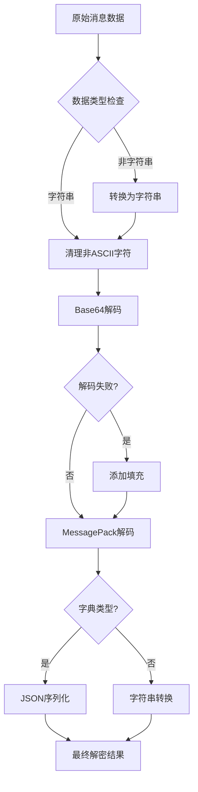

**图表来源**
- [utils/xianyu_utils.py](file://utils/xianyu_utils.py#L327-L371)

### 解密函数详细流程

解密函数`decrypt`实现了完整的安全解密流程：

1. **数据预处理**：确保输入数据为字符串类型，清理非ASCII字符
2. **Base64解码**：处理可能的填充缺失问题
3. **MessagePack解码**：使用自定义解码器处理二进制数据
4. **类型转换**：根据解码结果进行适当的类型转换

**节来源**
- [utils/xianyu_utils.py](file://utils/xianyu_utils.py#L327-L371)

### 消息处理安全机制

系统在消息处理过程中实施多重安全检查：

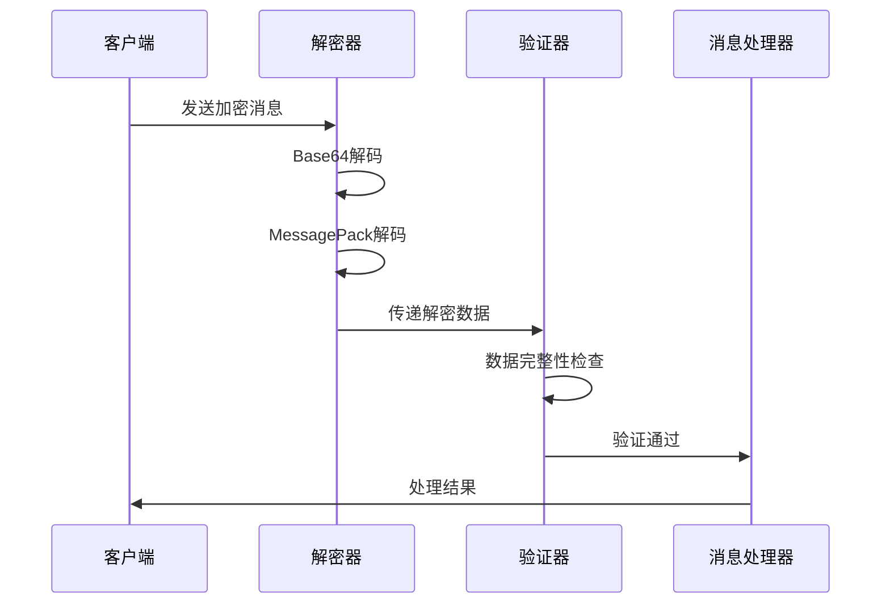

**图表来源**
- [XianyuAutoAsync.py](file://XianyuAutoAsync.py#L7705-L7718)

## 身份验证与设备标识

### 设备唯一标识生成

系统通过组合用户ID和随机生成的UUID创建唯一的设备标识：

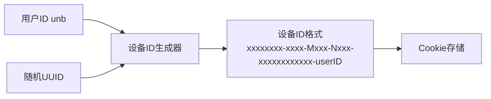

**图表来源**
- [utils/xianyu_utils.py](file://utils/xianyu_utils.py#L85-L107)
- [XianyuAutoAsync.py](file://XianyuAutoAsync.py#L651)

### Cookie认证机制

系统通过Cookie中的`unb`字段和`device_id`生成唯一设备标识：

| 认证要素 | 描述 | 用途 |
|---------|------|------|
| `unb`字段 | 用户唯一标识 | 账号身份验证 |
| `device_id` | 设备唯一标识 | 防止会话劫持 |
| `_m_h5_tk` | Token标识 | API访问授权 |

**节来源**
- [XianyuAutoAsync.py](file://XianyuAutoAsync.py#L646-L651)

### 身份验证流程

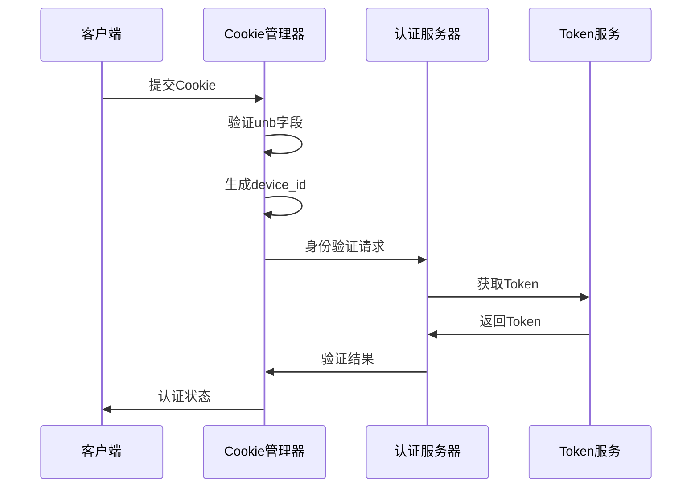

**图表来源**
- [cookie_manager.py](file://cookie_manager.py#L11-L428)

## Token刷新机制

### Token刷新循环

系统实现了智能的Token刷新机制，确保长期连接的有效性：

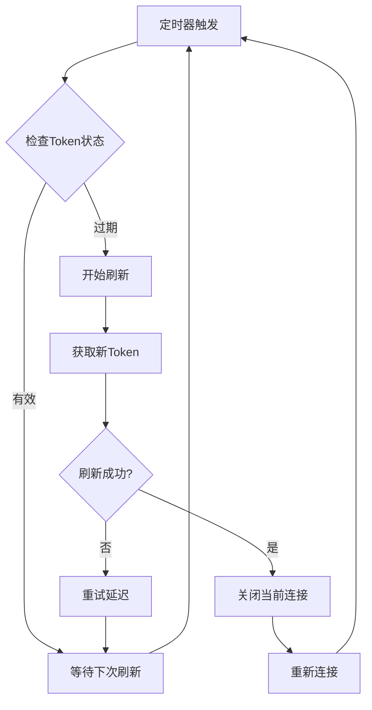

**图表来源**
- [XianyuAutoAsync.py](file://XianyuAutoAsync.py#L5016-L5039)

### Token刷新配置

| 参数 | 默认值 | 描述 |
|------|--------|------|
| `TOKEN_REFRESH_INTERVAL` | 72000秒 | Token刷新间隔 |
| `TOKEN_RETRY_INTERVAL` | 7200秒 | 重试间隔 |
| `last_token_refresh_time` | 时间戳 | 上次刷新时间 |
| `current_token` | Token值 | 当前有效Token |

**节来源**
- [config.py](file://config.py#L97-L98)
- [XianyuAutoAsync.py](file://XianyuAutoAsync.py#L661-L666)

### Token刷新任务

系统维护独立的Token刷新任务，确保后台持续运行：

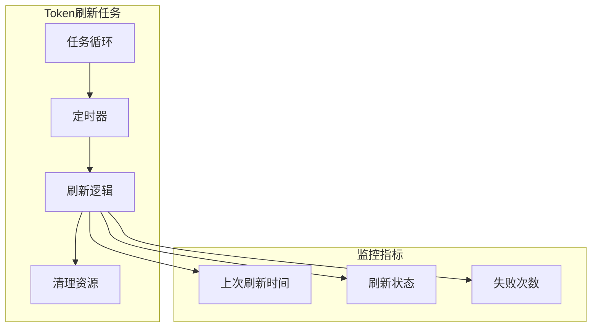

**图表来源**
- [XianyuAutoAsync.py](file://XianyuAutoAsync.py#L7675-L7680)

## 连接安全监控

### 连接状态监控

系统实现了全面的连接状态监控机制：

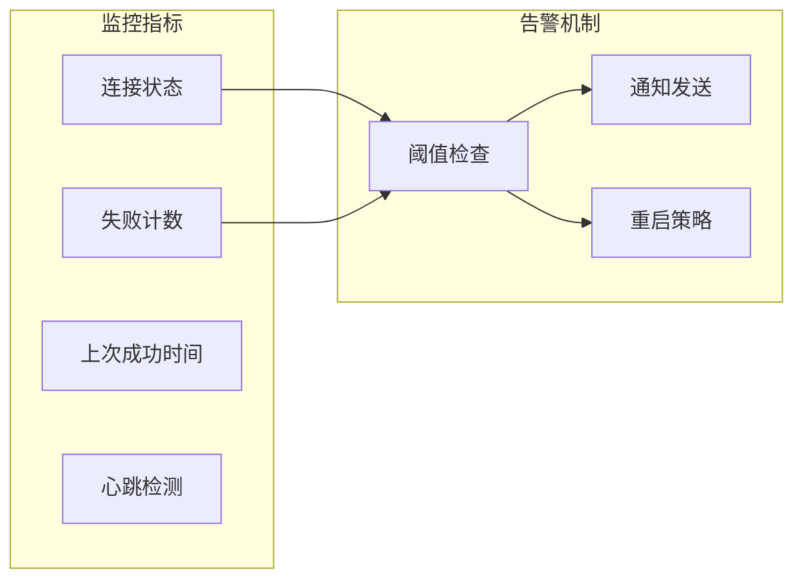

**图表来源**
- [XianyuAutoAsync.py](file://XianyuAutoAsync.py#L715-L720)

### 异常检测机制

系统具备智能的异常检测和处理能力：

| 异常类型 | 检测条件 | 处理策略 |
|----------|----------|----------|
| 连接超时 | 心跳超时 | 重连机制 |
| 连接关闭 | 主动/被动关闭 | 状态更新 |
| 认证失败 | Token无效 | 刷新Token |
| 网络异常 | 连接拒绝/超时 | 延迟重试 |

**节来源**
- [XianyuAutoAsync.py](file://XianyuAutoAsync.py#L7734-L7740)

### 连接监控指标

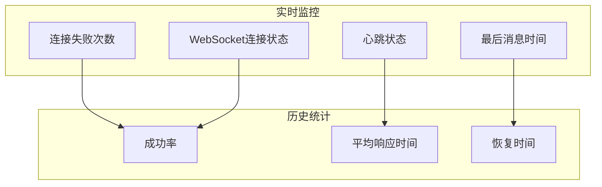

**图表来源**
- [XianyuAutoAsync.py](file://XianyuAutoAsync.py#L702-L704)

## 敏感操作二次验证

### 自动确认发货验证

系统在执行自动确认发货前实施多重安全检查：

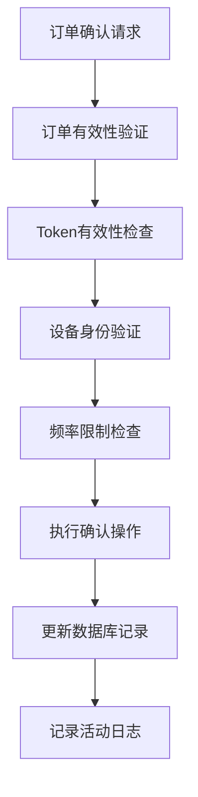

**图表来源**
- [secure_confirm_decrypted.py](file://secure_confirm_decrypted.py#L87-L181)

### 免拼发货安全机制

免拼发货功能实施严格的二次验证：

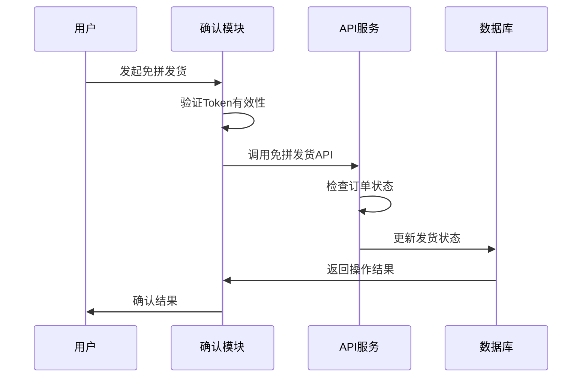

**图表来源**
- [secure_freeshipping_decrypted.py](file://secure_freeshipping_decrypted.py#L38-L131)

### 防重复操作机制

系统实施多种防重复操作策略：

| 机制 | 应用场景 | 时间窗口 |
|------|----------|----------|
| 订单确认防重复 | 自动确认发货 | 10分钟 |
| 发货防重复 | 免拼发货 | 10分钟 |
| 通知防重复 | 系统通知 | 5分钟 |
| 暂停防重复 | 用户暂停 | 动态调整 |

**节来源**
- [XianyuAutoAsync.py](file://XianyuAutoAsync.py#L675-L681)

## 安全通信数据流

### 完整通信流程

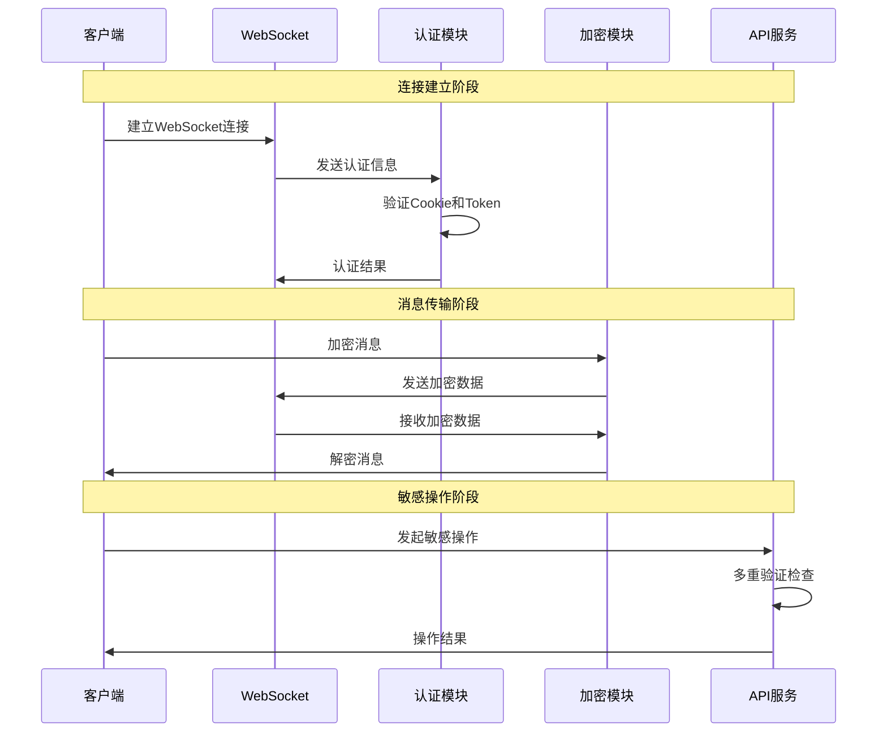

**图表来源**
- [XianyuAutoAsync.py](file://XianyuAutoAsync.py#L7623-L7800)
- [utils/ws_utils.py](file://utils/ws_utils.py#L16-L89)

### 数据流安全保护

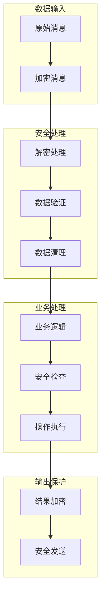

**图表来源**
- [utils/xianyu_utils.py](file://utils/xianyu_utils.py#L327-L371)

## 异常处理与安全策略

### 异常分类与处理

系统对不同类型的安全异常实施差异化处理策略：

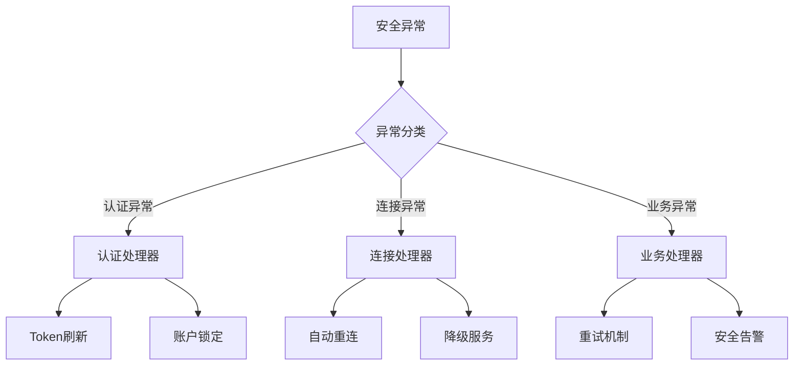

**图表来源**
- [XianyuAutoAsync.py](file://XianyuAutoAsync.py#L7729-L7775)

### 安全策略配置

| 策略类型 | 配置参数 | 默认值 | 说明 |
|----------|----------|--------|------|
| 连接失败阈值 | `max_connection_failures` | 5次 | 连接失败最大次数 |
| 重试间隔 | `reconnect_delay` | 5秒 | 重连延迟时间 |
| Token刷新间隔 | `token_refresh_interval` | 72000秒 | Token刷新周期 |
| 消息过期时间 | `message_expire_time` | 300000毫秒 | 消息有效期 |

**节来源**
- [config.py](file://config.py#L95-L100)
- [XianyuAutoAsync.py](file://XianyuAutoAsync.py#L13-L14)

### 安全监控告警

系统实现了多层次的安全监控告警机制：

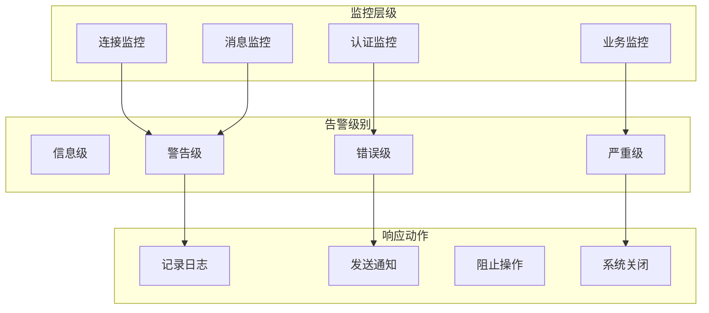

**图表来源**
- [XianyuAutoAsync.py](file://XianyuAutoAsync.py#L195-L216)

## 总结

本系统的安全通信机制通过以下核心特性确保通信安全：

1. **端到端加密**：所有WebSocket消息均经过AES加密处理，确保数据传输机密性
2. **动态身份验证**：基于账号特定的密钥和设备标识，防止会话劫持
3. **智能Token管理**：自动化的Token刷新机制，维持长期连接的有效性
4. **全面连接监控**：实时监控连接状态，及时发现和处理异常情况
5. **多重安全检查**：敏感操作前的多重验证，防止恶意操作

这套安全通信机制为系统提供了强大的安全保障，确保在复杂的网络环境中仍能维持安全、稳定的通信连接。通过持续的监控和自动化的安全策略，系统能够在面对各种安全威胁时保持高可靠性和安全性。