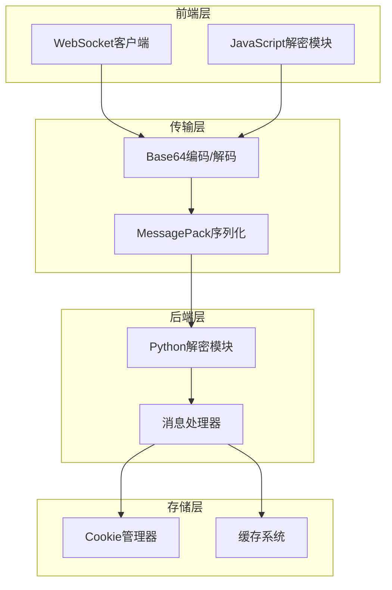
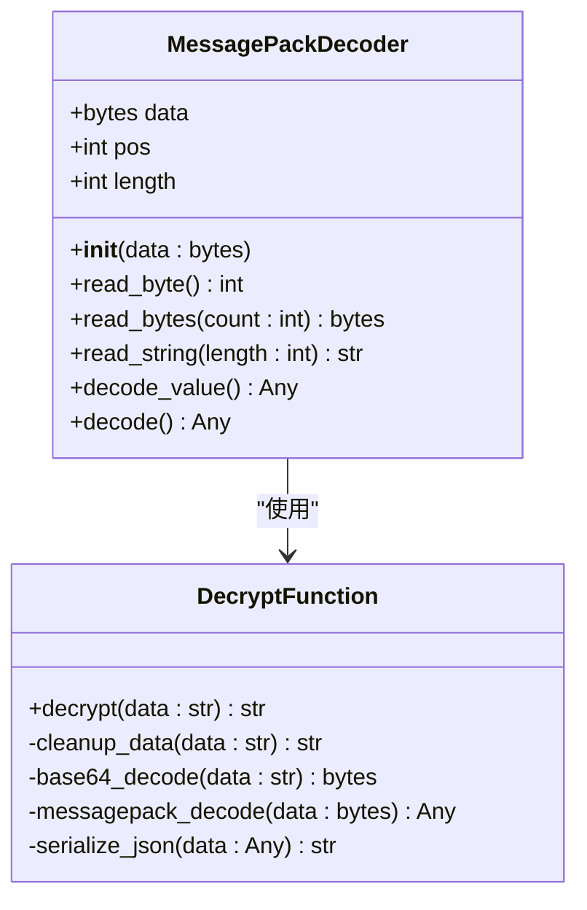
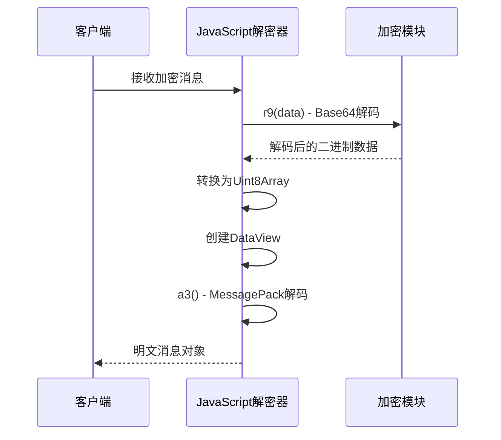
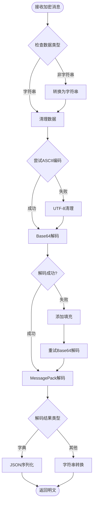
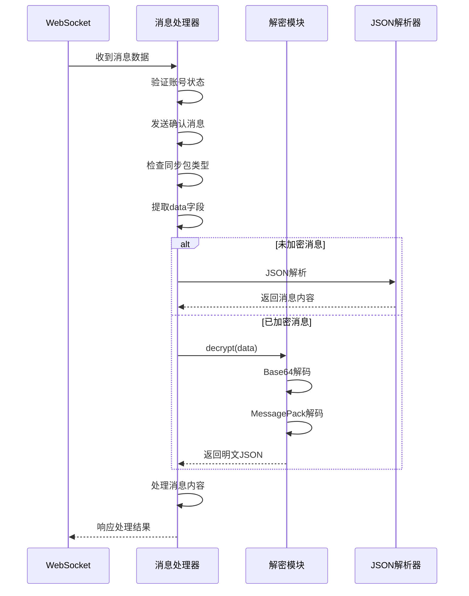
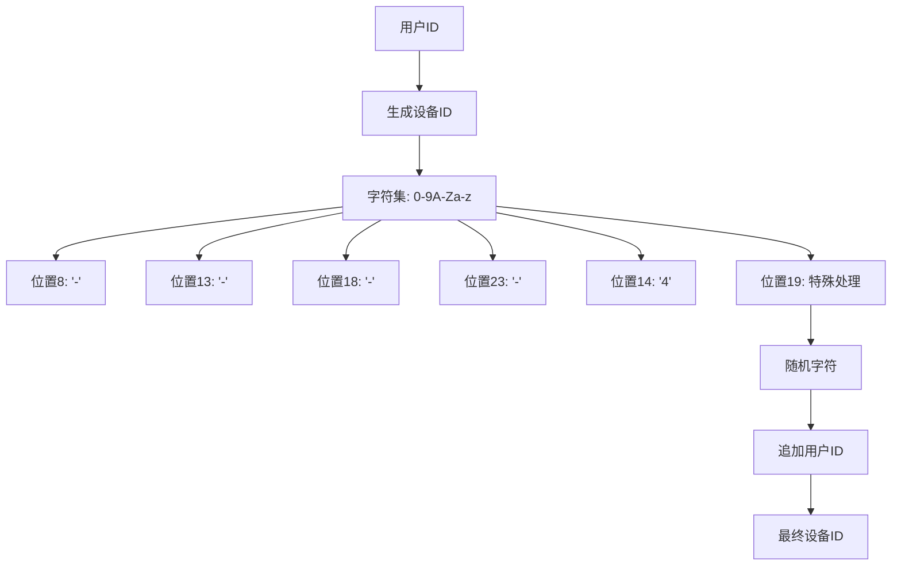
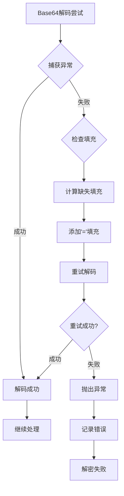
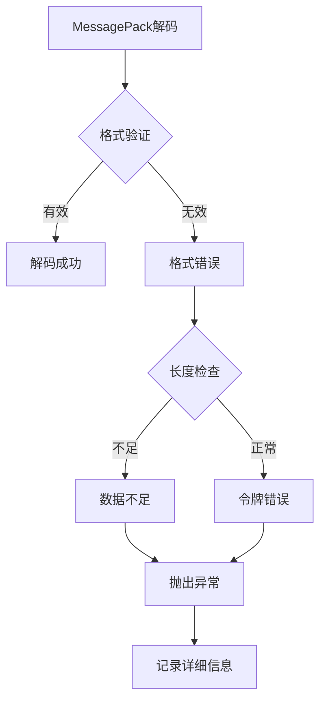
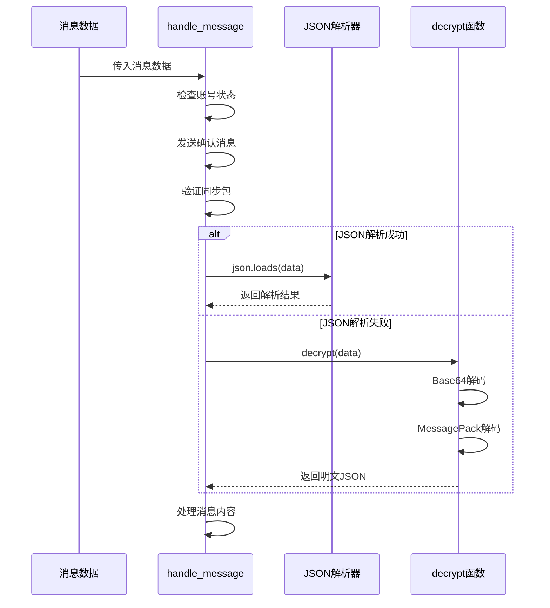
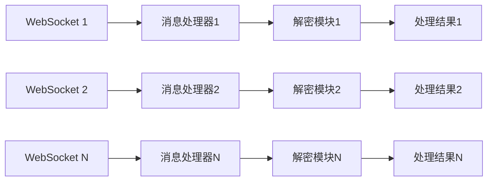

# 消息加密解密机制详细文档

<cite>
**本文档中引用的文件**
- [utils/xianyu_utils.py](file://utils/xianyu_utils.py)
- [static/xianyu_js_version_2.js](file://static/xianyu_js_version_2.js)
- [XianyuAutoAsync.py](file://XianyuAutoAsync.py)
- [utils/message_utils.py](file://utils/message_utils.py)
- [utils/ws_utils.py](file://utils/ws_utils.py)
</cite>

## 目录
1. [简介](#简介)
2. [系统架构概览](#系统架构概览)
3. [核心加密解密组件](#核心加密解密组件)
4. [详细流程分析](#详细流程分析)
5. [密钥生成机制](#密钥生成机制)
6. [异常处理机制](#异常处理机制)
7. [实际应用示例](#实际应用示例)
8. [性能考虑](#性能考虑)
9. [故障排除指南](#故障排除指南)
10. [总结](#总结)

## 简介

本文档详细分析了闲鱼自动回复系统中的消息加密解密机制，重点关注WebSocket通信中的安全传输。该系统采用多层加密策略，包括Base64编码、MessagePack序列化以及自定义的解密算法，确保消息在传输过程中的安全性。

## 系统架构概览

系统采用分层架构设计，包含以下主要组件：



**图表来源**
- [utils/ws_utils.py](file://utils/ws_utils.py#L1-L89)
- [static/xianyu_js_version_2.js](file://static/xianyu_js_version_2.js#L1-L568)

## 核心加密解密组件

### Python解密模块

Python解密模块位于`utils/xianyu_utils.py`中，提供了完整的解密功能：



**图表来源**
- [utils/xianyu_utils.py](file://utils/xianyu_utils.py#L121-L374)

### JavaScript解密模块

前端JavaScript模块提供了实时解密功能：



**图表来源**
- [static/xianyu_js_version_2.js](file://static/xianyu_js_version_2.js#L512-L568)

**章节来源**
- [utils/xianyu_utils.py](file://utils/xianyu_utils.py#L121-L374)
- [static/xianyu_js_version_2.js](file://static/xianyu_js_version_2.js#L512-L568)

## 详细流程分析

### 完整解密流程

消息解密遵循严格的步骤顺序：



**图表来源**
- [utils/xianyu_utils.py](file://utils/xianyu_utils.py#L328-L373)

### WebSocket消息处理流程

系统通过`handle_message`函数处理接收到的消息：



**图表来源**
- [XianyuAutoAsync.py](file://XianyuAutoAsync.py#L7173-L7250)

**章节来源**
- [XianyuAutoAsync.py](file://XianyuAutoAsync.py#L7173-L7250)
- [utils/xianyu_utils.py](file://utils/xianyu_utils.py#L328-L373)

## 密钥生成机制

### 设备ID生成

系统使用独特的设备ID生成算法，结合用户ID创建唯一标识：



**图表来源**
- [utils/xianyu_utils.py](file://utils/xianyu_utils.py#L85-L107)

### 账号特定密钥

虽然代码中没有显式的AES密钥生成，但系统通过以下方式确保消息隔离：

1. **设备ID绑定**: 每个账号关联唯一的设备ID
2. **用户ID区分**: 消息中包含明确的用户标识
3. **会话隔离**: 不同账号的消息不会相互干扰

**章节来源**
- [utils/xianyu_utils.py](file://utils/xianyu_utils.py#L85-L107)

## 异常处理机制

### Base64解码异常处理

系统实现了多层次的Base64解码恢复策略：



**图表来源**
- [utils/xianyu_utils.py](file://utils/xianyu_utils.py#L346-L353)

### MessagePack解码异常处理

MessagePack解码器提供了详细的错误信息：



**图表来源**
- [utils/xianyu_utils.py](file://utils/xianyu_utils.py#L129-L308)

### 错误恢复策略

系统采用以下恢复策略：

1. **优雅降级**: 当解密失败时，尝试JSON解析
2. **数据清理**: 自动处理非ASCII字符
3. **异常包装**: 提供详细的错误信息
4. **日志记录**: 记录所有解密失败的情况

**章节来源**
- [utils/xianyu_utils.py](file://utils/xianyu_utils.py#L346-L353)
- [utils/xianyu_utils.py](file://utils/xianyu_utils.py#L129-L308)

## 实际应用示例

### 前端解密示例

JavaScript解密函数的实际调用：

```javascript
// 示例消息解密
const encryptedMessage = "hAGzNDc5ODMzODkwOTZAZ29vZmlzaAIBA4KrcmVkUmVtaW5kZXKy562J5b6F5Lmw5a625LuY5qy+sHJlZFJlbWluZGVyU3R5bGWhMQTPAAABlbMlNng=";
const decrypted = decrypt(encryptedMessage);
console.log(decrypted); // 输出明文消息
```

### 后端解密示例

Python解密函数的使用：

```python
# 示例消息解密
from utils.xianyu_utils import decrypt

encrypted_data = "ggGLAYEBsjMxNDk2MzcwNjNAZ29vZmlzaAKzNDc5ODMzODkwOTZAZ29vZmlzaAOxMzQxNjU2NTI3NDU0Mi5QTk0EAAXPAAABlbKji20GggFlA4UBoAK6W+aIkeW3suaLjeS4i++8jOW+heS7mOasvl0DoAQaBdoEKnsiY29udGVudFR5cGUiOjI2LCJkeENhcmQiOnsiaXRlbSI6eyJtYWluIjp7ImNsaWNrUGFyYW0iOnsiYXJnMSI6Ik1zZ0NhcmQiLCJhcmdzIjp7InNvdXJjZSI6ImltIiwidGFza19pZCI6IjNleFFKSE9UbVBVMSIsIm1zZ19pZCI6ImNjOGJjMmRmN2M5MzRkZjA4NmUwNTY3Y2I2OWYxNTczIn19LCJleENvbnRlbnQiOnsiYmdDb2xvciI6IiNGRkZGRkYiLCJidXR0b24iOnsiYmdDb2xvciI6IiNGRkU2MEYiLCJib3JkZXJDb2xvciI6IiNGRkU2MEYiLCJjbGlja1BhcmFtIjp7ImFyZzEiOiJNc2dDYXJkQWN0aW9uIiwiYXJncyI6eyJzb3VyY2UiOiJpbSIsInRhc2tfaWQiOiIzZXhRSkhPVG1QVTEiLCJtc2dfaWQiOiJjYzhiYzJkZjdjOTM0ZGYwODZlMDU2N2NiNjlmMTU3MyJ9fSwiZm9udENvbG9yIjoiIzMzMzMzMyIsInRhcmdldFVybCI6ImZsZWFtYXJrZXQ6Ly9hZGp1c3RfcHJpY2U/Zmx1dHRlcj10cnVlJmJpek9yZGVySWQ9MjUwMzY4ODEyNjM1NjYzNjM3MCIsInRleHQiOiLkv67mlLnku7fmoLwifSwiZGVzYyI6Iuivt+WPjOaWueayn+mAmuWPiuaXtuehruiupOS7t+agvCIsImRlc2NDb2xvciI6IiNBM0EzQTMiLCJ0aXRsZSI6IuaIkeW3suaLjeS4i++8jOW+heS7mOasviIsInVwZ3JhZGUiOnsidGFyZ2V0VXJsIjoiaHR0cHM6Ly9oNS5tLmdvb2Zpc2guY29tL2FwcC9pZGxlRmlzaC1GMmUvZm0tZG93bmxhb2QvaG9tZS5odG1sP25vUmVkcmllY3Q9dHJ1ZSZjYW5CYWNrPXRydWUmY2hlY2tWZXJzaW9uPXRydWUiLCJ2ZXJzaW9uIjoiNy43LjkwIn19LCJ0YXJnZXRVcmwiOiJmbGVhbWFya2V0Oi8vb3JkZXJfZGV0YWlsP2lkPTI1MDM2ODgxMjYzNTY2MzYzNzAmcm9sZT1zZWxsZXIifX0sInRlbXBsYXRlIjp7Im5hbWUiOiJpZGxlZmlzaF9tZXNzYWdlX3RyYWRlX2NoYXRfY2FyZCIsInVybCI6Imh0dHBzOi8vZGluYW1pY3guYWxpYmFiYXVzZXJjb250ZW50LmNvbS9wdWIvaWRsZWZpc2hfbWVzc2FnZV90cmFkZV9jaGF0X2NhcmQvMTY2NzIyMjA1Mjc2Ny9pZGxlZmlzaF9tZXNzYWdlX3RyYWRlX2NoYXRfY2FyZC56aXAiLCJ2ZXJzaW9uIjoiMTY2NzIyMjA1Mjc2NyJ9fX0HAQgBCQAK3gAQpmJpelRhZ9oAe3sic291cmNlSWQiOiJDMkM6M2V4UUpIT1RtUFUxIiwidGFza05hbWUiOiLlt7Lmi43kuItf5pyq5LuY5qy+X+WNluWutiIsIm1hdGVyaWFsSWQiOiIzZXhRSkhPVG1QVTEiLCJ0YXNrSWQiOiIzZXhRSkhPVG1QVTEifbFjbG9zZVB1c2hSZWNlaXZlcqVmYWxzZbFjbG9zZVVucmVhZE51bWJlcqVmYWxzZaxkZXRhaWxOb3RpY2W6W+aIkeW3suaLjeS4i++8jOW+heS7mOasvl2nZXh0SnNvbtoBr3sibXNnQXJncyI6eyJ0YXNrX2lkIjoiM2V4UUpIT1RtUFUxIiwic291cmNlIjoiaW0iLCJtc2dfaWQiOiJjYzhiYzJkZjdjOTM0ZGYwODZlMDU2N2NiNjlmMTU3MyJ9LCJxdWlja1JlcGx5IjoiMSIsIm1zZ0FyZzEiOiJNc2dDYXJkIiwidXBkYXRlS2V5IjoiNDc5ODMzODkwOTY6MjUwMzY4ODEyNjM1NjYzNjM3MDoxX25vdF9wYXlfc2VsbGVyIiwibWVzc2FnZUlkIjoiY2M4YmMyZGY3YzkzNGRmMDg2ZTA1NjdjYjY5ZjE1NzMiLCJtdWx0aUNoYW5uZWwiOnsiaHVhd2VpIjoiRVhQUkVTUyIsInhpYW9taSI6IjEwODAwMCIsIm9wcG8iOiJFWFBSRVNTIiwiaG9ub3IiOiJOT1JNQUwiLCJhZ29vIjoicHJvZHVjdCIsInZpdm8iOiJPUkRFUiJ9LCJjb250ZW50VHlwZSI6IjI2IiwiY29ycmVsYXRpb25Hcm91cElkIjoiM2V4UUpIT1RtUFUxX0ZGcjRHT1NuOE9RbyJ9qHJlY2VpdmVyrTIyMDI2NDA5MTgwNzmrcmVkUmVtaW5kZXKy562J5b6F5Lmw5a625LuY5qy+sHJlZFJlbWluZGVyU3R5bGWhMa9yZW1pbmRlckNvbnRlbnS6W+aIkeW3suaLjeS4i++8jOW+heS7mOasvl2ucmVtaW5kZXJOb3RpY2W75Lmw5a625bey5ouN5LiL77yM5b6F5LuY5qy+rXJlbWluZGVyVGl0bGW75Lmw5a625bey5ouN5LiL77yM5b6F5LuY5qy+q3JlbWluZGVyVXJs2gCaZmxlYW1hcmtldDovL21lc3NhZ2VfY2hhdD9pdGVtSWQ9OTAwMDUyNjQ0Mjc3JnBlZXJVc2VySWQ9MzE0OTYzNzA2MyZwZWVyVXNlck5pY2s955S3KioqeSZzaWQ9NDc5ODMzODkwOTYmbWVzc2FnZUlkPWNjOGJjMmRmN2M5MzRkZjA4NmUwNTY3Y2I2OWYxNTczJmFkdj1ub6xzZW5kZXJVc2VySWSqMzE0OTYzNzA2M65zZW5kZXJVc2VyVHlwZaEwq3Nlc3Npb25UeXBloTGqdXBkYXRlSGVhZKR0cnVlDAEDgahuZWVkUHVzaKR0cnVl"
decrypted_message = decrypt(encrypted_data)
print(decrypted_message)
```

### 解密调用流程

在`handle_message`函数中的具体调用过程：



**图表来源**
- [XianyuAutoAsync.py](file://XianyuAutoAsync.py#L7239-L7245)

**章节来源**
- [static/xianyu_js_version_2.js](file://static/xianyu_js_version_2.js#L566-L568)
- [utils/xianyu_utils.py](file://utils/xianyu_utils.py#L378-L379)
- [XianyuAutoAsync.py](file://XianyuAutoAsync.py#L7239-L7245)

## 性能考虑

### 解码性能优化

1. **缓存机制**: MessagePack解码器使用位置跟踪减少重复计算
2. **流式处理**: 支持大消息的分块处理
3. **内存管理**: 及时释放解码过程中的临时对象

### 并发处理

系统支持多个账号同时处理消息：



**图表来源**
- [utils/ws_utils.py](file://utils/ws_utils.py#L82-L88)

## 故障排除指南

### 常见问题及解决方案

| 问题类型 | 症状 | 可能原因 | 解决方案 |
|---------|------|----------|----------|
| Base64解码失败 | UnicodeDecodeError | 非标准Base64字符 | 自动添加填充字符 |
| MessagePack格式错误 | Unexpected end of data | 数据截断或损坏 | 检查网络连接质量 |
| JSON序列化失败 | TypeError | 包含不可序列化的对象 | 使用自定义序列化器 |
| 设备ID生成异常 | 格式错误 | 用户ID格式不正确 | 验证用户ID格式 |

### 调试技巧

1. **启用详细日志**: 在解密过程中记录中间状态
2. **数据验证**: 检查输入数据的完整性和格式
3. **异常捕获**: 捕获并分析所有解密异常

**章节来源**
- [utils/xianyu_utils.py](file://utils/xianyu_utils.py#L346-L353)
- [utils/xianyu_utils.py](file://utils/xianyu_utils.py#L129-L308)

## 总结

闲鱼自动回复系统的消息加密解密机制采用了多层次的安全策略：

1. **多层保护**: Base64编码 + MessagePack序列化 + 自定义解密逻辑
2. **容错能力**: 完善的异常处理和恢复机制
3. **性能优化**: 流式处理和缓存策略
4. **安全性**: 账号隔离和设备ID绑定

该系统确保了消息在传输过程中的安全性和可靠性，为闲鱼平台的自动化回复功能提供了坚实的技术基础。通过前后端协同工作，实现了高效、安全的消息处理流程。