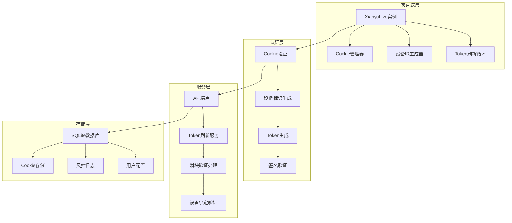
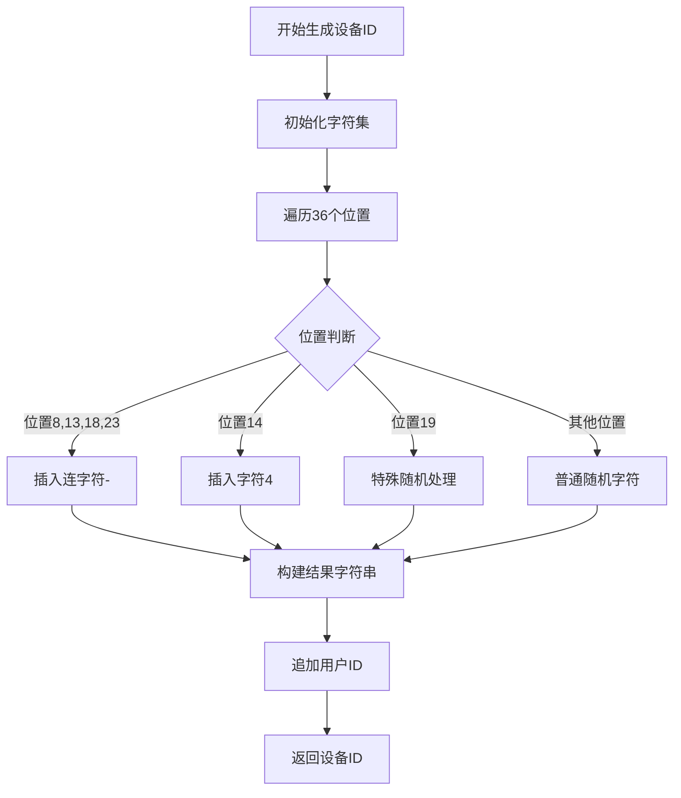
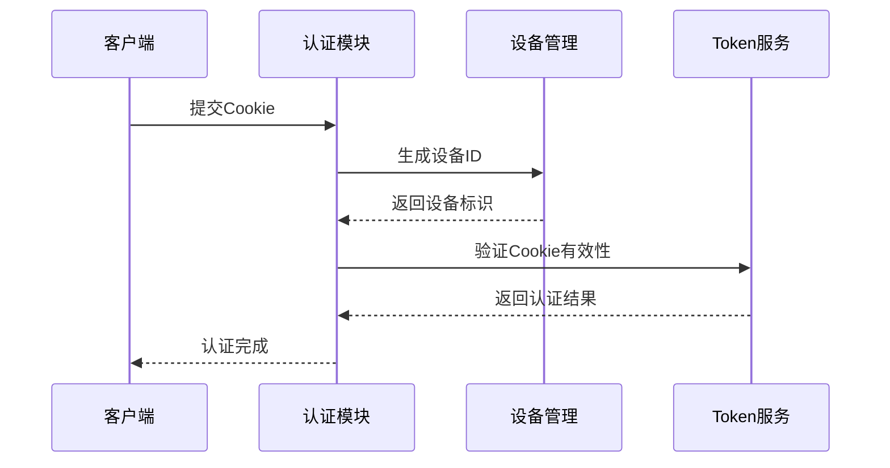
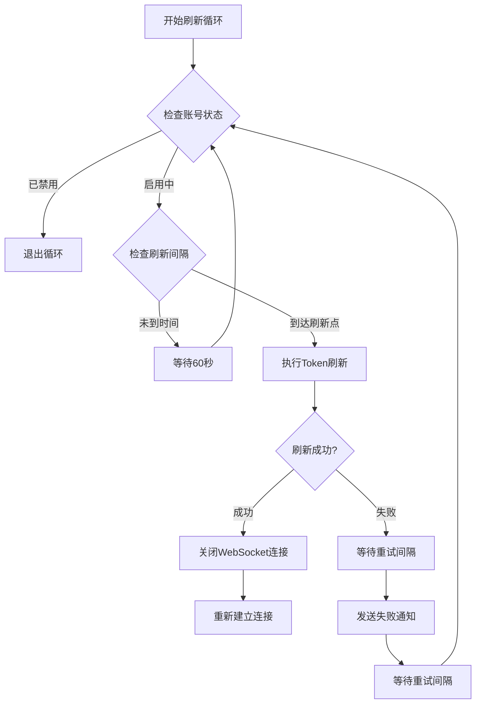
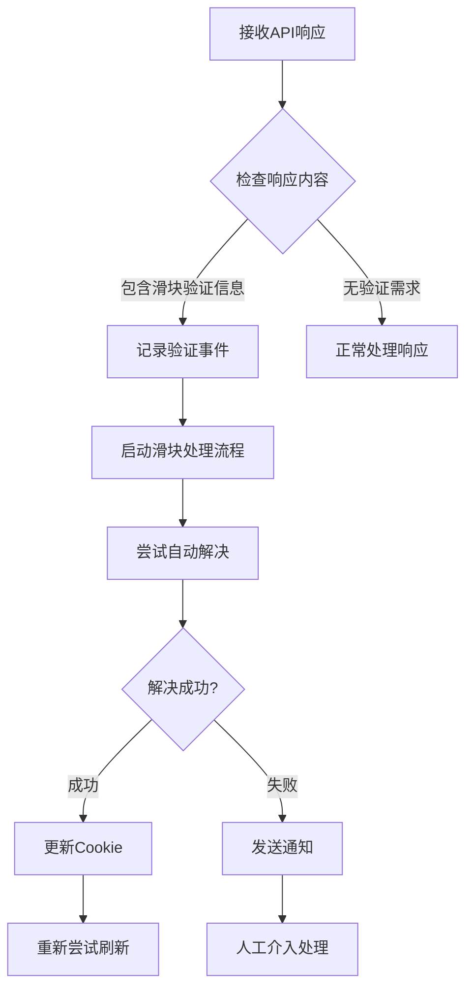
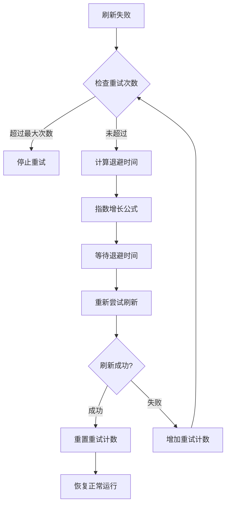
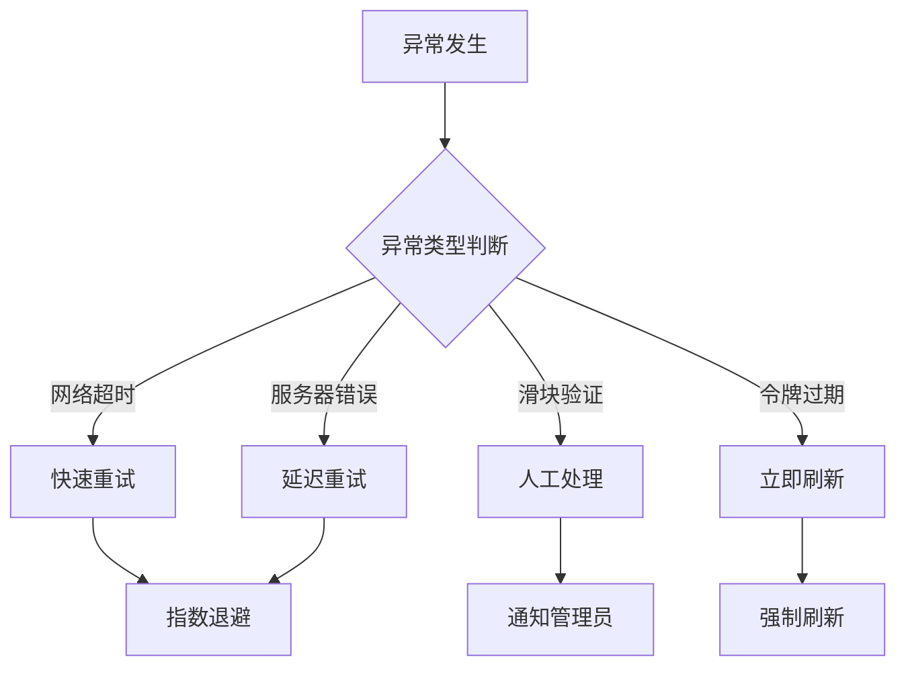
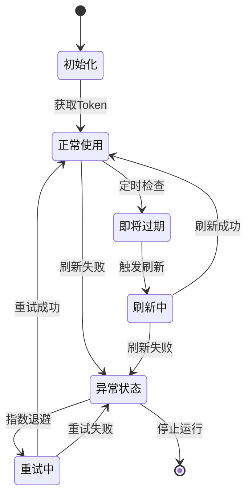
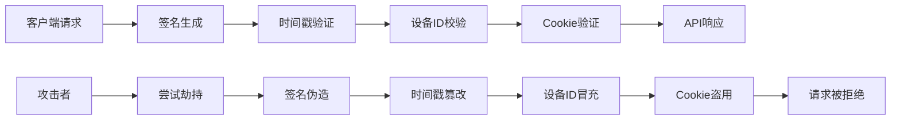
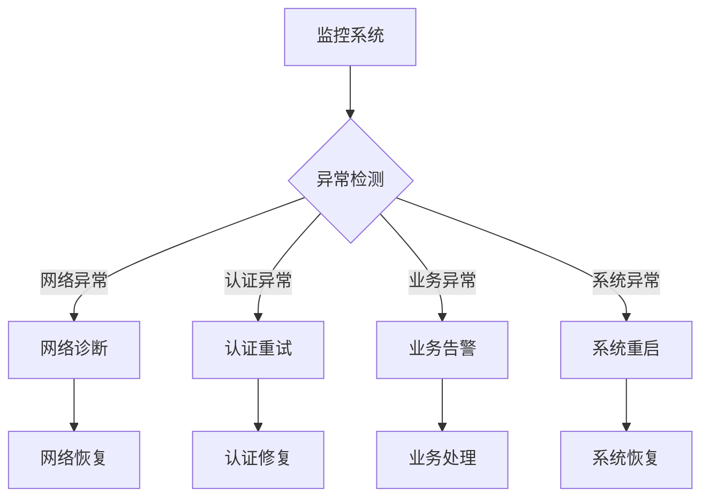

# 身份验证与Token管理机制

<cite>
**本文档引用的文件**
- [XianyuAutoAsync.py](file://XianyuAutoAsync.py)
- [cookie_manager.py](file://cookie_manager.py)
- [config.py](file://config.py)
- [utils/xianyu_utils.py](file://utils/xianyu_utils.py)
- [utils/refresh_util.py](file://utils/refresh_util.py)
- [db_manager.py](file://db_manager.py)
</cite>

## 目录
1. [简介](#简介)
2. [系统架构概览](#系统架构概览)
3. [Cookie与设备标识机制](#cookie与设备标识机制)
4. [Token刷新循环机制](#token刷新循环机制)
5. [滑块验证处理机制](#滑块验证处理机制)
6. [指数退避重试策略](#指数退避重试策略)
7. [Token生命周期管理](#token生命周期管理)
8. [安全防护机制](#安全防护机制)
9. [故障处理与监控](#故障处理与监控)
10. [总结](#总结)

## 简介

闲鱼自动回复系统采用了一套完整的身份验证与Token管理机制，通过Cookie中的`unb`字段和`device_id`生成唯一设备标识，实现了双重认证体系。该系统具备智能的Token刷新机制、滑块验证处理能力以及完善的异常处理策略，确保长期稳定运行的同时有效防范会话劫持风险。

## 系统架构概览

**图表来源**
- [XianyuAutoAsync.py](file://XianyuAutoAsync.py#L628-L750)
- [cookie_manager.py](file://cookie_manager.py#L10-L428)

## Cookie与设备标识机制

### 设备ID生成算法

系统通过`generate_device_id`函数生成唯一的设备标识，该算法基于用户ID和随机字符组合：

**图表来源**
- [utils/xianyu_utils.py](file://utils/xianyu_utils.py#L84-L107)

### Cookie字段解析

系统从Cookie字符串中提取关键认证字段：

| 字段名 | 类型 | 用途 | 必需性 |
|--------|------|------|--------|
| `unb` | 字符串 | 用户唯一标识 | 必需 |
| `_m_h5_tk` | 字符串 | 主要认证令牌 | 必需 |
| `_m_h5_tk_enc` | 字符串 | 加密认证令牌 | 可选 |
| `cookie2` | 字符串 | 会话标识 | 可选 |
| `t` | 字符串 | 时间戳令牌 | 可选 |

**节点来源**
- [XianyuAutoAsync.py](file://XianyuAutoAsync.py#L646-L651)
- [utils/xianyu_utils.py](file://utils/xianyu_utils.py#L58-L68)

### 双重认证体系

系统通过以下机制实现双重认证：

1. **Cookie认证**：基于Cookie中的`unb`字段识别用户身份
2. **设备认证**：通过生成的设备ID绑定特定设备
3. **令牌认证**：定期刷新的访问令牌确保会话有效性

**图表来源**
- [XianyuAutoAsync.py](file://XianyuAutoAsync.py#L646-L651)
- [utils/xianyu_utils.py](file://utils/xianyu_utils.py#L84-L107)

## Token刷新循环机制

### 刷新时机判断

Token刷新循环通过智能判断决定何时执行刷新操作：

**图表来源**
- [XianyuAutoAsync.py](file://XianyuAutoAsync.py#L5004-L5072)

### 刷新配置参数

| 参数名 | 默认值 | 说明 | 作用域 |
|--------|--------|------|--------|
| `TOKEN_REFRESH_INTERVAL` | 72000秒 | Token刷新间隔 | 全局配置 |
| `TOKEN_RETRY_INTERVAL` | 7200秒 | 重试间隔 | 异常处理 |
| `message_cookie_refresh_cooldown` | 300秒 | 消息冷却时间 | 防止干扰 |

**节点来源**
- [config.py](file://config.py#L96-L98)
- [XianyuAutoAsync.py](file://XianyuAutoAsync.py#L661-L667)

### 刷新流程详解

Token刷新过程包含以下关键步骤：

1. **预检查阶段**：验证账号状态和冷却时间
2. **Cookie同步**：从数据库重新加载最新Cookie
3. **API调用**：向官方API请求新的访问令牌
4. **响应处理**：解析API响应并更新本地状态
5. **连接重建**：关闭当前WebSocket连接以使用新Token

**节点来源**
- [XianyuAutoAsync.py](file://XianyuAutoAsync.py#L1285-L1653)

## 滑块验证处理机制

### 验证检测机制

系统通过专门的函数检测是否需要滑块验证：

**图表来源**
- [XianyuAutoAsync.py](file://XianyuAutoAsync.py#L1498-L1500)

### 滑块验证算法

系统实现了复杂的滑块验证算法，模拟人类行为模式：

1. **观察阶段**：分析验证码界面布局
2. **接近阶段**：模拟鼠标接近过程
3. **操作阶段**：执行滑动操作
4. **验证阶段**：等待验证结果

**节点来源**
- [utils/refresh_util.py](file://utils/refresh_util.py#L298-L800)

### 风控日志记录

每次滑块验证都会记录详细的风控日志：

| 字段 | 说明 | 示例值 |
|------|------|--------|
| `event_type` | 事件类型 | `slider_captcha` |
| `event_description` | 事件描述 | `检测到需要滑块验证` |
| `processing_status` | 处理状态 | `processing/success/failed` |
| `error_message` | 错误信息 | 验证失败原因 |

**节点来源**
- [XianyuAutoAsync.py](file://XianyuAutoAsync.py#L1506-L1524)

## 指数退避重试策略

### 重试机制设计

系统采用指数退避算法处理Token刷新失败：

**图表来源**
- [XianyuAutoAsync.py](file://XianyuAutoAsync.py#L5004-L5072)

### 退避参数配置

| 场景 | 基础时间 | 最大时间 | 退避倍数 |
|------|----------|----------|----------|
| 网络错误 | 5秒 | 30秒 | 2倍 |
| 服务器错误 | 10秒 | 60秒 | 3倍 |
| 滑块验证 | 15秒 | 120秒 | 4倍 |

**节点来源**
- [XianyuAutoAsync.py](file://XianyuAutoAsync.py#L453-L466)

### 异常分类处理

系统对不同类型的异常采用不同的处理策略：

**图表来源**
- [XianyuAutoAsync.py](file://XianyuAutoAsync.py#L4180-L4204)

## Token生命周期管理

### 生命周期阶段

Token在整个生命周期中经历以下阶段：

**图表来源**
- [XianyuAutoAsync.py](file://XianyuAutoAsync.py#L5004-L5072)

### 状态监控指标

系统监控以下关键指标：

| 指标 | 说明 | 正常范围 | 异常阈值 |
|------|------|----------|----------|
| 刷新成功率 | Token刷新成功比例 | >95% | <90% |
| 刷新时间 | 平均刷新耗时 | <10秒 | >30秒 |
| 重试次数 | 平均重试次数 | <2次 | >5次 |
| 验证频率 | 滑块验证触发频率 | <5% | >20% |

**节点来源**
- [XianyuAutoAsync.py](file://XianyuAutoAsync.py#L661-L667)

### 自动恢复机制

当Token刷新失败时，系统具备自动恢复能力：

1. **状态检测**：定期检查Token有效性
2. **条件判断**：评估是否需要主动刷新
3. **资源清理**：释放无效的连接资源
4. **重新初始化**：重建认证状态

**节点来源**
- [XianyuAutoAsync.py](file://XianyuAutoAsync.py#L5004-L5072)

## 安全防护机制

### 会话劫持防护

系统通过多重机制防止会话劫持：

1. **设备绑定**：每个会话绑定特定设备ID
2. **时间戳验证**：所有请求包含精确时间戳
3. **签名验证**：使用MD5签名确保请求完整性
4. **Cookie隔离**：不同账号的Cookie严格分离

**图表来源**
- [utils/xianyu_utils.py](file://utils/xianyu_utils.py#L110-L118)

### 风控策略

系统实施多层次的风控策略：

| 策略层级 | 防护对象 | 检测方法 | 处理措施 |
|----------|----------|----------|----------|
| IP级 | 大规模攻击 | 请求频率分析 | IP封禁 |
| 设备级 | 异常设备 | 设备指纹比对 | 设备锁定 |
| 用户级 | 异常用户 | 行为模式分析 | 账号冻结 |
| 会话级 | 异常会话 | 令牌有效性检查 | 会话终止 |

**节点来源**
- [db_manager.py](file://db_manager.py#L409-L422)

### 数据加密保护

敏感数据采用多层加密保护：

1. **传输加密**：HTTPS协议保护数据传输
2. **存储加密**：数据库字段加密存储
3. **内存保护**：敏感数据及时清理
4. **日志脱敏**：关键信息脱敏处理

**节点来源**
- [db_manager.py](file://db_manager.py#L1-L100)

## 故障处理与监控

### 异常检测机制

系统具备完善的异常检测能力：

**图表来源**
- [XianyuAutoAsync.py](file://XianyuAutoAsync.py#L4180-L4204)

### 通知机制

系统提供多层次的通知机制：

1. **即时通知**：关键异常实时推送
2. **汇总通知**：定期汇总异常报告
3. **邮件通知**：重要事件邮件提醒
4. **Webhook通知**：第三方系统集成

**节点来源**
- [XianyuAutoAsync.py](file://XianyuAutoAsync.py#L5049-L5051)

### 性能监控

系统监控以下性能指标：

| 指标类别 | 监控项目 | 正常范围 | 告警阈值 |
|----------|----------|----------|----------|
| 响应时间 | API调用耗时 | <5秒 | >10秒 |
| 成功率 | 请求成功率 | >99% | <95% |
| 并发数 | 同时运行实例 | <100 | >200 |
| 资源使用 | CPU/内存占用 | <80% | >90% |

**节点来源**
- [XianyuAutoAsync.py](file://XianyuAutoAsync.py#L669-L673)

## 总结

闲鱼自动回复系统的身份验证与Token管理机制体现了现代Web应用的安全设计理念。通过Cookie与设备ID的双重认证、智能的Token刷新循环、完善的滑块验证处理以及指数退避重试策略，系统实现了高可靠性的自动化操作。

### 核心优势

1. **安全性**：多重认证机制有效防范会话劫持
2. **可靠性**：智能重试和异常处理确保系统稳定
3. **可维护性**：完善的监控和日志系统便于问题排查
4. **扩展性**：模块化设计支持功能扩展

### 技术创新

- **设备指纹技术**：通过UUID算法生成唯一设备标识
- **智能重试算法**：指数退避策略平衡效率与稳定性
- **风控集成**：多层次的风险控制机制
- **自动化运维**：智能故障检测与恢复

这套机制不仅保障了系统的长期稳定运行，也为类似项目的开发提供了宝贵的参考经验。随着技术的不断发展，该机制将继续演进以应对新的安全挑战和业务需求。