# 消息解析与分发机制

<cite>
**本文档中引用的文件**
- [XianyuAutoAsync.py](file://XianyuAutoAsync.py)
- [utils/ws_utils.py](file://utils/ws_utils.py)
- [utils/xianyu_utils.py](file://utils/xianyu_utils.py)
- [order_status_handler.py](file://order_status_handler.py)
- [static/xianyu_js_version_2.js](file://static/xianyu_js_version_2.js)
- [utils/slider_patch.py](file://utils/slider_patch.py)
</cite>

## 目录
1. [概述](#概述)
2. [系统架构](#系统架构)
3. [消息接收与解密](#消息接收与解密)
4. [消息类型识别与路由](#消息类型识别与路由)
5. [消息去重与防抖机制](#消息去重与防抖机制)
6. [并发控制与性能优化](#并发控制与性能优化)
7. [消息上下文管理](#消息上下文管理)
8. [消息处理时序图](#消息处理时序图)
9. [故障排除指南](#故障排除指南)
10. [总结](#总结)

## 概述

闲鱼自动回复系统采用了一套完整的消息解析与分发机制，负责处理来自WebSocket连接的各种消息类型。该机制能够从原始字节流中提取、解密、识别消息类型，并将其分发到相应的处理器进行业务逻辑处理。系统具备完善的消息去重、防抖、并发控制和上下文管理功能，确保消息处理的准确性和系统的稳定性。

## 系统架构

消息解析与分发机制采用模块化设计，主要由以下核心组件构成：

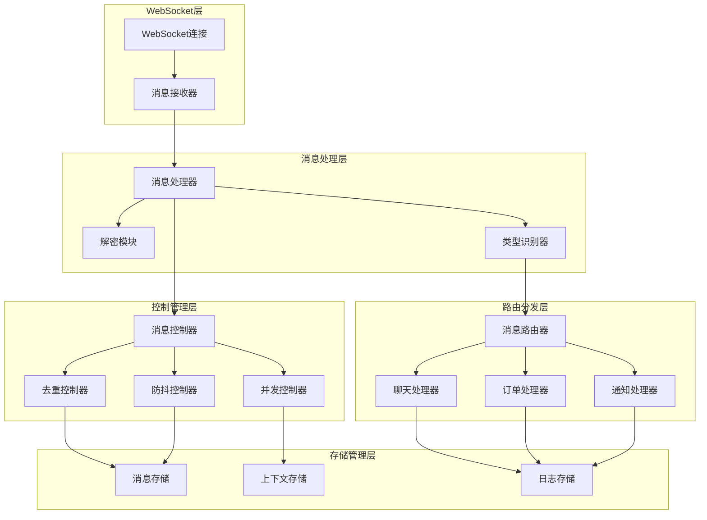

**图表来源**
- [XianyuAutoAsync.py](file://XianyuAutoAsync.py#L711-L7775)
- [utils/ws_utils.py](file://utils/ws_utils.py#L1-L89)

## 消息接收与解密

### WebSocket消息接收

系统通过WebSocket连接接收实时消息，消息接收过程包含以下关键步骤：

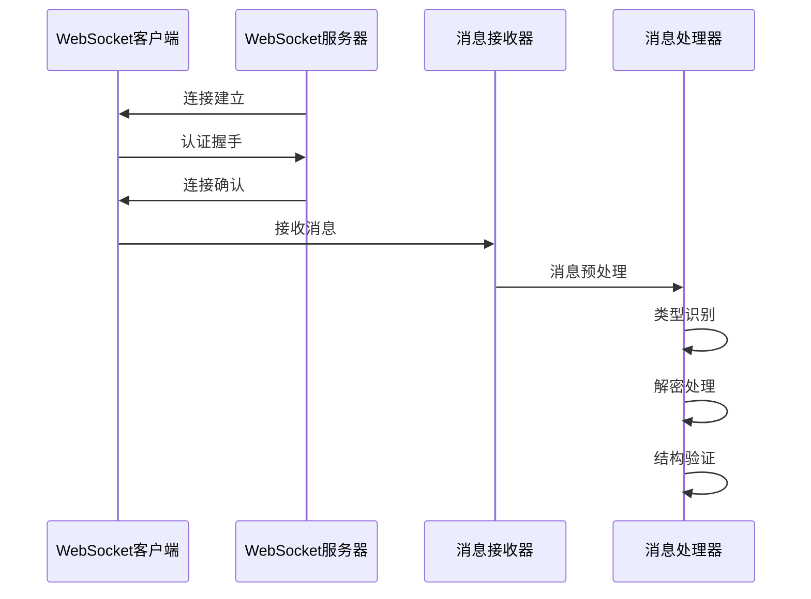

**图表来源**
- [XianyuAutoAsync.py](file://XianyuAutoAsync.py#L7705-L7721)
- [utils/ws_utils.py](file://utils/ws_utils.py#L53-L89)

### 消息解密机制

系统实现了多层次的解密机制，确保能够处理不同格式的加密消息：

#### JavaScript解密函数
系统包含专门的JavaScript解密函数，用于处理前端传递的加密消息：

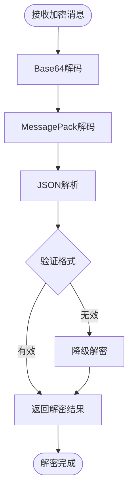

**图表来源**
- [static/xianyu_js_version_2.js](file://static/xianyu_js_version_2.js#L512-L568)

#### Python解密实现
系统还提供了Python版本的解密实现，支持多种解密场景：

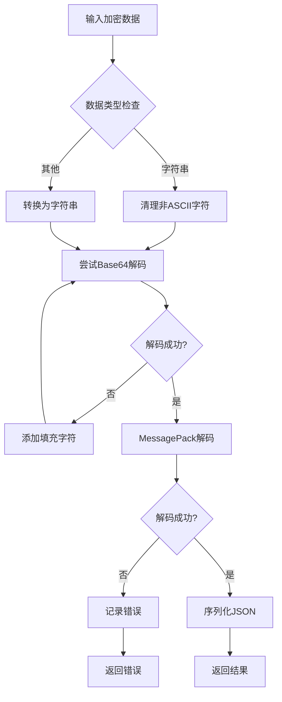

**图表来源**
- [utils/xianyu_utils.py](file://utils/xianyu_utils.py#L328-L379)

**章节来源**
- [XianyuAutoAsync.py](file://XianyuAutoAsync.py#L7173-L7260)
- [utils/xianyu_utils.py](file://utils/xianyu_utils.py#L328-L379)

## 消息类型识别与路由

### 消息类型判断

系统通过多个判断方法识别不同类型的消息：

#### 同步包消息识别
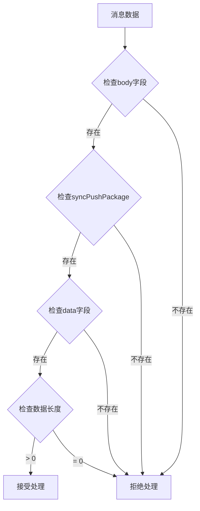

**图表来源**
- [XianyuAutoAsync.py](file://XianyuAutoAsync.py#L6784-L6795)

#### 聊天消息识别
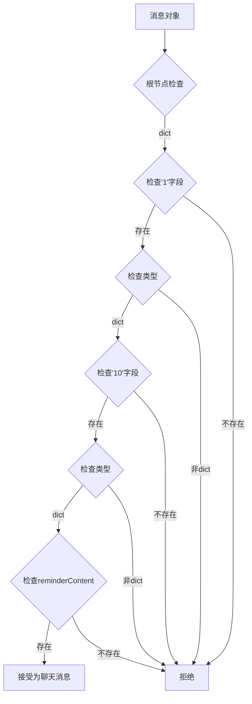

**图表来源**
- [XianyuAutoAsync.py](file://XianyuAutoAsync.py#L6770-L6782)

### 消息路由机制

系统根据消息类型将消息分发到相应的处理器：

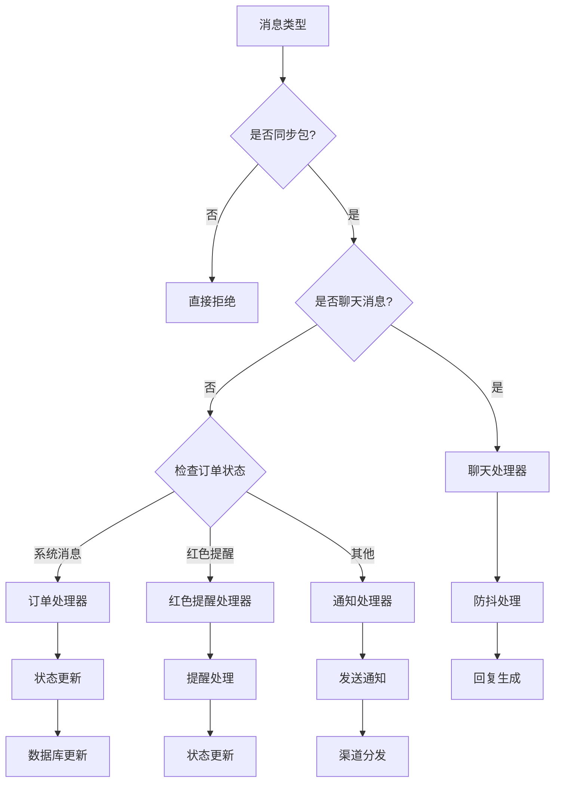

**图表来源**
- [XianyuAutoAsync.py](file://XianyuAutoAsync.py#L7395-L7400)
- [XianyuAutoAsync.py](file://XianyuAutoAsync.py#L7456-L7493)

**章节来源**
- [XianyuAutoAsync.py](file://XianyuAutoAsync.py#L6769-L6795)
- [XianyuAutoAsync.py](file://XianyuAutoAsync.py#L7395-L7400)

## 消息去重与防抖机制

### 消息去重机制

系统实现了完善的消息去重机制，防止重复处理同一消息：

#### 去重策略
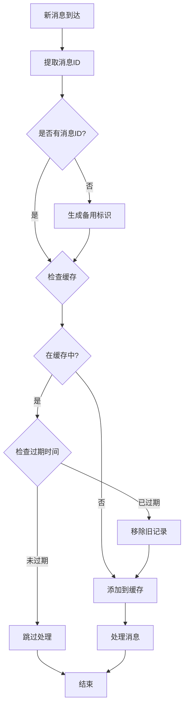

**图表来源**
- [XianyuAutoAsync.py](file://XianyuAutoAsync.py#L6955-L6994)

#### 去重配置参数
- **processed_message_ids_max_size**: 最大保存10000个消息ID
- **message_expire_time**: 消息过期时间3600秒（1小时）
- **message_debounce_delay**: 防抖延迟时间1秒

### 防抖机制

防抖机制确保在用户连续发送消息时，只处理最后一条消息：

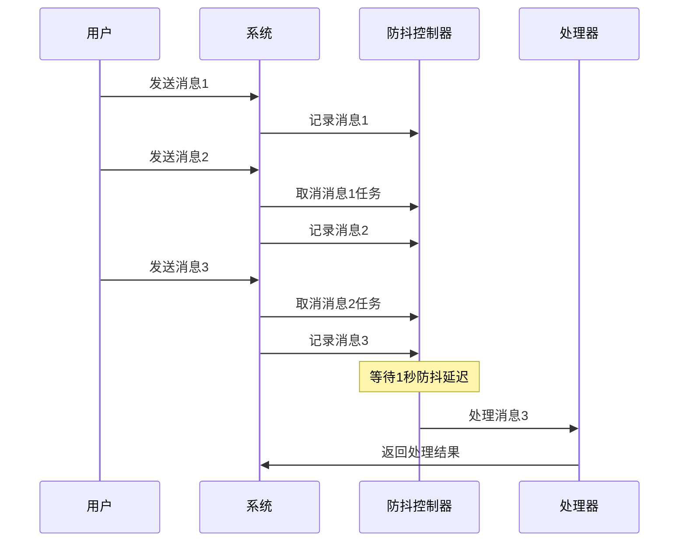

**图表来源**
- [XianyuAutoAsync.py](file://XianyuAutoAsync.py#L6922-L7067)

**章节来源**
- [XianyuAutoAsync.py](file://XianyuAutoAsync.py#L729-L740)
- [XianyuAutoAsync.py](file://XianyuAutoAsync.py#L6922-L7067)

## 并发控制与性能优化

### 并发控制机制

系统通过信号量机制控制消息处理的并发数量：

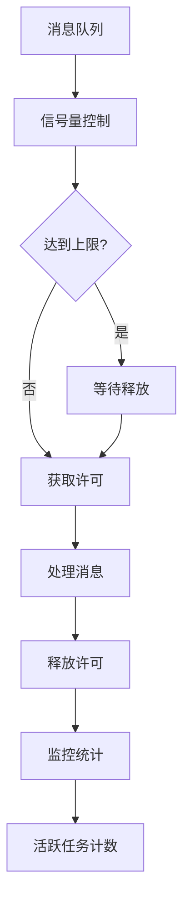

**图表来源**
- [XianyuAutoAsync.py](file://XianyuAutoAsync.py#L6865-L6875)

### 性能优化策略

#### 信号量配置
- **message_semaphore**: 最多100个并发消息处理任务
- **active_message_tasks**: 当前活跃的消息处理任务数
- **定期统计**: 每100个任务记录一次活跃任务数

#### 内存管理
- **消息ID缓存清理**: 自动清理过期的消息ID
- **待处理队列管理**: 限制待处理消息的数量
- **资源监控**: 实时监控内存使用情况

**章节来源**
- [XianyuAutoAsync.py](file://XianyuAutoAsync.py#L725-L727)
- [XianyuAutoAsync.py](file://XianyuAutoAsync.py#L6865-L6875)

## 消息上下文管理

### 对话状态维护

系统为每个chat_id维护独立的对话状态：

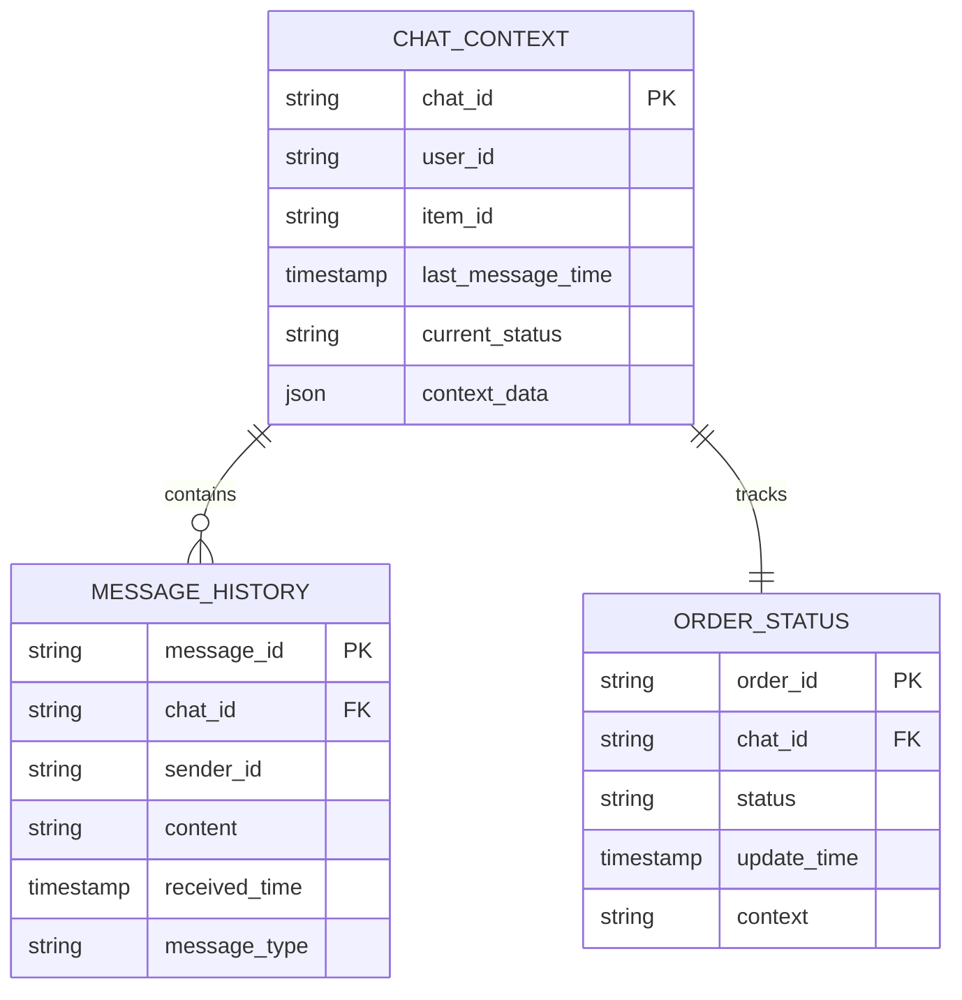

**图表来源**
- [XianyuAutoAsync.py](file://XianyuAutoAsync.py#L7402-L7440)

### 上下文信息存储

系统维护以下上下文信息：
- **聊天ID**: 唯一标识对话会话
- **用户信息**: 发送者ID和昵称
- **商品信息**: 相关商品ID和详情
- **消息历史**: 对话历史记录
- **订单状态**: 相关订单的状态信息

**章节来源**
- [XianyuAutoAsync.py](file://XianyuAutoAsync.py#L7402-L7440)
- [order_status_handler.py](file://order_status_handler.py#L950-L1037)

## 消息处理时序图

以下是完整的消息处理时序图，展示了从原始字节流到业务逻辑执行的完整流程：

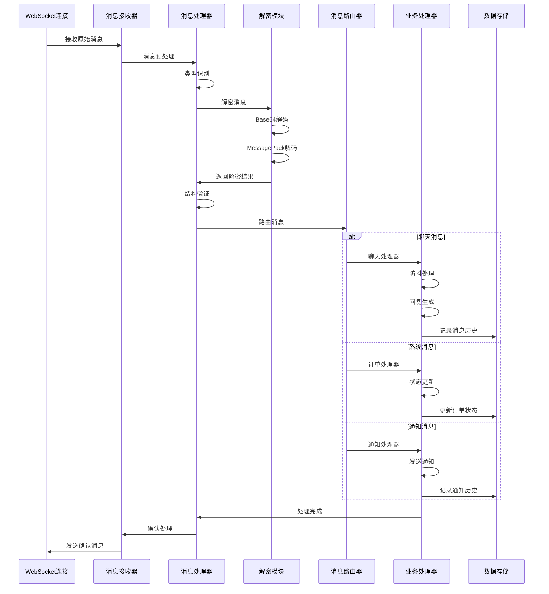

**图表来源**
- [XianyuAutoAsync.py](file://XianyuAutoAsync.py#L7173-L7718)
- [utils/ws_utils.py](file://utils/ws_utils.py#L53-L89)

## 故障排除指南

### 常见问题及解决方案

#### 消息解密失败
**症状**: 日志显示"消息解密失败"
**原因**: 加密算法不匹配或数据损坏
**解决方案**: 
1. 检查解密函数版本
2. 验证消息数据完整性
3. 更新解密密钥

#### 消息去重失效
**症状**: 同一条消息被重复处理
**原因**: 消息ID提取失败或缓存清理问题
**解决方案**:
1. 检查消息ID提取逻辑
2. 清理过期的缓存记录
3. 调整缓存大小限制

#### 防抖机制异常
**症状**: 用户连续发送消息时处理延迟过长
**原因**: 防抖任务堆积或超时
**解决方案**:
1. 检查防抖延迟配置
2. 监控防抖任务状态
3. 优化任务调度策略

#### 并发控制问题
**症状**: 系统响应缓慢或内存占用过高
**原因**: 并发任务过多或资源泄漏
**解决方案**:
1. 调整信号量大小
2. 监控活跃任务数量
3. 实施资源清理策略

**章节来源**
- [XianyuAutoAsync.py](file://XianyuAutoAsync.py#L7244-L7245)
- [XianyuAutoAsync.py](file://XianyuAutoAsync.py#L6963-L6967)

## 总结

闲鱼自动回复系统的消息解析与分发机制是一个高度复杂且精密设计的系统，具备以下核心特性：

1. **多层次解密**: 支持多种加密格式的消息解密
2. **智能消息识别**: 准确识别不同类型的业务消息
3. **完善的去重机制**: 防止重复处理和资源浪费
4. **高效的防抖控制**: 优化用户体验，减少不必要的回复
5. **严格的并发控制**: 确保系统稳定性和性能
6. **灵活的上下文管理**: 维护对话状态和业务上下文

该机制通过模块化设计和清晰的职责分离，实现了高可靠性、高性能的消息处理能力，为闲鱼平台的自动化运营提供了坚实的技术基础。系统的设计充分考虑了实际业务场景的需求，在保证功能完整性的同时，也兼顾了系统的可维护性和扩展性。