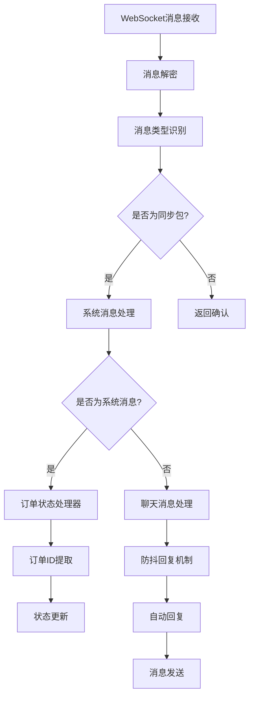
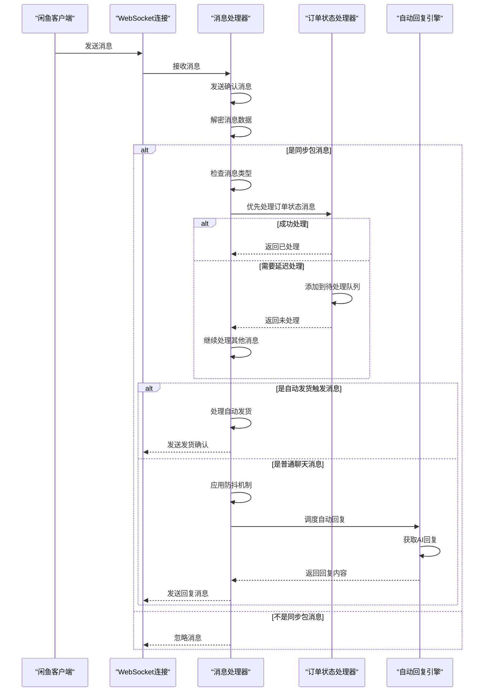

# 消息路由机制

<cite>
**本文档引用的文件**   
- [XianyuAutoAsync.py](file://XianyuAutoAsync.py)
- [order_status_handler.py](file://order_status_handler.py)
- [config.py](file://config.py)
- [global_config.yml](file://global_config.yml)
</cite>

## 目录
1. [引言](#引言)
2. [消息路由架构](#消息路由架构)
3. [核心路由机制](#核心路由机制)
4. [路由表设计与实现](#路由表设计与实现)
5. [性能特征分析](#性能特征分析)
6. [路由流程时序图](#路由流程时序图)
7. [扩展性分析](#扩展性分析)
8. [结论](#结论)

## 引言

本系统实现了复杂的消息路由机制，用于处理闲鱼平台的各种消息类型。系统根据消息内容中的特定字段（如订单状态、红色提醒等）将消息分发到相应的处理器方法。该机制不仅处理用户聊天消息，还处理系统消息、订单状态更新和通知消息等多种类型的消息。路由机制的设计考虑了消息的优先级处理、并发控制和去重机制，确保消息能够被正确、高效地处理。

## 消息路由架构

系统采用分层的消息处理架构，从消息接收开始，经过解密、类型识别、优先级处理，最终路由到相应的处理器方法。整个架构设计考虑了高并发场景下的性能和稳定性。



**图示来源**
- [XianyuAutoAsync.py](file://XianyuAutoAsync.py#L7173-L7620)

## 核心路由机制

系统的核心路由机制基于消息内容的语义分析，而不是简单的type字段匹配。通过解析消息的结构和内容，系统能够准确识别不同类型的消息并路由到相应的处理逻辑。

### 消息类型识别

系统通过多个层次的检查来识别消息类型：

1. **同步包检测**：首先检查消息是否为同步包消息
2. **系统消息检测**：识别系统生成的消息，如订单状态更新
3. **聊天消息检测**：识别用户之间的聊天消息
4. **特殊消息检测**：识别自动发货触发消息等特殊类型

```python
def is_sync_package(self, message_data):
    """判断是否为同步包消息"""
    try:
        return (
            isinstance(message_data, dict)
            and "body" in message_data
            and "syncPushPackage" in message_data["body"]
            and "data" in message_data["body"]["syncPushPackage"]
            and len(message_data["body"]["syncPushPackage"]["data"]) > 0
        )
    except Exception:
        return False

def is_chat_message(self, message):
    """判断是否为用户聊天消息"""
    try:
        return (
            isinstance(message, dict)
            and "1" in message
            and isinstance(message["1"], dict)
            and "10" in message["1"]
            and isinstance(message["1"]["10"], dict)
            and "reminderContent" in message["1"]["10"]
        )
    except Exception:
        return False
```

**代码来源**
- [XianyuAutoAsync.py](file://XianyuAutoAsync.py#L6784-L6782)

### 优先级处理

系统实现了消息处理的优先级机制，确保重要消息能够被优先处理：

1. **订单状态消息优先**：订单相关的系统消息具有最高优先级
2. **自动发货消息优先**：即使在人工接入暂停期间也要处理
3. **普通聊天消息**：按常规流程处理，受防抖机制影响

```python
# 【优先处理】使用订单状态处理器处理系统消息
if self.order_status_handler:
    try:
        handled = self.order_status_handler.handle_system_message(
            message=message,
            send_message=send_message,
            cookie_id=self.cookie_id,
            msg_time=msg_time
        )
    except Exception as e:
        logger.error(f"【{self.cookie_id}】处理系统消息失败: {self._safe_str(e)}")
        handled = False

# 【重要】检查是否为自动发货触发消息 - 即使在人工接入暂停期间也要处理
elif self._is_auto_delivery_trigger(send_message):
    logger.info(f'[{msg_time}] 【{self.cookie_id}】检测到自动发货触发消息，即使在暂停期间也继续处理: {send_message}')
    await self._handle_auto_delivery(websocket, message, send_user_name, send_user_id,
                                   item_id, chat_id, msg_time)
    return
```

**代码来源**
- [XianyuAutoAsync.py](file://XianyuAutoAsync.py#L7456-L7537)

## 路由表设计与实现

系统的路由表设计采用了基于状态机和队列的混合模式，能够处理消息顺序不确定的场景。

### 订单状态路由表

订单状态处理器维护了一个状态转换规则表，定义了合法的状态转换路径：

```python
# 状态转换规则常量
VALID_TRANSITIONS = {
    'processing': ['pending_ship', 'shipped', 'completed', 'cancelled'],
    'pending_ship': ['shipped', 'completed', 'cancelled', 'refunding'],
    'shipped': ['completed', 'cancelled', 'refunding'],
    'completed': ['cancelled', 'refunding'],
    'refunding': ['completed', 'cancelled', 'refund_cancelled'],
    'refund_cancelled': [],
    'cancelled': []
}
```

**代码来源**
- [order_status_handler.py](file://order_status_handler.py#L36-L44)

### 待处理队列机制

当系统消息先于订单ID到达时，系统使用待处理队列机制来解决消息顺序问题：

```python
def handle_system_message(self, message, send_message, cookie_id, msg_time):
    """处理系统消息"""
    # 检查是否能提取订单ID
    order_id = self.extract_order_id(message)
    
    if order_id:
        # 直接处理
        return self._process_immediate_update(order_id, send_message, cookie_id, msg_time)
    else:
        # 添加到待处理队列
        temp_order_id = f"temp_{int(time.time() * 1000)}_{uuid.uuid4().hex[:8]}"
        new_status = message_status_mapping[send_message]
        
        # 添加到待处理队列
        self._add_to_pending_updates(
            order_id=temp_order_id,
            new_status=new_status,
            cookie_id=cookie_id,
            context=f"{send_message} - {msg_time} - 等待订单ID提取"
        )
        
        # 添加到待处理的系统消息队列
        if cookie_id not in self._pending_system_messages:
            self._pending_system_messages[cookie_id] = []
        
        self._pending_system_messages[cookie_id].append({
            'message': message,
            'send_message': send_message,
            'cookie_id': cookie_id,
            'msg_time': msg_time,
            'new_status': new_status,
            'temp_order_id': temp_order_id,
        })
        
        return False
```

**代码来源**
- [order_status_handler.py](file://order_status_handler.py#L677-L705)

### 消息匹配策略

当订单ID提取后，系统使用两种策略来匹配待处理的消息：

1. **消息哈希匹配**：优先使用消息哈希进行精确匹配
2. **FIFO原则**：如果没有匹配到，则使用先进先出原则

```python
# 如果提供了消息，尝试匹配
if message:
    message_hash = hash(str(sorted(message.items()))) if isinstance(message, dict) else hash(str(message))
    # 从后往前遍历，避免pop时索引变化问题
    for i in range(len(self._pending_system_messages[cookie_id]) - 1, -1, -1):
        msg = self._pending_system_messages[cookie_id][i]
        if msg.get('message_hash') == message_hash:
            pending_msg = self._pending_system_messages[cookie_id].pop(i)
            logger.info(f"✅ 通过消息哈希匹配到待处理的系统消息: {pending_msg['send_message']}")
            break

# 如果没有匹配到，使用FIFO原则
if not pending_msg and self._pending_system_messages[cookie_id]:
    pending_msg = self._pending_system_messages[cookie_id].pop(0)
    logger.info(f"✅ 使用FIFO原则处理待处理的系统消息: {pending_msg['send_message']}")
```

**代码来源**
- [order_status_handler.py](file://order_status_handler.py#L977-L987)

## 性能特征分析

### 路由查找时间复杂度

系统的路由查找时间复杂度分析如下：

- **消息类型识别**：O(1) - 基于字典键的存在性检查
- **订单ID提取**：O(n) - 需要在消息字符串中搜索模式
- **待处理消息匹配**：O(n) - 需要遍历待处理队列

尽管待处理消息匹配的时间复杂度为O(n)，但由于队列长度通常很短（一般不超过10个），实际性能影响很小。

### 并发处理能力

系统通过多种机制确保高并发处理能力：

1. **信号量控制**：限制并发消息处理任务数量
2. **去重机制**：避免重复处理相同消息
3. **防抖机制**：减少对用户的回复频率

```python
# 消息处理并发控制（防止内存泄漏）
self.message_semaphore = asyncio.Semaphore(100)  # 最多100个并发消息处理任务
self.active_message_tasks = 0  # 当前活跃的消息处理任务数

async def _handle_message_with_semaphore(self, message_data, websocket):
    """带信号量的消息处理包装器，防止并发任务过多"""
    async with self.message_semaphore:
        self.active_message_tasks += 1
        try:
            await self.handle_message(message_data, websocket)
        finally:
            self.active_message_tasks -= 1
```

**代码来源**
- [XianyuAutoAsync.py](file://XianyuAutoAsync.py#L726-L727)

### 消息去重机制

系统实现了消息去重机制，防止重复处理相同消息：

```python
# 提取消息ID并检查是否已处理
message_id = self._extract_message_id(message_data)
# 如果没有 messageId，使用备用标识（chat_id + send_message + 时间戳）
if not message_id:
    try:
        # 尝试从消息数据中提取时间戳
        create_time = 0
        if isinstance(message_data, dict) and "1" in message_data:
            message_1 = message_data.get("1")
            if isinstance(message_1, dict):
                create_time = message_1.get("5", 0)
        # 使用组合键作为备用标识
        message_id = f"{chat_id}_{send_message}_{create_time}"
    except Exception:
        # 如果提取失败，使用当前时间戳
        message_id = f"{chat_id}_{send_message}_{int(time.time() * 1000)}"

# 检查消息是否已处理且未过期
if message_id in self.processed_message_ids:
    last_process_time = self.processed_message_ids[message_id]
    time_elapsed = current_time - last_process_time
    
    # 如果消息处理时间未超过1小时，跳过
    if time_elapsed < self.message_expire_time:
        remaining_time = int(self.message_expire_time - time_elapsed)
        logger.warning(f"【{self.cookie_id}】消息ID {message_id[:50]}... 已处理过，距离可重复回复还需 {remaining_time} 秒")
        return
```

**代码来源**
- [XianyuAutoAsync.py](file://XianyuAutoAsync.py#L6938-L6967)

## 路由流程时序图

以下是消息从接收到处理的完整时序图：



**图示来源**
- [XianyuAutoAsync.py](file://XianyuAutoAsync.py#L7173-L7620)
- [order_status_handler.py](file://order_status_handler.py#L954-L1017)

## 扩展性分析

### 新增消息类型支持

系统支持通过配置文件轻松扩展新的消息类型：

```yaml
# global_config.yml
AUTO_REPLY:
  enabled: true
  default_message: '亲爱的"{send_user_name}" 老板你好！所有宝贝都可以拍，秒发货的哈~不满意的话可以直接申请退款哈~'
  api:
    enabled: false
    url: 'http://localhost:8080/xianyu/reply'
    timeout: 10
```

**文件来源**
- [global_config.yml](file://global_config.yml)

### 自定义路由规则

系统提供了灵活的扩展点，允许自定义路由规则：

1. **订单状态映射**：可以通过修改`message_status_mapping`来添加新的状态映射
2. **状态转换规则**：可以通过修改`VALID_TRANSITIONS`来调整状态转换逻辑
3. **消息提取方法**：可以通过重写`extract_order_id`方法来支持新的订单ID提取方式

```python
def extract_order_id(self, message: dict) -> Optional[str]:
    """从消息中提取订单ID"""
    try:
        order_id = None
        
        # 方法1: 从button的targetUrl中提取orderId
        if content_json_str:
            try:
                content_data = json.loads(content_json_str)
                target_url = content_data.get('dxCard', {}).get('item', {}).get('main', {}).get('exContent', {}).get('button', {}).get('targetUrl', '')
                if target_url:
                    order_match = re.search(r'orderId=(\d+)', target_url)
                    if order_match:
                        order_id = order_match.group(1)
            except Exception as parse_e:
                logger.error(f"解析内容JSON失败: {parse_e}")
        
        # 方法2: 从dynamicOperation中的order_detail URL提取orderId
        if not order_id and content_json_str:
            try:
                content_data = json.loads(content_json_str)
                dynamic_target_url = content_data.get('dynamicOperation', {}).get('changeContent', {}).get('dxCard', {}).get('item', {}).get('main', {}).get('exContent', {}).get('button', {}).get('targetUrl', '')
                if dynamic_target_url:
                    order_match = re.search(r'order_detail\?id=(\d+)', dynamic_target_url)
                    if order_match:
                        order_id = order_match.group(1)
            except Exception as parse_e:
                logger.error(f"解析dynamicOperation JSON失败: {parse_e}")
        
        # 方法3: 在整个消息中搜索订单ID模式
        if not order_id:
            try:
                message_str = str(message)
                patterns = [
                    r'orderId[=:](\d{10,})',
                    r'order_detail\?id=(\d{10,})',
                    r'"id"\s*:\s*"?(\d{10,})"?',
                    r'bizOrderId[=:](\d{10,})',
                ]
                for pattern in patterns:
                    matches = re.findall(pattern, message_str)
                    if matches:
                        order_id = matches[0]
                        break
            except Exception as search_e:
                logger.error(f"在消息字符串中搜索订单ID失败: {search_e}")
        
        return order_id
    except Exception as e:
        logger.error(f"提取订单ID失败: {str(e)}")
        return None
```

**代码来源**
- [order_status_handler.py](file://order_status_handler.py#L81-L187)

## 结论

本系统实现了高效、可靠的消息路由机制，能够准确处理闲鱼平台的各种消息类型。通过分层的架构设计、优先级处理机制和待处理队列，系统能够应对消息顺序不确定的复杂场景。性能方面，系统通过信号量控制、去重机制和防抖机制确保了高并发下的稳定运行。扩展性方面，系统提供了灵活的配置和扩展点，便于支持新的消息类型和自定义路由规则。整体设计充分考虑了实际使用场景中的各种边界情况，确保了系统的健壮性和可靠性。