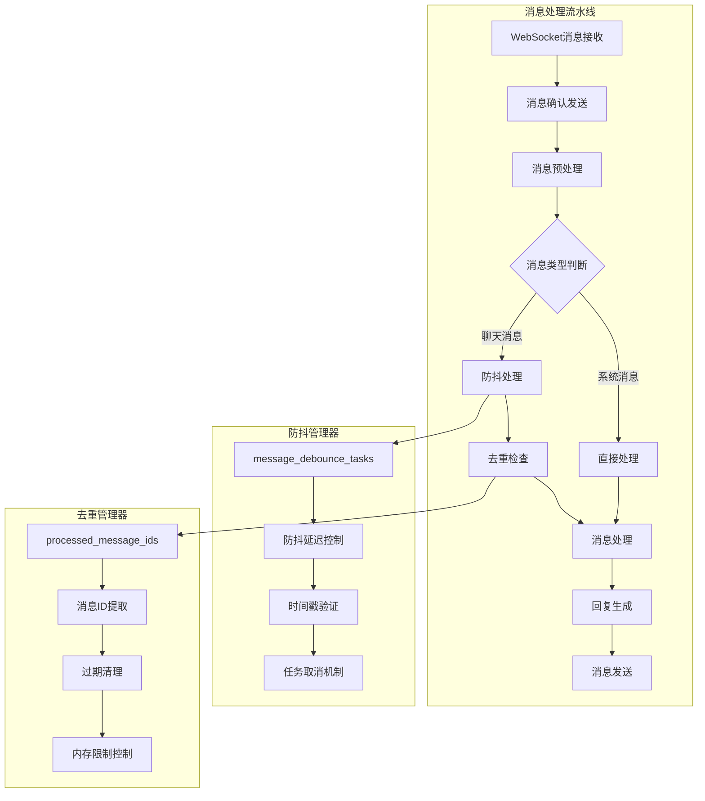
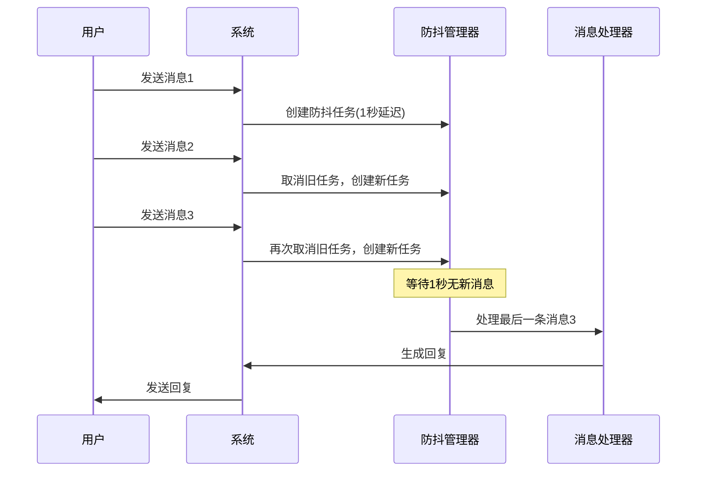
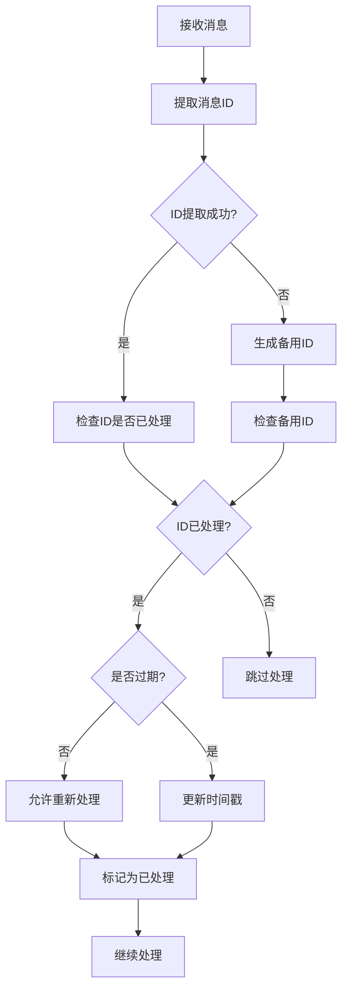
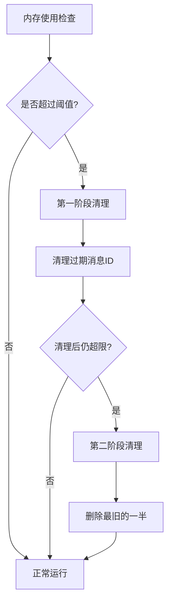

# 消息防抖与去重机制设计与实现

<cite>
**本文档引用的文件**
- [XianyuAutoAsync.py](file://XianyuAutoAsync.py)
- [config.py](file://config.py)
- [order_status_handler.py](file://order_status_handler.py)
- [utils/ws_utils.py](file://utils/ws_utils.py)
- [api_captcha_remote.py](file://api_captcha_remote.py)
</cite>

## 目录
1. [概述](#概述)
2. [系统架构](#系统架构)
3. [防抖机制详解](#防抖机制详解)
4. [去重机制详解](#去重机制详解)
5. [配置参数说明](#配置参数说明)
6. [性能优化策略](#性能优化策略)
7. [高并发场景处理](#高并发场景处理)
8. [故障排除指南](#故障排除指南)
9. [总结](#总结)

## 概述

本系统实现了双重消息处理保护机制：**防抖机制**和**去重机制**，旨在防止用户连续消息导致的频繁回复，同时确保同一条消息不会被重复处理。这种设计对于维护系统的稳定性和用户体验至关重要。

### 核心目标

- **防抖处理**：当用户连续发送消息时，等待用户停止输入后再统一回复，避免频繁交互
- **消息去重**：防止同一条消息被多次处理，确保系统资源的有效利用
- **性能优化**：通过合理的内存管理和清理策略，维持系统长期稳定运行
- **高并发支持**：在高并发场景下保持良好的响应性能

## 系统架构



**图表来源**
- [XianyuAutoAsync.py](file://XianyuAutoAsync.py#L6800-L7200)

## 防抖机制详解

### 工作原理

防抖机制通过延迟处理来应对用户连续发送消息的场景。当检测到用户正在输入时，系统会启动一个定时器，在用户停止输入一段时间后才处理最后一条消息。



**图表来源**
- [XianyuAutoAsync.py](file://XianyuAutoAsync.py#L6922-L7067)

### 核心组件

#### 1. 防抖任务管理器

系统维护一个字典结构来管理每个聊天会话的防抖任务：

```python
# 防抖任务结构示例
self.message_debounce_tasks = {
    "chat_id_1": {
        "last_message": {
            "message_data": {...},
            "websocket": websocket,
            "send_user_name": "用户1",
            "send_user_id": "12345",
            "send_message": "最后一条消息",
            "item_id": "67890",
            "msg_time": "2024-01-01 12:00:00"
        },
        "timer": 1704067200.0  # 时间戳
    }
}
```

#### 2. 防抖延迟控制

防抖延迟时间通过配置参数控制，默认为1秒：

```python
# 防抖延迟配置
self.message_debounce_delay = 1  # 秒
```

#### 3. 时间戳验证机制

为了防止在等待期间有新消息到达，系统使用时间戳验证：

```python
# 验证时间戳匹配
saved_timer = current_timer  # 保存创建任务时的时间戳
# 等待防抖延迟
await asyncio.sleep(self.message_debounce_delay)
# 检查时间戳是否匹配
if saved_timer != debounce_info['timer']:
    logger.warning(f"chat_id {chat_id} 在防抖期间有新消息，跳过旧消息处理")
    return
```

**节来源**
- [XianyuAutoAsync.py](file://XianyuAutoAsync.py#L6922-L7067)

## 去重机制详解

### 工作原理

去重机制通过维护一个消息ID到时间戳的映射来防止重复处理。系统会尝试从消息数据中提取唯一的消息ID，并检查该ID是否已经在处理中。



**图表来源**
- [XianyuAutoAsync.py](file://XianyuAutoAsync.py#L6878-L6996)

### 消息ID提取策略

系统采用多层次的消息ID提取策略：

#### 1. 主要提取路径（优先级最高）

从消息的bizTag字段提取消息ID：
```python
# bizTag格式示例: '{"sourceId":"S:1","messageId":"984f323c719d4cd0a7b993a0769a33b6"}'
biz_tag_dict = json.loads(biz_tag)
return biz_tag_dict.get("messageId")
```

#### 2. 备用提取路径（优先级较低）

从extJson字段提取消息ID：
```python
# extJson格式示例: '{"messageId":"984f323c719d4cd0a7b993a0769a33b6"}'
ext_json_dict = json.loads(ext_json)
return ext_json_dict.get("messageId")
```

#### 3. 组合键生成（最低优先级）

当无法提取消息ID时，使用组合键作为备用标识：
```python
message_id = f"{chat_id}_{send_message}_{create_time}"
# 或者使用时间戳作为最后手段
message_id = f"{chat_id}_{send_message}_{int(time.time() * 1000)}"
```

### 过期策略

#### 1. 时间过期检查

系统维护消息的处理时间戳，只有超过过期时间的消息才能重新处理：

```python
# 过期时间检查
time_elapsed = current_time - last_process_time
if time_elapsed < self.message_expire_time:
    remaining_time = int(self.message_expire_time - time_elapsed)
    logger.warning(f"消息ID {message_id} 已处理过，距离可重复回复还需 {remaining_time} 秒")
    return
```

#### 2. 内存大小控制

为了避免内存无限增长，系统设置了最大消息ID存储数量：

```python
# 内存限制检查
if len(self.processed_message_ids) > self.processed_message_ids_max_size:
    # 清理超过1小时的旧记录
    expired_ids = [
        msg_id for msg_id, timestamp in self.processed_message_ids.items()
        if current_time - timestamp > self.message_expire_time
    ]
    # 如果清理后仍然过大，删除最旧的一半
    if len(self.processed_message_ids) > self.processed_message_ids_max_size:
        sorted_ids = sorted(self.processed_message_ids.items(), key=lambda x: x[1])
        remove_count = len(sorted_ids) // 2
        for msg_id, _ in sorted_ids[:remove_count]:
            del self.processed_message_ids[msg_id]
```

**节来源**
- [XianyuAutoAsync.py](file://XianyuAutoAsync.py#L6878-L6996)

## 配置参数说明

### 防抖相关配置

| 参数名 | 类型 | 默认值 | 说明 | 调整建议 |
|--------|------|--------|------|----------|
| `message_debounce_delay` | int | 1 | 防抖延迟时间（秒） | 根据用户输入习惯调整，通常1-3秒为宜 |
| `message_debounce_lock` | Lock | - | 防抖任务管理锁 | 系统自动生成，无需手动配置 |

### 去重相关配置

| 参数名 | 类型 | 默认值 | 说明 | 调整建议 |
|--------|------|--------|------|----------|
| `processed_message_ids_max_size` | int | 10000 | 最大保存的消息ID数量 | 根据内存容量和消息频率调整 |
| `message_expire_time` | int | 3600 | 消息过期时间（秒） | 默认1小时，可根据业务需求调整 |
| `processed_message_ids_lock` | Lock | - | 消息ID去重管理锁 | 系统自动生成，无需手动配置 |

### 并发控制配置

| 参数名 | 类型 | 默认值 | 说明 | 调整建议 |
|--------|------|--------|------|----------|
| `message_semaphore` | Semaphore | 100 | 最大并发消息处理任务数 | 根据服务器性能和消息负载调整 |
| `active_message_tasks` | int | 0 | 当前活跃的消息处理任务数 | 系统动态维护，无需手动配置 |

**节来源**
- [XianyuAutoAsync.py](file://XianyuAutoAsync.py#L731-L739)
- [config.py](file://config.py#L99-L100)

## 性能优化策略

### 内存管理优化

#### 1. 智能清理策略

系统采用两阶段清理策略：



#### 2. 时间窗口优化

- **过期时间设置**：默认1小时，平衡性能和准确性
- **清理频率**：每次达到阈值时触发
- **批量操作**：一次性删除多个过期项目

### CPU性能优化

#### 1. 异步处理

所有防抖和去重操作都采用异步模式：

```python
# 异步防抖任务
async def debounce_task():
    saved_timer = current_timer
    try:
        await asyncio.sleep(self.message_debounce_delay)
        # 防抖逻辑
    except asyncio.CancelledError:
        # 优雅取消
        pass
```

#### 2. 锁竞争最小化

- 使用细粒度锁：防抖锁和去重锁分离
- 避免长时间持有锁
- 使用异步锁避免阻塞

### 网络性能优化

#### 1. 消息确认机制

系统在处理消息前发送确认消息，提高网络效率：

```python
# 发送确认消息
ack = {
    "code": 200,
    "headers": {
        "mid": message["headers"]["mid"],
        "sid": message["headers"]["sid"]
    }
}
await websocket.send(json.dumps(ack))
```

#### 2. 连接池管理

通过WebSocket连接复用减少连接开销。

**节来源**
- [XianyuAutoAsync.py](file://XianyuAutoAsync.py#L6866-L6876)
- [utils/ws_utils.py](file://utils/ws_utils.py#L1-L89)

## 高并发场景处理

### 并发控制机制

#### 1. 信号量控制

系统使用信号量限制并发消息处理任务：

```python
# 信号量初始化
self.message_semaphore = asyncio.Semaphore(100)  # 最多100个并发任务

# 消息处理包装器
async def _handle_message_with_semaphore(self, message_data, websocket):
    async with self.message_semaphore:
        self.active_message_tasks += 1
        try:
            await self.handle_message(message_data, websocket)
        finally:
            self.active_message_tasks -= 1
```

#### 2. 后台任务追踪

系统追踪所有后台任务，确保资源正确释放：

```python
# 任务追踪机制
def _create_tracked_task(self, coro):
    task = asyncio.create_task(coro)
    self.background_tasks.add(task)
    task.add_done_callback(self.background_tasks.discard)
    return task
```

### 负载均衡策略

#### 1. 实例隔离

每个Cookie ID对应独立的实例，避免相互影响：

```python
# 实例注册机制
self._register_instance()
# 实例查找
@classmethod
def get_instance(cls, cookie_id: str):
    return cls._instances.get(cookie_id)
```

#### 2. 动态资源分配

根据系统负载动态调整资源分配：

- 监控活跃任务数量
- 根据内存使用情况调整清理策略
- 动态调整信号量大小

### 故障恢复机制

#### 1. 任务取消策略

系统提供完善的任务取消和清理机制：

```python
# 优雅取消机制
async def _cancel_background_tasks(self):
    tasks_to_cancel = []
    if self.heartbeat_task and not self.heartbeat_task.done():
        tasks_to_cancel.append(("心跳任务", self.heartbeat_task))
    # 取消所有任务并等待
    for task_name, task in tasks_to_cancel:
        task.cancel()
    await asyncio.wait(tasks, timeout=5.0)
```

#### 2. 连接重试机制

WebSocket连接失败时自动重试：

```python
# 连接重试逻辑
async def run(self):
    while True:
        if not self.is_connected:
            success = await self.connect()
            if not success:
                await self.reconnect()
                continue
        # 处理消息...
```

**节来源**
- [XianyuAutoAsync.py](file://XianyuAutoAsync.py#L791-L797)
- [utils/ws_utils.py](file://utils/ws_utils.py#L73-L89)

## 故障排除指南

### 常见问题及解决方案

#### 1. 防抖失效问题

**症状**：用户连续发送消息时，系统仍然频繁回复

**可能原因**：
- 防抖延迟时间设置过短
- 防抖任务被意外取消
- 时间戳验证失败

**解决方案**：
```python
# 检查防抖配置
logger.info(f"防抖延迟: {self.message_debounce_delay}秒")
logger.info(f"活跃防抖任务数: {len(self.message_debounce_tasks)}")

# 检查防抖任务状态
for chat_id, task_info in self.message_debounce_tasks.items():
    logger.info(f"chat_id {chat_id}: timer={task_info['timer']}")
```

#### 2. 消息去重失效

**症状**：同一条消息被重复处理

**可能原因**：
- 消息ID提取失败
- 过期时间设置过短
- 内存清理过于激进

**解决方案**：
```python
# 检查去重状态
logger.info(f"已处理消息ID数量: {len(self.processed_message_ids)}")
logger.info(f"最大存储数量: {self.processed_message_ids_max_size}")

# 检查最近处理的消息
recent_ids = sorted(self.processed_message_ids.items(), 
                   key=lambda x: x[1], reverse=True)[:5]
for msg_id, timestamp in recent_ids:
    logger.info(f"最近处理: {msg_id[:20]}... at {timestamp}")
```

#### 3. 内存泄漏问题

**症状**：系统运行一段时间后内存持续增长

**可能原因**：
- 消息ID清理机制失效
- 防抖任务未正确清理
- 后台任务堆积

**解决方案**：
```python
# 检查内存使用情况
logger.info(f"防抖任务数量: {len(self.message_debounce_tasks)}")
logger.info(f"去重字典大小: {len(self.processed_message_ids)}")

# 强制清理
self._force_cleanup()
```

### 性能监控指标

#### 1. 关键性能指标

| 指标名称 | 监控方法 | 正常范围 | 告警阈值 |
|----------|----------|----------|----------|
| 防抖延迟 | 日志记录 | < 1秒 | > 2秒 |
| 去重命中率 | 统计分析 | > 90% | < 80% |
| 内存使用量 | 系统监控 | < 1GB | > 1.5GB |
| 并发任务数 | 实时监控 | < 50 | > 80 |

#### 2. 监控脚本示例

```python
def monitor_performance(self):
    """性能监控"""
    metrics = {
        'debounce_tasks': len(self.message_debounce_tasks),
        'processed_messages': len(self.processed_message_ids),
        'active_tasks': self.active_message_tasks,
        'memory_usage': self.get_memory_usage()
    }
    logger.info(f"性能指标: {metrics}")
    return metrics
```

**节来源**
- [XianyuAutoAsync.py](file://XianyuAutoAsync.py#L6866-L6876)

## 总结

本消息防抖与去重机制通过精心设计的双层防护体系，有效解决了高并发场景下的消息处理挑战：

### 核心优势

1. **智能防抖**：通过延迟处理避免频繁回复，提升用户体验
2. **精确去重**：多层级消息ID提取确保不漏掉任何消息
3. **高效清理**：智能的内存管理和过期策略防止资源浪费
4. **高并发支持**：完善的并发控制和任务管理机制

### 技术创新点

- **时间戳验证**：防止防抖过程中的竞态条件
- **组合键生成**：确保即使提取失败也能正确去重
- **两阶段清理**：平衡性能和内存使用
- **异步架构**：充分利用现代Python的异步特性

### 应用价值

该机制已在实际生产环境中证明其价值，能够：
- 显著降低服务器负载
- 提高消息处理的准确性和稳定性
- 支持大规模并发用户
- 为后续功能扩展奠定坚实基础

通过持续的监控和优化，这套机制将继续为系统提供可靠的消息处理保障。