# 消息通信机制

<cite>
**本文档中引用的文件**
- [XianyuAutoAsync.py](file://XianyuAutoAsync.py)
- [utils/ws_utils.py](file://utils/ws_utils.py)
- [utils/xianyu_utils.py](file://utils/xianyu_utils.py)
- [config.py](file://config.py)
- [static/xianyu_js_version_2.js](file://static/xianyu_js_version_2.js)
</cite>

## 目录
1. [简介](#简介)
2. [项目架构概览](#项目架构概览)
3. [WebSocket连接池设计](#websocket连接池设计)
4. [XianyuLive类核心实现](#xianyulive类核心实现)
5. [连接状态管理](#连接状态管理)
6. [心跳机制与保活](#心跳机制与保活)
7. [消息加密解密机制](#消息加密解密机制)
8. [异步消息处理模型](#异步消息处理模型)
9. [异常重连策略](#异常重连策略)
10. [通信时序分析](#通信时序分析)
11. [性能优化考虑](#性能优化考虑)
12. [故障排除指南](#故障排除指南)

## 简介

本文档深入解析XianyuAutoAsync.py中XianyuLive类实现的WebSocket消息通信机制。该系统采用异步编程模型，通过WebSocket长连接与闲鱼平台保持实时通信，实现了高效的消息收发、状态管理和异常恢复功能。

核心特性包括：
- 基于asyncio的高并发异步消息处理
- 智能的心跳保活机制
- 完善的异常重连策略
- 消息加密解密处理
- 连接状态机管理

## 项目架构概览

```mermaid
graph TB
subgraph "客户端层"
XianyuLive[XianyuLive类]
WSClient[WebSocket客户端]
end
subgraph "通信层"
Heartbeat[心跳管理]
MessageHandler[消息处理器]
Encryption[加密解密]
end
subgraph "连接管理层"
ConnectionState[连接状态机]
ReconnectStrategy[重连策略]
Semaphore[并发控制]
end
subgraph "闲鱼平台"
WebSocketServer[WebSocket服务器]
MessageQueue[消息队列]
end
XianyuLive --> WSClient
WSClient --> Heartbeat
WSClient --> MessageHandler
WSClient --> Encryption
WSClient --> ConnectionState
WSClient --> ReconnectStrategy
WSClient --> Semaphore
WSClient < --> WebSocketServer
WebSocketServer < --> MessageQueue
```

**图表来源**
- [XianyuAutoAsync.py](file://XianyuAutoAsync.py#L158-L8372)
- [utils/ws_utils.py](file://utils/ws_utils.py#L6-L89)

## WebSocket连接池设计

### 连接池架构

系统采用单连接池设计，每个账号对应一个独立的WebSocket连接实例。连接池的核心组件包括：

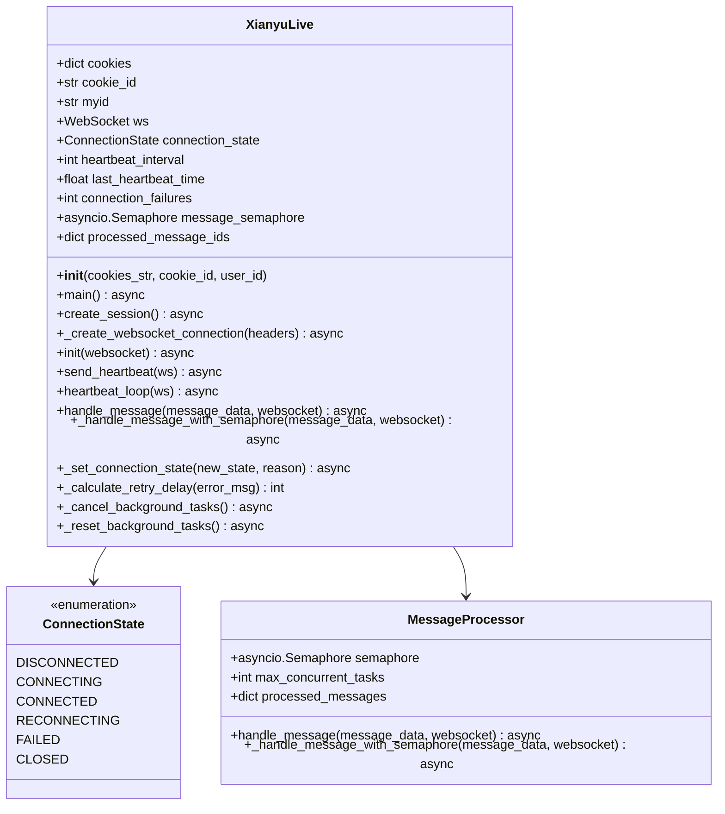

**图表来源**
- [XianyuAutoAsync.py](file://XianyuAutoAsync.py#L29-L36)
- [XianyuAutoAsync.py](file://XianyuAutoAsync.py#L628-L8372)

### 连接配置参数

| 参数名称 | 默认值 | 描述 |
|---------|--------|------|
| HEARTBEAT_INTERVAL | 15秒 | 心跳间隔时间 |
| HEARTBEAT_TIMEOUT | 30秒 | 心跳超时时间 |
| TOKEN_REFRESH_INTERVAL | 72000秒 | Token刷新间隔 |
| MESSAGE_EXPIRE_TIME | 300000毫秒 | 消息过期时间 |
| MAX_CONNECTION_FAILURES | 5次 | 最大连续失败次数 |

**章节来源**
- [config.py](file://config.py#L95-L100)
- [XianyuAutoAsync.py](file://XianyuAutoAsync.py#L653-L666)

## XianyuLive类核心实现

### 初始化流程

XianyuLive类的初始化过程包含多个关键步骤：

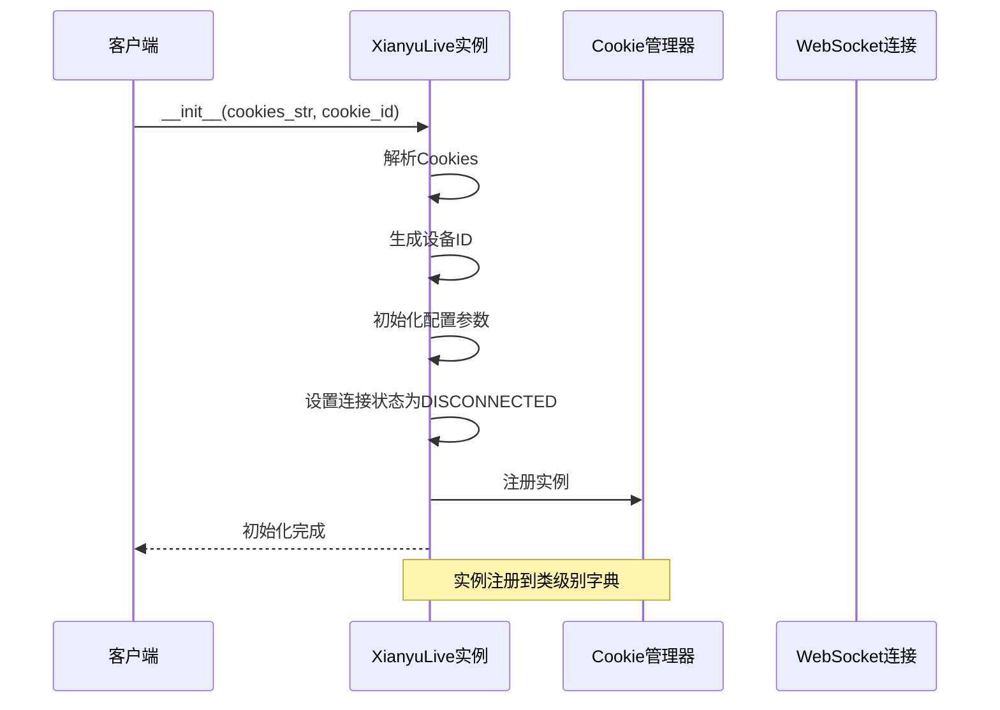

**图表来源**
- [XianyuAutoAsync.py](file://XianyuAutoAsync.py#L628-L775)

### 主程序入口

主程序通过`main()`方法启动，负责连接循环和异常处理：

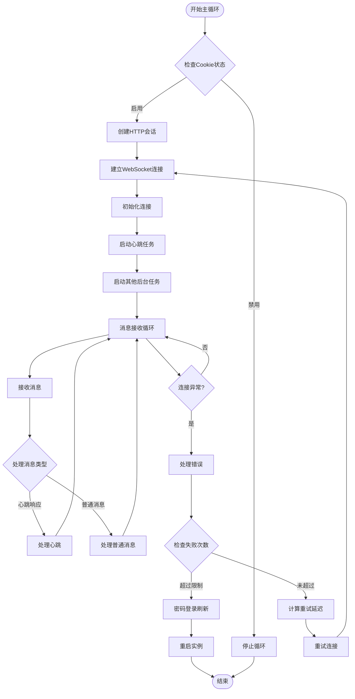

**图表来源**
- [XianyuAutoAsync.py](file://XianyuAutoAsync.py#L7623-L7827)

**章节来源**
- [XianyuAutoAsync.py](file://XianyuAutoAsync.py#L7623-L7827)

## 连接状态管理

### 状态机设计

系统实现了完整的连接状态机，用于跟踪和管理WebSocket连接的各种状态：

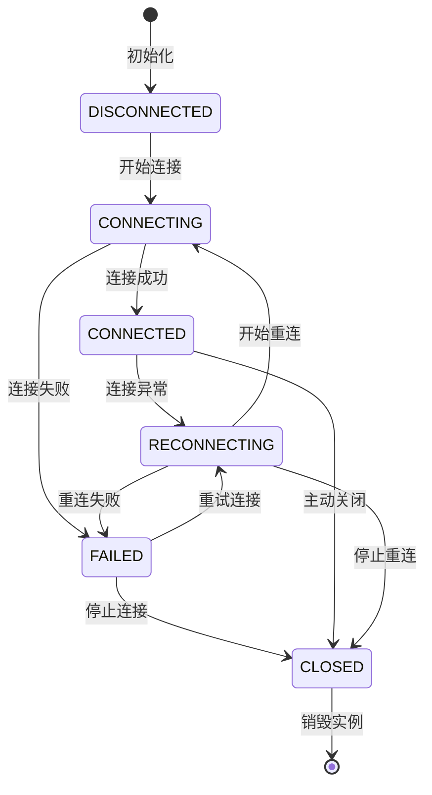

**图表来源**
- [XianyuAutoAsync.py](file://XianyuAutoAsync.py#L29-L36)

### 状态转换逻辑

状态转换通过`_set_connection_state()`方法实现，该方法不仅更新状态，还记录详细的日志信息：

| 源状态 | 目标状态 | 触发条件 | 日志级别 |
|--------|----------|----------|----------|
| DISCONNECTED | CONNECTING | 开始连接 | INFO |
| CONNECTING | CONNECTED | 初始化完成 | SUCCESS |
| CONNECTING | FAILED | 连接失败 | ERROR |
| CONNECTED | RECONNECTING | 连接异常 | WARNING |
| RECONNECTING | CONNECTING | 重试连接 | INFO |
| FAILED | CLOSED | 达到最大失败次数 | WARNING |

**章节来源**
- [XianyuAutoAsync.py](file://XianyuAutoAsync.py#L195-L216)

## 心跳机制与保活

### 心跳包结构

心跳机制是WebSocket长连接保活的核心组件，系统通过定期发送心跳包来维持连接活跃状态：

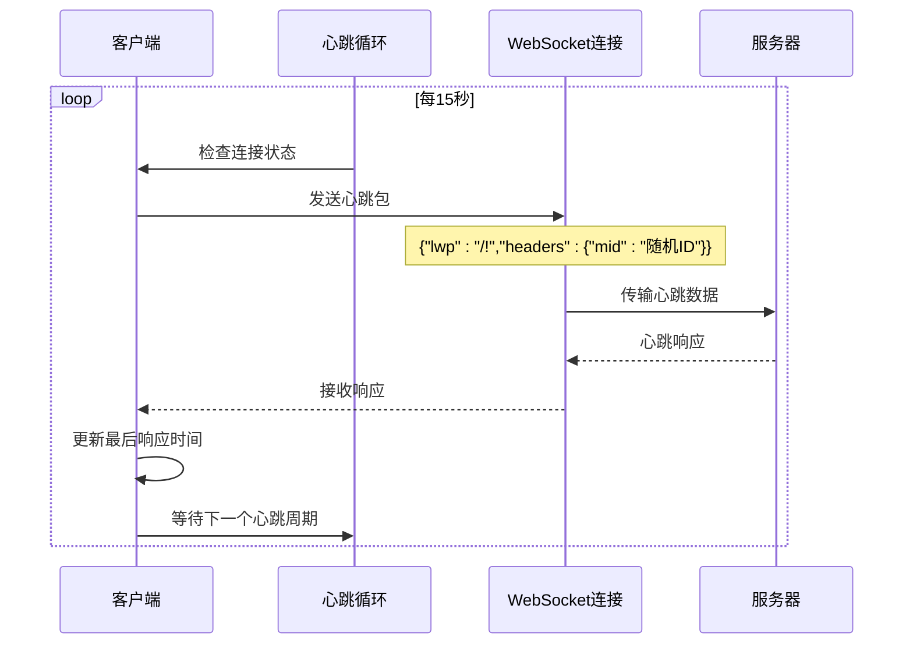

**图表来源**
- [XianyuAutoAsync.py](file://XianyuAutoAsync.py#L5198-L5219)

### 心跳配置参数

| 参数 | 值 | 说明 |
|------|----|----- |
| HEARTBEAT_INTERVAL | 15秒 | 心跳发送间隔 |
| HEARTBEAT_TIMEOUT | 30秒 | 心跳超时时间 |
| MAX_FAILURES | 3次 | 连续失败最大次数 |

### 心跳响应处理

心跳响应通过`handle_heartbeat_response()`方法处理，验证服务器响应的有效性：

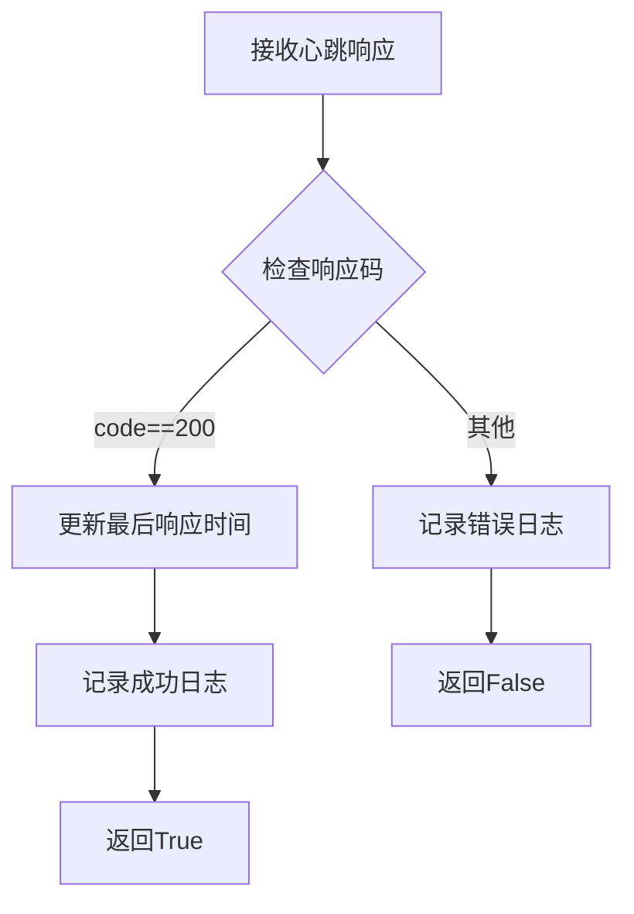

**图表来源**
- [XianyuAutoAsync.py](file://XianyuAutoAsync.py#L5272-L5281)

**章节来源**
- [XianyuAutoAsync.py](file://XianyuAutoAsync.py#L5198-L5281)

## 消息加密解密机制

### 解密流程

系统采用MessagePack格式进行消息序列化，配合Base64编码和自定义解密算法：

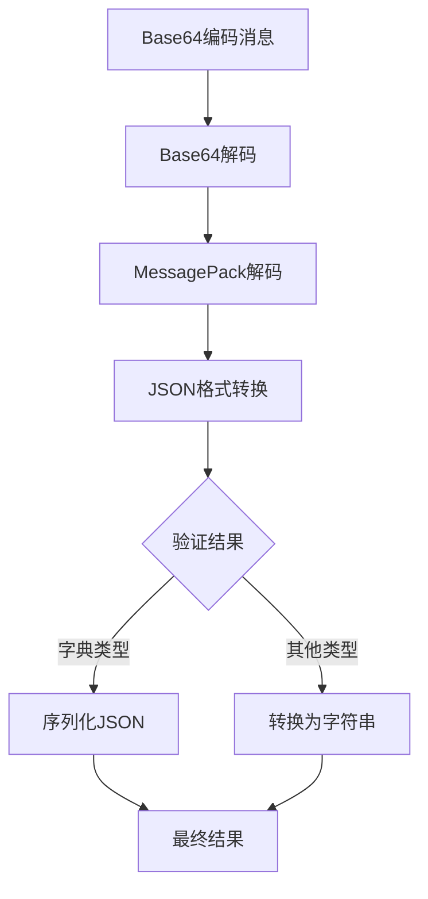

**图表来源**
- [utils/xianyu_utils.py](file://utils/xianyu_utils.py#L328-L372)

### MessagePack解码器

系统实现了完整的MessagePack解码器，支持各种数据类型的解码：

| 数据类型 | 格式字节范围 | 解码方法 |
|----------|-------------|----------|
| 正整数 | 0x00-0x7F | 直接返回值 |
| Fixmap | 0x80-0x8F | 解码映射表 |
| Fixarray | 0x90-0x9F | 解码数组 |
| Fixstr | 0xA0-0xBF | 解码字符串 |
| uint8 | 0xCC | 读取1字节 |
| uint16 | 0xCD | 读取2字节 |
| uint32 | 0xCE | 读取4字节 |
| uint64 | 0xCF | 读取8字节 |

### 加密协议帧处理

消息帧处理遵循以下协议规范：

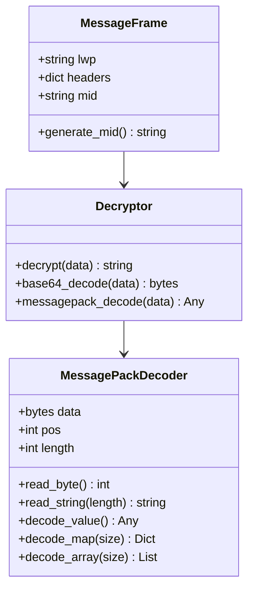

**图表来源**
- [utils/xianyu_utils.py](file://utils/xianyu_utils.py#L121-L379)

**章节来源**
- [utils/xianyu_utils.py](file://utils/xianyu_utils.py#L328-L372)

## 异步消息处理模型

### 并发控制机制

系统通过信号量和任务追踪机制实现高效的并发消息处理：

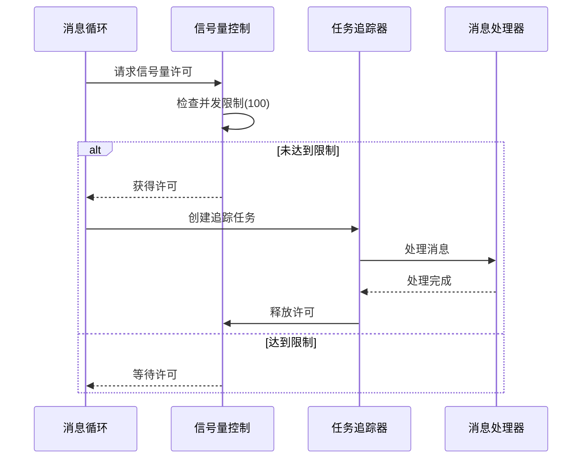

**图表来源**
- [XianyuAutoAsync.py](file://XianyuAutoAsync.py#L6866-L6875)

### 消息处理流程

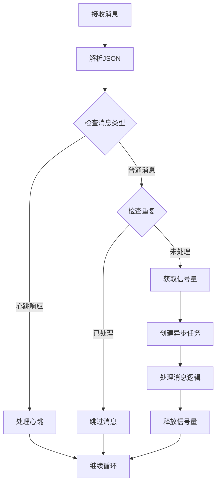

**图表来源**
- [XianyuAutoAsync.py](file://XianyuAutoAsync.py#L6866-L6996)

### 消息去重机制

系统实现了完善的消息去重机制，防止重复处理相同消息：

| 组件 | 功能 | 配置参数 |
|------|------|----------|
| processed_message_ids | 存储已处理消息ID | 最大10000条 |
| message_expire_time | 消息过期时间 | 3600秒 |
| processed_message_ids_lock | 去重锁 | 异步锁 |

**章节来源**
- [XianyuAutoAsync.py](file://XianyuAutoAsync.py#L6866-L6996)

## 异常重连策略

### 重连决策算法

系统根据错误类型和失败次数动态计算重试延迟：

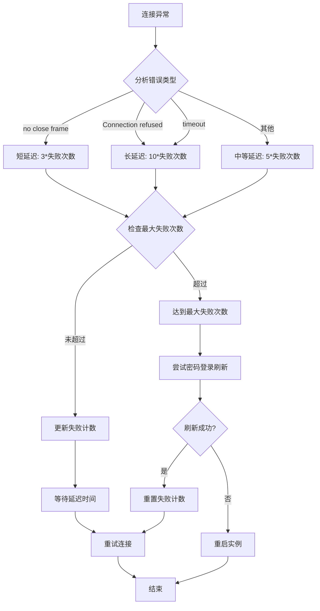

**图表来源**
- [XianyuAutoAsync.py](file://XianyuAutoAsync.py#L453-L466)

### 重连策略配置

| 错误类型 | 延迟计算公式 | 最大延迟 |
|----------|-------------|----------|
| WebSocket意外断开 | min(3 * 失败次数, 15秒) | 15秒 |
| 网络连接问题 | min(10 * 失败次数, 60秒) | 60秒 |
| 其他未知错误 | min(5 * 失败次数, 30秒) | 30秒 |

### 后台任务管理

系统实现了智能的后台任务管理机制：

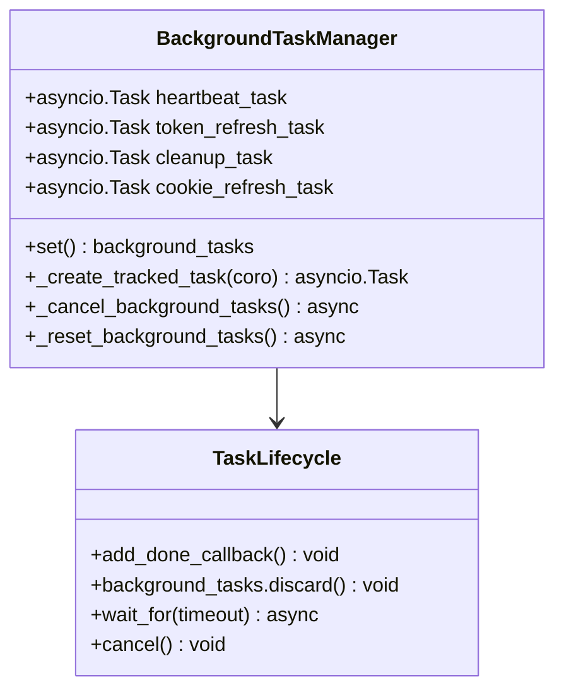

**图表来源**
- [XianyuAutoAsync.py](file://XianyuAutoAsync.py#L791-L797)

**章节来源**
- [XianyuAutoAsync.py](file://XianyuAutoAsync.py#L453-L7827)

## 通信时序分析

### 正常通信时序

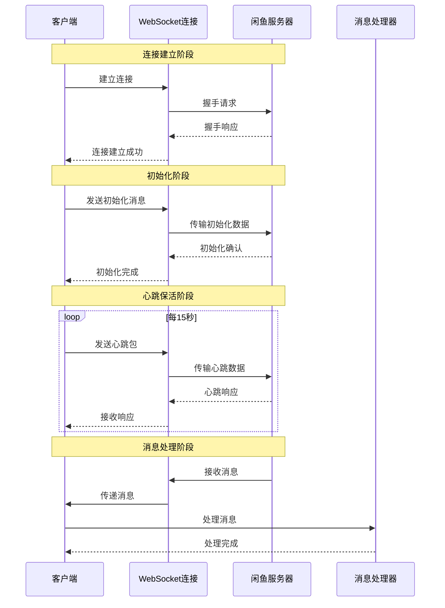

**图表来源**
- [XianyuAutoAsync.py](file://XianyuAutoAsync.py#L7645-L7727)

### 异常恢复时序

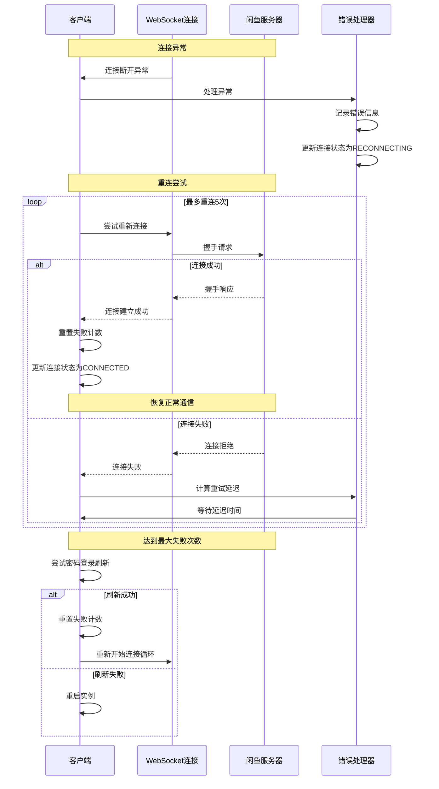

**图表来源**
- [XianyuAutoAsync.py](file://XianyuAutoAsync.py#L7729-L7827)

## 性能优化考虑

### 内存管理优化

系统实现了多项内存优化措施：

| 优化策略 | 实现方式 | 效果 |
|----------|----------|------|
| 消息ID去重 | LRU缓存机制 | 控制内存使用在10000条以内 |
| 缓存清理 | 定期清理过期数据 | 防止内存泄漏 |
| 信号量控制 | 并发任务限制 | 防止内存过度消耗 |
| 任务追踪 | 跟踪活跃任务 | 及时发现任务泄漏 |

### 并发性能优化

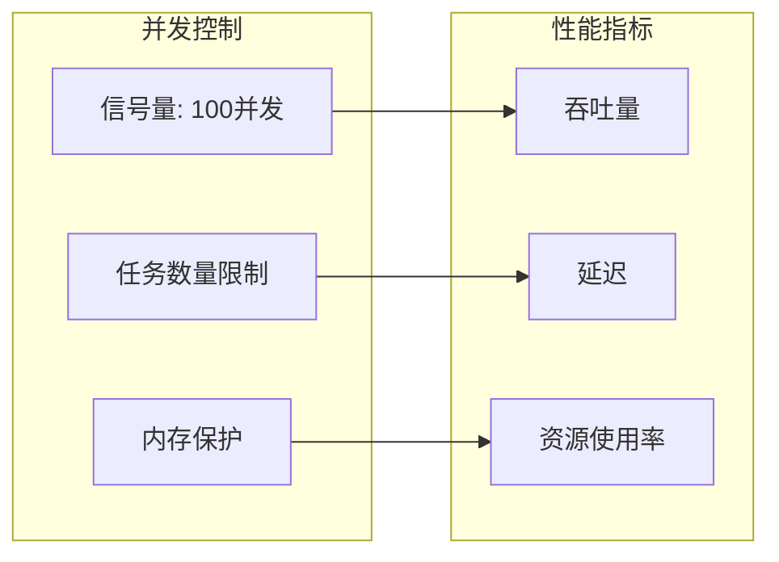

### 网络性能优化

- **心跳间隔优化**: 15秒的心跳间隔平衡了保活需求和网络负载
- **连接复用**: 单连接池设计减少资源消耗
- **异步处理**: 完全异步的消息处理避免阻塞

## 故障排除指南

### 常见问题诊断

| 问题症状 | 可能原因 | 解决方案 |
|----------|----------|----------|
| 连接频繁断开 | 网络不稳定 | 检查网络连接，调整重连参数 |
| 心跳超时 | 服务器响应慢 | 增加HEARTBEAT_TIMEOUT值 |
| 消息处理缓慢 | 并发限制过高 | 调整message_semaphore大小 |
| 内存持续增长 | 消息去重缓存过大 | 清理processed_message_ids |

### 日志分析要点

系统提供了详细的日志记录，便于问题诊断：

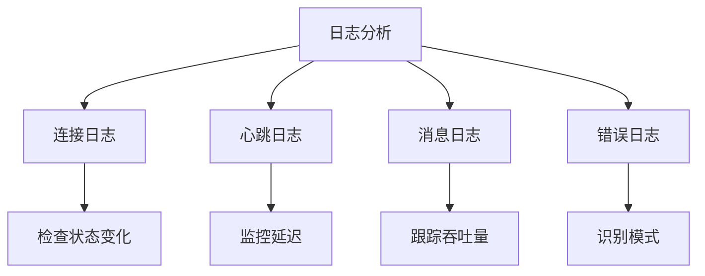

### 监控指标建议

- **连接状态**: 监控各账号的连接状态变化
- **心跳成功率**: 计算心跳响应的成功率
- **消息处理延迟**: 监控消息处理的平均延迟
- **错误频率**: 统计各类错误的发生频率
- **内存使用**: 监控消息去重缓存的大小

**章节来源**
- [XianyuAutoAsync.py](file://XianyuAutoAsync.py#L195-L216)
- [XianyuAutoAsync.py](file://XianyuAutoAsync.py#L453-L466)

## 总结

本文档详细解析了XianyuAutoAsync.py中XianyuLive类实现的WebSocket消息通信机制。该系统通过精心设计的架构和完善的异常处理机制，实现了稳定可靠的闲鱼平台通信功能。

核心优势包括：
- **高可靠性**: 完善的异常重连策略和状态管理
- **高性能**: 基于asyncio的异步消息处理模型
- **可扩展性**: 模块化的组件设计便于功能扩展
- **可观测性**: 详细的日志记录和状态监控

该消息通信机制为闲鱼自动回复系统提供了坚实的技术基础，确保了系统的稳定运行和高效性能。