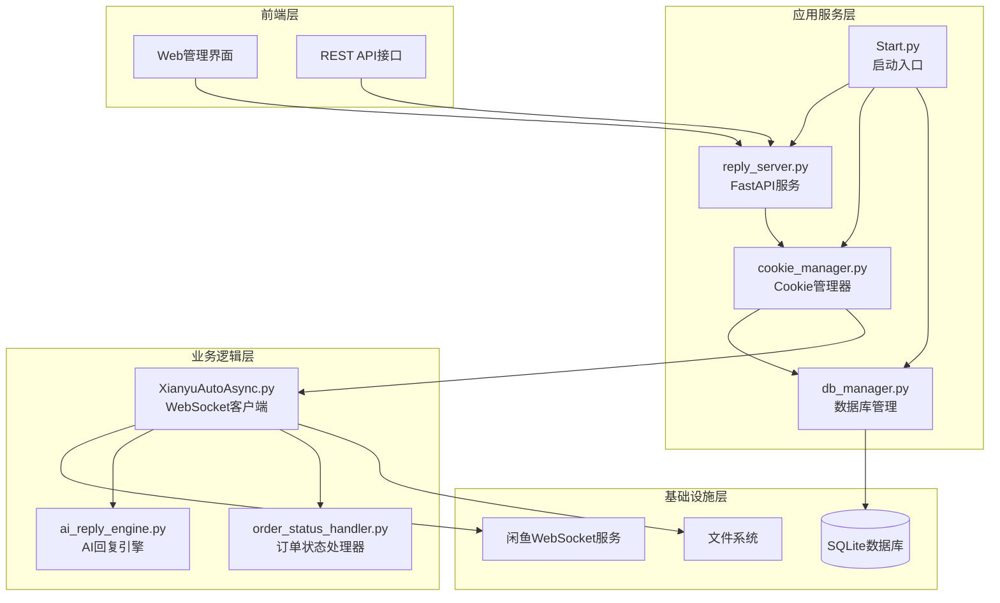
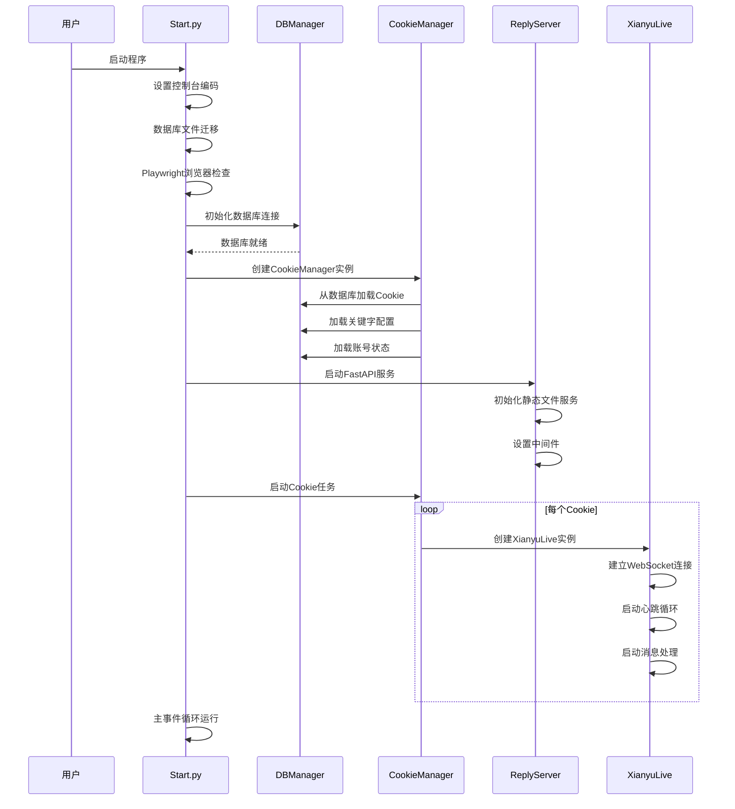
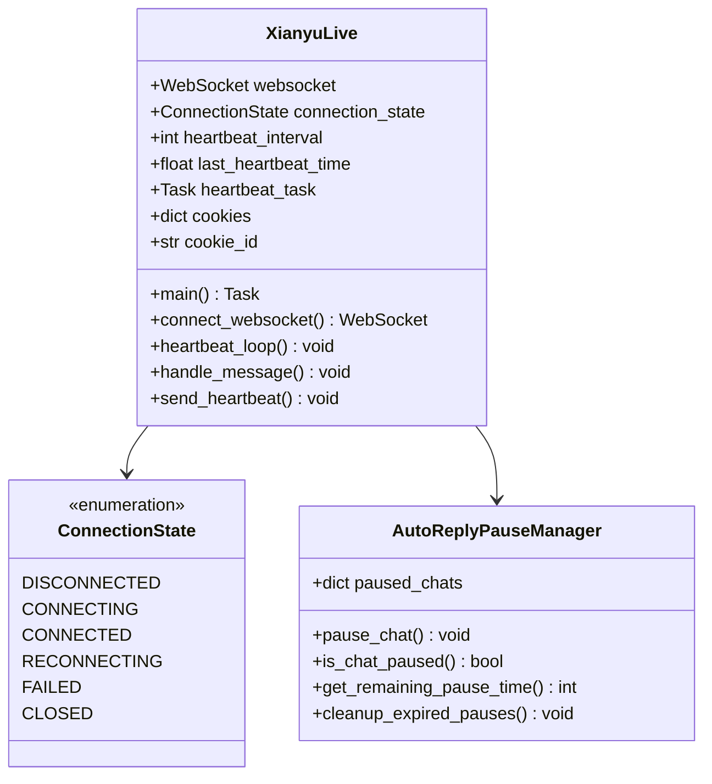
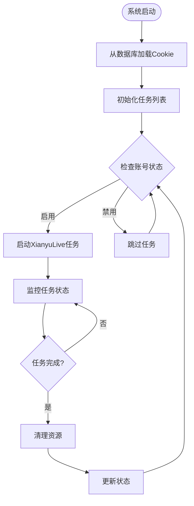
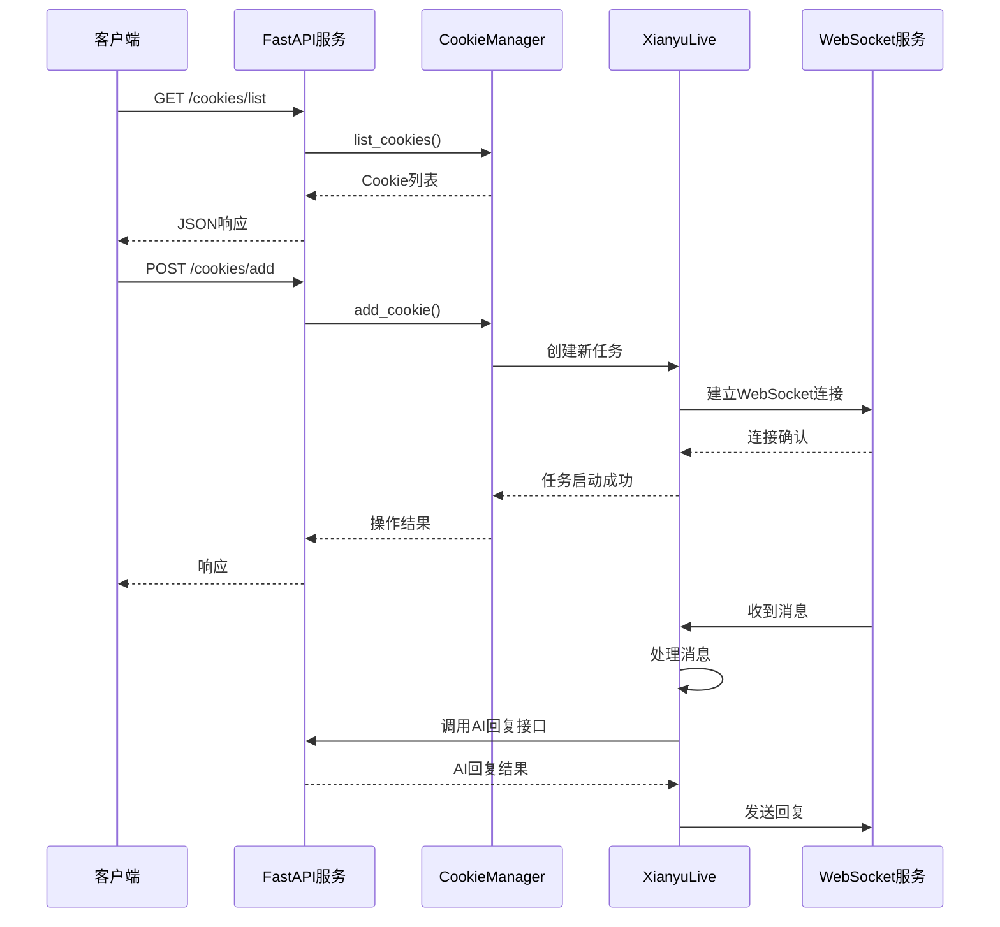
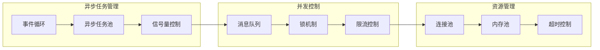
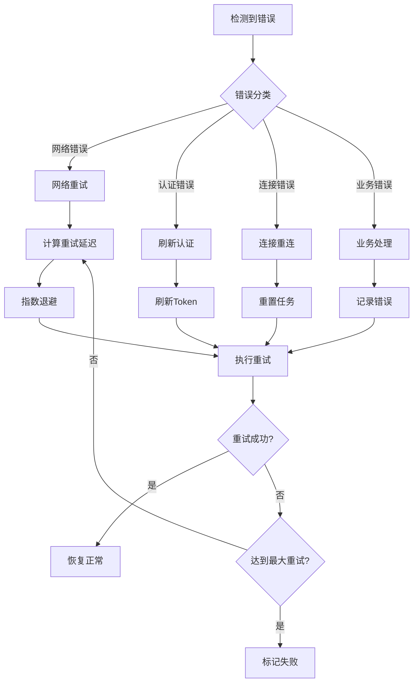
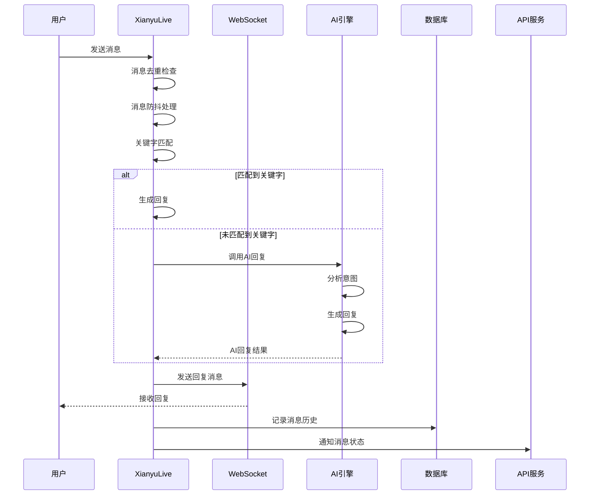
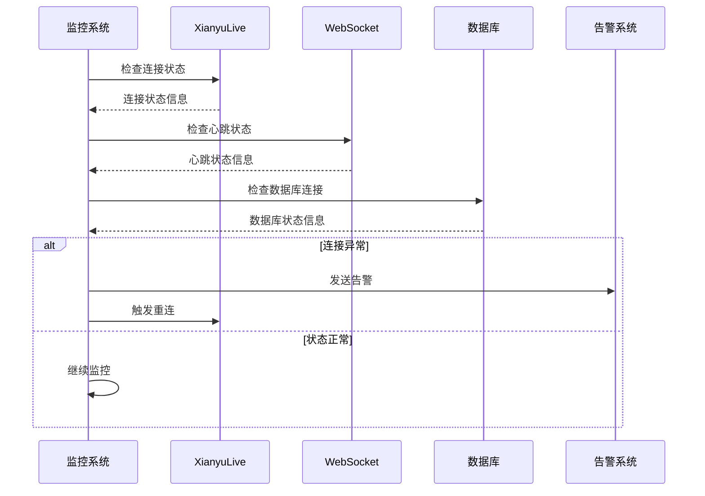

# 系统架构设计

<cite>
**本文档引用的文件**
- [Start.py](file://Start.py)
- [reply_server.py](file://reply_server.py)
- [db_manager.py](file://db_manager.py)
- [cookie_manager.py](file://cookie_manager.py)
- [XianyuAutoAsync.py](file://XianyuAutoAsync.py)
- [config.py](file://config.py)
- [ai_reply_engine.py](file://ai_reply_engine.py)
- [order_status_handler.py](file://order_status_handler.py)
- [global_config.yml](file://global_config.yml)
</cite>

## 目录
1. [系统概述](#系统概述)
2. [项目架构](#项目架构)
3. [系统启动流程](#系统启动流程)
4. [核心组件分析](#核心组件分析)
5. [WebSocket连接池设计](#websocket连接池设计)
6. [Cookie管理机制](#cookie管理机制)
7. [REST API与WebSocket协同](#rest-api与websocket协同)
8. [异步编程模型](#异步编程模型)
9. [错误恢复与重连策略](#错误恢复与重连策略)
10. [系统时序图](#系统时序图)
11. [性能考虑](#性能考虑)
12. [总结](#总结)

## 系统概述

闲鱼自动回复系统是一个基于Python开发的自动化聊天机器人，主要功能包括：
- 自动回复闲鱼平台上的用户消息
- 支持多账号管理与调度
- 提供RESTful API接口
- 集成AI智能回复功能
- 实时订单状态管理

系统采用异步编程模型，支持高并发消息处理，具备完善的错误恢复机制和心跳检测功能。

## 项目架构

**图表来源**
- [Start.py](file://Start.py#L1-L50)
- [reply_server.py](file://reply_server.py#L1-L100)
- [cookie_manager.py](file://cookie_manager.py#L1-L50)

## 系统启动流程

系统启动遵循严格的顺序，确保各组件正确初始化：

**图表来源**
- [Start.py](file://Start.py#L513-L602)
- [db_manager.py](file://db_manager.py#L16-L66)
- [cookie_manager.py](file://cookie_manager.py#L10-L42)

**章节来源**
- [Start.py](file://Start.py#L1-L602)

## 核心组件分析

### Start.py - 系统启动入口

Start.py负责系统的整体初始化，包括：

1. **环境准备**：设置UTF-8编码，确保跨平台兼容性
2. **数据库迁移**：自动迁移旧版数据库文件到data目录
3. **浏览器检查**：自动下载和配置Playwright浏览器
4. **服务启动**：启动FastAPI服务和各个业务组件

### reply_server.py - REST API服务

FastAPI服务提供完整的REST API接口，支持：
- 用户认证与授权
- Cookie管理接口
- 关键字配置管理
- 系统状态监控
- AI回复设置

### db_manager.py - 数据库管理层

SQLite数据库管理器提供：
- 数据持久化存储
- 事务管理
- 数据库迁移支持
- 并发访问控制

### cookie_manager.py - 多账号管理

Cookie管理器实现：
- 多账号生命周期管理
- 动态任务启停
- 关键字配置管理
- 状态监控与报告

**章节来源**
- [reply_server.py](file://reply_server.py#L1-L800)
- [db_manager.py](file://db_manager.py#L1-L800)
- [cookie_manager.py](file://cookie_manager.py#L1-L428)

## WebSocket连接池设计

XianyuAutoAsync.py中的WebSocket连接池设计体现了系统的核心技术特点：

**图表来源**
- [XianyuAutoAsync.py](file://XianyuAutoAsync.py#L29-L800)

### 连接状态管理

系统维护严格的连接状态：
- **DISCONNECTED**：初始状态，未建立连接
- **CONNECTING**：正在建立连接
- **CONNECTED**：连接正常，可发送心跳
- **RECONNECTING**：连接异常，正在重连
- **FAILED**：连接失败，需要人工干预
- **CLOSED**：连接已关闭

### 心跳机制

心跳机制确保连接的活跃性：
- **心跳间隔**：默认15秒发送一次心跳包
- **超时检测**：30秒未收到响应视为连接异常
- **自动重连**：连接失败后自动重连，指数退避算法

**章节来源**
- [XianyuAutoAsync.py](file://XianyuAutoAsync.py#L5198-L7670)

## Cookie管理机制

Cookie管理器实现了复杂的多账号调度系统：

**图表来源**
- [cookie_manager.py](file://cookie_manager.py#L112-L428)

### 多账号调度策略

1. **动态启停**：支持运行时启用/禁用账号
2. **任务隔离**：每个账号运行独立的异步任务
3. **资源管理**：自动清理已完成的任务资源
4. **状态同步**：实时同步账号状态到数据库

### 关键字管理系统

- **账号级关键字**：每个账号可配置独立的关键字
- **全局关键字**：系统级通用回复规则
- **动态更新**：支持运行时修改关键字配置
- **优先级控制**：账号关键字优先于全局关键字

**章节来源**
- [cookie_manager.py](file://cookie_manager.py#L1-L428)

## REST API与WebSocket协同

系统采用REST API和WebSocket双通道协同工作：

**图表来源**
- [reply_server.py](file://reply_server.py#L1-L800)
- [cookie_manager.py](file://cookie_manager.py#L184-L212)

### API接口设计

1. **认证机制**：基于JWT的用户认证
2. **权限控制**：管理员和普通用户权限分离
3. **数据验证**：输入参数严格验证
4. **错误处理**：统一的错误响应格式

### WebSocket消息处理

- **消息解码**：自动解析WebSocket消息格式
- **并发处理**：支持多个消息并发处理
- **去重机制**：防止重复处理相同消息
- **防抖处理**：用户连续消息的智能合并

**章节来源**
- [reply_server.py](file://reply_server.py#L800-L1600)

## 异步编程模型

系统全面采用异步编程模型，提升并发处理能力：

**图表来源**
- [XianyuAutoAsync.py](file://XianyuAutoAsync.py#L726-L740)

### 异步优势

1. **高并发处理**：单线程处理大量并发连接
2. **资源利用率**：CPU密集型任务与I/O密集型任务分离
3. **响应性能**：减少线程切换开销
4. **扩展性**：易于水平扩展

### 挑战与解决方案

1. **内存泄漏**：通过定期清理和资源监控
2. **死锁风险**：严格的锁顺序和超时控制
3. **异常传播**：完善的异常处理和恢复机制
4. **调试困难**：详细的日志记录和监控

**章节来源**
- [XianyuAutoAsync.py](file://XianyuAutoAsync.py#L1-L800)

## 错误恢复与重连策略

系统实现了完善的错误恢复机制：

**图表来源**
- [XianyuAutoAsync.py](file://XianyuAutoAsync.py#L453-L7840)

### 重连策略

1. **指数退避**：失败次数越多，重试间隔越长
2. **最大重试**：防止无限重试导致资源浪费
3. **状态恢复**：重连后恢复之前的业务状态
4. **优雅降级**：部分功能降级可用

### 心跳检测

- **主动心跳**：定期发送心跳包检测连接
- **被动响应**：接收对方心跳包确认连接
- **超时处理**：心跳超时自动触发重连
- **状态同步**：心跳异常时同步业务状态

**章节来源**
- [XianyuAutoAsync.py](file://XianyuAutoAsync.py#L453-L7840)

## 系统时序图

### 用户消息处理流程

### 系统状态监控流程

## 性能考虑

### 并发控制

1. **消息处理并发**：使用信号量控制并发消息处理数量
2. **连接池管理**：限制同时建立的WebSocket连接数
3. **任务调度**：基于优先级的任务调度机制
4. **资源限制**：内存和CPU使用率监控

### 缓存策略

1. **商品信息缓存**：缓存商品详情信息，减少API调用
2. **用户状态缓存**：缓存用户会话状态，提升响应速度
3. **配置缓存**：缓存系统配置，减少数据库查询
4. **LRU淘汰**：使用LRU算法管理缓存空间

### 优化措施

1. **批量处理**：合并相似操作，减少系统调用
2. **懒加载**：按需加载资源，减少启动时间
3. **压缩传输**：对大数据传输进行压缩
4. **预热机制**：系统启动时预加载常用资源

## 总结

闲鱼自动回复系统展现了现代异步应用的最佳实践：

### 技术亮点

1. **架构设计**：清晰的分层架构，职责分离明确
2. **异步编程**：充分利用异步特性，提升系统性能
3. **错误处理**：完善的错误恢复和重连机制
4. **并发控制**：精细的并发管理和资源控制
5. **监控告警**：全面的系统状态监控和告警机制

### 应用价值

1. **提高效率**：自动化处理大量聊天消息
2. **增强体验**：提供即时响应和智能回复
3. **降低成本**：减少人工客服的工作量
4. **提升质量**：标准化的服务质量和回复准确性

### 发展方向

1. **AI能力增强**：集成更先进的自然语言处理技术
2. **多平台支持**：扩展到其他电商平台
3. **数据分析**：提供更深入的用户行为分析
4. **个性化服务**：基于用户画像的个性化回复

该系统为电商自动化客服提供了完整的解决方案，具有良好的扩展性和稳定性，适合大规模商业应用。