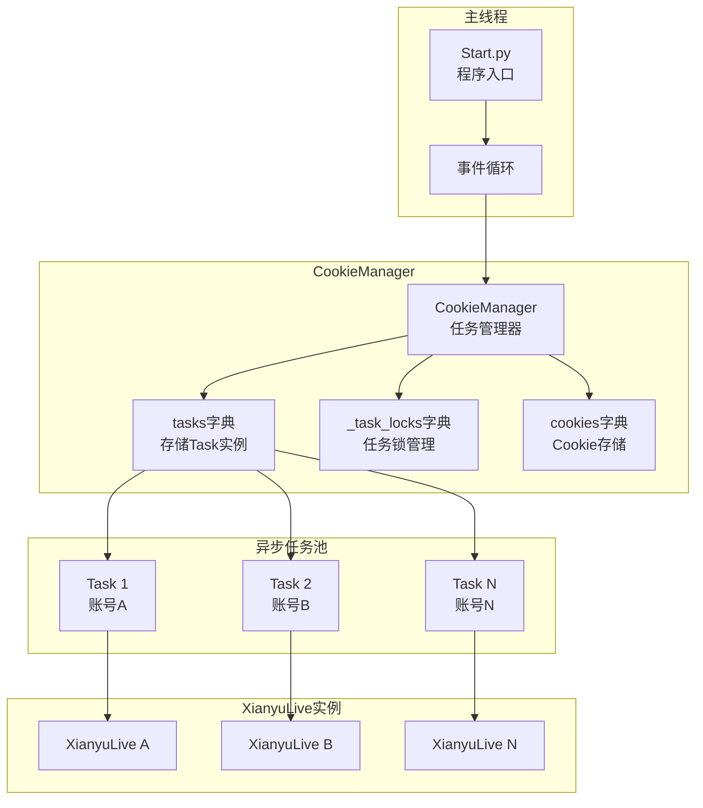
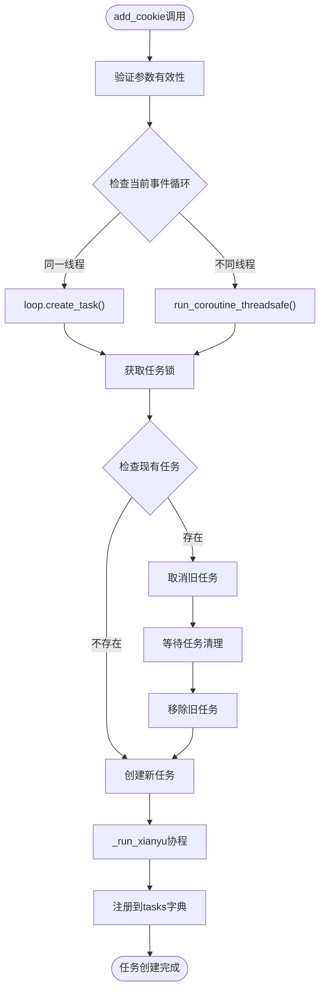
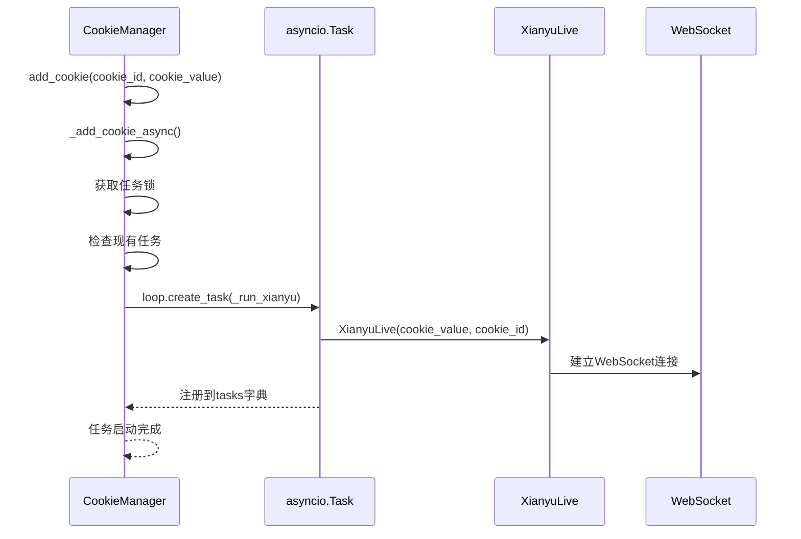
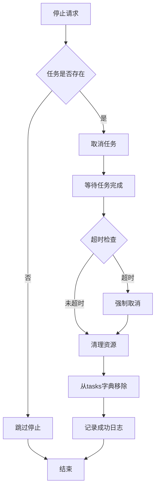
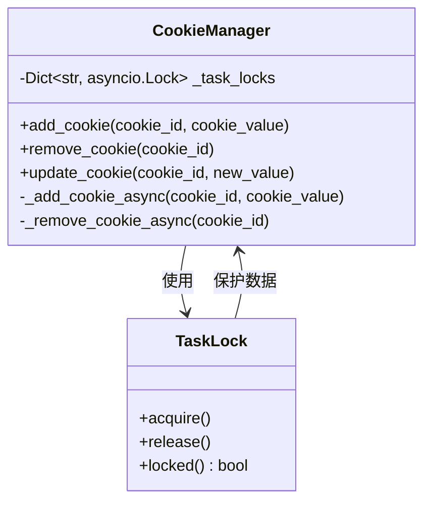
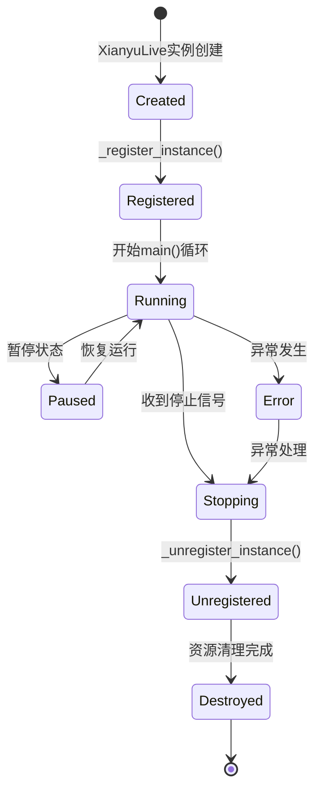
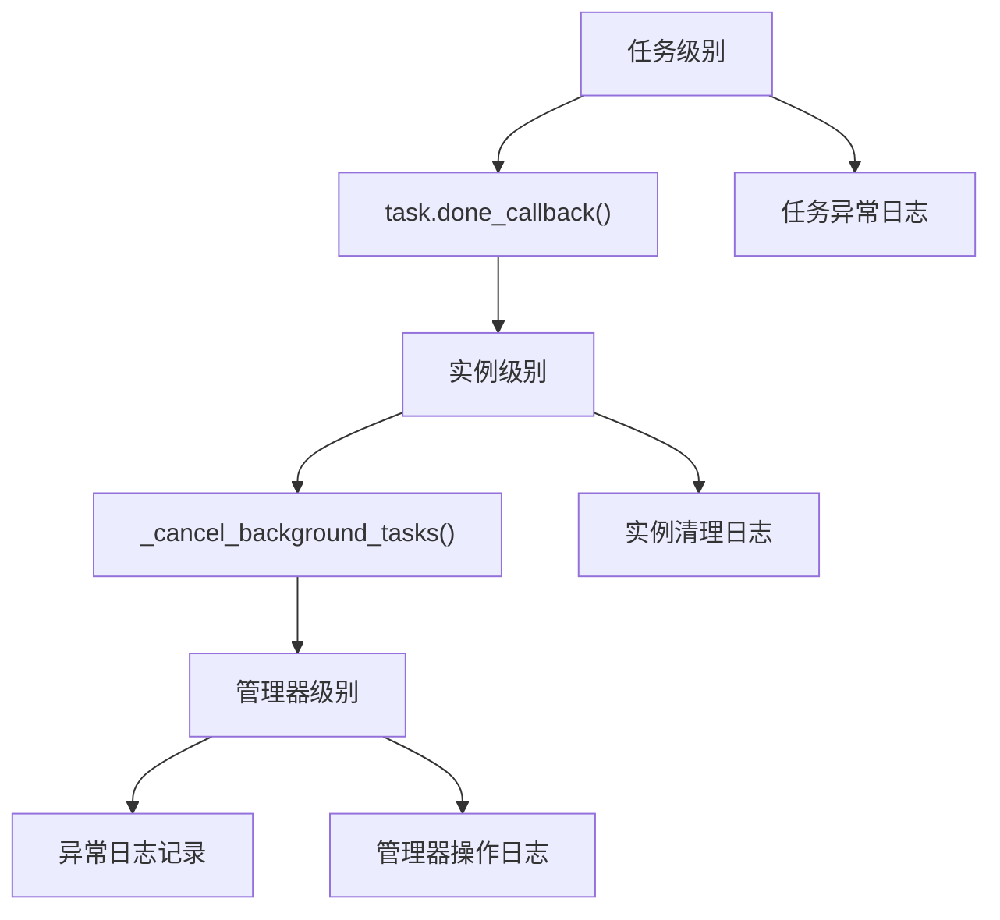
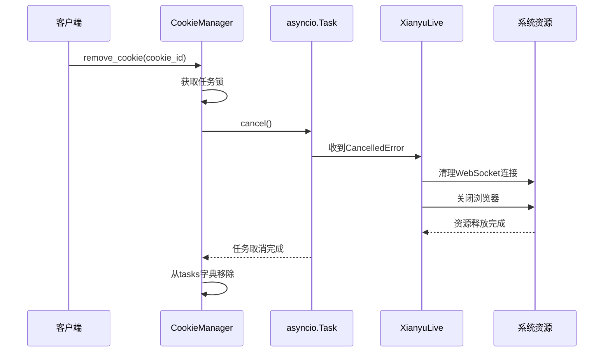

# 任务创建与管理

<cite>
**本文档引用的文件**
- [cookie_manager.py](file://cookie_manager.py)
- [XianyuAutoAsync.py](file://XianyuAutoAsync.py)
- [Start.py](file://Start.py)
- [db_manager.py](file://db_manager.py)
</cite>

## 目录
1. [概述](#概述)
2. [系统架构](#系统架构)
3. [CookieManager核心组件](#cookiemanager核心组件)
4. [任务创建机制](#任务创建机制)
5. [任务生命周期管理](#任务生命周期管理)
6. [线程安全机制](#线程安全机制)
7. [任务与XianyuLive实例关系](#任务与xianyulive实例关系)
8. [异常处理与资源清理](#异常处理与资源清理)
9. [最佳实践指南](#最佳实践指南)
10. [故障排除](#故障排除)

## 概述

本系统采用基于asyncio的异步任务管理模式，通过CookieManager统一管理多个账号的自动回复任务。每个账号对应一个独立的asyncio.Task实例，这些任务封装了XianyuLive实例，负责处理闲鱼平台的自动回复、消息处理和业务逻辑。

系统的核心设计理念是：
- **任务隔离**：每个账号的任务独立运行，互不干扰
- **线程安全**：通过锁机制确保多线程环境下的数据一致性
- **生命周期管理**：完整的任务创建、运行、监控和终止流程
- **资源清理**：完善的异常处理和资源释放机制

## 系统架构



**图表来源**
- [cookie_manager.py](file://cookie_manager.py#L10-L21)
- [Start.py](file://Start.py#L523-L548)

## CookieManager核心组件

### 核心数据结构

CookieManager维护以下关键字典来管理任务：

| 字典名称 | 类型 | 用途 | 键类型 | 值类型 |
|---------|------|------|--------|--------|
| `tasks` | `Dict[str, asyncio.Task]` | 存储活跃任务实例 | `cookie_id` | `asyncio.Task` |
| `_task_locks` | `Dict[str, asyncio.Lock]` | 任务锁，防止重复创建 | `cookie_id` | `asyncio.Lock` |
| `cookies` | `Dict[str, str]` | 存储Cookie值 | `cookie_id` | `str` |
| `keywords` | `Dict[str, List[Tuple[str, str]]]` | 关键字配置 | `cookie_id` | `List[Tuple[str, str]]` |
| `cookie_status` | `Dict[str, bool]` | 账号启用状态 | `cookie_id` | `bool` |

### 初始化过程

```mermaid
sequenceDiagram
participant S as Start.py
participant CM as CookieManager
participant DB as 数据库
participant Loop as 事件循环
S->>CM : 创建CookieManager(loop)
CM->>DB : _load_from_db()
DB-->>CM : 返回Cookie、关键字、状态数据
CM->>CM : 初始化各字典
S->>Loop : 启动事件循环
Loop->>CM : 遍历数据库Cookie
Loop->>CM : _run_xianyu(cookie_id, cookie_value)
CM->>CM : 创建asyncio.Task
CM->>CM : 添加到tasks字典
```

**图表来源**
- [cookie_manager.py](file://cookie_manager.py#L13-L42)
- [Start.py](file://Start.py#L523-L548)

**章节来源**
- [cookie_manager.py](file://cookie_manager.py#L13-L42)

## 任务创建机制

### add_cookie方法详解

add_cookie方法是任务创建的主要入口，实现了完整的线程安全任务创建流程：



**图表来源**
- [cookie_manager.py](file://cookie_manager.py#L184-L200)
- [cookie_manager.py](file://cookie_manager.py#L112-L153)

### _run_xianyu协程机制

_run_xianyu是任务的核心执行函数，负责：

1. **延迟导入**：避免循环依赖
2. **实例创建**：初始化XianyuLive实例
3. **异常处理**：完整的错误捕获和日志记录
4. **资源清理**：确保异常情况下的资源释放

**章节来源**
- [cookie_manager.py](file://cookie_manager.py#L59-L111)

## 任务生命周期管理

### 任务启动流程



**图表来源**
- [cookie_manager.py](file://cookie_manager.py#L112-L153)
- [XianyuAutoAsync.py](file://XianyuAutoAsync.py#L628-L746)

### 任务运行状态监控

系统通过以下机制监控任务运行状态：

| 监控指标 | 实现方式 | 用途 |
|---------|----------|------|
| 任务完成状态 | `task.done()` | 检查任务是否正常退出 |
| 任务取消状态 | `asyncio.CancelledError` | 检测任务被主动取消 |
| 异常状态 | 异常捕获 | 记录任务异常信息 |
| 资源使用 | 实例属性跟踪 | 监控内存和连接使用 |

### 任务终止流程



**图表来源**
- [cookie_manager.py](file://cookie_manager.py#L366-L390)

**章节来源**
- [cookie_manager.py](file://cookie_manager.py#L155-L181)
- [cookie_manager.py](file://cookie_manager.py#L366-L390)

## 线程安全机制

### 任务锁机制

系统使用双重锁机制确保线程安全：

1. **任务级锁**：防止同一账号的多个任务同时创建
2. **操作级锁**：保护关键数据结构的并发访问



**图表来源**
- [cookie_manager.py](file://cookie_manager.py#L20-L21)

### 线程间通信

系统支持跨线程的任务管理操作：

| 操作类型 | 实现方式 | 示例场景 |
|---------|----------|----------|
| 任务创建 | `run_coroutine_threadsafe()` | API接口添加账号 |
| 任务停止 | `run_coroutine_threadsafe()` | API接口删除账号 |
| 状态查询 | 直接访问共享字典 | 实时状态监控 |
| 配置更新 | 异步回调机制 | 关键字配置变更 |

**章节来源**
- [cookie_manager.py](file://cookie_manager.py#L184-L212)

## 任务与XianyuLive实例关系

### 实例映射关系

每个asyncio.Task实例都对应一个唯一的XianyuLive实例，通过cookie_id建立关联：

```mermaid
erDiagram
COOKIE_ID {
string id PK
string value
int user_id
bool auto_confirm
string remark
int pause_duration
}
TASK_INSTANCE {
string cookie_id FK
asyncio.Task task
datetime created_at
bool is_running
}
XIANYU_LIVE {
string cookie_id PK
string myid
string device_id
ConnectionState connection_state
websocket ws
}
COOKIE_ID ||--|| TASK_INSTANCE : maps_to
TASK_INSTANCE ||--|| XIANYU_LIVE : contains
```

**图表来源**
- [cookie_manager.py](file://cookie_manager.py#L151-L152)
- [XianyuAutoAsync.py](file://XianyuAutoAsync.py#L628-L643)

### 实例生命周期



**图表来源**
- [XianyuAutoAsync.py](file://XianyuAutoAsync.py#L758-L774)

**章节来源**
- [XianyuAutoAsync.py](file://XianyuAutoAsync.py#L628-L746)
- [XianyuAutoAsync.py](file://XianyuAutoAsync.py#L758-L774)

## 异常处理与资源清理

### 异常处理层次

系统采用分层异常处理机制：



**图表来源**
- [XianyuAutoAsync.py](file://XianyuAutoAsync.py#L331-L443)

### 资源清理策略

| 清理阶段 | 清理对象 | 超时时间 | 处理策略 |
|---------|----------|----------|----------|
| 主动清理 | WebSocket连接 | 5秒 | 等待优雅关闭 |
| 被动清理 | 浏览器实例 | 10秒 | 强制关闭 |
| 强制清理 | 线程资源 | 3秒 | 直接终止 |
| 最终清理 | 内存引用 | 无限制 | 强制释放 |

### 任务取消机制



**图表来源**
- [cookie_manager.py](file://cookie_manager.py#L155-L181)
- [XianyuAutoAsync.py](file://XianyuAutoAsync.py#L331-L443)

**章节来源**
- [XianyuAutoAsync.py](file://XianyuAutoAsync.py#L331-L443)
- [cookie_manager.py](file://cookie_manager.py#L155-L181)

## 最佳实践指南

### 任务管理最佳实践

1. **合理设置超时时间**
   - 任务取消超时：5秒
   - 资源清理超时：10秒
   - 强制终止超时：3秒

2. **异常处理策略**
   - 使用分层异常处理
   - 记录详细的错误信息
   - 确保资源最终释放

3. **性能优化建议**
   - 避免频繁的任务创建和销毁
   - 使用连接池减少资源消耗
   - 合理设置任务优先级

### 资源管理建议

| 资源类型 | 管理策略 | 监控指标 |
|---------|----------|----------|
| 内存使用 | 定期清理缓存 | RSS内存占用 |
| 网络连接 | 连接池管理 | 活跃连接数 |
| 文件句柄 | 自动关闭 | 打开文件数 |
| 线程资源 | 限制并发数 | 线程池使用率 |

### 故障预防措施

1. **健康检查机制**
   - 定期检查任务运行状态
   - 监控异常频率
   - 自动重启失败任务

2. **容量规划**
   - 根据账号数量调整资源分配
   - 设置合理的并发限制
   - 监控系统负载

## 故障排除

### 常见问题及解决方案

| 问题类型 | 症状 | 可能原因 | 解决方案 |
|---------|------|----------|----------|
| 任务创建失败 | 任务未启动 | Cookie无效 | 检查Cookie格式和有效性 |
| 任务频繁崩溃 | 异常日志过多 | 网络不稳定 | 增加重试机制 |
| 内存泄漏 | 内存持续增长 | 资源未正确释放 | 检查清理逻辑 |
| 线程死锁 | 程序无响应 | 锁竞争 | 优化锁粒度 |

### 调试技巧

1. **日志分析**
   - 启用详细日志记录
   - 关注任务生命周期日志
   - 监控异常堆栈信息

2. **性能监控**
   - 使用asyncio调试工具
   - 监控任务队列长度
   - 分析任务执行时间

3. **状态检查**
   - 定期检查tasks字典状态
   - 验证实例注册情况
   - 监控资源使用情况

**章节来源**
- [cookie_manager.py](file://cookie_manager.py#L59-L111)
- [XianyuAutoAsync.py](file://XianyuAutoAsync.py#L331-L443)