# 并发任务调度

<cite>
**本文档中引用的文件**
- [cookie_manager.py](file://cookie_manager.py)
- [XianyuAutoAsync.py](file://XianyuAutoAsync.py)
- [Start.py](file://Start.py)
- [ws_utils.py](file://utils/ws_utils.py)
- [xianyu_slider_stealth.py](file://utils/xianyu_slider_stealth.py)
</cite>

## 目录
1. [简介](#简介)
2. [系统架构概览](#系统架构概览)
3. [CookieManager核心机制](#cookiemanager核心机制)
4. [任务调度与管理](#任务调度与管理)
5. [并发控制机制](#并发控制机制)
6. [异常处理与隔离](#异常处理与隔离)
7. [事件循环调度策略](#事件循环调度策略)
8. [性能优化建议](#性能优化建议)
9. [故障排除指南](#故障排除指南)
10. [总结](#总结)

## 简介

本文档深入解析了闲鱼自动回复系统中的并发任务调度机制。该系统采用基于asyncio的异步编程模型，通过CookieManager组件管理多个账号的独立任务，实现高效的并发处理。系统的核心设计围绕着任务隔离、资源管理和异常恢复展开，确保每个账号的WebSocket连接和业务逻辑都能独立运行而不相互干扰。

## 系统架构概览

系统采用分层架构设计，主要包含以下核心组件：

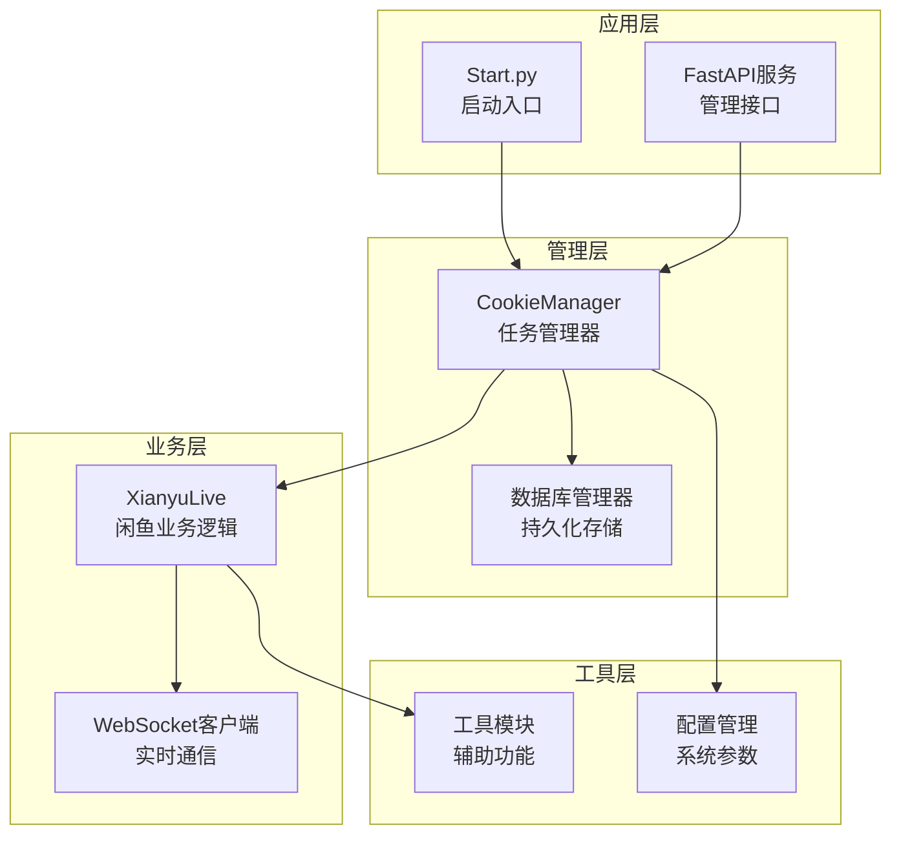

**图表来源**
- [Start.py](file://Start.py#L513-L586)
- [cookie_manager.py](file://cookie_manager.py#L10-L21)

**章节来源**
- [Start.py](file://Start.py#L1-L602)
- [cookie_manager.py](file://cookie_manager.py#L1-L428)

## CookieManager核心机制

### _tasks字典管理

CookieManager中的`_tasks`字典是并发任务调度的核心数据结构，它为每个账号维护独立的asyncio.Task实例：

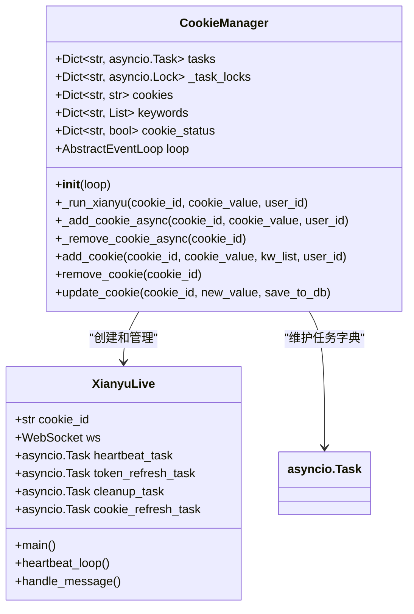

**图表来源**
- [cookie_manager.py](file://cookie_manager.py#L14-L20)
- [XianyuAutoAsync.py](file://XianyuAutoAsync.py#L158-L180)

### _task_locks锁机制

每个账号都配备独立的asyncio.Lock对象，防止同一账号的重复任务创建：

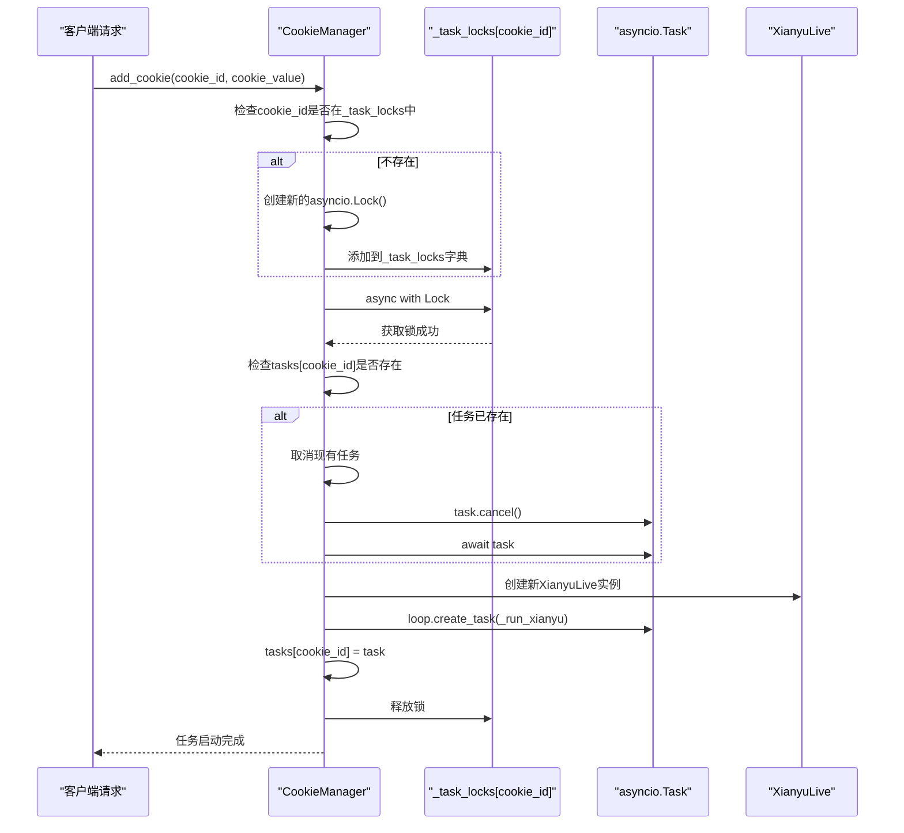

**图表来源**
- [cookie_manager.py](file://cookie_manager.py#L112-L153)
- [cookie_manager.py](file://cookie_manager.py#L116-L137)

**章节来源**
- [cookie_manager.py](file://cookie_manager.py#L112-L153)

## 任务调度与管理

### _run_xianyu协程机制

_run_xianyu方法是任务调度的核心入口，负责为每个账号创建独立的XianyuLive实例并运行其main方法：

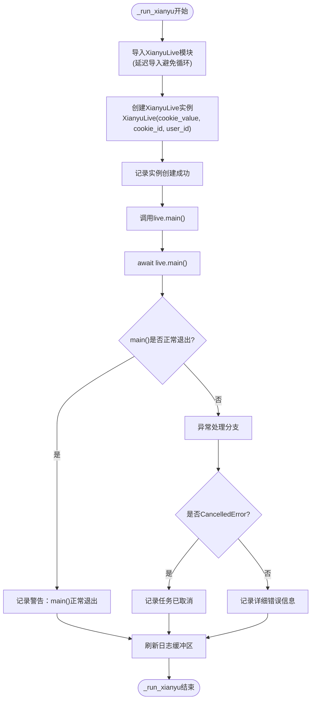

**图表来源**
- [cookie_manager.py](file://cookie_manager.py#L59-L110)

### 任务生命周期管理

系统实现了完整的任务生命周期管理，包括创建、运行、监控和清理：

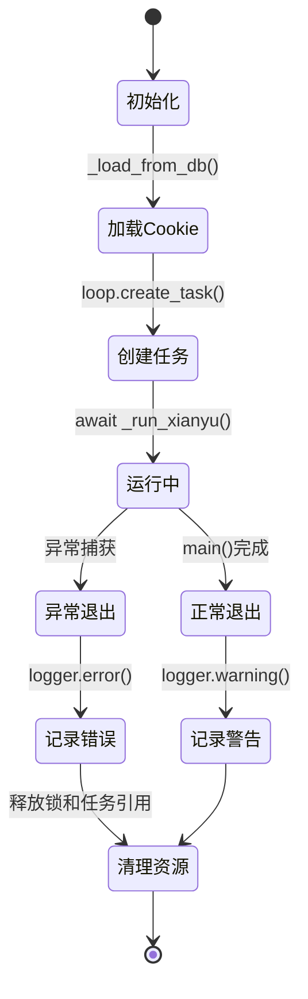

**图表来源**
- [cookie_manager.py](file://cookie_manager.py#L59-L110)

**章节来源**
- [cookie_manager.py](file://cookie_manager.py#L59-L110)

## 并发控制机制

### 消息处理并发控制

系统通过asyncio.Semaphore实现消息处理的并发控制，防止内存泄漏：

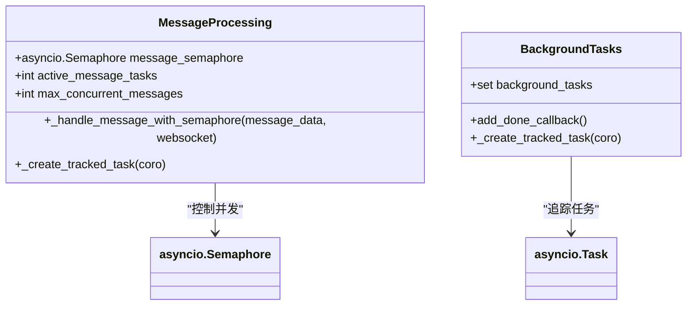

**图表来源**
- [XianyuAutoAsync.py](file://XianyuAutoAsync.py#L725-L727)
- [XianyuAutoAsync.py](file://XianyuAutoAsync.py#L791-L796)

### 滑块验证并发管理

系统还实现了专门的滑块验证并发管理器，控制同时进行的滑块验证任务数量：

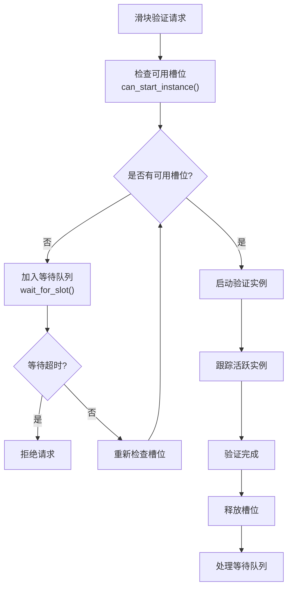

**图表来源**
- [xianyu_slider_stealth.py](file://utils/xianyu_slider_stealth.py#L58-L85)

**章节来源**
- [XianyuAutoAsync.py](file://XianyuAutoAsync.py#L725-L727)
- [xianyu_slider_stealth.py](file://utils/xianyu_slider_stealth.py#L34-L143)

## 异常处理与隔离

### 任务异常隔离机制

系统实现了多层次的异常处理和任务隔离机制：

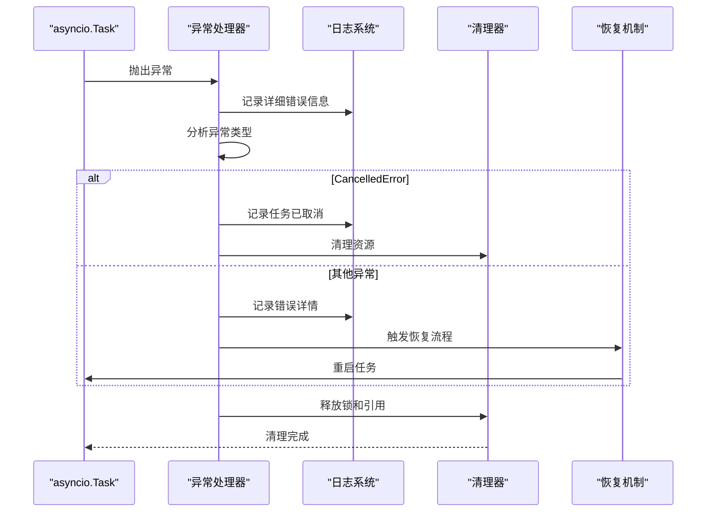

**图表来源**
- [cookie_manager.py](file://cookie_manager.py#L85-L102)
- [XianyuAutoAsync.py](file://XianyuAutoAsync.py#L280-L451)

### 后台任务清理机制

系统提供了完善的后台任务清理机制，确保异常情况下资源得到正确释放：

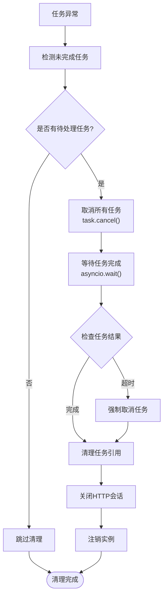

**图表来源**
- [XianyuAutoAsync.py](file://XianyuAutoAsync.py#L280-L451)

**章节来源**
- [cookie_manager.py](file://cookie_manager.py#L85-L102)
- [XianyuAutoAsync.py](file://XianyuAutoAsync.py#L280-L451)

## 事件循环调度策略

### WebSocket连接管理

系统通过WebSocketClient类实现高效的WebSocket连接管理：

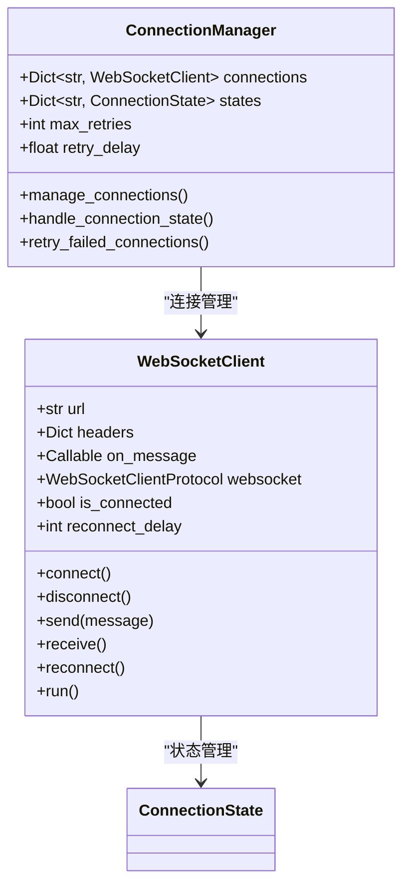

**图表来源**
- [ws_utils.py](file://utils/ws_utils.py#L6-L89)

### 任务调度优化

系统采用了多种策略来优化事件循环的调度效率：

1. **任务追踪机制**：通过background_tasks集合追踪所有后台任务
2. **信号量控制**：使用asyncio.Semaphore控制并发消息处理数量
3. **任务取消优化**：实现快速任务取消和资源清理机制

**章节来源**
- [ws_utils.py](file://utils/ws_utils.py#L1-L89)
- [XianyuAutoAsync.py](file://XianyuAutoAsync.py#L722-L727)

## 性能优化建议

### 任务数量限制策略

为了防止系统资源过度消耗，建议实施以下限制策略：

| 限制类型 | 推荐值 | 说明 |
|---------|--------|------|
| 单账号并发消息处理 | 100个任务 | 防止内存泄漏 |
| 滑块验证并发数 | 5-10个实例 | 控制浏览器资源占用 |
| WebSocket连接数 | 1个连接/账号 | 避免连接池耗尽 |
| 任务重试次数 | 3-5次 | 平衡稳定性与性能 |
| 清理超时时间 | 10秒 | 确保系统响应性 |

### 资源分配策略

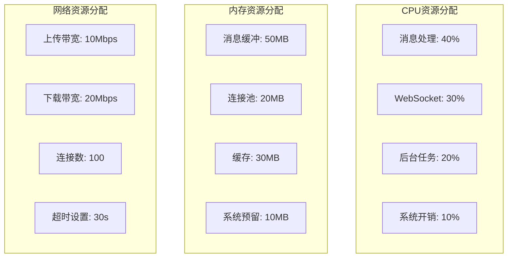

### 监控指标建议

建议监控以下关键指标来评估系统性能：

- **任务成功率**：成功启动的任务占总任务的比例
- **平均响应时间**：消息处理的平均延迟
- **资源使用率**：CPU、内存、网络的使用情况
- **异常频率**：任务异常退出的频率
- **连接稳定性**：WebSocket连接的稳定性和重连频率

## 故障排除指南

### 常见问题诊断

| 问题症状 | 可能原因 | 解决方案 |
|---------|----------|----------|
| 任务频繁异常退出 | 网络不稳定 | 增加重连机制和异常处理 |
| 内存持续增长 | 任务未正确清理 | 检查任务取消和资源释放逻辑 |
| CPU使用率过高 | 并发控制失效 | 调整信号量和任务数量限制 |
| WebSocket连接断开 | 保活机制失效 | 优化心跳包发送策略 |
| 任务启动缓慢 | 事件循环阻塞 | 检查同步操作和阻塞调用 |

### 调试技巧

1. **启用详细日志**：设置日志级别为DEBUG以获取详细的执行信息
2. **监控任务状态**：定期检查tasks字典中的任务状态
3. **分析异常堆栈**：重点关注CancelledError和资源清理相关的异常
4. **性能分析**：使用asyncio的性能分析工具监控任务执行时间

**章节来源**
- [XianyuAutoAsync.py](file://XianyuAutoAsync.py#L7900-L8000)

## 总结

闲鱼自动回复系统的并发任务调度机制体现了现代异步编程的最佳实践。通过CookieManager的精心设计，系统实现了：

1. **任务隔离**：每个账号拥有独立的任务和资源
2. **并发控制**：通过锁机制和信号量防止资源竞争
3. **异常恢复**：完善的异常处理和任务重启机制
4. **性能优化**：合理的设计确保系统在高负载下的稳定性

这种架构不仅保证了系统的可靠性，也为未来的扩展提供了良好的基础。开发者在使用和维护该系统时，应当重点关注异常处理、资源管理和性能监控，以确保系统的长期稳定运行。