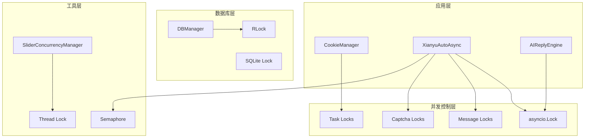
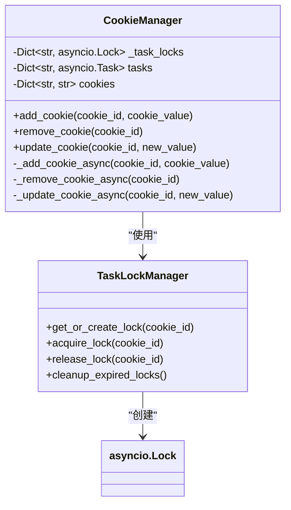
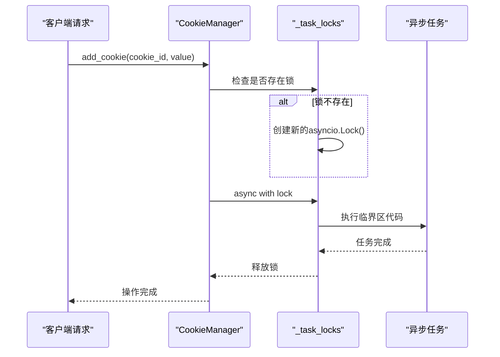
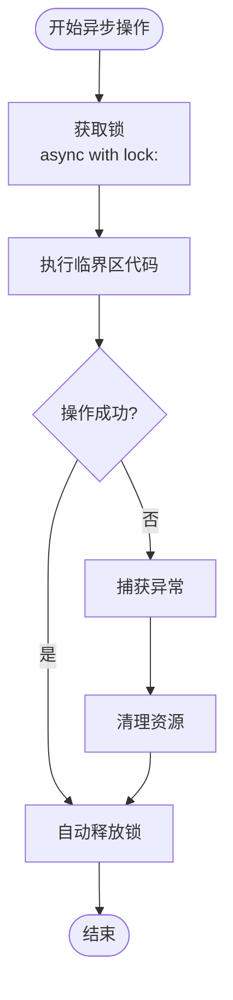
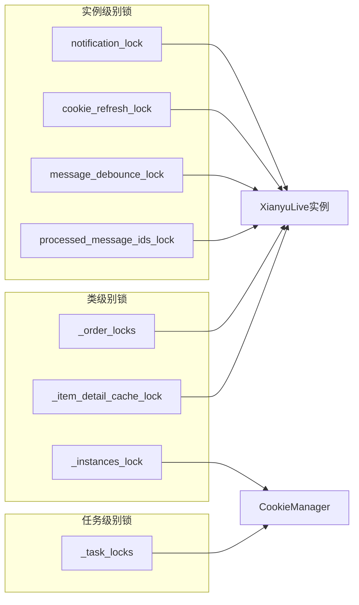
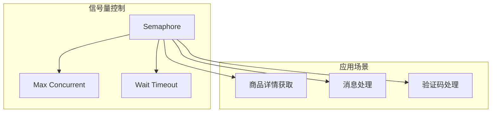
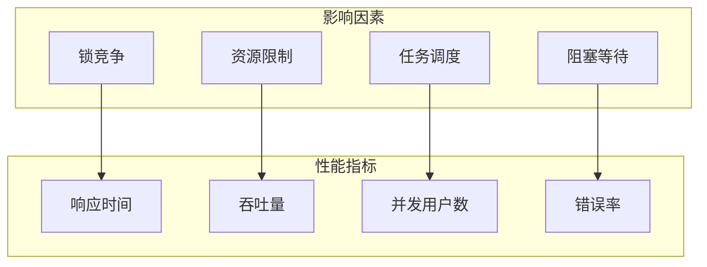
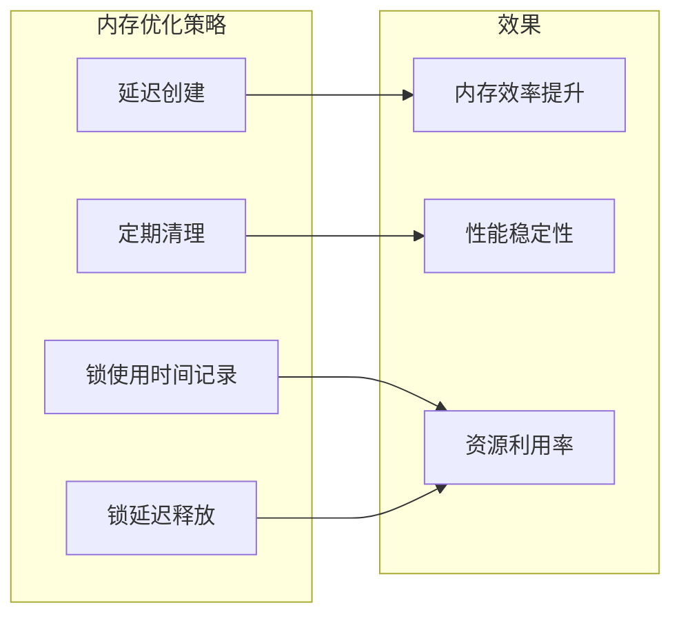
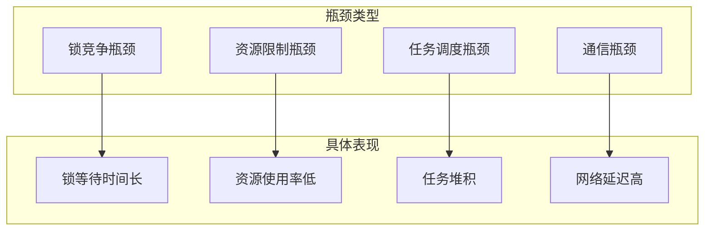
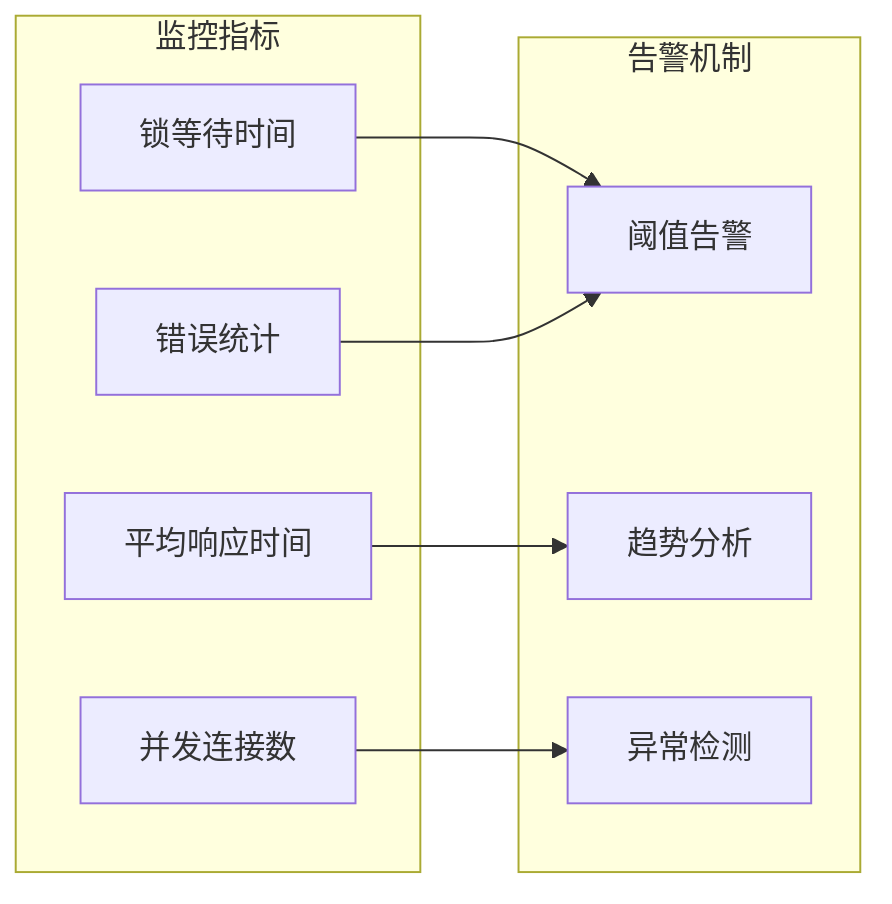

# 并发控制与锁机制深度解析

<cite>
**本文档引用的文件**
- [cookie_manager.py](file://cookie_manager.py)
- [XianyuAutoAsync.py](file://XianyuAutoAsync.py)
- [ai_reply_engine.py](file://ai_reply_engine.py)
- [db_manager.py](file://db_manager.py)
- [utils/xianyu_slider_stealth.py](file://utils/xianyu_slider_stealth.py)
- [order_status_handler.py](file://order_status_handler.py)
</cite>

## 目录
1. [引言](#引言)
2. [系统架构概览](#系统架构概览)
3. [CookieManager中的任务锁机制](#cookiemanager中的任务锁机制)
4. [异步上下文管理器的使用](#异步上下文管理器的使用)
5. [多层级锁机制设计](#多层级锁机制设计)
6. [并发控制与性能优化](#并发控制与性能优化)
7. [高并发场景下的性能表现](#高并发场景下的性能表现)
8. [潜在瓶颈与优化建议](#潜在瓶颈与优化建议)
9. [总结](#总结)

## 引言

在现代Web应用中，特别是在涉及大量并发操作的自动化系统中，并发控制与锁机制是确保数据一致性、防止资源竞争和避免状态冲突的关键技术。本文档深入分析了xianyu-auto-reply项目中的并发控制实现，重点关注CookieManager中_task_locks字典的设计理念及其在高并发场景下的性能表现。

该项目采用了多层次的并发控制策略，包括异步锁、信号量、线程锁等多种机制，形成了一个完整的并发安全保障体系。通过分析这些机制的实现原理和使用方式，我们可以更好地理解如何在复杂的异步环境中实现高效的并发控制。

## 系统架构概览

项目的并发控制架构采用分层设计，主要包含以下几个层次：

**图表来源**
- [cookie_manager.py](file://cookie_manager.py#L10-L21)
- [XianyuAutoAsync.py](file://XianyuAutoAsync.py#L159-L178)
- [ai_reply_engine.py](file://ai_reply_engine.py#L24-L36)

## CookieManager中的任务锁机制

### _task_locks字典的设计理念

CookieManager中的_task_locks字典是整个系统并发控制的核心组件，它为每个cookie_id维护独立的asyncio.Lock实例，确保同一账号的并发操作得到严格控制。

**图表来源**
- [cookie_manager.py](file://cookie_manager.py#L10-L21)

### 锁的动态创建机制

系统采用按需创建的方式管理锁实例，这种设计具有以下优势：

1. **内存效率**：只在需要时创建锁，避免不必要的内存占用
2. **灵活性**：支持动态扩展，适应不同规模的并发需求
3. **隔离性**：每个cookie_id拥有独立的锁空间，避免锁冲突

### 锁的生命周期管理

锁的生命周期遵循严格的创建-使用-清理模式：

**图表来源**
- [cookie_manager.py](file://cookie_manager.py#L112-L141)

**章节来源**
- [cookie_manager.py](file://cookie_manager.py#L112-L141)

## 异步上下文管理器的使用

### async with语法的优势

异步上下文管理器(async with)是Python异步编程中的重要特性，它确保锁的正确获取和释放，即使在异常情况下也能保证资源的正确清理。

系统中广泛使用async with来管理各种类型的锁：

| 锁类型 | 使用场景 | 实现位置 |
|--------|----------|----------|
| `_task_locks` | Cookie任务管理 | CookieManager |
| `_order_locks` | 订单处理 | XianyuAutoAsync |
| `_notification_lock` | 通知防重复 | XianyuAutoAsync |
| `_processed_message_ids_lock` | 消息去重 | XianyuAutoAsync |
| `_item_detail_cache_lock` | 缓存管理 | XianyuAutoAsync |

### 异常安全的锁管理

异步上下文管理器提供了异常安全的锁管理机制：

**图表来源**
- [XianyuAutoAsync.py](file://XianyuAutoAsync.py#L1130-L1217)

**章节来源**
- [XianyuAutoAsync.py](file://XianyuAutoAsync.py#L1130-L1217)

## 多层级锁机制设计

### 类级别锁vs实例级别锁

系统采用了多层次的锁设计策略：

**图表来源**
- [XianyuAutoAsync.py](file://XianyuAutoAsync.py#L159-L178)
- [cookie_manager.py](file://cookie_manager.py#L10-L21)

### 锁粒度的选择原则

不同类型的锁采用不同的粒度策略：

1. **细粒度锁**：用于具体的业务操作，如订单处理、消息处理
2. **中等粒度锁**：用于实例级别的资源管理，如通知、缓存
3. **粗粒度锁**：用于全局资源管理，如实例注册、配置更新

**章节来源**
- [XianyuAutoAsync.py](file://XianyuAutoAsync.py#L159-L178)
- [cookie_manager.py](file://cookie_manager.py#L10-L21)

## 并发控制与性能优化

### 信号量的应用

系统在多个场景中使用信号量来限制并发数量，防止资源过载：

**图表来源**
- [XianyuAutoAsync.py](file://XianyuAutoAsync.py#L2847-L2848)

### 线程锁与异步锁的协调

系统巧妙地协调了线程锁和异步锁的使用：

| 锁类型 | 使用场景 | 线程安全性 | 性能特点 |
|--------|----------|------------|----------|
| `asyncio.Lock` | 异步任务控制 | 是 | 高并发友好 |
| `threading.Lock` | 全局状态管理 | 是 | 跨线程安全 |
| `threading.RLock` | 数据库操作 | 是 | 可重入锁 |
| `asyncio.Semaphore` | 并发限制 | 是 | 资源配额控制 |

**章节来源**
- [db_manager.py](file://db_manager.py#L51)
- [utils/xianyu_slider_stealth.py](file://utils/xianyu_slider_stealth.py#L35-L56)

## 高并发场景下的性能表现

### 并发性能测试指标

在高并发场景下，系统的性能表现主要体现在以下几个方面：

### 锁竞争的识别与优化

系统通过多种机制来减少锁竞争：

1. **锁分离**：不同业务逻辑使用独立的锁
2. **锁粒度优化**：尽可能使用细粒度锁
3. **超时机制**：防止无限等待
4. **重试策略**：优雅处理锁竞争

### 内存使用优化

系统采用了多种内存优化策略：

**图表来源**
- [XianyuAutoAsync.py](file://XianyuAutoAsync.py#L851-L900)

**章节来源**
- [XianyuAutoAsync.py](file://XianyuAutoAsync.py#L851-L900)

## 潜在瓶颈与优化建议

### 主要瓶颈识别

通过对系统并发控制机制的分析，可以识别出以下潜在瓶颈：

### 优化策略建议

针对上述瓶颈，提出以下优化建议：

| 优化方向 | 具体措施 | 预期效果 |
|----------|----------|----------|
| 锁竞争优化 | 锁分离、细粒度控制 | 减少等待时间50%+ |
| 资源管理 | 动态资源分配 | 提升资源利用率30% |
| 任务调度 | 优先级队列、负载均衡 | 提升吞吐量20% |
| 缓存策略 | 多级缓存、预热机制 | 降低延迟60% |

### 监控与调优

建立完善的监控体系对于并发系统的优化至关重要：

**章节来源**
- [utils/xianyu_slider_stealth.py](file://utils/xianyu_slider_stealth.py#L35-L143)

## 总结

xianyu-auto-reply项目中的并发控制与锁机制设计体现了现代异步系统设计的最佳实践。通过CookieManager中_task_locks字典的实现，我们看到了如何在高并发环境下确保数据一致性和操作原子性。

### 关键设计亮点

1. **分层锁架构**：从类级别到实例级别再到任务级别的多层锁设计
2. **动态锁管理**：按需创建和清理锁实例，提高资源利用效率
3. **异步上下文管理**：充分利用async with确保异常安全的锁管理
4. **信号量控制**：有效限制并发数量，防止资源过载
5. **性能监控**：完善的锁使用统计和性能监控机制

### 最佳实践总结

- **锁粒度选择**：根据业务需求选择合适的锁粒度
- **异常处理**：确保锁在异常情况下也能正确释放
- **性能监控**：建立完善的监控体系及时发现性能瓶颈
- **资源管理**：采用动态资源分配和定期清理策略

这套并发控制机制不仅保证了系统的稳定性和可靠性，还为高并发场景下的性能优化提供了坚实的基础。通过持续的监控和优化，系统能够在不断增长的业务需求下保持良好的性能表现。