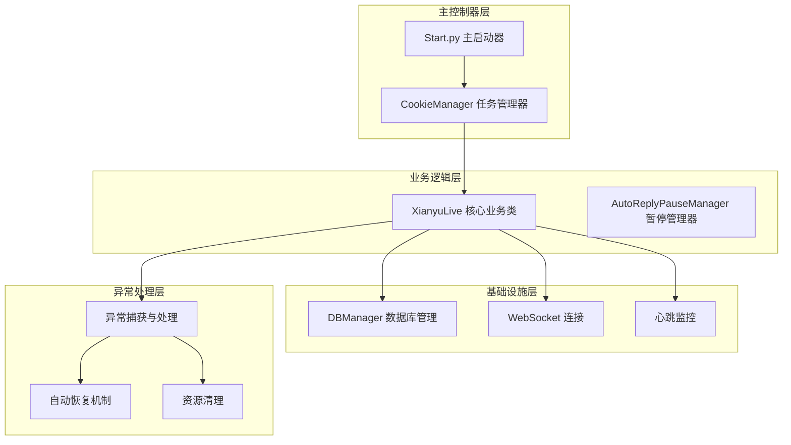
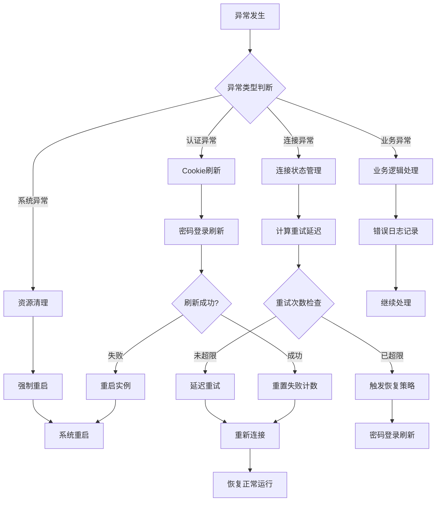
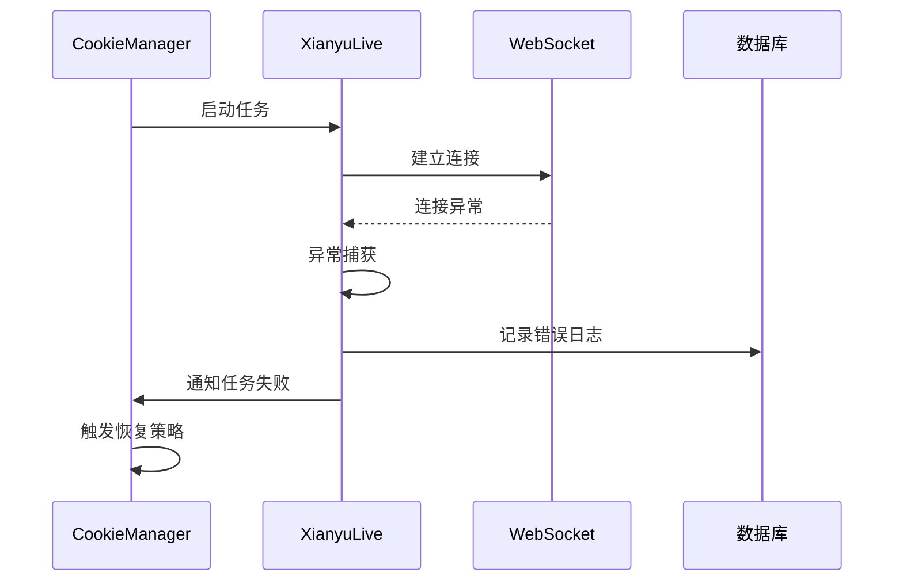
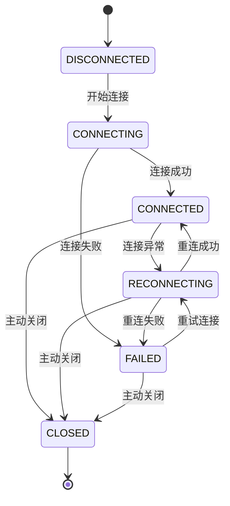
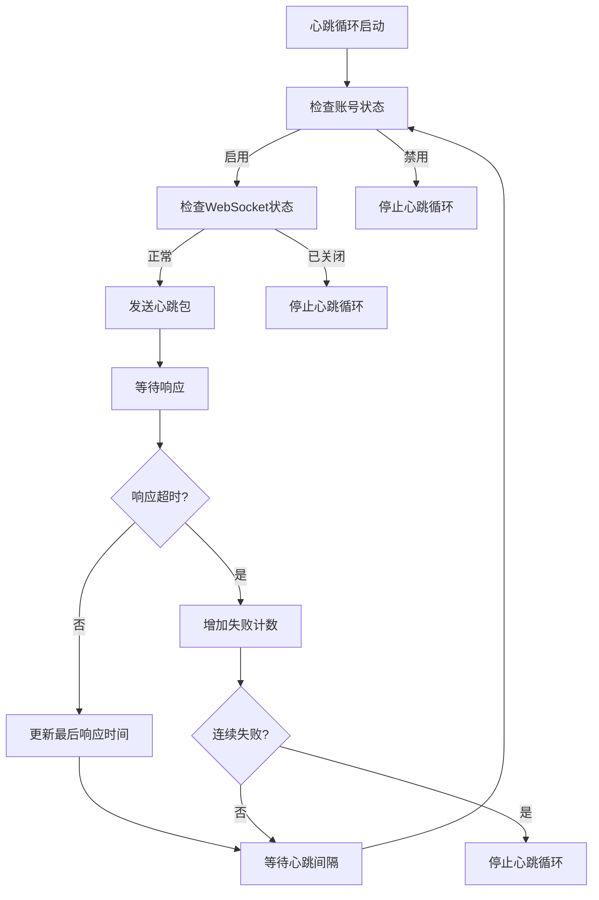
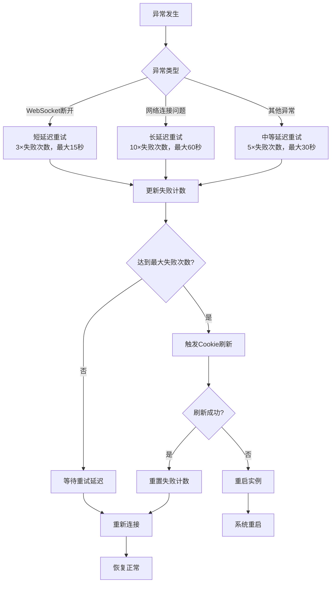
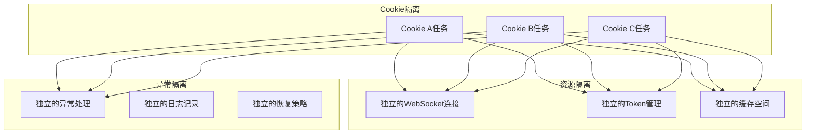

# 异常处理与恢复机制

<cite>
**本文档引用的文件**
- [Start.py](file://Start.py)
- [XianyuAutoAsync.py](file://XianyuAutoAsync.py)
- [cookie_manager.py](file://cookie_manager.py)
- [db_manager.py](file://db_manager.py)
- [config.py](file://config.py)
- [utils/ws_utils.py](file://utils/ws_utils.py)
</cite>

## 目录
1. [概述](#概述)
2. [系统架构](#系统架构)
3. [异常处理核心机制](#异常处理核心机制)
4. [_run_xianyu协程异常处理](#_run_xianyu协程异常处理)
5. [连接状态管理系统](#连接状态管理系统)
6. [心跳机制与故障检测](#心跳机制与故障检测)
7. [自动恢复策略](#自动恢复策略)
8. [任务隔离与资源管理](#任务隔离与资源管理)
9. [故障诊断与日志记录](#故障诊断与日志记录)
10. [最佳实践建议](#最佳实践建议)

## 概述

本系统实现了完善的异常处理与恢复机制，确保在面对网络中断、认证失败、WebSocket连接异常等各种异常情况时，能够进行有效的隔离和自动恢复。系统采用多层次的异常处理策略，包括连接状态管理、心跳监控、自动重连、任务隔离等机制，保障系统的稳定性和可靠性。

## 系统架构

**图表来源**
- [Start.py](file://Start.py#L513-L586)
- [cookie_manager.py](file://cookie_manager.py#L10-L428)
- [XianyuAutoAsync.py](file://XianyuAutoAsync.py#L158-L8372)

## 异常处理核心机制

### 异常分类与处理策略

系统将异常分为以下几类进行差异化处理：

1. **连接异常**：WebSocket断开、网络超时等
2. **认证异常**：Cookie失效、Token过期等
3. **业务异常**：消息处理错误、API调用失败等
4. **系统异常**：内存不足、文件系统错误等

### 异常处理流程

**章节来源**
- [XianyuAutoAsync.py](file://XianyuAutoAsync.py#L453-L7825)
- [cookie_manager.py](file://cookie_manager.py#L60-L111)

## _run_xianyu协程异常处理

### try-except块设计

_run_xianyu协程实现了完整的异常捕获和处理机制：

**图表来源**
- [cookie_manager.py](file://cookie_manager.py#L60-L111)

### 异常处理实现细节

1. **延迟导入避免循环依赖**
   - 使用动态导入避免模块间循环依赖
   - 确保异常处理的完整性

2. **多层级异常捕获**
   - 捕获 `asyncio.CancelledError` 处理任务取消
   - 捕获通用异常进行降级处理
   - 使用 `finally` 确保资源清理

3. **日志记录与监控**
   - 强制刷新日志缓冲区确保信息及时输出
   - 记录详细的错误堆栈信息便于问题定位

**章节来源**
- [cookie_manager.py](file://cookie_manager.py#L60-L111)

## 连接状态管理系统

### ConnectionState枚举定义

系统定义了完整的连接状态枚举来跟踪WebSocket连接状态：

**图表来源**
- [XianyuAutoAsync.py](file://XianyuAutoAsync.py#L29-L36)

### 连接状态管理机制

1. **状态转换监控**
   - 实时记录状态变化时间和原因
   - 根据状态严重程度选择不同的日志级别

2. **失败计数器**
   - 跟踪连续失败次数
   - 达到阈值时触发特殊恢复策略

3. **自动状态更新**
   - 连接建立时自动更新为CONNECTED
   - 连接异常时自动更新为RECONNECTING

**章节来源**
- [XianyuAutoAsync.py](file://XianyuAutoAsync.py#L195-L216)

## 心跳机制与故障检测

### 心跳循环设计

**图表来源**
- [XianyuAutoAsync.py](file://XianyuAutoAsync.py#L5221-L5271)

### 心跳配置参数

| 参数名称 | 默认值 | 说明 |
|---------|--------|------|
| HEARTBEAT_INTERVAL | 15秒 | 心跳发送间隔 |
| HEARTBEAT_TIMEOUT | 30秒 | 心跳响应超时时间 |
| MAX_FAILURES | 3次 | 连续失败最大次数 |

### 故障检测机制

1. **主动检测**
   - 定期发送心跳包检测连接状态
   - 监控心跳响应时间判断连接质量

2. **被动检测**
   - 监听WebSocket连接异常事件
   - 检测连接关闭帧和异常断开

3. **综合评估**
   - 结合心跳响应和连接状态进行综合判断
   - 避免误判和漏判

**章节来源**
- [config.py](file://config.py#L95-L96)
- [XianyuAutoAsync.py](file://XianyuAutoAsync.py#L5198-L5281)

## 自动恢复策略

### 重试机制设计

系统实现了智能的重试机制，根据异常类型和失败次数动态调整重试策略：

**图表来源**
- [XianyuAutoAsync.py](file://XianyuAutoAsync.py#L453-L466)

### Cookie刷新策略

当连续失败达到阈值时，系统会尝试通过密码登录刷新Cookie：

1. **密码登录刷新**
   - 尝试使用保存的用户名密码重新登录
   - 刷新Cookie并更新数据库

2. **实例重启**
   - 如果密码登录刷新失败，重启整个实例
   - 清理所有后台任务和资源

3. **平滑重启**
   - 触发重启前先清理后台任务
   - 确保资源得到正确释放

**章节来源**
- [XianyuAutoAsync.py](file://XianyuAutoAsync.py#L7778-L7824)

## 任务隔离与资源管理

### 任务隔离机制

**图表来源**
- [cookie_manager.py](file://cookie_manager.py#L10-L428)

### 资源清理策略

1. **后台任务清理**
   - 使用超时保护确保任务能够响应取消信号
   - 强制清理未完成的任务避免资源泄漏

2. **连接资源管理**
   - 及时关闭和清理WebSocket连接
   - 释放HTTP会话资源

3. **内存资源控制**
   - 限制消息处理并发数防止内存溢出
   - 定期清理过期缓存和临时数据

**章节来源**
- [XianyuAutoAsync.py](file://XianyuAutoAsync.py#L236-L452)

## 故障诊断与日志记录

### 日志分级策略

系统采用分级日志记录策略，根据异常严重程度选择合适的日志级别：

| 异常类型 | 日志级别 | 说明 |
|---------|----------|------|
| 连接关闭 | WARNING | 正常的连接关闭，使用警告级别 |
| 连接异常 | ERROR | 连接异常，使用错误级别 |
| 重连中 | WARNING | 正在尝试重连，使用警告级别 |
| 重连失败 | ERROR | 重连失败，使用错误级别 |
| 重启实例 | ERROR | 重启实例，使用错误级别 |

### 异常信息记录

1. **基础信息**
   - 异常类型和错误消息
   - 发生时间戳
   - 相关的上下文信息

2. **详细信息**
   - 完整的错误堆栈
   - 相关的配置参数
   - 系统状态信息

3. **恢复信息**
   - 重试次数和延迟
   - 恢复策略执行情况
   - 恢复后的状态

**章节来源**
- [XianyuAutoAsync.py](file://XianyuAutoAsync.py#L7729-L7753)

## 最佳实践建议

### 异常处理最佳实践

1. **防御性编程**
   - 对所有外部依赖进行异常捕获
   - 提供合理的默认值和降级策略
   - 避免异常传播到上层系统

2. **资源管理**
   - 使用上下文管理器确保资源正确释放
   - 实现超时保护避免无限等待
   - 定期清理临时资源防止泄漏

3. **监控告警**
   - 记录关键异常便于问题追踪
   - 设置适当的告警阈值
   - 提供详细的异常报告

### 性能优化建议

1. **连接池管理**
   - 复用WebSocket连接减少建立开销
   - 实现连接池避免频繁创建销毁
   - 监控连接池状态进行动态调整

2. **缓存策略**
   - 合理设置缓存大小和过期时间
   - 实现缓存预热提高响应速度
   - 定期清理无效缓存释放内存

3. **并发控制**
   - 限制并发任务数量防止资源竞争
   - 使用信号量控制资源访问
   - 实现优雅的流量控制

### 故障恢复建议

1. **渐进式恢复**
   - 从简单的恢复策略开始逐步尝试复杂策略
   - 记录恢复过程便于问题分析
   - 提供手动干预的接口

2. **健康检查**
   - 定期检查系统健康状态
   - 实现自愈机制自动修复小问题
   - 监控关键指标及时发现问题

3. **备份策略**
   - 定期备份重要配置和数据
   - 实现快速回滚机制
   - 提供灾难恢复预案

通过以上完善的异常处理与恢复机制，系统能够在面对各种异常情况时保持稳定运行，确保业务连续性和用户体验。这套机制不仅能够及时发现和处理异常，还能够通过智能的恢复策略最大限度地减少业务中断时间。