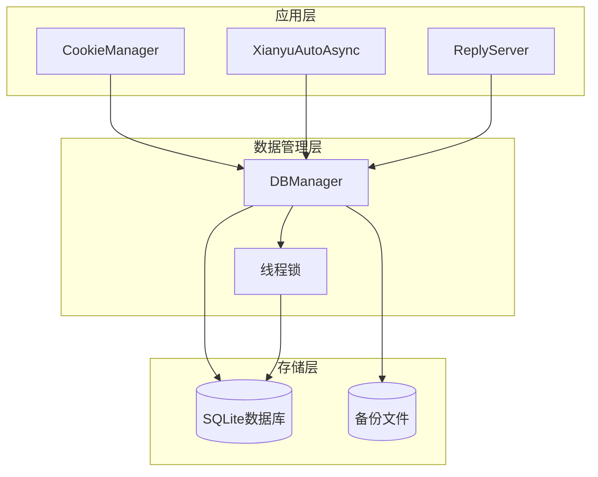
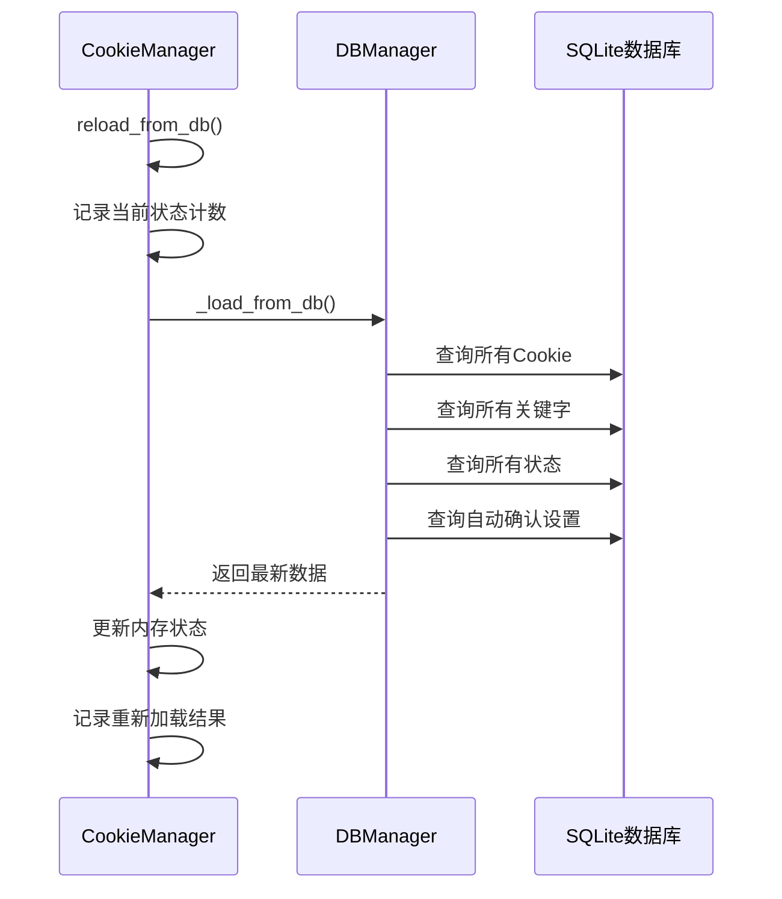
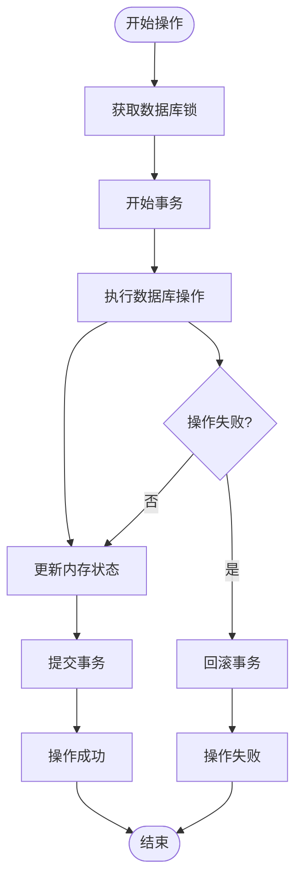
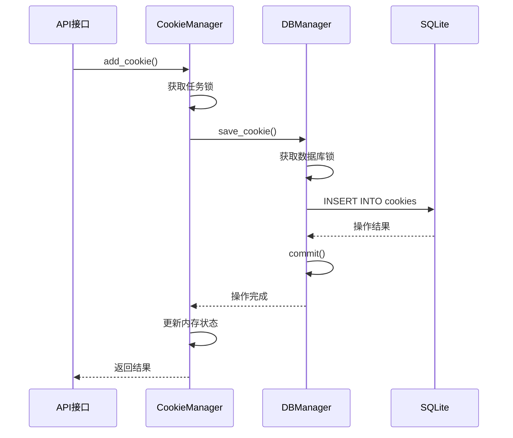
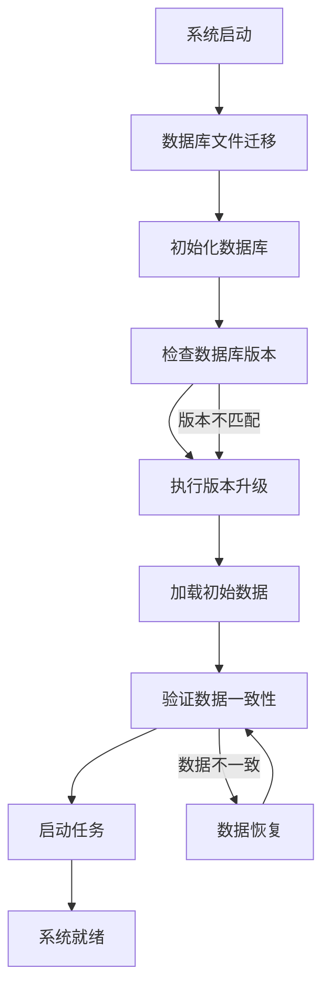
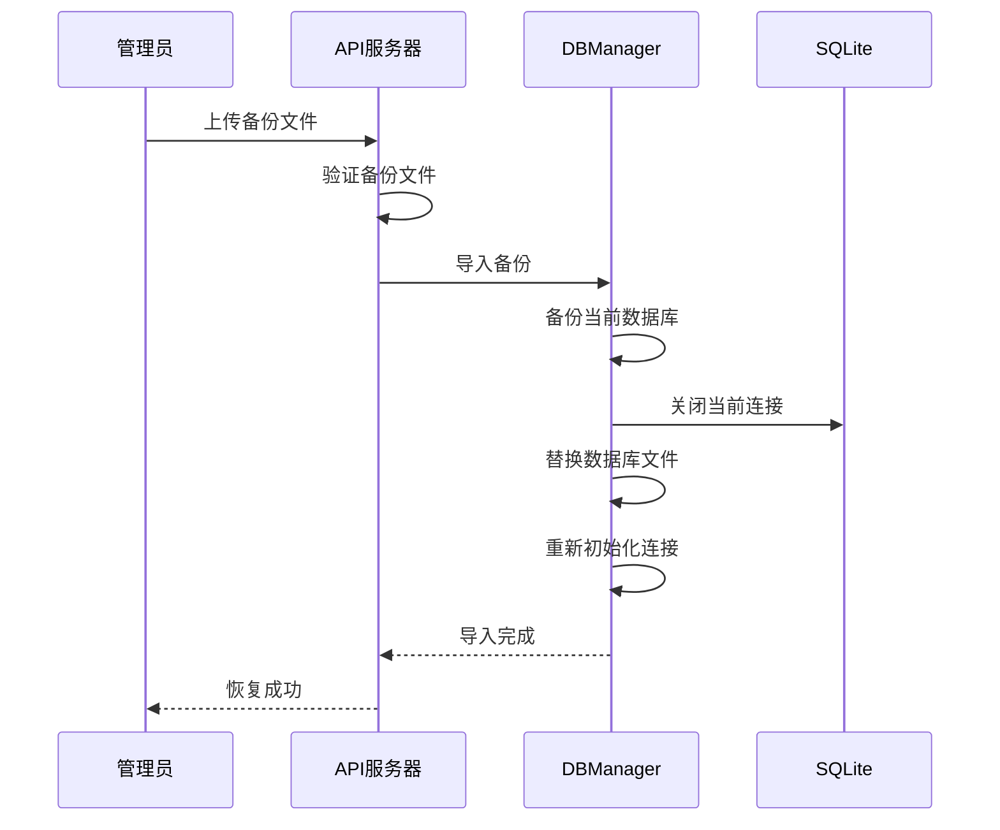
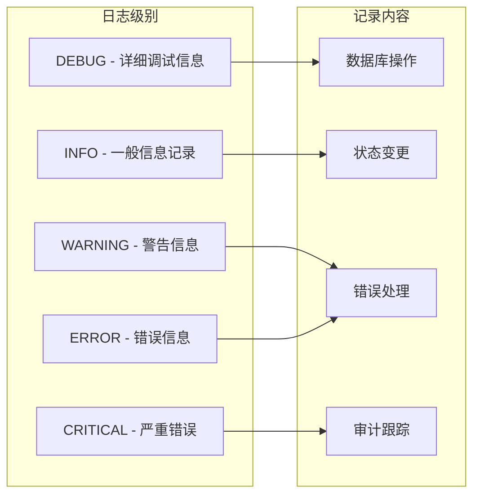

# 数据一致性保障

<cite>
**本文档引用的文件**
- [db_manager.py](file://db_manager.py)
- [cookie_manager.py](file://cookie_manager.py)
- [XianyuAutoAsync.py](file://XianyuAutoAsync.py)
- [Start.py](file://Start.py)
- [reply_server.py](file://reply_server.py)
</cite>

## 目录
1. [概述](#概述)
2. [系统架构](#系统架构)
3. [reload_from_db方法详解](#reload_from_db方法详解)
4. [数据库持久化与内存更新的原子性保证](#数据库持久化与内存更新的原子性保证)
5. [系统初始化一致性检查](#系统初始化一致性检查)
6. [数据库迁移与版本升级](#数据库迁移与版本升级)
7. [异常情况下的数据恢复](#异常情况下的数据恢复)
8. [日志记录与一致性审计](#日志记录与一致性审计)
9. [监控建议](#监控建议)
10. [故障排除指南](#故障排除指南)

## 概述

本系统采用多层次的数据一致性保障机制，确保内存状态与数据库状态始终保持同步。通过严格的事务管理、原子性操作、备份恢复机制和实时监控，系统能够在各种异常情况下维持数据的完整性和一致性。

## 系统架构



**图表来源**
- [db_manager.py](file://db_manager.py#L16-L52)
- [cookie_manager.py](file://cookie_manager.py#L10-L21)

## reload_from_db方法详解

### 方法设计原理

`reload_from_db`方法是系统数据重新加载的核心入口，专门用于在备份恢复、数据损坏检测或系统重启后强制从数据库重新加载所有数据。



**图表来源**
- [cookie_manager.py](file://cookie_manager.py#L23-L57)

### 实现细节

该方法的核心实现包含以下关键步骤：

1. **状态备份**：在重新加载前记录当前的Cookie和关键字数量
2. **批量数据加载**：通过单一数据库查询获取所有相关数据
3. **状态同步**：更新内存中的各种状态字典
4. **变更检测**：比较前后状态差异，记录变更信息

**章节来源**
- [cookie_manager.py](file://cookie_manager.py#L44-L57)

## 数据库持久化与内存更新的原子性保证

### 原子性操作策略

系统在关键操作中实现了严格的原子性保证，确保数据库操作和内存状态更新的一致性。



**图表来源**
- [db_manager.py](file://db_manager.py#L1200-L1211)
- [cookie_manager.py](file://cookie_manager.py#L112-L267)

### 关键操作的原子性实现

#### add_cookie操作



**图表来源**
- [cookie_manager.py](file://cookie_manager.py#L112-L141)

#### update_cookie操作

update_cookie操作采用了更复杂的原子性保证机制，确保在更新过程中不会丢失其他重要字段：

1. **状态保存**：保存原有的用户ID、关键词和状态信息
2. **任务重启**：先停止旧任务，确保数据一致性
3. **原子更新**：在同一个事务中更新Cookie值和其他字段
4. **状态恢复**：恢复原有的关键词和状态设置

**章节来源**
- [cookie_manager.py](file://cookie_manager.py#L215-L277)

#### remove_cookie操作

remove_cookie操作同样实现了完整的原子性保证：

1. **任务清理**：停止相关任务并等待清理完成
2. **数据删除**：从数据库中删除相关记录
3. **状态清理**：清除内存中的相关状态
4. **锁清理**：释放相关的任务锁

**章节来源**
- [cookie_manager.py](file://cookie_manager.py#L155-L181)

## 系统初始化一致性检查

### 启动时的数据完整性验证

系统在启动时执行严格的一致性检查，确保数据库和内存状态的正确性。



**图表来源**
- [Start.py](file://Start.py#L62-L144)
- [db_manager.py](file://db_manager.py#L557-L608)

### 初始化过程中的关键检查点

1. **数据库文件迁移**：确保数据库文件位于正确的位置
2. **表结构验证**：检查所有必要表的存在性和完整性
3. **数据完整性检查**：验证关键数据字段的完整性
4. **版本兼容性检查**：确保数据库版本与代码兼容

**章节来源**
- [Start.py](file://Start.py#L62-L144)
- [db_manager.py](file://db_manager.py#L67-L447)

## 数据库迁移与版本升级

### check_and_upgrade_db方法

系统提供了强大的数据库版本管理和升级机制，确保数据库结构随着系统演进而保持兼容性。

```mermaid
flowchart TD
START[开始升级检查] --> GET_VERSION[获取当前版本]
GET_VERSION --> COMPARE{版本比较}
COMPARE --> |1.0| UPGRADE_1_0[升级到1.0]
COMPARE --> |1.1| UPGRADE_1_1[升级到1.1]
COMPARE --> |1.2| UPGRADE_1_2[升级到1.2]
COMPARE --> |1.3| UPGRADE_1_3[升级到1.3]
COMPARE --> |1.4| UPGRADE_1_4[升级到1.4]
COMPARE --> |1.5| UPGRADE_1_5[升级到1.5]
UPGRADE_1_0 --> UPDATE_ADMIN[更新管理员用户]
UPDATE_ADMIN --> SET_VERSION[设置版本号]
SET_VERSION --> NEXT[下一个升级]
UPGRADE_1_1 --> UPGRADE_TABLE[升级通知渠道表]
UPGRADE_TABLE --> SET_VERSION
SET_VERSION --> NEXT
--其他升级路径类似--
NEXT --> MIGRATE_LEGACY[迁移遗留数据]
MIGRATE_LEGACY --> COMPLETE[升级完成]
```

**图表来源**
- [db_manager.py](file://db_manager.py#L557-L608)

### 迁移策略

系统采用渐进式升级策略，每个版本只执行必要的变更：

1. **版本检测**：读取当前数据库版本号
2. **增量升级**：只执行低于当前版本的升级步骤
3. **数据迁移**：处理遗留数据和结构变更
4. **版本标记**：更新数据库版本号

**章节来源**
- [db_manager.py](file://db_manager.py#L557-L608)

## 异常情况下的数据恢复

### 备份恢复机制

系统提供了完整的备份恢复机制，支持在数据损坏或丢失时快速恢复。



**图表来源**
- [reply_server.py](file://reply_server.py#L5253-L5281)

### 进程崩溃恢复

当系统遭遇进程崩溃时，具备以下恢复能力：

1. **自动重启**：系统能够自动重启并重新加载数据
2. **状态恢复**：通过reload_from_db方法恢复完整状态
3. **任务重建**：重新创建必要的后台任务
4. **连接重建**：重新建立数据库连接

**章节来源**
- [cookie_manager.py](file://cookie_manager.py#L44-L57)
- [Start.py](file://Start.py#L529-L576)

## 日志记录与一致性审计

### 日志记录策略

系统采用分级日志记录策略，确保数据操作的可追溯性：



**图表来源**
- [db_manager.py](file://db_manager.py#L53-L62)

### 一致性审计机制

系统通过以下机制确保数据一致性：

1. **操作日志**：记录所有数据库操作的详细信息
2. **状态对比**：定期对比内存状态与数据库状态
3. **异常监控**：监控异常操作并记录详细信息
4. **审计报告**：生成一致性审计报告

**章节来源**
- [db_manager.py](file://db_manager.py#L1200-L1211)
- [cookie_manager.py](file://cookie_manager.py#L23-L43)

## 监控建议

### 关键指标监控

为了及时发现状态不一致问题，建议监控以下关键指标：

| 监控指标 | 正常范围 | 异常阈值 | 监控频率 |
|---------|---------|---------|---------|
| 数据库连接状态 | 连接正常 | 连接失败率>5% | 实时 |
| 内存状态一致性 | 一致性>99% | 一致性<95% | 5分钟 |
| 数据库操作延迟 | <100ms | >500ms | 实时 |
| 任务执行成功率 | >99% | <95% | 实时 |
| 备份文件完整性 | 完整 | 缺失或损坏 | 每日 |

### 监控工具配置

建议部署以下监控工具：

1. **数据库监控**：监控SQLite性能和连接状态
2. **应用监控**：监控CookieManager和DBManager状态
3. **日志分析**：分析错误日志和一致性问题
4. **自动化告警**：设置异常情况的自动告警

## 故障排除指南

### 常见一致性问题及解决方案

#### 问题1：内存状态与数据库状态不一致

**症状**：系统显示的状态与实际数据库中的状态不符

**排查步骤**：
1. 检查数据库连接是否正常
2. 运行`reload_from_db()`方法重新加载数据
3. 检查最近的数据库操作日志
4. 验证数据库完整性

**解决方案**：
```python
# 强制重新加载数据
cookie_manager.manager.reload_from_db()
```

#### 问题2：数据库操作失败

**症状**：某些操作导致数据库事务回滚

**排查步骤**：
1. 检查数据库锁定状态
2. 验证数据库文件完整性
3. 检查磁盘空间是否充足
4. 分析错误日志

**解决方案**：
```python
# 重试机制示例
def safe_database_operation(operation_func):
    max_retries = 3
    for attempt in range(max_retries):
        try:
            return operation_func()
        except sqlite3.OperationalError as e:
            if "database is locked" in str(e):
                time.sleep(2 ** attempt)  # 指数退避
                continue
            raise
```

#### 问题3：数据迁移失败

**症状**：系统启动时数据库版本升级失败

**排查步骤**：
1. 检查数据库文件权限
2. 验证数据库完整性
3. 检查磁盘空间
4. 查看迁移日志

**解决方案**：
1. 手动备份当前数据库
2. 重置数据库版本号
3. 重新启动系统

**章节来源**
- [db_manager.py](file://db_manager.py#L557-L608)
- [cookie_manager.py](file://cookie_manager.py#L44-L57)