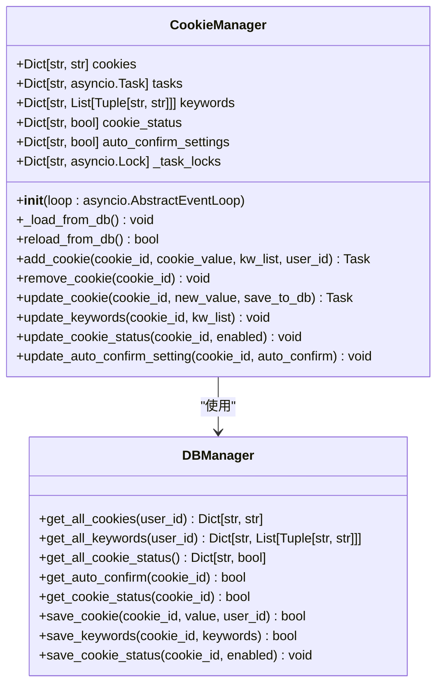
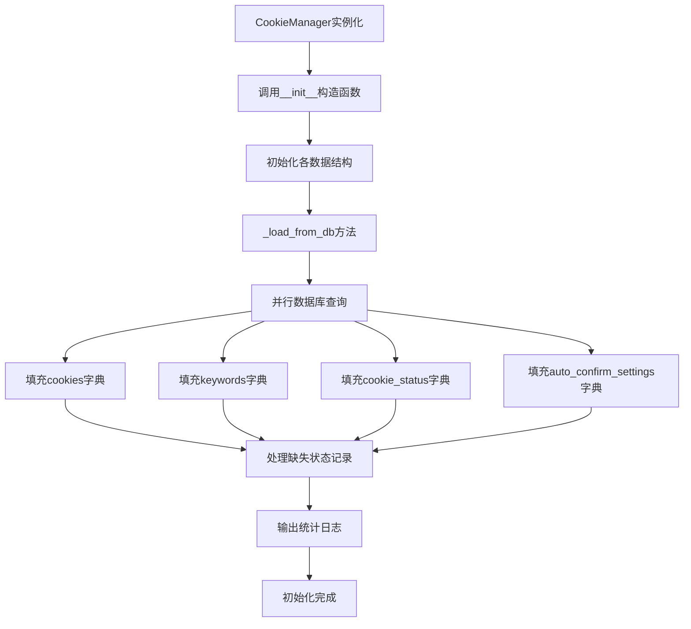
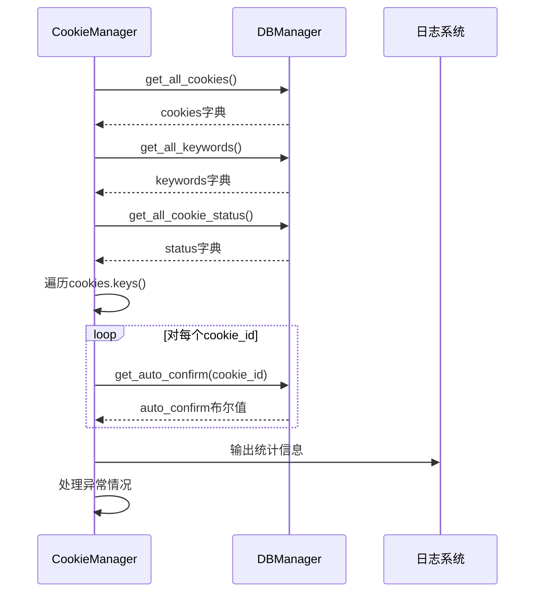
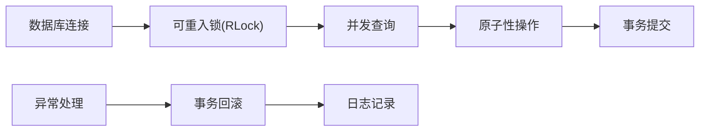
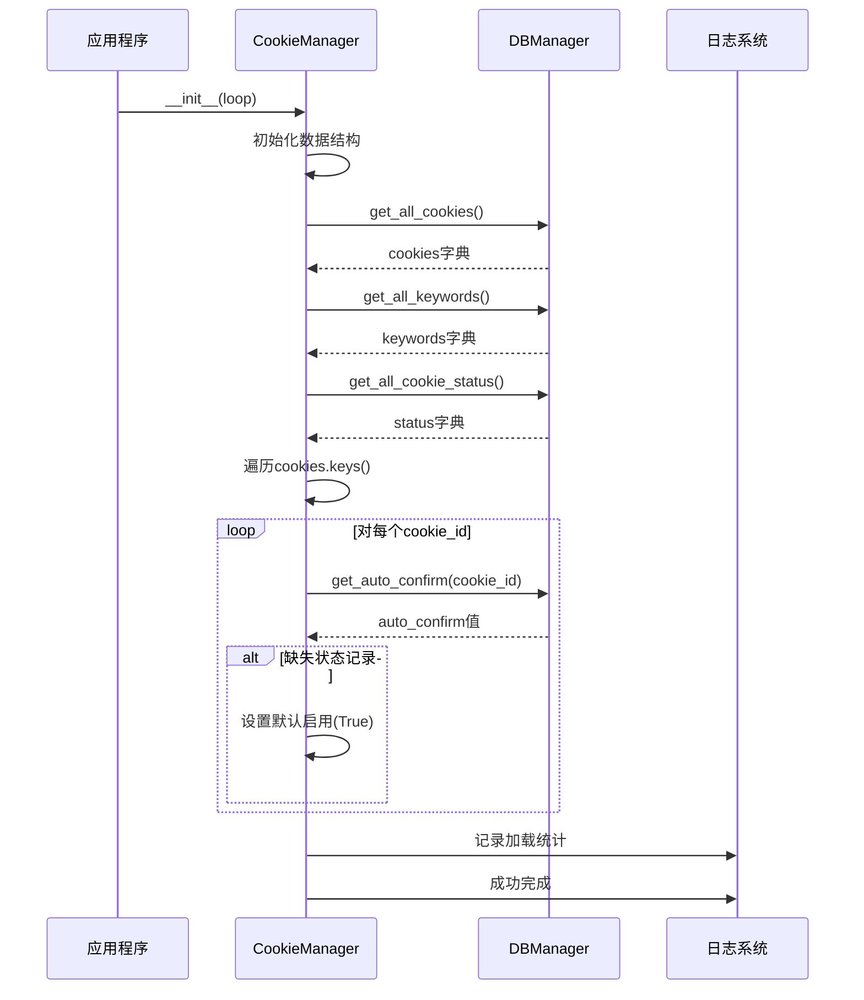
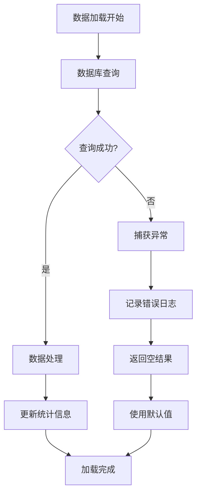
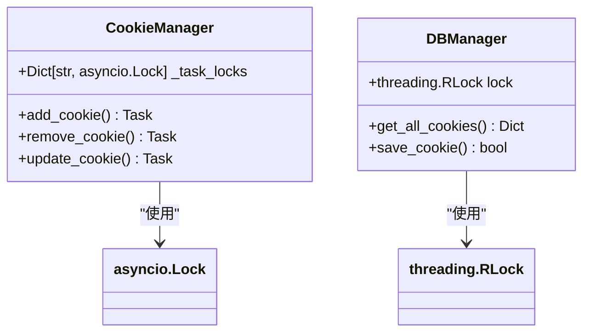

# 数据加载与初始化

<cite>
**本文档引用的文件**
- [cookie_manager.py](file://cookie_manager.py)
- [db_manager.py](file://db_manager.py)
- [config.py](file://config.py)
- [Start.py](file://Start.py)
</cite>

## 目录
1. [概述](#概述)
2. [CookieManager初始化架构](#cookiemanager初始化架构)
3. [核心数据结构](#核心数据结构)
4. [_load_from_db方法详解](#_load_from_db方法详解)
5. [数据库接口分析](#数据库接口分析)
6. [数据加载流程](#数据加载流程)
7. [异常处理机制](#异常处理机制)
8. [线程安全考虑](#线程安全考虑)
9. [性能优化策略](#性能优化策略)
10. [故障排除指南](#故障排除指南)

## 概述

CookieManager是系统的核心组件，负责管理多个账号的Cookie、关键字、状态和自动确认设置。其初始化过程通过`__init__`方法调用私有方法`_load_from_db`从数据库批量加载所有相关数据，建立完整的内存数据结构。

## CookieManager初始化架构



**图表来源**
- [cookie_manager.py](file://cookie_manager.py#L10-L428)
- [db_manager.py](file://db_manager.py#L16-L5103)

**章节来源**
- [cookie_manager.py](file://cookie_manager.py#L13-L21)
- [Start.py](file://Start.py#L524-L526)

## 核心数据结构

CookieManager维护以下关键数据结构：

### 主要成员变量

| 数据结构 | 类型 | 描述 | 初始化时机 |
|---------|------|------|-----------|
| `cookies` | `Dict[str, str]` | Cookie ID到Cookie值的映射 | `_load_from_db` |
| `tasks` | `Dict[str, asyncio.Task]` | Cookie ID到异步任务的映射 | `_run_xianyu` |
| `keywords` | `Dict[str, List[Tuple[str, str]]]` | Cookie ID到关键字列表的映射 | `_load_from_db` |
| `cookie_status` | `Dict[str, bool]` | Cookie ID到启用状态的映射 | `_load_from_db` |
| `auto_confirm_settings` | `Dict[str, bool]` | Cookie ID到自动确认设置的映射 | `_load_from_db` |
| `_task_locks` | `Dict[str, asyncio.Lock]` | 每个Cookie的并发控制锁 | 实例化时 |

### 数据结构初始化流程



**图表来源**
- [cookie_manager.py](file://cookie_manager.py#L13-L21)
- [cookie_manager.py](file://cookie_manager.py#L23-L48)

**章节来源**
- [cookie_manager.py](file://cookie_manager.py#L13-L21)

## _load_from_db方法详解

`_load_from_db`方法是数据加载的核心，采用批量查询策略提高效率：

### 方法签名与参数

```python
def _load_from_db(self):
    """从数据库加载所有Cookie、关键字和状态"""
```

### 加载顺序与依赖关系



**图表来源**
- [cookie_manager.py](file://cookie_manager.py#L23-L48)
- [db_manager.py](file://db_manager.py#L1225-L1234)

### 数据加载步骤详解

#### 1. Cookie加载
```python
# 加载所有Cookie
self.cookies = db_manager.get_all_cookies()
```
- **接口**: `db_manager.get_all_cookies()`
- **返回值**: `{cookie_id: cookie_value}`
- **用途**: 建立Cookie ID到值的映射关系

#### 2. 关键字加载
```python
# 加载所有关键字
self.keywords = db_manager.get_all_keywords()
```
- **接口**: `db_manager.get_all_keywords()`
- **返回值**: `{cookie_id: [(keyword, reply)]}`
- **用途**: 建立每个账号的关键字响应映射

#### 3. 状态加载
```python
# 加载所有Cookie状态（默认启用）
self.cookie_status = db_manager.get_all_cookie_status()
```
- **接口**: `db_manager.get_all_cookie_status()`
- **返回值**: `{cookie_id: enabled}`
- **用途**: 控制账号的启用/禁用状态

#### 4. 自动确认设置加载
```python
# 加载所有auto_confirm设置
self.auto_confirm_settings = {}
for cookie_id in self.cookies.keys():
    # 为没有状态记录的Cookie设置默认启用状态
    if cookie_id not in self.cookie_status:
        self.cookie_status[cookie_id] = True
    # 加载auto_confirm设置
    self.auto_confirm_settings[cookie_id] = db_manager.get_auto_confirm(cookie_id)
```
- **特殊处理**: 对于数据库中缺少状态记录的账号，设置默认启用状态
- **接口**: `db_manager.get_auto_confirm(cookie_id)`
- **返回值**: `bool`

**章节来源**
- [cookie_manager.py](file://cookie_manager.py#L23-L48)

## 数据库接口分析

### 核心数据库接口

#### get_all_cookies方法
```python
def get_all_cookies(self, user_id: int = None) -> Dict[str, str]:
    """获取所有Cookie（支持用户隔离）"""
```
- **SQL查询**: `SELECT id, value FROM cookies`
- **参数**: `user_id`（可选，用于用户隔离）
- **返回值**: `Dict[str, str]` - Cookie ID到值的映射
- **异常处理**: 返回空字典而非抛出异常

#### get_all_keywords方法
```python
def get_all_keywords(self, user_id: int = None) -> Dict[str, List[Tuple[str, str]]]:
    """获取所有Cookie的关键字（支持用户隔离）"""
```
- **SQL查询**: `SELECT cookie_id, keyword, reply FROM keywords`
- **返回值**: `Dict[str, List[Tuple[str, str]]]` - Cookie ID到关键字列表的映射
- **数据结构**: 每个Cookie对应多个`(keyword, reply)`元组

#### get_all_cookie_status方法
```python
def get_all_cookie_status(self) -> Dict[str, bool]:
    """获取所有Cookie的启用状态"""
```
- **SQL查询**: `SELECT cookie_id, enabled FROM cookie_status`
- **返回值**: `Dict[str, bool]` - Cookie ID到启用状态的映射
- **默认值**: 缺失记录返回`True`（启用）

#### get_auto_confirm方法
```python
def get_auto_confirm(self, cookie_id: str) -> bool:
    """获取Cookie的自动确认发货设置"""
```
- **SQL查询**: `SELECT auto_confirm FROM cookies WHERE id = ?`
- **返回值**: `bool` - 自动确认设置
- **默认值**: 缺失记录返回`True`（开启）

### 数据库事务与并发控制



**图表来源**
- [db_manager.py](file://db_manager.py#L49-L52)
- [db_manager.py](file://db_manager.py#L1225-L1234)

**章节来源**
- [db_manager.py](file://db_manager.py#L1225-L1234)
- [db_manager.py](file://db_manager.py#L1695-L1719)
- [db_manager.py](file://db_manager.py#L1749-L1764)
- [db_manager.py](file://db_manager.py#L1443-L1455)

## 数据加载流程

### 完整加载序列



**图表来源**
- [cookie_manager.py](file://cookie_manager.py#L13-L21)
- [cookie_manager.py](file://cookie_manager.py#L23-L48)

### 缺失状态记录处理逻辑

系统对数据库中缺失状态记录的账号采用智能处理策略：

#### 处理算法
```python
# 为没有状态记录的Cookie设置默认启用状态
if cookie_id not in self.cookie_status:
    self.cookie_status[cookie_id] = True
```

#### 设计原理
1. **向后兼容**: 确保新添加的账号自动启用
2. **用户体验**: 避免因配置缺失导致账号不可用
3. **数据完整性**: 保证所有账号都能正常工作

### 统计日志输出

```python
logger.info(f"从数据库加载了 {len(self.cookies)} 个Cookie、{len(self.keywords)} 组关键字、{len(self.cookie_status)} 个状态记录和 {len(self.auto_confirm_settings)} 个自动确认设置")
```

#### 日志内容分析
- **Cookie数量**: `len(self.cookies)`
- **关键字组数**: `len(self.keywords)`（每组可能包含多个关键词）
- **状态记录数**: `len(self.cookie_status)`
- **自动确认设置数**: `len(self.auto_confirm_settings)`

**章节来源**
- [cookie_manager.py](file://cookie_manager.py#L23-L48)

## 异常处理机制

### 分层异常处理策略



**图表来源**
- [cookie_manager.py](file://cookie_manager.py#L25-L42)

### 异常处理层次

#### 1. 数据库查询异常
```python
try:
    # 数据库查询操作
    self.cookies = db_manager.get_all_cookies()
except Exception as e:
    logger.error(f"获取所有Cookie失败: {e}")
    return {}
```

#### 2. 数据处理异常
```python
try:
    # 数据处理逻辑
    for cookie_id in self.cookies.keys():
        self.auto_confirm_settings[cookie_id] = db_manager.get_auto_confirm(cookie_id)
except Exception as e:
    logger.error(f"处理自动确认设置失败: {e}")
    # 使用默认值而非中断
    self.auto_confirm_settings[cookie_id] = True
```

#### 3. 默认值策略
- **Cookie状态**: 缺失时默认启用(`True`)
- **自动确认**: 缺失时默认开启(`True`)
- **关键字**: 缺失时为空列表(`[]`)

### 错误恢复机制

#### 数据库连接失败处理
```python
# db_manager中实现的连接池和重试机制
def _execute_sql(self, cursor, sql, params=None):
    try:
        if params:
            cursor.execute(sql, params)
        else:
            cursor.execute(sql)
    except sqlite3.OperationalError as e:
        if "database is locked" in str(e):
            # 数据库锁定，等待重试
            time.sleep(0.1)
            return self._execute_sql(cursor, sql, params)
        else:
            raise
```

**章节来源**
- [cookie_manager.py](file://cookie_manager.py#L25-L42)
- [db_manager.py](file://db_manager.py#L1225-L1237)

## 线程安全考虑

### 并发控制策略



**图表来源**
- [cookie_manager.py](file://cookie_manager.py#L20)
- [db_manager.py](file://db_manager.py#L51)

### 锁机制设计

#### 1. 数据库级锁
```python
# DBManager使用可重入锁
self.lock = threading.RLock()

def get_all_cookies(self, user_id: int = None) -> Dict[str, str]:
    with self.lock:
        # 数据库操作
        cursor = self.conn.cursor()
        # 查询逻辑
        return {row[0]: row[1] for row in cursor.fetchall()}
```

#### 2. 任务级锁
```python
# CookieManager为每个Cookie维护独立锁
if cookie_id not in self._task_locks:
    self._task_locks[cookie_id] = asyncio.Lock()

async with self._task_locks[cookie_id]:
    # 任务操作
    pass
```

### 并发访问模式

#### 读操作并发
- **多个线程同时读取**: 完全并发，使用数据库连接池
- **读写分离**: 读操作不影响写操作

#### 写操作串行化
- **Cookie更新**: 使用Cookie级别的锁
- **状态变更**: 使用Cookie级别的锁
- **关键字修改**: 使用Cookie级别的锁

**章节来源**
- [db_manager.py](file://db_manager.py#L51)
- [cookie_manager.py](file://cookie_manager.py#L20)
- [cookie_manager.py](file://cookie_manager.py#L113-L137)

## 性能优化策略

### 批量查询优化

#### 1. 减少数据库往返
```python
# 单次查询获取所有数据
self.cookies = db_manager.get_all_cookies()
self.keywords = db_manager.get_all_keywords()
self.cookie_status = db_manager.get_all_cookie_status()
```

#### 2. 连接池管理
```python
# SQLite连接配置
self.conn = sqlite3.connect(self.db_path, check_same_thread=False)
```

### 内存使用优化

#### 1. 按需加载
```python
# 延迟加载非关键数据
def get_auto_confirm_setting(self, cookie_id: str) -> bool:
    return self.auto_confirm_settings.get(cookie_id, True)
```

#### 2. 数据结构选择
- **字典**: O(1)查找时间
- **列表**: 连续内存布局，缓存友好
- **元组**: 不可变对象，节省内存

### 缓存策略

#### 1. 内存缓存
```python
# CookieManager维护多层缓存
self.cookies = {}           # Cookie值缓存
self.keywords = {}          # 关键字缓存
self.cookie_status = {}     # 状态缓存
self.auto_confirm_settings = {}  # 设置缓存
```

#### 2. 数据库缓存
```python
# SQLite内置缓存机制
PRAGMA cache_size = 10000;
PRAGMA synchronous = NORMAL;
PRAGMA journal_mode = WAL;
```

**章节来源**
- [cookie_manager.py](file://cookie_manager.py#L26-L39)
- [db_manager.py](file://db_manager.py#L70)

## 故障排除指南

### 常见问题诊断

#### 1. 数据加载失败
**症状**: 日志显示"从数据库加载数据失败"
**排查步骤**:
```python
# 检查数据库连接
try:
    db_manager.conn.ping()
except Exception as e:
    logger.error(f"数据库连接失败: {e}")

# 检查表结构
cursor.execute("PRAGMA table_info(cookies)")
columns = cursor.fetchall()
logger.info(f"Cookies表结构: {columns}")
```

#### 2. 缺失状态记录
**症状**: 某些账号状态异常
**解决方案**:
```python
# 手动修复状态记录
for cookie_id in manager.cookies.keys():
    if cookie_id not in manager.cookie_status:
        manager.update_cookie_status(cookie_id, True)
        logger.info(f"已为{cookie_id}设置默认启用状态")
```

#### 3. 性能问题
**症状**: 数据加载缓慢
**优化措施**:
```python
# 启用数据库性能监控
db_manager.sql_log_enabled = True
db_manager.sql_log_level = 'DEBUG'

# 优化数据库索引
cursor.execute("CREATE INDEX IF NOT EXISTS idx_cookies_user_id ON cookies(user_id)")
cursor.execute("CREATE INDEX IF NOT EXISTS idx_keywords_cookie_id ON keywords(cookie_id)")
```

### 监控指标

#### 关键性能指标(KPI)
- **加载时间**: 数据库查询总耗时
- **内存使用**: 各数据结构内存占用
- **并发度**: 同时处理的任务数量
- **错误率**: 异常处理成功率

#### 监控实现
```python
import time
import psutil

class LoadMonitor:
    def __init__(self):
        self.start_time = time.time()
        self.memory_start = psutil.Process().memory_info().rss
        
    def log_metrics(self, cookie_count, keyword_count):
        elapsed = time.time() - self.start_time
        memory_used = psutil.Process().memory_info().rss - self.memory_start
        logger.info(f"加载完成: {elapsed:.2f}s, {memory_used/1024/1024:.2f}MB, "
                   f"{cookie_count}个Cookie, {keyword_count}组关键字")
```

**章节来源**
- [cookie_manager.py](file://cookie_manager.py#L41-L42)
- [db_manager.py](file://db_manager.py#L53-L62)

## 结论

CookieManager的数据加载与初始化机制通过精心设计的架构实现了高效、可靠的数据管理。其核心特点包括：

1. **批量加载策略**: 通过并行数据库查询显著提升加载效率
2. **智能异常处理**: 采用渐进式降级策略确保系统稳定性
3. **完善的并发控制**: 多层次锁机制保证数据一致性
4. **灵活的默认值策略**: 确保系统在各种配置情况下的可用性
5. **全面的监控支持**: 提供详细的性能指标和故障诊断能力

这种设计不仅满足了系统的高并发需求，还为未来的功能扩展提供了良好的基础架构支撑。