# 状态变更同步

<cite>
**本文档引用的文件**
- [cookie_manager.py](file://cookie_manager.py)
- [db_manager.py](file://db_manager.py)
- [XianyuAutoAsync.py](file://XianyuAutoAsync.py)
- [reply_server.py](file://reply_server.py)
- [config.py](file://config.py)
</cite>

## 目录
1. [概述](#概述)
2. [系统架构](#系统架构)
3. [核心组件分析](#核心组件分析)
4. [状态变更流程](#状态变更流程)
5. [内存与数据库同步机制](#内存与数据库同步机制)
6. [任务启停逻辑](#任务启停逻辑)
7. [并发控制与锁机制](#并发控制与锁机制)
8. [实际调用链路示例](#实际调用链路示例)
9. [潜在竞态条件与防护](#潜在竞态条件与防护)
10. [故障排除指南](#故障排除指南)

## 概述

本系统实现了多层级的状态变更同步机制，确保账号启用状态、关键字配置、自动确认设置等关键状态在内存缓存和数据库之间保持一致。系统采用先修改内存状态再持久化到数据库的执行顺序，配合完善的锁机制和任务管理逻辑，保障数据一致性和系统稳定性。

## 系统架构

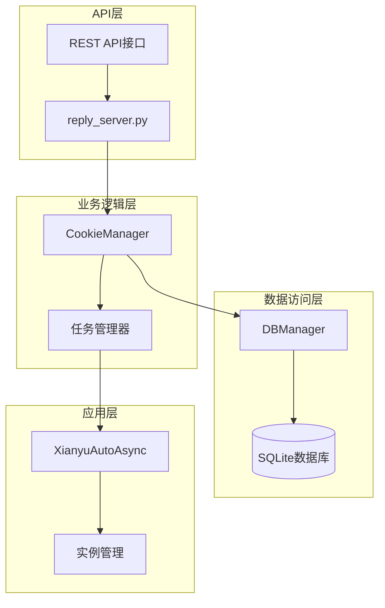

**图表来源**
- [cookie_manager.py](file://cookie_manager.py#L10-L428)
- [db_manager.py](file://db_manager.py#L16-L800)
- [reply_server.py](file://reply_server.py#L2337-L2355)

## 核心组件分析

### CookieManager - 状态管理中心

CookieManager是状态变更的核心协调器，负责管理所有账号的状态信息：

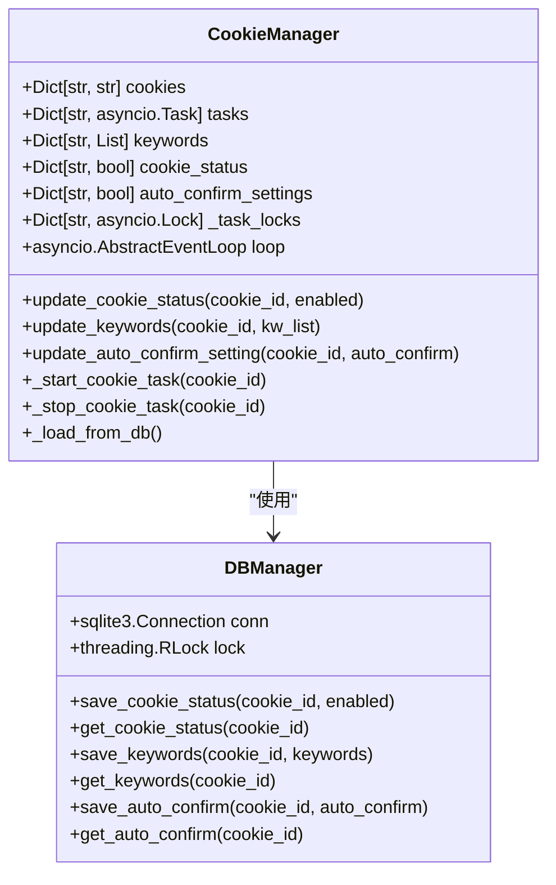

**图表来源**
- [cookie_manager.py](file://cookie_manager.py#L10-L428)
- [db_manager.py](file://db_manager.py#L16-L800)

**章节来源**
- [cookie_manager.py](file://cookie_manager.py#L10-L428)
- [db_manager.py](file://db_manager.py#L16-L800)

### 数据库管理层

DBManager提供线程安全的数据持久化服务，确保状态变更的原子性：

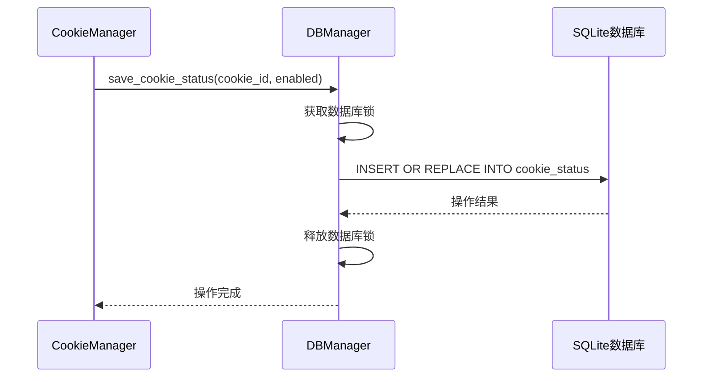

**图表来源**
- [db_manager.py](file://db_manager.py#L1722-L1735)

**章节来源**
- [db_manager.py](file://db_manager.py#L1722-L1735)

## 状态变更流程

### update_cookie_status方法详解

update_cookie_status方法是状态变更的核心入口，遵循"内存优先，数据库持久化"的执行顺序：

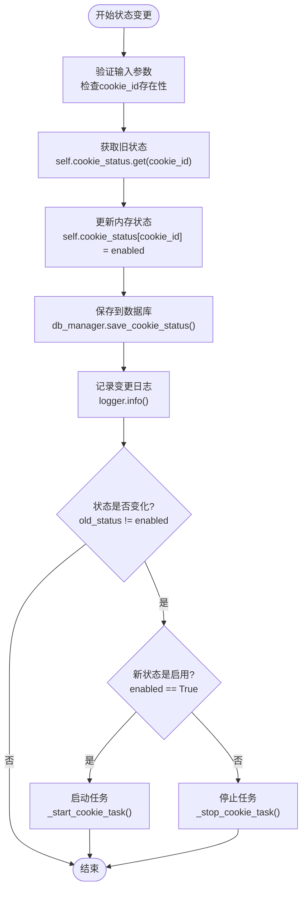

**图表来源**
- [cookie_manager.py](file://cookie_manager.py#L303-L321)

**章节来源**
- [cookie_manager.py](file://cookie_manager.py#L303-L321)

### 状态变更的执行顺序

系统严格遵循以下执行顺序以确保数据一致性：

1. **内存状态更新**：首先修改内存中的状态字典
2. **数据库持久化**：将状态变更持久化到数据库
3. **任务管理**：根据状态变化启动或停止相关任务
4. **日志记录**：记录完整的变更过程

这种顺序设计避免了数据库操作失败导致内存状态不一致的问题。

## 内存与数据库同步机制

### 双写一致性保证

系统通过以下机制确保内存与数据库的双写一致性：

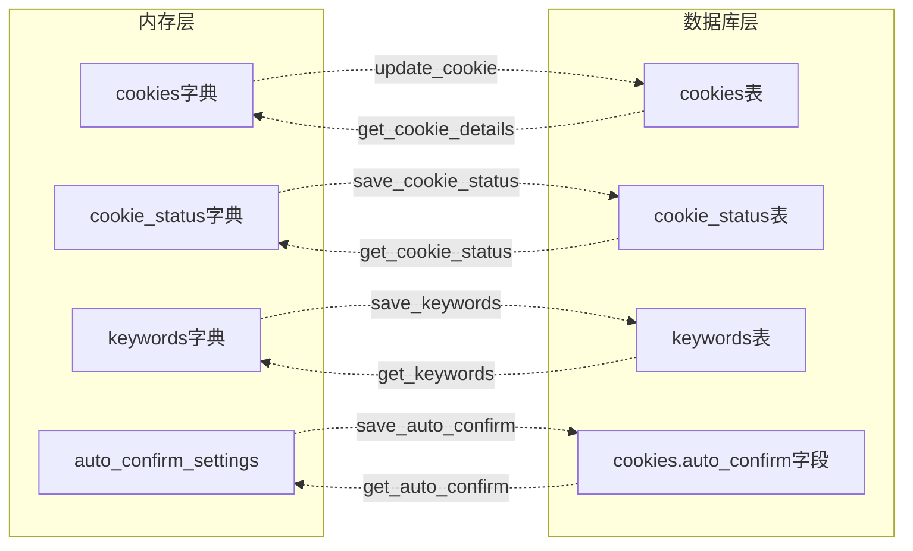

**图表来源**
- [cookie_manager.py](file://cookie_manager.py#L15-L20)
- [db_manager.py](file://db_manager.py#L110-L147)

### 其他状态同步操作

#### update_keywords方法

关键字更新同样遵循内存优先原则：

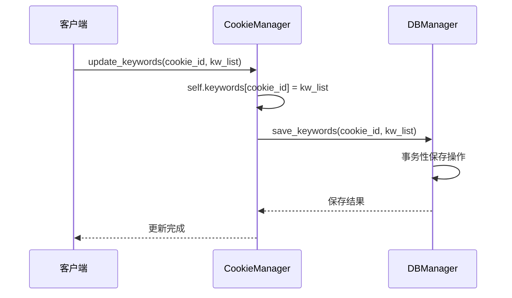

**图表来源**
- [cookie_manager.py](file://cookie_manager.py#L289-L294)

#### update_auto_confirm_setting方法

自动确认设置的实时更新机制：

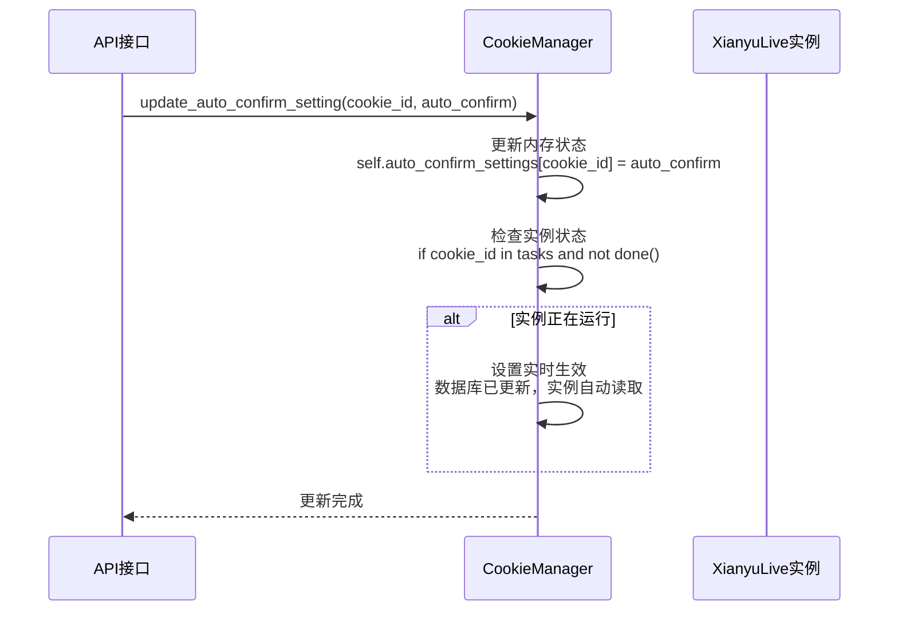

**图表来源**
- [cookie_manager.py](file://cookie_manager.py#L406-L419)

**章节来源**
- [cookie_manager.py](file://cookie_manager.py#L289-L294)
- [cookie_manager.py](file://cookie_manager.py#L406-L419)

## 任务启停逻辑

### _start_cookie_task方法

当账号状态从禁用变为启用时，系统会调用_start_cookie_task启动相关任务：

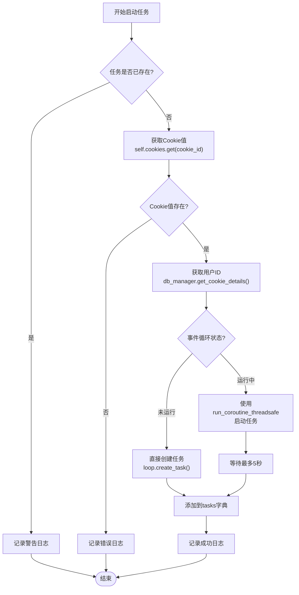

**图表来源**
- [cookie_manager.py](file://cookie_manager.py#L332-L363)

### _stop_cookie_task方法

当账号状态从启用变为禁用时，系统会调用_stop_cookie_task停止相关任务：

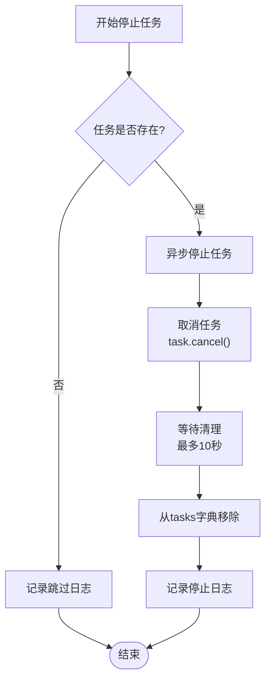

**图表来源**
- [cookie_manager.py](file://cookie_manager.py#L365-L404)

**章节来源**
- [cookie_manager.py](file://cookie_manager.py#L332-L363)
- [cookie_manager.py](file://cookie_manager.py#L365-L404)

## 并发控制与锁机制

### _task_locks锁机制

系统使用专门的锁字典防止并发状态变更冲突：

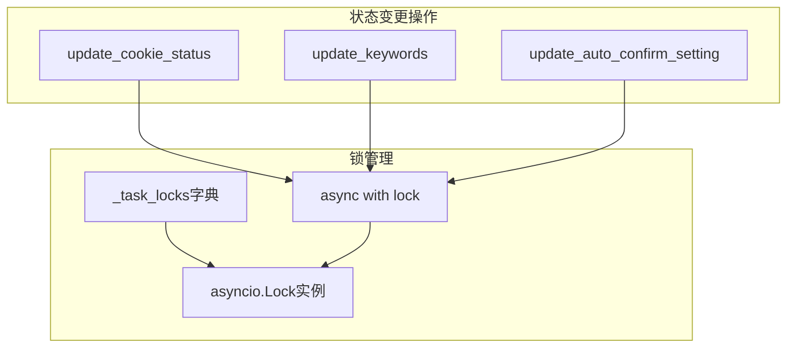

**图表来源**
- [cookie_manager.py](file://cookie_manager.py#L20-L21)

### 锁的生命周期管理

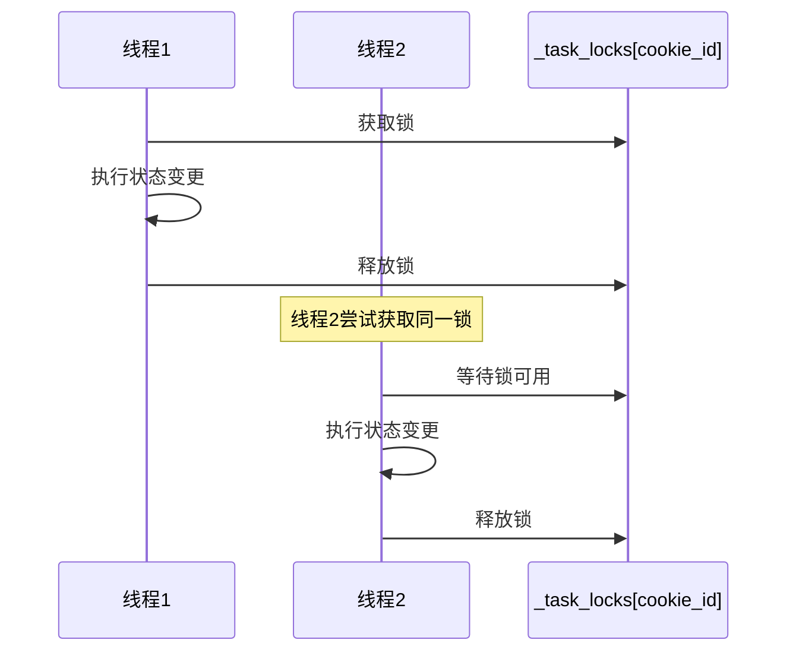

**图表来源**
- [cookie_manager.py](file://cookie_manager.py#L112-L117)

**章节来源**
- [cookie_manager.py](file://cookie_manager.py#L20-L21)
- [cookie_manager.py](file://cookie_manager.py#L112-L117)

## 实际调用链路示例

### API调用到状态变更的完整链路

以下是典型的API调用到状态变更的完整执行链路：

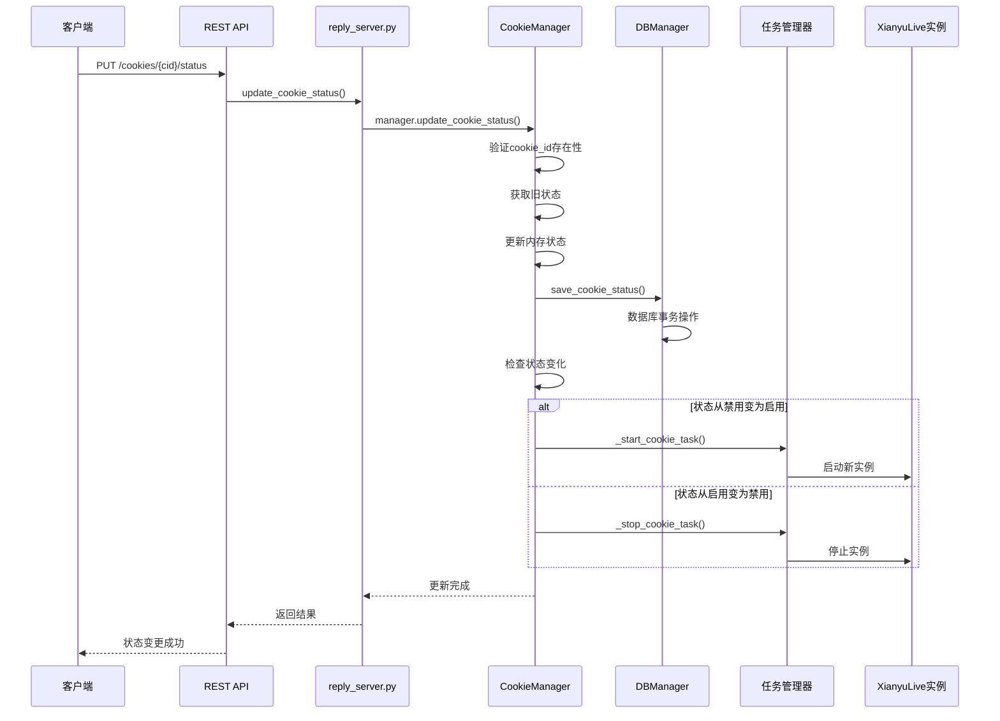

**图表来源**
- [reply_server.py](file://reply_server.py#L2337-L2355)
- [cookie_manager.py](file://cookie_manager.py#L303-L321)

### 关键字更新的调用链路

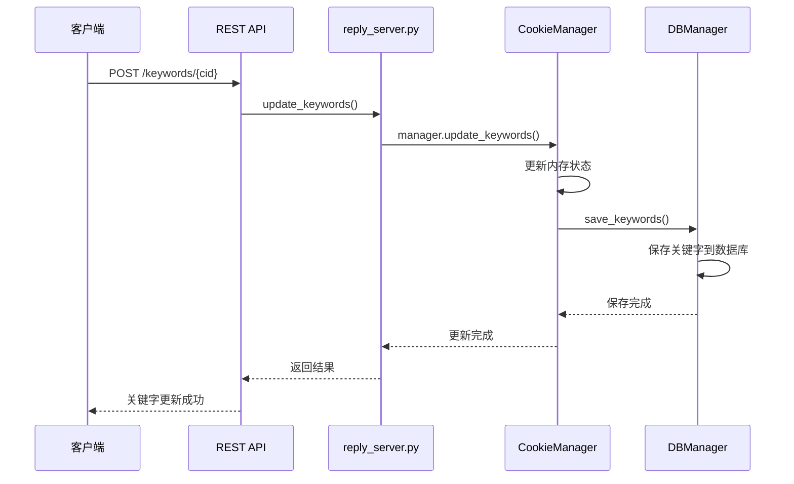

**图表来源**
- [reply_server.py](file://reply_server.py#L3077-L3095)
- [cookie_manager.py](file://cookie_manager.py#L289-L294)

**章节来源**
- [reply_server.py](file://reply_server.py#L2337-L2355)
- [reply_server.py](file://reply_server.py#L3077-L3095)

## 潜在竞态条件与防护

### 主要竞态条件场景

系统面临的主要竞态条件包括：

1. **并发状态变更**：多个请求同时修改同一账号状态
2. **任务启动与停止冲突**：状态变更与任务管理的并发操作
3. **数据库写入竞争**：内存状态与数据库的同步写入

### 锁机制防护策略

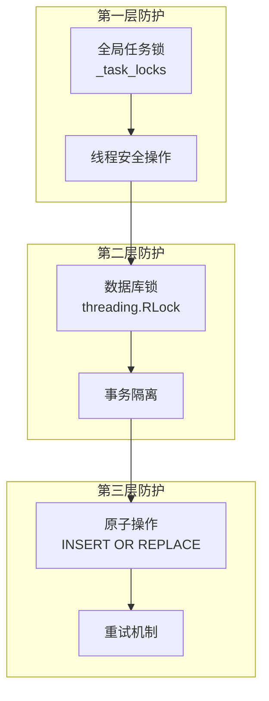

**图表来源**
- [cookie_manager.py](file://cookie_manager.py#L20-L21)
- [db_manager.py](file://db_manager.py#L51-L52)

### 防护措施详解

#### 1. 任务锁防护

```python
# CookieManager._task_locks的使用示例
async with self._task_locks[cookie_id]:
    # 确保同一cookie_id的状态变更互斥执行
    self.cookie_status[cookie_id] = enabled
    db_manager.save_cookie_status(cookie_id, enabled)
```

#### 2. 数据库锁防护

```python
# DBManager使用可重入锁保护数据库操作
with self.lock:
    cursor.execute('''
        INSERT OR REPLACE INTO cookie_status 
        (cookie_id, enabled, updated_at) 
        VALUES (?, ?, CURRENT_TIMESTAMP)
    ''', (cookie_id, enabled))
```

#### 3. 原子操作保证

```sql
-- 使用INSERT OR REPLACE确保原子性
INSERT OR REPLACE INTO cookie_status (cookie_id, enabled, updated_at)
VALUES (?, ?, CURRENT_TIMESTAMP)
```

**章节来源**
- [cookie_manager.py](file://cookie_manager.py#L20-L21)
- [db_manager.py](file://db_manager.py#L51-L52)
- [db_manager.py](file://db_manager.py#L1722-L1735)

## 故障排除指南

### 常见问题诊断

#### 1. 状态不同步问题

**症状**：内存状态与数据库状态不一致
**排查步骤**：
1. 检查锁机制是否正常工作
2. 验证数据库事务是否成功提交
3. 确认内存状态更新是否在数据库操作之前

**解决方案**：
```python
# 添加调试日志确认执行顺序
logger.debug(f"更新内存状态: {cookie_id} -> {enabled}")
db_manager.save_cookie_status(cookie_id, enabled)
logger.debug(f"数据库保存完成: {cookie_id} -> {enabled}")
```

#### 2. 任务启动失败

**症状**：状态变更后任务未能正确启动
**排查步骤**：
1. 检查Cookie值是否有效
2. 验证事件循环状态
3. 确认任务锁是否正确释放

**解决方案**：
```python
# 添加任务启动失败的重试机制
try:
    self._start_cookie_task(cookie_id)
except Exception as e:
    logger.error(f"任务启动失败，尝试重新启动: {e}")
    # 实现指数退避重试
```

#### 3. 并发冲突导致的死锁

**症状**：系统响应缓慢或卡死
**排查步骤**：
1. 检查锁的获取和释放是否配对
2. 验证锁的超时设置是否合理
3. 监控锁的竞争情况

**解决方案**：
```python
# 实现锁超时和监控
async with asyncio.timeout(30):  # 30秒超时
    async with self._task_locks[cookie_id]:
        # 执行状态变更操作
        pass
```

### 性能优化建议

#### 1. 批量操作优化

对于大量状态变更，建议使用批量操作减少数据库交互：

```python
# 批量更新示例
def batch_update_cookie_status(self, updates: Dict[str, bool]):
    """批量更新多个账号的状态"""
    with self.lock:
        for cookie_id, enabled in updates.items():
            self.cookie_status[cookie_id] = enabled
            db_manager.save_cookie_status(cookie_id, enabled)
```

#### 2. 缓存策略优化

合理使用内存缓存减少数据库查询：

```python
# 实现状态缓存
class StatusCache:
    def __init__(self):
        self.cache = {}
        self.cache_ttl = 300  # 5分钟TTL
    
    def get_status(self, cookie_id: str) -> Optional[bool]:
        if cookie_id in self.cache:
            cached, timestamp = self.cache[cookie_id]
            if time.time() - timestamp < self.cache_ttl:
                return cached
        # 缓存失效，从数据库重新加载
        status = db_manager.get_cookie_status(cookie_id)
        self.cache[cookie_id] = (status, time.time())
        return status
```

#### 3. 异步操作优化

对于耗时的状态变更操作，使用异步处理避免阻塞：

```python
# 异步状态变更
async def async_update_cookie_status(self, cookie_id: str, enabled: bool):
    """异步更新Cookie状态"""
    async with self._task_locks[cookie_id]:
        # 非阻塞的状态变更
        self.cookie_status[cookie_id] = enabled
        await asyncio.to_thread(db_manager.save_cookie_status, cookie_id, enabled)
```

**章节来源**
- [cookie_manager.py](file://cookie_manager.py#L303-L321)
- [db_manager.py](file://db_manager.py#L1722-L1735)

## 结论

本系统通过精心设计的状态变更同步机制，实现了内存与数据库之间的高度一致性。通过严格的执行顺序、完善的锁机制和任务管理逻辑，系统能够在高并发环境下稳定运行，确保账号状态变更的准确性和可靠性。开发者在使用和扩展该系统时，应当充分理解这些机制的工作原理，并遵循既定的设计模式，以维护系统的整体稳定性。