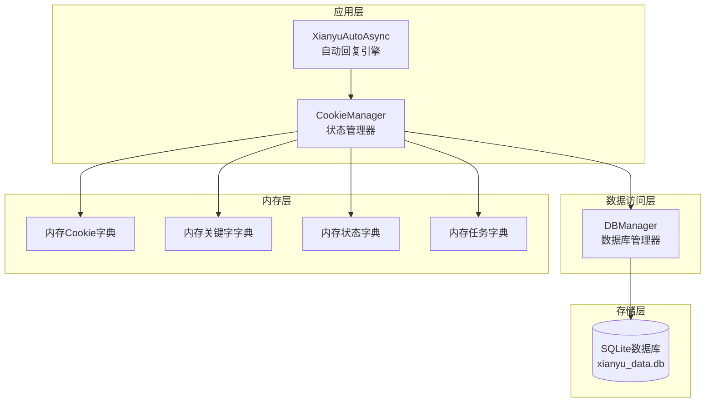
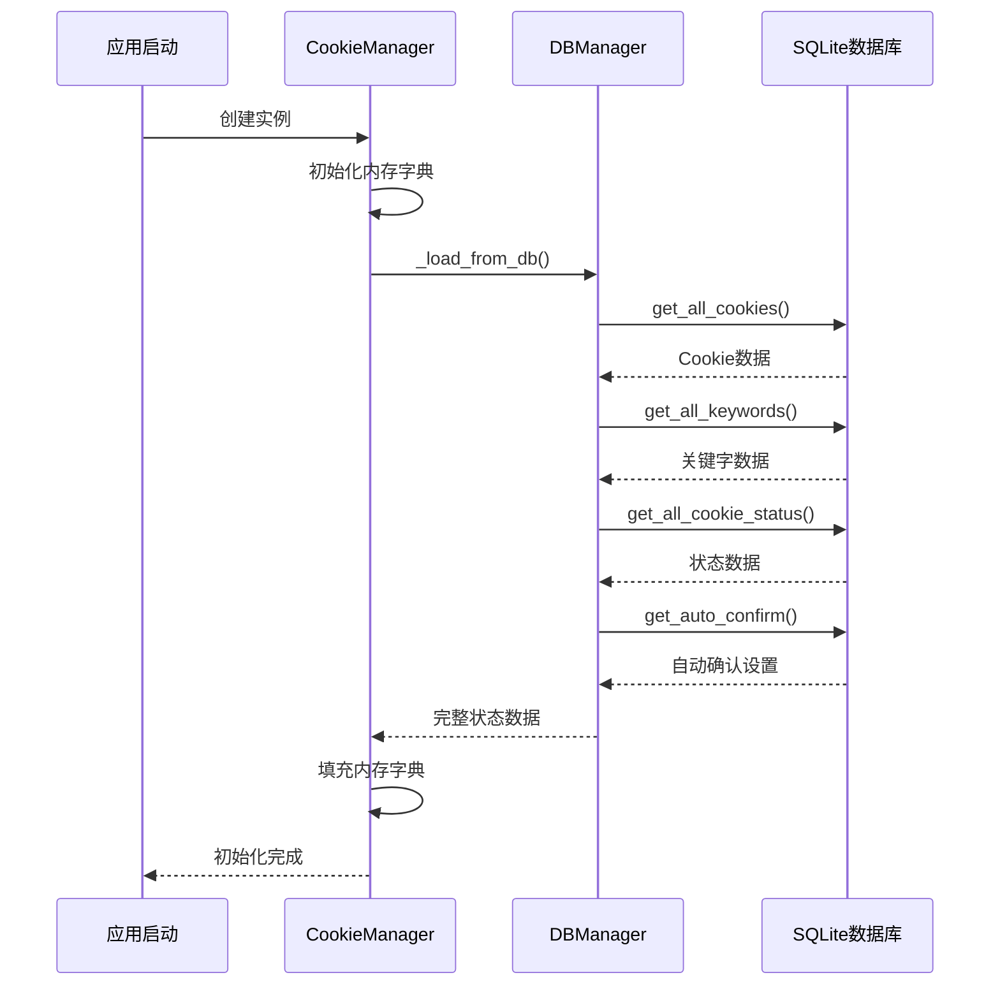
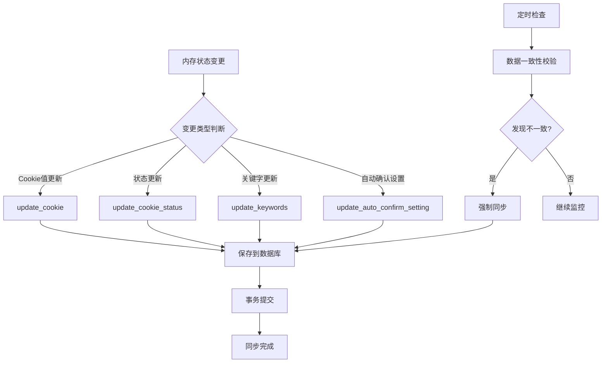
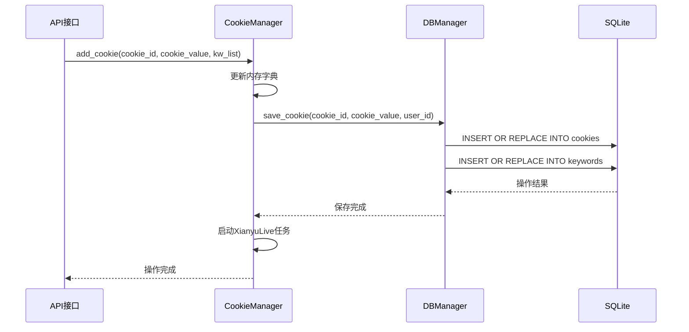
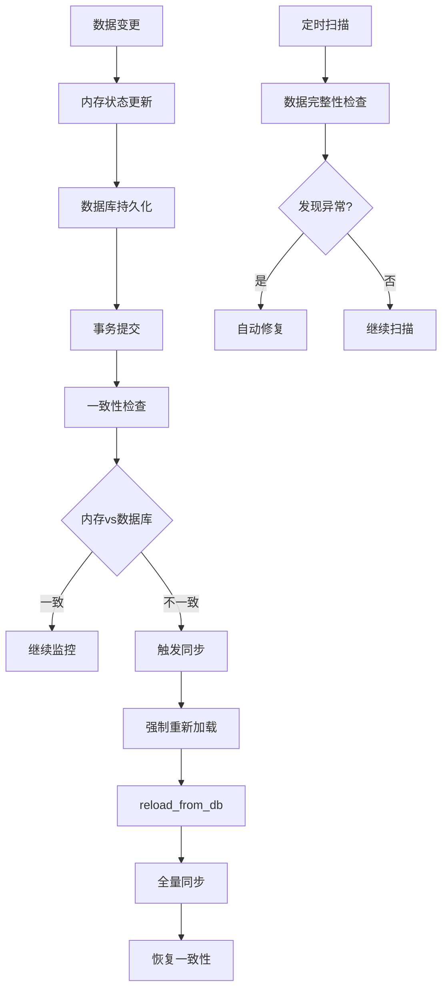
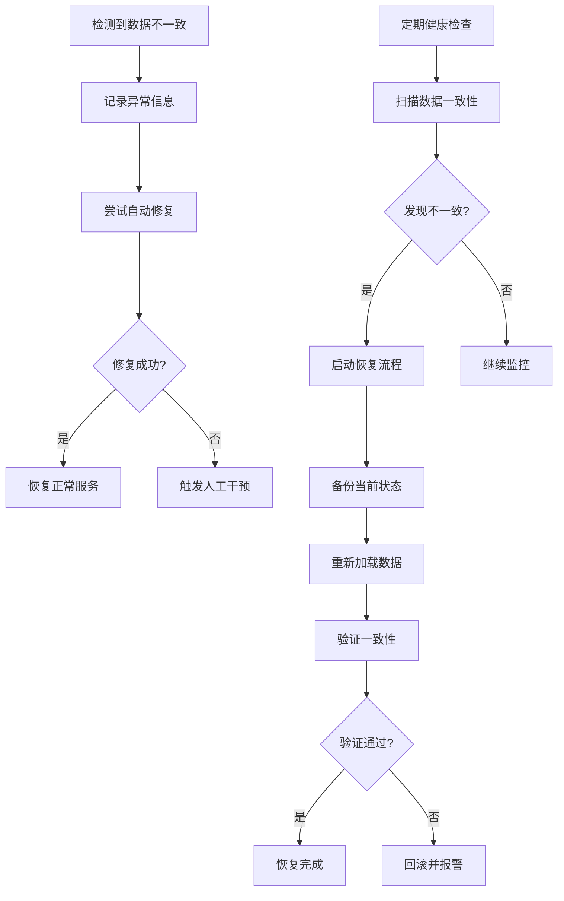

# 状态持久化与同步

<cite>
**本文档引用的文件**
- [cookie_manager.py](file://cookie_manager.py)
- [db_manager.py](file://db_manager.py)
- [config.py](file://config.py)
- [XianyuAutoAsync.py](file://XianyuAutoAsync.py)
</cite>

## 目录
1. [概述](#概述)
2. [系统架构](#系统架构)
3. [CookieManager核心机制](#cookiemanager核心机制)
4. [数据库管理层](#数据库管理层)
5. [状态同步机制](#状态同步机制)
6. [数据持久化策略](#数据持久化策略)
7. [数据一致性保障](#数据一致性保障)
8. [故障恢复机制](#故障恢复机制)
9. [性能优化考虑](#性能优化考虑)
10. [总结](#总结)

## 概述

本系统采用内存-数据库双层状态管理模式，通过CookieManager和DBManager两个核心组件实现账号状态在内存和数据库之间的高效同步。系统设计遵循"内存优先、数据库持久化"的原则，在保证高性能的同时确保数据的可靠性和一致性。

## 系统架构

**图表来源**
- [cookie_manager.py](file://cookie_manager.py#L10-L21)
- [db_manager.py](file://db_manager.py#L15-L51)

## CookieManager核心机制

### 初始化过程

CookieManager的初始化过程体现了状态加载的核心逻辑：

**图表来源**
- [cookie_manager.py](file://cookie_manager.py#L12-L42)

### _load_from_db方法详解

`_load_from_db`方法是状态加载的核心入口，负责从数据库一次性加载所有账号的状态信息：

**节来源**
- [cookie_manager.py](file://cookie_manager.py#L23-L42)

该方法的执行流程包括：
1. **Cookie加载**：调用`db_manager.get_all_cookies()`获取所有账号的Cookie值
2. **关键字加载**：调用`db_manager.get_all_keywords()`获取所有账号的关键字配置
3. **状态加载**：调用`db_manager.get_all_cookie_status()`获取所有账号的启用状态
4. **自动确认设置加载**：遍历所有Cookie，加载各自的自动确认发货设置
5. **默认值处理**：为没有状态记录的Cookie设置默认启用状态

### reload_from_db方法

`reload_from_db`方法提供了数据重新加载的功能，主要用于备份恢复等场景：

**节来源**
- [cookie_manager.py](file://cookie_manager.py#L44-L57)

该方法的特点：
- **增量对比**：记录重新加载前后的数据量变化
- **原子性操作**：整个重新加载过程不可中断
- **日志记录**：提供详细的重新加载统计信息

## 数据库管理层

### DBManager设计模式

DBManager采用单例模式和线程安全的设计：

**节来源**
- [db_manager.py](file://db_manager.py#L15-L51)

### 核心数据操作方法

#### Cookie相关操作

| 方法名 | 功能描述 | 数据库表 |
|--------|----------|----------|
| `get_all_cookies` | 获取所有Cookie（支持用户隔离） | cookies |
| `get_cookie_details` | 获取Cookie详细信息 | cookies |
| `save_cookie` | 保存Cookie信息 | cookies |
| `delete_cookie` | 删除Cookie及相关数据 | cookies |

#### 状态相关操作

| 方法名 | 功能描述 | 数据库表 |
|--------|----------|----------|
| `get_all_cookie_status` | 获取所有Cookie状态 | cookie_status |
| `save_cookie_status` | 保存Cookie状态 | cookie_status |
| `get_cookie_status` | 获取单个Cookie状态 | cookie_status |

#### 关键字相关操作

| 方法名 | 功能描述 | 数据库表 |
|--------|----------|----------|
| `get_all_keywords` | 获取所有关键字 | keywords |
| `save_keywords` | 保存关键字配置 | keywords |
| `delete_keywords` | 删除关键字 | keywords |

**节来源**
- [db_manager.py](file://db_manager.py#L1225-L1234)
- [db_manager.py](file://db_manager.py#L1694-L1718)
- [db_manager.py](file://db_manager.py#L1722-L1732)

### 线程安全机制

DBManager使用可重入锁确保数据库操作的线程安全：

**节来源**
- [db_manager.py](file://db_manager.py#L50-L51)

## 状态同步机制

### 内存到数据库的同步

系统通过多种方式确保内存状态能够及时同步到数据库：

**图表来源**
- [cookie_manager.py](file://cookie_manager.py#L214-L288)
- [cookie_manager.py](file://cookie_manager.py#L304-L322)

### 状态变更的实时同步

#### update_cookie_status方法

该方法展示了状态变更的完整同步流程：

**节来源**
- [cookie_manager.py](file://cookie_manager.py#L304-L322)

同步步骤：
1. **内存更新**：更新`self.cookie_status`字典
2. **数据库持久化**：调用`db_manager.save_cookie_status()`保存到数据库
3. **状态变化处理**：根据状态变化决定启动或停止对应的任务
4. **日志记录**：记录状态变更详情

#### update_keywords方法

关键字更新的同步机制：

**节来源**
- [cookie_manager.py](file://cookie_manager.py#L290-L295)

特点：
- **即时持久化**：关键字变更立即保存到数据库
- **批量操作**：支持批量关键字更新
- **事务保证**：确保更新的原子性

### add_cookie操作的数据持久化

新增Cookie时的完整数据流：

**图表来源**
- [cookie_manager.py](file://cookie_manager.py#L183-L200)
- [cookie_manager.py](file://cookie_manager.py#L111-L153)

## 数据持久化策略

### 实时持久化原则

系统采用"变更即持久化"的策略，确保任何状态变更都能及时保存到数据库：

#### 核心持久化时机

1. **状态变更时**：`update_cookie_status`、`update_auto_confirm_setting`
2. **配置更新时**：`update_keywords`、`update_cookie`（部分字段）
3. **新增操作时**：`add_cookie`、`add_keyword`
4. **删除操作时**：`remove_cookie`

#### 持久化方法映射

| CookieManager方法 | DBManager对应方法 | 持久化内容 |
|-------------------|-------------------|------------|
| `update_cookie_status` | `save_cookie_status` | Cookie启用状态 |
| `update_keywords` | `save_keywords` | 关键字配置 |
| `update_auto_confirm_setting` | `update_auto_confirm` | 自动确认设置 |
| `add_cookie` | `save_cookie` | Cookie值和基本信息 |
| `remove_cookie` | `delete_cookie` | 删除相关所有数据 |

**节来源**
- [cookie_manager.py](file://cookie_manager.py#L290-L295)
- [cookie_manager.py](file://cookie_manager.py#L304-L322)

### 数据库事务管理

所有数据持久化操作都包含在数据库事务中，确保操作的原子性：

**节来源**
- [db_manager.py](file://db_manager.py#L1225-L1234)

事务特性：
- **ACID保证**：原子性、一致性、隔离性、持久性
- **异常处理**：捕获异常后自动回滚
- **性能优化**：批量操作减少事务开销

## 数据一致性保障

### 多层一致性检查

系统通过多层机制确保内存状态与数据库状态的一致性：

**图表来源**
- [cookie_manager.py](file://cookie_manager.py#L44-L57)

### 默认值处理策略

系统对缺失的状态记录提供智能默认值处理：

**节来源**
- [cookie_manager.py](file://cookie_manager.py#L35-L37)

默认值策略：
- **启用状态**：默认启用（True）
- **自动确认**：默认开启（True）
- **暂停时间**：默认10分钟
- **其他配置**：使用数据库默认值

### 数据完整性约束

数据库层面的约束确保数据的完整性：

**节来源**
- [db_manager.py](file://db_manager.py#L108-L123)

约束类型：
- **主键约束**：确保每条记录的唯一性
- **外键约束**：维护表间关系完整性
- **检查约束**：限制字段值的有效范围
- **唯一约束**：防止重复数据

## 故障恢复机制

### 自动恢复流程

当检测到数据不一致时，系统提供自动恢复机制：

**图表来源**
- [cookie_manager.py](file://cookie_manager.py#L44-L57)

### 备份恢复支持

`reload_from_db`方法提供了完整的备份恢复能力：

**节来源**
- [cookie_manager.py](file://cookie_manager.py#L44-L57)

恢复特性：
- **全量重载**：重新从数据库加载所有数据
- **增量对比**：记录数据变化情况
- **原子操作**：确保恢复过程的完整性
- **状态保留**：保持原有内存状态结构

### 错误处理机制

系统具备完善的错误处理和恢复能力：

**节来源**
- [cookie_manager.py](file://cookie_manager.py#L23-L42)
- [db_manager.py](file://db_manager.py#L1225-L1237)

错误处理策略：
- **异常捕获**：捕获所有数据库操作异常
- **降级处理**：提供默认值和基本功能
- **日志记录**：详细记录错误信息
- **自动重试**：对临时性错误提供重试机制

## 性能优化考虑

### 内存缓存策略

系统采用多级缓存提升性能：

| 缓存层级 | 缓存内容 | 更新频率 | 失效策略 |
|----------|----------|----------|----------|
| 内存字典 | Cookie值 | 按需更新 | 手动刷新 |
| 关键字缓存 | 关键字配置 | 按需更新 | 手动刷新 |
| 状态缓存 | 启用状态 | 按需更新 | 手动刷新 |
| 任务缓存 | 运行状态 | 实时更新 | 自动清理 |

### 批量操作优化

对于大量数据的操作，系统采用批量处理策略：

**节来源**
- [db_manager.py](file://db_manager.py#L1694-L1718)

批量操作优势：
- **减少数据库往返**：降低网络开销
- **提高事务效率**：减少事务管理开销
- **增强一致性**：确保批量操作的原子性

### 连接池管理

数据库连接采用连接池管理：

**节来源**
- [db_manager.py](file://db_manager.py#L69-L70)

连接池特性：
- **连接复用**：避免频繁创建销毁连接
- **并发控制**：限制最大连接数
- **超时处理**：防止连接泄露
- **自动回收**：定期清理无效连接

## 总结

本系统通过CookieManager和DBManager的协同工作，实现了高效的状态持久化与同步机制。主要特点包括：

1. **双层状态管理**：内存优先的高性能访问，数据库持久化的可靠性保证
2. **实时同步机制**：变更即持久化，确保数据的实时一致性
3. **多层一致性保障**：通过多种检查和恢复机制确保数据完整性
4. **完善的错误处理**：提供健壮的异常处理和自动恢复能力
5. **性能优化策略**：采用缓存、批量操作等技术提升系统性能

这种设计既保证了系统的高性能运行，又确保了数据的可靠性和一致性，为闲鱼自动回复系统的稳定运行提供了坚实的基础。