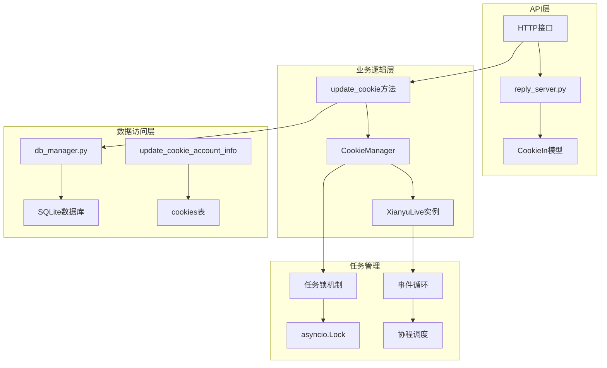
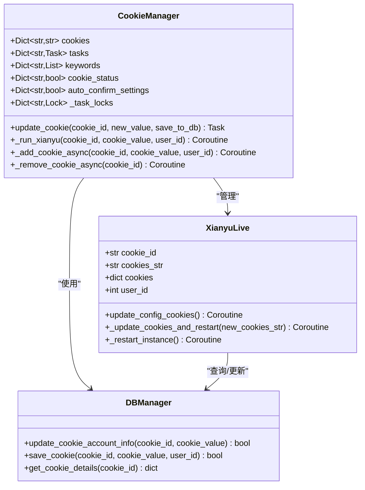
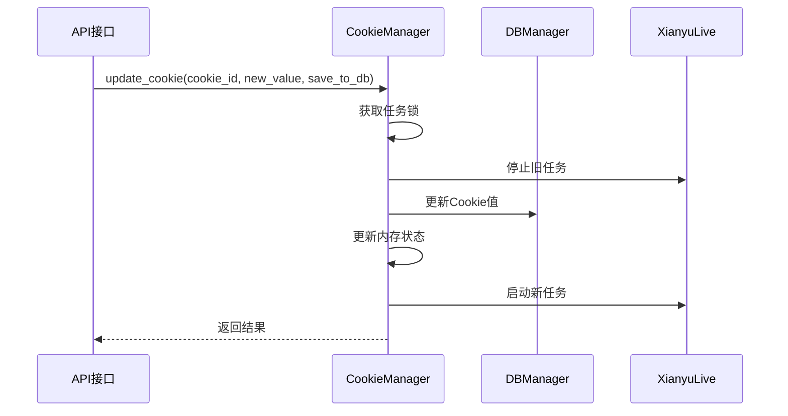
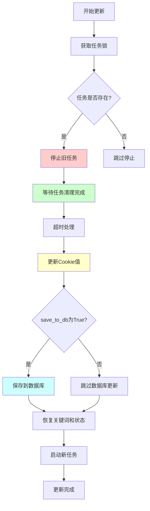
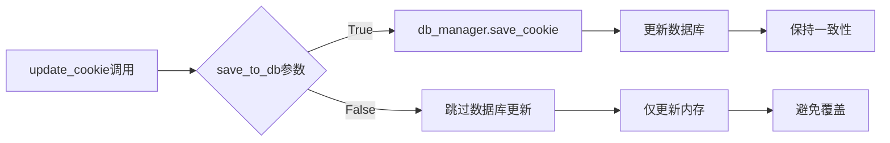
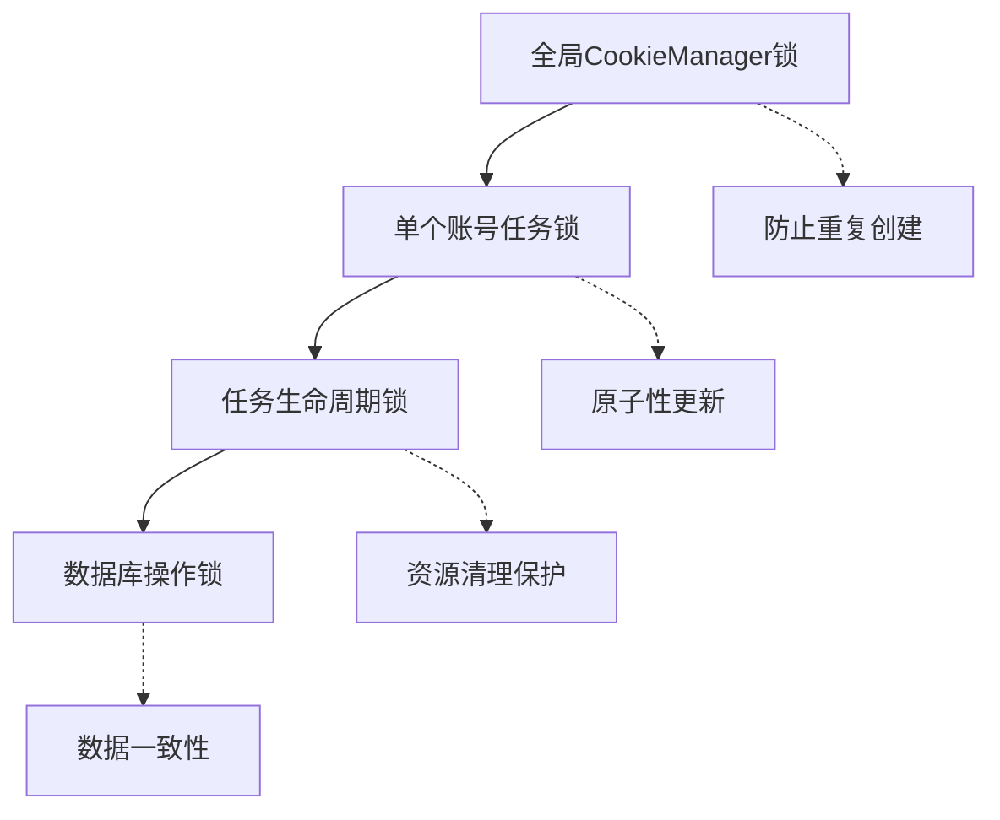
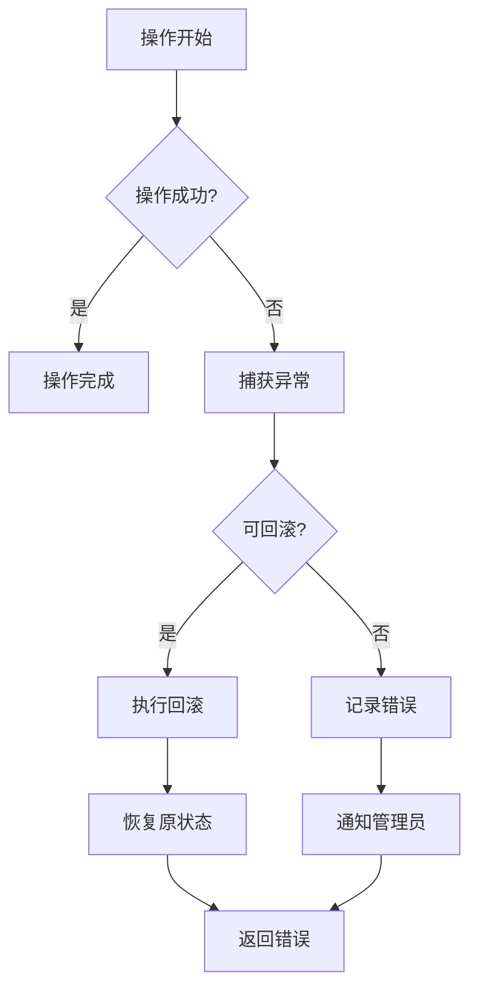

# 更新与重启

<cite>
**本文档中引用的文件**
- [cookie_manager.py](file://cookie_manager.py)
- [reply_server.py](file://reply_server.py)
- [XianyuAutoAsync.py](file://XianyuAutoAsync.py)
- [db_manager.py](file://db_manager.py)
- [app.js](file://static/js/app.js)
</cite>

## 目录
1. [简介](#简介)
2. [系统架构概览](#系统架构概览)
3. [核心组件分析](#核心组件分析)
4. [update_cookie方法详解](#update_cookie方法详解)
5. [原子性操作流程](#原子性操作流程)
6. [save_to_db参数作用机制](#save_to_db参数作用机制)
7. [平滑重启机制](#平滑重启机制)
8. [并发控制与任务锁](#并发控制与任务锁)
9. [错误处理与回滚机制](#错误处理与回滚机制)
10. [性能优化考虑](#性能优化考虑)
11. [故障排除指南](#故障排除指南)
12. [总结](#总结)

## 简介

闲鱼自动回复系统采用了一套精密的账号更新与重启机制，确保在不中断服务的情况下安全地更新账号的Cookie值。该系统通过`update_cookie`方法实现了原子性的操作流程，包括任务锁获取、旧任务安全停止、Cookie值更新、数据库同步和新任务启动等关键步骤。

## 系统架构概览

系统采用分层架构设计，主要包含以下核心层次：



**图表来源**
- [reply_server.py](file://reply_server.py#L1217-L1246)
- [cookie_manager.py](file://cookie_manager.py#L214-L287)

## 核心组件分析

### CookieManager类

`CookieManager`是系统的核心组件，负责管理多个账号的Cookie及其对应的任务：



**图表来源**
- [cookie_manager.py](file://cookie_manager.py#L9-L427)
- [XianyuAutoAsync.py](file://XianyuAutoAsync.py#L157-L8365)

**章节来源**
- [cookie_manager.py](file://cookie_manager.py#L9-L427)
- [XianyuAutoAsync.py](file://XianyuAutoAsync.py#L157-L8365)

### 数据库管理层

数据库层提供了事务性的Cookie更新机制，确保数据一致性：



**图表来源**
- [reply_server.py](file://reply_server.py#L1217-L1246)
- [cookie_manager.py](file://cookie_manager.py#L214-L287)

**章节来源**
- [db_manager.py](file://db_manager.py#L1353-L1450)
- [reply_server.py](file://reply_server.py#L1217-L1246)

## update_cookie方法详解

`update_cookie`方法是整个更新流程的核心，它实现了原子性的Cookie更新操作：

### 方法签名与参数

```python
def update_cookie(self, cookie_id: str, new_value: str, save_to_db: bool = True):
```

- **cookie_id**: 账号的唯一标识符
- **new_value**: 新的Cookie值
- **save_to_db**: 控制是否保存到数据库的标志，默认为True

### 核心实现逻辑

方法内部通过异步协程实现完整的更新流程：

1. **任务锁获取**: 使用`asyncio.Lock`确保同一账号的更新操作互斥
2. **旧任务停止**: 安全地取消并等待旧的XianyuLive任务完成清理
3. **状态保存**: 保存原有的用户ID、关键词和状态信息
4. **Cookie更新**: 更新内存中的Cookie值
5. **数据库同步**: 根据`save_to_db`参数决定是否更新数据库
6. **状态恢复**: 恢复关键词和状态信息
7. **新任务启动**: 使用新的Cookie值重新启动任务

**章节来源**
- [cookie_manager.py](file://cookie_manager.py#L214-L287)

## 原子性操作流程

系统通过严格的原子性操作确保更新过程的可靠性：



**图表来源**
- [cookie_manager.py](file://cookie_manager.py#L223-L277)

### 锁机制的重要性

任务锁确保了以下关键特性：

1. **并发控制**: 防止多个更新操作同时进行
2. **资源保护**: 确保任务清理期间不会被中断
3. **状态一致性**: 维护内存和数据库状态的一致性

**章节来源**
- [cookie_manager.py](file://cookie_manager.py#L224-L226)

## save_to_db参数作用机制

`save_to_db`参数是系统设计的关键创新，它解决了API层和业务逻辑层之间的协调问题：

### 参数作用机制

| 场景 | save_to_db值 | 说明 |
|------|-------------|------|
| API层更新 | False | API层已经更新数据库，避免重复更新 |
| 业务逻辑更新 | True | 业务逻辑需要更新数据库 |
| 数据库迁移 | True | 需要同步到数据库 |

### 实现细节



**图表来源**
- [cookie_manager.py](file://cookie_manager.py#L265-L267)

### 避免数据覆盖

当API层已经更新数据库时，设置`save_to_db=False`可以避免覆盖其他字段（如`pause_duration`、`remark`等），这是系统设计的重要考量。

**章节来源**
- [cookie_manager.py](file://cookie_manager.py#L216-L221)

## 平滑重启机制

系统实现了平滑的重启机制，确保服务不中断：

### 重启流程

```mermaid
sequenceDiagram
participant CM as CookieManager
participant XL as XianyuLive
participant DB as 数据库
participant Loop as 事件循环
CM->>XL : 停止旧任务
Note over XL : 等待10秒超时
XL-->>CM : 任务已停止
CM->>DB : 更新Cookie值
CM->>Loop : 创建新任务
Loop->>XL : 启动新实例
XL-->>Loop : 任务启动成功
Loop-->>CM : 任务已启动
```

**图表来源**
- [cookie_manager.py](file://cookie_manager.py#L244-L275)

### 资源清理保证

系统通过以下机制确保资源的正确清理：

1. **超时控制**: 等待任务清理的最大时间为10秒
2. **异常处理**: 捕获并处理各种异常情况
3. **状态同步**: 确保内存状态与数据库状态一致

**章节来源**
- [cookie_manager.py](file://cookie_manager.py#L246-L260)

## 并发控制与任务锁

系统采用了多层次的并发控制机制：

### 任务锁层次结构



**图表来源**
- [cookie_manager.py](file://cookie_manager.py#L18-L20)

### 锁的获取与释放

系统在以下时机获取和释放锁：

1. **更新开始**: 获取账号级别的任务锁
2. **任务停止**: 确保任务安全停止
3. **状态更新**: 保护状态变更操作
4. **任务启动**: 确保新任务正确启动

**章节来源**
- [cookie_manager.py](file://cookie_manager.py#L112-L137)

## 错误处理与回滚机制

系统实现了完善的错误处理和回滚机制：

### 错误处理策略



**图表来源**
- [XianyuAutoAsync.py](file://XianyuAutoAsync.py#L2006-L2018)

### 回滚机制实现

当更新失败时，系统会执行以下回滚操作：

1. **状态恢复**: 恢复原始的Cookie值
2. **数据库同步**: 确保数据库状态与内存一致
3. **通知发送**: 发送错误通知给管理员
4. **日志记录**: 详细记录错误信息

**章节来源**
- [XianyuAutoAsync.py](file://XianyuAutoAsync.py#L2006-L2018)

## 性能优化考虑

系统在设计时充分考虑了性能优化：

### 异步处理优势

1. **非阻塞操作**: 所有I/O操作都是异步的
2. **并发执行**: 多个账号可以并行更新
3. **资源复用**: 事件循环的高效利用

### 内存管理

1. **状态缓存**: 内存中缓存关键状态信息
2. **延迟加载**: 按需加载数据库记录
3. **垃圾回收**: 及时清理不再使用的资源

### 数据库优化

1. **事务管理**: 使用事务确保数据一致性
2. **索引优化**: 关键字段建立适当索引
3. **批量操作**: 减少数据库交互次数

**章节来源**
- [db_manager.py](file://db_manager.py#L1-L800)

## 故障排除指南

### 常见问题及解决方案

| 问题类型 | 症状 | 解决方案 |
|----------|------|----------|
| 任务停止超时 | 日志显示"等待旧任务停止超时" | 检查任务是否正常退出，必要时强制重启 |
| 数据库更新失败 | Cookie值未同步到数据库 | 检查数据库连接和权限设置 |
| 锁死问题 | 更新操作长时间无响应 | 检查是否有未释放的锁 |
| 内存泄漏 | 系统内存持续增长 | 检查任务清理是否正常 |

### 调试技巧

1. **日志分析**: 查看详细的日志信息
2. **状态检查**: 验证内存和数据库状态一致性
3. **监控指标**: 监控任务数量和资源使用情况

**章节来源**
- [cookie_manager.py](file://cookie_manager.py#L252-L256)

## 总结

闲鱼自动回复系统的账号更新与重启机制体现了现代异步系统设计的最佳实践。通过原子性操作、严格的并发控制、完善的错误处理和性能优化，系统能够在不中断服务的情况下安全地更新账号的Cookie值。

### 关键设计原则

1. **原子性**: 确保更新操作的完整性
2. **并发安全**: 通过锁机制保护共享资源
3. **容错性**: 完善的错误处理和回滚机制
4. **性能**: 异步处理和资源优化
5. **可维护性**: 清晰的代码结构和详细的日志

这套机制不仅保证了系统的稳定性，也为未来的扩展和维护奠定了坚实的基础。通过合理使用`save_to_db`参数，系统能够灵活应对不同的应用场景，实现了API层和业务逻辑层的良好协调。