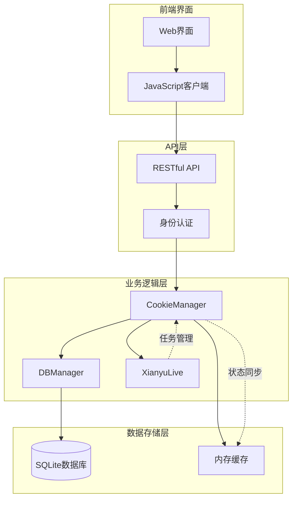
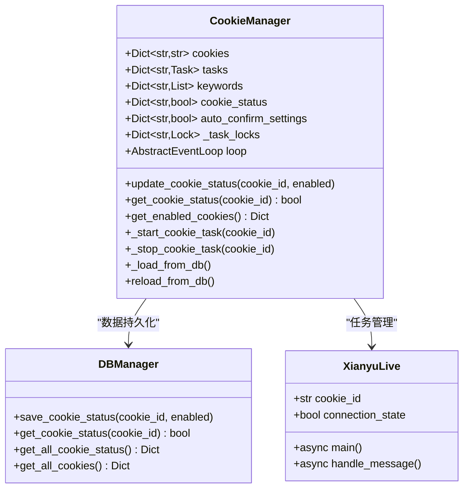
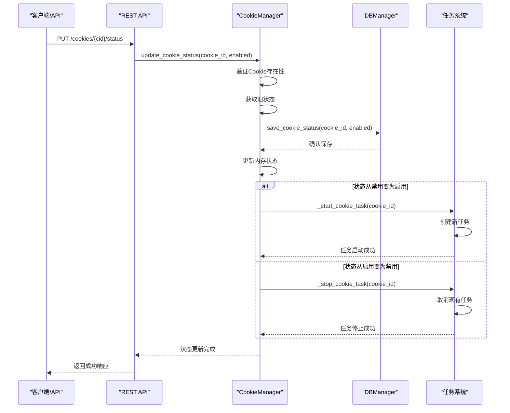
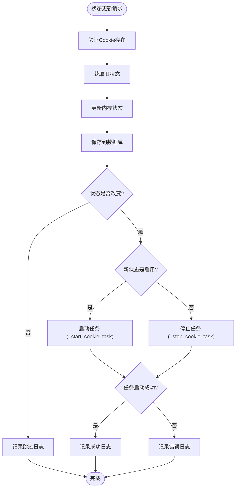
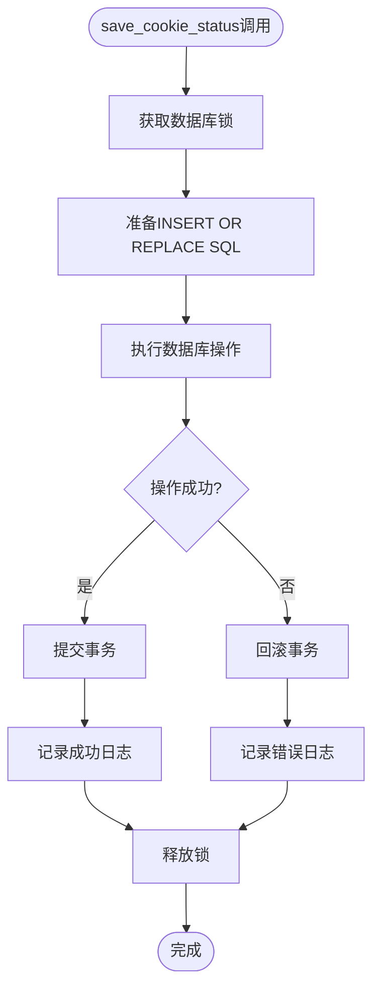
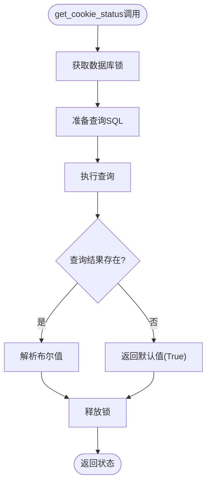
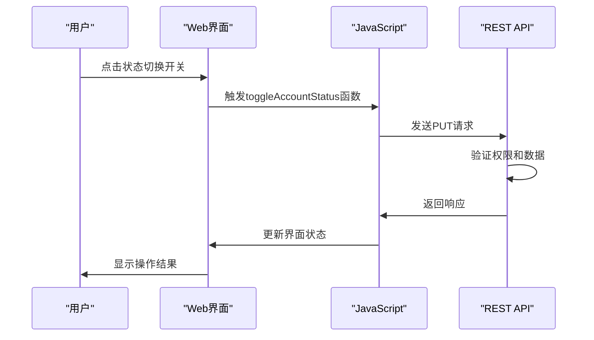
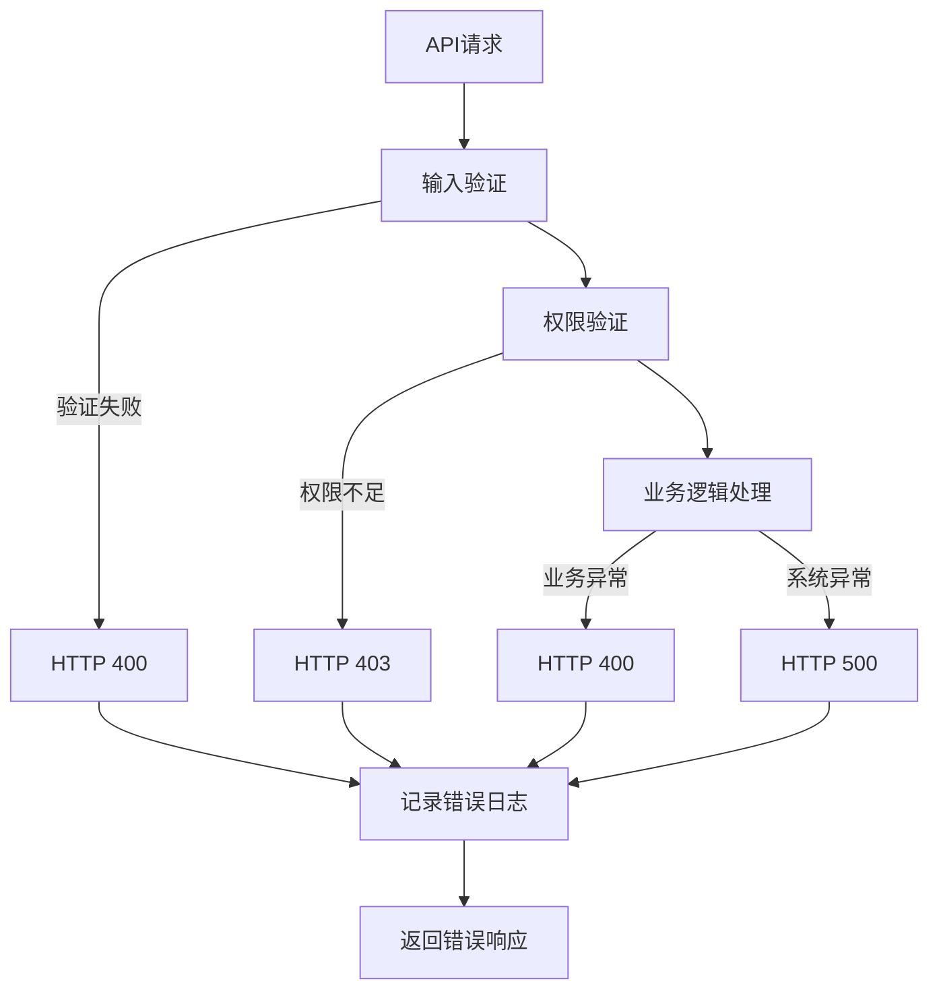

# 状态管理与切换

<cite>
**本文档中引用的文件**
- [cookie_manager.py](file://cookie_manager.py)
- [db_manager.py](file://db_manager.py)
- [reply_server.py](file://reply_server.py)
- [XianyuAutoAsync.py](file://XianyuAutoAsync.py)
- [config.py](file://config.py)
- [app.js](file://static/js/app.js)
</cite>

## 目录
1. [概述](#概述)
2. [系统架构](#系统架构)
3. [Cookie状态管理核心组件](#cookie状态管理核心组件)
4. [状态切换机制详解](#状态切换机制详解)
5. [数据库持久化](#数据库持久化)
6. [API接口设计](#api接口设计)
7. [错误处理与日志记录](#错误处理与日志记录)
8. [最佳实践与使用示例](#最佳实践与使用示例)
9. [故障排除指南](#故障排除指南)

## 概述

本系统实现了完整的账号启用/禁用状态动态管理机制，通过CookieManager.update_cookie_status方法协调内存状态与数据库持久化，结合_start_cookie_task和_stop_cookie_task方法实现任务的实时启停。整个系统采用异步架构，确保状态切换的实时性和可靠性。

## 系统架构



**图表来源**
- [cookie_manager.py](file://cookie_manager.py#L10-L428)
- [db_manager.py](file://db_manager.py#L16-L800)
- [reply_server.py](file://reply_server.py#L2337-L2352)

## Cookie状态管理核心组件

### CookieManager类设计

CookieManager是状态管理的核心组件，负责协调内存状态、数据库持久化和任务生命周期管理。



**图表来源**
- [cookie_manager.py](file://cookie_manager.py#L10-L428)
- [db_manager.py](file://db_manager.py#L16-L800)

**章节来源**
- [cookie_manager.py](file://cookie_manager.py#L10-L428)
- [db_manager.py](file://db_manager.py#L16-L800)

### 状态字典结构

系统维护多个关键状态字典：

| 字典名称 | 数据类型 | 用途 | 生命周期 |
|---------|---------|------|----------|
| `cookies` | `Dict[str, str]` | 存储Cookie值 | 应用运行时 |
| `tasks` | `Dict[str, Task]` | 存储活跃任务 | 应用运行时 |
| `cookie_status` | `Dict[str, bool]` | 账号启用状态 | 应用运行时+数据库 |
| `keywords` | `Dict[str, List[Tuple[str, str]]]` | 关键字配置 | 应用运行时+数据库 |
| `auto_confirm_settings` | `Dict[str, bool]` | 自动确认设置 | 应用运行时+数据库 |

**章节来源**
- [cookie_manager.py](file://cookie_manager.py#L15-L20)

## 状态切换机制详解

### update_cookie_status方法实现

update_cookie_status方法是状态切换的核心入口，负责更新内存状态并触发相应的任务管理操作。



**图表来源**
- [cookie_manager.py](file://cookie_manager.py#L304-L323)
- [reply_server.py](file://reply_server.py#L2337-L2352)

### 状态变更检测逻辑

状态切换的关键在于检测状态变化并采取相应行动：



**图表来源**
- [cookie_manager.py](file://cookie_manager.py#L315-L323)

**章节来源**
- [cookie_manager.py](file://cookie_manager.py#L304-L323)

### _start_cookie_task方法详解

_start_cookie_task方法负责启动指定Cookie的任务，确保任务的正确创建和管理。

```mermaid
sequenceDiagram
participant CM as "CookieManager"
participant DB as "DBManager"
participant Loop as "事件循环"
participant Task as "XianyuLive任务"
CM->>CM : 检查任务是否存在
alt 任务已存在
CM->>CM : 记录警告并跳过
CM-->>CM : 返回
end
CM->>DB : 获取Cookie详细信息
DB-->>CM : 返回user_id等信息
CM->>Loop : 检查事件循环状态
alt 事件循环运行中
CM->>Loop : run_coroutine_threadsafe(_add_cookie_async)
Loop->>Task : 创建任务
Task-->>Loop : 任务创建完成
Loop-->>CM : 返回结果
else 事件循环未运行
CM->>Loop : create_task(_run_xianyu)
Loop->>Task : 直接创建任务
Task-->>Loop : 任务创建完成
Loop-->>CM : 返回任务对象
end
CM->>CM : 存储任务引用
CM-->>CM : 记录启动成功日志
```

**图表来源**
- [cookie_manager.py](file://cookie_manager.py#L333-L366)

**章节来源**
- [cookie_manager.py](file://cookie_manager.py#L333-L366)

### _stop_cookie_task方法详解

_stop_cookie_task方法负责安全地停止指定Cookie的任务，确保资源的正确释放。

```mermaid
sequenceDiagram
participant CM as "CookieManager"
participant Task as "任务对象"
participant Loop as "事件循环"
CM->>CM : 检查任务是否存在
alt 任务不存在
CM->>CM : 记录警告并返回
CM-->>CM : 完成
end
CM->>Loop : 检查事件循环状态
alt 事件循环运行中
CM->>Loop : run_coroutine_threadsafe(_stop_task_async)
Loop->>Task : cancel() 取消任务
Task->>Task : 执行清理逻辑
Task-->>Loop : 任务取消完成
Loop-->>CM : 返回结果
else 事件循环未运行
CM->>Task : 直接取消任务
Task->>Task : 强制清理
Task-->>CM : 任务已取消
end
CM->>CM : 移除任务引用
CM-->>CM : 记录停止成功日志
```

**图表来源**
- [cookie_manager.py](file://cookie_manager.py#L366-L406)

**章节来源**
- [cookie_manager.py](file://cookie_manager.py#L366-L406)

## 数据库持久化

### cookie_status表结构

数据库中的cookie_status表专门用于存储账号的启用状态，确保状态的持久化和一致性。

| 字段名 | 数据类型 | 约束 | 说明 |
|--------|---------|------|------|
| `cookie_id` | TEXT | PRIMARY KEY | 账号唯一标识符 |
| `enabled` | BOOLEAN | DEFAULT TRUE | 启用状态（1启用，0禁用） |
| `updated_at` | TIMESTAMP | DEFAULT CURRENT_TIMESTAMP | 最后更新时间 |

**章节来源**
- [db_manager.py](file://db_manager.py#L140-L148)

### 数据库操作方法

#### save_cookie_status方法

负责将状态变更持久化到数据库：



**图表来源**
- [db_manager.py](file://db_manager.py#L1721-L1735)

#### get_cookie_status方法

负责从数据库获取指定账号的状态：



**图表来源**
- [db_manager.py](file://db_manager.py#L1737-L1747)

**章节来源**
- [db_manager.py](file://db_manager.py#L1721-L1764)

## API接口设计

### RESTful API端点

系统提供了完整的RESTful API来管理账号状态：

| HTTP方法 | 端点 | 功能 | 请求体 | 响应 |
|---------|------|------|--------|------|
| PUT | `/cookies/{cid}/status` | 更新账号状态 | `{ "enabled": true/false }` | `{ "msg": "status updated", "enabled": true }` |
| GET | `/cookies/details` | 获取所有账号详情 | 无 | `[...]` |
| GET | `/cookie/{cid}/details` | 获取单个账号详情 | 无 | `{...}` |

**章节来源**
- [reply_server.py](file://reply_server.py#L2337-L2352)

### JavaScript客户端交互

前端通过JavaScript实现状态切换的用户界面：



**图表来源**
- [app.js](file://static/js/app.js#L1690-L1695)

**章节来源**
- [app.js](file://static/js/app.js#L1690-L1695)

## 错误处理与日志记录

### 异常处理策略

系统采用多层次的异常处理策略：



**图表来源**
- [reply_server.py](file://reply_server.py#L2337-L2356)

### 日志记录规范

系统采用分级日志记录机制：

| 日志级别 | 使用场景 | 示例 |
|---------|---------|------|
| DEBUG | 详细调试信息 | "保存Cookie状态: {cookie_id} -> 启用" |
| INFO | 一般信息记录 | "更新Cookie状态: {cookie_id} -> 启用" |
| WARNING | 警告信息 | "任务已存在，跳过启动: {cookie_id}" |
| ERROR | 错误信息 | "启动Cookie任务失败: {cookie_id}, {error}" |

**章节来源**
- [cookie_manager.py](file://cookie_manager.py#L312-L323)
- [cookie_manager.py](file://cookie_manager.py#L364-L365)

## 最佳实践与使用示例

### 状态切换最佳实践

1. **批量操作建议**：对于大量账号的状态切换，建议使用批量API接口
2. **状态同步**：确保前端界面与后端状态保持同步
3. **错误恢复**：实现自动重试机制处理临时性错误
4. **状态监控**：建立状态变更的监控和报警机制

### API调用示例

#### 启用账号
```bash
curl -X PUT "http://localhost:8080/cookies/12345/status" \
  -H "Content-Type: application/json" \
  -d '{"enabled": true}'
```

#### 禁用账号
```bash
curl -X PUT "http://localhost:8080/cookies/12345/status" \
  -H "Content-Type: application/json" \
  -d '{"enabled": false}'
```

#### 获取账号状态
```bash
curl -X GET "http://localhost:8080/cookies/12345/status"
```

### 前端集成示例

```javascript
// 状态切换函数
async function toggleAccountStatus(accountId, enabled) {
    try {
        const response = await fetch(`/cookies/${accountId}/status`, {
            method: 'PUT',
            headers: {
                'Content-Type': 'application/json'
            },
            body: JSON.stringify({ enabled })
        });
        
        if (!response.ok) {
            throw new Error(`状态切换失败: ${response.status}`);
        }
        
        // 更新界面状态
        updateUIStatus(accountId, enabled);
        showToast(`账号${enabled ? '启用' : '禁用'}成功`, 'success');
    } catch (error) {
        showToast(`状态切换失败: ${error.message}`, 'danger');
    }
}
```

**章节来源**
- [app.js](file://static/js/app.js#L1690-L1695)

## 故障排除指南

### 常见问题及解决方案

#### 1. 状态切换不生效
**症状**：调用API后状态没有改变
**原因**：
- Cookie不存在或不属于当前用户
- 数据库连接异常
- 任务创建失败

**解决方案**：
- 验证Cookie权限和存在性
- 检查数据库连接状态
- 查看任务创建日志

#### 2. 任务启动失败
**症状**：启用账号后任务没有启动
**原因**：
- 事件循环未运行
- 任务创建超时
- 依赖服务不可用

**解决方案**：
- 检查系统服务状态
- 增加任务创建超时时间
- 验证依赖服务可用性

#### 3. 状态不同步
**症状**：前端显示状态与实际不符
**原因**：
- 缓存未刷新
- 并发更新冲突
- 网络延迟

**解决方案**：
- 实现状态强制刷新机制
- 使用乐观锁处理并发
- 增加状态同步检查

### 调试工具和技巧

1. **日志分析**：通过日志级别调整获取详细信息
2. **状态检查**：使用GET接口验证当前状态
3. **任务监控**：监控任务的创建和销毁过程
4. **数据库验证**：直接查询数据库确认状态持久化

**章节来源**
- [cookie_manager.py](file://cookie_manager.py#L364-L365)
- [db_manager.py](file://db_manager.py#L1734-L1735)