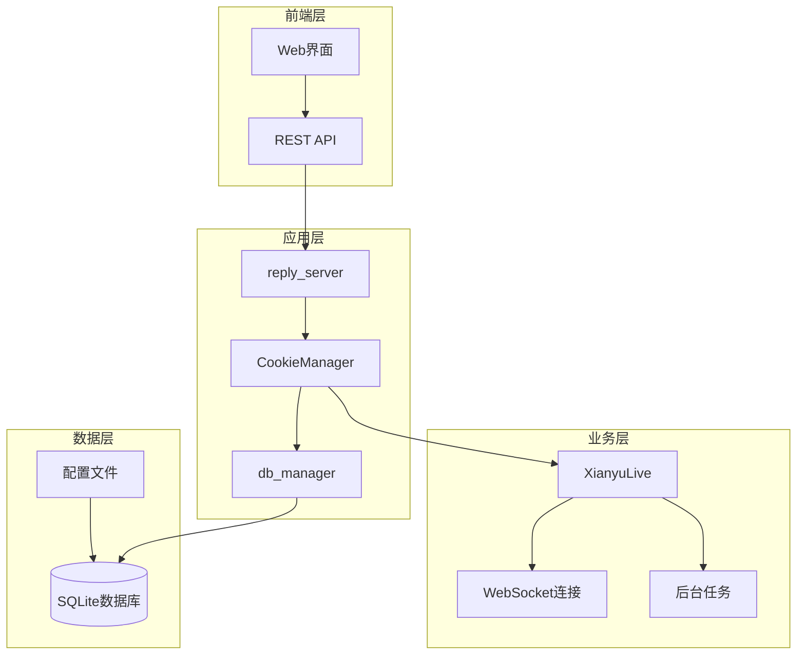
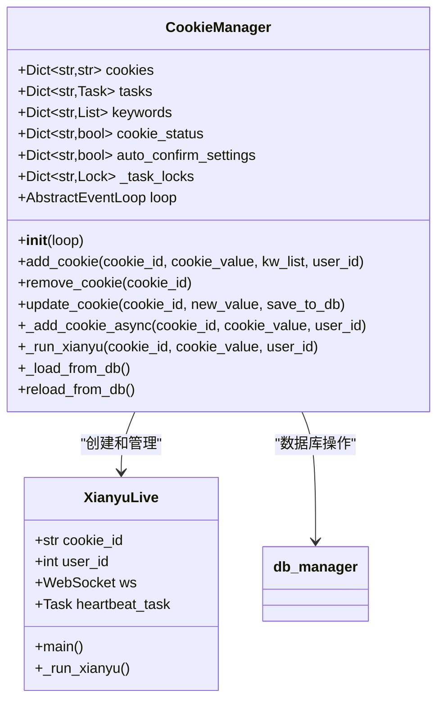
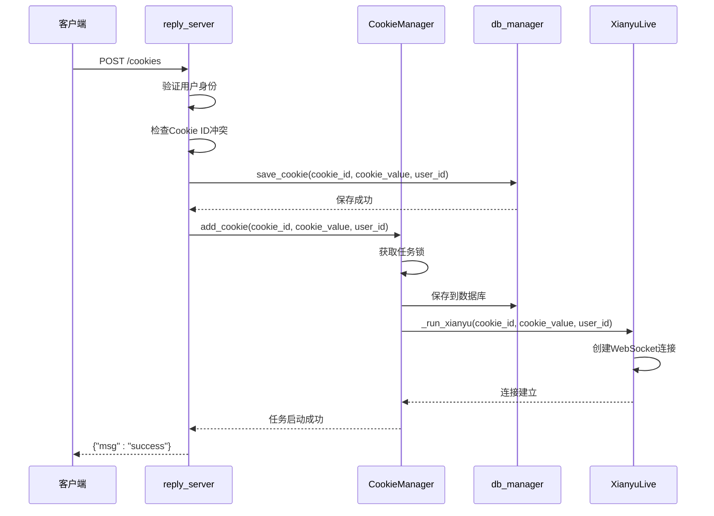
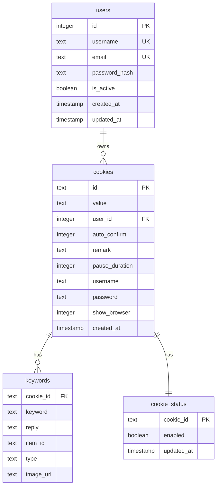
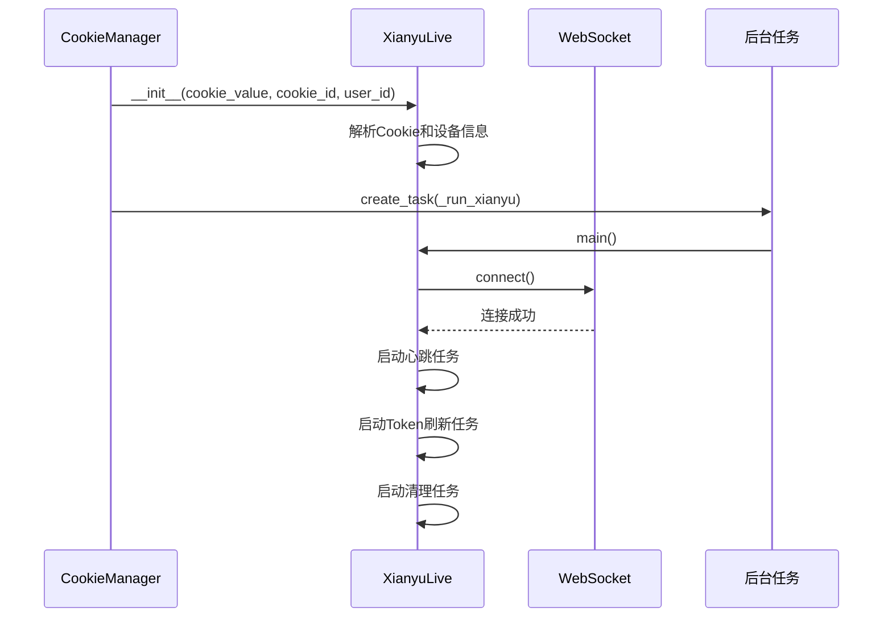
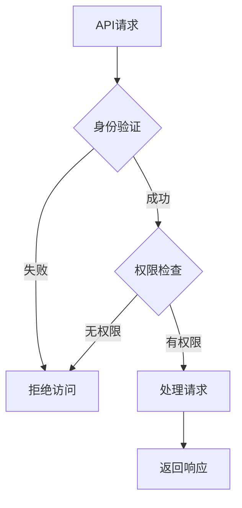
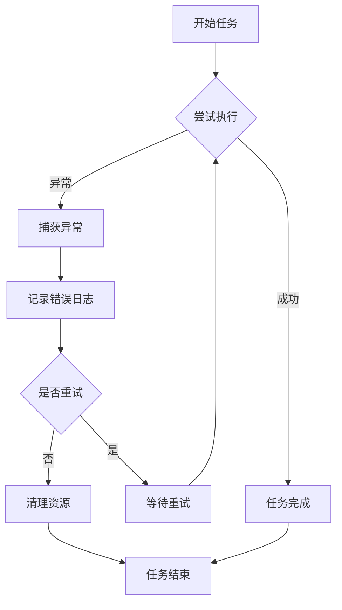
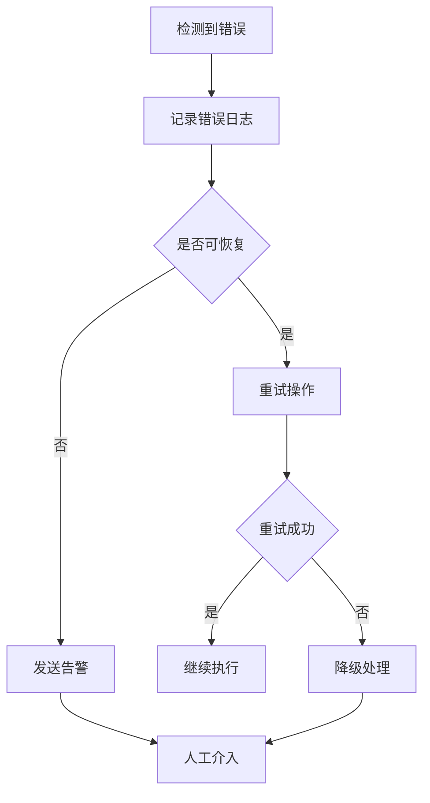

# 账号创建与初始化

<cite>
**本文档引用的文件**
- [cookie_manager.py](file://cookie_manager.py)
- [db_manager.py](file://db_manager.py)
- [XianyuAutoAsync.py](file://XianyuAutoAsync.py)
- [config.py](file://config.py)
- [Start.py](file://Start.py)
- [reply_server.py](file://reply_server.py)
- [global_config.yml](file://global_config.yml)
</cite>

## 目录
1. [简介](#简介)
2. [系统架构概览](#系统架构概览)
3. [CookieManager核心组件](#cookiemanager核心组件)
4. [账号创建流程详解](#账号创建流程详解)
5. [数据库初始化与配置](#数据库初始化与配置)
6. [WebSocket连接与任务管理](#websocket连接与任务管理)
7. [API安全接口](#api安全接口)
8. [异常处理与任务锁机制](#异常处理与任务锁机制)
9. [最佳实践与故障排除](#最佳实践与故障排除)

## 简介

闲鱼自动回复系统采用多层架构设计，通过CookieManager组件实现账号的统一管理和初始化。系统支持通过API安全地添加新账号，自动从数据库加载初始配置，并为每个账号创建独立的WebSocket连接任务。

本文档详细阐述了通过`CookieManager.add_cookie`方法实现账号添加的完整流程，包括唯一`_cookie_id`的生成机制、`user_id`与账号的绑定过程，以及从数据库加载初始配置（如关键词、自动确认设置等）的详细步骤。

## 系统架构概览

系统采用事件驱动的异步架构，主要组件包括：



**图表来源**
- [cookie_manager.py](file://cookie_manager.py#L10-L50)
- [db_manager.py](file://db_manager.py#L16-L70)
- [XianyuAutoAsync.py](file://XianyuAutoAsync.py#L158-L200)

## CookieManager核心组件

### 类结构与属性

CookieManager是系统的核心管理组件，负责：



**图表来源**
- [cookie_manager.py](file://cookie_manager.py#L10-L50)
- [XianyuAutoAsync.py](file://XianyuAutoAsync.py#L158-L200)

### 核心属性说明

| 属性名 | 类型 | 描述 |
|--------|------|------|
| `cookies` | Dict[str, str] | 存储所有账号的Cookie值 |
| `tasks` | Dict[str, asyncio.Task] | 管理所有账号的异步任务 |
| `keywords` | Dict[str, List[Tuple[str, str]]] | 关键词与回复映射 |
| `cookie_status` | Dict[str, bool] | 账号启用状态 |
| `auto_confirm_settings` | Dict[str, bool] | 自动确认发货设置 |
| `_task_locks` | Dict[str, asyncio.Lock] | 任务锁，防止重复创建 |

**章节来源**
- [cookie_manager.py](file://cookie_manager.py#L15-L20)

## 账号创建流程详解

### API端点入口

系统通过REST API提供账号创建接口：



**图表来源**
- [reply_server.py](file://reply_server.py#L1183-L1209)
- [cookie_manager.py](file://cookie_manager.py#L184-L200)

### CookieIn模型定义

API请求的数据模型：

```python
class CookieIn(BaseModel):
    id: str      # 唯一账号标识
    value: str   # 完整Cookie字符串
```

### 账号创建步骤详解

#### 1. 用户身份验证
系统首先验证当前用户的身份，确保操作权限：

```python
# 获取当前用户ID
user_id = current_user['user_id']
```

#### 2. Cookie ID冲突检查
系统检查目标Cookie ID是否已被其他用户使用：

```python
# 获取所有现有Cookie
existing_cookies = db_manager.get_all_cookies()

# 检查是否属于当前用户
user_cookies = db_manager.get_all_cookies(user_id)
if item.id in existing_cookies and item.id not in user_cookies:
    raise HTTPException(status_code=400, detail="该Cookie ID已被其他用户使用")
```

#### 3. 数据库保存
将Cookie信息保存到数据库，同时绑定到当前用户：

```python
# 保存到数据库时指定用户ID
db_manager.save_cookie(item.id, item.value, user_id)
```

#### 4. CookieManager添加
通过CookieManager添加账号并启动任务：

```python
# 添加到CookieManager，同时指定用户ID
cookie_manager.manager.add_cookie(item.id, item.value, user_id=user_id)
```

**章节来源**
- [reply_server.py](file://reply_server.py#L1183-L1209)

## 数据库初始化与配置

### 数据库表结构

系统使用SQLite数据库存储账号信息，核心表结构：



**图表来源**
- [db_manager.py](file://db_manager.py#L110-L123)

### 初始配置加载

CookieManager启动时自动从数据库加载配置：

```python
def _load_from_db(self):
    """从数据库加载所有Cookie、关键字和状态"""
    # 加载所有Cookie
    self.cookies = db_manager.get_all_cookies()
    # 加载所有关键字
    self.keywords = db_manager.get_all_keywords()
    # 加载所有Cookie状态（默认启用）
    self.cookie_status = db_manager.get_all_cookie_status()
    # 加载所有auto_confirm设置
    self.auto_confirm_settings = {}
    for cookie_id in self.cookies.keys():
        if cookie_id not in self.cookie_status:
            self.cookie_status[cookie_id] = True
        self.auto_confirm_settings[cookie_id] = db_manager.get_auto_confirm(cookie_id)
```

### 关键配置项

| 配置项 | 类型 | 默认值 | 描述 |
|--------|------|--------|------|
| `auto_confirm` | Integer | 1 | 自动确认发货设置 |
| `pause_duration` | Integer | 10 | 自动回复暂停时间（分钟） |
| `show_browser` | Integer | 0 | 是否显示浏览器界面 |
| `remark` | Text | '' | 账号备注信息 |

**章节来源**
- [cookie_manager.py](file://cookie_manager.py#L23-L42)
- [db_manager.py](file://db_manager.py#L110-L123)

## WebSocket连接与任务管理

### XianyuLive实例创建

当账号添加成功后，系统会创建XianyuLive实例并启动WebSocket连接：



**图表来源**
- [cookie_manager.py](file://cookie_manager.py#L112-L153)
- [XianyuAutoAsync.py](file://XianyuAutoAsync.py#L628-L640)

### 任务启动流程

```python
async def _add_cookie_async(self, cookie_id: str, cookie_value: str, user_id: int = None):
    # 获取或创建该cookie_id的锁
    if cookie_id not in self._task_locks:
        self._task_locks[cookie_id] = asyncio.Lock()
    
    async with self._task_locks[cookie_id]:
        # 检查是否已存在任务
        if cookie_id in self.tasks:
            # 停止旧任务
            pass
        
        self.cookies[cookie_id] = cookie_value
        # 保存到数据库
        db_manager.save_cookie(cookie_id, cookie_value, user_id)
        
        # 获取实际保存的user_id
        actual_user_id = user_id
        if actual_user_id is None:
            cookie_info = db_manager.get_cookie_details(cookie_id)
            if cookie_info:
                actual_user_id = cookie_info.get('user_id')
        
        # 创建WebSocket连接任务
        task = self.loop.create_task(self._run_xianyu(cookie_id, cookie_value, actual_user_id))
        self.tasks[cookie_id] = task
```

### WebSocket连接特性

XianyuLive实例具有以下WebSocket连接特性：

| 特性 | 描述 |
|------|------|
| 心跳机制 | 定期发送心跳包维持连接 |
| 自动重连 | 连接断开时自动重连 |
| 异常处理 | 优雅处理连接异常 |
| 任务隔离 | 每个账号独立的WebSocket连接 |

**章节来源**
- [cookie_manager.py](file://cookie_manager.py#L112-L153)
- [XianyuAutoAsync.py](file://XianyuAutoAsync.py#L628-L640)

## API安全接口

### 接口权限控制

系统实现了严格的权限控制机制：



**图表来源**
- [reply_server.py](file://reply_server.py#L1222-L1228)

### 主要API端点

| 端点 | 方法 | 功能 | 权限要求 |
|------|------|------|----------|
| `/cookies` | POST | 添加新账号 | 已登录用户 |
| `/cookies` | GET | 获取账号列表 | 已登录用户 |
| `/cookies/{cid}` | PUT | 更新账号Cookie | 账号所有者 |
| `/cookie/{cid}/details` | GET | 获取账号详情 | 账号所有者 |
| `/cookie/{cid}/account-info` | POST | 更新账号信息 | 账号所有者 |

### 请求验证机制

```python
# 检查cookie是否属于当前用户
user_cookies = db_manager.get_all_cookies(user_id)
if cid not in user_cookies:
    raise HTTPException(status_code=403, detail="无权限操作该Cookie")
```

**章节来源**
- [reply_server.py](file://reply_server.py#L1222-L1228)
- [reply_server.py](file://reply_server.py#L1311-L1317)

## 异常处理与任务锁机制

### 任务锁机制

系统使用任务锁防止重复创建账号任务：

```python
async def _add_cookie_async(self, cookie_id: str, cookie_value: str, user_id: int = None):
    # 获取或创建该cookie_id的锁
    if cookie_id not in self._task_locks:
        self._task_locks[cookie_id] = asyncio.Lock()
    
    async with self._task_locks[cookie_id]:
        # 检查是否已存在任务
        if cookie_id in self.tasks:
            existing_task = self.tasks[cookie_id]
            if not existing_task.done():
                logger.warning(f"任务已存在且正在运行，先停止旧任务...")
                existing_task.cancel()
                try:
                    await existing_task
                except asyncio.CancelledError:
                    pass
                # 从字典中移除
                self.tasks.pop(cookie_id, None)
```

### 异常处理策略



**图表来源**
- [cookie_manager.py](file://cookie_manager.py#L112-L153)

### 资源清理机制

系统实现了完善的资源清理机制：

```python
async def _remove_cookie_async(self, cookie_id: str):
    task = self.tasks.pop(cookie_id, None)
    if task:
        task.cancel()
        try:
            await asyncio.wait_for(task, timeout=10.0)
        except asyncio.TimeoutError:
            logger.warning(f"等待任务停止超时（10秒），强制继续")
        except asyncio.CancelledError:
            pass
        except Exception as e:
            logger.error(f"等待任务清理时出错: {cookie_id}, {e}")
    
    self.cookies.pop(cookie_id, None)
    self.keywords.pop(cookie_id, None)
    self._task_locks.pop(cookie_id, None)
    db_manager.delete_cookie(cookie_id)
```

**章节来源**
- [cookie_manager.py](file://cookie_manager.py#L155-L181)

## 最佳实践与故障排除

### 账号创建最佳实践

1. **唯一性保证**
   - 确保每个账号的`cookie_id`唯一
   - 使用有意义的标识符便于管理

2. **安全性考虑**
   - 通过HTTPS传输Cookie数据
   - 实施严格的权限验证
   - 定期轮换Cookie

3. **性能优化**
   - 使用异步操作避免阻塞
   - 实现连接池管理
   - 合理设置超时时间

### 常见问题排除

| 问题 | 可能原因 | 解决方案 |
|------|----------|----------|
| Cookie ID冲突 | 重复的账号标识符 | 使用唯一标识符 |
| 连接失败 | 网络或服务器问题 | 检查网络连接，重试机制 |
| 权限错误 | 用户权限不足 | 验证用户身份和权限 |
| 数据库锁定 | 并发访问冲突 | 使用数据库事务和锁 |

### 监控与日志

系统提供了完善的监控和日志功能：

```python
# 关键操作日志
logger.info(f"Cookie添加成功: {item.id}")
logger.error(f"添加Cookie失败: {item.id} - {str(e)}")
logger.warning(f"任务已存在且正在运行，先停止旧任务...")
```

### 故障恢复机制



**章节来源**
- [cookie_manager.py](file://cookie_manager.py#L112-L153)
- [XianyuAutoAsync.py](file://XianyuAutoAsync.py#L628-L640)

## 结论

闲鱼自动回复系统的账号创建与初始化功能通过CookieManager组件实现了完整的生命周期管理。系统采用异步架构，支持高并发操作，具备完善的异常处理和资源管理机制。通过REST API提供的安全接口，用户可以方便地添加和管理多个闲鱼账号，系统自动从数据库加载初始配置并建立稳定的WebSocket连接。

这种设计不仅保证了系统的稳定性和可靠性，还为用户提供了灵活的账号管理能力，是构建大规模自动化系统的重要基础设施。