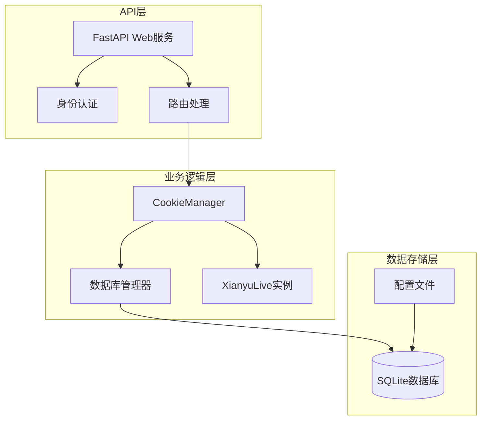
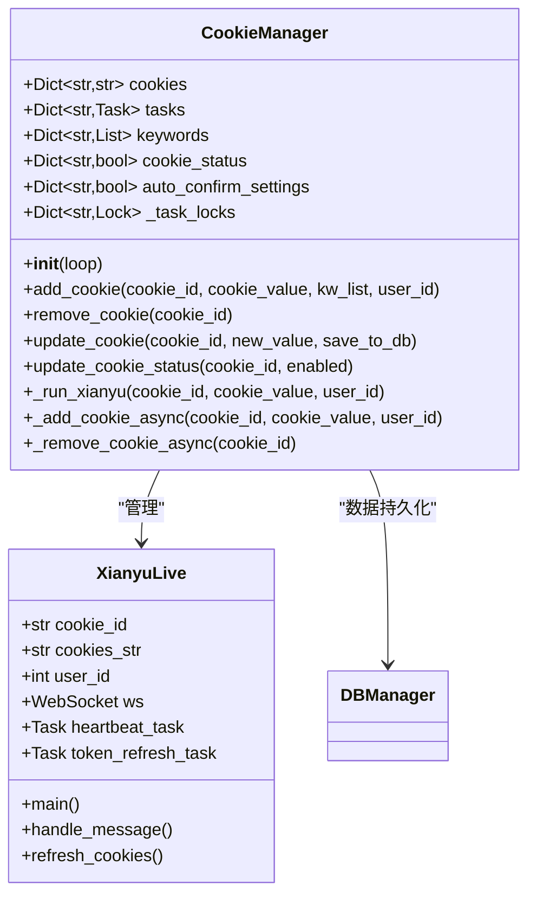
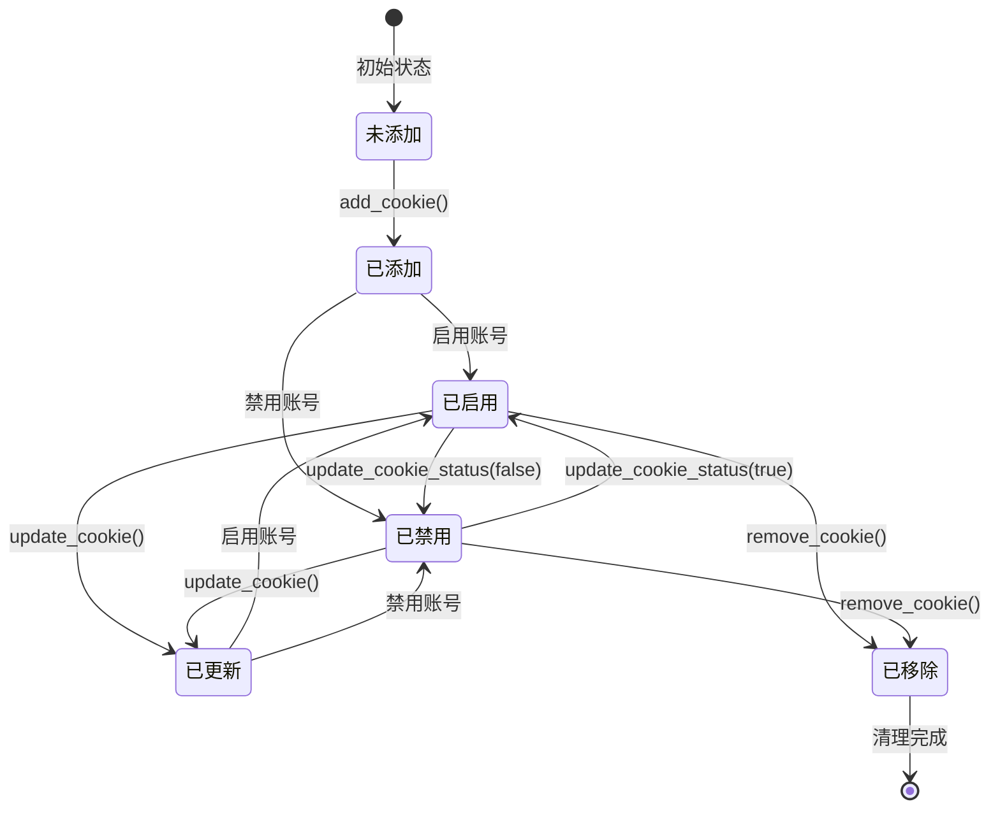
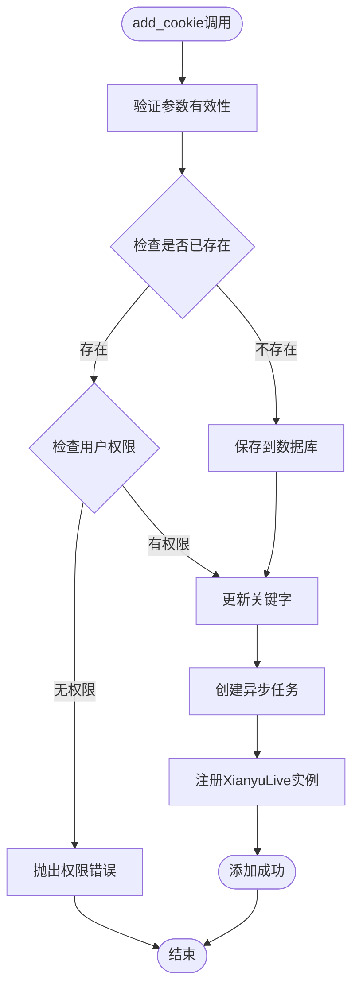
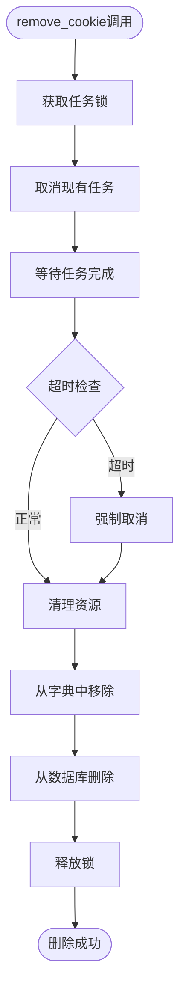
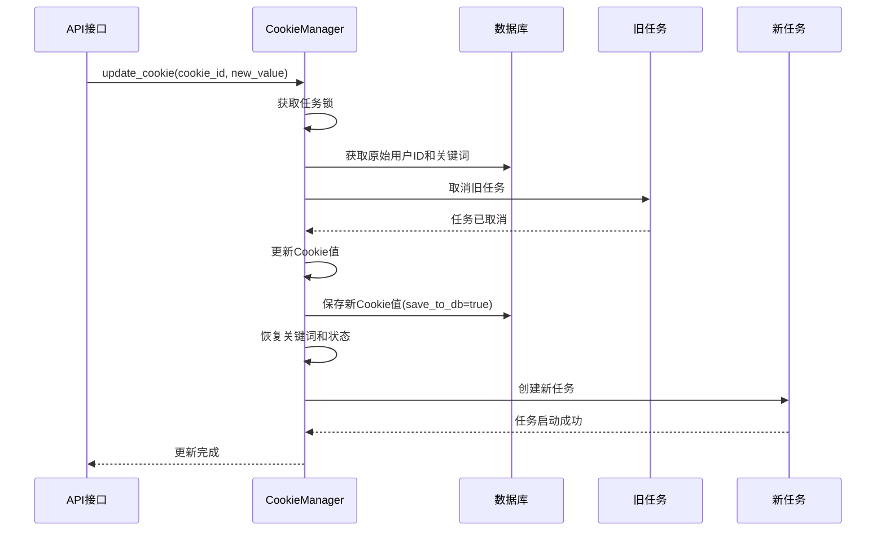
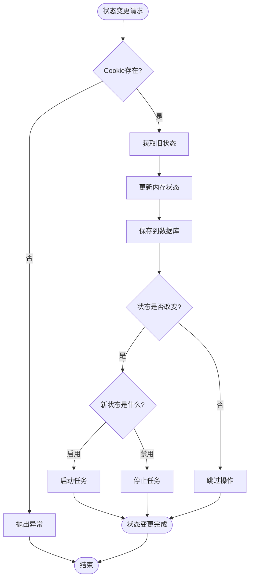
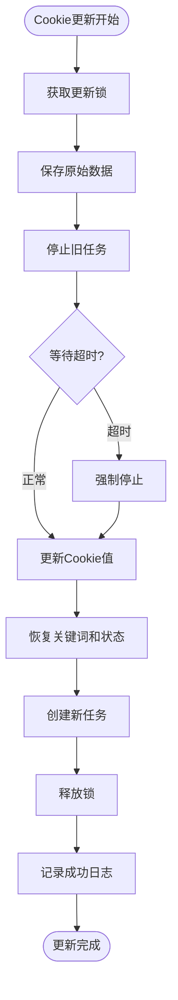
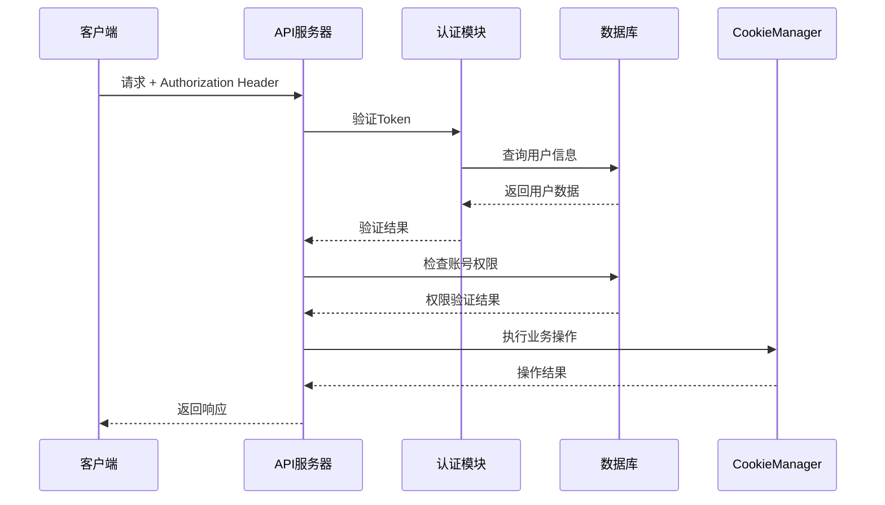

# 账号生命周期管理

<cite>
**本文档引用的文件**
- [cookie_manager.py](file://cookie_manager.py)
- [XianyuAutoAsync.py](file://XianyuAutoAsync.py)
- [db_manager.py](file://db_manager.py)
- [Start.py](file://Start.py)
- [reply_server.py](file://reply_server.py)
- [config.py](file://config.py)
</cite>

## 目录
1. [简介](#简介)
2. [系统架构概览](#系统架构概览)
3. [CookieManager核心组件](#cookiemanager核心组件)
4. [账号生命周期状态图](#账号生命周期状态图)
5. [账号初始化流程](#账号初始化流程)
6. [账号增删改操作详解](#账号增删改操作详解)
7. [账号状态转换机制](#账号状态转换机制)
8. [账号更新流程](#账号更新流程)
9. [API接口安全管理](#api接口安全管理)
10. [故障排除指南](#故障排除指南)
11. [总结](#总结)

## 简介

闲鱼自动回复系统采用了一套完整的账号生命周期管理体系，通过CookieManager组件实现对多个闲鱼账号的统一管理和控制。该系统支持账号的创建、启用/禁用、更新和删除等全生命周期操作，确保每个账号都能安全、稳定地运行自动回复功能。

## 系统架构概览

系统采用分层架构设计，主要包含以下几个层次：



**图表来源**
- [cookie_manager.py](file://cookie_manager.py#L10-L50)
- [reply_server.py](file://reply_server.py#L1-L50)

## CookieManager核心组件

CookieManager是整个账号生命周期管理的核心组件，负责协调多个账号的运行状态和数据管理。

### 核心数据结构



**图表来源**
- [cookie_manager.py](file://cookie_manager.py#L10-L30)
- [XianyuAutoAsync.py](file://XianyuAutoAsync.py#L158-L200)

**章节来源**
- [cookie_manager.py](file://cookie_manager.py#L10-L50)

## 账号生命周期状态图

系统中的账号具有明确的生命周期状态，支持状态间的平滑转换：



### 状态定义

| 状态 | 描述 | 触发条件 |
|------|------|----------|
| 未添加 | 账号尚未注册到系统 | 初始状态 |
| 已添加 | 账号已添加到系统，但未启动任务 | `add_cookie()` 成功执行 |
| 已启用 | 账号处于活动状态，任务正在运行 | `update_cookie_status(true)` 或启用状态加载 |
| 已禁用 | 账号被禁用，任务已停止 | `update_cookie_status(false)` 或禁用状态加载 |
| 已更新 | 账号Cookie值已更新，任务已重启 | `update_cookie()` 成功执行 |
| 已移除 | 账号已从系统中移除 | `remove_cookie()` 成功执行 |

## 账号初始化流程

账号初始化是一个复杂的过程，涉及多个组件的协调工作：

```mermaid
sequenceDiagram
participant Start as Start.py
participant CM as CookieManager
participant DB as DBManager
participant XL as XianyuLive
participant Loop as EventLoop
Start->>DB : 加载所有Cookie
DB-->>Start : 返回Cookie列表
Start->>CM : 创建CookieManager实例
CM->>DB : _load_from_db()
DB-->>CM : 加载Cookie、关键字、状态
Start->>CM : 遍历Cookie列表
CM->>DB : get_cookie_details(cookie_id)
DB-->>CM : 返回用户ID等信息
CM->>Loop : create_task(_run_xianyu)
Loop->>XL : 创建XianyuLive实例
XL-->>Loop : 实例创建成功
Loop-->>CM : 任务创建完成
CM-->>Start : 初始化完成
```

**图表来源**
- [Start.py](file://Start.py#L529-L560)
- [cookie_manager.py](file://cookie_manager.py#L23-L42)

### _load_from_db()方法详解

该方法负责从数据库加载所有账号的相关信息：

1. **加载Cookie数据**：从`cookies`表获取所有账号的Cookie值
2. **加载关键字**：从`keywords`表获取每个账号的关键字配置
3. **加载状态**：从`cookie_status`表获取账号的启用状态
4. **加载自动确认设置**：从`cookies`表获取自动确认发货的配置

**章节来源**
- [cookie_manager.py](file://cookie_manager.py#L23-L42)

## 账号增删改操作详解

### add_cookie方法

`add_cookie`方法实现了账号的添加功能，支持多种调用方式：



**图表来源**
- [cookie_manager.py](file://cookie_manager.py#L183-L201)
- [reply_server.py](file://reply_server.py#L1182-L1210)

#### 关键实现细节

1. **线程安全性**：使用`asyncio.run_coroutine_threadsafe`确保跨线程调用的安全性
2. **任务管理**：通过`_task_locks`字典防止重复创建任务
3. **数据库同步**：确保数据库操作与内存状态的一致性

**章节来源**
- [cookie_manager.py](file://cookie_manager.py#L183-L201)

### remove_cookie方法

账号删除操作需要确保资源的完全释放：



**图表来源**
- [cookie_manager.py](file://cookie_manager.py#L155-L181)

#### 安全删除机制

1. **任务取消**：使用`task.cancel()`优雅地停止正在运行的任务
2. **超时处理**：设置10秒超时，防止无限等待
3. **资源清理**：确保内存、锁和数据库记录都被正确清理
4. **异常处理**：妥善处理各种异常情况，保证系统稳定性

**章节来源**
- [cookie_manager.py](file://cookie_manager.py#L155-L181)

### update_cookie方法

Cookie值更新是最复杂的操作之一，需要确保数据的一致性和任务的连续性：



**图表来源**
- [cookie_manager.py](file://cookie_manager.py#L214-L288)

#### 更新策略

1. **原子性操作**：确保更新过程的原子性，避免中间状态
2. **数据完整性**：保存原始的关键词、状态等配置信息
3. **任务连续性**：确保账号功能的无缝切换
4. **回滚机制**：在更新失败时能够回滚到原始状态

**章节来源**
- [cookie_manager.py](file://cookie_manager.py#L214-L288)

## 账号状态转换机制

系统支持灵活的账号状态管理，通过`update_cookie_status`方法实现状态转换：

### 启用/禁用状态变更流程



**图表来源**
- [cookie_manager.py](file://cookie_manager.py#L304-L323)

### 状态转换触发的操作

| 原状态 | 新状态 | 触发操作 | 影响范围 |
|--------|--------|----------|----------|
| 任意 | 启用 | `_start_cookie_task()` | 启动XianyuLive实例 |
| 启用 | 禁用 | `_stop_cookie_task()` | 停止所有后台任务 |
| 禁用 | 启用 | `_start_cookie_task()` | 启动XianyuLive实例 |
| 禁用 | 禁用 | 无操作 | 无影响 |

**章节来源**
- [cookie_manager.py](file://cookie_manager.py#L304-L323)

## 账号更新流程

当Cookie值发生变化时，系统需要安全地更新账号配置：

### 更新流程详解



**图表来源**
- [cookie_manager.py](file://cookie_manager.py#L223-L278)

### 安全更新保障

1. **锁机制**：使用`asyncio.Lock`确保更新过程的互斥性
2. **数据备份**：在更新前保存原始的关键词、状态等信息
3. **渐进式更新**：先停止旧任务，再启动新任务，确保功能连续性
4. **异常恢复**：在更新失败时能够恢复到原始状态

**章节来源**
- [cookie_manager.py](file://cookie_manager.py#L223-L278)

## API接口安全管理

系统提供了完整的RESTful API接口来管理账号生命周期：

### 主要API端点

| HTTP方法 | 端点 | 功能 | 权限要求 |
|----------|------|------|----------|
| POST | `/cookies` | 添加新账号 | 用户权限 |
| PUT | `/cookies/{cid}` | 更新账号Cookie | 账号拥有者 |
| DELETE | `/cookies/{cid}` | 删除账号 | 账号拥有者 |
| PUT | `/cookies/{cid}/status` | 启用/禁用账号 | 账号拥有者 |
| PUT | `/cookies/{cid}/auto-confirm` | 更新自动确认设置 | 账号拥有者 |
| PUT | `/cookies/{cid}/remark` | 更新账号备注 | 账号拥有者 |

### 认证和授权机制



**图表来源**
- [reply_server.py](file://reply_server.py#L183-L200)

### 安全措施

1. **Token认证**：使用Bearer Token进行身份验证
2. **权限隔离**：每个用户只能操作自己的账号
3. **输入验证**：严格验证API请求参数
4. **审计日志**：记录所有敏感操作

**章节来源**
- [reply_server.py](file://reply_server.py#L1182-L1210)
- [reply_server.py](file://reply_server.py#L2795-L2815)

## 故障排除指南

### 常见问题及解决方案

#### 1. 账号添加失败

**症状**：调用`add_cookie`后账号未出现在系统中

**可能原因**：
- Cookie格式不正确
- 数据库连接失败
- 用户权限不足

**解决步骤**：
1. 检查Cookie格式是否符合要求
2. 验证数据库连接状态
3. 确认用户权限设置

#### 2. 账号任务启动失败

**症状**：账号添加成功但任务未启动

**可能原因**：
- 事件循环未就绪
- 网络连接问题
- 依赖服务不可用

**解决步骤**：
1. 检查事件循环状态
2. 验证网络连接
3. 检查依赖服务状态

#### 3. 账号删除不彻底

**症状**：调用`remove_cookie`后仍有残留数据

**可能原因**：
- 任务取消超时
- 数据库事务未提交
- 锁未正确释放

**解决步骤**：
1. 增加等待时间
2. 手动检查数据库状态
3. 强制释放锁

### 监控和诊断

系统提供了多种监控手段：

1. **日志监控**：通过日志文件跟踪账号状态变化
2. **健康检查**：定期检查账号任务运行状态
3. **性能指标**：监控任务启动和停止的性能

**章节来源**
- [cookie_manager.py](file://cookie_manager.py#L60-L111)
- [XianyuAutoAsync.py](file://XianyuAutoAsync.py#L195-L216)

## 总结

闲鱼自动回复系统的账号生命周期管理功能设计精良，具有以下特点：

1. **完整的生命周期**：从创建到销毁的全流程管理
2. **高可靠性**：多重安全保障机制确保操作的原子性
3. **灵活的状态管理**：支持动态启用/禁用账号
4. **强大的API支持**：提供完整的RESTful接口
5. **良好的扩展性**：模块化设计便于功能扩展

通过CookieManager组件的统一管理，系统能够高效地处理大量账号的并发操作，同时保证数据的一致性和系统的稳定性。这套设计模式不仅适用于当前的闲鱼自动回复场景，也为类似的多账号管理系统提供了宝贵的参考价值。