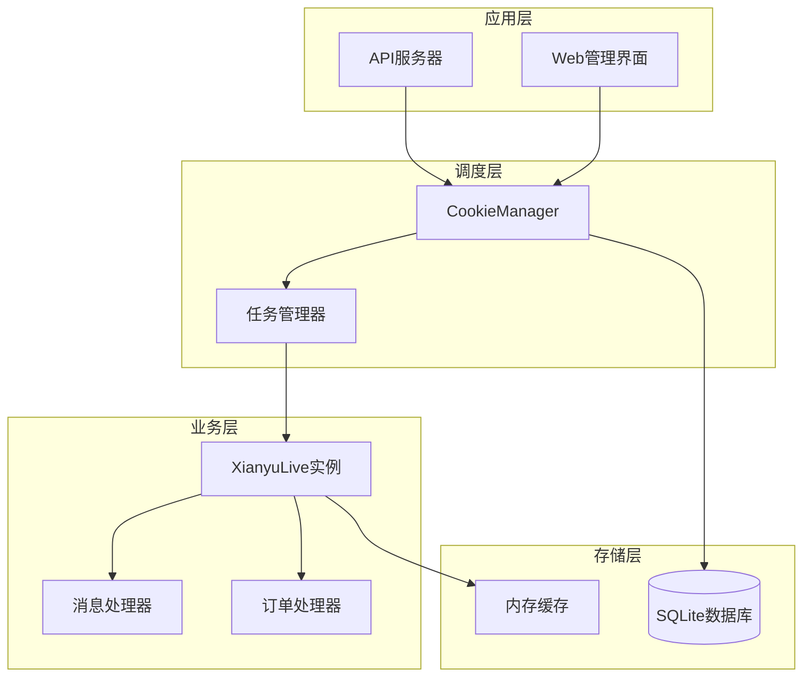
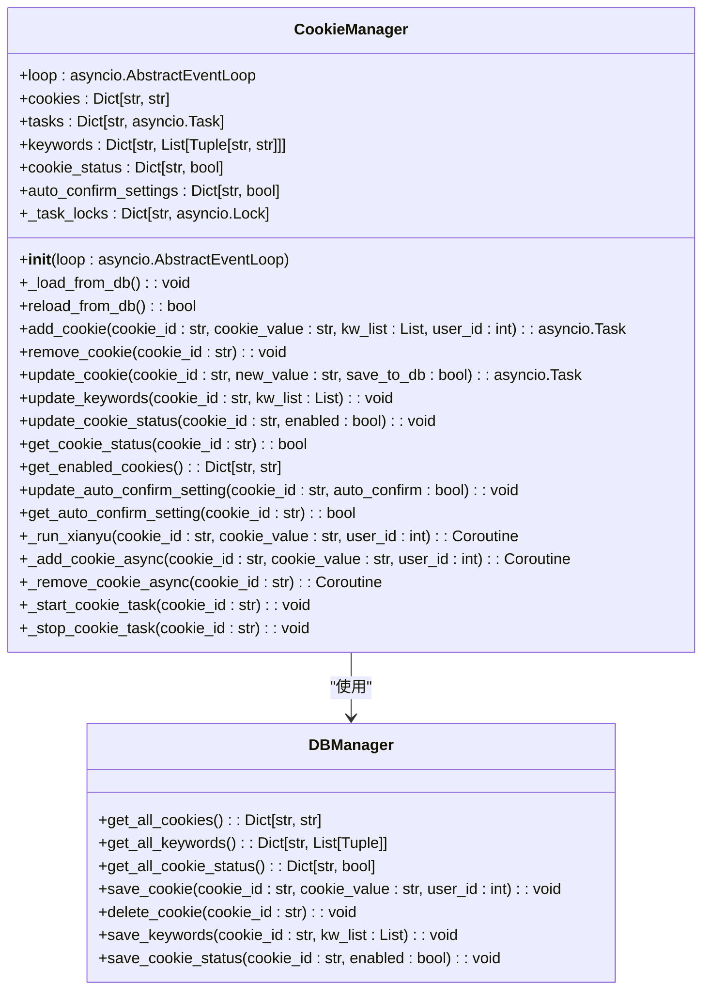
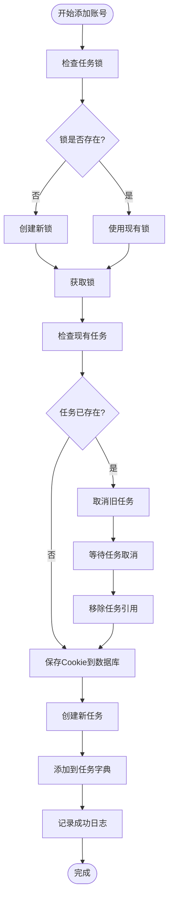
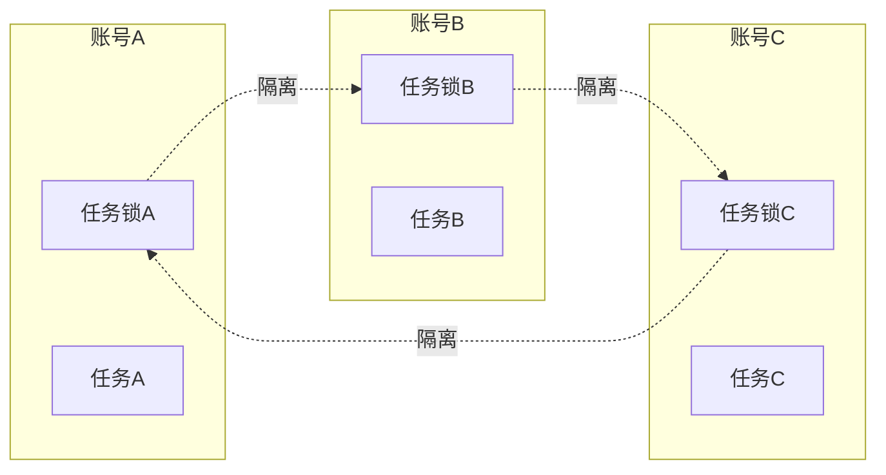
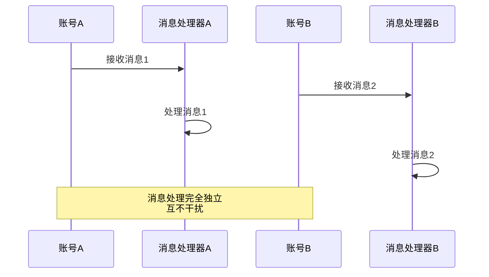
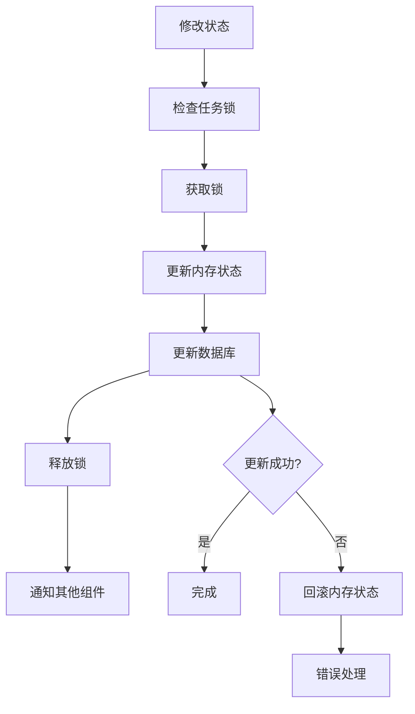
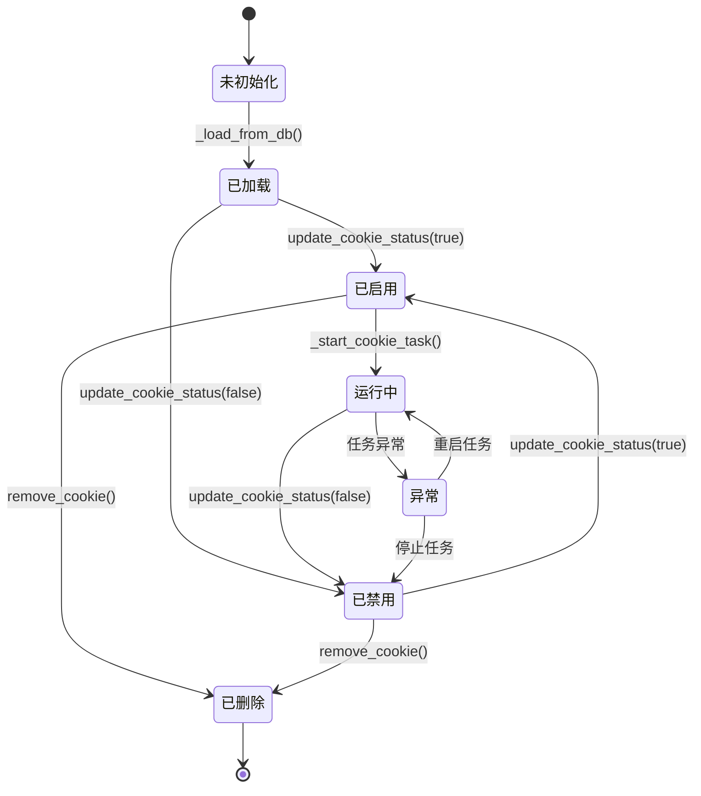
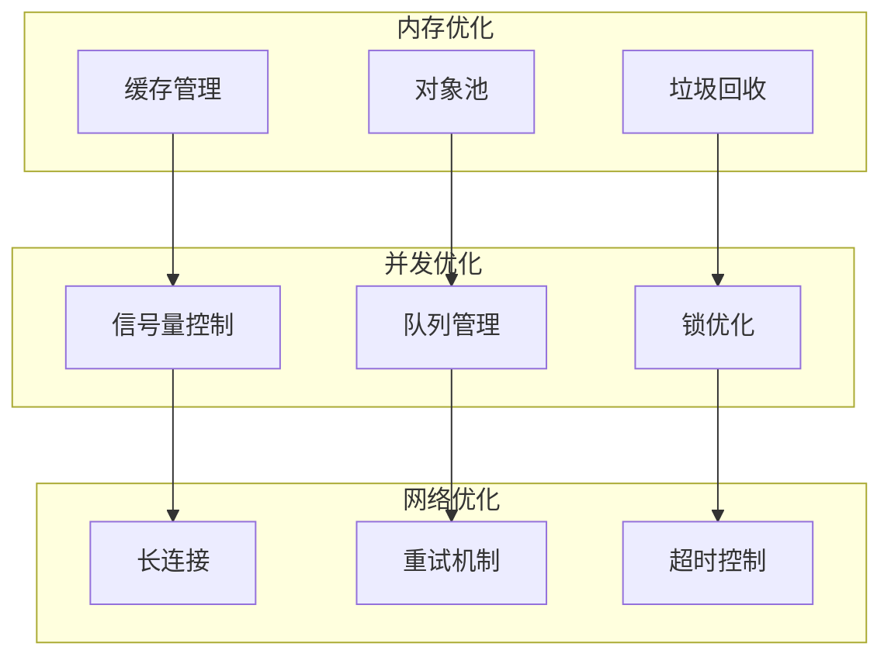
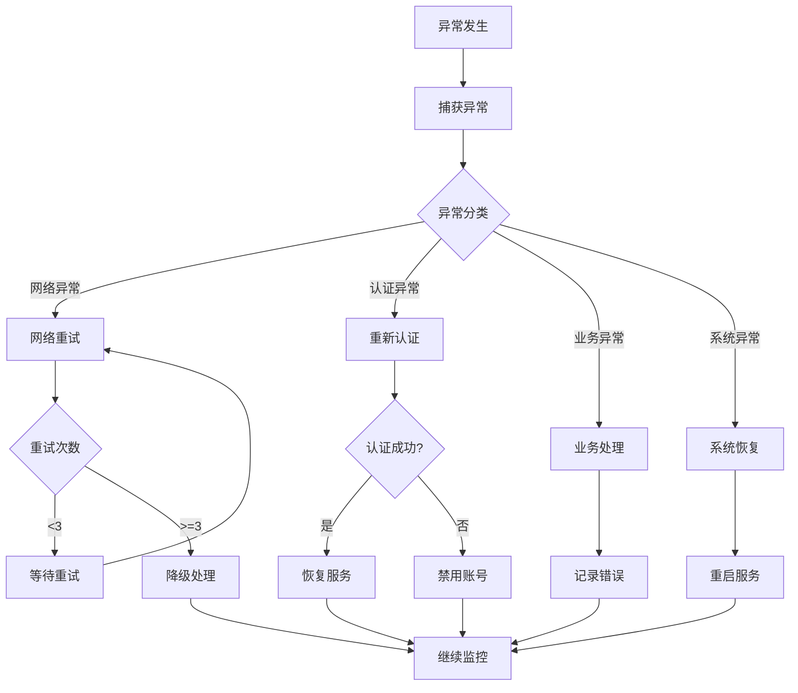

# 账号调度引擎

<cite>
**本文档引用的文件**
- [cookie_manager.py](file://cookie_manager.py)
- [db_manager.py](file://db_manager.py)
- [XianyuAutoAsync.py](file://XianyuAutoAsync.py)
- [Start.py](file://Start.py)
- [config.py](file://config.py)
- [reply_server.py](file://reply_server.py)
</cite>

## 目录
1. [简介](#简介)
2. [系统架构概览](#系统架构概览)
3. [CookieManager核心组件](#cookiemanager核心组件)
4. [任务调度机制](#任务调度机制)
5. [账号隔离与并发控制](#账号隔离与并发控制)
6. [状态持久化方案](#状态持久化方案)
7. [账号生命周期管理](#账号生命周期管理)
8. [性能优化策略](#性能优化策略)
9. [故障处理与监控](#故障处理与监控)
10. [总结](#总结)

## 简介

账号调度引擎是闲鱼自动回复系统的核心组件，负责管理多个闲鱼账号的并发执行、状态控制和资源隔离。该引擎采用基于asyncio的异步架构，通过CookieManager类实现对多个闲鱼账号的统一调度管理，确保每个账号在独立的协程中运行，同时提供完善的账号生命周期管理和状态持久化机制。

## 系统架构概览

账号调度引擎采用分层架构设计，主要包含以下核心层次：



**图表来源**
- [cookie_manager.py](file://cookie_manager.py#L10-L428)
- [Start.py](file://Start.py#L523-L576)
- [XianyuAutoAsync.py](file://XianyuAutoAsync.py#L158-L8372)

## CookieManager核心组件

### 类结构设计

CookieManager是账号调度引擎的核心控制器，负责管理所有闲鱼账号的生命周期和状态：



**图表来源**
- [cookie_manager.py](file://cookie_manager.py#L10-L428)
- [db_manager.py](file://db_manager.py#L16-L800)

### 核心属性说明

CookieManager类维护以下关键状态：

| 属性名 | 类型 | 用途 | 说明 |
|--------|------|------|------|
| `cookies` | `Dict[str, str]` | Cookie存储 | 存储所有账号的Cookie值，键为cookie_id，值为Cookie字符串 |
| `tasks` | `Dict[str, asyncio.Task]` | 任务管理 | 存储每个账号对应的异步任务对象 |
| `keywords` | `Dict[str, List[Tuple[str, str]]]` | 关键字配置 | 存储每个账号的关键字和回复映射关系 |
| `cookie_status` | `Dict[str, bool]` | 账号状态 | 存储账号的启用/禁用状态，默认启用 |
| `auto_confirm_settings` | `Dict[str, bool]` | 自动确认设置 | 存储账号的自动确认发货设置 |
| `_task_locks` | `Dict[str, asyncio.Lock]` | 任务锁 | 为每个账号维护独立的任务锁，防止重复创建 |

**章节来源**
- [cookie_manager.py](file://cookie_manager.py#L15-L20)

## 任务调度机制

### 异步任务管理

账号调度引擎采用基于asyncio的异步任务调度机制，每个闲鱼账号都在独立的协程中运行：

```mermaid
sequenceDiagram
participant CM as CookieManager
participant Loop as EventLoop
participant Task as asyncio.Task
participant XL as XianyuLive
participant WS as WebSocket
CM->>Loop : create_task(_run_xianyu)
Loop->>Task : 创建异步任务
Task->>XL : 实例化XianyuLive
XL->>WS : 建立WebSocket连接
WS-->>XL : 连接建立
XL->>XL : 开始消息监听循环
Task-->>CM : 任务创建完成
Note over CM,WS : 任务持续运行，处理消息和订单
```

**图表来源**
- [cookie_manager.py](file://cookie_manager.py#L59-L111)
- [Start.py](file://Start.py#L545-L547)

### 任务创建流程

任务创建遵循严格的序列化控制，确保账号的正确初始化：



**图表来源**
- [cookie_manager.py](file://cookie_manager.py#L112-L153)

**章节来源**
- [cookie_manager.py](file://cookie_manager.py#L112-L153)

## 账号隔离与并发控制

### 任务锁机制

为了防止重复任务创建和确保账号操作的原子性，CookieManager实现了细粒度的任务锁机制：



**图表来源**
- [cookie_manager.py](file://cookie_manager.py#L19-L20)

### 消息处理隔离

每个账号的消息处理完全独立，避免相互干扰：



**图表来源**
- [XianyuAutoAsync.py](file://XianyuAutoAsync.py#L851-L1217)

### 并发控制策略

系统实现了多层次的并发控制：

| 控制层级 | 实现方式 | 目标 | 说明 |
|----------|----------|------|------|
| 账号级隔离 | 独立任务锁 | 防止重复任务 | 每个账号使用独立的asyncio.Lock |
| 消息级并发 | 信号量控制 | 限制并发数量 | 使用Semaphore控制消息处理并发数 |
| 系统级限制 | 全局管理器 | 防止资源耗尽 | 通过SliderConcurrencyManager控制整体并发 |

**章节来源**
- [cookie_manager.py](file://cookie_manager.py#L113-L117)
- [XianyuAutoAsync.py](file://XianyuAutoAsync.py#L726-L727)

## 状态持久化方案

### 数据库架构设计

系统采用SQLite数据库实现状态持久化，支持账号信息、关键字配置和运行状态的长期存储：

```mermaid
erDiagram
COOKIES {
string id PK
string value
integer user_id FK
integer auto_confirm
string remark
integer pause_duration
string username
string password
integer show_browser
timestamp created_at
}
KEYWORDS {
string cookie_id FK
string keyword
string reply
string item_id
string type
string image_url
}
COOKIE_STATUS {
string cookie_id PK FK
boolean enabled
timestamp updated_at
}
AI_REPLY_SETTINGS {
string cookie_id PK FK
boolean ai_enabled
string model_name
string api_key
string base_url
integer max_discount_percent
integer max_discount_amount
integer max_bargain_rounds
string custom_prompts
timestamp created_at
timestamp updated_at
}
COOKIES ||--o{ KEYWORDS : "has"
COOKIES ||--|| COOKIE_STATUS : "has"
COOKIES ||--|| AI_REPLY_SETTINGS : "has"
```

**图表来源**
- [db_manager.py](file://db_manager.py#L109-L182)

### 持久化操作流程



**图表来源**
- [db_manager.py](file://db_manager.py#L446-L452)

**章节来源**
- [db_manager.py](file://db_manager.py#L16-L800)

## 账号生命周期管理

### 生命周期状态转换

账号从添加到终止经历完整的生命周期管理：



**图表来源**
- [cookie_manager.py](file://cookie_manager.py#L333-L426)

### 关键生命周期方法

| 方法名 | 触发时机 | 功能 | 影响范围 |
|--------|----------|------|----------|
| `_load_from_db()` | CookieManager初始化 | 从数据库加载所有账号信息 | 全局 |
| `add_cookie()` | API调用 | 添加新账号并启动任务 | 单账号 |
| `remove_cookie()` | API调用 | 移除账号并清理资源 | 单账号 |
| `update_cookie()` | Cookie更新 | 替换Cookie值并重启任务 | 单账号 |
| `update_cookie_status()` | 状态切换 | 启用/禁用账号 | 单账号 |
| `_start_cookie_task()` | 状态启用 | 启动账号的异步任务 | 单账号 |
| `_stop_cookie_task()` | 状态禁用 | 停止账号的异步任务 | 单账号 |

**章节来源**
- [cookie_manager.py](file://cookie_manager.py#L184-L426)

## 性能优化策略

### 资源管理优化

系统实现了多项性能优化措施：



### 性能监控指标

| 指标类别 | 监控项目 | 优化目标 | 实现方式 |
|----------|----------|----------|----------|
| 任务性能 | 任务创建时间 | < 1秒 | 异步初始化 |
| 内存使用 | 缓存大小 | < 1GB | LRU淘汰策略 |
| 网络性能 | 连接成功率 | > 99% | 重试机制 |
| 响应时间 | 消息处理延迟 | < 5秒 | 并发控制 |

**章节来源**
- [XianyuAutoAsync.py](file://XianyuAutoAsync.py#L726-L727)

## 故障处理与监控

### 异常处理机制

系统实现了完善的异常处理和恢复机制：



**图表来源**
- [cookie_manager.py](file://cookie_manager.py#L93-L111)

### 监控与告警

系统提供多维度的监控能力：

| 监控维度 | 监控项目 | 告警阈值 | 处理策略 |
|----------|----------|----------|----------|
| 账号状态 | 在线率 | < 95% | 自动重启 |
| 任务性能 | 响应时间 | > 10秒 | 负载均衡 |
| 系统资源 | CPU使用率 | > 80% | 限流处理 |
| 错误统计 | 异常频率 | > 10/分钟 | 立即告警 |

**章节来源**
- [cookie_manager.py](file://cookie_manager.py#L93-L111)

## 总结

账号调度引擎通过CookieManager类实现了对多个闲鱼账号的高效、安全、可靠的并发管理。系统的核心优势包括：

1. **完善的账号隔离**：通过独立的任务锁和异步任务实现账号间的完全隔离
2. **可靠的状态持久化**：基于SQLite的数据库方案确保状态的持久性和一致性
3. **灵活的生命周期管理**：支持账号的动态添加、移除、启用和禁用
4. **高效的并发控制**：多层次的并发控制机制保证系统的稳定性和性能
5. **强大的故障恢复**：完善的异常处理和自动恢复机制确保系统的高可用性

该引擎为闲鱼自动回复系统提供了坚实的底层支撑，能够满足大规模多账号并发处理的需求，同时保证了系统的稳定性和可维护性。