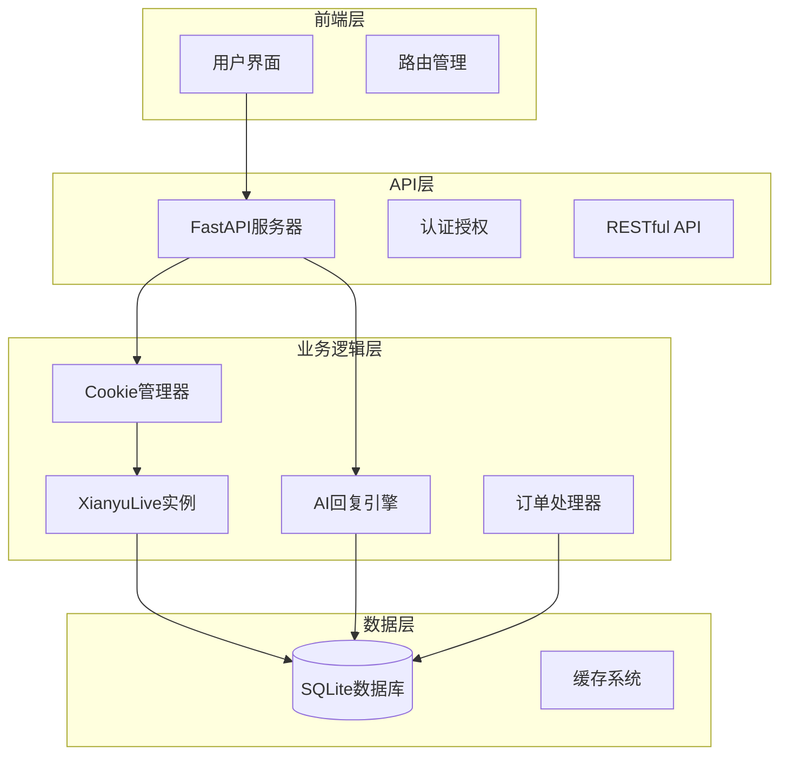
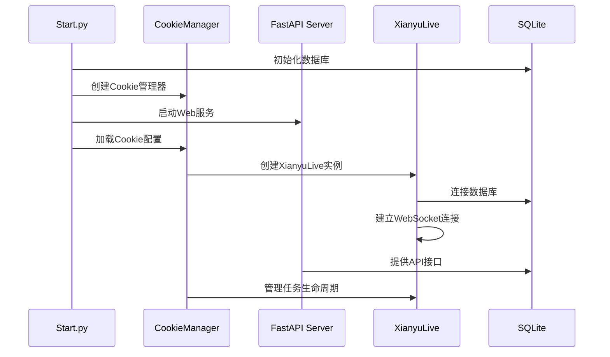
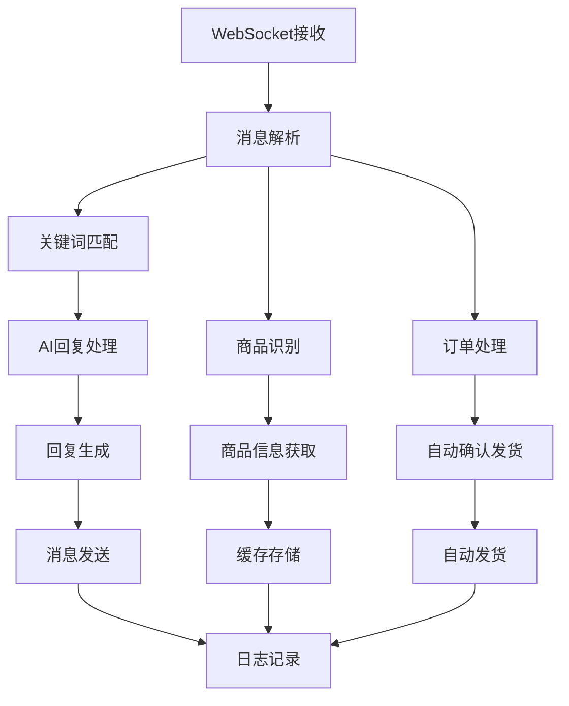

# 系统概述

<cite>
**本文档引用的文件**
- [README.md](file://README.md)
- [Start.py](file://Start.py)
- [reply_server.py](file://reply_server.py)
- [XianyuAutoAsync.py](file://XianyuAutoAsync.py)
- [ai_reply_engine.py](file://ai_reply_engine.py)
- [db_manager.py](file://db_manager.py)
- [config.py](file://config.py)
- [cookie_manager.py](file://cookie_manager.py)
- [Dockerfile](file://Dockerfile)
- [global_config.yml](file://global_config.yml)
- [static/index.html](file://static/index.html)
</cite>

## 目录
1. [项目简介](#项目简介)
2. [核心目标与解决的问题](#核心目标与解决的问题)
3. [主要功能特性](#主要功能特性)
4. [系统架构风格](#系统架构风格)
5. [技术选型分析](#技术选型分析)
6. [模块组织结构](#模块组织结构)
7. [核心组件关系](#核心组件关系)
8. [部署方式与环境](#部署方式与环境)
9. [使用场景示例](#使用场景示例)
10. [技术深度与概念引导](#技术深度与概念引导)

## 项目简介

闲鱼自动回复系统是一个功能完整的闲鱼电商平台自动化管理系统，采用现代化的技术架构，支持多用户、多账号管理，具备智能回复、自动发货、自动确认发货、商品管理等企业级功能。系统基于Python异步编程，使用FastAPI提供RESTful API，SQLite数据库存储，支持Docker一键部署。

该系统专为个人卖家和电商运营者设计，能够显著提升闲鱼店铺的运营效率，减少人工干预，实现全天候自动化运营。系统具有高度的可扩展性和稳定性，支持大规模部署和企业级应用场景。

**章节来源**
- [README.md](file://README.md#L15-L17)

## 核心目标与解决的问题

### 核心目标

1. **提升运营效率**：通过自动化回复和发货，大幅减少人工操作时间
2. **改善用户体验**：提供即时响应和专业的商品咨询服务
3. **降低运营成本**：减少人力投入，实现24/7全天候运营
4. **增强竞争力**：通过智能化服务提升店铺转化率和客户满意度

### 解决的关键问题

1. **人工回复效率低**：传统的人工回复方式无法满足高频次的客户需求
2. **发货时效性差**：手动发货容易导致延迟，影响客户体验
3. **多账号管理困难**：缺乏统一的管理平台来协调多个闲鱼账号
4. **数据孤岛问题**：不同功能模块间缺乏数据共享和协同
5. **系统稳定性不足**：传统解决方案容易出现连接断开和服务中断

**章节来源**
- [README.md](file://README.md#L38-L95)

## 主要功能特性

### 多用户系统

- **用户注册登录**：支持邮箱验证码注册，图形验证码保护
- **数据完全隔离**：每个用户的数据独立存储，互不干扰
- **权限管理**：严格的用户权限控制和JWT认证
- **安全保护**：防暴力破解、会话管理、安全日志

### 多账号管理

- **无限账号支持**：每个用户可管理多个闲鱼账号
- **独立运行**：每个账号独立监控，互不影响
- **实时状态**：账号连接状态实时监控
- **批量操作**：支持批量启动、停止账号任务

### 智能回复系统

- **关键词匹配**：支持精确关键词匹配回复
- **指定商品回复**：支持为特定商品设置专门的回复内容
- **AI智能回复**：集成OpenAI API，支持上下文理解
- **变量替换**：回复内容支持动态变量（用户名、商品信息等）

### 自动发货功能

- **智能匹配**：基于商品信息自动匹配发货规则
- **多规格支持**：支持同一商品的不同规格自动匹配
- **防重复发货**：智能防重复机制，避免重复发货
- **多种发货方式**：支持固定文字、批量数据、API调用、图片发货

### 商品管理

- **自动收集**：消息触发时自动收集商品信息
- **API获取**：通过闲鱼API获取完整商品详情
- **多规格支持**：支持多规格商品的规格信息管理

### 商品搜索功能

- **真实数据获取**：基于Playwright技术获取真实闲鱼商品数据
- **智能排序**：按"人想要"数量自动倒序排列
- **多页搜索**：支持一次性获取多页商品数据

**章节来源**
- [README.md](file://README.md#L40-L95)

## 系统架构风格

### 整体架构模式

系统采用**微服务架构**和**模块化设计**，具有以下特点：

1. **分层架构**：清晰的分层设计，职责分离明确
2. **事件驱动**：基于WebSocket的实时通信机制
3. **异步处理**：基于asyncio的高性能异步处理模型
4. **前后端分离**：独立的前端界面和后端服务

### 技术架构特点



**图表来源**
- [Start.py](file://Start.py#L1-L50)
- [reply_server.py](file://reply_server.py#L1-L100)
- [XianyuAutoAsync.py](file://XianyuAutoAsync.py#L1-L100)

### 通信机制

1. **WebSocket实时通信**：用于闲鱼消息的实时接收和处理
2. **RESTful API**：提供完整的管理接口和数据交互
3. **HTTP长连接**：用于与闲鱼平台的API通信

**章节来源**
- [README.md](file://README.md#L19-L37)

## 技术选型分析

### 后端技术栈

#### FastAPI + Python 3.11+
- **选择理由**：现代异步框架，性能优异，开发效率高
- **优势**：自动生成API文档，类型安全，异步支持
- **应用场景**：Web服务器、RESTful API、实时通信

#### asyncio异步处理
- **选择理由**：高并发处理能力，资源利用率高
- **优势**：单线程处理大量连接，内存占用低
- **应用场景**：WebSocket连接管理、并发任务处理

### 数据存储

#### SQLite 3
- **选择理由**：轻量级、嵌入式、零配置
- **优势**：数据完整性、事务支持、跨平台兼容
- **应用场景**：用户数据、配置信息、商品信息、订单数据

#### 多用户数据隔离
- **设计思路**：每个用户的数据完全独立存储
- **实现方式**：基于用户ID的表分区和权限控制
- **安全考虑**：防止数据泄露和非法访问

### 前端技术栈

#### Bootstrap 5 + Vanilla JavaScript
- **选择理由**：成熟稳定的前端框架，响应式设计
- **优势**：丰富的组件库，良好的浏览器兼容性
- **应用场景**：用户界面、交互控制、数据展示

#### 响应式设计
- **设计理念**：适配各种设备和屏幕尺寸
- **实现方式**：CSS Grid + Flexbox布局
- **用户体验**：无缝的移动端和桌面端体验

### 部署技术

#### Docker容器化
- **选择理由**：环境一致性、快速部署、易于扩展
- **优势**：标准化部署、资源隔离、版本管理
- **应用场景**：生产环境部署、开发环境搭建

#### Nginx反向代理
- **选择理由**：高性能Web服务器、负载均衡
- **优势**：静态文件服务、SSL终止、请求转发
- **应用场景**：流量分发、安全防护、性能优化

**章节来源**
- [README.md](file://README.md#L19-L37)
- [Dockerfile](file://Dockerfile#L1-L50)

## 模块组织结构

### 核心启动模块

#### Start.py - 项目启动入口
- **功能**：初始化所有服务，启动Cookie管理器和FastAPI服务
- **职责**：数据库迁移、Playwright检查、服务启动
- **特点**：异步启动，支持环境变量配置

#### XianyuAutoAsync.py - 闲鱼WebSocket核心
- **功能**：处理闲鱼WebSocket连接和消息处理
- **职责**：消息收发、自动回复、自动发货、商品信息收集
- **特点**：异步处理、多实例并行、状态管理

#### reply_server.py - FastAPI Web服务器
- **功能**：提供RESTful API接口和管理界面
- **职责**：用户认证、权限管理、API路由、文件上传
- **特点**：模块化设计、中间件支持、健康检查

### 数据和配置管理

#### db_manager.py - SQLite数据库管理
- **功能**：数据库连接管理、CRUD操作、数据迁移
- **职责**：用户管理、Cookie存储、配置管理、数据备份
- **特点**：线程安全、事务支持、自动迁移

#### config.py - 全局配置管理
- **功能**：配置文件加载和管理
- **职责**：环境变量处理、配置验证、动态更新
- **特点**：单例模式、类型安全、热重载

### 智能功能模块

#### ai_reply_engine.py - AI智能回复引擎
- **功能**：集成多种AI模型，智能回复生成
- **职责**：意图识别、上下文管理、回复生成
- **特点**：多模型支持、无状态设计、并发控制

#### cookie_manager.py - 多账号Cookie管理
- **功能**：多账号任务调度和管理
- **职责**：账号生命周期管理、状态监控、异常处理
- **特点**：线程安全、异步操作、自动重连

### 工具模块 (utils/)

#### xianyu_utils.py - 闲鱼API工具
- **功能**：加密算法、签名生成、数据解析
- **职责**：Cookie处理、请求封装、数据验证
- **特点**：安全性高、兼容性强、性能优化

#### message_utils.py - 消息处理工具
- **功能**：消息格式化、变量替换、内容过滤
- **职责**：消息解析、模板渲染、防刷机制
- **特点**：高效处理、内存优化、错误恢复

**章节来源**
- [README.md](file://README.md#L555-L607)
- [Start.py](file://Start.py#L1-L100)
- [XianyuAutoAsync.py](file://XianyuAutoAsync.py#L1-L100)

## 核心组件关系

### 启动流程架构



**图表来源**
- [Start.py](file://Start.py#L513-L587)
- [cookie_manager.py](file://cookie_manager.py#L10-L50)

### 数据流架构



**图表来源**
- [XianyuAutoAsync.py](file://XianyuAutoAsync.py#L1-L200)
- [ai_reply_engine.py](file://ai_reply_engine.py#L1-L100)

### 组件交互关系

1. **Start.py** 作为系统入口，负责整体初始化
2. **CookieManager** 管理多个 **XianyuLive** 实例
3. **XianyuLive** 处理具体的闲鱼消息和业务逻辑
4. **FastAPI** 提供统一的API接口和管理界面
5. **SQLite** 存储所有业务数据和配置信息

**章节来源**
- [Start.py](file://Start.py#L513-L587)
- [cookie_manager.py](file://cookie_manager.py#L10-L50)
- [XianyuAutoAsync.py](file://XianyuAutoAsync.py#L628-L700)

## 部署方式与环境

### Docker容器化部署

#### 镜像构建
- **基础镜像**：Python 3.11-slim
- **优化策略**：多阶段构建、依赖缓存、最小化镜像
- **安全考虑**：非root用户、权限最小化、漏洞扫描

#### 部署配置
- **端口映射**：8080:8080
- **数据卷挂载**：`./data:/app/data`
- **环境变量**：支持配置覆盖和动态调整

#### 支持的架构
- **x86_64 (amd64)**：Intel/AMD处理器
- **ARM64 (aarch64)**：ARM处理器、Apple M系列

### 环境要求

#### 系统要求
- **操作系统**：Windows/Linux/macOS
- **架构支持**：x86_64/AMD64、ARM64
- **内存**：建议2GB+可用内存
- **存储**：建议10GB+可用空间

#### 依赖组件
- **Python**：3.11+
- **Node.js**：16+
- **Docker**：20.10+（可选）
- **Playwright**：浏览器自动化

### 快速部署方式

#### Docker一键部署（推荐）
```bash
# 国内用户（阿里云镜像）
docker run -d \
  -p 8080:8080 \
  --restart always \
  -v $PWD/xianyu-auto-reply/:/app/data/ \
  --name xianyu-auto-reply \
  registry.cn-shanghai.aliyuncs.com/zhinian-software/xianyu-auto-reply:latest
```

#### 本地开发部署
```bash
# 克隆项目
git clone https://github.com/zhinianboke/xianyu-auto-reply.git
cd xianyu-auto-reply

# 创建虚拟环境
python -m venv venv
source venv/bin/activate  # Linux/macOS
# 或 venv\Scripts\activate  # Windows

# 安装依赖
pip install --upgrade pip
pip install -r requirements.txt

# 安装Playwright浏览器
playwright install chromium

# 启动系统
python Start.py
```

**章节来源**
- [README.md](file://README.md#L241-L360)
- [Dockerfile](file://Dockerfile#L1-L138)

## 使用场景示例

### 个人卖家自动化运营

#### 场景描述
- **目标用户**：个人二手商品卖家
- **核心需求**：减少人工回复时间，提高转化率
- **解决方案**：智能关键词回复 + AI助手

#### 实施步骤
1. **账号配置**：添加闲鱼账号和Cookie
2. **关键词设置**：配置常见问题的自动回复
3. **AI集成**：启用OpenAI API进行智能回复
4. **效果监控**：通过仪表板查看回复效果

### 多店铺批量管理

#### 场景描述
- **目标用户**：电商运营团队
- **核心需求**：统一管理多个闲鱼店铺
- **解决方案**：多用户系统 + 分权管理

#### 实施步骤
1. **用户管理**：创建多个运营账号
2. **权限分配**：设置不同角色的访问权限
3. **批量操作**：同时管理多个店铺的回复规则
4. **数据统计**：汇总各店铺的运营数据

### 企业级电商运营

#### 场景描述
- **目标用户**：电商公司
- **核心需求**：规模化自动化运营
- **解决方案**：高并发架构 + 企业级功能

#### 实施步骤
1. **集群部署**：部署多个服务实例
2. **负载均衡**：配置Nginx进行流量分发
3. **监控告警**：建立完善的监控体系
4. **数据备份**：制定数据保护策略

### 商品搜索与竞品分析

#### 场景描述
- **目标用户**：市场分析师
- **核心需求**：获取真实的商品数据
- **解决方案**：商品搜索功能 + 数据分析

#### 实施步骤
1. **搜索配置**：设置搜索关键词和范围
2. **数据收集**：自动获取商品信息和销量数据
3. **趋势分析**：分析商品热度和市场需求
4. **决策支持**：为采购和定价提供数据支撑

**章节来源**
- [README.md](file://README.md#L444-L473)
- [static/index.html](file://static/index.html#L1-L200)

## 技术深度与概念引导

### 初学者概念引导

#### WebSocket实时通信原理
- **概念解释**：WebSocket是一种全双工通信协议
- **技术要点**：握手过程、心跳机制、连接状态管理
- **应用场景**：消息推送、实时聊天、状态同步

#### 异步编程基础
- **核心概念**：协程、事件循环、异步任务
- **实现方式**：async/await语法、asyncio模块
- **优势特点**：高并发处理、资源节省、响应迅速

#### 数据库设计原则
- **范式理论**：第一范式到第三范式
- **索引优化**：查询性能提升的关键
- **事务管理**：数据一致性的保障

### 高级开发者技术深度

#### 多实例架构设计
- **设计模式**：单例模式、工厂模式、观察者模式
- **并发控制**：锁机制、信号量、原子操作
- **资源管理**：连接池、对象池、垃圾回收

#### 安全架构设计
- **认证机制**：JWT令牌、会话管理、权限控制
- **数据保护**：加密存储、传输安全、访问审计
- **防护措施**：防刷机制、频率限制、异常检测

#### 性能优化策略
- **缓存机制**：多级缓存、缓存策略、失效处理
- **数据库优化**：查询优化、索引设计、连接池
- **网络优化**：连接复用、请求合并、超时控制

#### 可扩展性设计
- **微服务架构**：服务拆分、接口设计、数据一致性
- **水平扩展**：负载均衡、状态分离、无状态设计
- **监控体系**：指标收集、告警机制、性能分析

### 架构演进指导

#### 从单机到集群
1. **单机部署**：适合小型项目和个人使用
2. **容器化部署**：提高部署效率和环境一致性
3. **集群部署**：支持高并发和高可用性
4. **微服务化**：进一步提升系统的可维护性和扩展性

#### 技术栈演进
1. **基础功能**：实现核心业务逻辑
2. **性能优化**：引入缓存和异步处理
3. **架构升级**：采用微服务和容器化
4. **智能化**：集成AI和大数据分析

**章节来源**
- [XianyuAutoAsync.py](file://XianyuAutoAsync.py#L1-L200)
- [db_manager.py](file://db_manager.py#L1-L200)
- [config.py](file://config.py#L1-L126)

## 总结

闲鱼自动回复系统是一个技术先进、功能完备的电商平台自动化解决方案。通过采用现代化的技术架构和设计理念，系统实现了高效率、高可靠性和高可扩展性的目标。

### 核心优势

1. **技术先进性**：采用FastAPI、asyncio、Docker等现代技术
2. **功能完整性**：涵盖自动回复、自动发货、智能分析等核心功能
3. **架构合理性**：微服务设计、模块化架构、前后端分离
4. **部署便捷性**：Docker一键部署、环境一致性、快速扩容

### 应用价值

- **提升运营效率**：自动化处理大幅提升工作效率
- **改善用户体验**：即时响应和专业服务提升客户满意度
- **降低运营成本**：减少人力投入，实现24/7全天候运营
- **增强竞争优势**：智能化服务帮助商家获得更多订单

### 发展前景

随着人工智能和自动化技术的不断发展，该系统具有广阔的应用前景和发展空间。未来可以进一步集成更多AI功能，支持更多电商平台，为企业数字化转型提供强有力的支持。