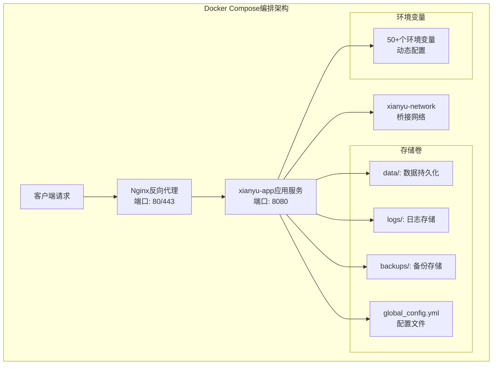
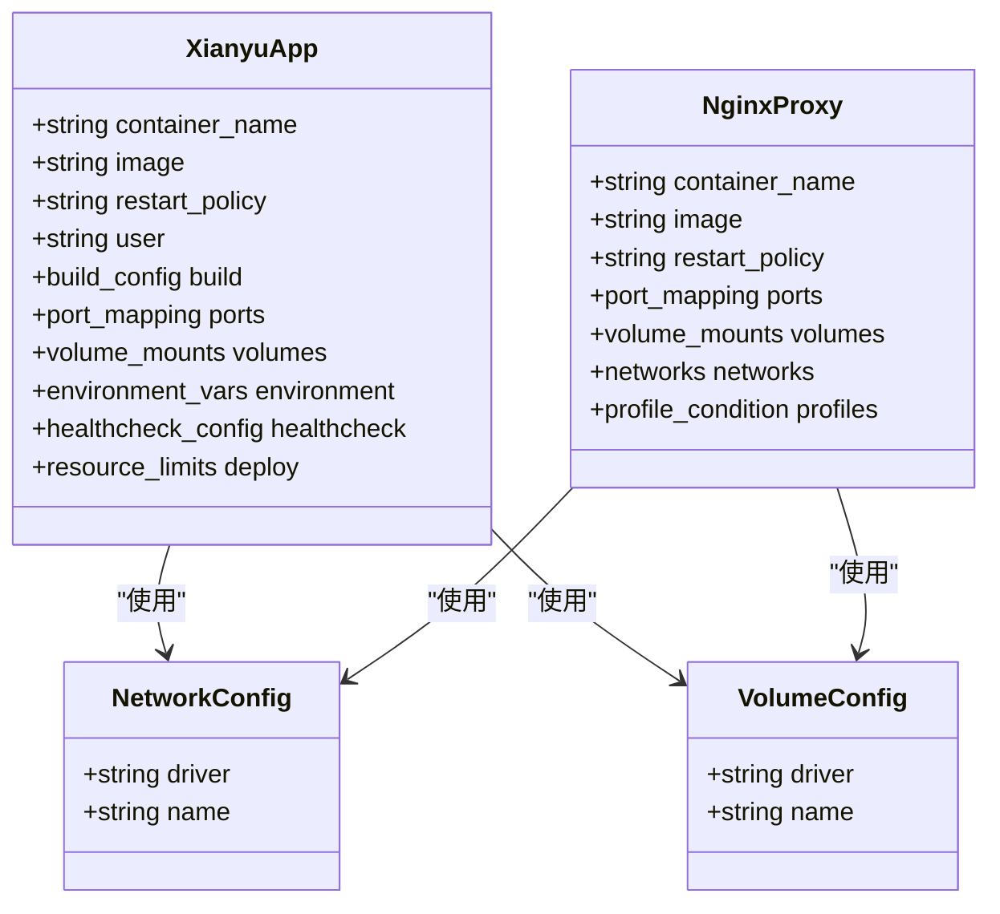
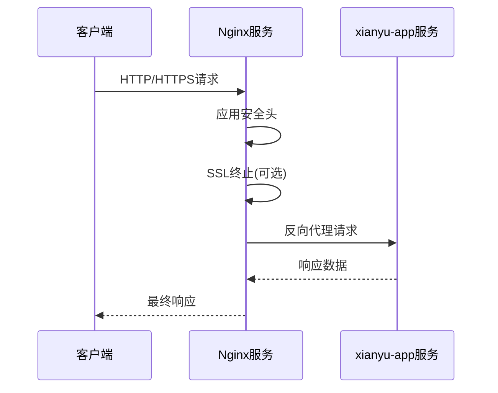
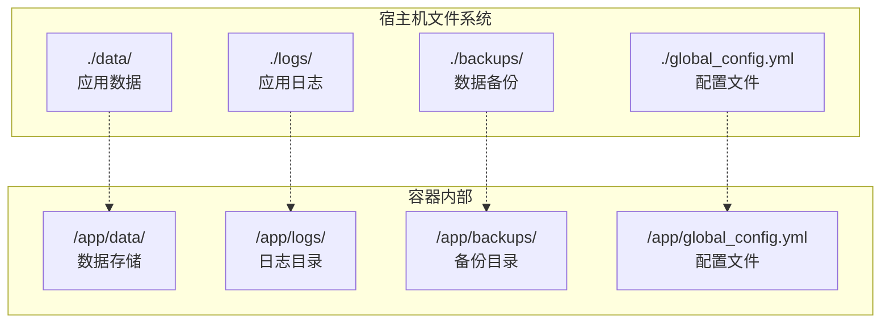
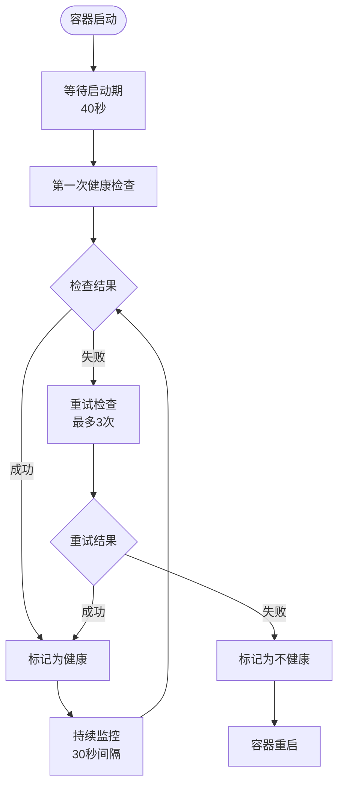
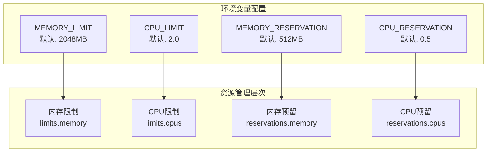
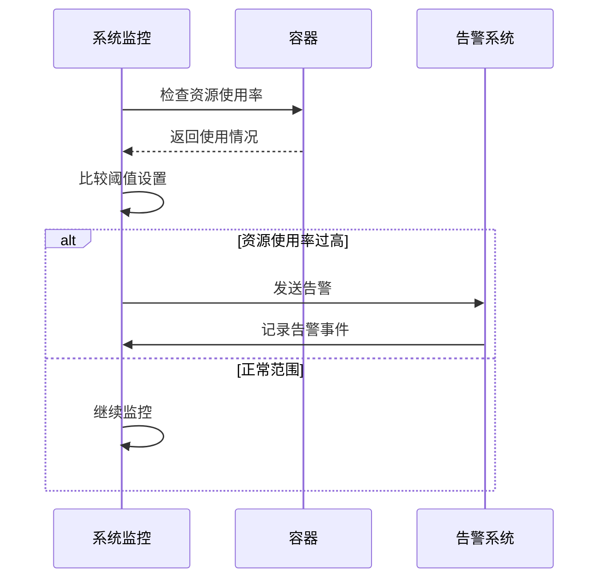
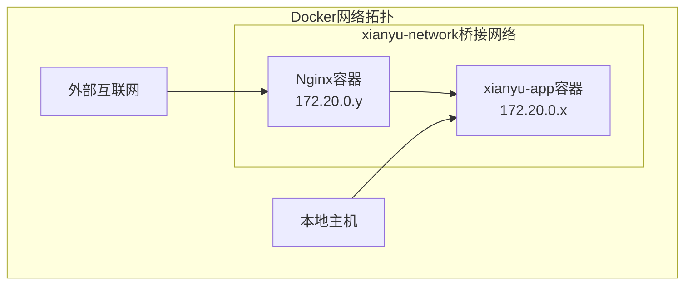
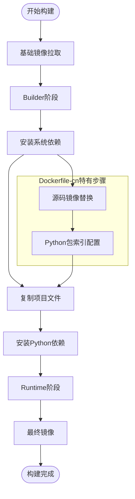

# Docker容器编排配置详解

<cite>
**本文档引用的文件**
- [docker-compose.yml](file://docker-compose.yml)
- [docker-compose-cn.yml](file://docker-compose-cn.yml)
- [Dockerfile](file://Dockerfile)
- [Dockerfile-cn](file://Dockerfile-cn)
- [global_config.yml](file://global_config.yml)
- [entrypoint.sh](file://entrypoint.sh)
- [nginx/nginx.conf](file://nginx/nginx.conf)
</cite>

## 目录
1. [项目概述](#项目概述)
2. [核心服务架构](#核心服务架构)
3. [xianyu-app主服务配置](#xianyu-app主服务配置)
4. [Nginx反向代理配置](#nginx反向代理配置)
5. [环境变量配置机制](#环境变量配置机制)
6. [卷挂载策略](#卷挂载策略)
7. [健康检查配置](#健康检查配置)
8. [资源限制配置](#资源限制配置)
9. [网络配置](#网络配置)
10. [Dockerfile差异分析](#dockerfile差异分析)
11. [部署最佳实践](#部署最佳实践)

## 项目概述

本项目采用Docker Compose进行容器编排，提供了一个完整的闲鱼自动回复系统解决方案。系统包含两个主要服务：核心应用服务(xianyu-app)和可选的反向代理服务(Nginx)，支持多种部署场景和配置选项。



**图表来源**
- [docker-compose.yml](file://docker-compose.yml#L1-L106)
- [nginx/nginx.conf](file://nginx/nginx.conf#L43-L46)

## 核心服务架构

系统采用微服务架构设计，通过Docker Compose实现服务编排和管理：



**图表来源**
- [docker-compose.yml](file://docker-compose.yml#L2-L106)

**章节来源**
- [docker-compose.yml](file://docker-compose.yml#L1-L106)

## xianyu-app主服务配置

### 构建配置

xianyu-app服务提供了两种构建方式，通过不同的Dockerfile适应不同部署需求：

| 配置项 | docker-compose.yml | docker-compose-cn.yml | 说明 |
|--------|-------------------|----------------------|------|
| 构建上下文 | `context: .` | `context: .` | 当前目录作为构建上下文 |
| Dockerfile选择 | `dockerfile: Dockerfile` | `dockerfile: Dockerfile-cn` | 根据地区选择合适的Dockerfile |
| 镜像名称 | `image: xianyu-auto-reply:latest` | `image: xianyu-auto-reply:latest` | 最新版本镜像 |

### 容器属性配置

| 属性 | 值 | 作用 |
|------|-----|------|
| 容器名称 | `xianyu-auto-reply` | 方便识别和管理容器 |
| 重启策略 | `unless-stopped` | 容器异常退出时自动重启，即使Docker守护进程停止也不重启 |
| 用户权限 | `0:0` (root) | 使用root用户运行，避免权限问题 |

### 端口映射机制

系统采用环境变量驱动的端口映射策略，提供高度灵活性：

```yaml
ports:
  - "${WEB_PORT:-8080}:8080"
```

这种配置的优势：
- **默认端口**：WEB_PORT未设置时，默认使用8080端口
- **灵活定制**：可通过环境变量自定义端口
- **配置分离**：将端口配置与服务配置分离

### 用户权限配置

系统使用root用户运行的原因：
- **简化部署**：避免复杂的权限配置
- **文件操作**：确保对所有目录的读写权限
- **开发便利**：便于调试和开发过程中的文件操作

**章节来源**
- [docker-compose.yml](file://docker-compose.yml#L3-L10)

## Nginx反向代理配置

### 可选配置机制

Nginx服务通过profiles机制实现条件启用：

```yaml
profiles:
  - with-nginx
```

这种设计允许：
- **按需部署**：只有在需要时才启动Nginx服务
- **性能优化**：减少不必要的服务开销
- **配置灵活性**：支持不同的部署场景

### SSL证书挂载

```yaml
volumes:
  - ./nginx/nginx.conf:/etc/nginx/nginx.conf:ro
  - ./nginx/ssl:/etc/nginx/ssl:ro
```

挂载内容说明：
- **nginx.conf**：Nginx主配置文件，只读挂载
- **ssl/**：SSL证书目录，只读挂载

### 端口转发配置

| 外部端口 | 内部端口 | 协议 | 用途 |
|----------|----------|------|------|
| 80 | 80 | HTTP | HTTP流量转发 |
| 443 | 443 | HTTPS | HTTPS流量转发 |

### 服务依赖关系



**图表来源**
- [nginx/nginx.conf](file://nginx/nginx.conf#L49-L87)
- [docker-compose.yml](file://docker-compose.yml#L80-L96)

**章节来源**
- [docker-compose.yml](file://docker-compose.yml#L79-L96)

## 环境变量配置机制

系统通过环境变量实现了超过50个配置参数的动态管理，涵盖了应用运行的各个方面。

### 核心环境变量分类

| 类别 | 变量数量 | 主要功能 | 示例变量 |
|------|----------|----------|----------|
| 基础配置 | 5 | 应用基本设置 | `PYTHONUNBUFFERED`, `TZ`, `DB_PATH` |
| 日志配置 | 3 | 日志系统设置 | `LOG_LEVEL`, `SQL_LOG_ENABLED`, `SQL_LOG_LEVEL` |
| 管理员配置 | 2 | 管理员账户设置 | `ADMIN_USERNAME`, `ADMIN_PASSWORD` |
| JWT认证 | 1 | JWT密钥配置 | `JWT_SECRET_KEY` |
| 会话管理 | 1 | 会话超时设置 | `SESSION_TIMEOUT` |
| 多用户系统 | 4 | 多用户功能开关 | `MULTIUSER_ENABLED`, `USER_REGISTRATION_ENABLED` |
| 验证机制 | 1 | 验证码功能 | `CAPTCHA_ENABLED` |
| 令牌管理 | 2 | 令牌过期和刷新 | `TOKEN_EXPIRE_TIME`, `TOKEN_REFRESH_INTERVAL` |
| 自动回复 | 3 | 自动回复功能 | `AUTO_REPLY_ENABLED`, `AUTO_DELIVERY_ENABLED` |
| API配置 | 1 | API卡片超时 | `API_CARD_TIMEOUT` |
| AI回复 | 6 | AI回复功能 | `AI_REPLY_ENABLED`, `DEFAULT_AI_MODEL` |
| WebSocket | 5 | WebSocket连接 | `WEBSOCKET_URL`, `HEARTBEAT_INTERVAL` |
| 批处理 | 1 | 批处理锁超时 | `BATCH_DATA_LOCK_TIMEOUT` |
| 消息系统 | 1 | 消息过期时间 | `MESSAGE_EXPIRE_TIME` |

### 默认值配置策略

系统采用优雅的默认值配置策略：

```yaml
# 基础配置示例
- PYTHONUNBUFFERED=${PYTHONUNBUFFERED:-1}
- TZ=${TZ:-Asia/Shanghai}
- DB_PATH=${DB_PATH:-/app/data/xianyu_data.db}
- LOG_LEVEL=${LOG_LEVEL:-INFO}
```

这种配置的优势：
- **零配置启动**：无需任何配置即可正常运行
- **可选覆盖**：需要时可以轻松覆盖默认值
- **环境适配**：根据不同环境自动调整配置

### 关键配置参数详解

#### 数据库路径配置
```yaml
DB_PATH=${DB_PATH:-/app/data/xianyu_data.db}
```
- **默认位置**：容器内的`/app/data/`目录
- **持久化保证**：通过卷挂载实现数据持久化
- **路径灵活性**：支持自定义数据库位置

#### 日志级别配置
```yaml
- LOG_LEVEL=${LOG_LEVEL:-INFO}
- SQL_LOG_ENABLED=${SQL_LOG_ENABLED:-true}
- SQL_LOG_LEVEL=${SQL_LOG_LEVEL:-INFO}
```
- **INFO级别**：生产环境推荐的日志级别
- **SQL日志**：可选的SQL查询日志记录
- **分级控制**：不同组件的日志级别可独立配置

#### AI回复配置
```yaml
- AI_REPLY_ENABLED=${AI_REPLY_ENABLED:-false}
- DEFAULT_AI_MODEL=${DEFAULT_AI_MODEL:-qwen-plus}
- DEFAULT_AI_BASE_URL=${DEFAULT_AI_BASE_URL:-https://dashscope.aliyuncs.com/compatible-mode/v1}
```
- **功能开关**：可启用或禁用AI回复功能
- **模型选择**：支持多种AI模型
- **API端点**：可配置不同的AI服务提供商

**章节来源**
- [docker-compose.yml](file://docker-compose.yml#L22-L59)

## 卷挂载策略

系统采用了精心设计的卷挂载策略，确保数据的持久化和配置的安全性。

### 数据持久化策略

| 挂载类型 | 宿主机路径 | 容器路径 | 权限 | 用途 |
|----------|------------|----------|------|------|
| 数据卷 | `./data` | `/app/data` | rw | 应用数据存储 |
| 日志卷 | `./logs` | `/app/logs` | rw | 应用日志输出 |
| 配置卷 | `./global_config.yml` | `/app/global_config.yml` | ro | 全局配置文件 |
| 备份卷 | `./backups` | `/app/backups` | rw | 数据备份存储 |

### 卷挂载架构图



**图表来源**
- [docker-compose.yml](file://docker-compose.yml#L14-L21)

### 配置文件安全策略

#### 只读挂载配置文件
```yaml
- ./global_config.yml:/app/global_config.yml:ro
```

这种设计的安全优势：
- **防止篡改**：容器无法修改宿主机配置文件
- **版本控制**：配置文件可以纳入版本控制系统
- **统一管理**：多个容器实例共享同一配置

#### 可选自定义配置
```yaml
# 可选：如果需要自定义配置
# - ./custom_config.yml:/app/global_config.yml:ro
```

这种灵活性允许：
- **环境隔离**：不同环境使用不同的配置文件
- **功能扩展**：为特定需求提供定制配置
- **配置热更新**：无需重启容器即可应用新配置

### 目录权限管理

系统通过entrypoint脚本自动管理目录权限：

```bash
# 创建必要目录
mkdir -p /app/data /app/logs /app/backups /app/static/uploads/images

# 设置目录权限
chmod 777 /app/data /app/logs /app/backups /app/static/uploads /app/static/uploads/images
```

权限设计原则：
- **宽松权限**：777权限确保应用可以正常读写
- **最小权限**：只对必需目录设置权限
- **安全性平衡**：在易用性和安全性之间找到平衡

**章节来源**
- [docker-compose.yml](file://docker-compose.yml#L14-L21)
- [entrypoint.sh](file://entrypoint.sh#L20-L29)

## 健康检查配置

系统实现了多层次的健康检查机制，确保服务的可靠性和可用性。

### 健康检查配置详解

| 参数 | 值 | 说明 | 作用 |
|------|-----|------|------|
| 测试命令 | `["CMD", "curl", "-f", "http://localhost:8080/health"]` | HTTP GET请求检查 | 检查应用是否响应健康检查端点 |
| 检查间隔 | `30s` | 30秒 | 健康检查执行频率 |
| 超时时间 | `10s` | 10秒 | 单次检查的最大等待时间 |
| 重试次数 | `3` | 3次 | 失败后的重试次数 |
| 启动等待期 | `40s` | 40秒 | 容器启动后的等待时间 |

### 健康检查流程图



**图表来源**
- [docker-compose.yml](file://docker-compose.yml#L63-L68)

### 健康检查实现原理

#### Docker Compose层面
```yaml
healthcheck:
  test: ["CMD", "curl", "-f", "http://localhost:8080/health"]
  interval: 30s
  timeout: 10s
  retries: 3
  start_period: 40s
```

#### Dockerfile层面
```dockerfile
HEALTHCHECK --interval=30s --timeout=10s --start-period=5s --retries=3 \
    CMD curl -f http://localhost:8080/health || exit 1
```

两种配置的关系：
- **优先级**：Docker Compose配置优先于Dockerfile配置
- **补充作用**：Dockerfile配置作为备用方案
- **灵活性**：Docker Compose配置更易于调整

### 健康检查的作用

1. **自动恢复**：检测到故障时自动重启容器
2. **负载均衡**：在Kubernetes等环境中用于负载均衡决策
3. **监控告警**：集成到监控系统进行告警
4. **部署验证**：CI/CD流程中验证部署成功

**章节来源**
- [docker-compose.yml](file://docker-compose.yml#L63-L68)
- [Dockerfile](file://Dockerfile#L132-L133)
- [Dockerfile-cn](file://Dockerfile-cn#L138-L139)

## 资源限制配置

系统通过Docker Compose的deploy配置实现了精细化的资源管理，确保容器不会过度消耗系统资源。

### 资源限制架构



**图表来源**
- [docker-compose.yml](file://docker-compose.yml#L70-L77)

### 资源限制配置表

| 配置项 | 默认值 | 环境变量 | 说明 |
|--------|--------|----------|------|
| 内存限制 | 2048MB | `MEMORY_LIMIT` | 容器可使用的最大内存 |
| CPU限制 | 2.0核 | `CPU_LIMIT` | 容器可使用的最大CPU核心数 |
| 内存预留 | 512MB | `MEMORY_RESERVATION` | 容器启动时保留的内存 |
| CPU预留 | 0.5核 | `CPU_RESERVATION` | 容器启动时保留的CPU核心数 |

### 资源管理策略

#### 1. 资源限制 vs 资源预留的区别
- **限制**：容器不能超过的最大资源使用量
- **预留**：系统保证容器至少可以获得的资源量

#### 2. 动态资源配置
```yaml
memory: ${MEMORY_LIMIT:-2048}M
cpus: '${CPU_LIMIT:-2.0}'
```

这种设计的优势：
- **环境适配**：根据部署环境自动调整资源
- **性能优化**：避免资源浪费或不足
- **运维简化**：集中管理资源配置

#### 3. 资源监控和告警



### 生产环境建议

#### 资源配置优化
1. **内存配置**：
   - 开发环境：512MB-1GB
   - 测试环境：1GB-2GB  
   - 生产环境：2GB-4GB（根据实际需求）

2. **CPU配置**：
   - 单用户：0.5-1.0核
   - 多用户：1.0-2.0核
   - 高并发：2.0-4.0核

3. **监控指标**：
   - CPU使用率：< 80%
   - 内存使用率：< 85%
   - 响应时间：< 2秒

**章节来源**
- [docker-compose.yml](file://docker-compose.yml#L69-L77)

## 网络配置

系统采用了专用的Docker网络来实现服务间的通信和隔离。

### 网络架构设计



**图表来源**
- [docker-compose.yml](file://docker-compose.yml#L98-L99)

### 网络配置详解

| 配置项 | 值 | 说明 |
|--------|-----|------|
| 网络驱动 | `bridge` | 使用Docker默认桥接网络驱动 |
| 网络名称 | `xianyu-network` | 自定义网络名称，便于识别和管理 |
| 服务发现 | 自动 | 容器间可通过服务名相互访问 |

### 服务间通信机制

#### 容器内部通信
- **服务名解析**：通过服务名直接访问其他容器
- **端口映射**：容器内部使用标准端口（如8080）
- **网络隔离**：不同项目使用不同的网络

#### 外部访问方式
```yaml
# 直接访问应用
http://localhost:8080

# 通过Nginx访问
http://localhost
https://localhost
```

### 网络安全考虑

1. **隔离性**：每个项目使用独立的网络
2. **访问控制**：通过防火墙规则限制外部访问
3. **服务发现**：容器间通过服务名通信，无需暴露端口

**章节来源**
- [docker-compose.yml](file://docker-compose.yml#L97-L99)

## Dockerfile差异分析

系统提供了两个版本的Dockerfile，针对不同的部署环境进行了优化。

### Dockerfile对比表

| 特性 | Dockerfile | Dockerfile-cn |
|------|------------|---------------|
| 基础镜像 | python:3.11-slim-bookworm | python:3.11-slim-bookworm |
| 源码替换 | 无 | 中科大源替换 |
| Python包管理 | 默认PyPI | 清华大学源 |
| 网络优化 | 无 | 国内网络优化 |
| 构建复杂度 | 简单 | 稍复杂 |

### Dockerfile-cn特有功能

#### 1. 源码镜像替换
```dockerfile
# 更换中科大源
RUN if [ -f /etc/apt/sources.list.d/debian.sources ]; then \
        sed -i 's/deb.debian.org/mirrors.ustc.edu.cn/g' /etc/apt/sources.list.d/debian.sources; \
    fi && \
    if [ -f /etc/apt/sources.list ]; then \
        sed -i 's/deb.debian.org/mirrors.ustc.edu.cn/g' /etc/apt/sources.list; \
    fi
```

#### 2. Python包索引优化
```dockerfile
ENV PIP_INDEX_URL=https://pypi.tuna.tsinghua.edu.cn/simple
```

这种优化带来的好处：
- **下载速度**：国内网络环境下显著提升
- **稳定性**：减少网络波动影响
- **可靠性**：提高构建成功率

### 构建流程对比



**图表来源**
- [Dockerfile](file://Dockerfile#L1-L138)
- [Dockerfile-cn](file://Dockerfile-cn#L1-L144)

### 选择建议

#### 使用Dockerfile的情况
- **国际环境**：海外部署或网络不稳定
- **最新版本**：需要使用最新的软件包版本
- **特殊需求**：需要特定的软件包或配置

#### 使用Dockerfile-cn的情况
- **国内环境**：中国大陆部署
- **网络优化**：追求更快的构建速度
- **稳定部署**：需要更高的构建成功率

**章节来源**
- [Dockerfile](file://Dockerfile#L1-L138)
- [Dockerfile-cn](file://Dockerfile-cn#L1-L144)

## 部署最佳实践

基于系统的配置特点，以下是推荐的部署最佳实践。

### 部署前准备

#### 1. 系统要求检查
```bash
# 检查Docker版本
docker --version

# 检查Docker Compose版本
docker-compose --version

# 检查磁盘空间
df -h

# 检查内存
free -h
```

#### 2. 环境变量配置
创建`.env`文件：
```env
# 基础配置
WEB_PORT=8080
TZ=Asia/Shanghai

# 资源限制
MEMORY_LIMIT=2048
CPU_LIMIT=2.0
MEMORY_RESERVATION=512
CPU_RESERVATION=0.5

# 数据库配置
DB_PATH=/app/data/xianyu_data.db
LOG_LEVEL=INFO

# 安全配置
JWT_SECRET_KEY=your-secure-secret-key
ADMIN_PASSWORD=your-admin-password

# AI配置
AI_REPLY_ENABLED=true
DEFAULT_AI_MODEL=qwen-plus
```

### 部署流程

#### 1. 基础部署
```bash
# 克隆项目
git clone https://github.com/zhinianboke/xianyu-auto-reply.git
cd xianyu-auto-reply

# 启动服务
docker-compose up -d

# 查看服务状态
docker-compose ps
```

#### 2. Nginx部署（可选）
```bash
# 启动带Nginx的服务
docker-compose --profile with-nginx up -d

# 或者单独启动Nginx
docker-compose up -d nginx
```

#### 3. 日志监控
```bash
# 查看应用日志
docker-compose logs -f xianyu-app

# 查看Nginx日志
docker-compose logs -f nginx

# 查看所有日志
docker-compose logs --tail=100 -f
```

### 维护和监控

#### 1. 定期维护任务
```bash
# 更新镜像
docker-compose pull

# 重建容器（谨慎使用）
docker-compose down
docker-compose up -d

# 清理未使用的资源
docker system prune -f
```

#### 2. 性能监控
```bash
# 查看容器资源使用
docker stats

# 检查健康状态
docker inspect --format='{{.State.Health.Status}}' xianyu-auto-reply

# 查看网络连接
docker network ls
docker network inspect xianyu-network
```

### 故障排除指南

#### 常见问题及解决方案

| 问题 | 症状 | 解决方案 |
|------|------|----------|
| 端口冲突 | 容器启动失败 | 修改WEB_PORT环境变量 |
| 权限错误 | 文件写入失败 | 检查目录权限设置 |
| 内存不足 | 容器被杀死 | 调整资源限制配置 |
| 网络不通 | 服务无法访问 | 检查防火墙和网络配置 |

#### 调试步骤
```bash
# 进入容器调试
docker-compose exec xianyu-app bash

# 检查服务状态
curl http://localhost:8080/health

# 查看详细日志
docker-compose logs xianyu-app
```

### 安全建议

#### 1. 网络安全
- **防火墙配置**：只开放必要的端口
- **SSL/TLS**：生产环境启用HTTPS
- **访问控制**：限制管理接口的访问

#### 2. 数据安全
- **定期备份**：重要数据定期备份
- **配置加密**：敏感配置使用环境变量
- **权限最小化**：使用非root用户运行

#### 3. 运维安全
- **版本控制**：配置文件纳入版本控制
- **审计日志**：启用详细的审计日志
- **监控告警**：建立完善的监控体系

### 扩展和优化

#### 1. 高可用部署
```yaml
# 多实例部署示例
services:
  xianyu-app-1:
    <<: *app-base
    container_name: xianyu-app-1
    
  xianyu-app-2:
    <<: *app-base
    container_name: xianyu-app-2
    
  load-balancer:
    image: nginx
    volumes:
      - ./nginx/lb.conf:/etc/nginx/nginx.conf:ro
    ports:
      - "80:80"
    depends_on:
      - xianyu-app-1
      - xianyu-app-2
```

#### 2. 性能优化
- **数据库优化**：合理配置数据库参数
- **缓存策略**：使用Redis等缓存服务
- **负载均衡**：多实例部署分散压力

#### 3. 监控和告警
```yaml
# 监控服务配置
services:
  prometheus:
    image: prom/prometheus
    ports:
      - "9090:9090"
    volumes:
      - ./prometheus.yml:/etc/prometheus/prometheus.yml
  
  grafana:
    image: grafana/grafana
    ports:
      - "3000:3000"
    volumes:
      - grafana-storage:/var/lib/grafana
```

通过遵循这些最佳实践，可以确保系统的稳定运行、良好的性能表现和优秀的用户体验。