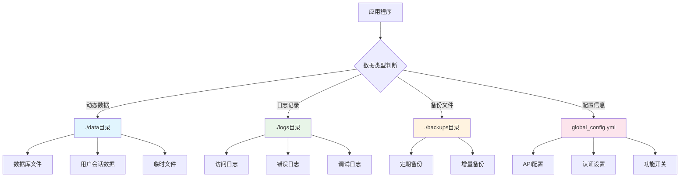
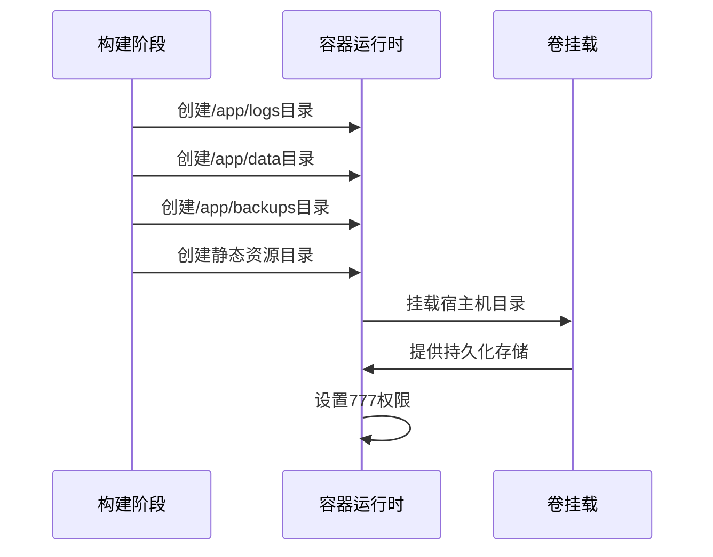
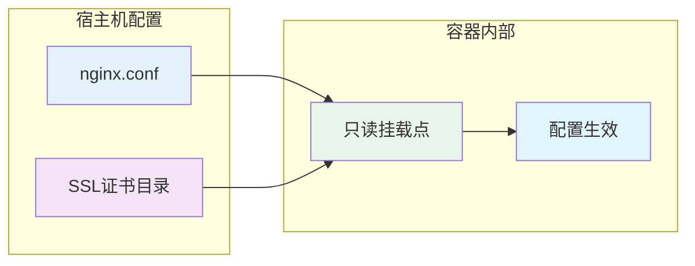
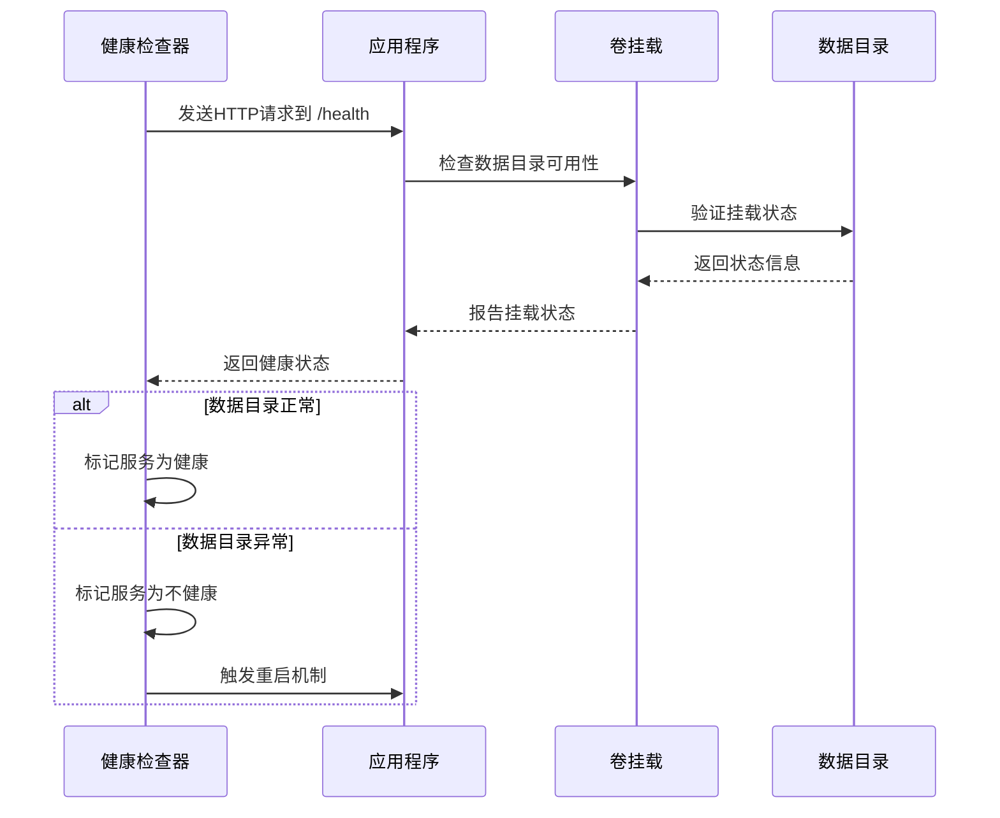
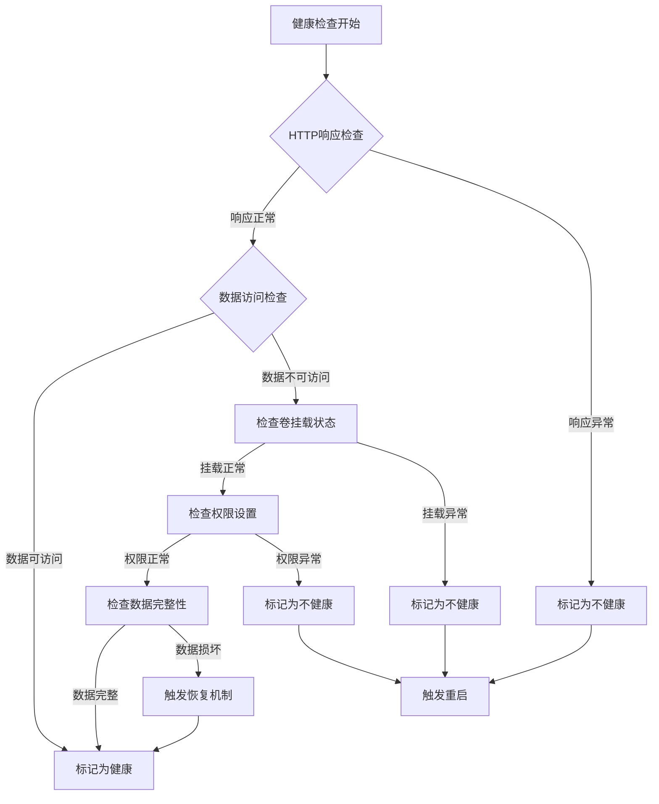
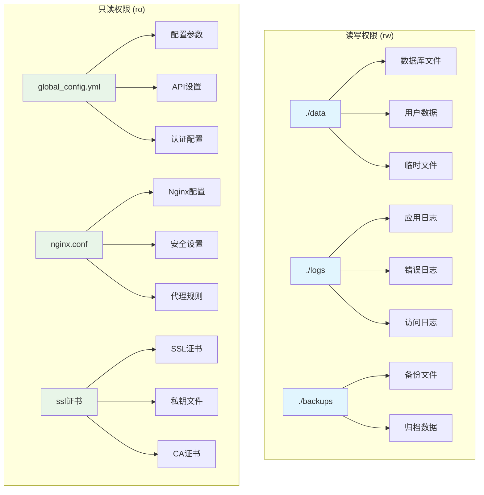

# 卷挂载配置

<cite>
**本文档引用的文件**
- [docker-compose.yml](file://docker-compose.yml)
- [docker-compose-cn.yml](file://docker-compose-cn.yml)
- [nginx/nginx.conf](file://nginx/nginx.conf)
- [Dockerfile](file://Dockerfile)
- [Dockerfile-cn](file://Dockerfile-cn)
- [global_config.yml](file://global_config.yml)
</cite>

## 目录
1. [概述](#概述)
2. [核心卷挂载配置](#核心卷挂载配置)
3. [数据持久化架构](#数据持久化架构)
4. [Nginx配置文件挂载](#nginx配置文件挂载)
5. [健康检查机制与卷挂载协同](#健康检查机制与卷挂载协同)
6. [权限控制与安全考虑](#权限控制与安全考虑)
7. [故障排除指南](#故障排除指南)
8. [最佳实践建议](#最佳实践建议)

## 概述

该系统采用Docker Compose进行容器编排，通过精心设计的卷挂载策略实现数据持久化、配置管理和安全隔离。卷挂载配置分为两个主要部分：宿主机目录到容器内部的映射，以及配置文件的只读挂载。

## 核心卷挂载配置

### 主应用服务卷挂载

系统在主应用服务中配置了三个关键的数据卷挂载点：

```mermaid
graph TB
subgraph "宿主机文件系统"
A[./data目录]
B[./logs目录]
C[./backups目录]
D[global_config.yml]
end
subgraph "容器内部"
E[/app/data<br/>数据存储目录]
F[/app/logs<br/>日志输出目录]
G[/app/backups<br/>备份存储目录]
H[/app/global_config.yml<br/>配置文件]
end
A --> E
B --> F
C --> G
D --> H
style A fill:#e1f5fe
style B fill:#e8f5e8
style C fill:#fff3e0
style D fill:#fce4ec
style E fill:#e1f5fe
style F fill:#e8f5e8
style G fill:#fff3e0
style H fill:#fce4ec
```

**图表来源**
- [docker-compose.yml](file://docker-compose.yml#L13-L21)
- [docker-compose-cn.yml](file://docker-compose-cn.yml#L13-L21)

#### 数据目录挂载（rw权限）

| 宿主机路径 | 容器路径 | 权限模式 | 用途描述 |
|-----------|---------|---------|----------|
| `./data` | `/app/data` | `rw` | 存储应用程序的核心数据文件，包括数据库文件、用户数据等 |
| `./logs` | `/app/logs` | `rw` | 输出应用程序的日志文件，便于监控和调试 |
| `./backups` | `/app/backups` | `rw` | 存储备份文件，支持数据恢复和迁移 |

#### 配置文件挂载（ro权限）

| 宿主机路径 | 容器路径 | 权限模式 | 用途描述 |
|-----------|---------|---------|----------|
| `./global_config.yml` | `/app/global_config.yml` | `ro` | 应用程序的主要配置文件，包含API端点、认证设置等 |

**章节来源**
- [docker-compose.yml](file://docker-compose.yml#L13-L21)
- [docker-compose-cn.yml](file://docker-compose-cn.yml#L13-L21)

### Nginx服务卷挂载

对于反向代理服务，系统配置了专门的SSL证书和配置文件挂载：

```mermaid
graph TB
subgraph "Nginx服务卷挂载"
A[./nginx/nginx.conf] --> B[/etc/nginx/nginx.conf:ro]
C[./nginx/ssl] --> D[/etc/nginx/ssl:ro]
end
subgraph "容器内部Nginx配置"
B --> E[Nginx主配置文件]
D --> F[SSL证书目录]
end
style A fill:#e3f2fd
style C fill:#f3e5f5
style B fill:#e3f2fd
style D fill:#f3e5f5
```

**图表来源**
- [docker-compose.yml](file://docker-compose.yml#L87-L89)
- [docker-compose-cn.yml](file://docker-compose-cn.yml#L87-L89)

**章节来源**
- [docker-compose.yml](file://docker-compose.yml#L87-L89)
- [docker-compose-cn.yml](file://docker-compose-cn.yml#L87-L89)

## 数据持久化架构

### 分层存储设计

系统采用分层的存储架构，确保不同类型的数据得到适当的管理：



### 自动目录创建机制

在Dockerfile中，系统已经预设了必要的目录结构和权限设置：



**图表来源**
- [Dockerfile](file://Dockerfile#L118-L121)
- [Dockerfile-cn](file://Dockerfile-cn#L125-L128)

**章节来源**
- [Dockerfile](file://Dockerfile#L118-L121)
- [Dockerfile-cn](file://Dockerfile-cn#L125-L128)

## Nginx配置文件挂载

### 配置文件安全性

Nginx配置文件采用只读挂载模式，确保配置的稳定性和安全性：



**图表来源**
- [nginx/nginx.conf](file://nginx/nginx.conf#L1-L124)

### SSL证书管理

SSL证书目录采用只读挂载，支持HTTPS配置：

| 挂载点 | 用途 | 安全级别 |
|--------|------|----------|
| `./nginx/ssl` | SSL证书和私钥 | 只读访问 |
| `/etc/nginx/ssl` | Nginx内部SSL路径 | 只读挂载 |

**章节来源**
- [nginx/nginx.conf](file://nginx/nginx.conf#L1-L124)
- [docker-compose.yml](file://docker-compose.yml#L88-L89)

## 健康检查机制与卷挂载协同

### 健康检查配置

系统配置了多层次的健康检查机制，确保服务在数据目录异常时能够正确响应：



**图表来源**
- [docker-compose.yml](file://docker-compose.yml#L63-L68)
- [Dockerfile](file://Dockerfile#L131-L134)

### 健康检查参数详解

| 参数 | 值 | 说明 |
|------|-----|------|
| `test` | `["CMD", "curl", "-f", "http://localhost:8080/health"]` | 使用curl检查健康端点 |
| `interval` | `30s` | 每30秒执行一次检查 |
| `timeout` | `10s` | 检查超时时间为10秒 |
| `retries` | `3` | 最多重试3次 |
| `start_period` | `40s` | 服务启动后40秒开始检查 |

### 数据目录异常检测

健康检查不仅验证应用程序本身的状态，还间接检测卷挂载的完整性：



**章节来源**
- [docker-compose.yml](file://docker-compose.yml#L63-L68)
- [Dockerfile](file://Dockerfile#L131-L134)

## 权限控制与安全考虑

### 权限模式详解

系统采用不同的权限模式来满足不同类型的文件访问需求：



### 安全最佳实践

#### 1. 配置文件只读保护

配置文件采用只读挂载模式，防止容器内意外修改：

- **目的**：确保配置的一致性和安全性
- **实现**：使用`:ro`权限模式
- **效果**：即使容器被攻破，配置也不会被篡改

#### 2. 数据目录读写分离

数据目录采用读写权限，但实施严格的访问控制：

- **目的**：支持应用程序正常运行
- **实现**：使用`:rw`权限模式
- **效果**：允许数据的正常读写操作

#### 3. SSL证书安全保护

SSL证书目录采用只读挂载，确保加密通信的安全性：

- **目的**：保护加密密钥不被泄露
- **实现**：使用`:ro`权限模式
- **效果**：防止证书文件被恶意修改或删除

**章节来源**
- [docker-compose.yml](file://docker-compose.yml#L15-L21)
- [docker-compose.yml](file://docker-compose.yml#L88-L89)

## 故障排除指南

### 常见挂载问题及解决方案

#### 1. SELinux上下文问题

**症状**：容器无法访问挂载的目录，出现权限拒绝错误

**解决方案**：
```bash
# 检查SELinux状态
sestatus

# 临时禁用SELinux（仅用于测试）
setenforce 0

# 或者为特定目录设置正确的上下文
chcon -Rt svirt_sandbox_file_t ./data
```

#### 2. Windows路径格式差异

**症状**：在Windows系统上运行时，路径格式导致挂载失败

**解决方案**：
```yaml
# 正确的路径格式
volumes:
  - ./data:/app/data:rw
  - ./logs:/app/logs:rw
  - ./backups:/app/backups:rw

# 避免使用Windows风格的绝对路径
# - C:\Users\user\data:/app/data:rw  # 错误示例
```

#### 3. 权限冲突问题

**症状**：容器内应用程序无法写入挂载目录

**诊断步骤**：
```bash
# 检查宿主机目录权限
ls -la ./data/

# 检查容器内权限
docker exec -it xianyu-auto-reply ls -la /app/data/

# 检查用户映射
docker inspect xianyu-auto-reply | grep -i user
```

**解决方案**：
```bash
# 修改宿主机目录权限
chmod -R 777 ./data ./logs ./backups

# 或者更改所有者
sudo chown -R 1000:1000 ./data ./logs ./backups
```

#### 4. 卷挂载失败

**症状**：容器启动时报告卷挂载失败

**诊断命令**：
```bash
# 检查卷挂载状态
docker-compose up -d
docker-compose logs xianyu-app

# 检查卷配置
docker volume ls
docker volume inspect xianyu-data
```

#### 5. 健康检查失败

**症状**：健康检查频繁失败，导致服务重启循环

**诊断步骤**：
```bash
# 检查容器状态
docker ps -a

# 查看健康检查日志
docker logs xianyu-auto-reply

# 手动测试健康端点
curl http://localhost:8080/health
```

### 排查工具和技巧

#### 1. 卷挂载状态检查

```bash
# 检查容器卷挂载
docker inspect xianyu-auto-reply | grep -A 20 "Mounts"

# 检查卷详细信息
docker volume inspect xianyu-data
```

#### 2. 权限问题诊断

```bash
# 检查宿主机权限
stat -c "%a %U:%G" ./data

# 检查容器内权限
docker exec xianyu-auto-reply stat -c "%a %U:%G" /app/data
```

#### 3. 网络连通性测试

```bash
# 测试容器间通信
docker exec xianyu-auto-reply curl -f http://localhost:8080/health

# 测试外部访问
curl -I http://localhost:8080/health
```

**章节来源**
- [docker-compose.yml](file://docker-compose.yml#L63-L68)
- [Dockerfile](file://Dockerfile#L131-L134)

## 最佳实践建议

### 1. 生产环境配置

#### 用户映射优化
```yaml
services:
  xianyu-app:
    user: "1000:1000"  # 使用非root用户
    # 其他配置...
```

#### 资源限制配置
```yaml
services:
  xianyu-app:
    deploy:
      resources:
        limits:
          memory: 2G
          cpus: '2.0'
        reservations:
          memory: 512M
          cpus: '0.5'
```

### 2. 备份策略

#### 自动备份脚本
```bash
#!/bin/bash
# 备份脚本示例
BACKUP_DIR="./backups/$(date +%Y%m%d_%H%M%S)"
mkdir -p $BACKUP_DIR

# 备份数据目录
cp -r ./data $BACKUP_DIR/

# 备份配置文件
cp global_config.yml $BACKUP_DIR/
```

#### 备份验证
```bash
# 验证备份完整性
tar -tf backup.tar.gz | head -10
```

### 3. 监控和日志

#### 健康检查监控
```bash
# 监控健康检查状态
watch -n 30 'curl -f http://localhost:8080/health || echo "Unhealthy"'
```

#### 日志分析
```bash
# 分析访问日志
tail -f ./logs/access.log | grep -E "(ERROR|WARNING)"

# 分析错误日志
tail -f ./logs/error.log | grep -E "(ERROR|CRITICAL)"
```

### 4. 安全加固

#### 文件权限设置
```bash
# 设置适当的文件权限
chmod 644 global_config.yml
chmod 755 ./data ./logs ./backups
chmod 600 ./nginx/ssl/*
```

#### 网络安全
```yaml
# 限制容器网络访问
networks:
  xianyu-network:
    driver: bridge
    internal: true
```

### 5. 性能优化

#### 存储性能
```yaml
# 使用本地驱动优化性能
volumes:
  xianyu-data:
    driver: local
    driver_opts:
      type: none
      o: bind
      device: /path/to/host/data
```

#### 内存优化
```yaml
services:
  xianyu-app:
    environment:
      - PYTHONUNBUFFERED=1
      - PYTHONDONTWRITEBYTECODE=1
    ulimits:
      nofile:
        soft: 65536
        hard: 65536
```

通过遵循这些最佳实践，可以确保系统的稳定性、安全性和可维护性，同时最大化性能表现。