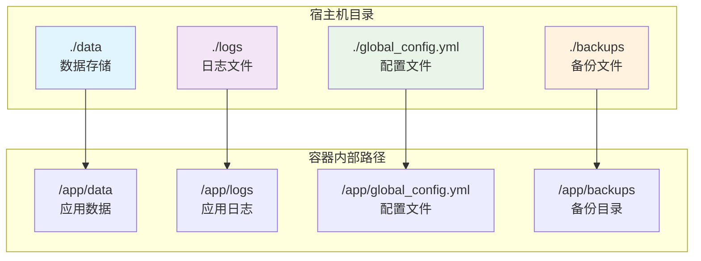
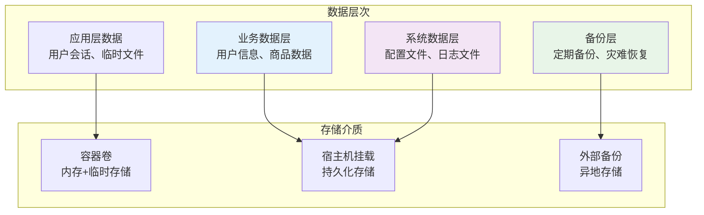
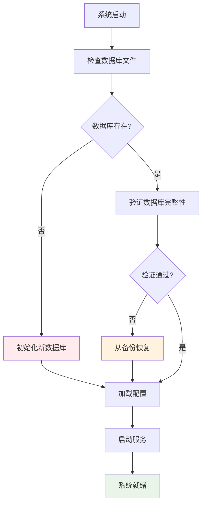

# 数据持久化策略

<cite>
**本文档引用的文件**
- [docker-compose.yml](file://docker-compose.yml)
- [docker-compose-cn.yml](file://docker-compose-cn.yml)
- [global_config.yml](file://global_config.yml)
- [db_manager.py](file://db_manager.py)
- [file_log_collector.py](file://file_log_collector.py)
- [reply_server.py](file://reply_server.py)
- [Start.py](file://Start.py)
- [README.md](file://README.md)
</cite>

## 目录
1. [简介](#简介)
2. [卷挂载策略概览](#卷挂载策略概览)
3. [核心数据目录分析](#核心数据目录分析)
4. [配置文件挂载详解](#配置文件挂载详解)
5. [本地卷驱动配置](#本地卷驱动配置)
6. [数据持久化架构](#数据持久化架构)
7. [系统稳定性保障](#系统稳定性保障)
8. [数据备份与恢复](#数据备份与恢复)
9. [最佳实践指南](#最佳实践指南)
10. [故障排除](#故障排除)

## 简介

本系统采用Docker容器化部署，通过精心设计的卷挂载策略实现数据持久化，确保关键业务数据、配置文件和日志信息的安全存储。数据持久化是系统稳定运行的基础，涉及数据库文件、用户配置、日志记录和备份文件等多个维度的存储管理。

## 卷挂载策略概览

系统在docker-compose.yml中定义了三个主要的卷挂载点，每个挂载点都承担着特定的数据持久化职责：



**图表来源**
- [docker-compose.yml](file://docker-compose.yml#L14-L21)

**章节来源**
- [docker-compose.yml](file://docker-compose.yml#L14-L21)

## 核心数据目录分析

### ./data目录 - 数据库文件存储

`./data`目录是系统的核心数据存储区域，通过读写权限挂载到容器内的`/app/data`路径：

- **数据库文件**: 主要存储SQLite数据库文件，包括用户数据、商品信息、关键词配置等
- **自动迁移**: 系统启动时自动检测并迁移旧的数据库文件到新的data目录结构
- **权限管理**: 读写权限确保应用能够正常创建、修改和删除数据库文件

### ./logs目录 - 日志文件管理

`./logs`目录用于存储应用程序产生的各种日志文件：

- **按日期分割**: 日志文件按照日期自动分割，便于管理和清理
- **实时收集**: 通过file_log_collector模块实现实时日志收集和监控
- **轮转策略**: 配置了合理的日志轮转和保留策略，平衡存储空间和历史记录需求

### ./backups目录 - 备份文件存储

`./backups`目录专门用于存储系统备份文件：

- **自动备份**: 系统定期自动创建数据库备份文件
- **手动备份**: 支持用户通过Web界面手动创建和下载备份
- **版本管理**: 备份文件按时间戳命名，便于版本管理和恢复

**章节来源**
- [docker-compose.yml](file://docker-compose.yml#L15-L21)
- [db_manager.py](file://db_manager.py#L25-L47)
- [file_log_collector.py](file://file_log_collector.py#L33-L49)

## 配置文件挂载详解

### global_config.yml只读挂载的重要性

系统将`./global_config.yml`配置文件以只读方式挂载到容器内：

```yaml
- ./global_config.yml:/app/global_config.yml:ro
```

这种设计具有重要的安全意义：

#### 配置安全保护
- **防止意外修改**: 只读挂载确保配置文件不会被应用进程意外修改
- **版本控制友好**: 支持Git等版本控制系统跟踪配置变更
- **一致性保证**: 所有容器实例使用相同的配置文件副本

#### 配置文件内容分析
global_config.yml包含系统的核心配置信息：

- **API端点配置**: WebSocket连接参数和API服务配置
- **自动回复设置**: 关键词匹配、AI回复等自动回复功能配置
- **日志配置**: 日志格式、级别、轮转策略等
- **安全设置**: CSRF保护、会话管理等安全相关配置

### 可选配置覆盖机制

系统还提供了可选的自定义配置挂载：

```yaml
# 可选：如果需要自定义配置
# - ./custom_config.yml:/app/global_config.yml:ro
```

这种设计允许用户在不修改原始配置文件的情况下，通过自定义配置文件进行个性化设置。

**章节来源**
- [docker-compose.yml](file://docker-compose.yml#L17-L19)
- [global_config.yml](file://global_config.yml#L1-L77)

## 本地卷驱动配置

### xianyu-data本地卷

```yaml
volumes:
  xianyu-data:
    driver: local
```

### xianyu-logs本地卷

```yaml
  xianyu-logs:
    driver: local
```

这两种本地卷驱动的使用体现了系统设计的考虑：

#### 本地卷的优势
- **性能优化**: 本地卷直接映射到宿主机文件系统，避免网络存储开销
- **简单可靠**: 不依赖外部存储服务，降低复杂性和故障风险
- **成本效益**: 无需额外的存储基础设施投入

#### 存储策略
- **数据卷分离**: 将应用数据和日志分别存储在不同的卷中
- **生命周期管理**: 卷的生命周期与容器绑定，便于管理和清理
- **备份便利**: 可以单独备份数据卷和日志卷

**章节来源**
- [docker-compose.yml](file://docker-compose.yml#L102-L105)

## 数据持久化架构

### 多层次数据保护

系统采用了多层次的数据保护策略：



### 数据流管理

系统中的数据流动遵循以下原则：

1. **写入保护**: 关键配置文件只读挂载，防止意外修改
2. **读写分离**: 数据库文件和日志文件采用读写权限，支持正常操作
3. **备份同步**: 自动备份机制确保数据的多重保护
4. **版本控制**: 备份文件包含时间戳，支持版本回溯

**章节来源**
- [db_manager.py](file://db_manager.py#L16-L65)
- [file_log_collector.py](file://file_log_collector.py#L15-L30)

## 系统稳定性保障

### 数据完整性保护

数据持久化策略确保了系统的稳定性和可靠性：

#### 数据库文件保护
- **事务支持**: SQLite数据库提供ACID特性，确保数据一致性
- **自动备份**: 定期自动创建数据库备份，防止数据丢失
- **完整性检查**: 启动时自动验证数据库文件完整性

#### 日志系统稳定性
- **异步写入**: 日志系统采用异步写入机制，避免阻塞主业务流程
- **缓冲管理**: 合理的日志缓冲策略，平衡性能和可靠性
- **轮转策略**: 自动日志轮转，防止磁盘空间耗尽

### 故障恢复能力

系统具备完善的故障恢复机制：



**图表来源**
- [Start.py](file://Start.py#L139-L144)
- [db_manager.py](file://db_manager.py#L66-L70)

**章节来源**
- [db_manager.py](file://db_manager.py#L66-L70)
- [Start.py](file://Start.py#L120-L144)

## 数据备份与恢复

### 自动备份机制

系统实现了完整的自动备份和恢复机制：

#### 备份策略
- **定时备份**: 系统定期自动创建数据库备份
- **增量备份**: 支持增量备份策略，减少存储空间占用
- **多版本保留**: 保留多个历史备份版本，支持不同时间点的恢复

#### 备份文件管理
- **命名规范**: 备份文件按`xianyu_data_backup_YYYYMMDD_HHMMSS.db`格式命名
- **目录结构**: 备份文件自动移动到`./backups`目录
- **文件验证**: 备份文件包含完整性校验信息

### 手动备份与恢复

系统提供了完整的Web界面备份管理功能：

#### 备份创建
- **Web界面**: 通过管理界面一键创建数据库备份
- **文件下载**: 支持将备份文件下载到本地
- **进度监控**: 实时显示备份进度和状态

#### 数据恢复
- **文件上传**: 支持通过Web界面上传备份文件
- **完整性验证**: 上传前验证备份文件的完整性和兼容性
- **原子操作**: 恢复过程采用原子操作，确保数据一致性
- **自动回滚**: 恢复失败时自动回滚到原始数据

### 备份最佳实践

#### 备份频率建议
- **生产环境**: 每小时创建一次增量备份，每天创建一次完整备份
- **开发环境**: 每天创建一次完整备份
- **测试环境**: 每次部署后创建备份

#### 备份存储策略
- **本地存储**: 保留最近7天的备份文件
- **远程备份**: 定期将备份文件同步到远程存储
- **异地备份**: 重要数据应有异地备份副本

**章节来源**
- [reply_server.py](file://reply_server.py#L5192-L5314)
- [db_manager.py](file://db_manager.py#L2222-L2246)

## 最佳实践指南

### 容器部署最佳实践

#### 卷挂载配置
```yaml
volumes:
  - ./data:/app/data:rw
  - ./logs:/app/logs:rw
  - ./global_config.yml:/app/global_config.yml:ro
  - ./backups:/app/backups:rw
```

#### 权限设置
- **目录权限**: 确保宿主机目录具有适当的读写权限
- **文件权限**: 配置正确的文件权限，避免权限问题
- **用户映射**: 正确配置容器内用户与宿主机用户的映射关系

### 数据管理最佳实践

#### 监控和告警
- **磁盘空间监控**: 监控宿主机磁盘空间使用情况
- **备份状态监控**: 监控自动备份任务的执行状态
- **日志轮转监控**: 确保日志轮转机制正常工作

#### 备份策略
- **定期验证**: 定期验证备份文件的可用性
- **异地存储**: 将备份文件存储在异地位置
- **恢复演练**: 定期进行数据恢复演练

### 安全最佳实践

#### 访问控制
- **最小权限原则**: 只授予必要的文件系统权限
- **网络安全**: 限制容器网络访问，防止未经授权的访问
- **审计日志**: 记录所有数据访问和修改操作

#### 数据保护
- **加密存储**: 对敏感数据进行加密存储
- **传输安全**: 使用安全的传输协议保护数据传输
- **定期审查**: 定期审查数据访问权限和安全策略

## 故障排除

### 常见问题及解决方案

#### 数据丢失问题
**症状**: 容器重启后数据消失
**原因**: 卷挂载配置错误或宿主机目录权限问题
**解决方案**: 
1. 检查docker-compose.yml中的卷挂载配置
2. 验证宿主机目录的读写权限
3. 确认容器内路径的正确性

#### 配置文件修改问题
**症状**: 配置文件被意外修改
**原因**: 配置文件挂载权限设置不当
**解决方案**:
1. 确保配置文件以只读方式挂载
2. 使用自定义配置文件替代原始配置文件
3. 建立配置变更的审批流程

#### 备份失败问题
**症状**: 自动备份任务失败
**原因**: 备份目录权限不足或磁盘空间不足
**解决方案**:
1. 检查备份目录的写入权限
2. 清理过期的备份文件释放空间
3. 调整备份策略，减少备份频率

### 性能优化建议

#### 存储性能优化
- **SSD存储**: 使用SSD存储提高I/O性能
- **RAID配置**: 对重要数据配置RAID提高可靠性
- **存储分层**: 将热数据和冷数据分层存储

#### 备份性能优化
- **并行备份**: 使用并行备份提高备份效率
- **压缩优化**: 合理配置备份文件压缩率
- **增量备份**: 优先使用增量备份减少存储空间

### 监控和维护

#### 关键指标监控
- **磁盘使用率**: 监控宿主机磁盘使用情况
- **备份成功率**: 监控自动备份任务的成功率
- **日志增长趋势**: 监控日志文件的增长趋势

#### 定期维护任务
- **清理过期备份**: 定期清理超过保留期的备份文件
- **验证备份完整性**: 定期验证备份文件的完整性
- **更新备份策略**: 根据业务发展调整备份策略

通过实施这些数据持久化策略和最佳实践，可以确保系统的稳定运行和数据的安全性，为业务的持续发展提供可靠的数据基础支撑。